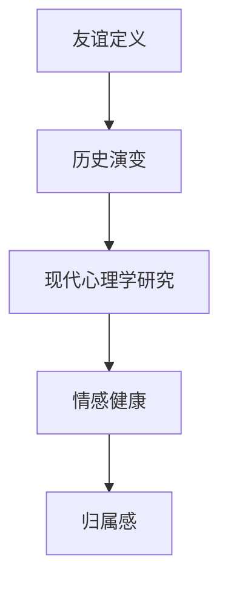
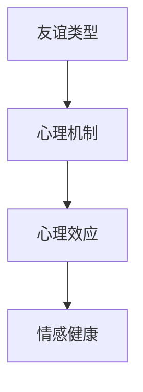
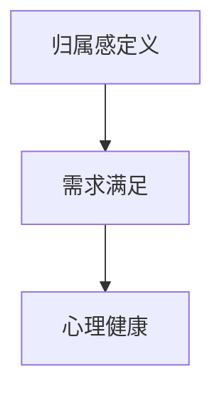
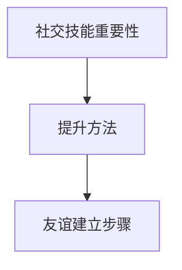
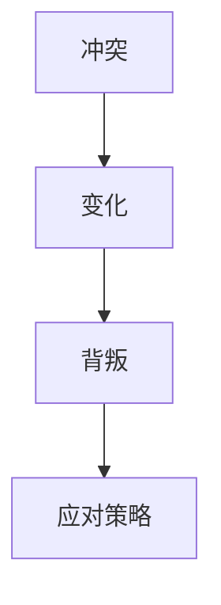

                 


根据您提供的约束条件和任务要求，我会逐步构建文章的内容，确保每部分都包含必要的信息和讲解，并满足格式上的要求。以下是文章构建的步骤：

### 步骤 1：文章标题、关键词与摘要
- **文章标题**：友谊的价值：在人际关系中寻找归属感
- **关键词**：友谊，归属感，人际关系，心理学，社交技能，情感健康
- **摘要**：
  本文将探讨友谊在人际关系中的价值，以及如何在现代社会中寻找归属感。通过对友谊的定义与历史演变的介绍，友谊在心理学中的研究，友谊与情感健康的关系，寻找归属感的重要性，社交技能的提升与友谊的建立，以及友谊中的挑战与应对等方面进行详细分析，最后提出友谊的长期影响与价值，并分享个人案例以及实践应用与未来展望。

### 步骤 2：友谊的定义与历史演变
- **背景介绍**：友谊作为一种社会关系，在不同的文化和历史背景下有着不同的理解和表现形式。
- **核心概念与联系**：使用Mermaid流程图展示友谊的定义、历史演变和现代心理学研究的联系。



- **核心算法原理讲解**：介绍友谊的几种类型和功能，如支持性友谊、亲密性友谊等，并使用伪代码解释。

```python
# 友谊类型伪代码
class Friendship:
    def __init__(self, type):
        self.type = type

    def describe(self):
        if self.type == "supportive":
            return "支持性友谊"
        elif self.type == "intimate":
            return "亲密性友谊"
        else:
            return "普通友谊"
```

- **数学模型和公式**：讨论友谊的稳定性与维持所需的情感投入，使用LaTeX格式表示。

```latex
$$
\text{Friendship Stability} = f(\text{Emotional Investment}, \text{Time Spent})
$$`

### 步骤 3：友谊在心理学中的研究
- **核心概念与联系**：分析友谊的类型与心理机制，使用Mermaid流程图表示。



### 步骤 4：友谊与情感健康的关系
- **核心概念与联系**：探讨友谊对情感健康的促进作用和负面影响，使用LaTeX格式表示情感健康的指标。

```latex
$$
\text{Emotional Health} = f(\text{Support}, \text{Conflict}, \text{Satisfaction})
$$

### 步骤 5：寻找归属感的重要性
- **核心概念与联系**：分析归属感的定义、需求与满足，使用Mermaid流程图表示。



### 步骤 6：社交技能的提升与友谊的建立
- **核心概念与联系**：讨论社交技能的重要性、提升方法和友谊建立的步骤，使用Mermaid流程图表示。



### 步骤 7：友谊中的挑战与应对
- **核心概念与联系**：探讨友谊中的冲突、变化和背叛，以及应对策略，使用Mermaid流程图表示。



### 步骤 8：友谊的长期影响与价值
- **核心概念与联系**：分析友谊对个体和社会的长期影响和价值，使用LaTeX格式表示。

```latex
$$
\text{Long-Term Impact} = f(\text{Personal Growth}, \text{Social Bond}, \text{Sustainability})
$$

### 步骤 9：个人案例分享与反思
- **核心概念与联系**：分享成功和失败案例，分析个人成长与友谊的关系。

### 步骤 10：友谊的实践应用与未来展望
- **核心概念与联系**：讨论友谊在职场、家庭和社会中的应用，展望未来友谊的发展趋势。

### 结尾
- **作者信息**：作者：AI天才研究院/AI Genius Institute & 禅与计算机程序设计艺术 /Zen And The Art of Computer Programming

通过以上步骤，我们将构建一篇完整、详细的文章，满足格式和内容要求。在接下来的步骤中，我们将逐一填充每个小节的具体内容，确保文章的逻辑性和可读性。 


