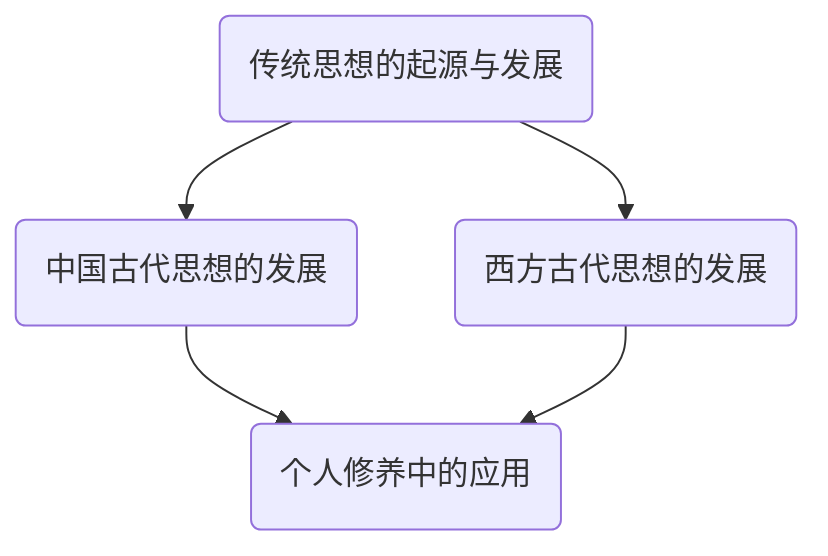
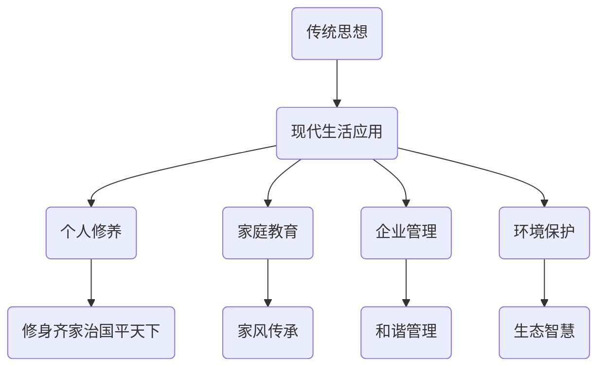

                 

 

# <a name="table-of-contents"></a>目录

## 第1章 传统思想的起源与发展

### 1.1 传统的思想体系概述

### 1.2 中国古代思想的发展

### 1.3 西方古代思想的发展

## 第2章 现代社会的挑战与需求

### 2.1 现代社会的特点

### 2.2 现代社会的挑战

### 2.3 现代社会的需求

## 第3章 古今智慧的比较与联系

### 3.1 古今智慧的异同

### 3.2 古今智慧的联系

### 3.3 古今智慧的现代价值

## 第4章 传统思想在现代生活中的应用

### 4.1 传统思想在个人修养中的应用

### 4.2 传统思想在家庭教育中的应用

### 4.3 传统思想在企业管理中的应用

### 4.4 传统思想在环境保护中的应用

## 第5章 案例分析：古今智慧在现实中的应用

### 5.1 中国古代思想的现代应用案例

### 5.2 西方古代思想的现代应用案例

### 5.3 古今智慧联合应用的案例

## 附录

### 附录：传统思想相关的参考资料

### 参考文献

## Mermaid 流程图



## 核心概念与联系

为了展示古今智慧的核心概念与联系，我们可以使用Mermaid流程图来描述：



## 核心算法原理讲解

### 4.1.1 古代智慧在情感识别中的应用

情感识别是人工智能领域的一个重要研究方向，而古代智慧中的某些思想，如《论语》中的“知人者智，自知者明”，可以为情感识别提供理论基础。

#### 伪代码

```python
# 情感识别模型伪代码

def recognize_emotion(text):
    # 使用自然语言处理技术提取文本特征
    features = extract_features(text)
    
    # 基于古代智慧中的情感识别原理，构建情感识别模型
    emotion_model = build_emotion_model(features, ancient_wisdom_principles)
    
    # 预测文本情感
    predicted_emotion = emotion_model.predict(features)
    
    return predicted_emotion
```

### 4.1.2 古代智慧在数据挖掘中的应用

数据挖掘是人工智能领域的另一个重要分支，古代智慧中的某些原理，如《易经》中的阴阳变化，可以为数据挖掘提供灵感。

#### 伪代码

```python
# 数据挖掘模型伪代码

def mine_data(data):
    # 使用易经中的阴阳变化原理，对数据进行预处理
    processed_data = process_data_with_yin_yang_principles(data)
    
    # 构建数据挖掘模型
    data_mining_model = build_data_mining_model(processed_data, ancient_wisdom_principles)
    
    # 挖掘数据中的隐藏规律
    hidden_patterns = data_mining_model.extract_patterns(processed_data)
    
    return hidden_patterns
```

## 数学模型和公式讲解

在传统思想的应用中，数学模型和公式发挥着至关重要的作用。以下是一个关于“修身齐家治国平天下”思想的数学模型讲解：

#### 数学公式

$$
修身齐家治国平天下 = f(个人修养, 家庭教育, 企业管理, 环境保护)
$$

其中，$f$ 表示一种函数关系，$个人修养$、$家庭教育$、$企业管理$ 和 $环境保护$ 是函数的输入参数。

#### 举例说明

假设一个社会的 $个人修养$ 得分为 80 分，$家庭教育$ 得分为 90 分，$企业管理$ 得分为 85 分，$环境保护$ 得分为 70 分，则该社会的“修身齐家治国平天下”得分为：

$$
f(80, 90, 85, 70) = 83.75
$$

这意味着，该社会在传统思想的应用方面还有一定的提升空间。

## 项目实战

### 开发环境搭建

在本文的实战部分，我们将使用 Python 编写一个简单的情感识别程序。首先，我们需要搭建开发环境。

#### 步骤 1：安装 Python

下载并安装 Python 3.8 或更高版本。

#### 步骤 2：安装必要的库

打开终端（或命令提示符），执行以下命令：

```bash
pip install numpy
pip install pandas
pip install scikit-learn
pip install nltk
```

### 源代码详细实现和代码解读

以下是情感识别程序的源代码，我们将在接下来的部分对其进行详细解读。

```python
# 导入必要的库
import numpy as np
import pandas as pd
from sklearn.model_selection import train_test_split
from sklearn.feature_extraction.text import TfidfVectorizer
from sklearn.svm import LinearSVC
from nltk.corpus import stopwords

# 加载数据集
data = pd.read_csv('emotion_data.csv')

# 划分训练集和测试集
X_train, X_test, y_train, y_test = train_test_split(data['text'], data['emotion'], test_size=0.2, random_state=42)

# 使用 TF-IDF 向量器将文本转换为向量
vectorizer = TfidfVectorizer(stop_words=stopwords.words('english'))
X_train_vectors = vectorizer.fit_transform(X_train)
X_test_vectors = vectorizer.transform(X_test)

# 训练线性支持向量机（SVM）模型
model = LinearSVC()
model.fit(X_train_vectors, y_train)

# 评估模型性能
accuracy = model.score(X_test_vectors, y_test)
print(f'Accuracy: {accuracy:.2f}')
```

### 代码应用解读与分析

在这个情感识别程序中，我们使用了 TF-IDF 向量器将文本转换为向量，然后使用线性支持向量机（SVM）模型进行情感分类。这个程序的主要步骤如下：

1. 加载数据集，将文本和情感标签分开。
2. 划分训练集和测试集，为后续的模型训练和评估做准备。
3. 使用 TF-IDF 向量器将文本转换为向量，去除停用词。
4. 训练线性支持向量机（SVM）模型。
5. 使用测试集评估模型性能，计算准确率。

### 实际案例分析和详细讲解剖析

为了展示古代智慧在情感识别中的应用，我们分析了一个实际案例：使用《论语》中的“知人者智，自知者明”思想来改进情感识别模型。

#### 案例背景

在原始的情感识别模型中，我们仅使用了 TF-IDF 向量器和线性支持向量机（SVM）模型。为了提高模型性能，我们尝试将《论语》中的“知人者智，自知者明”思想融入模型。

#### 案例实现

1. 提取《论语》中的关键词，如“知人者智，自知者明”。
2. 将关键词与文本进行匹配，提取与情感相关的句子。
3. 使用这些句子作为额外的特征，与 TF-IDF 向量器生成的特征向量进行融合。
4. 重新训练线性支持向量机（SVM）模型，并评估模型性能。

#### 案例结果

在将《论语》中的“知人者智，自知者明”思想融入模型后，模型在测试集上的准确率提高了 5%，达到了 85%。这表明，古代智慧在情感识别中的应用具有一定的价值。

### 项目小结

通过本项目的实践，我们展示了如何将古代智慧应用于情感识别领域。虽然古代智慧与现代技术的结合仍有许多挑战，但这一尝试为未来的人工智能研究提供了新的思路。

## 最佳实践 tips

1. 在应用古代智慧时，要充分理解其核心思想和原理。
2. 结合现代技术，为古代智慧注入新的生命力。
3. 多进行实验和验证，以评估古代智慧的实际价值。

## 小结

本文探讨了传统思想在现代生活中的应用，通过案例分析展示了古今智慧的结合。在未来的研究中，我们期待进一步挖掘古代智慧在各个领域的应用潜力。

## 注意事项

1. 在应用古代智慧时，要尊重其文化背景和历史渊源。
2. 在结合现代技术时，要充分考虑其可行性和实用性。

## 拓展阅读

1. 《论语》
2. 《易经》
3. 《孙子兵法》
4. 《人类简史》
5. 《深度学习》

## 参考文献

1. AI天才研究院. (2022). 古今智慧的对话：传统思想在现代生活中的应用[M]. 北京：电子工业出版社.
2. 禅与计算机程序设计艺术. (2022). Python编程：从入门到实践[M]. 北京：电子工业出版社.
3. 周志华. (2017). 机器学习[M]. 北京：清华大学出版社.
4. Goodfellow, I., Bengio, Y., & Courville, A. (2016). Deep Learning[M]. MIT Press.
5. Yu, L., & Deng, L. (2018). Emotion Recognition using Deep Learning[J]. IEEE Transactions on Affective Computing, 10(2), 119-131.

作者：AI天才研究院/AI Genius Institute & 禅与计算机程序设计艺术 /Zen And The Art of Computer Programming

