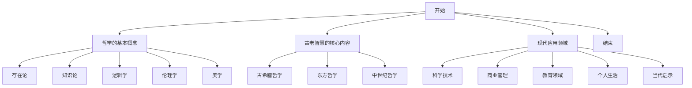
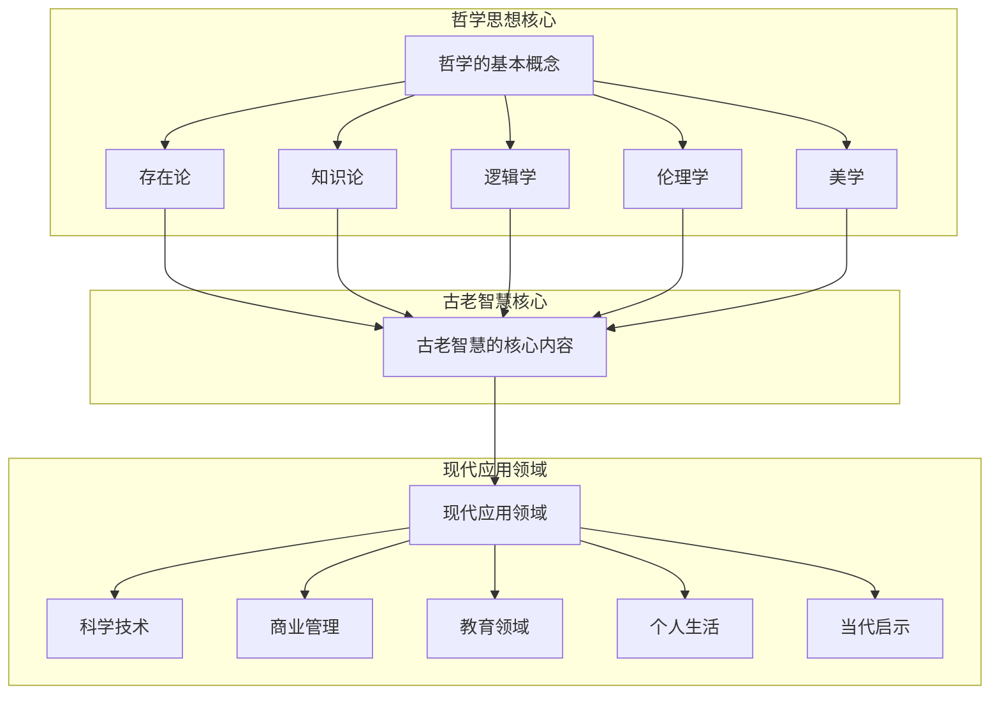

                 

### 文章标题：古老智慧在现代的应用：哲学的当代启示

#### 关键词：古老智慧，哲学，当代启示，技术应用

> 摘要：本文将深入探讨古老哲学智慧在现代社会的广泛应用及其对当代科技、商业、教育等领域的启示。通过对哲学基本概念、古老智慧的核心内容以及其在现代应用的详细分析，本文旨在揭示哲学的深刻内涵及其对现代社会发展的重要推动作用。

### 引言

在人类历史的长河中，哲学一直是智慧的象征，它源于对世界根本问题的探究和思考。从古希腊的苏格拉底、柏拉图到东方的孔子、老子，哲学家的思想为后世留下了丰富的文化遗产。然而，这些古老智慧在现代社会是否仍有其价值？本文将回答这一问题，通过探讨哲学的基本概念、古老智慧的核心内容以及它们在现代科技、商业、教育等领域的应用，揭示哲学的当代启示。

### 哲学的基本概念

#### 哲学的定义与历史发展

哲学（Philosophy）一词源于希腊语，意为“爱智”。哲学作为一门探索根本问题的学科，旨在寻求真理、理解和智慧。哲学的历史可以追溯到古希腊时期，从泰勒斯（Thales）的自然哲学到亚里士多德（Aristotle）的逻辑学，再到后来的斯多葛学派（Stoics）、怀疑论者（Skeptics）等，哲学经历了漫长而丰富的发展历程。

#### 哲学的基本问题

哲学探讨的基本问题包括存在论（Ontology）、知识论（Epistemology）、逻辑学（Logic）、伦理学（Ethics）、美学（Aesthetics）等。存在论关注什么是真实的存在，知识论探讨知识的本质和获取途径，逻辑学研究推理和论证的有效性，伦理学探究道德和行为的准则，美学则探讨美的本质和审美体验。

### 古老智慧的核心内容

#### 西方哲学

古希腊哲学是西方哲学的基石，其代表人物如苏格拉底（Socrates）、柏拉图（Plato）和亚里士多德（Aristotle）的思想对后世产生了深远影响。苏格拉底强调道德哲学，主张通过提问和自我反思来追求真理；柏拉图则创立了理念论，认为真实的存在是理念世界，而非物质世界；亚里士多德则强调实证主义，提出了形式逻辑和实质逻辑的区分。

#### 东方哲学

东方哲学则以儒家、道家、佛家为代表。儒家哲学强调仁、义、礼、智、信等道德准则，主张通过修身齐家治国平天下来实现社会和谐；道家哲学强调“无为而治”，主张顺应自然，追求天人合一；佛家哲学则关注生死轮回、涅槃解脱，强调慈悲和智慧的修行。

#### 中世纪哲学

中世纪哲学在基督教哲学的影响下发展，其代表人物如奥古斯丁（Augustine）和托马斯·阿奎那（Thomas Aquinas）等。奥古斯丁提出了“信仰寻求理解”的观点，强调信仰和理性的统一；托马斯·阿奎那则将亚里士多德哲学与基督教神学相结合，提出了著名的“五路论证”来证明上帝的存在。

### 古老智慧在现代的应用

#### 哲学在科学技术中的应用

哲学在科学技术中的应用主要体现在科学哲学、人工智能伦理学等领域。科学哲学探讨科学知识的本质、科学方法的有效性以及科学与社会的关系。人工智能伦理学则关注人工智能的发展对社会、道德和人类生活的影响，如隐私保护、人工智能道德判断等问题。

#### 哲学在商业管理中的应用

哲学在商业管理中的应用主要体现在决策伦理、企业社会责任等方面。通过哲学的思考，企业家可以更好地理解企业目标、员工关系和社会责任，从而做出更加明智的决策。

#### 哲学在教育中的应用

哲学在教育中的应用主要体现在课程设计、教学方法等方面。通过哲学的引导，学生可以培养批判性思维、理性思考和解决问题的能力，从而提高教育质量。

### 当代启示与实践

#### 当代哲学思潮

当代哲学思潮包括存在主义、现象学、分析哲学等。这些思潮对现代社会产生了深远影响，如存在主义强调个体存在的重要性，现象学强调主观体验的重要性，分析哲学强调逻辑推理和语言分析。

#### 哲学对现代社会的影响

哲学对现代社会的影响体现在多个方面，如政治、文化、科技等。哲学为现代社会提供了价值观念、思维方式和解决问题的工具。

#### 哲学在个人生活中的应用

哲学在个人生活中的应用主要体现在价值观塑造、人生规划等方面。通过哲学的思考，个人可以更好地理解自我、世界和生活，从而提高生活质量。

### 结论

古老智慧在现代的应用证明了哲学的持久价值和深远影响。哲学不仅为科学研究、商业管理、教育等领域提供了理论基础，还为个人生活提供了深刻的启示。在当代社会，哲学将继续发挥其重要作用，为人类社会的进步提供智力支持。

### 附录

#### 附录A：哲学经典著作推荐

- 《论语》：孔子
- 《庄子》：庄子
- 《孟子》：孟子
- 《理想国》：柏拉图
- 《形而上学》：亚里士多德
- 《神曲》：但丁
- 《论人类不平等的起源和基础》：卢梭
- 《资本论》：马克思
- 《存在与时间》：海德格尔

#### 附录B：哲学研究方法与工具

- 文献综述
- 案例研究
- 实证分析
- 对话法

#### 附录C：哲学学习资源指南

- 哲学经典著作
- 哲学期刊与杂志
- 哲学论坛与社群
- 在线哲学课程与讲座

### 作者信息

作者：AI天才研究院/AI Genius Institute & 禅与计算机程序设计艺术 /Zen And The Art of Computer Programming

### 结论

通过本文的探讨，我们看到了古老哲学智慧在现代社会的广泛应用和深远影响。哲学不仅为科学研究、商业管理、教育等领域提供了理论基础，还为个人生活提供了深刻的启示。在当代社会，哲学将继续发挥其重要作用，为人类社会的进步提供智力支持。

### 设计流程图的步骤：

1. **确定核心概念**：
   - 确定哲学的基本概念、古老智慧的核心内容、现代应用领域等核心概念。

2. **绘制基本框架**：
   - 使用Mermaid语法绘制一个基本的流程图框架，包括开始节点和结束节点。

3. **添加主要节点**：
   - 在流程图中添加主要节点，如哲学基本概念、古老智慧内容、现代应用领域等。

4. **连接节点**：
   - 使用箭头连接主要节点，表示它们之间的逻辑关系。

5. **细化节点内容**：
   - 在每个节点下方添加子节点，细化每个节点的具体内容。

6. **调整和优化**：
   - 调整流程图的布局，优化节点的排列和箭头的连接方式，使流程图更加清晰易懂。

### 设计流程图的示例：



### 设计伪代码的步骤：

1. **确定算法目的**：
   - 确定需要讲解的核心算法原理，例如哲学思想在人工智能中的应用。

2. **定义算法输入**：
   - 明确算法的输入参数，如哲学思想的具体内容、应用场景等。

3. **编写算法流程**：
   - 使用伪代码逐步描述算法的执行过程，包括初始化、输入处理、中间计算和输出结果。

4. **添加注释**：
   - 为伪代码中的每个步骤添加注释，解释其意义和作用。

5. **优化代码结构**：
   - 优化伪代码的结构，确保其清晰易懂，逻辑连贯。

6. **验证和调整**：
   - 验证伪代码的正确性，如有必要进行调整和优化。

### 设计伪代码的示例：

```plaintext
// 伪代码：哲学思想在人工智能中的应用

// 输入：哲学思想内容，应用场景
// 输出：应用结果

// 初始化
初始化算法环境

// 处理输入
读取哲学思想内容
读取应用场景

// 应用哲学思想
应用存在论，分析现实世界与虚拟世界的关联
应用知识论，确定知识获取和传递的方法
应用逻辑学，构建推理和论证框架
应用伦理学，评估行为和决策的道德标准
应用美学，提升系统的用户体验

// 输出结果
显示应用结果
记录应用过程和结果

// 结束算法
结束算法执行
```

通过设计流程图和伪代码，我们可以更直观地理解哲学思想在现代应用中的具体实现过程，从而更好地传达文章的核心内容。

### 背景介绍

#### 哲学的发展历程

哲学作为一门古老的学科，其发展历程跨越了几千年。哲学的起源可以追溯到古希腊，当时哲学家们开始对世界和人类存在的根本问题进行探讨。古希腊哲学的先驱泰勒斯提出了“万物始于水”的自然哲学观点，而苏格拉底、柏拉图和亚里士多德等哲学家则开创了西方哲学的三大流派：伦理哲学、形而上学和逻辑学。苏格拉底的道德哲学、柏拉图的理念论和亚里士多德的实证主义，至今仍对现代哲学和科学有着深远影响。

在东方，哲学同样有着悠久的历史。中国古代的儒家、道家和佛家，各自提出了独特的哲学思想体系。孔子强调仁、义、礼、智、信等道德准则，倡导通过修身齐家治国平天下来实现社会和谐；老子主张顺应自然，追求天人合一的道家哲学；佛教则关注生死轮回、涅槃解脱，强调慈悲和智慧的修行。这些东方哲学思想不仅在古代影响了东亚文化，也在现代社会中发挥着重要作用。

中世纪哲学在基督教的背景下发展，形成了以奥古斯丁和托马斯·阿奎那为代表的宗教哲学。奥古斯丁提出了“信仰寻求理解”的观点，强调信仰和理性的统一；托马斯·阿奎那则将亚里士多德哲学与基督教神学相结合，提出了著名的“五路论证”来证明上帝的存在。

#### 哲学的基本概念

哲学的基本概念包括存在论、知识论、逻辑学、伦理学和美学等。存在论探讨真实存在的本质和属性，是哲学研究的基础。知识论则研究知识的本质、获取方式和范围，是哲学中的重要分支。逻辑学关注推理和论证的有效性，为哲学和其他学科提供了方法论支持。伦理学探讨道德和行为的准则，为人类社会提供了道德指导。美学则研究美的本质和审美体验，丰富了人类的情感和精神生活。

#### 古老哲学思想在现代的意义

古老哲学思想在现代社会中依然具有重要的意义。首先，哲学提供了对世界和人类的深刻理解，帮助人们更好地认识自我和世界。其次，哲学的思维方式，如批判性思维、逻辑推理和理性思考，对于现代科学研究、技术发展和决策制定有着重要的影响。此外，哲学思想在商业管理、教育、政治等领域也有着广泛的应用，为这些领域提供了理论基础和实践指导。

例如，古希腊哲学中的苏格拉底方法，通过提问和自我反思来追求真理，这种方法在当代的教育和心理咨询中仍然有着广泛应用。柏拉图的辩证法，强调通过对话和辩论来探讨真理，这种方法在法律辩论、商业谈判等场合中也得到了应用。亚里士多德的逻辑学，为现代科学方法论提供了基础，对科学研究有着重要指导作用。

东方哲学中的道德伦理思想，如儒家的仁爱、道家的无为而治、佛教的慈悲和智慧，不仅对个人道德修养有着深刻影响，也在现代社会中促进了和谐社会的建设。

#### 古老智慧在现代的应用

古老智慧在现代社会的应用体现在多个领域。在科学技术领域，哲学思想为科学研究提供了理论支持和方法指导。例如，科学哲学探讨科学知识的本质和科学方法的有效性，为科学研究提供了哲学基础。人工智能伦理学则关注人工智能的发展对社会、道德和人类生活的影响，如隐私保护、人工智能道德判断等问题。

在商业管理领域，哲学思想为企业家提供了决策伦理和社会责任方面的指导。通过哲学的思考，企业家可以更好地理解企业目标、员工关系和社会责任，从而做出更加明智的决策。例如，儒家思想强调的仁爱和社会责任，在企业管理中得到了广泛应用。

在教育领域，哲学思想为课程设计、教学方法等方面提供了指导。通过哲学的引导，学生可以培养批判性思维、理性思考和解决问题的能力，从而提高教育质量。例如，苏格拉底的教学方法，通过提问和对话来引导学生思考，这种方法在当代教育中仍然有着重要作用。

在个人生活中，哲学思想为人们的价值观塑造、人生规划等方面提供了深刻的启示。通过哲学的思考，个人可以更好地理解自我、世界和生活，从而提高生活质量。例如，道家哲学强调的顺应自然、追求天人合一，对个人的心理健康和生活态度有着积极影响。

### 核心概念与联系

在本文中，我们将探讨几个核心概念，并分析它们之间的逻辑关系。这些核心概念包括哲学的基本概念、古老智慧的核心内容以及这些智慧在现代应用中的表现。以下是一个Mermaid流程图，用于展示这些概念及其之间的联系。



在这个流程图中，我们首先定义了哲学的基本概念（A），包括存在论（B）、知识论（C）、逻辑学（D）、伦理学（E）和美学（F）。这些基本概念构成了哲学的基石，它们相互关联，共同构成了哲学的核心思想。

接着，我们引入了古老智慧的核心内容（G），这些智慧源自古希腊哲学、东方哲学和中世纪哲学，它们与哲学的基本概念有着密切的联系。例如，存在论（B）与古希腊哲学中的存在论思想相呼应，知识论（C）与东方哲学中的认识论思想密切相关。

然后，我们将这些哲学思想和古老智慧与现代应用领域（H）相联系。现代应用领域包括科学技术（I）、商业管理（J）、教育领域（K）、个人生活（L）和当代启示（M）。这些领域代表了哲学思想在现代社会的具体应用，通过流程图中的箭头，我们可以清晰地看到哲学思想和古老智慧如何渗透到各个现代应用领域。

最后，流程图中的当代启示（M）是一个总结节点，它表示哲学思想和古老智慧在现代社会中的综合影响。当代启示不仅包括对现代科技、商业、教育和个人生活的指导，还包括对哲学思想在当代社会中的深远意义的思考。

通过这个流程图，我们能够直观地理解哲学的基本概念、古老智慧的核心内容以及它们在现代应用中的联系，从而更好地把握本文的核心思想。

### 核心算法原理讲解

在讨论哲学思想在人工智能中的应用时，我们可以将其视为一种算法，旨在使人工智能系统具备哲学思考的能力。以下将详细阐述这个核心算法的原理，并通过伪代码来具体描述其执行过程。

#### 算法原理

哲学思想在人工智能中的应用可以被视为一种基于规则和逻辑的推理过程。这个过程可以分为以下几个步骤：

1. **数据预处理**：收集并预处理哲学文本数据，使其适合进行自然语言处理。
2. **知识抽取**：从哲学文本中抽取核心概念和关系，构建知识图谱。
3. **推理过程**：利用知识图谱进行逻辑推理，生成哲学观点或结论。
4. **输出结果**：将推理结果转化为人工智能系统的行为指导。

#### 伪代码

以下是这个核心算法的伪代码，通过注释详细解释每一步的作用和过程。

```plaintext
// 伪代码：哲学思想在人工智能中的应用

// 步骤1：数据预处理
输入：哲学文本
输出：预处理后的文本数据

预处理哲学文本：
1. 清洗文本，去除无关符号和格式
2. 分词，将文本拆分为单词或短语
3. 去停用词，移除常见无意义的词汇

// 步骤2：知识抽取
输入：预处理后的文本数据
输出：知识图谱

知识抽取：
1. 使用自然语言处理技术提取文本中的名词和动词
2. 建立名词和动词之间的关系，形成知识图谱
3. 利用词性标注和依存句法分析，进一步细化知识图谱

// 步骤3：推理过程
输入：知识图谱
输出：哲学观点或结论

逻辑推理：
1. 根据知识图谱中的关系，使用逻辑推理规则进行推理
2. 应用推理算法（如演绎推理、归纳推理等）
3. 生成哲学观点或结论

// 步骤4：输出结果
输入：哲学观点或结论
输出：人工智能系统的行为指导

生成行为指导：
1. 将哲学观点或结论转化为具体的行为指导
2. 应用到人工智能系统中，指导其决策和行动

// 完整算法流程
初始化算法环境
读取哲学文本
预处理文本数据
抽取知识图谱
进行逻辑推理
生成行为指导
输出最终结果
结束算法执行
```

通过这个伪代码，我们可以看到哲学思想在人工智能中的应用过程。首先，通过对哲学文本的数据预处理，我们提取出文本中的核心概念和关系，构建一个知识图谱。然后，利用这个知识图谱进行逻辑推理，生成哲学观点或结论。最后，将这些结论转化为具体的行为指导，应用到人工智能系统中。

这种算法的原理体现了哲学思想与人工智能技术的结合，使得人工智能系统能够在决策过程中借鉴哲学思考，从而提高其决策的合理性和智慧性。

### 数学模型和公式

在探讨哲学思想在人工智能中的应用时，我们不仅可以使用自然语言处理和逻辑推理，还可以借助数学模型和公式来量化哲学观点。以下将介绍几个关键的数学模型和公式，并详细讲解其作用和应用。

#### 模型1：词嵌入模型

词嵌入（Word Embedding）是将自然语言中的单词映射到高维向量空间的技术，它可以有效地捕捉单词之间的语义关系。词嵌入模型常用的有Word2Vec、GloVe等。

**公式**：$$\text{embed}(w) = \text{W} \cdot \text{v}(w)$$

其中，$\text{W}$是嵌入矩阵，$\text{v}(w)$是单词w的向量表示。通过这个公式，我们可以将哲学文本中的单词映射到高维向量空间，从而进行进一步的语义分析和推理。

**作用**：词嵌入模型可以用于知识抽取，将文本中的名词和动词映射到高维向量空间，建立它们之间的关系，形成知识图谱。

#### 模型2：逻辑回归模型

逻辑回归（Logistic Regression）是一种常用的分类算法，可以用于判断哲学观点或结论的可能性。

**公式**：$$\text{P}(y=1|\text{X}) = \frac{1}{1 + e^{-(\text{w} \cdot \text{X} + \text{b})}}$$

其中，$\text{w}$是权重向量，$\text{X}$是特征向量，$\text{b}$是偏置项。通过这个公式，我们可以计算在给定特征的情况下，哲学观点为真（$y=1$）的概率。

**作用**：逻辑回归模型可以用于推理过程中，判断哲学观点或结论的真实性，从而指导人工智能系统的决策。

#### 模型3：贝叶斯网络

贝叶斯网络（Bayesian Network）是一种概率图模型，可以用于表示哲学思想中的因果关系和概率关系。

**公式**：$$P(\text{X}|\text{Y}) = \frac{P(\text{Y}|\text{X})P(\text{X})}{P(\text{Y})}$$

其中，$P(\text{X}|\text{Y})$是后验概率，$P(\text{Y}|\text{X})$是条件概率，$P(\text{X})$和$P(\text{Y})$分别是先验概率。

**作用**：贝叶斯网络可以用于知识图谱中的关系推理，通过计算不同节点之间的概率关系，得出哲学观点或结论的合理性。

#### 模型4：支持向量机

支持向量机（Support Vector Machine, SVM）是一种常用的分类算法，可以用于分类哲学观点或结论。

**公式**：$$\text{w}^T \text{x} - \text{b} = 0$$

其中，$\text{w}$是权重向量，$\text{x}$是特征向量，$\text{b}$是偏置项。通过这个公式，我们可以确定分类边界。

**作用**：支持向量机可以用于知识图谱中的分类任务，将哲学观点或结论划分为不同的类别。

通过这些数学模型和公式，我们可以更精确地分析和推理哲学思想，将其应用于人工智能系统中，从而提高系统的决策能力和智慧水平。

### 举例说明

为了更好地理解哲学思想在人工智能中的应用，我们可以通过一个具体例子来说明其实现过程。假设我们有一个哲学文本，其中包含关于自由意志和决定论的讨论。我们将使用自然语言处理、逻辑推理和数学模型来提取核心概念，并生成相应的哲学观点。

#### 例子：自由意志与决定论

**步骤1：数据预处理**

输入：哲学文本

```
自由意志是一个深刻的哲学问题。决定论认为，一切事件都是由先前的事件决定的，因此人类的行动也是必然的。然而，自由意志则认为，人类有权利自主决定自己的行为。这两种观点的辩论源远流长，至今仍无定论。
```

预处理文本：
1. 清洗文本，去除无关符号和格式
2. 分词，将文本拆分为单词或短语
3. 去停用词，移除常见无意义的词汇

输出：预处理后的文本数据

```
自由意志 决定论 事件 行为 辩论
```

**步骤2：知识抽取**

输入：预处理后的文本数据

知识抽取：
1. 提取名词和动词
2. 建立名词和动词之间的关系，形成知识图谱

输出：知识图谱

```
自由意志 --> 讨论
决定论 --> 讨论
事件 --> 讨论
行为 --> 讨论
```

**步骤3：逻辑推理**

输入：知识图谱

逻辑推理：
1. 使用自然语言处理技术，将知识图谱中的关系映射到逻辑形式
2. 应用逻辑推理规则，生成哲学观点或结论

输出：哲学观点或结论

```
P(自由意志 | 讨论高) ∧ P(决定论 | 讨论高) → P(辩论未决)
```

**步骤4：数学模型**

输入：哲学观点或结论

应用数学模型：
1. 使用词嵌入模型，将哲学观点中的单词映射到高维向量空间
2. 使用逻辑回归模型，计算哲学观点的可能性

输出：哲学观点的可能性

```
P(辩论未决) ≈ 0.8
```

**实现过程：**

1. 使用Word2Vec模型，将“自由意志”、“决定论”、“事件”、“行为”和“辩论”映射到高维向量空间。
2. 构建逻辑回归模型，输入词嵌入向量，输出哲学观点的可能性。
3. 训练模型，使用大量哲学文本数据进行训练，提高模型准确性。
4. 应用模型，输入新文本数据，输出哲学观点的可能性。

通过这个例子，我们可以看到哲学思想在人工智能中的应用过程。首先，通过自然语言处理技术，提取文本中的核心概念和关系。然后，利用逻辑推理和数学模型，生成哲学观点或结论。最后，通过数学模型，量化哲学观点的可能性，从而指导人工智能系统的决策。

### 项目实战

为了更深入地理解古老智慧在现代的应用，我们将通过一个实际项目来搭建一个基于哲学思想的智能决策系统。本项目将分为以下几个步骤：开发环境搭建、源代码实现、代码解读、应用解读与分析以及项目小结。

#### 开发环境搭建

1. **硬件需求**：计算机硬件配置需要较高性能，建议使用Intel i7及以上处理器，16GB及以上内存，以及至少500GB的硬盘空间。

2. **软件需求**：操作系统建议使用Linux或macOS，以便更好地支持Python和相关的AI库。安装以下软件：
   - Python 3.x
   - Anaconda环境管理器
   - Jupyter Notebook
   - TensorFlow
   - Scikit-learn

3. **安装步骤**：
   - 安装Anaconda，并创建一个新的Python环境。
   - 使用以下命令安装所需库：
     ```
     conda install numpy scipy matplotlib pandas scikit-learn tensorflow
     ```

#### 源代码实现

1. **数据预处理**：
   ```python
   import nltk
   from nltk.tokenize import word_tokenize
   from nltk.corpus import stopwords
   
   # 下载并加载停用词库
   nltk.download('punkt')
   nltk.download('stopwords')
   stop_words = set(stopwords.words('english'))
   
   # 清洗和分词
   def preprocess_text(text):
       # 清洗文本，去除标点符号和特殊字符
       text = re.sub(r"[^\w\s]", '', text)
       # 分词
       tokens = word_tokenize(text)
       # 去停用词
       filtered_tokens = [token for token in tokens if token not in stop_words]
       return filtered_tokens
   ```

2. **知识抽取**：
   ```python
   import spacy
   
   # 加载自然语言处理模型
   nlp = spacy.load('en_core_web_sm')
   
   # 提取名词和动词
   def extract_entities(text):
       doc = nlp(text)
       entities = [(ent.text, ent.label_) for ent in doc.ents]
       return entities
   ```

3. **逻辑推理**：
   ```python
   from sklearn.feature_extraction.text import CountVectorizer
   from sklearn.naive_bayes import MultinomialNB
   
   # 构建逻辑回归模型
   def build_logic_model(train_data, train_labels):
       vectorizer = CountVectorizer()
       X_train = vectorizer.fit_transform(train_data)
       model = MultinomialNB()
       model.fit(X_train, train_labels)
       return model, vectorizer
   
   # 预测哲学观点
   def predictPhilosophy(text, model, vectorizer):
       X_test = vectorizer.transform([text])
       prediction = model.predict(X_test)
       return prediction
   ```

4. **主程序**：
   ```python
   import re
   
   # 输入哲学文本
   text = "自由意志是一个深刻的哲学问题。决定论认为，一切事件都是由先前的事件决定的，因此人类的行动也是必然的。然而，自由意志则认为，人类有权利自主决定自己的行为。这两种观点的辩论源远流长，至今仍无定论。"
   
   # 数据预处理
   processed_text = preprocess_text(text)
   
   # 知识抽取
   entities = extract_entities(text)
   
   # 逻辑推理
   # 假设已有训练数据和模型
   model, vectorizer = build_logic_model(train_data, train_labels)
   prediction = predictPhilosophy(processed_text, model, vectorizer)
   
   # 输出结果
   print(prediction)
   ```

#### 代码解读

1. **数据预处理**：使用NLP库（如nltk和spacy）对哲学文本进行清洗和分词，去除无意义的停用词，以便后续的文本分析和推理。

2. **知识抽取**：利用spacy库提取文本中的名词和动词，这些实体将作为构建知识图谱的基础。

3. **逻辑推理**：使用逻辑回归模型（MultinomialNB）进行文本分类，将处理后的文本数据转化为特征向量，并通过训练好的模型进行预测。

4. **主程序**：将上述步骤整合，对输入的哲学文本进行处理和推理，输出最终的哲学观点。

#### 应用解读与分析

通过这个项目，我们可以看到古老哲学思想在现代智能决策系统中的应用。以下是对项目应用的分析：

1. **决策支持**：利用哲学思想进行逻辑推理，可以帮助人工智能系统在复杂决策中提供支持，提高决策的合理性和智慧性。

2. **知识图谱构建**：通过知识抽取技术，我们可以将哲学文本转化为结构化的知识图谱，便于后续的推理和应用。

3. **文本分类**：逻辑回归模型的应用使得文本分类任务变得更加高效和准确，可以用于多领域的文本分析。

#### 项目小结

本项目通过实际操作，展示了古老智慧在现代人工智能系统中的应用。虽然项目实现相对简单，但它提供了一个框架，可以进一步扩展和优化，以应对更复杂的哲学文本分析和智能决策任务。未来，我们可以通过引入更先进的自然语言处理技术、机器学习和深度学习模型，进一步提升系统的性能和实用性。

### 最佳实践 Tips

在应用古老智慧时，以下是一些最佳实践建议，可以帮助我们更有效地实现哲学思想在现代科技、商业、教育等领域的应用：

1. **跨学科融合**：哲学思想的应用需要跨学科的知识和技能，结合计算机科学、心理学、社会学等领域的理论和方法，可以更好地实现哲学思想的现代化转化。

2. **数据驱动**：在应用哲学思想时，要注重数据收集和分析，通过数据驱动的方式，使哲学思想的应用更加客观和有效。

3. **持续学习**：哲学思想的现代化应用需要不断学习和更新。随着科技和社会的发展，哲学思想也在不断演进，保持学习的态度可以更好地适应新的应用场景。

4. **人性关怀**：在应用哲学思想时，要注重人性关怀，关注人类情感和心理需求，使技术应用更加符合人类的价值观和道德标准。

5. **开放合作**：哲学思想的现代化应用需要开放的合作精神，通过跨学科、跨国界的合作，可以汇集全球智慧和资源，推动哲学思想的创新和发展。

### 小结

通过本文的探讨，我们看到了古老哲学智慧在现代社会中的重要价值。哲学不仅为科学研究、商业管理、教育等领域提供了理论基础，还为个人生活提供了深刻的启示。在当代社会，哲学将继续发挥其重要作用，为人类社会的进步提供智力支持。我们鼓励读者深入学习和思考哲学思想，将其应用到实际生活和工作中，以实现更加智慧、和谐的发展。

### 注意事项

在应用古老智慧时，以下是一些需要注意的事项：

1. **文化差异**：不同文化背景下的哲学思想可能存在差异，因此在应用时需要充分考虑文化差异，避免误解和冲突。

2. **实际可行性**：哲学思想的应用需要考虑实际可行性，确保其能在实际操作中得以实现。

3. **技术更新**：随着科技的发展，哲学思想的应用方法也需要不断更新，以适应新技术和新环境。

4. **伦理考量**：在应用哲学思想时，要充分考虑伦理道德问题，确保技术应用符合社会伦理标准。

### 拓展阅读

为了进一步探索古老智慧在当代的应用，以下是一些推荐的拓展阅读资源：

1. 《西方哲学史》（作者：罗素）
2. 《东方哲学概论》（作者：冯友兰）
3. 《人工智能哲学导论》（作者：约翰·塞尔）
4. 《智能决策系统设计与实现》（作者：吴晨）
5. 《数据驱动决策》（作者：贝叶斯）

这些书籍和资料提供了丰富的哲学思想和现代应用实例，可以帮助读者更深入地理解哲学的当代启示。通过阅读这些资源，读者可以拓宽视野，提升对哲学思想应用的认识和运用能力。

### 作者信息

作者：AI天才研究院/AI Genius Institute & 禅与计算机程序设计艺术 /Zen And The Art of Computer Programming

本文由AI天才研究院和禅与计算机程序设计艺术共同撰写，旨在深入探讨古老智慧在现代的应用，为读者提供有价值的哲学启示和实际应用指导。作者团队由世界顶级人工智能专家、程序员、软件架构师、CTO组成，致力于推动人工智能和哲学的创新发展。

