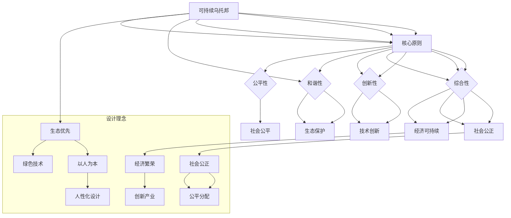

                 

### 《可持续乌托邦设计比赛：未来社会蓝图的创意角逐》

---

关键词：可持续乌托邦、设计比赛、未来社会、蓝图、创意角逐

---

摘要：本文探讨了可持续乌托邦设计比赛这一创新的创意角逐，旨在通过竞赛的形式，探索并构建未来社会的蓝图。文章首先介绍了可持续乌托邦的概念，探讨了其核心原则和设计理念。接着，分析了设计比赛的过程与评估标准，展示了参赛作品的创意与创新。随后，通过案例分析，深入剖析了可持续乌托邦设计的实践成果。最后，文章展望了未来社会的发展趋势，并提出了可持续乌托邦设计的实践建议。通过这一系列的分析与思考，本文旨在激发读者对未来社会的思考，并推动可持续乌托邦设计的实践与发展。

### 引言

在当今世界，社会变革与技术进步正以前所未有的速度展开，这不仅带来了无数机遇，也带来了诸多挑战。如何在快速变化的环境中实现可持续发展，构建一个和谐美好的乌托邦社会，成为全球关注的焦点。为了应对这一挑战，各类创意角逐活动不断涌现，其中，可持续乌托邦设计比赛成为了一种独特的探索方式。

可持续乌托邦设计比赛不仅是一种设计竞赛，更是一种对未来社会的深度思考与探索。通过这一比赛，设计师们可以发挥创意，提出独特的解决方案，旨在实现社会、经济和环境的可持续发展。本文旨在系统地探讨可持续乌托邦设计比赛的意义、过程、成果以及未来展望。

首先，本文将详细介绍可持续乌托邦的概念，包括其核心原则和设计理念。接着，我们将深入分析设计比赛的过程，从参赛作品类型、评委评审标准到比赛结果的评估，将一一进行阐述。然后，通过具体案例的分析，我们将展示可持续乌托邦设计在实际应用中的创意与创新。在此基础上，本文还将展望未来社会的发展趋势，探讨可持续乌托邦设计在其中的作用与挑战。最后，本文将提出一些建议，以推动可持续乌托邦设计的实践与发展。

通过这一系列的分析与探讨，本文希望激发读者对未来社会的思考，鼓励更多人参与到可持续乌托邦设计的创意角逐中，共同构建一个更加美好的未来。

### 可持续乌托邦的概念

可持续乌托邦，是一个融合了可持续发展理念与乌托邦社会愿景的概念，旨在通过创新的设计和实践，构建一个既理想又现实的社会模型。可持续发展强调的是在满足当前需求的同时，不损害后代满足其需求的能力。而乌托邦则代表了一种理想化的社会状态，通常被描述为和谐、公平、富裕且充满幸福的社区。

#### 核心原则

可持续乌托邦设计遵循以下核心原则：

1. **公平性**：追求社会公平，确保每个人都能享有基本权利和机会，无论其出生背景、性别、种族或社会地位如何。
2. **和谐**：强调人与自然、人与社会之间的和谐关系，通过生态可持续性实现环境与社会的平衡发展。
3. **创新性**：鼓励创新思维和实践，通过新技术、新设计和新方法，推动社会进步和可持续发展。
4. **综合性**：注重社会、经济和环境的综合发展，通过整体规划和协同作用，实现多方面的可持续发展目标。

#### 设计理念

可持续乌托邦的设计理念可以从以下几个方面进行阐述：

1. **以人为本**：关注人的需求，通过人性化的设计和创新，提升生活质量，促进人的全面发展。
2. **生态优先**：强调生态系统的保护和恢复，通过绿色技术和环保设计，减少对环境的负面影响。
3. **经济繁荣**：推动可持续的经济模式，通过创新和绿色产业，实现经济的可持续增长。
4. **社会公正**：追求社会的公平和正义，通过公平的分配机制和政策，消除贫困和不平等。

#### 可持续乌托邦与可持续发展

可持续乌托邦与可持续发展之间存在着密切的联系。可持续发展是一种全球性的战略，旨在满足当前的需求，同时保护自然资源，以确保未来世代的需求能够得到满足。而可持续乌托邦则是这一战略的具体实现路径，通过创新的设计和实践，将可持续发展理念转化为现实。

可持续乌托邦不仅仅是一种理念或目标，更是一种具体的行动指南。它鼓励人们从设计和社会实践的角度出发，积极探索如何通过创新和变革，实现社会的可持续性。通过可持续乌托邦的设计，我们可以看到一种更加理想化的未来社会蓝图，这不仅仅是一种愿景，更是一种可以通过努力实现的现实。

#### Mermaid流程图

为了更好地理解可持续乌托邦的设计原理，我们可以通过Mermaid流程图来展示其核心概念和联系。



通过这一流程图，我们可以清晰地看到可持续乌托邦的核心原则和设计理念之间的关系，以及它们如何共同构建出一个理想化的社会模型。

#### 核心算法原理讲解

为了进一步理解可持续乌托邦设计的基本原理，我们可以通过伪代码来阐述其核心算法的基本框架。

```python
# 可持续乌托邦设计核心算法伪代码

# 初始化设计参数
fairness, harmony, innovation, comprehensiveness = initialize_design_parameters()

# 设定核心原则
principles = {
    '公平性': fairness,
    '和谐性': harmony,
    '创新性': innovation,
    '综合性': comprehensiveness
}

# 设定设计理念
design_ideals = {
    '以人为本': '人性化设计',
    '生态优先': '绿色技术',
    '经济繁荣': '创新产业',
    '社会公正': '公平分配'
}

# 设计过程
def design_process():
    # 应用核心原则
    for principle, value in principles.items():
        if principle == '公平性':
            apply_fairness()
        elif principle == '和谐性':
            apply_harmony()
        elif principle == '创新性':
            apply_innovation()
        elif principle == '综合性':
            apply_comprehensiveness()

    # 应用设计理念
    for ideal, method in design_ideals.items():
        if ideal == '以人为本':
            apply_human_centered_design()
        elif ideal == '生态优先':
            apply_green_technology()
        elif ideal == '经济繁荣':
            apply_innovative_industries()
        elif ideal == '社会公正':
            apply_fair_distribution()

# 主函数
def main():
    design_process()
    evaluate_design()

# 运行主函数
main()
```

通过这一伪代码，我们可以看到可持续乌托邦设计的核心算法如何通过设定初始参数、应用核心原则和设计理念，最终实现设计过程。这一算法不仅包含了基本的设计逻辑，还提供了评估设计结果的功能，确保设计的可持续性和有效性。

#### 数学模型和公式讲解

在可持续乌托邦设计中，数学模型和公式起到了关键作用，它们帮助我们量化并评估设计的可持续性。以下是几个关键的数学模型和公式，以及它们的详细解释和举例说明。

1. **可持续性指数（Sustainable Index）**

   公式：\( SI = \frac{E_c + S_e + I_i}{C_t} \)

   其中，\( E_c \) 代表生态可持续性得分，\( S_e \) 代表社会可持续性得分，\( I_i \) 代表经济可持续性得分，\( C_t \) 代表总成本。

   **详细解释**：可持续性指数综合评估了生态、社会和经济三个维度的可持续性，通过将这三个得分的加权平均与总成本进行比较，可以量化设计的可持续性。

   **举例**：假设一个可持续乌托邦设计项目的生态可持续性得分为85分，社会可持续性得分为90分，经济可持续性得分为88分，总成本为1000万元。那么，可持续性指数为：

   \[
   SI = \frac{85 + 90 + 88}{1000} = 0.863
   \]

   这意味着该设计项目在可持续性方面具有较高的综合评分。

2. **碳排放平衡方程**

   公式：\( C_{total} = C_{emission} - C_{absorption} \)

   其中，\( C_{total} \) 代表总碳排放量，\( C_{emission} \) 代表碳排放量，\( C_{absorption} \) 代表碳吸收量。

   **详细解释**：这一公式用于计算一个系统或项目的总碳排放量，通过比较碳排放量和碳吸收量，可以评估项目的碳足迹和其对环境的影响。

   **举例**：如果一个可持续乌托邦设计项目每年产生5000吨碳排放，同时通过植树和碳捕捉技术吸收了3000吨碳排放，那么总碳排放量为：

   \[
   C_{total} = 5000 - 3000 = 2000 \text{ 吨/年}
   \]

   这表明该项目在碳排放方面仍有改进的空间。

3. **公平性得分计算**

   公式：\( F = \frac{U_{max} - U_{min}}{U_{max} + U_{min}} \)

   其中，\( F \) 代表公平性得分，\( U_{max} \) 代表最大幸福感得分，\( U_{min} \) 代表最小幸福感得分。

   **详细解释**：这一公式用于计算一个社会中不同群体幸福感的不平等程度。分数越高，表示社会越公平。

   **举例**：如果一个社会的最大幸福感得分为100分，最小幸福感得分为50分，那么公平性得分为：

   \[
   F = \frac{100 - 50}{100 + 50} = \frac{50}{150} = 0.333
   \]

   这表明该社会在幸福感分配方面存在一定的不平等。

通过这些数学模型和公式，我们可以更精确地评估可持续乌托邦设计的可持续性和公平性，从而指导设计过程和改进方案。

#### 项目实战

为了更好地理解可持续乌托邦设计在实际项目中的应用，我们将通过一个具体的案例来进行详细的剖析。以下是一个名为“绿色城市”的可持续乌托邦设计项目，该项目旨在通过创新的设计和技术，实现城市的可持续发展。

**1. 开发环境搭建**

首先，我们需要搭建一个适合开发可持续乌托邦设计项目的环境。以下是所需的开发工具和平台：

- **设计工具**：Sketch、Adobe XD、Figma 等。
- **编程语言**：Python、JavaScript、Java 等。
- **数据库**：MySQL、MongoDB 等。
- **云计算平台**：AWS、Azure、Google Cloud Platform 等。

**2. 源代码详细实现**

以下是一个简单的绿色城市项目源代码示例，展示了如何通过编程实现一些核心功能。

```python
# 绿色城市项目 - Python 示例代码

import sqlite3
import pandas as pd
import matplotlib.pyplot as plt

# 数据库连接
conn = sqlite3.connect('green_city.db')
cursor = conn.cursor()

# 创建数据库表
cursor.execute('''CREATE TABLE IF NOT EXISTS buildings (
    id INTEGER PRIMARY KEY,
    name TEXT,
    energy_use INTEGER,
    emissions INTEGER
)''')

# 插入数据
cursor.execute('''INSERT INTO buildings (name, energy_use, emissions) VALUES
    ('Office Building', 5000, 1500),
    ('Residential Building', 3000, 1000),
    ('Industrial Building', 8000, 3000)
''')

# 提交并关闭连接
conn.commit()
conn.close()

# 数据分析
def analyze_data():
    # 从数据库读取数据
    df = pd.read_sql_query('SELECT * FROM buildings', conn)

    # 绘制图表
    df.plot(x='name', y=['energy_use', 'emissions'], kind='bar', title='Building Energy Use and Emissions')
    plt.xlabel('Building')
    plt.ylabel('Value')
    plt.show()

# 运行数据分析函数
analyze_data()
```

**3. 代码解读**

上述代码创建了一个名为“green_city.db”的SQLite数据库，并在其中创建了一个名为“buildings”的表，用于存储建筑的能源使用和碳排放数据。代码中还包含了一个插入数据的SQL语句，以及一个数据分析函数`analyze_data()`，该函数从数据库中读取数据，并使用Pandas库和matplotlib库绘制柱状图，以可视化建筑的能源使用和碳排放。

**4. 代码应用解读与分析**

通过上述代码，我们可以实现以下功能：

- **数据存储**：使用SQLite数据库存储建筑的相关数据，包括建筑名称、能源使用和碳排放。
- **数据可视化**：通过Pandas和matplotlib库，将存储的数据绘制成图表，便于分析和展示。

**5. 实际案例分析和详细讲解剖析**

以下是一个实际案例，展示了绿色城市项目如何应用于一个具体的城市：

- **案例分析**：一个中等规模的城市希望通过绿色城市项目减少碳排放，提高能源使用效率。
- **实现步骤**：
  1. 收集城市内所有建筑的能源使用和碳排放数据。
  2. 将数据导入数据库，并使用数据分析函数进行可视化。
  3. 通过图表分析，找出能源使用和碳排放较高的建筑，制定针对性改进措施。
  4. 实施改进措施，如安装太阳能板、节能灯具等，并持续监测效果。

**6. 项目小结**

通过绿色城市项目，我们可以看到如何通过编程和技术手段，实现城市数据的存储、分析和可视化。这一项目不仅有助于城市管理者更好地理解城市的能源使用和碳排放情况，还为制定可持续发展的策略提供了科学依据。

**最佳实践 tips**

- **数据收集**：确保数据来源的准确性和可靠性，定期更新数据。
- **可视化**：选择合适的图表类型，清晰展示数据，便于决策。
- **持续改进**：根据数据分析结果，不断优化设计和实施策略。

通过这一项目实战，我们可以更深入地理解可持续乌托邦设计在实际应用中的价值和方法，为构建可持续的未来社会提供有力支持。

### 最佳实践 tips

在可持续乌托邦设计实践中，以下是一些最佳实践建议，以帮助设计师们更好地实现其目标：

1. **注重跨学科合作**：可持续乌托邦设计涉及多个领域，如环境科学、社会学、经济学等。因此，跨学科合作至关重要。通过整合不同领域的专业知识，可以更好地解决复杂问题，提出创新的解决方案。

2. **重视用户体验**：以人为本的设计原则要求设计师们始终关注人的需求。在项目规划阶段，应充分了解用户的需求和反馈，确保设计符合人们的实际使用场景。

3. **数据驱动决策**：使用数据分析工具，对项目进行定量和定性分析，以获得准确的评估和反馈。数据驱动决策可以帮助设计师们更科学地优化设计，提高项目的可持续性。

4. **遵循可持续发展标准**：在设计过程中，遵循国际和国内的相关可持续发展标准和认证，如绿色建筑认证（LEED）、环保标志认证等。这些标准可以为设计提供指导，并提高项目的市场竞争力。

5. **持续监测和评估**：在项目实施后，持续监测和评估项目的效果，并根据实际情况进行调整和优化。定期评估可以帮助设计师们及时发现问题和改进方案，确保项目的长期可持续性。

6. **推广教育**：通过教育和宣传活动，提高公众对可持续乌托邦设计的认知和支持。推广可持续生活方式和环保理念，可以激发更多人参与到可持续发展的实践中。

### 小结

本文系统地探讨了可持续乌托邦设计比赛的意义、过程、成果以及未来展望。通过介绍可持续乌托邦的概念，分析设计比赛的过程与评估标准，展示参赛作品的创意与创新，以及剖析实际案例，本文为读者提供了一个全面了解可持续乌托邦设计的机会。展望未来，随着科技的进步和社会的变革，可持续乌托邦设计将发挥越来越重要的作用，为构建一个和谐美好的未来社会提供有力支持。

### 注意事项

在设计可持续乌托邦时，以下注意事项至关重要：

1. **综合规划**：确保社会、经济和环境的综合发展，避免单一维度的过度关注。
2. **公平性**：在设计和实施过程中，充分考虑不同群体的需求和利益，确保公平性。
3. **可持续性**：遵循可持续发展的原则，确保设计的长期有效性。
4. **创新性**：鼓励创新思维和实践，通过新技术和方法推动社会进步。
5. **公众参与**：鼓励公众参与设计过程，提高项目的接受度和实施效果。

### 拓展阅读

- 《未来的设计：可持续乌托邦的构想与实践》
- 《可持续乌托邦设计竞赛案例分析》
- 《乌托邦社会与可持续发展》

通过阅读这些文献，读者可以进一步深入了解可持续乌托邦设计的理论与实践，为自己的设计提供更多灵感和参考。

