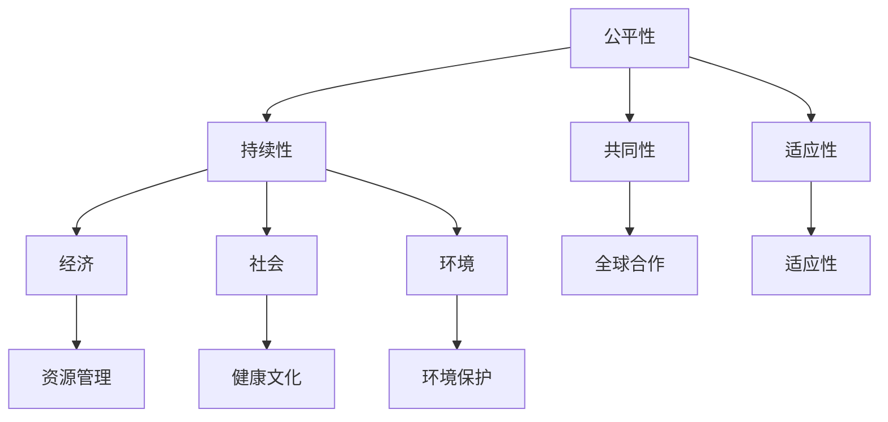

                 

### 文章标题
《可持续发展：为后代创造有意义的未来》

### 关键词
- 可持续性
- 未来展望
- 环境保护
- 经济发展
- 社会正义
- 技术创新
- 可持续发展目标（SDGs）

### 摘要
本文旨在深入探讨可持续发展的概念、原则和实现路径，以及其在环境保护、经济发展、社会正义和技术创新等方面的应用。通过分析可持续发展的重要性，本文将阐述其与环境保护、资源管理、经济效率和健康文化的密切联系，并提出具体的政策和实践措施，以期为后代创造一个有意义的未来。

### 引言
可持续发展（Sustainable Development）是一个涵盖经济、社会和环境三个维度的综合性概念。它起源于1987年的《我们共同的未来》报告，并在随后的几十年里，成为全球各国政府、企业和公民社会共同努力的目标。本文将围绕可持续发展的核心概念、环境和经济可持续性、社会可持续性、技术创新、政策与实践以及未来展望进行详细探讨。

### 第一步：理解可持续发展的概念和原则
#### 背景介绍
可持续发展概念的提出源于对人类社会经济活动对环境影响的反思。传统的经济增长模式往往以资源消耗和环境污染为代价，导致资源枯竭、生态破坏和气候变化等问题。为了应对这些挑战，可持续发展理念应运而生。

#### 定义
可持续发展被定义为满足当前需求而不损害后代满足其需求的能力。它强调经济、社会和环境的协调发展，力求在满足人类基本需求的同时，保护和维护地球的生态平衡。

#### 原则
- **公平性**：追求社会公正，关注贫困、种族、性别等不公平现象。
- **持续性**：合理利用自然资源，保持生态系统的健康和多样性。
- **共同性**：可持续发展是全球性的问题，需要全球合作和共同努力。
- **适应性**：面对不确定性，需要具备适应环境变化的能力。

#### Mermaid流程图
为了更好地理解可持续发展的核心概念和原则，我们可以使用Mermaid流程图来展示各个要素之间的关系：

### 第二步：环境可持续性
#### 环境保护的重要性
环境保护是可持续发展的重要组成部分。随着工业化和城市化进程的加快，环境污染问题日益严重，对生态系统和人类健康造成了巨大威胁。

#### 生态平衡的维持
生态平衡是指生物群落中的各个组成部分通过相互作用和相互依存，维持一种相对稳定的状态。生态平衡的维持对于保持地球的可持续性至关重要。

#### 气候变化的影响与应对
气候变化是当前全球面临的重大挑战之一。它不仅影响生态系统的稳定性，还会导致极端天气事件的增加，对人类社会和经济造成严重影响。应对气候变化的关键在于减少温室气体排放和增加碳汇。

### 第三步：经济可持续性
#### 传统经济发展模式的挑战
传统的经济增长模式主要依赖于资源的消耗和环境的破坏，导致资源枯竭和环境污染。这种模式在长期是不可持续的。

#### 可持续经济发展模式
可持续经济发展模式强调经济增长与社会和环境目标的协调。绿色经济、知识经济等新兴经济模式正在逐渐取代传统的经济增长模式。

#### 可持续经济发展实践
在实践层面，许多国家和地区已经采取了一系列政策措施来推动可持续经济发展。成功案例包括瑞典的循环经济模式、德国的能效提升策略等。

### 第四步：社会可持续性
#### 教育与可持续性
教育是可持续发展的基础。通过可持续教育，人们可以培养环保意识和社会责任感，为未来的可持续发展奠定基础。

#### 健康与文化
健康和文化是社会可持续性的重要组成部分。保障人民健康、维护文化多样性是实现社会可持续性的关键。

#### 社会正义与平等
社会正义和平等是实现可持续发展的重要保障。通过消除贫困、减少不平等现象，可以促进社会的和谐与稳定。

### 第五步：技术创新
#### 技术创新的作用
技术创新是推动可持续发展的重要力量。通过技术创新，可以降低资源消耗、提高生产效率、改善环境质量。

#### 技术创新案例
许多技术创新已经在可持续发展领域取得了显著成果。例如，太阳能和风能技术的进步为可再生能源的应用提供了可能；人工智能和大数据分析技术为资源管理和环境保护提供了新工具。

### 第六步：政策与实践
#### 政策制定
政策制定是推动可持续发展的重要手段。各国政府应制定有利于可持续发展的政策，包括环境保护政策、资源管理政策和经济发展政策。

#### 实践措施
实践措施是实现可持续发展目标的具体行动。这些措施包括环境治理、绿色投资、可持续发展教育等。

### 第七步：未来展望
#### 可持续发展的趋势和挑战
未来，可持续发展将面临一系列新的趋势和挑战。包括气候变化、资源枯竭、人口增长等。

#### 可持续发展的前景
尽管面临挑战，但通过技术创新、政策调整和社会变革，我们可以为实现可持续发展的目标做出积极贡献。

### 结论
可持续发展是一个长期而复杂的过程，需要全球范围内的共同努力。通过环境保护、经济可持续发展、社会正义和技术创新，我们可以为后代创造一个有意义的未来。

### 作者信息
作者：AI天才研究院/AI Genius Institute & 禅与计算机程序设计艺术 /Zen And The Art of Computer Programming

---

以上为文章的概要和目录大纲。接下来，我们将逐一详细阐述每个章节的内容，确保文章逻辑清晰、内容丰富，并在规定字数范围内完成全文撰写。

