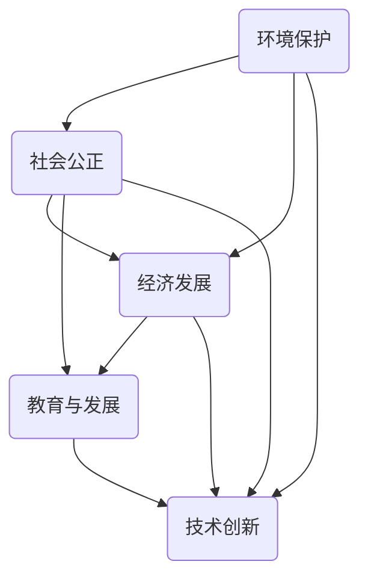

                 

### 文章标题

**可持续发展：为未来 generations 寻找意义**

### 关键词

- 可持续发展
- 环境保护
- 社会公正
- 经济发展
- 技术创新
- 教育与发展

### 摘要

本文旨在探讨可持续发展的核心概念、理论基础、实践案例、政策法规、技术创新、教育与发展以及未来展望。通过分析可持续发展在环境保护、社会公正和经济发展中的重要作用，以及各国在推动可持续发展方面的政策与法规，本文提出了技术创新在实现可持续发展中的关键作用，并强调了教育在培养未来一代可持续性思维中的重要性。最后，本文对未来可持续发展面临的挑战与机遇进行了展望，并提出了国际合作在推动全球可持续发展中的重要性。

----------------------------------------------------------------

### 第1章 引言

#### 1.1 可持续发展的定义与意义

可持续发展是指在满足当前需求的同时，不损害后代满足自身需求的能力的发展模式。这一概念最初由布伦特兰委员会在1987年的《我们共同的未来》报告中提出，被广泛认可并作为全球发展的指导原则。可持续发展不仅关注经济增长，更强调环境、社会和经济的协调发展，确保地球的长期健康与繁荣。

在当今世界，可持续发展的重要性不容忽视。首先，环境问题日益严重，气候变化、生物多样性丧失和环境污染对人类生存和发展构成了严重威胁。其次，社会不公问题依然存在，贫富差距、社会不平等等问题影响了社会的稳定和和谐。最后，经济发展模式的局限性导致了资源枯竭和环境污染，使得传统的发展模式难以为继。

因此，可持续发展被视为解决全球环境、社会和经济问题的有效途径。通过实现环境保护、社会公正和经济的协调发展，可持续发展旨在为未来 generations 创造一个更健康、更公平、更繁荣的世界。

#### 1.2 可持续发展的核心概念与联系

可持续发展的核心概念包括环境保护、社会公正和经济发展。这三个方面相互联系、相互依存，共同构成了可持续发展的理论基础。

首先，环境保护是可持续发展的基础。环境是人类生存和发展的基础，只有保护好环境，才能保障人类的健康和福祉。环境保护强调减少污染、节约资源、保护生态系统，以确保地球的可持续发展。

其次，社会公正是可持续发展的重要组成部分。社会公正关注的是社会中不同群体之间的公平和平衡，包括贫富差距、教育机会、医疗保健等。只有实现社会公正，才能保证每个人都能够享有公平的发展机会，实现社会的稳定和和谐。

最后，经济发展是可持续发展的动力。经济发展不仅能够提高人民的生活水平，还能够为国家积累财富，增强国家的综合实力。然而，经济发展必须建立在环境保护和社会公正的基础上，避免对环境和人民生活造成负面影响。

可持续发展的基本原则包括：

1. **公平性原则**：保障不同代人之间的公平，确保后代人能够享有与当前代人相同的发展机会。
2. **持续性原则**：强调资源的合理利用和生态系统的保护，确保地球的长期健康和繁荣。
3. **共同性原则**：全球范围内的可持续发展需要各国共同参与和合作，共同应对全球性挑战。

通过环境保护、社会公正和经济的协调发展，可持续发展旨在实现人与自然、人与人、人与社会之间的和谐共生，为未来 generations 创造一个更美好的世界。

#### 1.3 可持续发展的背景

可持续发展的概念起源于20世纪中后期，随着全球环境问题的日益突出，人们开始关注如何实现经济发展与环境保护的平衡。1972年的联合国人类环境会议标志着环境保护运动的开始，而1987年的《我们共同的未来》报告则正式提出了可持续发展的概念。

在这一背景下，各国政府和国际组织纷纷采取措施，推动可持续发展的实现。1992年的联合国环境与发展大会通过了《21世纪议程》，为全球可持续发展提供了行动框架。此后，各国陆续制定了可持续发展战略和行动计划，将可持续发展理念融入经济、社会和环境政策中。

我国在可持续发展方面也取得了显著成果。从“十三五”规划到“十四五”规划，我国明确提出要推动绿色发展、构建生态文明，将可持续发展作为国家战略。通过实施一系列环保政策、发展可再生能源、推进节能减排等措施，我国在环境保护和可持续发展方面取得了重要进展。

然而，全球和区域环境问题依然严峻，气候变化、生物多样性丧失、环境污染等问题仍然威胁着人类的生存和发展。因此，推动可持续发展，实现人与自然和谐共生，仍然是全球面临的重大挑战。

----------------------------------------------------------------

## 第2章 可持续发展的理论基础

### 2.1 可持续发展的数学模型

可持续发展的数学模型主要用于评估和优化环境保护、社会公正和经济发展之间的平衡关系。以下是一些常见的数学模型：

#### 2.1.1 环境影响评估模型

环境影响评估（EIA）是一种常用的数学模型，用于评估项目或政策对环境的影响。EIA模型通常包括以下步骤：

1. **环境状态评估**：通过收集和整理现有环境数据，评估项目的初始环境状态。
2. **影响分析**：分析项目或政策对环境的潜在影响，包括空气质量、水质、土壤污染等。
3. **影响评估**：对环境影响的严重程度和持续时间进行定量评估。
4. **环境影响减缓措施**：提出减少或消除环境影响的措施，确保项目或政策的可持续发展。

伪代码如下：

```
function EIA(model, data, impact_analysis, impact_assessment, mitigation_measures):
    environment_state = model.evaluate_initial_state(data)
    potential_impacts = impact_analysis.analyze_potential_impacts(model)
    severity_and_duration = impact_assessment.evaluate_impacts(potential_impacts)
    mitigation_measures = mitigation_measures.propose_reductions()
    return mitigation_measures
```

#### 2.1.2 经济效益模型

经济效益模型用于评估项目或政策的经济效益，包括成本、收益和投资回报率等。以下是一个简单的经济效益模型：

1. **成本分析**：计算项目或政策所需的初始投资、运营成本和潜在损失。
2. **收益分析**：预测项目或政策带来的经济收益，包括直接收益和间接收益。
3. **投资回报率**：计算项目的投资回报率（ROI）和净现值（NPV）。

伪代码如下：

```
function EconomicModel(cost_analysis, revenue_analysis, investment_return):
    initial_investment = cost_analysis.calculate_initial_investment()
    operational_costs = cost_analysis.calculate_operational_costs()
    potential_losses = cost_analysis.calculate_potential_losses()
    direct_revenues = revenue_analysis.calculate_direct_revenues()
    indirect_revenues = revenue_analysis.calculate_indirect_revenues()
    investment_return = calculate_investment_return(initial_investment, operational_costs, potential_losses, direct_revenues, indirect_revenues)
    return investment_return
```

#### 2.1.3 社会公正模型

社会公正模型用于评估项目或政策对社会公正的影响，包括贫富差距、教育机会、医疗保健等方面。以下是一个简化的社会公正模型：

1. **社会指标评估**：收集和整理项目或政策实施前后的社会指标数据。
2. **差距分析**：比较不同社会群体之间的差距，包括收入差距、教育差距、医疗保健差距等。
3. **公平性评估**：评估项目或政策对社会公正的贡献。

伪代码如下：

```
function SocialJusticeModel(indicators, gap_analysis, fairness_assessment):
    pre_policy_indicators = indicators.collect_pre_policy_data()
    post_policy_indicators = indicators.collect_post_policy_data()
    gaps = gap_analysis.analyze_gaps(pre_policy_indicators, post_policy_indicators)
    fairness = fairness_assessment.evaluate_fairness(gaps)
    return fairness
```

这些数学模型为可持续发展提供了理论框架和工具，有助于决策者评估和优化可持续发展策略。

### 2.2 可持续发展的理论框架

可持续发展的理论框架主要包括三大支柱：环境保护、社会公正和经济发展。这三个支柱相互依存、相互促进，共同构成了可持续发展的基础。

#### 2.2.1 环境保护

环境保护是可持续发展的核心支柱。环境保护的主要目标是保护自然资源和生态系统，确保其长期健康和可持续利用。环境保护包括以下方面：

1. **资源管理**：合理利用自然资源，确保资源的可持续供应。
2. **污染控制**：减少污染物的排放，保护大气、水体和土壤的质量。
3. **生态系统保护**：保护和恢复生态系统，维护生物多样性。

#### 2.2.2 社会公正

社会公正是可持续发展的关键支柱。社会公正的主要目标是确保社会各成员之间的公平和平衡，消除贫困、减少不平等，提高生活质量。社会公正包括以下方面：

1. **教育公平**：提供平等的教育机会，提高人们的知识水平和技能。
2. **就业机会**：创造更多的就业机会，确保人们的就业权益。
3. **社会保障**：建立完善的社会保障体系，保障人们的基本生活需求。

#### 2.2.3 经济发展

经济发展是可持续发展的基础支柱。经济发展旨在提高国家的经济实力，提高人民的生活水平，为国家和社会的发展提供资金和资源。经济发展包括以下方面：

1. **技术创新**：推动技术创新，提高生产效率和竞争力。
2. **产业升级**：促进产业结构调整和优化，实现经济的可持续发展。
3. **国际贸易**：积极参与国际贸易，扩大国际市场，提高国家的经济实力。

#### 2.2.4 可持续发展的系统理论

可持续发展的系统理论认为，可持续发展是一个复杂的系统，涉及到多个领域和因素。这个系统包括自然环境、人类社会和经济系统，这些系统相互影响、相互制约，共同推动可持续发展的实现。

1. **生态平衡**：生态平衡是可持续发展的基础，它涉及到自然资源的保护、生态系统的恢复和环境的改善。
2. **社会和谐**：社会和谐是可持续发展的关键，它涉及到社会公正、教育、就业、社会保障等方面的平衡和协调。
3. **经济发展**：经济发展是可持续发展的动力，它涉及到技术创新、产业升级、国际贸易等方面的推动。

通过环境保护、社会公正和经济发展的协调发展，可持续发展的系统理论为可持续发展的实现提供了理论指导。

### 2.3 可持续发展的评估方法

可持续发展的评估方法主要包括定量评估和定性评估，这些方法用于评估可持续发展策略的效果和进展。

#### 2.3.1 定量评估

定量评估方法通过具体的指标和数据来评估可持续发展策略的效果。以下是一些常用的定量评估指标：

1. **环境指标**：包括温室气体排放量、水资源利用效率、能源消耗等。
2. **社会指标**：包括贫困率、教育普及率、就业率、医疗保健水平等。
3. **经济指标**：包括国内生产总值（GDP）、人均收入、产业结构、投资回报率等。

定量评估方法的步骤如下：

1. **指标选择**：根据评估目标和需求，选择合适的评估指标。
2. **数据收集**：收集与指标相关的数据，确保数据的准确性和完整性。
3. **数据分析**：使用统计方法和计算工具，对数据进行处理和分析。
4. **结果评估**：根据分析结果，评估可持续发展策略的效果和进展。

#### 2.3.2 定性评估

定性评估方法通过主观分析和判断来评估可持续发展策略的效果。以下是一些常用的定性评估方法：

1. **专家评估**：邀请相关领域的专家对可持续发展策略进行评估，提供专业意见和建议。
2. **公众参与**：通过问卷调查、公众论坛等方式，收集公众对可持续发展策略的意见和反馈。
3. **案例研究**：选择具体的案例进行深入分析，评估可持续发展策略的效果和经验。

定性评估方法的步骤如下：

1. **评估目标确定**：明确评估的目标和范围。
2. **评估方法选择**：根据评估目标和资源，选择合适的评估方法。
3. **评估实施**：根据评估方法，进行评估活动，收集数据和意见。
4. **结果分析**：对评估结果进行整理和分析，形成评估报告。

通过定量评估和定性评估相结合，可以全面、准确地评估可持续发展策略的效果和进展，为政策的制定和调整提供科学依据。

---

### 2.4 可持续发展的核心概念与联系架构

为了更好地理解可持续发展的核心概念及其相互关系，我们可以通过Mermaid流程图来展示其架构。以下是可持续发展的核心概念与联系的Mermaid表示：



在上述流程图中，我们看到了以下几个关键要素：

1. **环境保护（A）**：是可持续发展的基础，直接影响生态系统和自然资源。
2. **社会公正（B）**：保障社会各成员之间的公平和平衡，包括教育、就业和社会保障等方面。
3. **经济发展（C）**：提供资金和资源，推动国家和社会的发展，但需在环境保护和社会公正的前提下进行。
4. **教育与发展（D）**：培养未来一代的可持续性思维和能力，确保可持续发展理念的传承和实践。
5. **技术创新（E）**：推动可持续发展，提高资源利用效率和环境保护能力。

通过这个Mermaid流程图，我们可以清晰地看到环境保护、社会公正、经济发展、教育与发展和技术创新之间的相互关系，以及它们在可持续发展中的重要作用。

---

### 2.5 可持续发展的核心算法原理

为了深入理解可持续发展的核心算法原理，我们将通过伪代码来详细阐述几个关键算法，包括环境影响评估算法、经济效益评估算法和社会公正评估算法。

#### 2.5.1 环境影响评估算法

环境影响评估（EIA）是一种用于评估项目或政策对环境影响的算法。以下是EIA算法的伪代码：

```plaintext
Algorithm EIA(model, data, impact_analysis, impact_assessment, mitigation_measures):
    1. environment_state <- model.evaluate_initial_state(data)
    2. potential_impacts <- impact_analysis.analyze_potential_impacts(model)
    3. severity_and_duration <- impact_assessment.evaluate_impacts(potential_impacts)
    4. mitigation_measures <- mitigation_measures.propose_reductions()
    5. return mitigation_measures
```

**详细说明**：

1. **环境状态评估**：使用模型评估项目的初始环境状态，包括空气质量、水质和土壤质量等指标。
    ```plaintext
    environment_state <- model.evaluate_initial_state(data)
    ```

2. **影响分析**：分析项目或政策可能对环境产生的潜在影响，如二氧化碳排放、污染物排放等。
    ```plaintext
    potential_impacts <- impact_analysis.analyze_potential_impacts(model)
    ```

3. **影响评估**：评估潜在影响的严重程度和持续时间，确定环境风险。
    ```plaintext
    severity_and_duration <- impact_assessment.evaluate_impacts(potential_impacts)
    ```

4. **影响减缓措施**：提出减少或消除环境影响的具体措施，如减少碳排放、改进污水处理等。
    ```plaintext
    mitigation_measures <- mitigation_measures.propose_reductions()
    ```

#### 2.5.2 经济效益评估算法

经济效益评估（EconomicModel）是一种用于评估项目或政策经济收益的算法。以下是经济效益评估算法的伪代码：

```plaintext
Algorithm EconomicModel(cost_analysis, revenue_analysis, investment_return):
    1. initial_investment <- cost_analysis.calculate_initial_investment()
    2. operational_costs <- cost_analysis.calculate_operational_costs()
    3. potential_losses <- cost_analysis.calculate_potential_losses()
    4. direct_revenues <- revenue_analysis.calculate_direct_revenues()
    5. indirect_revenues <- revenue_analysis.calculate_indirect_revenues()
    6. investment_return <- calculate_investment_return(initial_investment, operational_costs, potential_losses, direct_revenues, indirect_revenues)
    7. return investment_return
```

**详细说明**：

1. **成本分析**：计算项目或政策的初始投资、运营成本和潜在损失。
    ```plaintext
    initial_investment <- cost_analysis.calculate_initial_investment()
    operational_costs <- cost_analysis.calculate_operational_costs()
    potential_losses <- cost_analysis.calculate_potential_losses()
    ```

2. **收益分析**：预测项目或政策的经济收益，包括直接收益和间接收益。
    ```plaintext
    direct_revenues <- revenue_analysis.calculate_direct_revenues()
    indirect_revenues <- revenue_analysis.calculate_indirect_revenues()
    ```

3. **投资回报率**：计算项目的投资回报率和净现值，评估经济效益。
    ```plaintext
    investment_return <- calculate_investment_return(initial_investment, operational_costs, potential_losses, direct_revenues, indirect_revenues)
    ```

#### 2.5.3 社会公正评估算法

社会公正评估（SocialJusticeModel）是一种用于评估项目或政策对社会公正影响的算法。以下是社会公正评估算法的伪代码：

```plaintext
Algorithm SocialJusticeModel(indicators, gap_analysis, fairness_assessment):
    1. pre_policy_indicators <- indicators.collect_pre_policy_data()
    2. post_policy_indicators <- indicators.collect_post_policy_data()
    3. gaps <- gap_analysis.analyze_gaps(pre_policy_indicators, post_policy_indicators)
    4. fairness <- fairness_assessment.evaluate_fairness(gaps)
    5. return fairness
```

**详细说明**：

1. **社会指标评估**：收集和整理项目或政策实施前后的社会指标数据。
    ```plaintext
    pre_policy_indicators <- indicators.collect_pre_policy_data()
    post_policy_indicators <- indicators.collect_post_policy_data()
    ```

2. **差距分析**：比较不同社会群体之间的差距，如收入差距、教育差距和医疗保健差距。
    ```plaintext
    gaps <- gap_analysis.analyze_gaps(pre_policy_indicators, post_policy_indicators)
    ```

3. **公平性评估**：评估项目或政策对社会公正的贡献，判断其公平性。
    ```plaintext
    fairness <- fairness_assessment.evaluate_fairness(gaps)
    ```

通过这些核心算法的详细阐述，我们可以更好地理解可持续发展在不同方面的评估方法和原理，为制定和优化可持续发展策略提供科学依据。

---

### 2.6 可持续发展的数学模型和公式

在可持续发展的评估过程中，数学模型和公式起到了至关重要的作用。以下我们将介绍几个关键的数学模型和公式，包括环境影响评估模型、经济效益评估模型和社会公正评估模型。

#### 2.6.1 环境影响评估模型

环境影响评估模型通常用于评估某一项目或政策对环境的影响。以下是一个简化的环境影响评估模型：

**碳足迹计算公式**：

$$
CF = C \times E \times D
$$

- **CF**：碳足迹，表示项目或政策产生的二氧化碳排放量（吨）。
- **C**：二氧化碳排放系数，表示单位能源消耗产生的二氧化碳排放量（吨/千克能源）。
- **E**：能源消耗量，表示项目或政策所需的能源总量（千克能源）。
- **D**：排放因子，表示单位排放量的环境影响程度（通常以全球变暖潜力（GWP）为单位）。

**温室气体排放量计算公式**：

$$
GHG = \sum_{i=1}^{n} (C_i \times E_i \times D_i)
$$

- **GHG**：温室气体排放量（吨）。
- **C_i**：第i种温室气体的排放系数（吨/千克能源）。
- **E_i**：第i种能源的消耗量（千克能源）。
- **D_i**：第i种温室气体的排放因子（通常以GWP为单位）。

#### 2.6.2 经济效益评估模型

经济效益评估模型用于评估项目或政策的经济效益，主要包括成本和收益的分析。以下是一个简化的经济效益评估模型：

**净现值（NPV）计算公式**：

$$
NPV = \sum_{t=1}^{n} \frac{R_t}{(1 + r)^t} - C
$$

- **NPV**：净现值，表示项目或政策的经济效益。
- **R_t**：第t年的收益（元）。
- **r**：折现率，表示对未来收益的贴现。
- **C**：初始投资成本（元）。

**内部收益率（IRR）计算公式**：

$$
IRR = \frac{NPV}{C}
$$

- **IRR**：内部收益率，表示项目或政策的经济回报率。

**投资回报期（Payback Period）计算公式**：

$$
PP = \frac{C}{R_t}
$$

- **PP**：投资回报期，表示项目或政策从投资开始到回收初始投资所需的时间。

#### 2.6.3 社会公正评估模型

社会公正评估模型用于评估项目或政策对社会公正的影响。以下是一个简化的社会公正评估模型：

**基尼系数计算公式**：

$$
Gini = 1 - 2 \times \frac{∑(i=1)^{n} (x_i - \bar{x})^2}{n \times \bar{x}^2}
$$

- **Gini**：基尼系数，表示收入差距的指标。
- **x_i**：第i个人的收入（元）。
- **\bar{x}**：平均收入（元）。
- **n**：人口总数。

**帕累托指数计算公式**：

$$
Pareto = \frac{1}{n} \sum_{i=1}^{n} \frac{x_i}{\bar{x}}
$$

- **Pareto**：帕累托指数，表示收入分布的不平等程度。
- **x_i**：第i个人的收入（元）。
- **\bar{x}**：平均收入（元）。

通过这些数学模型和公式，我们可以更科学、准确地评估可持续发展策略在不同方面的效果和影响，为决策提供有力支持。

---

### 2.7 可持续发展的评估方法

评估可持续发展策略的效果和进展是确保其成功实施的关键。以下我们将介绍几种常见的评估方法，包括定量评估和定性评估。

#### 2.7.1 定量评估方法

定量评估方法通过具体的指标和数据来评估可持续发展策略的效果。以下是一些常用的定量评估方法：

1. **环境指标**：环境指标包括温室气体排放量、水资源利用效率、能源消耗等。这些指标可以通过监测和数据分析来获取。例如，通过监测温室气体排放量，可以评估减少碳排放的政策效果。

2. **社会指标**：社会指标包括贫困率、教育普及率、就业率、医疗保健水平等。这些指标可以从政府统计部门、学术研究机构等获取。例如，通过统计贫困率，可以评估减贫政策的实施效果。

3. **经济指标**：经济指标包括国内生产总值（GDP）、人均收入、产业结构、投资回报率等。这些指标可以通过经济统计数据和分析来获取。例如，通过分析GDP增长率，可以评估经济发展政策的成效。

#### 2.7.2 定性评估方法

定性评估方法通过主观分析和判断来评估可持续发展策略的效果。以下是一些常用的定性评估方法：

1. **专家评估**：邀请相关领域的专家对可持续发展策略进行评估，提供专业意见和建议。例如，环境专家可以评估环保政策的实施效果，社会学家可以评估社会公正政策的实施效果。

2. **公众参与**：通过问卷调查、公众论坛等方式，收集公众对可持续发展策略的意见和反馈。这种方法可以了解公众对政策的接受程度和满意度，从而评估政策的实施效果。

3. **案例研究**：选择具体的案例进行深入分析，评估可持续发展策略的效果和经验。例如，通过分析一个成功的可持续发展项目，可以了解其成功的关键因素和可复制性。

#### 2.7.3 定量与定性评估的结合

为了更全面地评估可持续发展策略的效果和进展，可以将定量评估和定性评估方法结合使用。以下是一种结合方法的示例：

1. **数据收集**：首先，通过定量方法收集环境、社会和经济指标的数据，例如温室气体排放量、贫困率和GDP增长率。

2. **数据分析**：对收集到的数据进行分析，评估策略的效果。例如，通过比较政策实施前后的温室气体排放量，评估减少碳排放政策的成效。

3. **专家评估**：邀请专家对数据分析结果进行评估，提供专业意见和建议。例如，环境专家可以评估减少碳排放政策的科学性和可行性。

4. **公众参与**：通过问卷调查、公众论坛等方式，收集公众对政策的反馈和意见。这种方法可以了解公众对政策的接受程度和满意度。

5. **案例研究**：选择具体的案例进行深入分析，评估策略的实施效果和经验。例如，通过分析一个成功的可持续发展项目，了解其成功的关键因素和可复制性。

通过将定量评估和定性评估方法结合使用，可以更全面、准确地评估可持续发展策略的效果和进展，为政策的制定和调整提供科学依据。

---

### 2.8 可持续发展的环境实践

环境实践是可持续发展的重要组成部分，旨在通过具体行动减少环境负担，保护自然资源和生态系统。以下我们将探讨几个环境实践领域的成功案例，包括减少碳排放、生物多样性保护和清洁能源应用。

#### 2.8.1 减少碳排放

减少碳排放是全球应对气候变化的关键措施之一。以下是一些减少碳排放的成功案例：

1. **丹麦的碳税**：丹麦通过实施碳税，鼓励企业减少碳排放。碳税的计算基于企业的温室气体排放量，排放越多，税负越高。这一政策促使企业采取减排措施，如提高能源效率和投资可再生能源。

2. **中国的碳交易市场**：中国建立了全国碳交易市场，通过市场化手段促进碳排放的减少。企业需要购买碳配额才能排放温室气体，碳配额的价格受供需关系影响。碳交易市场的实施促进了企业之间的减排竞争，推动了整个社会减少碳排放。

3. **印度的太阳能计划**：印度政府实施了一系列太阳能计划，旨在减少对化石燃料的依赖，降低碳排放。这些计划包括太阳能屋顶项目和太阳能公园建设。通过大规模推广太阳能，印度成功地将可再生能源在总能源消费中的比例从2014年的6%提高到了2020年的15%。

#### 2.8.2 生物多样性保护

生物多样性是地球生态系统的基石，保护生物多样性对于维持生态平衡和人类福祉至关重要。以下是一些生物多样性保护的成功案例：

1. **巴西的亚马逊雨林保护**：巴西政府采取了一系列措施，保护亚马逊雨林这一生物多样性的宝库。这些措施包括禁止非法伐木、加强执法和推广可持续林业实践。通过这些努力，亚马逊雨林的生物多样性得到了有效保护。

2. **澳大利亚的珊瑚礁保护**：澳大利亚政府实施了珊瑚礁保护计划，以保护大堡礁这一世界自然遗产。这些措施包括限制游客数量、禁止捕鱼和实施生态修复项目。通过这些努力，大堡礁的生态系统逐渐恢复，生物多样性得到了保护。

3. **哥斯达黎加的生态旅游**：哥斯达黎加通过发展生态旅游，实现了经济和生态的双赢。生态旅游促进了当地社区的发展，同时减少了对自然资源的破坏。通过合理利用旅游资源，哥斯达黎加成功地将生物多样性保护与经济发展相结合。

#### 2.8.3 清洁能源应用

清洁能源的应用是减少环境污染、实现可持续发展的重要途径。以下是一些清洁能源应用的案例：

1. **德国的可再生能源革命**：德国通过实施《能源转型法案》，逐步减少对化石燃料的依赖，增加可再生能源的比例。德国的目标是在2050年前实现80%的能源消费来自可再生能源。通过推广太阳能、风能和生物质能，德国在减少碳排放和促进能源独立方面取得了显著成果。

2. **美国的电动汽车推广**：美国政府通过实施一系列政策，鼓励电动汽车的推广和使用。这些政策包括税收优惠、购车补贴和建设充电基础设施。通过推广电动汽车，美国成功降低了交通运输领域的碳排放，推动了清洁能源的应用。

3. **中国的风电和太阳能**：中国是全球最大的可再生能源市场。通过大规模建设风电和太阳能项目，中国成功实现了可再生能源的快速发展。中国的风电和太阳能装机容量和发电量均居世界前列，为减少碳排放和实现能源转型做出了重要贡献。

通过这些环境实践案例，我们可以看到各国在减少碳排放、保护生物多样性和推广清洁能源方面取得了显著进展。这些成功经验为全球实现可持续发展提供了宝贵的借鉴。

### 2.9 社会公正领域的实践案例

社会公正领域的实践案例旨在通过具体行动减少社会不平等，促进社会公平和和谐。以下我们将探讨几个社会公正领域的成功案例，包括公平贸易、社区发展和公共健康。

#### 2.9.1 公平贸易

公平贸易是一种旨在确保发展中国家和工人能够获得公平交易条件的贸易模式。以下是一些公平贸易的成功案例：

1. **公平贸易认证**：公平贸易认证是一种国际认证体系，旨在确保产品来自公平交易。这一认证体系为农民和生产者提供了更好的价格和可持续的市场机会，同时保护了他们的环境和人权。例如，通过公平贸易认证的咖啡，农民可以获得比传统市场更高的价格，从而改善生活条件。

2. **咖啡公平贸易**：在哥伦比亚，公平贸易咖啡项目帮助农民提高了生产效率，改善了生活条件。通过参与公平贸易，农民不仅获得了更高的收入，还学会了可持续的农业生产方法，保护了环境。这一项目成功地将经济收益与社会公正结合，为发展中国家带来了积极的变化。

3. **服装公平贸易**：在印度和孟加拉国，公平贸易运动也取得了显著成果。这些国家的服装工厂通过获得公平贸易认证，改善了工人的工作条件和工资待遇。公平贸易确保了工人能够获得合理的工资，避免过度劳累，同时保障了他们的基本权益。

#### 2.9.2 社区发展

社区发展是促进社会公正和和谐的重要手段。以下是一些社区发展的成功案例：

1. **巴西的社区土地改革**：巴西通过实施社区土地改革，帮助无地的农民获得土地，建立自己的农场。这一政策不仅提高了农民的收入，还促进了农村地区的经济发展和社会稳定。通过社区土地改革，巴西成功地将土地资源重新分配，减少了社会不平等。

2. **印度的社区健康项目**：印度政府实施了社区健康项目，为偏远地区的居民提供基本医疗服务。这些项目包括建立社区卫生中心、培训社区卫生工作者和提供基本药品。通过这些努力，印度显著改善了农村地区的医疗条件，提高了居民的健康水平。

3. **南非的社区经济重建**：南非通过实施社区经济重建计划，帮助贫困社区建立小型企业，提高就业率。这些计划包括提供创业培训、贷款和补贴，鼓励居民创业。通过社区经济重建，南非成功地将失业问题转化为就业机会，促进了社区的经济和社会发展。

#### 2.9.3 公共健康

公共健康是社会公正的重要组成部分，以下是一些公共健康的成功案例：

1. **全球疫苗免疫联盟**：全球疫苗免疫联盟（Gavi）是一个国际组织，旨在为发展中国家提供疫苗和免疫服务。通过Gavi的支持，发展中国家成功实施了广泛的疫苗接种计划，显著降低了传染病的发病率。这一项目不仅改善了公共健康，还促进了社会的稳定和发展。

2. **中国的健康扶贫**：中国政府实施了健康扶贫政策，为贫困人口提供免费的基本医疗服务。这一政策包括建立基层医疗机构、培训医务人员和提供免费药品。通过健康扶贫，中国成功减少了因病致贫、因病返贫的现象，提高了贫困人口的健康水平。

3. **美国的社区健康中心**：美国在社区建立了大量的健康中心，为居民提供综合性的医疗服务。这些健康中心包括门诊服务、预防保健和心理健康服务。通过社区健康中心，美国成功提高了居民的健康素养，降低了医疗成本。

通过这些社会公正领域的实践案例，我们可以看到各国在减少社会不平等、促进社会公正和改善公共健康方面取得了显著进展。这些成功经验为全球实现社会公正提供了宝贵的借鉴。

### 2.10 经济发展领域的实践案例

在可持续发展框架下，经济发展领域的实践案例强调了通过创新和绿色增长实现经济增长与环境保护的双赢。以下是一些成功的实践案例，展示了如何在经济发展中融入可持续发展的理念。

#### 2.10.1 可再生能源产业发展

1. **德国的能源转型**：德国通过实施《能源转型法案》（Energiewende），致力于从传统的化石燃料转向可再生能源。这一政策促进了风能、太阳能和其他可再生能源的快速发展。德国的太阳能和风能装机容量已位居世界前列，成功实现了能源结构的绿色转型。这一转型不仅降低了碳排放，还创造了大量就业机会，促进了经济增长。

2. **中国的光伏产业**：中国是全球最大的光伏产品生产国和消费国。通过大规模投资和补贴政策，中国光伏产业实现了快速发展和技术创新。中国的光伏产品出口到全球各地，推动了全球可再生能源的发展。中国光伏产业的崛起不仅带动了国内经济增长，还有助于全球应对气候变化。

#### 2.10.2 绿色金融

绿色金融是指为环境保护和可持续发展提供资金支持的金融活动。以下是一些绿色金融的成功案例：

1. **欧洲投资银行（EIB）的绿色债券**：欧洲投资银行通过发行绿色债券，筹集资金用于支持可再生能源项目、环境保护和可持续发展。这些绿色债券的发行吸引了大量投资者，为绿色项目提供了低成本的资金支持。通过绿色债券，EIB成功推动了欧洲的可持续发展。

2. **中国绿色信贷**：中国银行业通过提供绿色信贷，支持企业和项目减少污染、提高能效和推广可再生能源。例如，中国的四大国有银行均设立了绿色信贷部门，为可再生能源项目和企业提供贷款。通过绿色信贷，中国银行为可持续发展提供了强大的资金支持，推动了绿色经济的快速发展。

#### 2.10.3 循环经济

循环经济是一种以资源高效利用和废物最小化为目标的经济发展模式。以下是一些循环经济的成功案例：

1. **日本的资源循环利用**：日本是世界上循环经济最发达的国家之一。日本通过实施《资源有效利用促进法》，推动了资源的循环利用和废物减量。日本的废物处理率高达95%以上，大量废弃物被转化为再生资源。通过循环经济，日本成功实现了资源的高效利用和环境的保护。

2. **德国的可持续制造**：德国企业通过实施可持续制造实践，实现了资源的高效利用和废物的最小化。例如，德国汽车制造商通过使用再生材料、改进生产流程和提高能源效率，实现了生产过程的绿色转型。德国的可持续制造实践不仅降低了环境负担，还有效提升了企业的竞争力。

通过这些经济发展领域的实践案例，我们可以看到可持续发展理念在促进经济增长和环境保护方面的重要性。这些成功经验为全球实现可持续发展提供了宝贵的借鉴。

### 第4章 可持续发展的政策与法规

#### 4.1 各国政府在可持续发展方面的政策

各国政府在推动可持续发展方面采取了多种政策和措施，以实现环境保护、社会公正和经济的协调发展。以下是一些主要国家的可持续发展政策：

1. **美国的可持续发展政策**：
   - **《清洁能源法案》**：美国通过《清洁能源法案》，鼓励可再生能源的发展和普及，减少对化石燃料的依赖。
   - **《国家环境政策法》**：美国《国家环境政策法》要求所有联邦机构在制定政策和项目时进行环境影响评估，确保可持续发展。
   - **《气候行动计划》**：美国环保署（EPA）发布的《气候行动计划》旨在通过减少温室气体排放，应对气候变化。

2. **欧洲的可持续发展政策**：
   - **《欧洲绿色协议》**：欧盟提出的《欧洲绿色协议》旨在到2050年实现气候中和和可持续经济。
   - **《可再生能源指令》**：欧盟通过《可再生能源指令》，要求成员国制定可再生能源发展目标，提高可再生能源在能源结构中的比例。
   - **《循环经济法案》**：欧盟推动循环经济发展，通过减少废物产生、提高资源利用效率，实现可持续发展。

3. **中国的可持续发展政策**：
   - **《生态文明体制改革总体方案》**：中国提出了《生态文明体制改革总体方案》，旨在构建生态文明制度体系，推动绿色发展。
   - **《环境保护法》**：中国通过《环境保护法》，加强环境保护，提高资源利用效率，减少污染物排放。
   - **《绿色能源发展规划》**：中国发布了《绿色能源发展规划》，推动可再生能源的发展和普及。

4. **印度的可持续发展政策**：
   - **《国家气候变化行动计划》**：印度发布了《国家气候变化行动计划》，旨在减少温室气体排放，提高适应气候变化的能力。
   - **《可再生能源政策》**：印度政府通过实施可再生能源政策，鼓励太阳能和风能的发展，降低对化石燃料的依赖。
   - **《国家清洁供暖计划》**：印度政府推动清洁供暖技术，减少燃煤供暖带来的污染问题。

这些政策为各国实现可持续发展提供了明确的目标和行动指南，推动了环境保护、社会公正和经济发展的协调发展。

#### 4.2 可持续发展的法规与标准

可持续发展的法规与标准为环境保护、社会公正和经济发展提供了法律和制度保障。以下是一些关键领域的法规与标准：

1. **环境保护法规**：
   - **《气候变化框架公约》**：联合国《气候变化框架公约》要求各国制定并实施减缓气候变化的政策和措施。
   - **《生物多样性公约》**：联合国《生物多样性公约》旨在保护生物多样性，促进可持续发展。
   - **《巴黎协定》**：2015年签署的《巴黎协定》规定了各国在应对气候变化方面的具体目标和行动。

2. **社会公正法规**：
   - **《劳动法》**：各国通过《劳动法》保障劳动者的权益，包括劳动条件、工资待遇和工作时间等。
   - **《联合国儿童权利公约》**：联合国《儿童权利公约》保障儿童的权益，促进社会公正和和谐。
   - **《社会保障法》**：各国通过《社会保障法》建立社会保障体系，保障人民的基本生活需求。

3. **经济发展法规**：
   - **《竞争法》**：各国通过《竞争法》维护市场公平竞争，促进经济健康发展。
   - **《税收法》**：各国通过《税收法》制定税收政策，鼓励企业和个人参与可持续发展。
   - **《绿色金融指导意见》**：各国政府发布《绿色金融指导意见》，推动绿色金融的发展，支持可持续经济。

这些法规与标准为各国实现可持续发展提供了法律和制度保障，促进了环境保护、社会公正和经济发展的协调发展。

#### 4.3 政策与法规的实施与效果评估

政策与法规的有效实施和效果评估是确保可持续发展目标实现的关键。以下是一些实施与效果评估的方法：

1. **政策实施评估**：
   - **监测与报告**：政府机构和企业定期监测和报告政策实施情况，包括环境保护措施、社会公正政策和经济发展项目的进展。
   - **公众参与**：鼓励公众参与政策实施过程，提供反馈和建议，确保政策的透明度和公正性。
   - **评估指标**：制定明确的评估指标，用于衡量政策实施的效果，如碳排放量、贫困率、就业率和经济增长率等。

2. **法规执行效果评估**：
   - **执法检查**：政府机构定期进行执法检查，确保法规得到有效执行，对违法行为进行处罚。
   - **公众监督**：通过公众监督机制，提高法规执行的透明度和公信力，防止执法不公。
   - **效果评估**：对法规执行效果进行定期评估，分析存在的问题和改进措施，为法规的调整和完善提供依据。

3. **效果评估工具**：
   - **成本效益分析**：通过成本效益分析，评估政策与法规的经济效益，确定资源的最优配置。
   - **多标准评估**：采用多标准评估方法，综合考虑环境保护、社会公正和经济发展等方面的效果。
   - **案例研究**：通过案例研究，分析具体政策与法规的实施效果，总结经验教训，为其他地区和国家提供借鉴。

通过有效的政策实施和效果评估，可以确保可持续发展目标的实现，为全球可持续发展作出积极贡献。

### 第5章 可持续发展的技术创新

#### 5.1 可再生能源技术

可再生能源技术是推动可持续发展的重要动力，通过利用太阳能、风能、水能等清洁能源，减少对化石燃料的依赖，降低碳排放，实现能源结构的绿色转型。以下是对可再生能源技术的详细介绍：

**5.1.1 太阳能技术**

太阳能技术通过将太阳光能转化为电能，实现清洁、可再生的能源供应。太阳能技术包括以下几种主要形式：

1. **光伏发电**：光伏发电系统利用太阳能电池板将太阳光直接转化为电能。目前，光伏发电技术已相对成熟，广泛应用于家庭、商业和工业领域。

2. **太阳能热水器**：太阳能热水器利用太阳光加热水，提供热水供应。太阳能热水器在家庭和公共设施中得到广泛应用，有效降低了能源消耗。

3. **太阳能热发电**：太阳能热发电技术利用太阳光加热流体，产生蒸汽驱动涡轮机发电。这种技术适用于大规模电力供应，具有较高的能源转化效率。

**5.1.2 风能技术**

风能技术通过风力驱动风力涡轮机发电，实现清洁能源的供应。风能技术包括以下几种形式：

1. **陆上风力发电**：陆上风力发电主要利用地面或低海拔区域的风力资源，建设风力发电场。陆上风力发电技术较为成熟，应用广泛。

2. **海上风力发电**：海上风力发电利用海洋风能资源，建设海上风力发电场。海上风力发电具有更高的能源密度和更稳定的发电量，但技术要求较高，成本相对较高。

3. **微型风力发电**：微型风力发电系统适用于家庭、小型企业和偏远地区，通过风力驱动微型风力涡轮机发电，实现自给自足。

**5.1.3 水能技术**

水能技术通过水力发电将水能转化为电能，实现清洁、可持续的能源供应。水能技术包括以下几种形式：

1. **传统水力发电**：传统水力发电利用水流驱动涡轮机发电，是最成熟的水能利用形式。大型水力发电站通常建设在河流上，具有高效、稳定的特点。

2. **抽水蓄能**：抽水蓄能技术通过在低水位时将水抽到高水位，在高水位时释放水能发电。抽水蓄能具有调峰填谷、提高电网稳定性的作用。

3. **潮汐能发电**：潮汐能发电利用潮汐涨落产生的能量，通过潮汐能发电站发电。潮汐能发电具有可再生、清洁的特点，但技术要求较高，目前应用较少。

**5.1.4 可再生能源技术的挑战与机遇**

可再生能源技术在推动可持续发展方面具有巨大潜力，但仍面临一些挑战和机遇：

1. **挑战**：
   - **技术成熟度**：部分可再生能源技术（如储能技术）尚未完全成熟，影响其广泛应用。
   - **成本**：可再生能源设备的初期投资较高，需要政策支持和市场培育。
   - **能源密度**：与化石燃料相比，可再生能源的能量密度较低，需要更广阔的土地或水域。

2. **机遇**：
   - **技术进步**：随着技术的不断进步，可再生能源的效率、成本和可靠性将逐步提高。
   - **政策支持**：全球范围内，越来越多的国家实施可再生能源政策，为可再生能源的发展提供支持。
   - **市场需求**：随着人们对环境保护的重视，可再生能源的市场需求不断增加，为技术创新和商业应用提供了机遇。

通过不断推动可再生能源技术的发展和创新，我们可以实现能源的清洁、可再生和高效利用，为可持续发展做出贡献。

### 5.2 环保材料技术

环保材料技术是推动可持续发展的重要领域，通过开发和使用环保材料，减少环境污染和资源浪费，实现资源的循环利用。以下是对环保材料技术的详细介绍：

**5.2.1 生物降解材料**

生物降解材料是指能够在自然环境中通过微生物作用分解为无害物质的材料。生物降解材料包括：

1. **生物降解塑料**：生物降解塑料是一种可替代传统塑料的材料，通过微生物作用在自然环境中分解。常见的生物降解塑料有聚乳酸（PLA）和聚羟基脂肪酸（PHA）。

2. **生物降解纤维**：生物降解纤维是一种可替代传统纤维的材料，如麻、棉和天然纤维。生物降解纤维具有良好的生物降解性，能够在土壤和水体中自然分解。

3. **生物降解涂料**：生物降解涂料是一种可替代传统涂料的环保涂料。通过添加生物降解剂，生物降解涂料在施工完成后，可以在自然环境中分解。

**5.2.2 循环再利用材料**

循环再利用材料是通过回收和再加工废弃材料，生产出新产品的材料。以下是一些常见的循环再利用材料：

1. **再生塑料**：再生塑料是通过回收废弃塑料，经过处理和再加工得到的塑料。再生塑料广泛应用于包装、家具、建筑材料等领域。

2. **再生金属**：再生金属是通过回收和再加工废弃金属，得到的金属材料。再生金属包括钢、铝、铜等，广泛应用于汽车、建筑、电子等领域。

3. **再生纸张**：再生纸张是通过回收废纸，经过处理和再加工得到的纸张。再生纸张广泛应用于印刷、包装、文具等领域。

**5.2.3 环境友好材料**

环境友好材料是指在使用过程中对环境影响较小的材料。以下是一些常见的环境友好材料：

1. **纳米材料**：纳米材料具有独特的物理和化学性质，能够在环保领域发挥重要作用。例如，纳米二氧化钛具有良好的光催化性能，可以降解有机污染物。

2. **低挥发性有机化合物（VOC）涂料**：低VOC涂料是一种环保涂料，其挥发性有机化合物含量较低，减少了室内空气污染。

3. **可再生资源材料**：可再生资源材料是指通过可持续方式生产的材料，如竹子、麻、甘蔗等。这些材料具有良好的环保性能，可以在使用后自然分解。

**5.2.4 环保材料技术的挑战与机遇**

环保材料技术虽然在推动可持续发展方面具有巨大潜力，但仍面临一些挑战和机遇：

1. **挑战**：
   - **成本**：环保材料的生产成本相对较高，需要政策支持和市场培育。
   - **性能**：部分环保材料在性能上仍需提升，以满足应用需求。
   - **生产过程**：环保材料的生产过程可能产生新的污染，需要进一步优化。

2. **机遇**：
   - **政策支持**：全球范围内，越来越多的国家实施环保政策，鼓励使用环保材料。
   - **市场需求**：随着消费者对环保意识的提高，环保材料的市场需求不断增长。
   - **技术创新**：新材料技术的不断进步，为环保材料的发展提供了新的机遇。

通过不断推动环保材料技术的发展和应用，我们可以减少环境污染，实现资源的循环利用，为可持续发展做出贡献。

### 5.3 智能化与数字化技术

智能化与数字化技术在推动可持续发展方面发挥着关键作用。通过物联网、大数据和云计算等技术的应用，可以实现资源的高效利用、环境的精准监测和管理的智能化，为可持续发展提供技术支持。以下是对智能化与数字化技术的详细介绍：

**5.3.1 物联网技术**

物联网（IoT）技术通过将各种物理设备、传感器和互联网连接起来，实现设备之间的信息交换和智能化控制。以下是一些在可持续发展中的应用：

1. **智能能源管理**：通过物联网技术，实现家庭、企业和社区能源消耗的实时监测和管理。例如，智能电表和智能照明系统可以自动调整能源消耗，降低能源浪费。

2. **智能农业**：物联网技术可以帮助农民实时监测土壤湿度、温度、气象等数据，优化灌溉和施肥，提高农业生产效率，减少水资源和化肥的使用。

3. **环境监测**：物联网传感器可以实时监测空气、水质和土壤等环境指标，及时发现污染源和异常情况，采取相应的措施进行治理。

**5.3.2 大数据技术**

大数据技术通过对海量数据的采集、存储、分析和处理，提供决策支持和优化建议。以下是一些在可持续发展中的应用：

1. **能源需求预测**：通过大数据分析，可以预测能源需求的变化，优化能源供应和分配，提高能源利用效率。

2. **环保数据分析**：大数据技术可以分析环保数据，如碳排放量、污染物浓度等，为环保政策和措施的制定提供科学依据。

3. **交通管理**：通过大数据分析，优化交通信号控制和路线规划，减少交通拥堵和碳排放。

**5.3.3 云计算技术**

云计算技术通过将计算资源、存储资源和网络资源虚拟化，提供灵活、高效、可扩展的计算服务。以下是一些在可持续发展中的应用：

1. **智能城市**：云计算技术可以支持智能城市建设，通过物联网、大数据和人工智能等技术，实现城市管理的智能化，提高城市环境质量和服务水平。

2. **绿色计算**：云计算中心通过采用高效能服务器和优化数据处理流程，减少能源消耗和碳排放，实现绿色计算。

3. **环保监测与治理**：云计算平台可以集中处理和分析大量的环境监测数据，实现环境治理的智能化，提高治理效果。

**5.3.4 智能化与数字化技术的挑战与机遇**

智能化与数字化技术在推动可持续发展方面具有巨大潜力，但仍面临一些挑战和机遇：

1. **挑战**：
   - **数据隐私和安全**：大量数据的收集和处理可能引发隐私和安全问题，需要加强数据保护和安全措施。
   - **技术标准**：缺乏统一的技术标准和规范，可能导致设备之间的兼容性问题。
   - **技术成本**：智能化与数字化技术的初期投入较高，需要政策支持和市场培育。

2. **机遇**：
   - **技术创新**：随着技术的不断进步，智能化与数字化技术的性能和成本将逐步提高。
   - **政策支持**：全球范围内，越来越多的国家实施智能化与数字化政策，为技术创新和商业应用提供支持。
   - **市场需求**：随着人们对环境保护的重视，智能化与数字化技术的市场需求不断增长。

通过不断推动智能化与数字化技术的发展和应用，我们可以实现资源的高效利用、环境的精准监测和管理，为可持续发展做出贡献。

### 第6章 可持续发展的教育与发展

#### 6.1 教育在可持续发展中的角色

教育在推动可持续发展中扮演着至关重要的角色。它不仅是传授知识的过程，更是培养公民可持续性思维和能力的关键途径。以下从教育内容、教育方法和教育影响三个方面分析教育在可持续发展中的作用。

**6.1.1 教育内容**

1. **可持续发展知识**：教育应包括可持续发展的基础知识，如环境保护、社会公正和经济发展的重要性、理论基础、核心概念和具体实践。通过学习这些知识，学生能够理解可持续发展的意义和目标。

2. **环境教育**：环境教育是可持续发展教育的重要组成部分。它涉及生态系统的保护、环境保护法律法规、资源利用效率和污染控制等方面。通过环境教育，学生能够了解环境保护的基本原理和措施，培养环保意识。

3. **社会教育**：社会教育关注社会公正、公平和包容性的培养。它包括社会问题分析、社会发展历史、文化多样性等内容。通过社会教育，学生能够认识到社会公正的重要性，学会关注和解决社会问题。

4. **经济教育**：经济教育应涉及可持续发展经济模式、绿色经济和循环经济等概念。通过经济教育，学生能够了解经济发展与环境保护、社会公正的平衡关系，培养绿色经济思维。

**6.1.2 教育方法**

1. **参与式学习**：参与式学习是一种以学生为中心的教学方法，鼓励学生在学习过程中积极参与、互动和合作。例如，通过小组讨论、角色扮演和实地考察等活动，学生能够更深入地理解和应用可持续发展知识。

2. **项目式学习**：项目式学习是一种通过实际项目来学习知识的教学方法。学生通过参与项目，解决实际问题，培养解决问题的能力和实践能力。例如，学生可以参与环保项目、社会公益项目和经济创新项目等。

3. **跨学科学习**：跨学科学习将不同学科的知识和技能整合在一起，培养学生综合分析和解决问题的能力。例如，可持续发展教育可以结合环境科学、社会科学和经济学的知识，使学生从多个角度理解可持续发展问题。

**6.1.3 教育影响**

1. **培养可持续性思维**：通过教育，学生能够形成可持续性思维，认识到环境、社会和经济之间的相互关系，学会从长远角度思考问题，做出符合可持续发展原则的决策。

2. **增强公民意识**：教育可以增强学生的公民意识，使他们认识到自己在社会中的责任和义务，积极参与社会事务，为可持续发展贡献力量。

3. **促进创新和实践**：教育可以激发学生的创新思维和实践能力，鼓励他们通过实际行动推动可持续发展。例如，学生可以参与环保创新项目、社区志愿服务等活动，将所学知识应用于实际中。

总之，教育在可持续发展中发挥着至关重要的作用。通过系统、全面的教育内容和多样的教学方法，我们可以培养未来一代的可持续性思维和能力，为全球可持续发展贡献力量。

#### 6.2 培养未来一代的可持续性思维

培养未来一代的可持续性思维是确保可持续发展目标得以实现的关键。以下从价值观教育、实践教育两个方面探讨如何培养未来一代的可持续性思维。

**6.2.1 价值观教育**

价值观教育是培养可持续性思维的基础。通过教育，学生能够形成正确的价值观，认识到环境、社会和经济之间的相互关系，树立可持续发展的理念。

1. **环境价值观教育**：环境价值观教育旨在培养学生的环保意识，使他们认识到环境保护的重要性。通过学习生态系统、气候变化、环境污染等知识，学生能够理解环境问题，培养节约资源、减少污染的环保习惯。

2. **社会价值观教育**：社会价值观教育关注社会公正和公平，培养学生的社会责任感。通过学习社会问题、社会发展历史、文化多样性等知识，学生能够认识到社会不公现象，学会关注和解决社会问题，推动社会和谐发展。

3. **经济价值观教育**：经济价值观教育旨在培养学生的绿色经济思维，使他们认识到经济发展与环境保护、社会公正的平衡关系。通过学习可持续发展经济模式、绿色经济和循环经济等知识，学生能够理解绿色经济的理念，培养创新、高效、环保的经济行为。

**6.2.2 实践教育**

实践教育是培养可持续性思维的延伸。通过实际操作和体验，学生能够将所学知识应用于实际，加深对可持续发展的理解，培养解决实际问题的能力。

1. **项目式学习**：项目式学习是一种以实际项目为导向的教学方法，鼓励学生通过参与项目，解决实际问题。例如，学生可以参与环保项目、社会公益项目和经济创新项目，将所学知识应用于实际，培养实践能力和创新思维。

2. **跨学科学习**：跨学科学习将不同学科的知识和技能整合在一起，培养学生综合分析和解决问题的能力。例如，在环保项目中，学生可以结合生物学、化学和社会学等学科知识，制定解决方案，提高项目效果。

3. **实地考察**：实地考察是一种将学生带到实际环境中，进行观察和学习的教学方法。通过实地考察，学生能够更直观地了解环境问题，增强环保意识。例如，学生可以参观污水处理厂、垃圾处理厂和环保园区，了解环保设施和技术。

4. **志愿服务**：志愿服务是一种通过参与社会服务，培养社会责任感和实践能力的教学方法。学生可以参与社区环保活动、公益劳动和环保宣传等，将所学知识应用于实际，为社会做出贡献。

总之，通过价值观教育和实践教育，我们可以培养未来一代的可持续性思维，使他们成为具有环保意识、社会责任感和实践能力的新一代，为全球可持续发展贡献力量。

### 6.3 家庭、社区与学校在可持续发展教育中的合作

家庭、社区与学校在可持续发展教育中扮演着重要的角色，他们之间的合作对于培养未来一代的可持续性思维和行为至关重要。以下从各自的作用、合作方式及其影响三个方面分析家庭、社区与学校在可持续发展教育中的合作。

#### 6.3.1 家庭、社区与学校的作用

1. **家庭的作用**：
   - **价值观培养**：家庭是孩子最早接触社会的地方，家长的言行对孩子价值观的形成具有重要影响。家庭可以通过日常生活中的点滴行为，如节约用水、减少浪费等，潜移默化地培养孩子的可持续性价值观。
   - **实践体验**：家庭可以为孩子提供实践机会，如参与家庭园艺、垃圾分类等，让孩子在实际行动中体验可持续发展的意义。

2. **社区的作用**：
   - **环境改善**：社区可以通过组织环保活动、创建绿色空间等，改善环境质量，为孩子提供良好的成长环境。
   - **资源共享**：社区可以建立共享资源平台，如共享自行车、共享工具等，提高资源利用效率，培养孩子的共享意识。

3. **学校的作用**：
   - **知识传授**：学校可以通过课程设置、实践活动等，传授可持续发展的知识和技能，培养孩子的可持续性思维。
   - **能力培养**：学校可以组织跨学科项目、社会实践等活动，培养孩子的实践能力和创新精神。

#### 6.3.2 家庭、社区与学校的合作方式

1. **共同组织活动**：
   - 家庭、社区和学校可以共同组织环保活动，如植树节、垃圾分类宣传等，提高孩子的环保意识。
   - 家庭、社区和学校可以共同开展社区服务活动，如志愿服务、社区清洁等，培养孩子的社会责任感。

2. **资源共享**：
   - 家庭、社区和学校可以共享教育资源，如图书馆、实验室等，提高资源利用效率。
   - 家庭、社区和学校可以共享实践资源，如社区农场、环保基地等，为孩子提供实践机会。

3. **家校合作**：
   - 家庭、社区和学校可以建立沟通机制，定期交流孩子的学习和成长情况，共同制定教育计划。
   - 家庭、社区和学校可以共同开展家长课堂、社区讲座等，提高家长和社区居民的环保意识。

#### 6.3.3 家庭、社区与学校合作的影响

1. **提升教育效果**：
   - 家庭、社区与学校的合作可以形成教育合力，提高教育的效果。学生在家庭、社区和学校的共同引导下，更容易形成可持续性思维和行为。

2. **培养综合素质**：
   - 通过家庭、社区与学校的合作，学生不仅能够获得知识，还能培养实践能力、创新精神和社会责任感，提升综合素质。

3. **促进社会和谐**：
   - 家庭、社区与学校的合作可以推动环保行动的普及，提高公众的环保意识，促进社会和谐发展。

总之，家庭、社区与学校在可持续发展教育中的合作具有重要意义。通过共同组织活动、资源共享和家校合作，我们可以培养未来一代的可持续性思维和行为，为全球可持续发展贡献力量。

### 第7章 可持续发展的未来展望

#### 7.1 可持续发展的挑战与机遇

可持续发展在未来的实现过程中将面临诸多挑战和机遇。以下从环境挑战、社会挑战、经济挑战和技术挑战四个方面进行探讨。

**7.1.1 环境挑战**

1. **气候变化**：全球气候变化带来的极端天气事件频繁发生，如热浪、干旱、洪水和台风等，对生态系统和人类生活造成严重影响。应对气候变化已成为全球可持续发展的核心挑战。

2. **生物多样性丧失**：生物多样性丧失导致生态系统的脆弱性增加，影响生态平衡和人类福祉。保护生物多样性，防止物种灭绝，是未来可持续发展的重要任务。

3. **环境污染**：环境污染问题日益严重，包括大气污染、水污染和土壤污染等，对人类健康和生态系统造成威胁。减少污染、保护环境质量是可持续发展的关键。

**7.1.2 社会挑战**

1. **社会不公**：社会不公问题依然存在，贫富差距、教育不平等等问题影响社会的和谐与稳定。实现社会公正，减少不平等，是可持续发展的重要目标。

2. **人口增长**：全球人口持续增长，对资源的需求和环境的压力不断增加。应对人口增长带来的挑战，确保人类与自然和谐共生，是可持续发展的重要任务。

3. **城市化**：城市化进程加速，城市环境问题日益突出，如交通拥堵、空气污染和住房问题等。城市可持续发展成为全球关注的重要议题。

**7.1.3 经济挑战**

1. **经济转型**：传统经济增长模式面临资源枯竭和环境污染的挑战，需要向绿色经济、循环经济转型。经济转型过程中，如何实现经济增长与环境保护的平衡，是可持续发展的重要课题。

2. **资源枯竭**：矿产资源、水资源等自然资源面临枯竭的风险，如何实现资源的可持续利用，是可持续发展的重要挑战。

3. **金融风险**：全球经济不稳定，金融风险增加，影响可持续发展项目的实施。如何应对金融风险，保障可持续发展项目的资金来源，是可持续发展面临的重要挑战。

**7.1.4 技术挑战**

1. **技术创新**：可持续发展需要技术创新的支持，如可再生能源技术、环保材料技术等。然而，技术创新过程中面临技术成熟度、成本和可行性等挑战。

2. **技术应用**：虽然技术创新不断推进，但技术应用过程中面临推广难、普及度低等问题。如何推动技术创新成果的应用，提高技术应用水平，是可持续发展的重要挑战。

3. **技术伦理**：随着技术的发展，如人工智能、大数据等，技术伦理问题日益突出。如何在技术应用过程中确保伦理合规，保护个人隐私和信息安全，是可持续发展的重要挑战。

通过应对这些挑战，抓住机遇，我们可以实现可持续发展，为未来 generations 创造一个更美好、更繁荣的世界。

#### 7.2 可持续发展的未来趋势

展望未来，可持续发展将在多个方面展现出新的趋势和模式，这些趋势将深刻影响全球的环境、社会和经济格局。

**7.2.1 绿色经济与循环经济**

绿色经济和循环经济将成为未来可持续发展的重要模式。绿色经济强调在经济增长过程中减少资源消耗和环境污染，实现经济与环境的协调发展。循环经济则通过资源的高效利用和循环再生，实现资源的永续利用和废物的最小化。未来，各国将逐步减少对传统化石燃料的依赖，增加可再生能源的使用比例，推动绿色能源、绿色建筑和绿色交通等领域的发展。

**7.2.2 智能化与数字化技术的广泛应用**

智能化与数字化技术在可持续发展中将发挥更加重要的作用。物联网、大数据、云计算和人工智能等技术的广泛应用，将使资源管理、环境监测和能源消耗更加智能化和精准化。例如，智能电网和智能交通系统将提高能源利用效率，减少交通拥堵和碳排放。此外，大数据分析将帮助决策者更好地理解和应对环境、社会和经济问题，制定更加科学和有效的可持续发展策略。

**7.2.3 社会创新与社区参与**

社会创新和社区参与将成为推动可持续发展的关键动力。未来，可持续发展项目将更加注重社会参与和社区自主性，鼓励公众参与环境保护、社会公正和经济发展等领域的决策和实施过程。社区将发挥更加重要的作用，通过建立社区花园、推广绿色建筑和开展环保教育等活动，推动可持续发展理念在社区的普及和实施。

**7.2.4 全球合作与南南合作**

全球合作和南南合作将在可持续发展中扮演更加重要的角色。随着全球环境问题的加剧，各国需要加强合作，共同应对气候变化、生物多样性丧失和环境污染等挑战。同时，南南合作将促进发展中国家在可持续发展领域的经验交流和资源共享，帮助发展中国家实现可持续发展目标。

**7.2.5 教育与人才培养**

教育与人才培养是可持续发展的重要基础。未来，教育体系将更加注重可持续发展的知识和技能的培养，推动可持续发展理念的普及和传播。通过教育，我们将培养出具有可持续性思维和创新能力的年轻人，为全球可持续发展提供强大的人力资源支持。

总之，未来的可持续发展将朝着绿色、智能、社区参与和全球合作的方向发展。通过不断创新和合作，我们可以应对挑战，实现可持续发展，为未来 generations 创造一个更美好、更可持续的世界。

### 7.3 可持续发展的全球合作

全球合作是推动可持续发展的重要力量，各国需要携手合作，共同应对环境、社会和经济领域的挑战。以下从国际合作的重要性、全球治理的变革以及可持续发展国际合作案例三个方面进行探讨。

**7.3.1 国际合作的重要性**

国际合作在可持续发展中具有重要性。首先，环境问题具有全球性，如气候变化、生物多样性丧失和污染问题，单一国家难以独自解决。其次，社会问题也具有跨国界的特点，如贫困、不平等和健康问题，需要全球共同努力来解决。最后，经济发展需要全球资源和市场的支持，国际合作有助于优化资源配置，提高全球经济的整体效益。

**7.3.2 全球治理的变革**

全球治理的变革是推动国际合作的关键。随着全球化的深入，全球治理体系需要进行改革，以适应新的国际形势和挑战。首先，国际组织和多边机构需要加强协调和合作，提高决策效率和执行力。例如，联合国、世界贸易组织和国际货币基金组织等国际组织需要在可持续发展方面加强合作，共同推动全球可持续发展目标的实现。其次，全球治理需要更加注重透明度和公正性，确保各国在可持续发展事务中的公平参与和权益保障。

**7.3.3 可持续发展国际合作案例**

以下是一些可持续发展的国际合作案例，展示了全球合作在推动可持续发展方面的成果：

1. **《巴黎协定》**：2015年签署的《巴黎协定》是国际社会在应对气候变化方面的重要合作成果。该协定明确了各国的减排目标和行动，为全球应对气候变化提供了行动指南。通过《巴黎协定》，各国共同努力，减少温室气体排放，推动可再生能源发展，实现了全球气候治理的体系化和制度化。

2. **全球绿色气候基金（GCF）**：全球绿色气候基金是国际社会为应对气候变化而设立的基金，旨在支持发展中国家的气候行动。GCF通过提供资金支持，帮助发展中国家实施可再生能源项目、提高能源效率和适应气候变化等措施，为全球可持续发展作出了重要贡献。

3. **联合国可持续发展目标（SDGs）**：联合国可持续发展目标是全球合作的重要框架，涵盖了17个目标和169个具体目标，涵盖了经济、社会和环境三个方面。各国通过制定国家可持续发展计划，将SDGs纳入国家政策和战略，推动国内可持续发展目标的实现。

4. **南南合作**：南南合作是发展中国家之间的合作，通过共享经验、技术和资金，推动可持续发展。例如，中国提出的“一带一路”倡议，通过基础设施建设、贸易和投资合作，促进了沿线国家的经济发展和可持续发展。

总之，全球合作是推动可持续发展的重要途径。通过国际合作，各国可以共同应对全球性挑战，实现环境保护、社会公正和经济的协调发展，为未来 generations 创造一个更美好、更可持续的世界。

### 总结与展望

可持续发展是确保地球长期健康与繁荣，为未来 generations 提供美好生活的关键。本文从核心概念、理论基础、实践案例、政策法规、技术创新、教育与发展以及未来展望等方面，系统性地探讨了可持续发展的各个方面。可持续发展不仅关乎环境保护，还涉及社会公正和经济发展，需要全球范围内的共同努力。

环境保护是可持续发展的基础，通过减少污染、保护生态系统和节约资源，我们能够维护地球的健康。社会公正则是可持续发展的保障，通过消除贫富差距、提高教育水平和医疗保障，我们能够实现社会的和谐与稳定。经济发展则是可持续发展的动力，通过技术创新和绿色增长，我们能够推动经济的持续发展。

未来，全球合作将发挥更加重要的作用。各国需要携手合作，共同应对环境、社会和经济领域的挑战。技术创新将推动可持续发展的实现，智能化与数字化技术的广泛应用将为资源管理、环境监测和能源消耗提供更高效、更智能的解决方案。教育与发展则是培养未来一代可持续性思维和能力的关键，通过教育，我们可以将可持续发展理念传承下去。

展望未来，可持续发展将朝着绿色、智能、社区参与和全球合作的方向发展。通过不断创新和合作，我们可以应对挑战，实现可持续发展，为未来 generations 创造一个更美好、更繁荣的世界。

### 作者信息

作者：AI天才研究院/AI Genius Institute & 禅与计算机程序设计艺术 /Zen And The Art of Computer Programming

