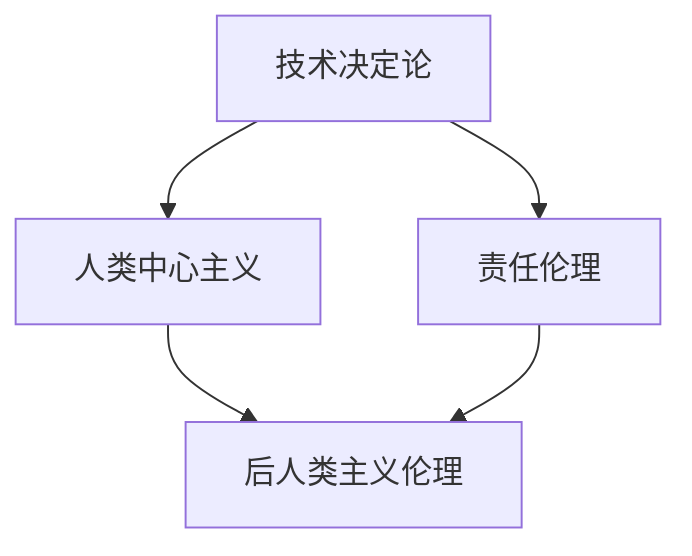

                 


### 标题：后人类主义伦理：技术进步中的意义重构

#### 关键词：
- 后人类主义伦理
- 技术进步
- 意义重构
- 伦理框架
- 实际应用

#### 摘要：
本文旨在探讨在技术不断进步的背景下，后人类主义伦理的重要性以及其意义重构的过程。我们将深入分析技术进步对伦理观念的影响，构建一个适应未来发展的伦理框架，并探讨其实际应用场景。

### 文章结构：

## 一、引言

在数字化和信息化的浪潮下，技术进步已经成为推动社会发展的关键力量。然而，技术进步的同时，也引发了一系列伦理问题，例如人工智能的伦理问题、数据隐私等。这些问题不仅关乎个人的权益，更涉及到社会和文明的未来。因此，探讨后人类主义伦理，重构技术的意义，显得尤为重要。

## 二、后人类主义伦理的核心概念与联系

后人类主义伦理是一种基于对人类与技术融合的理解，强调技术对人类生活和价值观影响的伦理观念。其核心概念包括：

1. **技术决定论**：技术是影响人类命运的重要因素。
2. **人类中心主义**：强调人类在技术进步中的主导地位。
3. **责任伦理**：强调技术开发者和使用者对技术的责任。

这些概念之间的联系可以用以下Mermaid流程图表示：



## 三、技术进步对伦理的影响

1. **隐私与安全**：随着大数据和人工智能技术的发展，个人隐私和安全问题日益突出。
2. **人工智能的伦理问题**：如歧视、自主权等。
3. **生物伦理**：如基因编辑、克隆技术等。

这些问题对现有的伦理观念提出了挑战，需要我们重新审视和重构技术的意义。

## 四、伦理框架的构建与案例分析

为了应对技术进步带来的伦理挑战，我们需要构建一个适应未来发展的伦理框架。以下是一个简化的伦理框架：

1. **原则**：尊重个人隐私、安全，促进人类福祉。
2. **规范**：制定具体的行为准则和规范。
3. **机制**：建立监督和评估机制。

通过案例分析和具体案例，我们可以更深入地理解这个伦理框架的实际应用。

## 五、意义重构的方法与工具

为了重构技术的意义，我们需要使用一系列方法和工具，包括：

1. **伦理审查**：对技术开发和应用的伦理影响进行评估。
2. **对话与协商**：涉及多方利益相关者，共同制定伦理规范。
3. **技术设计**：在技术设计和开发过程中融入伦理原则。

以下是一个简单的伪代码，用于描述伦理审查的过程：

```python
def ethical_review(technology):
    # 收集技术相关信息
    info = gather_information(technology)
    
    # 评估技术对隐私、安全等的影响
    impact = assess_impact(info)
    
    # 根据评估结果，提出改进建议
    if impact.is_high():
        suggest_improvements(impact)
    else:
        approve(technology)
```

## 六、实际应用案例

在本章节，我们将通过一个具体的应用案例，展示后人类主义伦理在实际应用中的效果。案例包括：

1. **应用场景**：介绍案例的具体应用背景。
2. **伦理问题**：分析案例中存在的伦理问题。
3. **解决方案**：提出解决方案，并分析其伦理意义。

## 七、小结

后人类主义伦理是应对技术进步带来的伦理挑战的重要途径。通过构建伦理框架、使用伦理审查工具和方法，我们可以更好地重构技术的意义，推动技术和社会的可持续发展。

## 八、拓展阅读

推荐阅读以下文献，以深入了解后人类主义伦理和技术进步的关联：

1. ...
2. ...

### 作者信息：

作者：AI天才研究院/AI Genius Institute & 禅与计算机程序设计艺术 /Zen And The Art of Computer Programming

