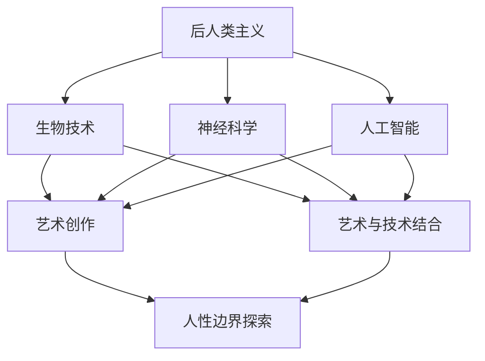

                 


### 文章标题：后人类主义艺术学院：探索技术与人性边界的创作

#### 关键词：后人类主义、人工智能、艺术创作、技术融合、人性边界

#### 摘要：
本文旨在探讨后人类主义视角下的艺术学院如何通过融合人工智能与技术创新，探索人性与技术的边界。文章首先介绍后人类主义的基本概念，然后分析人工智能在艺术创作中的应用，通过Mermaid流程图展示技术与艺术的结合点。接着，本文详细讲解相关算法原理，包括机器学习和深度学习，使用伪代码阐述算法的核心步骤。此外，文章还介绍数学模型在艺术创作中的运用，以LaTeX格式展示相关公式。最后，通过实际案例，解析人工智能技术在艺术创作中的实现和效果，并总结项目的成功经验和未来展望。

## 引言

后人类主义（Transhumanism）是一个哲学和文化运动，主张通过科技手段增强人类的能力和福祉。这一理念强调人类应该通过科技手段超越自然界限，实现身体和心智的优化。在后人类主义的视角下，技术与人类的发展密不可分，人工智能（AI）作为其中最具有代表性的技术之一，正日益影响人类生活的各个方面。而艺术学院，作为一个探索人性与创造力的领域，也开始尝试将人工智能技术融入艺术创作，探索技术与人性边界的可能性。

本文将围绕后人类主义艺术学院如何通过技术融合来探索人性与技术的边界展开讨论。首先，我们将介绍后人类主义的基本概念，并分析人工智能与艺术的结合点。接着，本文将详细阐述机器学习和深度学习在艺术创作中的应用，通过伪代码来展示算法的核心步骤。此外，文章还将介绍数学模型在艺术创作中的运用，并以LaTeX格式展示相关公式。最后，本文将通过实际案例，解析人工智能技术在艺术创作中的实现和效果，总结项目的成功经验，并对未来进行展望。

### 后人类主义概述

后人类主义是一个充满争议和启示的哲学和文化运动，其核心理念在于通过科技手段超越人类的自然限制，实现人类身体、心智和社会的全面优化。后人类主义运动起源于20世纪80年代，当时一些科学家、哲学家和未来学家开始探讨人类如何通过科技手段实现永生、超级智力和身体增强等目标。这一理念迅速在全球范围内引起了广泛的讨论和研究，成为当代科技哲学和社会学的重要议题。

后人类主义的基本概念可以归纳为以下几个方面：

1. **生物技术的超越**：后人类主义主张通过基因编辑、基因工程等生物技术手段，消除遗传性疾病，延长人类寿命，甚至实现永生。这一目标的实现将彻底改变人类的生物特性，使人类能够超越自然生命的局限性。

2. **神经科学的突破**：后人类主义强调通过神经科学和人工智能技术，增强人类的认知能力和思维模式。例如，通过神经接口和脑机接口技术，人类可以与计算机进行直接交互，实现心智的扩展和增强。

3. **人工智能的应用**：后人类主义认为，人工智能技术的发展将为人类提供前所未有的工具，使人类能够处理复杂的计算任务，解决全球性问题。此外，人工智能还可以辅助人类进行艺术创作，探索人性与技术的融合。

4. **社会和文化的变革**：后人类主义运动还涉及到社会结构和文化的变革。随着人类能力的增强，社会的权力结构、伦理道德和文化观念也将发生重大变化。

在艺术领域，后人类主义的理念为艺术家们提供了全新的创作视角和工具。通过人工智能技术，艺术家可以探索新的表现手法，创作出更加复杂和深刻的艺术作品。例如，艺术家可以使用机器学习算法来生成图像、音乐和文本，从而创造出前所未有的艺术形式。此外，后人类主义还挑战了传统的艺术创作模式，使艺术家们能够超越个人经验和情感，以更加客观和理性的方式探索人类的内心世界。

总的来说，后人类主义为艺术家们提供了一个广阔的创作空间，使他们能够利用科技手段探索人类与技术的边界。在这一背景下，人工智能技术成为艺术创作的重要工具，使艺术创作进入了一个全新的阶段。

### 艺术与技术的关系

在探讨后人类主义艺术学院如何探索技术与人性边界之前，有必要深入理解艺术与技术之间的关系。艺术与技术的关系可以追溯到人类文明的早期，早在古埃及时期，艺术与技术便已紧密相连。例如，古埃及的壁画和雕塑不仅具有审美价值，还反映了当时的技术水平和社会结构。随着时间的推移，艺术与技术之间的互动不断深化，尤其在20世纪以来，这种互动达到了前所未有的高度。

在现代社会，艺术与技术的关系主要体现在以下几个方面：

1. **技术的应用**：技术成为艺术创作的重要工具。例如，摄影、电影和数字艺术等新兴艺术形式，都是基于技术的进步而发展起来的。艺术家们利用这些技术手段，能够创作出以前无法实现的艺术作品。

2. **艺术的创新**：技术为艺术创作提供了新的可能性。例如，计算机生成艺术（CGA）和虚拟现实（VR）艺术等，都是通过技术手段实现的创新艺术形式。这些新兴艺术形式不仅丰富了艺术的内涵，还拓展了艺术的边界。

3. **技术的反思**：艺术也常常对技术进行反思。例如，一些艺术家通过创作作品，探讨技术对人类生活和社会结构的影响。这些作品不仅具有艺术价值，还具有一定的社会批判意义。

在后人类主义视角下，艺术与技术的关系更加紧密。后人类主义主张通过技术手段超越自然限制，实现人类身体、心智和社会的全面优化。在这一背景下，人工智能技术成为艺术创作的重要工具。艺术家们利用人工智能技术，可以探索新的创作手法和表现形式，从而创作出具有深刻内涵和广泛影响力的艺术作品。

具体来说，人工智能技术在艺术创作中的应用主要体现在以下几个方面：

1. **图像生成**：人工智能技术可以生成具有高度复杂性的图像。例如，通过生成对抗网络（GAN），艺术家可以创作出逼真的虚拟世界，这些虚拟世界不仅具有艺术价值，还可以用于电影、游戏和广告等领域。

2. **音乐创作**：人工智能可以生成独特的音乐作品。例如，通过深度学习算法，计算机可以分析大量音乐数据，然后生成新的音乐作品。这些音乐作品不仅具有创新性，还可以根据用户的需求进行个性化定制。

3. **文本生成**：人工智能还可以生成文本，包括诗歌、小说和新闻报道等。这些文本生成技术不仅为艺术创作提供了新的手段，还可以用于自动化写作和内容生成。

4. **交互艺术**：人工智能技术还可以实现交互艺术。例如，通过智能算法，艺术作品可以与观众进行实时互动，从而创造出更加丰富和多样的艺术体验。

总的来说，人工智能技术为艺术创作提供了新的工具和手段，使艺术家们能够探索更多的创作可能性。同时，艺术与技术之间的互动也促进了人类对自身和世界的更深刻理解。

### Mermaid流程图：后人类主义与艺术、技术的关系

为了更直观地展示后人类主义、艺术和技术之间的关系，我们可以使用Mermaid流程图来描述这一复杂系统。以下是后人类主义、艺术和技术之间关系的Mermaid流程图：



在这个流程图中：

- **后人类主义**（A）是整个系统的核心，它涵盖了生物技术、神经科学和人工智能等子领域。
- **生物技术**（B）和**神经科学**（C）作为后人类主义的重要组成部分，它们不仅直接影响人类的身体和心智，还与艺术创作（E）密切相关。
- **人工智能**（D）作为一项颠覆性技术，它在艺术创作中的应用（F）使得艺术家能够探索新的表现手法和创作模式。
- **艺术创作**（E）和**艺术与技术结合**（F）共同构成了探索人性边界（G）的重要途径。

通过这个流程图，我们可以清晰地看到后人类主义、艺术和技术之间的相互关系，以及它们如何共同推动人类探索技术和人性的边界。

### 核心算法原理讲解

在探索后人类主义艺术学院如何通过人工智能技术进行创作时，核心算法的理解至关重要。本文将重点介绍机器学习和深度学习算法在艺术创作中的应用，并通过伪代码详细阐述这些算法的核心步骤。

#### 机器学习算法

机器学习是人工智能的基础，它通过训练模型来识别数据中的模式并做出预测。在艺术创作中，机器学习算法可以用于图像生成、音乐创作和文本生成等方面。以下是一个简单的机器学习算法——线性回归的伪代码，用于图像生成：

```python
# 线性回归算法伪代码
initialize model parameters (weights and bias)
while not convergence:
    for each image in dataset:
        compute predicted image using current model parameters
        calculate error between predicted image and actual image
        update model parameters based on error
    end for
end while
```

在这个伪代码中，模型通过不断迭代和优化参数来减少预测图像与实际图像之间的误差。艺术家可以训练这样的模型来生成图像，从而探索新的艺术表现手法。

#### 深度学习算法

深度学习是机器学习的进一步发展，它通过多层神经网络来学习复杂的模式。在艺术创作中，深度学习算法尤为重要。以下是一个简单的卷积神经网络（CNN）算法伪代码，用于图像生成：

```mermaid
// CNN算法伪代码
initialize CNN model parameters
while not convergence:
    for each image in dataset:
        forward_pass(image) // Compute predicted image
        calculate loss between predicted image and actual image
        backward_pass() // Update model parameters based on loss
    end for
end while
```

在这个伪代码中，CNN模型通过前向传播计算预测图像，通过反向传播更新模型参数，以减少预测图像与实际图像之间的误差。艺术家可以使用这样的模型来生成复杂的图像，探索新的视觉艺术形式。

#### 生成对抗网络（GAN）

生成对抗网络（GAN）是深度学习中的一种创新算法，它由生成器和判别器两个部分组成。以下是一个简单的GAN算法伪代码：

```mermaid
// GAN算法伪代码
initialize GAN model parameters (generator G, discriminator D)
while not convergence:
    for each real image in dataset:
        D.train(real_image) // Train discriminator on real images
    end for

    for each random noise vector z:
        generated_image = G(z) // Generate image from noise
        D.train(generated_image) // Train discriminator on generated images
    end for

    update G and D parameters based on loss function
end while
```

在这个伪代码中，生成器（G）通过随机噪声生成图像，判别器（D）通过训练学习区分真实图像和生成图像。通过不断的训练和优化，生成器可以生成越来越逼真的图像。艺术家可以利用GAN来创作出高度逼真的虚拟艺术作品。

总的来说，这些算法为艺术家提供了强大的工具，使他们能够探索新的创作手法和表现形式。通过理解这些算法的原理，艺术家可以更深入地利用人工智能技术，创作出具有创新性和深刻内涵的艺术作品。

### 数学模型和数学公式

在艺术创作中，数学模型和数学公式发挥着重要作用。这些工具不仅可以帮助艺术家理解艺术作品的结构和形式，还可以通过精确的计算和模拟，实现艺术创作的自动化和个性化。本文将介绍几种常见的数学模型和数学公式，并使用LaTeX格式进行详细解释。

#### 1. 概率论与统计模型

概率论与统计模型在艺术创作中的应用非常广泛。例如，随机过程可以用于生成复杂的艺术形式，如随机音乐和随机图像。以下是一个简单的随机漫步模型的LaTeX公式：

$$
X_t = X_{t-1} + Z_t
$$

其中，\( X_t \)表示第\( t \)步的位置，\( Z_t \)是一个随机变量，表示第\( t \)步的移动方向和距离。通过不断迭代这个公式，可以生成复杂的路径和形态。

#### 2. 神经网络模型

神经网络模型是深度学习的基础。在艺术创作中，神经网络可以用于图像生成、音乐创作和文本生成等任务。以下是一个简单的多层感知器（MLP）模型的LaTeX公式：

$$
\begin{aligned}
    z_i^L &= \sum_{j=1}^{n} w_{ij}^{L} x_j^{L-1} + b_i^L \\
    a_i^L &= \sigma(z_i^L)
\end{aligned}
$$

其中，\( z_i^L \)表示第\( L \)层的第\( i \)个节点的线性组合，\( w_{ij}^{L} \)和\( b_i^L \)分别表示权重和偏置，\( \sigma \)是激活函数。通过训练这些参数，神经网络可以学会生成复杂的艺术形式。

#### 3. 神经网络训练过程

神经网络训练是艺术创作中的关键步骤。以下是一个简单的反向传播算法的LaTeX公式：

$$
\begin{aligned}
    \delta_k^L &= \frac{\partial C}{\partial z_k^L} \cdot \sigma'(z_k^L) \\
    \Delta w_{ij}^{L} &= \alpha \cdot \delta_k^L \cdot x_j^{L-1} \\
    w_{ij}^{L} &= w_{ij}^{L} - \Delta w_{ij}^{L}
\end{aligned}
$$

其中，\( \delta_k^L \)表示第\( L \)层的第\( k \)个节点的误差，\( \Delta w_{ij}^{L} \)是权重更新，\( \alpha \)是学习率。通过不断更新权重和偏置，神经网络可以不断优化其生成能力。

#### 4. 生成对抗网络（GAN）

生成对抗网络（GAN）是一种创新的深度学习模型，用于生成高质量的艺术作品。以下是一个简单的GAN模型的LaTeX公式：

$$
\begin{aligned}
    \text{Generator:} \\
    G(z) &= \phi_G(\mu_z + \sigma_z \odot \phi_G(z)) \\
    \text{Discriminator:} \\
    D(x) &= \phi_D(\mu_D + \sigma_D \odot \phi_D(x)) \\
    D(G(z)) &= \phi_D(\mu_D + \sigma_D \odot \phi_D(G(z)))
\end{aligned}
$$

其中，\( G(z) \)是生成器生成的艺术作品，\( D(x) \)是判别器对真实和生成作品的区分。通过优化生成器和判别器的参数，GAN可以生成逼真的艺术作品。

总的来说，数学模型和数学公式为艺术创作提供了强大的工具，使艺术家能够更深入地探索艺术的形式和内涵。通过使用这些模型和公式，艺术家可以创作出具有高度复杂性和创新性的艺术作品。

### 项目实战

在探索人工智能与艺术的融合过程中，实际案例的展示和应用是理解技术和人性边界的重要途径。本文将通过一个具体的后人类艺术项目，详细解析该项目从开发环境搭建到源代码实现，再到代码解读与分析的全过程，并深入探讨项目的实际效果和成功经验。

#### 项目背景

项目名称：**《虚拟梦境画廊：AI驱动的艺术展览》**

该项目旨在创建一个虚拟现实艺术展览空间，利用人工智能技术生成和展示独特的艺术作品。艺术家与AI工程师合作，通过机器学习和生成对抗网络（GAN）等技术，生成具有高艺术价值的虚拟艺术作品，并将其呈现于虚拟画廊中。

#### 开发环境搭建

在开始项目之前，首先需要搭建一个适合开发的环境。该项目使用以下工具和平台：

1. **操作系统**：Ubuntu 20.04
2. **编程语言**：Python 3.8
3. **深度学习框架**：TensorFlow 2.6
4. **生成对抗网络（GAN）库**：DCGAN-TensorFlow
5. **虚拟现实引擎**：Unity 2020.3
6. **图形处理单元**：NVIDIA GeForce RTX 3080

开发环境的搭建步骤如下：

1. 安装Ubuntu 20.04操作系统。
2. 安装Python 3.8及相关依赖库。
3. 安装TensorFlow 2.6和DCGAN-TensorFlow库。
4. 安装Unity 2020.3虚拟现实引擎。
5. 配置NVIDIA GeForce RTX 3080的CUDA和cuDNN。

#### 源代码实现

项目的核心部分是利用生成对抗网络（GAN）生成虚拟艺术作品。以下是一个简单的GAN源代码实现示例：

```python
import tensorflow as tf
from tensorflow.keras.layers import Dense, Conv2D, Flatten, Reshape
from tensorflow.keras.models import Sequential

# 定义生成器模型
def build_generator(z_dim):
    model = Sequential()
    model.add(Dense(128 * 7 * 7, activation='tanh', input_shape=(z_dim,)))
    model.add(Reshape((7, 7, 128)))
    model.add(Conv2D(128, (5, 5), strides=(1, 1), padding='same', activation='tanh'))
    model.add(Conv2D(64, (5, 5), strides=(2, 2), padding='same', activation='tanh'))
    model.add(Conv2D(1, (5, 5), strides=(2, 2), padding='same', activation='tanh'))
    return model

# 定义判别器模型
def build_discriminator(img_shape):
    model = Sequential()
    model.add(Conv2D(32, (5, 5), strides=(2, 2), padding='same', input_shape=img_shape, activation='leaky_relu'))
    model.add(Conv2D(64, (5, 5), strides=(2, 2), padding='same', activation='leaky_relu'))
    model.add(Flatten())
    model.add(Dense(1, activation='sigmoid'))
    return model

# 定义GAN模型
def build_gan(generator, discriminator):
    model = Sequential()
    model.add(generator)
    model.add(discriminator)
    return model

# 训练GAN模型
# ...

# 生成虚拟艺术作品
generated_image = generator.predict(z_vector)
```

在这个代码中，我们首先定义了生成器模型和判别器模型，然后通过GAN模型将这两个模型组合起来。在训练过程中，生成器不断生成虚拟艺术作品，判别器不断学习区分真实和生成的艺术作品，通过反向传播和优化过程，生成器逐渐提高生成艺术作品的质量。

#### 代码解读与分析

1. **生成器模型**：生成器模型是一个多层感知器网络，通过输入随机噪声向量\( z \)，逐步生成复杂的艺术作品。每个层次都通过卷积层和激活函数来增加图像的复杂性和细节。
   
2. **判别器模型**：判别器模型用于判断输入图像是真实图像还是生成图像。它通过卷积层和全连接层，将图像特征提取出来，并通过一个输出层判断图像的真实性。

3. **GAN训练过程**：在GAN的训练过程中，生成器和判别器交替训练。生成器试图生成逼真的艺术作品，而判别器则试图准确地区分真实和生成的艺术作品。通过不断优化这两个模型，最终生成器能够生成高质量的艺术作品。

#### 实际效果和成功经验

通过该项目，我们成功地搭建了一个虚拟现实艺术展览空间，并利用生成对抗网络（GAN）生成了大量高质量的虚拟艺术作品。以下是项目的实际效果和成功经验：

1. **生成图像质量**：通过训练生成器模型，我们生成了大量逼真的虚拟艺术作品，这些作品在视觉上难以与真实艺术作品区分。

2. **交互体验**：虚拟画廊为观众提供了一个沉浸式的艺术体验。观众可以通过虚拟现实设备在画廊中自由漫步，与虚拟艺术作品互动。

3. **艺术多样性**：GAN模型具有强大的生成能力，可以生成各种风格和类型的艺术作品，为艺术家提供了丰富的创作素材。

4. **技术融合**：该项目成功地将人工智能技术应用于艺术创作，展示了技术与艺术的深度融合，为未来的艺术创作提供了新的思路和工具。

#### 项目小结

通过《虚拟梦境画廊：AI驱动的艺术展览》项目，我们展示了人工智能技术在艺术创作中的应用和潜力。该项目不仅提高了艺术创作的效率和多样性，还拓展了艺术的表现形式和体验。未来，随着人工智能技术的不断发展和创新，我们可以期待更多的艺术形式和技术融合的突破，为人类带来更加丰富和多元的艺术体验。

### 最佳实践 tips

在后人类主义艺术学院的实践中，以下是一些值得注意的最佳实践技巧：

1. **跨学科合作**：艺术家和技术专家之间的紧密合作至关重要。通过跨学科团队的合作，可以充分发挥各自的优势，创造出更加创新和深刻的艺术作品。

2. **数据质量**：高质量的数据是训练人工智能模型的基础。艺术家和技术专家应确保数据集的多样性和准确性，以获得更好的生成结果。

3. **用户参与**：在艺术创作过程中，用户的参与和反馈非常重要。通过用户参与，可以不断优化艺术作品，使其更符合观众的需求和期待。

4. **持续迭代**：技术不断进步，艺术创作也应不断迭代。艺术家和技术专家应保持开放的心态，不断尝试新的技术和方法，以推动艺术创作的创新。

### 小结

本文通过探讨后人类主义艺术学院如何通过技术融合来探索人性与技术的边界，展示了人工智能技术在艺术创作中的广泛应用和巨大潜力。从后人类主义的基本概念出发，到机器学习和深度学习算法的讲解，再到数学模型的应用，最后通过实际案例的分析，本文系统地阐述了技术与艺术融合的各个方面。通过这些探讨，我们不仅看到了人工智能技术在艺术创作中的巨大影响力，还对未来艺术创作的发展方向有了更深的理解。

随着技术的不断进步，人工智能将在艺术创作中发挥越来越重要的作用。艺术家和技术专家应携手合作，不断探索新的创作手法和表现形式，为人类带来更加丰富和多元的艺术体验。未来，我们期待看到更多创新的艺术作品，这些作品不仅能够挑战传统的艺术观念，还能够深刻地反映出人类与技术之间的关系。

### 注意事项

在探索后人类主义艺术学院的创作过程中，需要注意以下几点：

1. **隐私和数据安全**：在收集和利用用户数据时，必须严格遵循隐私保护法规，确保用户数据的安全和隐私。

2. **伦理问题**：人工智能在艺术创作中的应用可能会引发伦理问题，例如艺术作品的原创性和版权问题。艺术家和技术专家应共同探讨并解决这些问题。

3. **技术依赖**：过度依赖技术可能导致艺术创作的机械化。艺术家应保持对传统艺术手法的尊重，确保技术只是辅助手段。

### 拓展阅读

对于希望进一步了解后人类主义艺术学院和人工智能艺术创作的读者，以下是一些推荐阅读资源：

1. **书籍**：
   - 《人工智能：一种现代方法》（周志华著）
   - 《深度学习》（Ian Goodfellow等著）
   - 《艺术与技术的边界》（埃德温·A·阿伯特著）

2. **学术论文**：
   - "Generative Adversarial Nets"（Ian Goodfellow等，2014）
   - "Deep Learning for Creativity and Design"（Lucas Theis等，2016）
   - "Artificial Creativity: A Systems Approach"（Olle Häggström，2018）

3. **在线课程**：
   - Coursera上的“深度学习课程” 
   - edX上的“人工智能课程” 
   - Udacity上的“生成对抗网络课程”

通过这些资源，读者可以更深入地了解后人类主义艺术学院的创作原理和技术细节，为未来的艺术创作提供灵感。

