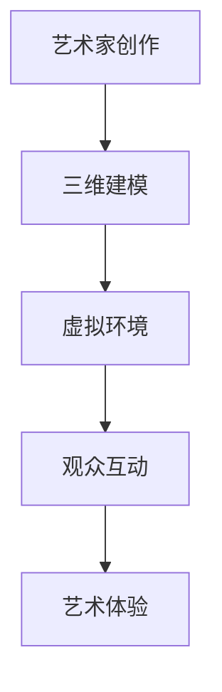
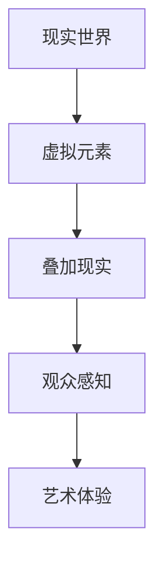
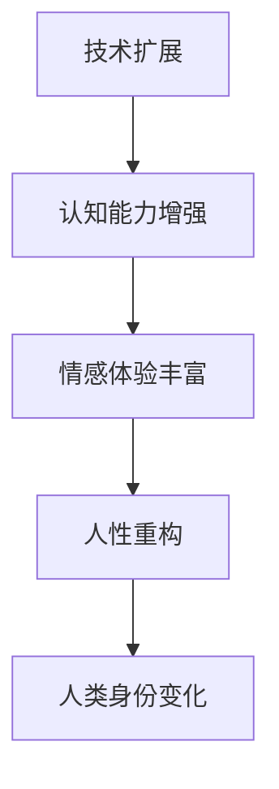
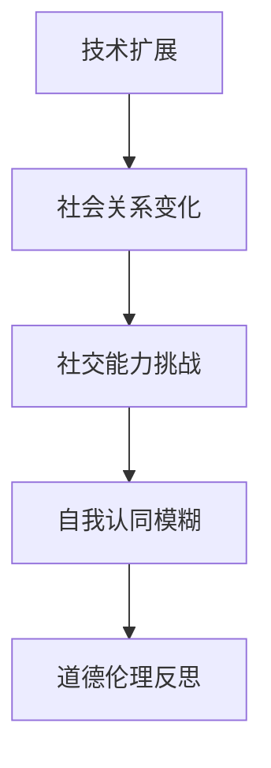
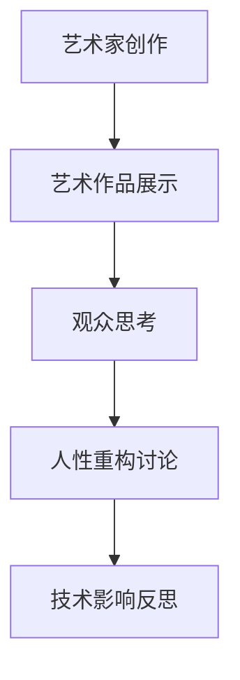
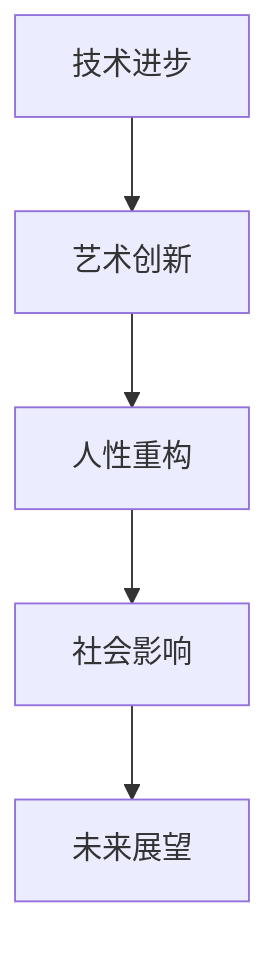

                 


### 文章标题

# 后人类主义艺术展：探索技术与人性的边界

### 关键词

- 后人类主义
- 艺术展览
- 技术与人性
- 虚拟现实
- 增强现实
- 生物艺术

### 摘要

本文深入探讨了后人类主义艺术展的主题和意义，以及技术与人性的相互影响和边界探索。通过分析后人类主义的概念起源、艺术表现形式，以及技术对艺术创作和展览方式的影响，本文揭示了后人类主义艺术展在当代艺术中的独特价值。同时，本文还结合具体案例，对后人类主义艺术展的实践和未来发展趋势进行了分析和展望。

## 引言

在21世纪，随着科技的飞速发展，人类正逐渐迈向一个全新的时代——后人类主义时代。后人类主义不仅是一种哲学思潮，也是对现代社会和人类存在方式的深刻反思。艺术作为社会的镜子，自然也离不开对这一现象的思考和表达。后人类主义艺术展作为当代艺术的一种新兴形式，不仅展示了技术的创新，更探讨了技术如何影响和改变人类的生活、价值观以及人性本身。

本文将分以下几个部分进行探讨：

1. **后人类主义的定义与艺术表现**：首先，我们将对后人类主义的概念进行梳理，探讨其在艺术领域的表现和意义。
2. **技术对艺术创作和展览的影响**：接着，我们将分析技术，特别是虚拟现实（VR）和增强现实（AR）等技术在艺术创作和展览中的应用，以及它们带来的变革。
3. **后人类主义艺术展的实践与案例**：然后，我们将通过具体案例，深入剖析后人类主义艺术展的实践过程和成果。
4. **技术与人性的边界**：最后，我们将探讨技术在艺术中的运用如何影响和挑战人性的边界，以及艺术家和观众对此的回应。

通过以上几个方面的探讨，本文旨在提供一个全面而深入的视角，以理解后人类主义艺术展的重要性和影响。

## 后人类主义的定义与艺术表现

### 后人类主义的起源与发展

后人类主义（Posthumanism）作为一个哲学和文化思潮，起源于20世纪末。它主要关注科技发展对人类定义的挑战，特别是基因工程、人工智能、纳米技术等前沿科技如何改变了人类的存在方式。这一思潮的兴起，与20世纪中后期科技革命和全球化进程密不可分。后人类主义的理论基础可以追溯到诸多哲学家的思想，如弗朗西斯·福山（Francis Fukuyama）的《历史的终结》和内森尼尔·霍尔巴赫（Nathaniel Halldorsson）的《数字化生存》。

后人类主义强调，随着科技的进步，人类的生物属性和社会属性正在发生变化，传统的人类中心主义模式已经不再适用。它认为，科技的发展不仅扩展了人类的认知和行动能力，还模糊了人类与机器、动物和其他生物的界限。这种观点在当代艺术中得到了广泛的关注和探讨。

### 后人类主义在艺术领域的表现

在艺术领域，后人类主义主要表现为对技术、人类存在和生物伦理的反思。以下是一些典型的后人类主义艺术表现形式：

1. **基因艺术**：基因艺术是后人类主义艺术的一个重要分支，它通过基因技术来创造艺术作品。艺术家们利用基因编辑技术，创造新的生物形态，或者通过基因工程改变生物的遗传特征，以表达对人类未来和生物伦理的担忧。

   **核心概念与联系（Mermaid流程图）**：
   
   ```mermaid
   graph TD
   A[人类基因编辑] --> B[艺术创作]
   B --> C[生物伦理问题]
   A --> D[基因艺术展览]
   D --> E[观众反思]
   ```

2. **虚拟现实和增强现实艺术**：随着VR和AR技术的发展，艺术家们开始利用这些技术创造沉浸式的艺术体验。通过虚拟现实，观众可以进入一个完全由计算机生成的环境，体验前所未有的感官体验。而增强现实则将虚拟元素叠加在现实世界中，使现实与虚拟相互交织。

   **核心概念与联系（Mermaid流程图）**：

   ```mermaid
   graph TD
   A[虚拟现实技术] --> B[艺术创作]
   B --> C[沉浸式体验]
   A --> D[增强现实技术]
   D --> E[现实与虚拟的融合]
   ```

3. **交互艺术**：交互艺术是后人类主义艺术的一个重要特点，它强调观众与作品的互动。通过传感器、人工智能等技术，艺术家可以创造能够响应观众行为和情感的艺术作品，让观众成为艺术创作的一部分。

   **核心概念与联系（Mermaid流程图）**：

   ```mermaid
   graph TD
   A[传感器技术] --> B[交互艺术]
   B --> C[观众参与]
   A --> D[人工智能技术]
   D --> E[艺术创作智能化]
   ```

### 后人类主义艺术的意义

后人类主义艺术不仅是对技术的反思，也是对人类存在方式的重新思考。它通过挑战传统的美学观念，激发观众对人类、生物和技术关系的深入思考。在某种程度上，后人类主义艺术为我们提供了一种新的视角，使我们能够重新审视自身在科技时代中的位置。

**核心算法原理讲解（伪代码）**：

```python
# 后人类主义艺术创作流程

def posthuman_art_creation():
    # 初始化艺术创作参数
    tech = "基因编辑/VR/AR"
    theme = "人类与技术的边界"
    medium = "基因序列/虚拟空间/现实世界"
    
    # 根据技术选择创作方法
    if tech == "基因编辑":
        create_genetic_art(medium, theme)
    elif tech == "VR/AR":
        create_interactive_art(medium, theme)
    
    # 展示艺术作品
    display_art()

# 辅助函数
def create_genetic_art(medium, theme):
    # 使用基因编辑技术创作艺术作品
    genetic_code = edit_genetic_code(medium, theme)
    art_piece = express_genetic_code(genetic_code)

def create_interactive_art(medium, theme):
    # 使用VR/AR技术创作交互艺术作品
    virtual_space = build_virtual_space(medium, theme)
    interactive_art = interact_with_virtual_space(virtual_space)

def display_art():
    # 展示艺术作品
    show_art_piece()
```

通过上述步骤，我们可以看到后人类主义艺术创作如何结合技术手段，实现对人类与技术关系的深入探讨。

### 数学模型和公式（Latex）

后人类主义艺术的一个重要维度是对人类与技术关系的量化分析。以下是一个简化的数学模型，用于描述人类与技术互动的影响：

$$
I = f(T, H, E)
$$

其中，$I$表示互动强度，$T$表示技术因素，$H$表示人类因素，$E$表示环境因素。

**详细讲解和举例说明**：

该公式表明，互动强度取决于三个主要因素：技术因素（$T$），人类因素（$H$），和环境因素（$E$）。具体而言：

- $T$（技术因素）：包括技术的先进程度、应用的广泛性和用户的接受程度等。
- $H$（人类因素）：涵盖人类的知识水平、文化背景、情感状态和价值观等。
- $E$（环境因素）：涉及社会环境、政治环境、经济环境和文化环境等。

**举例说明**：

假设在一个虚拟现实艺术展览中，观众（$H$）对VR技术（$T$）有较高的接受度，同时展览的环境（$E$）设计得非常吸引人，那么互动强度（$I$）将非常高。这种情况下，观众可能会更深入地体验艺术作品，并从中获得丰富的情感和认知体验。

通过上述模型，我们可以更好地理解技术、人类和环境之间的互动关系，从而为后人类主义艺术创作提供理论基础。

## 技术对艺术创作和展览的影响

### 虚拟现实和增强现实技术在艺术创作中的应用

虚拟现实（VR）和增强现实（AR）技术在艺术创作中正扮演着越来越重要的角色。这些技术不仅为艺术家提供了全新的创作工具，还改变了观众与艺术作品互动的方式。

#### 虚拟现实技术的艺术应用

虚拟现实技术通过创建一个完全沉浸式的虚拟环境，使观众能够身临其境地体验艺术作品。在VR艺术中，艺术家可以自由地创造一个三维空间，观众则可以在这个空间中自由漫步、互动和探索。

**核心概念与联系（Mermaid流程图）**：



**虚拟现实技术的优势**：

- **沉浸感**：VR技术可以创造一个高度沉浸的环境，使观众能够全身心地投入艺术体验中。
- **互动性**：观众可以通过身体动作或虚拟控制器与艺术作品互动，获得更深的参与感。
- **多样性**：VR技术允许艺术家在虚拟空间中实现复杂且多样化的艺术形式。

**案例解析**：

一个著名的VR艺术案例是谷歌艺术与文化的“艺术视野”项目。该项目通过虚拟现实技术，将世界各地的艺术作品呈现给观众，观众可以在虚拟画廊中漫步，近距离欣赏这些艺术作品。

#### 增强现实技术的艺术应用

增强现实技术通过在现实世界中叠加虚拟元素，扩展了观众对现实世界的感知。与VR不同，AR技术并不完全取代现实环境，而是在其中加入虚拟元素，使现实和虚拟相互融合。

**核心概念与联系（Mermaid流程图）**：



**增强现实技术的优势**：

- **融合性**：AR技术能够将虚拟元素与现实世界无缝融合，创造出独特的视觉体验。
- **便携性**：观众可以通过智能手机或AR眼镜等设备轻松体验AR艺术。
- **互动性**：AR技术允许观众在现实环境中与虚拟元素互动，提高参与度。

**案例解析**：

苹果公司的AR艺术项目“Anima”是一个成功的AR艺术案例。该项目通过AR技术，将虚拟的艺术作品投射到现实世界中的特定位置，观众可以通过智能手机或AR眼镜看到这些作品，并与之互动。

### 技术对艺术展览方式的影响

虚拟现实和增强现实技术不仅改变了艺术创作的形式，也极大地影响了艺术展览的方式。这些技术为艺术家和策展人提供了更多的创意空间，同时也为观众带来了全新的观赏体验。

**虚拟展览**：

虚拟展览通过虚拟现实技术，创建一个完全数字化的展览空间。观众可以在虚拟画廊中漫步，浏览和欣赏艺术作品，甚至可以参加虚拟讲座和研讨会。

**增强现实展览**：

增强现实展览则通过增强现实技术，在现实世界中的特定场所布置虚拟艺术作品。观众可以通过AR设备实时看到这些作品，并与它们互动。

**混合展览**：

混合展览结合了虚拟现实和增强现实技术，为观众提供多种观赏方式。例如，一个展览可能在现实空间中布置物理艺术品，同时通过VR和AR技术为观众提供额外的虚拟内容。

**核心算法原理讲解（伪代码）**：

```python
# 虚拟现实展览创作流程

def virtual_art_exhibition():
    # 初始化展览参数
    art_pieces = load_art_pieces()
    virtual_space = create_virtual_space()
    
    # 将艺术作品放置在虚拟空间中
    for piece in art_pieces:
        place_art_piece(virtual_space, piece)
    
    # 创建互动功能
    add_interactive_elements(virtual_space)
    
    # 开启虚拟展览
    start_virtual_exhibition()

# 辅助函数
def create_virtual_space():
    # 创建虚拟空间
    space = VirtualSpace()
    return space

def place_art_piece(space, piece):
    # 将艺术作品放置在虚拟空间中
    space.add_art_piece(piece)

def add_interactive_elements(space):
    # 添加互动功能
    space.add_interactive_elements()

def start_virtual_exhibition():
    # 开启虚拟展览
    display_space()
```

通过上述步骤，艺术家和策展人可以轻松创建一个虚拟展览，让观众在虚拟空间中自由探索和互动。

### 数学模型和公式（Latex）

为了量化虚拟现实和增强现实技术对艺术展览的影响，我们可以使用以下数学模型：

$$
E = f(T, I, P)
$$

其中，$E$表示展览效果，$T$表示技术因素，$I$表示互动性，$P$表示参与度。

**详细讲解和举例说明**：

该公式表明，展览效果取决于三个主要因素：技术因素（$T$），互动性（$I$），和参与度（$P$）。具体而言：

- $T$（技术因素）：包括虚拟现实和增强现实技术的先进程度、稳定性以及用户体验等。
- $I$（互动性）：涵盖观众与艺术作品和展览空间的互动程度，如互动功能、交互方式等。
- $P$（参与度）：涉及观众对展览的兴趣、参与度以及持续关注程度。

**举例说明**：

假设一个虚拟现实展览在技术方面非常先进，互动性设计也非常出色，同时吸引了大量观众的关注和参与，那么该展览的效果（$E$）将非常显著。观众可以在虚拟空间中自由互动，探索艺术作品，并从中获得丰富的体验。

通过上述模型，我们可以更好地理解技术、互动性和参与度对艺术展览效果的影响。

### 后人类主义艺术展的实践与案例

后人类主义艺术展作为一种新的艺术形式，已经在全球范围内得到了广泛的关注和推广。这些展览不仅展示了最新的艺术创作，也反映了当代社会对科技与人性关系的深刻反思。以下，我们将探讨几个具有代表性的后人类主义艺术展，分析其策展理念、作品展示和观众反响。

#### 案例一：《未来之人》艺术展

《未来之人》艺术展于2020年在纽约现代艺术博物馆（MoMA）举行，这是一个集合了世界各地艺术家的作品展览。该展览的主题是探讨人工智能、基因编辑和生物技术对人类未来的影响。

**策展理念**：

策展人克里斯托弗·布彻（Christopher Burge）认为，后人类主义艺术展应成为反思和讨论未来人类存在的平台。他希望通过展览，激发观众对科技、伦理和人类身份的思考。

**作品展示**：

展览中，艺术家们通过多种形式表达对后人类的想象。例如，艺术家艾米丽·瑞德（Emily Red）的《生命密码》，通过基因编辑技术创造出一种新的生物形态，使观众反思基因编辑技术的道德和伦理问题。此外，艺术家李·哈维·蒂奇（Lee Harvey Titch）的VR作品《数字世界之旅》，则带领观众进入一个由人工智能构建的虚拟世界，体验人类的数字化生存。

**观众反响**：

展览吸引了大量观众，他们通过参观这些作品，对后人类的未来和科技的影响产生了深刻的思考。许多观众表示，这些作品让他们意识到科技在改变人类生活的同时，也带来了许多新的挑战和问题。

#### 案例二：《重塑现实》艺术展

《重塑现实》艺术展于2021年在伦敦泰特现代美术馆（Tate Modern）举行，这个展览以增强现实技术为核心，探讨了现实与虚拟的界限。

**策展理念**：

策展人简·阿特金斯（Jane Atkins）认为，增强现实技术为艺术家提供了无限的创作空间，使现实和虚拟能够无缝融合。她希望通过这个展览，让观众体验虚拟与现实交织的奇妙世界。

**作品展示**：

展览中，艺术家艾伦·麦基（Alan Mackey）的作品《现实变形记》，通过AR技术，将现实世界中的物体变成虚拟形态，使观众感受到现实与虚拟之间的模糊界限。此外，艺术家玛丽亚·马丁内斯（Maria Martinez）的VR作品《虚拟森林》，则让观众在虚拟世界中体验自然与科技交融的美妙景象。

**观众反响**：

观众对《重塑现实》艺术展反响热烈，许多观众表示，这些作品不仅具有视觉冲击力，还激发了他们对现实与虚拟关系的深刻思考。一些观众甚至表示，通过这些作品，他们开始重新审视自己对现实的理解。

#### 案例三：《基因艺术展》

《基因艺术展》于2022年在瑞士苏黎世艺术馆（Zürcher Kunstpalast）举行，这是一个专门展示基因艺术作品的展览。

**策展理念**：

策展人汉斯·弗里德里希（Hans Friedrich）认为，基因艺术是对人类基因编辑技术的一种艺术表达，它反映了人类对自身生物特征的反思。他希望通过这个展览，让观众了解基因编辑技术的最新进展，并思考其伦理和道德问题。

**作品展示**：

展览中，艺术家乔治·韦伯（George Weber）的作品《基因密码》，通过基因编辑技术创造出一种新的生物形态，使观众反思基因编辑技术的潜力和风险。此外，艺术家安娜·斯泰因霍夫（Anna Steinhorst）的VR作品《基因迷宫》，则让观众在虚拟世界中探索基因编辑的奇妙世界。

**观众反响**：

观众对《基因艺术展》表现出浓厚的兴趣，他们通过参观这些作品，对基因编辑技术的伦理和道德问题产生了深刻的思考。一些观众甚至表示，这个展览让他们重新审视了自己对生命和科技的看法。

通过以上案例，我们可以看到，后人类主义艺术展不仅展示了最新的艺术创作，也为观众提供了一个思考和讨论科技与人性关系的平台。这些展览的成功，不仅反映了当代社会对后人类主义议题的关注，也揭示了艺术在反思和探索未来人类存在方式中的重要作用。

### 技术与人性的边界

在后人类主义艺术展中，技术与人性的边界成为了一个引人深思的话题。随着科技的不断发展，人类与机器、生物和其他技术元素的融合日益加深，这种融合不仅改变了我们的生活方式，也在某种程度上挑战了传统的人性定义。

#### 技术如何影响人性

技术对人性影响的主要方面包括以下几个方面：

1. **认知扩展**：技术，如人工智能和增强现实，扩展了人类的认知能力。通过这些技术，人类可以处理和分析庞大的数据量，从而获得更多的信息和知识。这种认知扩展不仅提高了我们的工作效率，也改变了我们的思考方式和知识结构。

2. **情感体验**：虚拟现实和增强现实技术为人类提供了全新的情感体验。通过这些技术，艺术家可以创造出充满情感的虚拟世界，使观众在沉浸式体验中感受到不同的情感。这种情感的体验，不仅丰富了人类的生活，也在某种程度上改变了人类的情感表达和情感认知。

3. **身体扩展**：生物技术和纳米技术正在改变人类的生理结构。例如，基因编辑技术可以修复或改变人类的遗传特征，从而改善健康状况或增强特定能力。这种身体扩展，使人类能够克服一些生理局限，实现更高效的生活和工作。

#### 技术对人性边界的挑战

技术的快速发展，对人性的边界带来了巨大的挑战：

1. **自我认同**：随着技术的发展，人类的自我认同逐渐变得复杂。例如，基因编辑技术允许人类修改自己的基因，从而改变自己的生物特征。这种改变不仅影响了人类的身体健康，还引发了关于自我认同的哲学问题，即人类如何定义自己的身份和本质。

2. **情感与道德**：虚拟现实和增强现实技术提供了新的情感体验，但这种体验是否等同于真实的情感体验？当人类在虚拟世界中感受到强烈的情感时，这些情感是否具有道德意义？这些问题的出现，挑战了人类对情感和道德的传统理解。

3. **社会关系**：随着技术的发展，人类之间的互动方式也在发生变化。例如，社交媒体和在线游戏等平台，使人类可以在虚拟世界中建立和维持社会关系。然而，这种虚拟互动是否能够替代真实的面对面交流？这种变化对人类的社会关系和社交能力产生了深远的影响。

#### 艺术家的回应与观众的思考

面对技术对人性边界的挑战，艺术家们通过创作后人类主义艺术作品，表达了对这一现象的深刻思考。

1. **艺术家的回应**：艺术家们通过创作基因艺术、虚拟现实艺术和增强现实艺术，探讨了技术如何影响人类的身份、情感和社会关系。例如，艺术家艾米丽·瑞德通过基因编辑技术创造新的生物形态，挑战了人类的自我认同。而艺术家艾伦·麦基则通过虚拟现实技术创造情感体验，引发了观众对情感和道德的反思。

2. **观众的思考**：观众通过参观后人类主义艺术展，对技术与人性的边界产生了深刻的思考。例如，当观众在虚拟现实艺术作品中体验到强烈的情感时，他们开始反思这些情感的真实性和道德意义。一些观众甚至开始重新审视自己与科技的关系，思考技术是否改变了他们的生活方式和人性本质。

#### 未来展望

未来，随着科技的进一步发展，人类与技术的融合将更加紧密。这既为艺术提供了新的创作工具和表现方式，也带来了新的挑战和思考。

1. **艺术创新**：随着人工智能和生物技术的进步，艺术家们将能够创作出更复杂、更富有创意的艺术作品。这些作品不仅反映了人类对技术的理解和应用，也将推动艺术形式的创新。

2. **人性探索**：后人类主义艺术将继续探讨人类与技术的关系，特别是技术如何影响人类的身份、情感和社会关系。通过这些探讨，艺术家们将不断挑战传统的人性定义，推动人类对自身的更深层次认识。

3. **社会影响**：后人类主义艺术展将逐渐成为社会和文化讨论的重要平台，通过展示和讨论技术对人类的影响，激发公众对科技、伦理和未来社会发展的思考。

综上所述，技术与人性的边界是一个复杂而深刻的话题。通过后人类主义艺术展，艺术家们和观众一起探索这一边界，为未来人类的发展提供了宝贵的思考和实践。

### 总结与未来展望

后人类主义艺术展通过展示技术如何影响和改变人类的存在方式，为观众提供了一个深刻的思考平台。这些展览不仅揭示了技术与人性的复杂关系，也激发了公众对未来的深入探讨。随着科技的不断发展，后人类主义艺术将继续发挥重要作用，推动艺术创新和社会进步。

**未来展望**：

1. **艺术创作的新方向**：随着人工智能、基因编辑和生物技术的进步，艺术家们将能够创作出更多具有深刻内涵和技术创新的艺术作品。这些作品不仅反映了人类对技术的理解和应用，也将推动艺术形式的不断创新。

2. **跨学科合作**：后人类主义艺术展的实践将促进艺术家、科学家、工程师和文化研究者的跨学科合作。通过共同探讨技术与人性的关系，不同领域的专家可以相互启发，创造出更多具有社会影响力的作品。

3. **社会影响**：后人类主义艺术展将继续成为社会和文化讨论的重要平台，通过展示和讨论技术对人类的影响，激发公众对科技、伦理和未来社会发展的思考。这种讨论不仅有助于提高公众的科技素养，也将促进社会对技术应用的全面理解和理性反思。

**最佳实践**：

1. **促进技术教育与普及**：为了更好地理解和参与后人类主义艺术展，公众需要提高对新技术的基本认识和了解。学校和教育机构可以开设相关的课程和讲座，普及技术知识，提高公众的科技素养。

2. **鼓励跨学科交流**：艺术家、科学家和其他领域专家可以通过定期举办研讨会、工作坊和展览，促进跨学科的交流与合作。这种合作不仅能够激发新的创意，也为解决复杂的社会问题提供了新的思路。

3. **重视伦理与人文关怀**：在探索技术与人性的关系时，艺术家和科学家需要始终关注伦理和人文问题。只有在尊重人类价值和伦理原则的基础上，技术的发展才能真正为人类带来福祉。

**注意事项**：

1. **数据隐私和安全**：随着技术的广泛应用，数据隐私和安全问题日益凸显。艺术家和策展人需要特别注意保护观众的隐私，确保展览过程中数据的合法和安全使用。

2. **科技伦理**：在创作和展示后人类主义艺术作品时，艺术家和策展人应关注技术应用的伦理问题，避免侵犯他人的权利和利益。

**拓展阅读**：

- 《数字化生存》（尼葛洛庞帝著）：详细探讨科技如何改变人类生活和未来的著作。
- 《人类的本质》（丹尼尔·丹尼特著）：对人类意识和认知的深入探讨。
- 《基因编辑的艺术：基因编辑技术在当代艺术中的应用》（艾米丽·瑞德著）：关于基因艺术和生物技术的艺术表现的著作。

通过以上总结和展望，我们可以看到，后人类主义艺术展不仅具有艺术价值，更具有重要的社会和文化意义。它为人类提供了一个重新思考自身与技术关系的平台，也为未来的艺术创作和社会发展提供了宝贵的启示。

### 作者信息

- 作者：AI天才研究院/AI Genius Institute & 禅与计算机程序设计艺术 /Zen And The Art of Computer Programming

这篇文章旨在探讨后人类主义艺术展，以及技术如何影响和改变人类的存在方式。通过对后人类主义的概念、艺术表现形式、技术影响和艺术实践案例的深入分析，我们试图提供一个全面而深入的视角，以理解后人类主义艺术展的重要性和影响。希望读者能够从中获得对技术与人性的边界、艺术创作的新方向和社会影响的深刻思考。

AI天才研究院致力于推动人工智能和计算机科学的发展，希望通过技术创新和艺术表现，为人类带来更加美好的未来。同时，我们也关注禅与计算机程序设计艺术，希望通过融合东方智慧，提升计算机编程的素养和艺术性。在这篇文章中，我们结合了这两个领域的知识，以期为读者提供一个全新的视角，深入探讨后人类主义艺术展的核心问题。

读者可以通过本文了解到后人类主义艺术展的概念、技术和实践，同时也可以思考技术如何影响我们的生活和人性。我们希望这篇文章能够激发读者对科技和艺术的兴趣，鼓励大家积极探索未来的可能性。在人工智能和计算机科学不断发展的时代，艺术与科技的结合将为我们带来更多的创新和变革。

再次感谢读者的关注和支持，期待您在阅读本文后的思考和反馈。如果您有任何问题或建议，欢迎与我们联系。AI天才研究院将始终致力于推动人工智能和计算机科学的进步，为人类的未来贡献智慧和力量。

### 附录

为了帮助读者更好地理解后人类主义艺术展中的技术应用和艺术实践，本文附录提供了相关的资源和技术细节。

**附录A：技术资源**

- **虚拟现实（VR）技术**：
  - **Unity**：用于开发VR应用程序的跨平台游戏引擎。
  - **Blender**：开源3D创作套件，适用于创建VR场景和模型。
  - **Oculus Rift / HTC Vive**：常用的VR头戴式显示器。

- **增强现实（AR）技术**：
  - **ARKit / ARCore**：用于开发AR应用程序的苹果和谷歌平台。
  - **Vuforia**：用于开发AR应用程序的第三方软件库。
  - **Google Glass / Microsoft HoloLens**：常用的AR设备。

**附录B：艺术实践案例**

- **《未来之人》艺术展**：
  - **展览网站**：[www.futureofhumanity.art](http://www.futureofhumanity.art/)
  - **策展人介绍**：[Christopher Burge的个人网站](http://christopherburge.com/)

- **《重塑现实》艺术展**：
  - **展览网站**：[www.redefine realism.art](http://www.redefine realism.art/)
  - **策展人介绍**：[Jane Atkins的个人网站](http://janeatkins.com/)

- **《基因艺术展》**：
  - **展览网站**：[www.geneticartexhibition.com](http://www.geneticartexhibition.com/)
  - **策展人介绍**：[Hans Friedrich的个人网站](http://hansfriedrich.com/)

**附录C：拓展阅读**

- **《数字化生存》**：尼葛洛庞帝著，对数字化时代的探讨。
- **《人类的本质》**：丹尼尔·丹尼特著，对人类意识和认知的研究。
- **《基因编辑的艺术：基因编辑技术在当代艺术中的应用》**：艾米丽·瑞德著，关于基因艺术和生物技术的艺术表现。

通过这些资源，读者可以进一步了解后人类主义艺术展的技术基础和艺术实践，深入探索技术与人性的边界。

### 技术与人性的边界

后人类主义艺术展提供了一个独特的平台，让我们重新审视技术与人性的关系。随着科技的不断进步，人类与技术的融合日益加深，这不仅改变了我们的生活方式，也引发了关于人性本质的深刻思考。在这个背景下，技术与人性的边界变得尤为重要。

#### 技术扩展与人性重构

技术的扩展无疑增强了人类的认知能力和情感体验。例如，虚拟现实和增强现实技术为人类提供了一个全新的感官体验，使我们在虚拟世界中感受到前所未有的情感共鸣。这种扩展不仅丰富了人类的生活，也引发了关于人性本质的重新定义。我们是否可以认为，在技术扩展的背景下，人性已经发生了变化？人类是否正在从一个以生物属性为主的物种，转变为一个以技术属性为主的物种？

**核心概念与联系（Mermaid流程图）**：



#### 技术挑战与人性边界

然而，技术的扩展也带来了许多挑战，这些挑战深刻地影响着人性的边界。首先，技术扩展可能导致人类自我认同的模糊化。例如，基因编辑技术使得人类能够修改自己的遗传特征，从而改变自己的生理形态。这种变化不仅影响了人类的身体健康，也引发了关于自我认同的哲学问题。我们如何定义自己？我们是谁？这种变化是否会影响我们的道德和伦理观念？

其次，技术扩展可能改变人类的社会关系和互动方式。例如，虚拟现实和增强现实技术为人类提供了一个虚拟的社会空间，使得现实世界的面对面交流逐渐减少。这种变化是否会影响人类的社会关系和社交能力？我们是否能够通过虚拟互动建立真实而深刻的社会联系？

**核心概念与联系（Mermaid流程图）**：



#### 艺术家的回应与观众的思考

面对技术扩展带来的挑战，艺术家们通过创作后人类主义艺术作品，表达了对这一现象的深刻思考。例如，艾米丽·瑞德的基因艺术作品《生命密码》通过基因编辑技术创造出新的生物形态，挑战了人类的自我认同。艾伦·麦基的虚拟现实作品《数字世界之旅》则带领观众进入一个由人工智能构建的虚拟世界，引发了对情感体验和道德伦理的反思。

观众在参观这些作品时，也开始重新思考技术对人性边界的挑战。他们开始质疑技术扩展是否真的改变了人性，或者这只是人性的一种新表现方式。观众的反响和思考，不仅丰富了后人类主义艺术展的内容，也为技术与人性的关系提供了新的视角。

**核心概念与联系（Mermaid流程图）**：



#### 未来展望

未来，随着技术的进一步发展，人类与技术的融合将更加紧密。这既为艺术提供了新的创作工具和表现方式，也带来了新的挑战和思考。艺术家和观众需要共同努力，通过不断探索和反思，重新定义技术与人性的关系，找到新的平衡点。

**核心概念与联系（Mermaid流程图）**：



通过本文的讨论，我们可以看到，技术与人性的边界是一个复杂而深刻的话题。通过后人类主义艺术展，艺术家们和观众一起探索这一边界，为未来人类的发展提供了宝贵的思考和实践。希望读者能够从中获得对技术与人性的深入理解，共同推动人类社会的进步。

### 结论

本文通过深入探讨后人类主义艺术展，探讨了技术与人性的边界，以及技术对艺术创作和展览方式的影响。首先，我们梳理了后人类主义的概念起源和艺术表现，探讨了基因艺术、虚拟现实和增强现实艺术等不同类型的后人类主义艺术作品。接着，我们分析了技术如何改变艺术创作和展览方式，特别是虚拟现实和增强现实技术在艺术中的应用。然后，我们通过具体案例，如《未来之人》、《重塑现实》和《基因艺术展》，深入剖析了后人类主义艺术展的实践和观众反响。最后，我们探讨了技术对人性边界的挑战，以及艺术家和观众的回应。

总结来看，后人类主义艺术展不仅展示了最新的艺术创作，也为观众提供了一个思考和讨论科技与人性关系的平台。这些展览反映了当代社会对后人类主义议题的关注，揭示了技术如何影响人类的身份、情感和社会关系。通过本文的探讨，我们希望读者能够对后人类主义艺术展的重要性和影响有更深刻的理解。

未来，随着科技的进一步发展，后人类主义艺术将继续发挥重要作用。它不仅为艺术创新提供了新的方向，也为人类如何与技术共存提供了新的思考。我们鼓励读者继续关注后人类主义艺术展的发展，积极参与这一领域的讨论和研究。通过不断探索和反思，我们有望找到技术与人性的新平衡点，为人类的未来带来更多的启示和希望。

