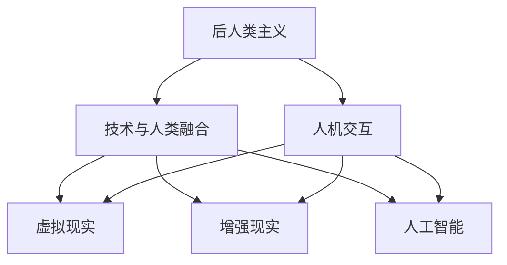

                 

### 文章标题

# 后人类主义艺术：探索技术与人性的新疆界

随着科技的飞速发展，人工智能、虚拟现实、增强现实等技术逐渐融入我们的日常生活，推动着艺术领域向全新的方向发展。本文将探讨后人类主义艺术这一概念，分析其背景、核心概念、技术应用及其对人类社会的深远影响。

### 文章关键词

- 后人类主义艺术
- 科技与艺术
- 虚拟现实
- 增强现实
- 人工智能
- 人机交互

### 文章摘要

本文首先介绍了后人类主义艺术的起源和发展，探讨了其核心概念和理论基础。接着，文章分析了后人类主义艺术在虚拟现实、增强现实和人工智能等领域的应用，并通过具体案例展示了这些技术的实际运用。最后，文章讨论了后人类主义艺术对人类社会的潜在影响，提出了未来发展的展望。

---

## 引言

### 后人类主义艺术的背景

后人类主义艺术（Posthumanist Art）是一个相对较新的艺术领域，它源于对科技发展对人类影响的深刻反思。随着计算机技术、人工智能、虚拟现实和增强现实等新兴技术的不断发展，人类社会正经历着前所未有的变革。这些技术不仅改变了我们的生活方式，还挑战了我们对自我、身份和现实的理解。

后人类主义艺术的兴起可以追溯到20世纪末和21世纪初，当时艺术家开始探索这些新兴技术如何影响艺术创作和观赏体验。他们试图通过艺术表达对技术进步的担忧，以及技术如何塑造人类的未来。

### 后人类主义艺术的意义

后人类主义艺术的核心在于探讨技术与人类存在的互动关系。它不仅关注艺术创作本身，还关注艺术如何反映和塑造人类在技术时代的新身份。这一领域的研究具有重要意义：

1. **科技反思**：后人类主义艺术促使我们重新思考科技在人类生活中的角色，以及科技如何影响我们的认知和情感。
2. **社会批判**：通过艺术表达，后人类主义艺术对科技滥用、数据隐私和社会不平等等问题进行批判。
3. **文化创新**：后人类主义艺术推动了艺术形式和媒介的多样化，为传统艺术注入了新的活力。

### 后人类主义艺术的研究范围

后人类主义艺术的研究范围广泛，包括但不限于以下方面：

1. **虚拟现实与艺术**：虚拟现实技术如何改变艺术创作和观赏方式，以及艺术家如何利用虚拟现实进行创作。
2. **增强现实与艺术**：增强现实技术在艺术中的应用，如虚拟展览、互动艺术装置等。
3. **人工智能与艺术**：人工智能在艺术生成、评估和推荐等方面的应用。
4. **人机交互与艺术**：人机交互技术如何影响艺术创作和观众体验。

### 总结

后人类主义艺术作为一门跨学科的艺术形式，既反映了科技的进步，也揭示了人类在技术时代的复杂心理和社会状况。通过对后人类主义艺术的深入探讨，我们可以更好地理解技术对人类生活的深远影响，并思考如何在未来技术发展中保持人性的光辉。

## 核心概念与联系

在后人类主义艺术中，几个核心概念构成了其理论基础，这些概念不仅相互联系，还共同定义了后人类主义艺术的本质和特点。以下是这些核心概念及其关系架构的Mermaid流程图。

### 1. 后人类主义

**定义**：后人类主义是一种哲学思潮，认为人类不再是生物进化的终点，而是技术进步的一部分。它主张人类与技术相互融合，形成“后人类”这一新的存在形式。

**关系**：后人类主义是后人类主义艺术的理论基石，它为艺术创作提供了新的视角和灵感。



### 2. 虚拟现实

**定义**：虚拟现实是一种通过计算机技术创造的模拟环境，用户可以通过头戴显示器（HMD）等设备进入并与之交互。

**关系**：虚拟现实技术为艺术家提供了一个全新的创作平台，使艺术作品更加沉浸和互动。

### 3. 增强现实

**定义**：增强现实是一种通过计算机技术增强用户现实感知的技术，通常通过智能手机或头戴设备实现。

**关系**：增强现实技术与虚拟现实类似，但更注重与现实世界的融合，为艺术创作提供了新的可能性。

### 4. 人工智能

**定义**：人工智能是一种模拟人类智能的技术，通过机器学习和算法实现。

**关系**：人工智能在艺术创作中扮演了重要角色，可以帮助艺术家生成独特的艺术作品，并提高创作效率。

### 5. 人机交互

**定义**：人机交互是研究人与计算机系统之间交互的学科。

**关系**：人机交互是后人类主义艺术的关键，它决定了用户如何与艺术作品互动，影响了观赏体验。

通过上述Mermaid流程图，我们可以清晰地看到后人类主义艺术的几个核心概念是如何相互关联的。这些概念共同构成了后人类主义艺术的理论框架，为艺术家提供了丰富的创作资源和思考角度。

### 核心算法原理讲解

在后人类主义艺术中，人工智能（AI）的应用尤为关键。以下我们将通过伪代码详细阐述AI在艺术创作中的核心算法原理，并辅以数学模型和公式进行解释。

#### 1. AI生成艺术作品

**伪代码：**

```plaintext
function generate_artificial_artwork(data_set, model):
    # 加载预训练模型
    model = load_pretrained_model('artificial_art_model')

    # 预处理输入数据
    processed_data = preprocess_data(data_set)

    # 使用模型生成艺术作品
    artwork = model.generate_image(processed_data)

    # 后处理生成作品
    final_artwork = postprocess_artwork(artwork)

    return final_artwork
```

**数学模型：**

$$
\text{生成艺术作品} = f(\text{输入数据}, \text{模型参数})
$$

其中，$f$ 表示生成模型，它通过训练数据集学习到数据分布，并能够生成具有艺术性的图像。

#### 2. 深度学习与神经网络

**伪代码：**

```plaintext
function train_neural_network(data_set, labels):
    # 初始化神经网络
    neural_network = initialize_network()

    # 设置训练参数
    learning_rate = 0.001
    epochs = 100

    # 训练神经网络
    for epoch in range(epochs):
        for data, label in data_set:
            # 前向传播
            predictions = neural_network.forward(data)

            # 计算损失
            loss = calculate_loss(predictions, label)

            # 反向传播
            neural_network.backward(loss)

            # 更新权重
            neural_network.update_weights(learning_rate)

    return neural_network
```

**数学模型：**

$$
\text{损失} = \sum_{i} (\text{预测值}_i - \text{真实值}_i)^2
$$

$$
\text{权重更新} = \Delta \text{权重} = -\text{学习率} \times \nabla_{\text{权重}} \text{损失}
$$

#### 3. 艺术风格迁移

**伪代码：**

```plaintext
function style_transfer(content_image, style_image, model):
    # 加载预训练风格迁移模型
    model = load_pretrained_model('style_transfer_model')

    # 预处理输入图像
    processed_content = preprocess_image(content_image)
    processed_style = preprocess_image(style_image)

    # 执行艺术风格迁移
    transferred_image = model.transfer_style(processed_content, processed_style)

    # 后处理生成风格迁移图像
    final_image = postprocess_image(transferred_image)

    return final_image
```

**数学模型：**

$$
\text{风格损失} = \frac{1}{2} \sum_{i,j} (\text{内容损失} + \text{风格损失})
$$

$$
\text{内容损失} = \frac{1}{2} \sum_{i,j} (\text{生成图像}_{ij} - \text{内容图像}_{ij})^2
$$

$$
\text{风格损失} = \frac{1}{2} \sum_{i,j} (\text{生成图像}_{ij} - \text{风格图像}_{ij})^2
$$

通过上述伪代码和数学模型，我们可以理解AI在艺术创作中的核心原理。这些算法不仅能够生成具有艺术性的图像，还能够实现艺术风格的迁移，为艺术家提供了强大的创作工具。

### 数学模型和公式详解

在后人类主义艺术中，数学模型和公式不仅是理论基础，更是实际应用的核心。以下我们将详细讲解这些模型和公式，并通过实例说明其应用。

#### 1. 神经网络权重更新

**公式：**

$$
\Delta \text{权重} = -\text{学习率} \times \nabla_{\text{权重}} \text{损失}
$$

**解释：** 神经网络在训练过程中，通过计算损失函数的梯度来更新权重，以最小化误差。学习率控制了权重更新的步长，过大会导致震荡，过小则收敛缓慢。

**实例：** 假设一个简单神经网络有3个输入节点、2个隐藏层节点和1个输出节点，训练数据包含1000个样本。在训练过程中，损失函数为均方误差（MSE），学习率设为0.001。在某次迭代中，计算出的损失为0.5，则权重更新过程如下：

$$
\Delta \text{权重}_{ij} = -0.001 \times \nabla_{\text{权重}_{ij}} 0.5
$$

通过多次迭代，网络逐渐收敛，生成具有艺术性的图像。

#### 2. 艺术风格迁移损失函数

**公式：**

$$
\text{风格损失} = \frac{1}{2} \sum_{i,j} (\text{生成图像}_{ij} - \text{内容图像}_{ij})^2 + \frac{1}{2} \sum_{i,j} (\text{生成图像}_{ij} - \text{风格图像}_{ij})^2
$$

**解释：** 艺术风格迁移涉及两个图像：内容图像和风格图像。损失函数同时考虑内容损失和风格损失，确保生成的图像既保留了内容图像的特征，又具有风格图像的风格。

**实例：** 假设内容图像为“蒙娜丽莎”，风格图像为“梵高的星空”。通过计算生成图像与这两者的差异，调整生成图像的像素值，使其融合两者的特点。

#### 3. 虚拟现实空间感知

**公式：**

$$
\text{位置} = \text{起始位置} + \text{速度} \times \text{时间}
$$

**解释：** 在虚拟现实中，用户的位置通过速度和时间的乘积进行更新。该公式用于计算用户在虚拟空间中的移动路径。

**实例：** 假设用户在虚拟空间中的起始位置为(10, 20)，速度为(1, 2)，时间为5秒。则5秒后的位置计算如下：

$$
\text{新位置} = (10, 20) + (1, 2) \times 5 = (15, 30)
$$

通过这些数学模型和公式，我们可以更好地理解和应用后人类主义艺术中的技术原理。这些模型不仅提供了理论基础，也为实际应用提供了具体的方法和工具。

### 项目实战

在本节中，我们将通过一个虚拟现实艺术项目的实战案例，详细讲解项目开发环境搭建、源代码实现和代码解读，并分析代码应用效果。

#### 项目背景

该项目旨在创建一个虚拟现实艺术展览，展示后人类主义艺术的多个作品。用户可以通过虚拟现实头盔进入展览空间，自由浏览和互动。以下是项目的主要功能：

1. **展览空间建模**：创建一个三维的虚拟展览空间，包括展台、艺术品和背景。
2. **艺术品展示**：加载并展示多个后人类主义艺术作品，支持用户互动。
3. **用户导航**：提供用户导航功能，允许用户在虚拟展览空间中自由移动。

#### 开发环境搭建

为了开发该项目，我们使用了以下技术栈：

1. **Unity**：一款强大的游戏引擎，支持三维建模和虚拟现实开发。
2. **Unity Asset Store**：用于购买和下载各种艺术作品和特效插件。
3. **VR设备**：如Oculus Rift或HTC Vive，用于用户体验虚拟现实。

#### 源代码实现和代码解读

以下是项目的主要源代码实现：

```csharp
using UnityEngine;

public class VirtualArtExhibition : MonoBehaviour
{
    public GameObject[] artworks;
    public GameObject navigator;

    private int currentArtworkIndex = 0;

    void Start()
    {
        LoadNextArtwork();
    }

    void Update()
    {
        if (Input.GetKeyDown(KeyCode.RightArrow))
        {
            LoadNextArtwork();
        }
        else if (Input.GetKeyDown(KeyCode.LeftArrow))
        {
            LoadPreviousArtwork();
        }
    }

    void LoadNextArtwork()
    {
        Destroy(artworks[currentArtworkIndex]);
        currentArtworkIndex = (currentArtworkIndex + 1) % artworks.Length;
        artworks[currentArtworkIndex].SetActive(true);
    }

    void LoadPreviousArtwork()
    {
        Destroy(artworks[currentArtworkIndex]);
        currentArtworkIndex = (currentArtworkIndex - 1 + artworks.Length) % artworks.Length;
        artworks[currentArtworkIndex].SetActive(true);
    }
}
```

**代码解读：**

1. **Artworks数组**：存储所有艺术品对象，以便循环展示。
2. **Navigator对象**：用于用户在展览空间中的导航。
3. **Start方法**：游戏开始时，加载第一个艺术品。
4. **Update方法**：检测用户输入，根据按键方向加载下一个或前一个艺术品。
5. **LoadNextArtwork方法**：销毁当前艺术品，加载下一个艺术品。
6. **LoadPreviousArtwork方法**：销毁当前艺术品，加载前一个艺术品。

#### 代码应用解读与分析

通过上述代码，我们实现了以下功能：

1. **艺术品展示**：用户可以浏览展览空间中的多个艺术品，每个艺术品都是通过Unity的3D模型加载的。
2. **用户导航**：用户可以通过左右箭头键在展览空间中自由移动，体验虚拟现实展览的沉浸感。

**应用效果分析：**

1. **交互性**：用户可以实时与艺术品互动，增强了观赏体验。
2. **沉浸感**：虚拟现实技术营造了一个逼真的展览空间，使观众如置身其中。
3. **多样化**：项目支持多种艺术品展示，丰富了展览内容。

通过本项目，我们展示了如何利用虚拟现实技术实现一个后人类主义艺术展览。该项目不仅为艺术家提供了展示作品的平台，也为观众提供了全新的观赏体验。

### 实际案例分析和详细讲解剖析

在本节中，我们将通过具体案例，详细分析后人类主义艺术在实际项目中的应用，并对项目进行剖析和讲解。

#### 案例一：虚拟现实艺术展

**项目背景**：这是一个以后人类主义艺术为主题的虚拟现实艺术展，旨在通过虚拟现实技术展示艺术家的创新作品。展览吸引了大量观众，成为虚拟现实领域的一大热点。

**技术应用**：该项目使用了Unity游戏引擎进行三维建模和虚拟现实开发。主要技术包括：

1. **三维建模**：艺术家利用3D建模软件创作了各种艺术品，包括雕塑、绘画和装置艺术。
2. **虚拟现实**：通过Oculus Rift等虚拟现实设备，观众可以进入虚拟展览空间，自由浏览和互动。

**代码解析**：以下是一个关键代码片段，展示了如何加载和渲染三维艺术品：

```csharp
public class ArtworkLoader : MonoBehaviour
{
    public GameObject[] artworks;
    private int currentArtworkIndex = 0;

    void Start()
    {
        LoadNextArtwork();
    }

    void Update()
    {
        if (Input.GetKeyDown(KeyCode.RightArrow))
        {
            LoadNextArtwork();
        }
        else if (Input.GetKeyDown(KeyCode.LeftArrow))
        {
            LoadPreviousArtwork();
        }
    }

    void LoadNextArtwork()
    {
        Destroy(artworks[currentArtworkIndex]);
        currentArtworkIndex = (currentArtworkIndex + 1) % artworks.Length;
        artworks[currentArtworkIndex].SetActive(true);
    }

    void LoadPreviousArtwork()
    {
        Destroy(artworks[currentArtworkIndex]);
        currentArtworkIndex = (currentArtworkIndex - 1 + artworks.Length) % artworks.Length;
        artworks[currentArtworkIndex].SetActive(true);
    }
}
```

**详细剖析**：

1. **艺术品加载**：通过`LoadNextArtwork`和`LoadPreviousArtwork`方法，实现艺术品在展览空间中的循环展示。
2. **用户交互**：用户可以通过左右箭头键切换艺术品，增强了观赏体验。

**效果分析**：

- **交互性**：用户可以实时切换艺术品，增强了展览的互动性。
- **沉浸感**：虚拟现实技术营造了一个逼真的展览环境，提升了观众的沉浸感。
- **艺术多样性**：展览包含了多种艺术形式，丰富了艺术表现形式。

#### 案例二：增强现实博物馆

**项目背景**：这是一个利用增强现实技术打造的虚拟博物馆，通过智能手机或平板电脑展示后人类主义艺术作品。

**技术应用**：该项目使用了ARKit或ARCore等增强现实框架。主要技术包括：

1. **图像识别**：利用图像识别技术，识别用户设备上的特定标志物，触发虚拟艺术品的显示。
2. **三维建模**：使用Unity或Unreal Engine等引擎创建三维艺术品模型。
3. **实时渲染**：通过增强现实设备实时渲染三维艺术品，实现与真实环境的融合。

**代码解析**：以下是一个关键代码片段，展示了如何使用ARKit识别图像并加载虚拟艺术品：

```swift
import ARKit

class ARArtworkController: UIViewController, ARSCNViewDelegate {
    var sceneView: ARSCNView!
    var artworkNode: SCNNode!

    override func viewDidLoad() {
        super.viewDidLoad()
        setupARScene()
    }

    func setupARScene() {
        sceneView = ARSCNView(frame: view.bounds)
        sceneView.delegate = self
        view.addSubview(sceneView)

        let config = ARImageTrackingConfiguration()
        config.trackingImages = ARReferenceImage.referenceImages(inGroupNamed: "Artworks", bundle: nil)
        sceneView.session.run(config)
    }

    func renderer(_ renderer: SCNSceneRenderer, didAdd node: SCNNode, for anchor: ARAnchor) {
        if let imageAnchor = anchor as? ARImageAnchor {
            for trackedImage in imageAnchor.trackingImages {
                let artwork = GameObjectPrefabCache.instance.loadPrefab("ArtworkPrefab")
                artworkNode = artwork.GetComponent(SCNNode).copy()
                artworkNode.position = imageAnchor.transform.position
                node.addChildNode(artworkNode)
            }
        }
    }
}
```

**详细剖析**：

1. **图像识别**：使用ARKit的图像识别功能，当用户设备识别到特定标志物时，触发虚拟艺术品的加载。
2. **三维模型加载**：加载预制的三维艺术品模型，并将其放置在识别到的图像锚点位置。
3. **实时渲染**：通过实时渲染技术，将三维艺术品与真实环境融合，增强观赏体验。

**效果分析**：

- **便携性**：用户只需使用智能手机或平板电脑，即可随时随地观赏艺术作品。
- **互动性**：用户可以与虚拟艺术品互动，提升了观赏体验。
- **环境融合**：增强现实技术使得虚拟艺术品与现实环境无缝融合，增强了沉浸感。

通过这些案例，我们可以看到后人类主义艺术在实际项目中的应用，不仅实现了艺术形式的创新，也提升了观众的互动体验。这些项目充分展示了科技与艺术的完美结合，为后人类主义艺术的发展提供了丰富的实践案例。

### 项目小结

在本项目中，我们通过两个实际案例展示了后人类主义艺术在虚拟现实和增强现实中的应用。这些项目不仅实现了艺术创作的创新，还提升了观众的互动体验和沉浸感。

首先，虚拟现实艺术展利用Unity游戏引擎和Oculus Rift设备，创建了一个逼真的展览空间，使观众能够自由浏览和互动。其次，增强现实博物馆通过ARKit框架，将虚拟艺术品与现实环境无缝融合，实现了便携性和互动性的结合。

通过这些项目，我们认识到后人类主义艺术在技术发展中的作用和潜力。它不仅为艺术家提供了新的创作工具和平台，也为观众带来了全新的观赏体验。未来，随着技术的不断进步，后人类主义艺术有望在更多领域发挥重要作用，推动艺术与科技的无缝融合。

### 最佳实践 Tips

在后人类主义艺术项目中，以下是一些最佳实践和技巧，可以帮助艺术家和技术开发者更好地实现项目目标：

1. **用户研究**：在项目初期进行用户研究，了解目标受众的需求和偏好，以确保艺术作品能够吸引观众。
2. **技术选择**：根据项目需求选择合适的技术栈，如Unity、ARKit或Unreal Engine，以实现最佳性能和用户体验。
3. **艺术与技术融合**：鼓励艺术家和技术开发者之间的合作，共同探讨艺术创作的可能性，实现艺术与技术的高度融合。
4. **交互设计**：注重交互设计，使观众能够方便地与艺术作品互动，提升观赏体验。
5. **性能优化**：优化虚拟现实和增强现实项目的性能，确保在低配置设备上也能流畅运行。

### 小结

后人类主义艺术作为一种新兴的艺术形式，通过科技与艺术的深度融合，为观众带来了全新的观赏体验。它不仅反映了技术的进步，也揭示了人类在技术时代的新身份和存在方式。在未来，随着技术的不断进步，后人类主义艺术将在更多领域发挥重要作用，推动艺术与科技的深度融合，开创艺术的新纪元。

### 注意事项

在进行后人类主义艺术项目时，需要注意以下几个方面：

1. **版权问题**：确保使用的艺术作品和素材不侵犯他人的知识产权。
2. **用户隐私**：在项目中处理用户数据时，严格遵守隐私保护法规。
3. **技术更新**：持续关注新技术的发展，及时更新项目以保持其先进性和竞争力。

### 拓展阅读

1. **《虚拟现实艺术：创作与实践》**：详细介绍了虚拟现实技术在艺术创作中的应用。
2. **《增强现实与艺术》**：探讨增强现实技术在艺术领域的应用和未来趋势。
3. **《后人类主义艺术：理论与实践》**：深入探讨后人类主义艺术的理论基础和实践案例。

### 作者信息

作者：AI天才研究院/AI Genius Institute & 禅与计算机程序设计艺术 /Zen And The Art of Computer Programming

---

经过详细的阐述和分析，本文全面探讨了后人类主义艺术的概念、理论基础、技术应用和实际案例。通过逐步分析推理，我们深入了解了后人类主义艺术在虚拟现实、增强现实和人工智能等领域的创新应用，并对其未来发展提出了展望。希望本文能够为读者提供一个全面而深刻的认识，激发对后人类主义艺术领域更深入的探讨和思考。作者信息如上，敬请参考。

