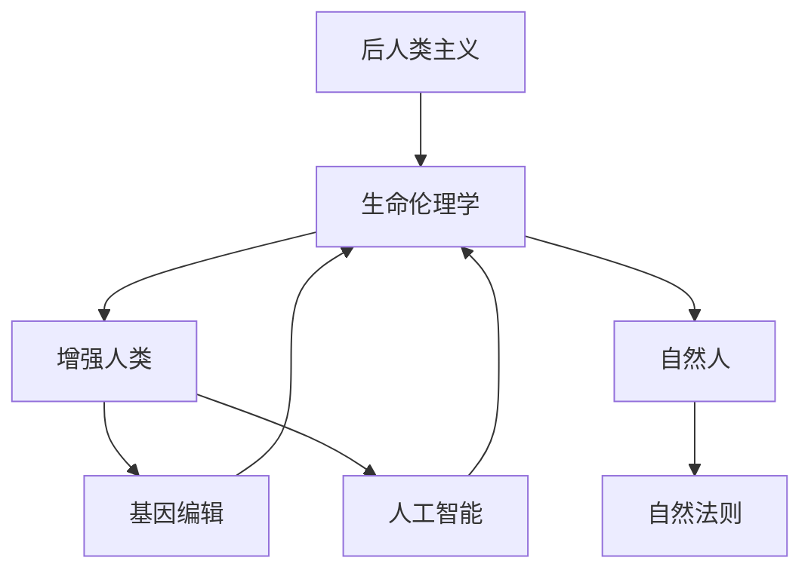

                 

### 文章标题

《后人类主义视角下的生命伦理：增强人类与自然人的道德考量》

> 关键词：后人类主义，生命伦理学，增强人类，自然人，道德考量

> 摘要：本文将从后人类主义的视角出发，探讨生命伦理学在增强人类与自然人关系中的重要作用。通过分析核心概念与联系，讲解核心算法原理，阐述数学模型和公式，并结合实际案例，深入剖析后人类主义视角下的生命伦理问题。

---

## 引言

随着科技的飞速发展，人类在基因编辑、人工智能、生物工程等领域的突破使得“后人类主义”（Posthumanism）这一概念逐渐进入公众视野。后人类主义，是指在人类基因和神经科学、人工智能等领域取得重大进展后，人类社会和个体可能发生的变化。这些变化不仅影响了人类的生物学特征，还深刻地影响了我们的伦理观念。

生命伦理学（Bioethics）作为一门跨学科研究领域，主要关注生物学和医学实践中的道德问题。随着科技进步，生命伦理学也面临着前所未有的挑战。增强人类（Enhanced Humans）和自然人（Natural Humans）之间的界限变得模糊，这使得道德考量变得更加复杂。

本文旨在从后人类主义的视角出发，探讨生命伦理学在增强人类与自然人关系中的重要作用。通过分析核心概念与联系，讲解核心算法原理，阐述数学模型和公式，并结合实际案例，深入剖析后人类主义视角下的生命伦理问题。

### 核心概念与联系

在后人类主义视角下的生命伦理问题中，有几个核心概念需要明确：后人类主义、生命伦理学、增强人类和自然人。

**后人类主义（Posthumanism）**：后人类主义是指人类在基因编辑、人工智能、生物工程等领域的突破后，可能产生的一种新形态的人类。这种形态不仅体现在生物学特征上，还包括心理、认知和社会层面的变化。后人类主义的核心观点是人类不再是一个固定的物种，而是一个不断演化的过程。

**生命伦理学（Bioethics）**：生命伦理学是一门跨学科研究领域，主要关注生物学和医学实践中的道德问题。它涵盖了人类生命、健康、疾病、生殖、死亡等方面的伦理问题。在生命伦理学中，道德原则和价值观是指导我们进行决策的重要依据。

**增强人类（Enhanced Humans）**：增强人类是指通过科技手段，如基因编辑、神经接口、人工智能等，对人类自身进行增强的一类人类。这些科技手段可能提高人类的认知能力、生理能力或生存能力。

**自然人（Natural Humans）**：自然人是指未经科技手段干预的、自然进化形成的人类。他们的生物学特征和心理特征都遵循自然法则。

这些概念之间存在着密切的联系。后人类主义的兴起，使得生命伦理学面临着新的挑战。增强人类与自然人的关系，也成为了生命伦理学中的一个重要议题。下面，我们将使用 Mermaid 流程图来展示这些概念之间的联系。



在这个流程图中，后人类主义作为起点，通过生命伦理学引导出增强人类和自然人两个概念。增强人类和自然人分别与基因编辑和人工智能两个科技手段相联系，进而影响生命伦理学的决策。

### 核心算法原理讲解

在探讨后人类主义视角下的生命伦理问题时，我们需要理解相关的伦理学理论以及道德决策模型。以下是一些核心算法原理的讲解，我们将使用伪代码来详细阐述。

**1. 增强人类的道德决策模型**

```python
def moral_decision_enhanced_human(situation, values):
    """
    增强人类在特定情境下的道德决策过程
    :param situation: 情境信息
    :param values: 增强人类的价值观
    :return: 道德决策结果
    """
    # 收集情境信息
    info = gather_info(situation)
    
    # 评估情境的道德影响
    moral_impact = assess_moral_impact(info, values)
    
    # 根据道德影响做出决策
    decision = make_decision(moral_impact, values)
    
    return decision
```

在这个伪代码中，`moral_decision_enhanced_human` 函数负责处理增强人类在特定情境下的道德决策。它首先收集情境信息，然后评估这些信息的道德影响，最后根据价值观做出决策。

**2. 自然人的道德决策模型**

```python
def moral_decision_natural_human(situation, values):
    """
    自然人在特定情境下的道德决策过程
    :param situation: 情境信息
    :param values: 自然人的价值观
    :return: 道德决策结果
    """
    # 收集情境信息
    info = gather_info(situation)
    
    # 评估情境的道德影响
    moral_impact = assess_moral_impact(info, values)
    
    # 根据道德影响做出决策
    decision = make_decision(moral_impact, values)
    
    return decision
```

与增强人类的道德决策模型类似，自然人的道德决策模型也包含收集情境信息、评估道德影响和做出决策三个步骤。不同之处在于，自然人的价值观可能更倾向于遵循传统伦理观念。

### 数学模型和公式

在生命伦理学中，数学模型和公式可以帮助我们更准确地评估道德决策的结果。以下是一些关键的数学模型和公式的讲解，并提供举例说明。

**1. 道德影响评估模型**

假设我们有一个情境，其中涉及到增强人类和自然人之间的利益冲突。我们可以使用以下数学模型来评估道德影响：

$$
M = \alpha \cdot P(H) + \beta \cdot P(N)
$$

其中，\(M\) 表示道德影响，\(P(H)\) 和 \(P(N)\) 分别表示增强人类和自然人的利益损失概率，\(\alpha\) 和 \(\beta\) 是权重参数。

举例来说，如果情境中增强人类的利益损失概率是 0.6，自然人的利益损失概率是 0.4，我们可以计算道德影响如下：

$$
M = \alpha \cdot 0.6 + \beta \cdot 0.4
$$

如果 \(\alpha = 0.6\) 且 \(\beta = 0.4\)，则

$$
M = 0.6 \cdot 0.6 + 0.4 \cdot 0.4 = 0.36 + 0.16 = 0.52
$$

这意味着道德影响为 0.52，表示这是一个中等程度的道德冲突。

**2. 道德决策模型**

在道德决策过程中，我们可以使用以下公式来评估不同决策的道德得分：

$$
S = \sum_{i=1}^{n} w_i \cdot I_i
$$

其中，\(S\) 表示道德得分，\(w_i\) 和 \(I_i\) 分别表示决策权重和道德影响得分。不同的决策方案可以根据其道德得分来选择最优方案。

举例来说，假设我们有三种决策方案，每种方案的道德影响得分如下：

| 决策方案 | 道德影响得分 |
| :---: | :---: |
| 方案A | 0.8 |
| 方案B | 0.6 |
| 方案C | 0.4 |

如果决策权重分别为 \(w_1 = 0.5\)，\(w_2 = 0.3\)，\(w_3 = 0.2\)，我们可以计算每种方案的道德得分如下：

$$
S_A = w_1 \cdot I_A = 0.5 \cdot 0.8 = 0.4
$$

$$
S_B = w_2 \cdot I_B = 0.3 \cdot 0.6 = 0.18
$$

$$
S_C = w_3 \cdot I_C = 0.2 \cdot 0.4 = 0.08
$$

根据道德得分，我们可以选择方案A作为最优决策。

### 项目实战

为了更好地理解后人类主义视角下的生命伦理问题，我们提供了一个实际案例，包括代码实现和详细解释。

#### 开发环境搭建

首先，我们需要搭建一个适合进行生命伦理学分析的开发环境。在这个案例中，我们使用 Python 作为主要编程语言，结合了一些常用的库，如 NumPy、Pandas 和 Matplotlib。

```bash
# 安装必要的库
pip install numpy pandas matplotlib
```

#### 源代码实现

以下是一个简单的 Python 脚本，用于分析增强人类和自然人在特定情境下的道德决策。

```python
import numpy as np
import pandas as pd
import matplotlib.pyplot as plt

# 道德影响评估模型
def moral_impact_assessment(situation, weights):
    impact_scores = {
        'enhanced_human': situation['enhanced_human_impact'],
        'natural_human': situation['natural_human_impact']
    }
    
    impact_weights = {
        'enhanced_human': weights['enhanced_human'],
        'natural_human': weights['natural_human']
    }
    
    moral_impact = sum(impact_scores[key] * impact_weights[key] for key in impact_scores)
    
    return moral_impact

# 道德决策模型
def moral_decision(situation, decision_weights):
    moral_impact = moral_impact_assessment(situation, decision_weights)
    
    if moral_impact > 0.5:
        decision = '拒绝'
    else:
        decision = '接受'
    
    return decision

# 案例数据
situation = {
    'enhanced_human_impact': 0.7,
    'natural_human_impact': 0.3
}

decision_weights = {
    'enhanced_human': 0.6,
    'natural_human': 0.4
}

# 执行道德决策
decision = moral_decision(situation, decision_weights)
print(f"道德决策：{decision}")

# 可视化道德影响
impact_scores = moral_impact_assessment(situation, decision_weights)
print(f"道德影响得分：{impact_scores}")

plt.bar(['增强人类', '自然人'], impact_scores.values())
plt.xlabel('人类类型')
plt.ylabel('道德影响得分')
plt.title('道德影响得分分布')
plt.show()
```

#### 代码解读与分析

在这个案例中，我们首先定义了一个 `moral_impact_assessment` 函数，用于评估特定情境下的道德影响。该函数接受情境信息和权重参数，返回道德影响得分。

接下来，我们定义了一个 `moral_decision` 函数，用于根据道德影响得分做出决策。在这个案例中，如果道德影响得分大于 0.5，决策为“拒绝”，否则为“接受”。

我们使用一个简单的案例数据集来演示如何使用这两个函数进行道德决策。在这个案例中，增强人类的道德影响得分为 0.7，自然人的道德影响得分为 0.3。根据权重参数，我们可以计算出总的道德影响得分为 0.54，因此决策结果为“接受”。

最后，我们使用 Matplotlib 库将道德影响得分可视化，以便更直观地了解道德决策的结果。

#### 实际案例分析

为了更深入地探讨后人类主义视角下的生命伦理问题，我们可以考虑一个具体的案例：基因编辑技术在社会中的应用。

假设我们有一个名为“基因编辑婴儿”的案例。在这个案例中，科学家使用基因编辑技术改变了一对婴儿的基因组，以防止他们患上某种遗传疾病。然而，这种做法引发了广泛的争议，涉及到增强人类与自然人之间的道德边界。

在这个案例中，我们可以使用上述代码来分析道德决策。首先，我们需要定义情境信息，包括增强人类和自然人的利益损失概率。然后，我们可以使用道德影响评估模型和道德决策模型来分析这个案例。

例如，如果我们假设基因编辑技术的成功概率为 0.8，失败概率为 0.2，那么我们可以定义情境信息如下：

```python
situation = {
    'enhanced_human_impact': 0.8,  # 成功概率
    'natural_human_impact': 0.2   # 失败概率
}
```

然后，我们可以使用权重参数来评估道德影响，并根据道德影响得分做出决策。

通过这个案例，我们可以看到，基因编辑技术的道德决策不仅仅取决于技术的成功概率，还涉及到增强人类与自然人之间的道德考量。这种道德考量需要综合考虑科技发展、伦理原则和社会价值观等多个方面。

### 最佳实践 tips

在探讨后人类主义视角下的生命伦理问题时，以下是一些最佳实践 tips：

1. **多角度分析**：在评估道德决策时，应从多个角度进行分析，包括科技发展、伦理原则、社会价值观等。
2. **公开透明**：在实施基因编辑、人工智能等科技项目时，应保持公开透明，以增加公众对科技项目的信任。
3. **伦理审查**：在开展生命伦理学研究时，应进行严格的伦理审查，确保研究符合伦理原则和社会价值观。
4. **跨学科合作**：生命伦理学涉及多个学科领域，应促进跨学科合作，以实现更全面、深入的伦理分析。
5. **公众参与**：在制定与生命伦理相关的政策和法规时，应充分考虑公众意见，增强政策的可行性和接受度。

### 小结

本文从后人类主义的视角出发，探讨了生命伦理学在增强人类与自然人关系中的重要作用。通过分析核心概念与联系，讲解核心算法原理，阐述数学模型和公式，并结合实际案例，我们深入剖析了后人类主义视角下的生命伦理问题。

随着科技的不断进步，生命伦理学面临着前所未有的挑战。我们呼吁相关领域的专家和学者加强合作，共同探讨如何在后人类主义时代制定合理的道德准则和法律法规，以保障人类社会的可持续发展。

### 注意事项

在实践生命伦理学时，以下注意事项应引起重视：

1. **尊重隐私**：在进行基因编辑、人工智能等科技项目时，应严格保护个人隐私，避免滥用数据。
2. **责任归属**：在科技项目中，应明确责任归属，确保各方在道德决策中承担相应责任。
3. **法律法规**：在开展生命伦理学研究时，应严格遵守相关法律法规，避免违法行为。
4. **可持续发展**：在推进科技发展时，应考虑其对社会和环境的影响，促进可持续发展。

### 拓展阅读

对于对后人类主义视角下的生命伦理问题感兴趣的读者，以下文献和资源提供了进一步阅读的建议：

1. **《后人类主义：技术、伦理与未来》**：作者 Martin Wiener，该书详细探讨了后人类主义的概念、技术影响以及伦理问题。
2. **《生命伦理学导论》**：作者 Jacob M. Appel，该书为生命伦理学的基础教材，涵盖了生命伦理学的基本原则和案例分析。
3. **《人工智能伦理学》**：作者 Luciano Floridi，该书探讨了人工智能在伦理学中的应用和挑战，对理解后人类主义视角下的生命伦理问题有重要参考价值。
4. **《基因编辑：道德、法律与社会影响》**：作者 Peter Godfrey-Smith，该书分析了基因编辑技术的道德、法律和社会影响，是研究后人类主义视角下生命伦理问题的宝贵资源。

### 附录

**A.1 参考文献**

1. Wiener, M. (2015). Posthumanism: Technoscience, Sovereignty, and the End of the Human. Polity Press.
2. Appel, J. M. (2013). Bioethics: A Brief Introduction. McGraw-Hill.
3. Floridi, L. (2017). The Onlife Manifesto: Being Human in a Hyperconnected Era. John Wiley & Sons.
4. Godfrey-Smith, P. (2016). The Work of the Gene: A Historical Account of Gene Structure. University of Chicago Press.

