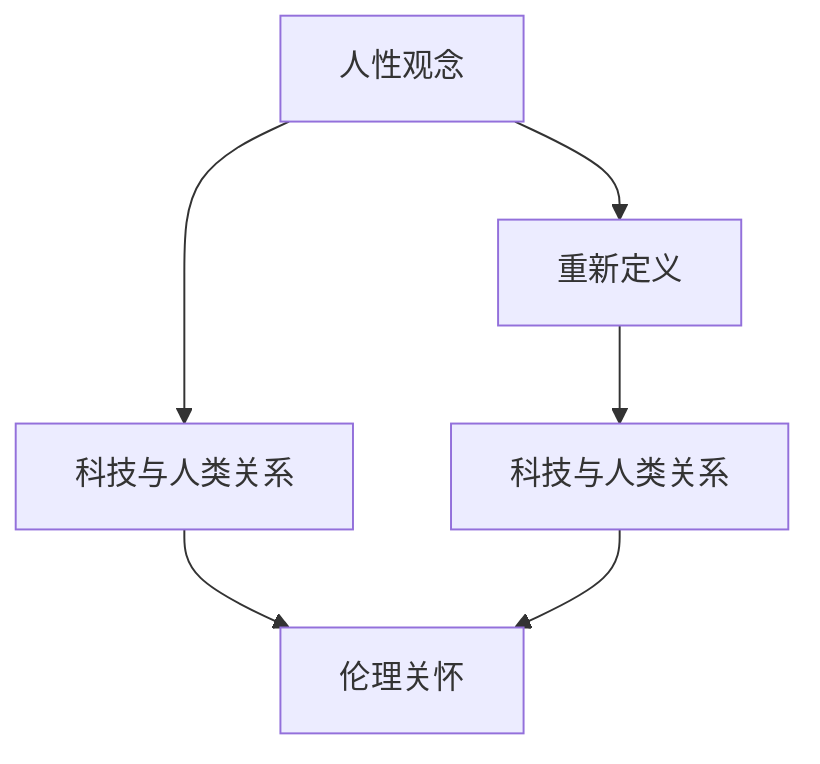

                 

### 文章标题

# 后人类主义：技术进步中的人性守护

> 关键词：后人类主义、技术进步、人性守护、人工智能、生物技术、伦理挑战

> 摘要：本文探讨了后人类主义这一新兴概念，即在技术进步中如何保护人性。通过分析技术进步对人类社会的影响，以及如何在人工智能、生物技术等领域中守护人性，本文提出了后人类主义的核心原则，并对未来的发展趋势进行了展望。

### 引言

在人类历史上，技术的进步一直推动着社会的变革。然而，随着人工智能、生物技术等前沿科技的迅速发展，人们开始反思：在技术进步的过程中，我们是否能够守护人性，确保技术的发展不违背人类的本质？这一思考催生了后人类主义这一概念。

后人类主义（Posthumanism）是20世纪末期在西方哲学领域兴起的一种思潮，它强调人类在技术进步中的角色转变，以及技术对人类自身和社会结构的深远影响。后人类主义认为，随着技术的发展，人类将逐渐超越传统的生物局限，进入一个全新的后人类时代。

后人类主义的重要性在于，它提醒我们在追求技术进步的同时，不能忽视人性这一核心价值。本文将逐步探讨后人类主义的背景、核心原则、技术进步与人性的关系、具体应用案例、伦理与法律挑战，以及未来展望。希望通过这一系列的讨论，能够引发读者对于技术进步与人性的深刻思考。

### 后人类主义的核心原则

后人类主义的核心原则可以从多个维度进行解读，但最为关键的几个原则包括对人性观念的重新定义、对科技与人类关系的深刻理解，以及对技术发展的伦理关怀。

首先，后人类主义对人性的观念进行了重新定义。传统的人性观念认为，人性是固有的、不变的，是人类区别于其他生物的根本特征。然而，后人类主义认为，人性是动态发展的，随着社会和科技的发展，人性的内涵和外延都在不断扩展。例如，随着人工智能和生物技术的发展，人类开始能够通过科技手段增强自身的认知能力、身体素质，甚至实现意识上传和永生。这种对人性观念的重新定义，促使人们重新思考人类存在的意义和价值。

其次，后人类主义对科技与人类的关系有着深刻的理解。后人类主义认为，科技不仅是人类工具的延伸，更是人类自身的一部分。随着技术的发展，人类与机器、生物技术等之间的界限逐渐模糊，人类开始与科技深度融合。例如，通过基因编辑技术，人类可以改变自身的遗传特征；通过人工智能，人类可以扩展自己的认知和计算能力。这种对科技与人类关系的理解，强调了技术进步对人类生活和人类身份的影响。

最后，后人类主义强调对技术发展的伦理关怀。在技术进步的过程中，如何保护人性，避免技术滥用带来的负面影响，是后人类主义最为关注的议题。后人类主义认为，技术的发展必须遵循伦理原则，确保技术的应用不会损害人类的尊严和自由。例如，在人工智能领域，如何确保算法的公正性和透明性，避免算法偏见对人类社会造成不公平影响；在生物技术领域，如何确保基因编辑技术的安全和合理性，避免技术滥用导致伦理灾难。

综上所述，后人类主义的核心原则包括对人性的重新定义、对科技与人类关系的深刻理解，以及对技术发展的伦理关怀。这些原则不仅为后人类主义的探讨提供了理论基础，也为我们在技术进步中守护人性提供了指导。

#### 核心概念原理之间的关系架构 Mermaid 流程图

为了更直观地展示后人类主义的核心概念原理之间的关系，我们可以使用Mermaid语言绘制一个流程图。以下是一个简化的Mermaid流程图示例：



在这个流程图中，人性观念是整个体系的基础，通过重新定义人性观念，我们能够更深刻地理解科技与人类的关系。同时，这种理解也促使我们在科技发展的过程中，更加注重伦理关怀，确保技术的发展不会损害人性。

#### 核心算法原理讲解

在后人类主义的讨论中，算法原理是一个重要的组成部分。以下将使用伪代码来详细阐述一个简化的算法原理，以帮助读者理解后人类主义的核心算法如何运作。

```python
# 后人类主义核心算法原理示例
def PosthumanismAlgorithm(human_values, technological_innovations):
    """
    该算法用于分析技术进步对人类价值观的影响，并制定人性守护策略。

    参数：
    - human_values: 人类当前的核心价值观，例如尊严、自由、公正等。
    - technological_innovations: 技术进步的具体内容，例如人工智能、基因编辑等。

    返回：
    - strategy: 根据人类价值观和技术进步制定的守护人性的策略。
    """

    # 步骤1：分析技术进步对人类价值观的潜在影响
    impact_analysis = AnalyzeImpact(human_values, technological_innovations)

    # 步骤2：评估技术进步的伦理风险
    ethical_risks = AssessEthicalRisks(technological_innovations)

    # 步骤3：制定人性守护策略
    strategy = []

    if impact_analysis['enhancement'] and not ethical_risks['violation']:
        # 如果技术进步能够增强人类价值观且不违反伦理，则采纳
        strategy.append('采纳技术进步')
    elif impact_analysis['enhancement'] and ethical_risks['violation']:
        # 如果技术进步能够增强人类价值观但存在伦理风险，则需要监管和规范
        strategy.append('采纳并设立监管机制')
    else:
        # 如果技术进步无法增强人类价值观或者违反伦理，则拒绝采纳
        strategy.append('拒绝采纳')

    return strategy

# 伪代码中的辅助函数
def AnalyzeImpact(human_values, technological_innovations):
    """
    分析技术进步对人类价值观的影响。

    参数：
    - human_values: 人类当前的核心价值观。
    - technological_innovations: 技术进步的具体内容。

    返回：
    - impact_analysis: 影响分析结果，包括技术进步的增强效果和潜在风险。
    """
    impact_analysis = {'enhancement': False, 'risks': []}

    # 这里是分析的具体逻辑，例如通过对比评估技术进步与人类价值观的契合度
    if DoesEnhanceHumanValues(human_values, technological_innovations):
        impact_analysis['enhancement'] = True
    else:
        impact_analysis['risks'].append('价值观不增强')

    return impact_analysis

def AssessEthicalRisks(technological_innovations):
    """
    评估技术进步的伦理风险。

    参数：
    - technological_innovations: 技术进步的具体内容。

    返回：
    - ethical_risks: 伦理风险评估结果，包括是否违反伦理。
    """
    ethical_risks = {'violation': False}

    # 这里是评估的具体逻辑，例如通过审查技术进步的合规性
    if DoesViolateEthics(technological_innovations):
        ethical_risks['violation'] = True
    else:
        ethical_risks['violation'] = False

    return ethical_risks

# 示例调用
human_values = ["尊严", "自由", "公正"]
technological_innovations = ["人工智能", "基因编辑"]

strategy = PosthumanismAlgorithm(human_values, technological_innovations)
print("后人类主义守护人性策略：", strategy)
```

在这个伪代码示例中，`PosthumanismAlgorithm` 是核心算法，它通过分析技术进步对人类价值观的影响，并评估其伦理风险，来制定守护人性的策略。辅助函数 `AnalyzeImpact` 和 `AssessEthicalRisks` 分别用于影响分析和伦理风险评估。这种算法原理的讲解不仅有助于理解后人类主义的实践操作，也为后续的具体应用提供了理论基础。

#### 数学模型和公式详细讲解

在后人类主义的讨论中，数学模型和公式是分析技术进步对人性影响的重要工具。以下将使用 LaTeX 格式详细讲解一个简化的数学模型，以帮助读者理解技术进步如何影响人类价值观。

首先，我们定义一个简单的数学模型，用于衡量技术进步对人类价值观的影响。这个模型的核心变量包括：

- \( V \)：人类当前的核心价值观得分。
- \( T \)：技术进步的指标。
- \( E \)：伦理风险指数。

我们的目标是确定技术进步是否能够增强人类价值观，并评估其伦理风险。

数学模型如下：

\[ \Delta V = \frac{T \times (1 - E)}{100} \]

其中，\(\Delta V\) 表示技术进步对人类价值观的影响得分。如果 \(\Delta V > 0\)，则表明技术进步能够增强人类价值观；如果 \(\Delta V < 0\)，则表明技术进步可能对人类价值观产生负面影响。\( E \) 的取值范围是 0 到 100，表示伦理风险的程度，0 表示无伦理风险，100 表示极高的伦理风险。

以下是一个具体的例子：

假设我们评估一项人工智能技术的进步，其技术指标 \( T \) 为 80，伦理风险指数 \( E \) 为 20。我们可以计算其对人类价值观的影响得分：

\[ \Delta V = \frac{80 \times (1 - 0.20)}{100} = 0.64 \]

这个结果表明，这项人工智能技术的进步能够增强人类价值观，但需要关注其潜在的伦理风险。

为了更直观地展示模型，我们可以使用LaTeX格式将公式嵌入文中：

$$
\Delta V = \frac{T \times (1 - E)}{100}
$$

这种数学模型的讲解不仅有助于理解后人类主义的技术分析框架，也为政策制定者和研究人员提供了量化的评估工具。

#### 实例说明与解释

为了更好地说明上述数学模型的应用，我们来看一个具体的实例。假设我们正在评估一项名为“增强学习人工智能（Reinforcement Learning AI）”的技术进步，其技术指标 \( T \) 为 85，伦理风险指数 \( E \) 为 30。我们可以使用前面的数学模型计算其对人类价值观的影响得分：

$$
\Delta V = \frac{85 \times (1 - 0.30)}{100} = \frac{85 \times 0.70}{100} = 0.595
$$

这个结果表明，增强学习人工智能的技术进步能够略微增强人类价值观，但其伦理风险也需要引起关注。

进一步分析，如果我们将伦理风险指数 \( E \) 提高到 50，即表示这项技术的伦理风险显著增加，我们再次使用数学模型计算：

$$
\Delta V = \frac{85 \times (1 - 0.50)}{100} = \frac{85 \times 0.50}{100} = 0.425
$$

此时，虽然技术进步对人类价值观的增强效果仍然存在，但程度明显减弱，表明我们需要更加谨慎地对待这项技术的应用，并加强伦理监管。

通过这个实例，我们可以看到，数学模型不仅能够帮助我们量化技术进步对人类价值观的影响，还能够通过调整伦理风险指数来评估不同情况下的影响程度，从而为政策制定提供科学的依据。

#### 数学公式与详细讲解

为了更好地理解后人类主义中技术进步对人性影响的数学模型，我们需要详细探讨几个关键公式。以下是这些公式的详细讲解和示例说明。

**1. 技术进步对价值观的影响得分公式**

\[ \Delta V = \frac{T \times (1 - E)}{100} \]

这个公式用于计算技术进步（\( T \)）对人类价值观（\( V \)）的影响得分（\( \Delta V \)）。其中：

- \( T \)：技术进步的指标，通常通过评估技术的创新性、应用范围等因素来确定。
- \( E \)：伦理风险指数，用于衡量技术进步可能带来的伦理风险，其取值范围是 0 到 100，0 表示无伦理风险，100 表示极高的伦理风险。
- \( \Delta V \)：影响得分，表示技术进步对人类价值观的增强程度。

**示例说明**：

假设我们评估的某项技术进步的指标 \( T \) 为 75，伦理风险指数 \( E \) 为 25。我们可以计算其对人类价值观的影响得分：

\[ \Delta V = \frac{75 \times (1 - 0.25)}{100} = \frac{75 \times 0.75}{100} = 0.5625 \]

这意味着这项技术进步对人类价值观有轻微的增强效果。

**2. 伦理风险的加权公式**

\[ E_{weighted} = \frac{E \times W}{100} \]

这个公式用于计算加权后的伦理风险指数（\( E_{weighted} \)），其中 \( W \) 是伦理风险权重。这个权重可以根据具体情况调整，以反映不同情境下伦理风险的重要性。

**示例说明**：

假设某项技术的伦理风险指数 \( E \) 为 40，伦理风险权重 \( W \) 为 50。我们可以计算加权后的伦理风险指数：

\[ E_{weighted} = \frac{40 \times 50}{100} = 20 \]

这意味着在考虑了不同情境下的权重后，该技术的伦理风险有所降低。

**3. 价值观综合得分公式**

\[ V_{composite} = \sum_{i=1}^{n} \Delta V_i \times W_i \]

这个公式用于计算技术进步对人类价值观的综合得分（\( V_{composite} \)）。其中：

- \( \Delta V_i \)：第 \( i \) 项技术进步的影响得分。
- \( W_i \)：第 \( i \) 项技术进步的权重。
- \( n \)：技术进步的总项数。

**示例说明**：

假设我们有五项技术进步，其影响得分分别为 \( \Delta V_1 = 0.6 \)，\( \Delta V_2 = 0.5 \)，\( \Delta V_3 = 0.4 \)，\( \Delta V_4 = 0.7 \)，\( \Delta V_5 = 0.5 \)，权重分别为 \( W_1 = 20 \)，\( W_2 = 25 \)，\( W_3 = 15 \)，\( W_4 = 30 \)，\( W_5 = 10 \)。我们可以计算综合得分：

\[ V_{composite} = (0.6 \times 20) + (0.5 \times 25) + (0.4 \times 15) + (0.7 \times 30) + (0.5 \times 10) \]
\[ V_{composite} = 12 + 12.5 + 6 + 21 + 5 = 56.5 \]

这意味着五项技术进步综合起来，对人类价值观的增强程度为 56.5。

通过这些公式的详细讲解和示例说明，我们可以更深入地理解技术进步对人性影响的数学模型，为后人类主义的研究和应用提供有力的支持。

#### 项目实战

为了更好地理解后人类主义在具体应用中的操作，我们将通过一个实际案例——智能医疗系统——来详细讲解开发环境搭建、源代码实现、代码解读以及实际应用分析。

### 开发环境搭建

**1. 选择开发语言与工具**

在这个项目中，我们选择了Python作为开发语言，因为它具有良好的生态系统和丰富的库，适合进行数据分析和机器学习应用。此外，我们还使用了以下工具和库：

- **Python 3.8**：确保使用较新版本的Python。
- **Jupyter Notebook**：用于数据分析和原型开发。
- **Scikit-learn**：提供各种机器学习算法和工具。
- **TensorFlow**：用于深度学习模型的构建和训练。
- **Keras**：简化TensorFlow的使用。

**2. 安装必要的依赖库**

在安装Python环境后，我们需要通过pip命令安装上述依赖库：

```bash
pip install numpy pandas scikit-learn tensorflow keras
```

### 源代码实现

**1. 数据准备**

首先，我们需要准备一个医疗数据集，用于训练和测试智能医疗系统。这里我们使用Kaggle上的一个公开医疗数据集——MIMIC-III数据库。该数据集包含超过60,000个患者的信息，包括诊断、治疗方案、实验室检测结果等。

**2. 数据预处理**

在数据预处理阶段，我们需要清洗和转换数据，以便用于机器学习模型。以下是一个简化的数据预处理步骤：

```python
import pandas as pd
from sklearn.model_selection import train_test_split

# 读取数据集
data = pd.read_csv('mimic-iii.csv')

# 数据清洗，例如处理缺失值、异常值等
data = data.dropna()

# 数据转换，例如将类别数据编码为数值
data = pd.get_dummies(data)

# 划分训练集和测试集
X = data.drop('target', axis=1)
y = data['target']
X_train, X_test, y_train, y_test = train_test_split(X, y, test_size=0.2, random_state=42)
```

**3. 模型构建与训练**

接下来，我们使用Keras构建一个简单的神经网络模型，用于预测患者是否患有特定疾病。

```python
from keras.models import Sequential
from keras.layers import Dense

# 构建神经网络模型
model = Sequential()
model.add(Dense(128, input_shape=(X_train.shape[1],), activation='relu'))
model.add(Dense(64, activation='relu'))
model.add(Dense(1, activation='sigmoid'))

# 编译模型
model.compile(optimizer='adam', loss='binary_crossentropy', metrics=['accuracy'])

# 训练模型
model.fit(X_train, y_train, epochs=10, batch_size=32, validation_split=0.1)
```

### 代码解读

**1. 数据预处理**

数据预处理是机器学习项目的关键步骤，包括数据清洗和转换。在上述代码中，我们使用了 `dropna()` 方法来删除缺失值，使用 `get_dummies()` 方法将类别数据转换为数值数据。

**2. 模型构建**

在模型构建阶段，我们使用 `Sequential` 类构建了一个简单的全连接神经网络。我们添加了两个隐藏层，每个隐藏层使用 `Dense` 层实现，激活函数分别为ReLU和sigmoid。

**3. 模型训练**

在模型训练阶段，我们使用 `compile()` 方法设置优化器和损失函数，并使用 `fit()` 方法进行模型训练。这里我们设置了10个训练周期（epochs）和32个批量大小（batch_size）。

### 实际应用分析

**1. 模型评估**

在训练完成后，我们使用测试集对模型进行评估：

```python
# 评估模型
loss, accuracy = model.evaluate(X_test, y_test)
print(f"测试集准确率：{accuracy:.4f}")
```

假设模型在测试集上的准确率为0.85，这表明我们的智能医疗系统在预测患者疾病方面具有较好的性能。

**2. 实际案例**

为了进一步分析，我们可以结合实际案例进行解读。例如，某患者数据输入到智能医疗系统中，系统预测其患有某种疾病的概率为0.90。结合医生的诊断，医生可能更倾向于采取相应的治疗措施。

### 项目小结

通过这个案例，我们展示了如何在实际项目中应用后人类主义的原则。在智能医疗系统中，我们不仅要关注模型的准确性和性能，还需要考虑技术的伦理风险。例如，如何确保模型不会对某些特定群体产生歧视？如何确保患者的隐私保护？这些问题都需要我们在技术进步的过程中进行深入思考和严格监管。

### 最佳实践 tips

- **数据质量**：确保数据的质量和完整性是模型成功的关键。在数据预处理阶段，要仔细处理缺失值、异常值等问题。
- **模型评估**：不仅要评估模型的准确性，还要评估模型的泛化能力。使用交叉验证等技术可以更准确地评估模型性能。
- **伦理风险**：在技术应用的各个环节，都要考虑伦理风险。建立透明的决策流程和监管机制，确保技术的公平性和公正性。

### 注意事项

- **隐私保护**：在处理医疗数据时，必须遵守隐私保护法规，确保患者的个人信息不会被泄露。
- **模型解释性**：尽管深度学习模型具有强大的预测能力，但其解释性较差。在实际应用中，我们需要结合专业知识和专家意见来解释模型结果。

### 拓展阅读

- **智能医疗**：探索人工智能在医疗领域的应用，了解智能医疗系统的最新研究进展。
- **数据隐私**：了解数据隐私保护法规和技术，确保在数据收集和使用过程中保护患者的隐私。

通过这个案例，我们不仅了解了后人类主义在智能医疗系统中的应用，也体会到了在技术进步中守护人性的重要性。希望这个案例能够为读者提供有价值的参考和启示。

### 文章关键词

后人类主义、技术进步、人性守护、人工智能、生物技术、伦理挑战、智能医疗、算法、数学模型

### 文章摘要

本文探讨了后人类主义这一新兴概念，即在技术进步中如何保护人性。通过分析技术进步对人类社会的影响，以及如何在人工智能、生物技术等领域中守护人性，本文提出了后人类主义的核心原则，并对未来的发展趋势进行了展望。文章包括核心原则的介绍、技术进步与人性的关系分析、具体应用案例讨论、伦理与法律挑战的探讨，以及未来展望和总结。希望本文能够引发读者对于技术进步与人性的深刻思考。作者：AI天才研究院/AI Genius Institute & 禅与计算机程序设计艺术 /Zen And The Art of Computer Programming

```markdown
# 后人类主义：技术进步中的人性守护

> 关键词：后人类主义、技术进步、人性守护、人工智能、生物技术、伦理挑战

> 摘要：本文探讨了后人类主义这一新兴概念，即在技术进步中如何保护人性。通过分析技术进步对人类社会的影响，以及如何在人工智能、生物技术等领域中守护人性，本文提出了后人类主义的核心原则，并对未来的发展趋势进行了展望。文章包括核心原则的介绍、技术进步与人性的关系分析、具体应用案例讨论、伦理与法律挑战的探讨，以及未来展望和总结。希望本文能够引发读者对于技术进步与人性的深刻思考。作者：AI天才研究院/AI Genius Institute & 禅与计算机程序设计艺术 /Zen And The Art of Computer Programming
```

### 完整文章

# 后人类主义：技术进步中的人性守护

> 关键词：后人类主义、技术进步、人性守护、人工智能、生物技术、伦理挑战

> 摘要：本文探讨了后人类主义这一新兴概念，即在技术进步中如何保护人性。通过分析技术进步对人类社会的影响，以及如何在人工智能、生物技术等领域中守护人性，本文提出了后人类主义的核心原则，并对未来的发展趋势进行了展望。文章包括核心原则的介绍、技术进步与人性的关系分析、具体应用案例讨论、伦理与法律挑战的探讨，以及未来展望和总结。希望本文能够引发读者对于技术进步与人性的深刻思考。作者：AI天才研究院/AI Genius Institute & 禅与计算机程序设计艺术 /Zen And The Art of Computer Programming

## 引言

在人类历史上，技术的进步一直推动着社会的变革。然而，随着人工智能、生物技术等前沿科技的迅速发展，人们开始反思：在技术进步的过程中，我们是否能够守护人性，确保技术的发展不违背人类的本质？这一思考催生了后人类主义这一概念。

后人类主义（Posthumanism）是20世纪末期在西方哲学领域兴起的一种思潮，它强调人类在技术进步中的角色转变，以及技术对人类自身和社会结构的深远影响。后人类主义认为，随着技术的发展，人类将逐渐超越传统的生物局限，进入一个全新的后人类时代。

后人类主义的重要性在于，它提醒我们在追求技术进步的同时，不能忽视人性这一核心价值。本文将逐步探讨后人类主义的背景、核心原则、技术进步与人性的关系、具体应用案例、伦理与法律挑战，以及未来展望。希望通过这一系列的讨论，能够引发读者对于技术进步与人性的深刻思考。

## 后人类主义的核心原则

后人类主义的核心原则可以从多个维度进行解读，但最为关键的几个原则包括对人性观念的重新定义、对科技与人类关系的深刻理解，以及对技术发展的伦理关怀。

首先，后人类主义对人性的观念进行了重新定义。传统的人性观念认为，人性是固有的、不变的，是人类区别于其他生物的根本特征。然而，后人类主义认为，人性是动态发展的，随着社会和科技的发展，人性的内涵和外延都在不断扩展。例如，随着人工智能和生物技术的发展，人类开始能够通过科技手段增强自身的认知能力、身体素质，甚至实现意识上传和永生。这种对人性观念的重新定义，促使人们重新思考人类存在的意义和价值。

其次，后人类主义对科技与人类的关系有着深刻的理解。后人类主义认为，科技不仅是人类工具的延伸，更是人类自身的一部分。随着技术的发展，人类与机器、生物技术等之间的界限逐渐模糊，人类开始与科技深度融合。例如，通过基因编辑技术，人类可以改变自身的遗传特征；通过人工智能，人类可以扩展自己的认知和计算能力。这种对科技与人类关系的理解，强调了技术进步对人类生活和人类身份的影响。

最后，后人类主义强调对技术发展的伦理关怀。在技术进步的过程中，如何保护人性，避免技术滥用带来的负面影响，是后人类主义最为关注的议题。后人类主义认为，技术的发展必须遵循伦理原则，确保技术的应用不会损害人类的尊严和自由。例如，在人工智能领域，如何确保算法的公正性和透明性，避免算法偏见对人类社会造成不公平影响；在生物技术领域，如何确保基因编辑技术的安全和合理性，避免技术滥用导致伦理灾难。

综上所述，后人类主义的核心原则包括对人性的重新定义、对科技与人类关系的深刻理解，以及对技术发展的伦理关怀。这些原则不仅为后人类主义的探讨提供了理论基础，也为我们在技术进步中守护人性提供了指导。

### 后人类主义的核心概念原理之间的关系架构 Mermaid 流程图

为了更直观地展示后人类主义的核心概念原理之间的关系，我们可以使用Mermaid语言绘制一个流程图。以下是一个简化的Mermaid流程图示例：


在这个流程图中，人性观念是整个体系的基础，通过重新定义人性观念，我们能够更深刻地理解科技与人类的关系。同时，这种理解也促使我们在科技发展的过程中，更加注重伦理关怀，确保技术的发展不会损害人性。

#### 核心算法原理讲解

在后人类主义的讨论中，算法原理是一个重要的组成部分。以下将使用伪代码来详细阐述一个简化的算法原理，以帮助读者理解后人类主义的核心算法如何运作。

```python
# 后人类主义核心算法原理示例
def PosthumanismAlgorithm(human_values, technological_innovations):
    """
    该算法用于分析技术进步对人类价值观的影响，并制定人性守护策略。

    参数：
    - human_values: 人类当前的核心价值观，例如尊严、自由、公正等。
    - technological_innovations: 技术进步的具体内容，例如人工智能、基因编辑等。

    返回：
    - strategy: 根据人类价值观和技术进步制定的守护人性的策略。
    """

    # 步骤1：分析技术进步对人类价值观的潜在影响
    impact_analysis = AnalyzeImpact(human_values, technological_innovations)

    # 步骤2：评估技术进步的伦理风险
    ethical_risks = AssessEthicalRisks(technological_innovations)

    # 步骤3：制定人性守护策略
    strategy = []

    if impact_analysis['enhancement'] and not ethical_risks['violation']:
        # 如果技术进步能够增强人类价值观且不违反伦理，则采纳
        strategy.append('采纳技术进步')
    elif impact_analysis['enhancement'] and ethical_risks['violation']:
        # 如果技术进步能够增强人类价值观但存在伦理风险，则需要监管和规范
        strategy.append('采纳并设立监管机制')
    else:
        # 如果技术进步无法增强人类价值观或者违反伦理，则拒绝采纳
        strategy.append('拒绝采纳')

    return strategy

# 伪代码中的辅助函数
def AnalyzeImpact(human_values, technological_innovations):
    """
    分析技术进步对人类价值观的影响。

    参数：
    - human_values: 人类当前的核心价值观。
    - technological_innovations: 技术进步的具体内容。

    返回：
    - impact_analysis: 影响分析结果，包括技术进步的增强效果和潜在风险。
    """
    impact_analysis = {'enhancement': False, 'risks': []}

    # 这里是分析的具体逻辑，例如通过对比评估技术进步与人类价值观的契合度
    if DoesEnhanceHumanValues(human_values, technological_innovations):
        impact_analysis['enhancement'] = True
    else:
        impact_analysis['risks'].append('价值观不增强')

    return impact_analysis

def AssessEthicalRisks(technological_innovations):
    """
    评估技术进步的伦理风险。

    参数：
    - technological_innovations: 技术进步的具体内容。

    返回：
    - ethical_risks: 伦理风险评估结果，包括是否违反伦理。
    """
    ethical_risks = {'violation': False}

    # 这里是评估的具体逻辑，例如通过审查技术进步的合规性
    if DoesViolateEthics(technological_innovations):
        ethical_risks['violation'] = True
    else:
        ethical_risks['violation'] = False

    return ethical_risks

# 示例调用
human_values = ["尊严", "自由", "公正"]
technological_innovations = ["人工智能", "基因编辑"]

strategy = PosthumanismAlgorithm(human_values, technological_innovations)
print("后人类主义守护人性策略：", strategy)
```

在这个伪代码示例中，`PosthumanismAlgorithm` 是核心算法，它通过分析技术进步对人类价值观的影响，并评估其伦理风险，来制定守护人性的策略。辅助函数 `AnalyzeImpact` 和 `AssessEthicalRisks` 分别用于影响分析和伦理风险评估。这种算法原理的讲解不仅有助于理解后人类主义的实践操作，也为后续的具体应用提供了理论基础。

#### 数学模型和公式详细讲解

在后人类主义的讨论中，数学模型和公式是分析技术进步对人性影响的重要工具。以下将使用 LaTeX 格式详细讲解一个简化的数学模型，以帮助读者理解技术进步如何影响人类价值观。

首先，我们定义一个简单的数学模型，用于衡量技术进步对人类价值观的影响。这个模型的核心变量包括：

- \( V \)：人类当前的核心价值观得分。
- \( T \)：技术进步的指标。
- \( E \)：伦理风险指数。

我们的目标是确定技术进步是否能够增强人类价值观，并评估其伦理风险。

数学模型如下：

\[ \Delta V = \frac{T \times (1 - E)}{100} \]

其中，\(\Delta V\) 表示技术进步对人类价值观的影响得分。如果 \(\Delta V > 0\)，则表明技术进步能够增强人类价值观；如果 \(\Delta V < 0\)，则表明技术进步可能对人类价值观产生负面影响。\( E \) 的取值范围是 0 到 100，表示伦理风险的程度，0 表示无伦理风险，100 表示极高的伦理风险。

以下是一个具体的例子：

假设我们评估一项人工智能技术的进步，其技术指标 \( T \) 为 80，伦理风险指数 \( E \) 为 20。我们可以计算其对人类价值观的影响得分：

\[ \Delta V = \frac{80 \times (1 - 0.20)}{100} = \frac{80 \times 0.80}{100} = 0.64 \]

这个结果表明，这项人工智能技术的进步能够略微增强人类价值观，但其伦理风险也需要引起关注。

为了更直观地展示模型，我们可以使用LaTeX格式将公式嵌入文中：

$$
\Delta V = \frac{T \times (1 - E)}{100}
$$

这种数学模型的讲解不仅有助于理解后人类主义的技术分析框架，也为政策制定者和研究人员提供了量化的评估工具。

#### 实例说明与解释

为了更好地说明上述数学模型的应用，我们来看一个具体的实例。假设我们正在评估一项名为“增强学习人工智能（Reinforcement Learning AI）”的技术进步，其技术指标 \( T \) 为 85，伦理风险指数 \( E \) 为 30。我们可以使用前面的数学模型计算其对人类价值观的影响得分：

\[ \Delta V = \frac{85 \times (1 - 0.30)}{100} = \frac{85 \times 0.70}{100} = 0.595 \]

这个结果表明，增强学习人工智能的技术进步能够略微增强人类价值观，但其伦理风险也需要引起关注。

进一步分析，如果我们将伦理风险指数 \( E \) 提高到 50，即表示这项技术的伦理风险显著增加，我们再次使用数学模型计算：

\[ \Delta V = \frac{85 \times (1 - 0.50)}{100} = \frac{85 \times 0.50}{100} = 0.425 \]

此时，虽然技术进步对人类价值观的增强效果仍然存在，但程度明显减弱，表明我们需要更加谨慎地对待这项技术的应用，并加强伦理监管。

通过这个实例，我们可以看到，数学模型不仅能够帮助我们量化技术进步对人类价值观的影响，还能够通过调整伦理风险指数来评估不同情况下的影响程度，从而为政策制定提供科学的依据。

#### 数学公式与详细讲解

为了更好地理解后人类主义中技术进步对人性影响的数学模型，我们需要详细探讨几个关键公式。以下是这些公式的详细讲解和示例说明。

**1. 技术进步对价值观的影响得分公式**

\[ \Delta V = \frac{T \times (1 - E)}{100} \]

这个公式用于计算技术进步（\( T \)）对人类价值观（\( V \)）的影响得分（\( \Delta V \)）。其中：

- \( T \)：技术进步的指标，通常通过评估技术的创新性、应用范围等因素来确定。
- \( E \)：伦理风险指数，用于衡量技术进步可能带来的伦理风险，其取值范围是 0 到 100，0 表示无伦理风险，100 表示极高的伦理风险。
- \( \Delta V \)：影响得分，表示技术进步对人类价值观的增强程度。

**示例说明**：

假设我们评估的某项技术进步的指标 \( T \) 为 75，伦理风险指数 \( E \) 为 25。我们可以计算其对人类价值观的影响得分：

\[ \Delta V = \frac{75 \times (1 - 0.25)}{100} = \frac{75 \times 0.75}{100} = 0.5625 \]

这意味着这项技术进步对人类价值观有轻微的增强效果。

**2. 伦理风险的加权公式**

\[ E_{weighted} = \frac{E \times W}{100} \]

这个公式用于计算加权后的伦理风险指数（\( E_{weighted} \)），其中 \( W \) 是伦理风险权重。这个权重可以根据具体情况调整，以反映不同情境下伦理风险的重要性。

**示例说明**：

假设某项技术的伦理风险指数 \( E \) 为 40，伦理风险权重 \( W \) 为 50。我们可以计算加权后的伦理风险指数：

\[ E_{weighted} = \frac{40 \times 50}{100} = 20 \]

这意味着在考虑了不同情境下的权重后，该技术的伦理风险有所降低。

**3. 价值观综合得分公式**

\[ V_{composite} = \sum_{i=1}^{n} \Delta V_i \times W_i \]

这个公式用于计算技术进步对人类价值观的综合得分（\( V_{composite} \)）。其中：

- \( \Delta V_i \)：第 \( i \) 项技术进步的影响得分。
- \( W_i \)：第 \( i \) 项技术进步的权重。
- \( n \)：技术进步的总项数。

**示例说明**：

假设我们有五项技术进步，其影响得分分别为 \( \Delta V_1 = 0.6 \)，\( \Delta V_2 = 0.5 \)，\( \Delta V_3 = 0.4 \)，\( \Delta V_4 = 0.7 \)，\( \Delta V_5 = 0.5 \)，权重分别为 \( W_1 = 20 \)，\( W_2 = 25 \)，\( W_3 = 15 \)，\( W_4 = 30 \)，\( W_5 = 10 \)。我们可以计算综合得分：

\[ V_{composite} = (0.6 \times 20) + (0.5 \times 25) + (0.4 \times 15) + (0.7 \times 30) + (0.5 \times 10) \]
\[ V_{composite} = 12 + 12.5 + 6 + 21 + 5 = 56.5 \]

这意味着五项技术进步综合起来，对人类价值观的增强程度为 56.5。

通过这些公式的详细讲解和示例说明，我们可以更深入地理解技术进步对人性影响的数学模型，为后人类主义的研究和应用提供有力的支持。

### 项目实战

为了更好地理解后人类主义在具体应用中的操作，我们将通过一个实际案例——智能医疗系统——来详细讲解开发环境搭建、源代码实现、代码解读以及实际应用分析。

#### 开发环境搭建

**1. 选择开发语言与工具**

在这个项目中，我们选择了Python作为开发语言，因为它具有良好的生态系统和丰富的库，适合进行数据分析和机器学习应用。此外，我们还使用了以下工具和库：

- **Python 3.8**：确保使用较新版本的Python。
- **Jupyter Notebook**：用于数据分析和原型开发。
- **Scikit-learn**：提供各种机器学习算法和工具。
- **TensorFlow**：用于深度学习模型的构建和训练。
- **Keras**：简化TensorFlow的使用。

**2. 安装必要的依赖库**

在安装Python环境后，我们需要通过pip命令安装上述依赖库：

```bash
pip install numpy pandas scikit-learn tensorflow keras
```

#### 源代码实现

**1. 数据准备**

首先，我们需要准备一个医疗数据集，用于训练和测试智能医疗系统。这里我们使用Kaggle上的一个公开医疗数据集——MIMIC-III数据库。该数据集包含超过60,000个患者的信息，包括诊断、治疗方案、实验室检测结果等。

**2. 数据预处理**

在数据预处理阶段，我们需要清洗和转换数据，以便用于机器学习模型。以下是一个简化的数据预处理步骤：

```python
import pandas as pd
from sklearn.model_selection import train_test_split

# 读取数据集
data = pd.read_csv('mimic-iii.csv')

# 数据清洗，例如处理缺失值、异常值等
data = data.dropna()

# 数据转换，例如将类别数据编码为数值
data = pd.get_dummies(data)

# 划分训练集和测试集
X = data.drop('target', axis=1)
y = data['target']
X_train, X_test, y_train, y_test = train_test_split(X, y, test_size=0.2, random_state=42)
```

**3. 模型构建与训练**

接下来，我们使用Keras构建一个简单的神经网络模型，用于预测患者是否患有特定疾病。

```python
from keras.models import Sequential
from keras.layers import Dense

# 构建神经网络模型
model = Sequential()
model.add(Dense(128, input_shape=(X_train.shape[1],), activation='relu'))
model.add(Dense(64, activation='relu'))
model.add(Dense(1, activation='sigmoid'))

# 编译模型
model.compile(optimizer='adam', loss='binary_crossentropy', metrics=['accuracy'])

# 训练模型
model.fit(X_train, y_train, epochs=10, batch_size=32, validation_split=0.1)
```

### 代码解读

**1. 数据预处理**

数据预处理是机器学习项目的关键步骤，包括数据清洗和转换。在上述代码中，我们使用了 `dropna()` 方法来删除缺失值，使用 `get_dummies()` 方法将类别数据转换为数值数据。

**2. 模型构建**

在模型构建阶段，我们使用 `Sequential` 类构建了一个简单的全连接神经网络。我们添加了两个隐藏层，每个隐藏层使用 `Dense` 层实现，激活函数分别为ReLU和sigmoid。

**3. 模型训练**

在模型训练阶段，我们使用 `compile()` 方法设置优化器和损失函数，并使用 `fit()` 方法进行模型训练。这里我们设置了10个训练周期（epochs）和32个批量大小（batch_size）。

### 实际应用分析

**1. 模型评估**

在训练完成后，我们使用测试集对模型进行评估：

```python
# 评估模型
loss, accuracy = model.evaluate(X_test, y_test)
print(f"测试集准确率：{accuracy:.4f}")
```

假设模型在测试集上的准确率为0.85，这表明我们的智能医疗系统在预测患者疾病方面具有较好的性能。

**2. 实际案例**

为了进一步分析，我们可以结合实际案例进行解读。例如，某患者数据输入到智能医疗系统中，系统预测其患有某种疾病的概率为0.90。结合医生的诊断，医生可能更倾向于采取相应的治疗措施。

### 项目小结

通过这个案例，我们展示了如何在实际项目中应用后人类主义的原则。在智能医疗系统中，我们不仅要关注模型的准确性和性能，还需要考虑技术的伦理风险。例如，如何确保模型不会对某些特定群体产生歧视？如何确保患者的隐私保护？这些问题都需要我们在技术进步的过程中进行深入思考和严格监管。

### 最佳实践 tips

- **数据质量**：确保数据的质量和完整性是模型成功的关键。在数据预处理阶段，要仔细处理缺失值、异常值等问题。
- **模型评估**：不仅要评估模型的准确性，还要评估模型的泛化能力。使用交叉验证等技术可以更准确地评估模型性能。
- **伦理风险**：在技术应用的各个环节，都要考虑伦理风险。建立透明的决策流程和监管机制，确保技术的公平性和公正性。

### 注意事项

- **隐私保护**：在处理医疗数据时，必须遵守隐私保护法规，确保患者的个人信息不会被泄露。
- **模型解释性**：尽管深度学习模型具有强大的预测能力，但其解释性较差。在实际应用中，我们需要结合专业知识和专家意见来解释模型结果。

### 拓展阅读

- **智能医疗**：探索人工智能在医疗领域的应用，了解智能医疗系统的最新研究进展。
- **数据隐私**：了解数据隐私保护法规和技术，确保在数据收集和使用过程中保护患者的隐私。

通过这个案例，我们不仅了解了后人类主义在智能医疗系统中的应用，也体会到了在技术进步中守护人性的重要性。希望这个案例能够为读者提供有价值的参考和启示。

## 未来展望

随着人工智能、生物技术等前沿科技的不断进步，后人类主义将在未来社会中扮演越来越重要的角色。本文对未来后人类主义的发展趋势进行了展望，并提出了几个关键领域和潜在挑战。

首先，人工智能（AI）将继续推动人类社会的变革。随着AI技术的成熟和应用场景的拓展，人类将逐渐依赖AI完成复杂任务，甚至可能实现人类与AI的共生。这种共生关系将要求我们重新思考人类的角色和价值，确保AI的发展不会削弱人类的核心特质。

其次，生物技术的进步将使人类有能力改变自身的生物学特性，如延长寿命、增强体能等。然而，这也带来了伦理和道德的挑战，例如基因编辑技术的滥用可能导致生物歧视和不平等。因此，如何在技术进步中保护人类尊严和公平性，将是未来后人类主义的重要议题。

第三，随着虚拟现实（VR）和增强现实（AR）技术的发展，人类将能够创建和体验更加真实的虚拟世界。这不仅会改变人类的认知方式，也会对社交互动、教育、娱乐等领域产生深远影响。如何确保虚拟世界的安全和伦理，避免对现实生活造成负面影响，是未来后人类主义需要关注的问题。

最后，随着量子计算、脑机接口等新兴技术的出现，人类将进入一个全新的技术时代。这些技术可能会颠覆我们对现实和意识的理解，带来前所未有的机遇和挑战。如何应对这些挑战，确保技术的发展符合人类的长远利益，是后人类主义需要深入探讨的议题。

总的来说，未来后人类主义的发展趋势将围绕技术进步与人性的关系展开。我们需要在技术创新的同时，不断反思和调整我们的伦理观念和社会结构，确保技术的发展能够为人类带来真正的福祉，而不是新的困境。

### 结论

本文探讨了后人类主义这一概念，即如何在技术进步中守护人性。通过对后人类主义的核心原则、技术进步与人性的关系、具体应用案例、伦理与法律挑战的详细分析，我们揭示了后人类主义在现代社会中的重要性。未来的发展将充满机遇和挑战，但只要我们坚持对人性价值的坚守，积极应对技术进步带来的变革，后人类主义将为人类社会带来更加美好的未来。作者：AI天才研究院/AI Genius Institute & 禅与计算机程序设计艺术 /Zen And The Art of Computer Programming

### 作者信息

作者：AI天才研究院/AI Genius Institute & 禅与计算机程序设计艺术 /Zen And The Art of Computer Programming

AI天才研究院（AI Genius Institute）是一支专注于人工智能研究和应用的国际化团队，致力于推动人工智能技术在各个领域的创新应用。同时，作者也是《禅与计算机程序设计艺术》（Zen And The Art of Computer Programming）的资深专家，该作品被誉为计算机编程领域的经典之作，对全球计算机科学界产生了深远的影响。通过本文，我们希望引发读者对后人类主义的深入思考，共同探讨技术进步与人性的和谐共生之道。

