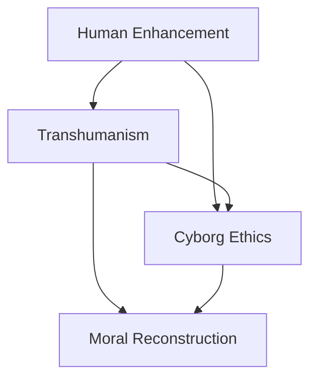
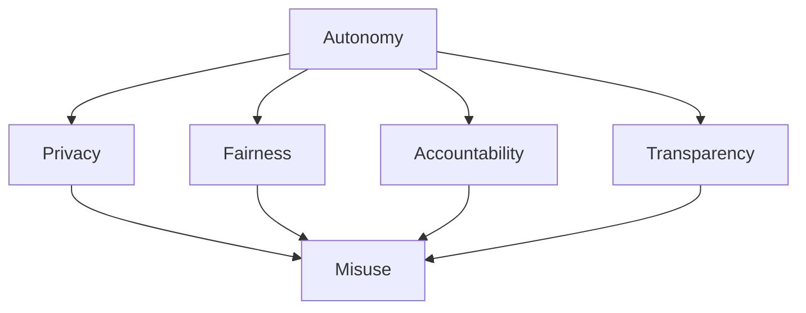

                 

### Introduction to Posthuman Ethics Symposium: Moral Reconstruction in the Age of Artificial Intelligence

#### Keywords:
- **Posthuman Ethics**
- **Artificial Intelligence Ethics**
- **Moral Reconstruction**
- **AI Governance**
- **Philosophical Frameworks**

#### Abstract:
In the era of rapid advancement in artificial intelligence, the ethical implications and moral reconstruction processes are of paramount importance. This symposium, "Posthuman Ethics Symposium: Moral Reconstruction in the Age of Artificial Intelligence," aims to explore the complex interplay between AI technologies and ethical frameworks. The symposium will delve into core concepts of posthuman ethics, analyze ethical dilemmas posed by AI, propose moral frameworks, and discuss legal and regulatory considerations. By engaging with experts from various disciplines, the symposium seeks to provide a comprehensive understanding of the ethical landscape in the age of AI and guide the development of robust moral principles for AI governance.

---

## Chapter 1: Introduction to Posthuman Ethics and AI

### 1.1 Definition and Evolution of Posthuman Ethics

#### Background Introduction:
Posthuman ethics is a field of study that examines the moral and ethical implications of human enhancement and the transition from human-centric to posthuman societies. The concept of the posthuman emerged in the late 20th century, drawing on various disciplines including philosophy, science, and technology. It questions the nature of humanity and explores the potential future where humans, through technological interventions, transcend traditional biological and cognitive limits.

#### Core Concepts and Relationships:
The core concepts in posthuman ethics include human enhancement, transhumanism, and cyborg ethics. These concepts are interconnected, with human enhancement focusing on the modification of human bodies and minds to improve or extend their capabilities. Transhumanism extends this idea to the idea of overcoming the limitations of human nature through technological advancement. Cyborg ethics, on the other hand, addresses the ethical implications of integrating humans with technology, creating entities that are part-machine, part-human.

#### Mermaid Flowchart:

### 1.2 The Rise of Artificial Intelligence and Its Ethical Implications

#### Background Introduction:
The rapid advancement of artificial intelligence (AI) has brought about significant changes in various aspects of society, including economic, social, and political spheres. AI systems are increasingly being integrated into everyday life, performing tasks that were once considered the exclusive domain of humans. However, this progress raises important ethical questions about the moral responsibilities of AI developers, the potential consequences of AI misuse, and the impact on human autonomy and privacy.

#### Core Concepts and Relationships:
The core concepts related to AI ethics include autonomy, privacy, fairness, accountability, and transparency. Autonomy refers to the ability of individuals to make independent decisions without interference from AI systems. Privacy concerns the protection of personal information and the prevention of unauthorized access. Fairness involves ensuring that AI systems do not perpetuate biases or discrimination. Accountability addresses the responsibility of AI developers and users for the actions of AI systems. Transparency involves making AI systems' decision-making processes understandable and predictable.

#### Mermaid Flowchart:

### 1.3 The Purpose and Structure of the Book

#### Purpose:
The purpose of this book is to provide a comprehensive examination of posthuman ethics and moral reconstruction in the age of AI. By addressing the key ethical challenges posed by AI and proposing practical solutions, the book aims to guide policymakers, ethicists, AI developers, and the general public in navigating the ethical landscape of the future.

#### Structure:
The book is structured into five main sections:

1. **Introduction to Posthuman Ethics and AI**: Provides an overview of the key concepts and frameworks.
2. **Core Concepts and Frameworks**: Delves into the core concepts of posthuman ethics and AI ethics.
3. **Ethical Dilemmas in AI**: Explores the ethical challenges and dilemmas posed by AI.
4. **Moral Frameworks for AI**: Discusses various moral frameworks and principles for AI.
5. **Legal and Regulatory Considerations**: Analyzes the legal and regulatory landscape and its impact on AI ethics.

### Conclusion:
This chapter has introduced the fundamental concepts of posthuman ethics and AI ethics, highlighting their importance in the current technological landscape. The subsequent chapters will build upon this foundation, exploring the ethical implications of AI, proposing moral frameworks, and discussing the legal and regulatory considerations to guide the development and deployment of AI in a way that aligns with ethical principles and societal values.

