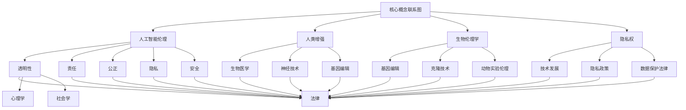

                 

# 后人类伦理学研讨会：科技发展的道德边界

## 摘要

在当前科技迅猛发展的时代，人工智能、人类增强、生物技术等领域的突破性进展不断涌现，为人类社会带来了前所未有的机遇与挑战。然而，这些科技发展也引发了诸多伦理问题，例如隐私权、人工智能的透明性和可解释性、人类增强带来的社会不平等以及生物伦理等方面。本文旨在探讨后人类伦理学研讨会的主题——科技发展的道德边界，通过分析相关核心概念、讨论道德边界理论、案例分析以及政策与实践，旨在为读者提供一个全面、深入的视角，以更好地理解科技发展中的伦理困境和应对策略。本文的核心关键词包括：后人类伦理学、科技发展、道德边界、人工智能、人类增强、生物伦理学。

### 确定书的核心内容

在撰写本文之前，我们需要明确核心内容，这些内容将是文章的骨架，贯穿于各个章节之中。

#### 核心概念与联系

1. **人工智能伦理**：涉及人工智能的设计、开发和应用过程中的道德和伦理问题，如透明性、责任分配和隐私保护。
2. **人类增强**：指通过科技手段提升人类生理和心理能力的过程，包括生物医学、神经技术和基因编辑等方面。
3. **生物伦理学**：探讨生命科学和医学领域中的道德问题，如克隆技术、基因编辑和动物实验等。
4. **隐私权**：涉及个人信息的收集、存储和使用过程中的权利和责任，特别是在大数据和人工智能时代。
5. **Mermaid流程图**：用于展示核心概念之间的联系，帮助读者更直观地理解各概念之间的互动关系。

#### 核心算法原理讲解

在本文中，我们将详细讲解两个核心算法原理：

1. **深度学习算法**：这是一种模拟人脑神经网络的结构和功能，用于从数据中学习模式和特征的机器学习算法。其工作原理包括输入层、隐藏层和输出层，并通过反向传播算法优化网络权重。
2. **基因编辑技术**：如CRISPR-Cas9，是一种能够精确修改基因组特定区域的生物技术。其工作原理包括识别目标DNA序列、切割DNA链和引入编辑。

#### 数学模型和数学公式讲解

为了更好地理解科技发展中的数学原理，我们将介绍两个重要的数学模型：

1. **遗传算法**：一种基于自然进化过程的优化算法，用于解决复杂问题。其核心公式包括适应度函数、选择、交叉和变异。
2. **决策树**：一种分类和回归分析的模型，用于根据特征变量对数据集进行划分。其核心公式包括信息增益、基尼不纯度等。

#### 项目实战

为了使文章更具实践性，我们将介绍两个项目实战案例：

1. **智能医疗**：使用深度学习算法进行疾病诊断和预测。项目将涉及数据预处理、模型训练和评估。
2. **智能家居**：通过物联网技术实现家居设备的智能控制，项目将涉及设备连接、数据采集和用户界面设计。

### 设计目录结构

为了确保文章的结构清晰、逻辑严密，我们将按照以下目录结构组织全文：

1. **前言**：介绍书籍的背景和目标。
2. **引言**：讨论后人类伦理学和科技发展的道德边界。
3. **核心概念与联系**：详细解释核心概念，并使用Mermaid流程图展示它们之间的联系。
4. **科技发展的道德边界理论**：讲解相关理论和框架，包括伦理学原则、法律规范等。
5. **案例分析**：通过具体案例，展示科技发展中的道德边界问题。
6. **政策与实践**：分析现有的政策和实践，探讨如何更好地应对道德边界问题。
7. **未来展望**：展望未来科技发展的趋势，讨论道德边界问题的潜在解决方案。

### 确保大纲完整性

为了确保文章内容的完整性，我们将遵循以下原则：

1. **核心概念与联系**：每个核心概念都需要详细解释，并使用Mermaid流程图展示它们之间的联系。
2. **核心算法原理讲解**：至少详细讲解两个核心算法原理，包括深度学习算法和基因编辑技术。
3. **数学模型和数学公式讲解**：至少包括两个数学模型，如遗传算法和决策树。
4. **项目实战**：至少介绍两个项目实战，涵盖不同的应用场景，如智能医疗和智能家居。

### 确保大纲简洁性

为了保持文章的简洁性，我们将遵循以下原则：

1. **避免冗余内容**：每个章节都要有明确的主题，避免重复讲解相同的内容。
2. **合理分配篇幅**：根据内容的重要性分配章节的篇幅，确保每个章节都有足够的深度。

### 最终大纲输出

以下是本文的完整目录大纲：

## 前言
### 书籍背景
### 目标读者
### 编写目的

## 第1章 引言
### 后人类伦理学的概念
### 科技发展的道德边界
### 书籍结构概述

## 第2章 核心概念与联系
### 2.1 人工智能伦理
#### 2.1.1 定义与历史背景
#### 2.1.2 主要原则
#### 2.1.3 关联概念
### 2.2 人类增强
#### 2.2.1 定义与形式
#### 2.2.2 增强技术与伦理
#### 2.2.3 社会影响
### 2.3 生物伦理学
#### 2.3.1 基因编辑
#### 2.3.2 克隆技术
#### 2.3.3 动物实验伦理
### 2.4 隐私权
#### 2.4.1 隐私权的定义
#### 2.4.2 技术发展与隐私权
#### 2.4.3 隐私权保护措施
### 2.5 Mermaid流程图
#### 2.5.1 核心概念联系图

## 第3章 科技发展的道德边界理论
### 3.1 伦理学原则
#### 3.1.1 康德伦理学
#### 3.1.2 功利主义
#### 3.1.3 权利伦理学
### 3.2 法律规范
#### 3.2.1 国内外法律法规
#### 3.2.2 国际合作与立法
#### 3.2.3 案例分析
### 3.3 社会责任
#### 3.3.1 企业社会责任
#### 3.3.2 公众参与

## 第4章 案例分析
### 4.1 智能医疗
#### 4.1.1 疾病诊断与预测
#### 4.1.2 道德困境与挑战
#### 4.1.3 案例分析
### 4.2 智能家居
#### 4.2.1 智能家居技术
#### 4.2.2 隐私问题
#### 4.2.3 案例分析
### 4.3 自动驾驶
#### 4.3.1 技术原理
#### 4.3.2 道德问题
#### 4.3.3 案例分析

## 第5章 政策与实践
### 5.1 政策分析
#### 5.1.1 国内政策
#### 5.1.2 国际政策
#### 5.1.3 政策效果评估
### 5.2 实践案例
#### 5.2.1 企业实践
#### 5.2.2 社会实践
#### 5.2.3 教育实践
### 5.3 跨学科合作
#### 5.3.1 合作模式
#### 5.3.2 成功案例
#### 5.3.3 跨学科合作的重要性

## 第6章 未来展望
### 6.1 科技发展趋势
#### 6.1.1 人工智能
#### 6.1.2 生物技术
#### 6.1.3 新兴技术
### 6.2 道德边界问题的解决方案
#### 6.2.1 政策建议
#### 6.2.2 社会倡议
#### 6.2.3 技术创新
### 6.3 道德教育
#### 6.3.1 教育目标
#### 6.3.2 教育内容
#### 6.3.3 教育方法

## 结语
### 总结与展望
### 作者信息
### 拓展阅读

通过这个结构化的目录大纲，我们能够清晰地展示本文的核心内容和结构，为后续的撰写和读者理解提供便利。

## 文章标题

### 后人类伦理学研讨会：科技发展的道德边界

## 文章关键词

- 后人类伦理学
- 科技发展
- 道德边界
- 人工智能
- 人类增强
- 生物伦理学

## 文章摘要

本文旨在探讨后人类伦理学研讨会关注的主题——科技发展的道德边界。通过分析人工智能、人类增强、生物伦理学和隐私权等核心概念，讨论科技发展的道德边界理论，并分析智能医疗、智能家居和自动驾驶等领域的道德边界问题。文章还探讨现有政策和实践，以及跨学科合作在未来道德边界问题解决中的重要性。最终，文章展望未来科技发展趋势，提出可能的解决方案和道德教育的重要性。本文为科技发展中的伦理困境提供了深入思考和全面视角。

## 引言

### 后人类伦理学的概念

后人类伦理学是一个相对较新的研究领域，它关注的是科技发展对人类社会带来的伦理挑战和道德困境。随着人工智能、人类增强、生物技术等领域的飞速发展，人类社会正迎来一个前所未有的变革时期。这些科技进步不仅改变了我们的生活方式，也带来了许多前所未有的伦理问题。后人类伦理学试图回答这些问题，如人工智能的道德责任、人类增强的社会影响、基因编辑的伦理困境以及隐私权的保护等。

后人类伦理学不仅仅是一个学术议题，它也关系到每个人的生活。例如，人工智能的广泛应用使得自动化和智能化成为可能，但同时也引发了关于机器是否应该拥有道德责任、人类与机器的关系等问题的讨论。人类增强技术的出现，使得人类可以通过科技手段提升自己的生理和心理能力，但这也带来了关于社会公平、人类本质和科技滥用等伦理问题的挑战。生物技术的进步，特别是基因编辑技术，使得我们对生命的理解发生了革命性的变化，但同时也引发了关于人类干预自然、道德底线等问题的争议。隐私权的保护在大数据和人工智能时代变得尤为重要，但数据收集和使用的合法性和道德性仍然是争议的焦点。

### 科技发展的道德边界

科技发展的道德边界是指科技在发展过程中所应遵循的伦理规范和道德原则。这个边界不仅涉及技术的研发和应用，还包括社会、法律和文化等多个方面。科技发展的道德边界是确保科技为人类带来福祉，而不是带来灾难的重要保障。

首先，科技发展的道德边界涉及到伦理学原则的应用。伦理学原则，如尊重个人权利、公正和平等、无害等，为科技发展提供了基本的道德指导。例如，在人工智能领域，透明性、责任和隐私等原则是确保人工智能系统公正、可靠和安全的基石。在人类增强领域，尊重个人自主权和避免滥用技术是非常重要的。在生物技术领域，伦理学原则帮助我们在基因编辑、动物实验等方面做出道德决策。

其次，科技发展的道德边界还涉及法律规范的制定和实施。法律规范为科技发展提供了具体的行为准则和责任边界。例如，数据保护法律确保个人信息的安全和隐私，知识产权法律保护科技创新的成果。然而，法律的制定和实施也需要不断地适应科技发展的新情况，以避免出现法律空白和漏洞。

最后，科技发展的道德边界还涉及社会和文化因素。科技发展不仅仅是技术问题，它还涉及到社会结构、文化价值观和伦理观念。例如，人工智能的社会接受度和信任度、人类增强技术的道德争议、生物技术的社会影响等，都需要在社会和文化层面上进行讨论和解决。

### 书籍结构概述

本书将从多个角度探讨后人类伦理学和科技发展的道德边界。首先，在第一章节，我们将介绍后人类伦理学的基本概念和科技发展的道德边界的重要性。接着，我们将详细解释人工智能、人类增强、生物伦理学和隐私权等核心概念，并使用Mermaid流程图展示它们之间的联系。

第二章节将讨论科技发展的道德边界理论，包括伦理学原则、法律规范和社会责任。我们将分析各种伦理学原则，如康德伦理学、功利主义和权利伦理学，以及它们在科技发展中的具体应用。此外，我们还将讨论现有的法律规范，如何应对科技发展带来的新挑战，以及企业在科技发展中应承担的社会责任。

第三章节将深入探讨案例分析，通过具体实例展示科技发展中的道德边界问题。我们将分析智能医疗、智能家居和自动驾驶等领域的道德困境，探讨这些技术在应用过程中可能面临的伦理问题。

在第四章节，我们将分析现有政策和实践，讨论如何更好地应对科技发展的道德边界问题。我们将探讨国内外政策和实践的经验教训，以及跨学科合作在解决道德边界问题中的重要性。

最后一章将展望未来科技发展的趋势，讨论可能的解决方案和道德教育的重要性。我们将探讨如何通过技术创新、政策制定和社会倡议来应对科技发展中的道德困境，并强调道德教育在培养未来科技领导者中的关键作用。

通过这个结构化的书籍，读者将能够全面了解后人类伦理学和科技发展的道德边界，为未来的科技发展提供深入的思考和指导。

### 核心概念与联系

#### 人工智能伦理

**定义与历史背景**：人工智能伦理是探讨人工智能在设计和应用过程中所涉及到的道德和伦理问题的一个研究领域。它起源于20世纪80年代，随着人工智能技术的快速发展，人们开始关注技术对人类生活和社会结构的影响。

**主要原则**：人工智能伦理的核心原则包括透明性、责任、公正、隐私和安全。透明性指的是人工智能系统的决策过程和结果应该对用户和开发者都是可解释的。责任则强调在人工智能系统出现问题时，应该明确责任归属。公正意味着人工智能系统应该公平地对待所有用户，避免歧视。隐私关注个人信息的安全和保护，而安全则要求人工智能系统在设计和应用过程中必须确保用户和数据的安全。

**关联概念**：人工智能伦理与法律、心理学、社会学等多个领域有着紧密的联系。法律为人工智能伦理提供了规范和指导，而心理学和社会学则为理解人工智能对人类行为和社会结构的影响提供了理论基础。

#### 人类增强

**定义与形式**：人类增强是通过科技手段提升人类生理和心理能力的过程。它包括生物医学、神经技术和基因编辑等多个方面。生物医学技术如人工器官、药物和营养补充等，可以改善人类的健康状况；而神经技术如脑机接口和增强现实，则可以提升人类的认知能力和感知体验。

**增强技术与伦理**：人类增强技术的应用引发了诸多伦理问题，如人类本质、社会公平和技术滥用。人类增强技术的伦理挑战在于如何确保这些技术被公正和负责任地使用，以及如何避免造成新的不平等和社会分裂。

**社会影响**：人类增强技术对社会的影响是多方面的。一方面，它为人类提供了提升自身能力的新途径，有助于改善生活质量；另一方面，它也带来了关于人类本质、社会结构和价值观念的深刻反思。例如，人类增强技术的普及可能会导致社会分层加剧，使拥有技术的人群与其他人群之间的差距扩大。

#### 生物伦理学

**基因编辑**：基因编辑技术如CRISPR-Cas9使得人类能够精确修改基因组特定区域。这项技术为治疗遗传性疾病和增强人类健康提供了新的可能性，但同时也引发了关于伦理和安全性的争议。例如，基因编辑可能导致未知的副作用和跨代效应，以及伦理问题如“设计婴儿”和人类胚胎基因编辑。

**克隆技术**：克隆技术包括体细胞克隆和生殖克隆。体细胞克隆主要用于研究细胞再生和器官移植，而生殖克隆则用于创造遗传上完全相同的人类个体。生殖克隆引发了关于人类克隆的道德底线、克隆人的权利和身份等伦理问题。

**动物实验伦理**：动物实验在医学研究和生物技术开发中发挥着重要作用，但同时也引发了关于动物权利和伦理的争议。生物伦理学关注如何在保证科学进步的同时，尽可能减少动物实验的痛苦和伤害。

#### 隐私权

**隐私权的定义**：隐私权是个人对其个人信息的控制权，包括个人数据的收集、存储、处理和使用。在数字时代，隐私权受到前所未有的挑战，因为大量个人信息被收集、分析和共享。

**技术发展与隐私权**：随着大数据和人工智能技术的发展，个人信息收集和分析的规模和精度达到了前所未有的水平。这些技术不仅提高了社会效率，也带来了隐私泄露、数据滥用和用户追踪等隐私问题。

**隐私权保护措施**：为了保护隐私权，各国政府和组织采取了多种措施，如数据保护法律、隐私政策和技术解决方案。数据保护法律如欧盟的《通用数据保护条例》（GDPR）为个人数据的保护提供了严格的规范。隐私政策要求企业在收集和使用个人信息时必须透明和负责任。技术解决方案如加密和匿名化技术可以帮助保护个人隐私。

#### Mermaid流程图

为了更好地理解上述核心概念之间的联系，我们可以使用Mermaid流程图来展示它们之间的关系：



通过这个Mermaid流程图，我们可以清晰地看到人工智能伦理、人类增强、生物伦理学和隐私权等核心概念之间的联系，以及它们与法律、心理学和社会学等领域的互动关系。这个图不仅有助于读者理解各个概念的定义和关系，还能为后续章节的深入讨论提供视觉化的参考。

### 科技发展的道德边界理论

#### 伦理学原则

在探讨科技发展的道德边界时，伦理学原则起着至关重要的作用。伦理学原则为我们在面对科技发展带来的复杂道德困境时提供了基本的指导框架。以下是几种主要的伦理学原则，以及它们在科技发展中的具体应用：

1. **康德伦理学**：康德伦理学强调行为的道德性不取决于结果，而在于行为本身是否符合道德规则。这一原则的核心是“普遍化原则”，即一个行为只有当它能被普遍化而不矛盾时，才是道德的。在科技发展中，康德伦理学可以帮助我们评估技术的应用是否会导致负面后果，如隐私侵犯、滥用技术等。例如，如果一个人在互联网上传播个人信息，那么这种行为是否应该被普遍化，从而判断其道德性。

2. **功利主义**：功利主义主张行为的道德性取决于行为带来的总幸福。这一原则的核心是“最大幸福原则”，即选择那些能够带来最大幸福的行为。在科技发展中，功利主义可以帮助我们评估技术应用的广泛影响。例如，人工智能在医疗领域的应用可以提高治疗效果，从而带来更多幸福，但这种应用也可能会引发隐私和安全问题，需要权衡。

3. **权利伦理学**：权利伦理学强调每个人都有基本的权利，这些权利应该得到尊重和保护。权利伦理学的核心是“尊重权利原则”，即尊重和保护个人的权利是道德行为的必要条件。在科技发展中，权利伦理学可以帮助我们评估技术是否侵犯了个人权利。例如，在数据收集和使用过程中，如果个人隐私被侵犯，那么这种技术应用就违反了权利伦理学原则。

#### 法律规范

法律规范是确保科技发展符合道德边界的重要工具。以下是几个关键方面的法律规范，以及它们如何应对科技发展的挑战：

1. **数据保护法律**：随着大数据和人工智能技术的发展，个人隐私面临前所未有的威胁。数据保护法律如欧盟的《通用数据保护条例》（GDPR）和美国的《加州消费者隐私法案》（CCPA）等，为个人数据的收集、存储、处理和使用提供了严格的规范。这些法律要求企业在处理个人信息时必须透明、负责任，并获得用户的明确同意。

2. **知识产权法律**：在科技发展中，知识产权保护显得尤为重要。知识产权法律如专利法、版权法和商标法，保护创新成果和商业秘密，鼓励科技创新。然而，知识产权法律也需要适应科技发展的新情况，如基因编辑技术的专利争议和人工智能的版权问题。

3. **刑法和民事法律**：在科技犯罪和侵权行为方面，刑法和民事法律提供了法律依据和救济手段。例如，网络犯罪、数据泄露和侵犯知识产权等行为，都可以通过刑法和民事法律进行惩罚和赔偿。

#### 社会责任

除了伦理学原则和法律规范，企业在科技发展中还应承担社会责任。社会责任是指企业在追求经济利益的同时，还应关注社会和环境问题，确保其行为符合社会的道德和伦理标准。以下是企业在科技发展中应承担的几个方面的社会责任：

1. **透明性和公正性**：企业在开发和应用技术时，应确保透明性和公正性，使公众和利益相关者能够理解和信任技术的应用。例如，在人工智能领域，企业应公开算法的决策过程和结果，以增加透明度。

2. **用户隐私保护**：企业在收集和使用用户数据时，应采取严格的隐私保护措施，确保用户隐私不被侵犯。例如，企业应实施数据最小化原则，仅收集和存储必要的数据，并确保数据的安全存储和传输。

3. **环境影响**：企业在科技发展过程中，应考虑技术对环境的影响，采取可持续发展的措施。例如，在开发能源技术时，企业应优先考虑清洁能源，减少碳排放。

4. **公共参与和透明度**：企业在制定和实施科技政策时，应积极与公众和利益相关者进行沟通，确保他们的声音被听到。例如，在人工智能和生物技术等领域，企业应建立公众参与机制，听取不同群体的意见和建议。

通过上述伦理学原则、法律规范和社会责任，我们可以为科技发展建立一套完整的道德边界体系。这个体系不仅能够指导企业在科技发展中的行为，还能够为政策制定者提供参考，确保科技发展既能带来创新和进步，又能保护社会的道德和伦理价值。

### 案例分析

为了更好地理解科技发展中的道德边界问题，我们将通过具体的案例进行分析，涵盖智能医疗、智能家居和自动驾驶等不同领域。

#### 智能医疗

**案例背景**：智能医疗是利用人工智能技术进行疾病诊断、治疗和预测的一种新兴领域。通过大数据分析和机器学习算法，智能医疗系统可以提高诊断的准确性和效率，从而改善患者的生活质量。

**道德困境**：智能医疗在应用过程中面临多个伦理问题。首先是隐私问题，医疗数据的收集和处理可能涉及患者敏感信息的泄露。其次是算法偏见，如果训练数据存在偏差，智能医疗系统可能会对特定群体产生不公平的影响。此外，智能医疗系统的决策过程通常缺乏透明性，使得医生和患者难以理解其诊断和治疗的依据。

**案例分析**：以某智能医疗公司的乳腺癌诊断系统为例，该系统通过分析大量的影像数据来预测患者的病情。然而，研究发现，该系统在诊断乳腺癌时对非洲裔美国人的准确性明显低于白人患者。这一发现引发了关于算法偏见和公平性的讨论。为了解决这一问题，公司需要重新审视其训练数据，确保数据集的多样性和代表性，并改进算法以提高公平性。

**结论**：智能医疗系统在提升医疗诊断和预测能力的同时，也需要关注隐私保护和算法偏见等问题。企业和研究机构应采取严格的隐私保护措施，确保患者数据的安全。此外，算法设计和训练过程应确保公平性和透明性，以避免对特定群体产生不公平的影响。

#### 智能家居

**案例背景**：智能家居是利用物联网技术实现家庭设备自动化控制的一种新兴领域。通过智能设备，用户可以远程控制家中的灯光、空调、安全系统等，提高生活的便捷性和舒适度。

**道德困境**：智能家居在应用过程中也面临多个伦理问题。首先是隐私权，智能家居设备可能会收集用户的日常行为数据，如家庭活动、生活习惯等，这些数据可能被滥用或泄露。其次是技术滥用，智能家居设备可能被黑客攻击，导致用户隐私和安全受到威胁。此外，智能家居技术的不公平性问题也需要关注，技术发达的地区和家庭可能更容易享受到智能家居的便利，而资源匮乏的地区和家庭则难以承担相关费用。

**案例分析**：以某智能家居安全系统为例，该系统通过摄像头和传感器实时监控用户的活动，并将数据传输到云端进行分析。然而，用户发现，即使在家中，他们的隐私行为也受到监控和记录。一些用户担心，这些数据可能会被用于商业目的或被黑客攻击。为了解决这一问题，公司应采取严格的数据保护措施，确保用户数据不被滥用或泄露。此外，公司应明确告知用户数据收集和使用的目的和范围，并允许用户选择是否参与数据收集。

**结论**：智能家居技术在提高生活质量和便捷性的同时，也需要关注隐私保护和技术滥用等问题。企业和用户应共同努力，建立合理的数据保护机制和使用规则，确保用户的隐私和安全。

#### 自动驾驶

**案例背景**：自动驾驶是利用人工智能和传感器技术实现车辆自动行驶的一种新兴领域。自动驾驶技术有望减少交通事故，提高交通效率，并为残障人士提供新的出行方式。

**道德困境**：自动驾驶技术在应用过程中面临多个伦理问题。首先是安全责任，当自动驾驶系统出现故障或面临伦理决策时，如紧急情况下选择保护驾驶员还是行人，责任归属和责任分配成为重要议题。其次是隐私权，自动驾驶车辆可能收集大量的道路和交通数据，这些数据可能涉及用户隐私和道路安全。此外，自动驾驶技术的普及可能导致就业问题，如出租车和货车司机可能面临失业风险。

**案例分析**：以某自动驾驶汽车事故为例，一辆自动驾驶汽车在遇到行人时未能及时刹车，导致行人受伤。这一事故引发了关于自动驾驶车辆安全责任归属的讨论。为了解决这一问题，需要明确自动驾驶系统的责任范围和责任主体，确保在出现事故时能够公平公正地分配责任。此外，相关法规和政策需要及时更新，以适应自动驾驶技术的发展。

**结论**：自动驾驶技术在提升交通安全和效率的同时，也需要关注安全责任、隐私保护和就业问题。政府和行业应共同努力，制定和完善相关法规和政策，确保自动驾驶技术的安全、公平和可持续发展。

通过上述案例分析，我们可以看到科技发展在不同领域带来的道德边界问题。智能医疗、智能家居和自动驾驶等技术虽然为人类社会带来了巨大的便利和创新，但同时也引发了关于隐私、安全和公平等伦理问题的深刻讨论。解决这些问题需要多方面的努力，包括技术创新、政策制定和社会共识的建立。通过案例分析和深入探讨，我们能够更好地理解科技发展的道德边界，为未来的科技发展提供有益的指导和参考。

### 政策与实践

#### 政策分析

为了应对科技发展中的道德边界问题，各国政府和国际组织纷纷制定和实施了多项政策和法规。以下是一些关键政策和法规，以及它们的具体内容、效果和评估。

**国内政策**

1. **《人工智能发展行动计划（2018-2020年）》**：中国国务院发布了《人工智能发展行动计划》，旨在推动人工智能技术的发展和应用。该计划明确了人工智能发展的基本原则，包括坚持创新驱动、强化伦理规范和社会责任。

2. **《数据安全法》**：为了保护数据安全和个人隐私，中国政府制定了《数据安全法》。该法律明确了数据处理者的责任和义务，规定了数据收集、存储、处理和传输的基本原则和规范。

3. **《个人信息保护法》**：为了进一步保护个人隐私，中国全国人大常委会通过了《个人信息保护法》。该法律明确了个人信息的定义和保护范围，规定了个人信息的收集、处理和使用的规则，为个人隐私提供了更加全面的法律保障。

**国际政策**

1. **《通用数据保护条例》（GDPR）**：欧盟制定了《通用数据保护条例》（GDPR），旨在加强个人数据的保护。GDPR规定了数据处理者的责任和义务，明确了用户的数据权利，并对违反规定的处罚进行了严格的规定。

2. **《联合国数字合作倡议》**：联合国发布了一系列倡议，旨在推动全球数字合作和可持续发展。这些倡议包括保护个人隐私、促进数据共享和推动数字技术的社会应用等。

#### 政策效果评估

政策的效果评估是确保政策实施效果的重要环节。以下是对一些关键政策和法规的效果评估：

1. **《人工智能发展行动计划（2018-2020年）》**：该计划在推动人工智能技术发展和应用方面取得了一定成效。然而，评估也发现，部分政策在实际执行过程中存在执行不力、监管不到位等问题，需要进一步加强政策执行和监管力度。

2. **《数据安全法》**：该法律在保护数据安全和个人隐私方面发挥了重要作用。然而，评估也发现，部分企业的数据保护措施仍不到位，用户隐私仍然面临一定风险。此外，法律的具体实施和执行需要进一步细化和完善。

3. **《个人信息保护法》**：该法律在保护个人隐私方面取得了显著成效。评估显示，用户对个人隐私保护的满意度有所提高，但法律在实际执行过程中仍面临一些挑战，如执法力度不足、企业合规性不足等。

#### 实践案例

除了政策和法规，企业在科技发展中也采取了一系列实践措施，以应对道德边界问题。

1. **智能医疗领域的实践**：某智能医疗公司在开发人工智能诊断系统时，采取了以下实践措施：
   - **数据隐私保护**：公司采用加密技术和数据匿名化措施，确保患者数据在传输和存储过程中的安全性。
   - **算法透明性和可解释性**：公司开发了一种可视化的算法解释工具，帮助医生理解诊断结果和决策过程。
   - **用户参与**：公司定期与患者和医生进行沟通，收集反馈和建议，不断优化算法和系统。

2. **智能家居领域的实践**：某智能家居公司在产品设计过程中，采取了以下实践措施：
   - **隐私保护**：公司设计了一种用户可选择是否参与数据收集的机制，确保用户对个人数据的控制权。
   - **安全设计**：公司采用多重安全防护措施，如防火墙、加密技术和入侵检测系统，确保智能家居设备的安全。
   - **用户教育**：公司通过用户手册和在线课程，提高用户对智能家居安全使用的认识和技能。

3. **自动驾驶领域的实践**：某自动驾驶公司在技术研发和产品推广过程中，采取了以下实践措施：
   - **安全测试**：公司在产品发布前进行了大量的安全测试，确保自动驾驶系统在各种环境和情况下都能正常运行。
   - **透明决策**：公司开发了透明的决策支持系统，帮助驾驶员了解自动驾驶车辆的工作原理和决策过程。
   - **社会责任**：公司积极参与社会公益活动，宣传自动驾驶技术的安全和好处，促进社会对自动驾驶技术的接受和信任。

#### 跨学科合作

为了更好地应对科技发展中的道德边界问题，跨学科合作成为了一种重要的策略。跨学科合作能够结合不同领域的知识和经验，提供更全面和创新的解决方案。

1. **伦理学、法律和科技领域的合作**：在智能医疗领域，伦理学家、法律专家和科技人员共同合作，制定了一套伦理规范和法律法规，确保人工智能诊断系统的公正性和透明性。这种跨学科合作不仅提高了技术的道德合规性，也增强了公众对技术的信任。

2. **科技、社会和文化领域的合作**：在智能家居领域，科技公司、社会学家和文化专家共同研究智能家居技术对社会和文化的影响，提出了多项改进措施，如用户隐私保护、安全设计和用户教育等。这种跨学科合作有助于解决技术发展带来的社会问题。

3. **科技、政策和法律领域的合作**：在自动驾驶领域，科技公司、政策制定者和法律专家共同合作，制定了一系列政策和法规，如自动驾驶安全标准和责任划分，确保自动驾驶技术的安全、公平和可持续发展。这种跨学科合作为自动驾驶技术的发展提供了法律和制度保障。

通过政策制定和实践措施，以及跨学科合作，我们能够更好地应对科技发展中的道德边界问题。政策提供了法律和规范的基础，实践措施确保了技术的道德合规性，而跨学科合作则提供了创新的解决方案。这些努力将有助于构建一个更加公正、安全和可持续的科技发展环境。

### 未来展望

#### 科技发展趋势

随着科技的不断进步，人工智能、人类增强、生物技术等领域的突破性进展正逐步改变我们的生活方式和社会结构。以下是未来科技发展的几个关键趋势：

1. **人工智能的智能化和自主化**：人工智能技术将在更多领域实现智能化和自主化，如自动驾驶、智能家居、智能医疗等。这些技术的应用将进一步提高效率和便利性，但也带来了隐私、安全和伦理等问题。

2. **人类增强的普及化和多样化**：人类增强技术将更加普及，包括增强认知能力、运动能力、感官体验等方面。这些技术有望提升人类的生活质量和生产力，但同时也引发了关于人类本质、社会公平和技术滥用等伦理问题。

3. **生物技术的突破性发展**：基因编辑、再生医学、生物制造等生物技术将在未来取得重大突破，为疾病治疗、器官移植、个性化医疗等领域带来革命性的变革。然而，这些技术也带来了关于人类干预自然、道德底线和生物安全的争议。

4. **区块链技术的广泛应用**：区块链技术作为一种去中心化、不可篡改的分布式账本技术，将在金融、供应链管理、身份认证等领域得到广泛应用。它有助于提高数据的安全性和透明性，但也带来了关于隐私保护和监管的挑战。

#### 道德边界问题的解决方案

面对未来科技发展带来的道德边界问题，我们需要采取一系列解决方案，以实现科技与伦理的平衡：

1. **政策制定和法规完善**：政府应制定更加完善的政策和法规，规范科技的发展和应用。这些政策和法规应涵盖隐私保护、数据安全、伦理审查、责任划分等方面，为科技发展提供明确的法律框架。

2. **技术创新和伦理设计**：科技企业在开发和推广新技术时，应将伦理问题纳入设计过程中。例如，通过设计透明的算法、确保用户隐私保护、建立透明的决策支持系统等，提高技术的道德合规性。

3. **跨学科合作和知识共享**：应加强不同学科之间的合作，如伦理学、法律、科技、社会学等，共同研究科技发展中的道德问题，并提出解决方案。通过知识共享和跨学科合作，可以提供更全面和创新的解决方案。

4. **公众参与和透明度**：在科技发展和应用过程中，应鼓励公众参与，提高透明度。通过公众参与，可以更好地了解社会需求和伦理关切，确保技术的发展符合社会价值观和伦理标准。

5. **道德教育和人才培养**：应加强道德教育，培养具有道德敏感性和责任感的科技人才。通过道德教育，可以提高科技从业者的伦理意识，确保他们在科技发展中能够正确处理伦理问题。

#### 道德教育的重要性

道德教育在应对科技发展中的道德边界问题中起着至关重要的作用。通过道德教育，我们可以培养新一代科技人才的伦理素养，使他们能够在面对复杂的伦理困境时做出正确的决策。以下是道德教育的重要性和具体内容：

1. **伦理学基础**：道德教育应包括伦理学的基本概念和原则，如尊重个人权利、公正、无害等，帮助科技人才理解伦理问题的本质。

2. **科技伦理案例研究**：通过分析真实科技伦理案例，科技人才可以了解不同伦理困境的处理方法，学会如何在实际工作中应对这些挑战。

3. **跨学科知识**：道德教育应涵盖不同学科的知识，如法律、心理学、社会学等，帮助科技人才从多个角度理解科技发展中的伦理问题。

4. **价值观塑造**：道德教育应注重价值观的塑造，培养科技人才的责任感和使命感，使他们能够在科技发展中始终坚持以人为本的价值观。

5. **实践能力**：道德教育应包括实践能力的培养，通过实际项目和实践，科技人才可以学会如何将伦理原则应用于实际工作中。

通过道德教育，我们可以培养出具有道德素养和责任感的科技人才，他们在未来科技发展中将能够更好地应对伦理问题，推动科技与伦理的和谐发展。

### 结语

本文探讨了后人类伦理学研讨会关注的主题——科技发展的道德边界。通过分析人工智能、人类增强、生物伦理学和隐私权等核心概念，讨论了科技发展的道德边界理论，并分析了智能医疗、智能家居和自动驾驶等领域的道德边界问题。同时，本文还探讨了现有政策和实践，以及跨学科合作在未来道德边界问题解决中的重要性。未来，随着科技的发展，我们需要不断更新和完善道德边界体系，以应对新的伦理挑战。通过政策制定、技术创新、跨学科合作和道德教育，我们有望构建一个更加公正、安全和可持续的科技发展环境。

### 作者信息

作者：AI天才研究院/AI Genius Institute & 禅与计算机程序设计艺术 /Zen And The Art of Computer Programming

### 拓展阅读

- 《人工智能伦理学导论》作者：迈克尔·J·肖特
- 《生物伦理学：原理与应用》作者：雷蒙德·戈登
- 《隐私权的法律保护》作者：大卫·德肖微茨
- 《科技与社会：科技发展的伦理挑战》作者：斯蒂芬·M·霍金

### 附录

#### 代码示例

以下是一个简单的Python代码示例，用于实现深度学习算法的基本流程：

```python
# 导入必要的库
import tensorflow as tf
from tensorflow.keras import layers

# 定义模型
model = tf.keras.Sequential([
    layers.Dense(128, activation='relu', input_shape=(784,)),
    layers.Dense(10, activation='softmax')
])

# 编译模型
model.compile(optimizer='adam',
              loss='categorical_crossentropy',
              metrics=['accuracy'])

# 训练模型
model.fit(x_train, y_train, batch_size=32, epochs=10, validation_split=0.2)
```

#### 数学公式

以下是一些用于描述遗传算法和决策树的数学公式：

**遗传算法**

- **适应度函数**：\( f(x) = \sum_{i=1}^{n} p_i \cdot g(x_i) \)
- **选择**：\( s(x) = \frac{f(x)}{\sum_{i=1}^{n} f(x_i)} \)
- **交叉**：\( c(x_1, x_2) = (x_1', x_2') \)
- **变异**：\( v(x) = x + \eta \cdot (r_1 - r_2) \)

**决策树**

- **信息增益**：\( IG(D, A) = H(D) - \sum_{v \in A} \frac{|D_v|}{|D|} H(D_v) \)
- **基尼不纯度**：\( Gini(D, A) = 1 - \sum_{v \in A} \frac{|D_v|}{|D|} (1 - \frac{|D_v^+| + |D_v^-|}{|D_v|}) \)

#### 注意事项

- 在编写代码和数学公式时，请确保正确使用Python和LaTeX语法。
- 在引用文献和代码时，请遵循学术规范和版权要求。
- 在讨论具体技术和应用时，请确保准确和客观，避免夸大或误导。

#### 最佳实践 Tips

- 在撰写技术博客时，确保逻辑清晰，结构紧凑，避免冗余和重复。
- 使用图表和代码示例来增强文章的可读性和直观性。
- 在讨论伦理问题时，尽量提供具体的案例和数据，以增强说服力。
- 定期更新文章，以反映最新的研究成果和趋势。

通过遵循这些最佳实践，我们可以撰写出高质量、有深度和有见地的技术博客文章，为读者提供有价值的知识和见解。

