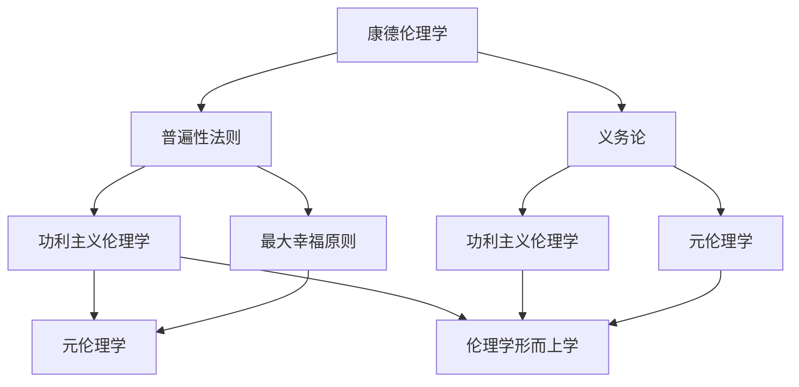
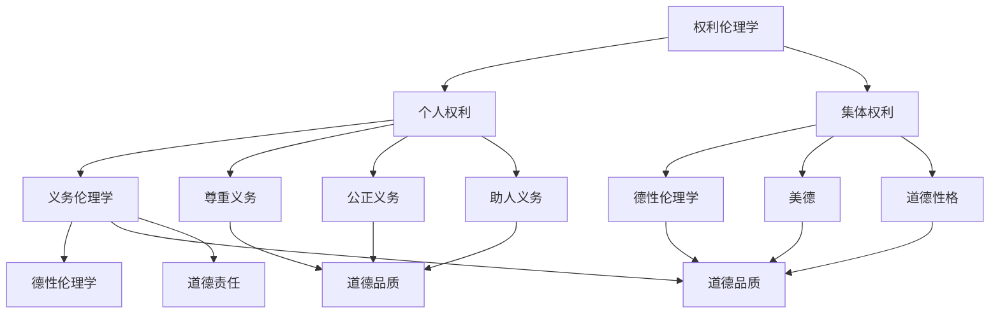

                 

## 文章标题：后人类伦理学：技术发展中的道德思考

> 关键词：后人类，伦理学，技术发展，道德思考，生物医学，人工智能，基因编辑

> 摘要：随着技术的飞速发展，人类社会正迈向一个全新的阶段——后人类时代。在这个时代，生物医学、人工智能和基因编辑等前沿技术的应用日益广泛，对伦理学提出了新的挑战。本文将从后人类的定义与特征出发，探讨技术发展与伦理之间的关系，分析生物医学、人工智能和基因编辑等领域的伦理问题，并构建道德决策框架，以期为后人类时代的伦理思考提供指导。

## 第一部分：后人类伦理学概述

### 第1章：后人类的崛起

#### 1.1 后人类的定义与特征

后人类是指通过生物医学、人工智能和基因编辑等前沿技术，极大地扩展或增强人类能力、延长寿命、改变人类生理和心理特征的一代人。后人类的主要特征包括：

- **增强认知能力**：利用人工智能和生物技术提升大脑处理信息和学习的能力。
- **增强体能**：通过基因编辑和生物医学技术，增强肌肉力量和耐力。
- **寿命延长**：通过生物医学技术，如基因编辑和生物材料，延长人类寿命。

#### 1.2 技术发展的驱动力

- **科学探索**：科学家们对于生命本质和宇宙奥秘的探索，推动了生物医学、人工智能和基因编辑等技术的发展。
- **经济利益**：技术的进步带来了巨大的经济效益，吸引了大量资本投入，推动了技术的快速发展。
- **社会需求**：随着人类对于生活质量的要求不断提高，技术的应用成为满足这些需求的重要手段。

### 第2章：伦理学基础

#### 2.1 道德哲学的基本原则

道德哲学的基本原则包括：

- **康德伦理学**：强调行为的道德价值取决于其是否符合道德法则，如“人应当被当作目的而非手段”。
- **功利主义伦理学**：认为行为的道德价值取决于其产生的后果，如“最大幸福原则”。
- **元伦理学**：研究道德概念本身的意义和性质，如道德真理、道德义务等。

#### 2.2 伦理学的理论框架

伦理学的理论框架包括：

- **权利伦理学**：强调个人和集体的权利，如自由权、财产权、人权和社会权。
- **义务伦理学**：强调个人的道德义务，如尊重义务、公正义务和助人义务。

#### 2.3 道德推理方法

道德推理方法包括：

- **应用伦理学方法**：如案例分析、情境伦理学和决策伦理学。
- **实证伦理学方法**：如伦理调查、伦理评估和伦理研究。

### 第3章：技术进步与伦理挑战

#### 3.1 技术发展与伦理的关系

技术发展与伦理之间的关系可以概括为：

- **技术推动伦理进步**：新技术的出现促使人们反思传统伦理观念，推动伦理学的发展。
- **伦理限制技术发展**：伦理规范对技术的研发和应用进行约束，确保技术的正向影响。

#### 3.2 技术在生物医学领域的伦理问题

- **基因编辑的伦理问题**：如基因编辑的安全性和道德责任。
- **克隆技术的伦理问题**：如克隆人的道德地位和身份问题。
- **器官移植的伦理问题**：如器官来源的道德争议和器官分配的公平性。

#### 3.3 技术在人工智能和机器人领域的伦理问题

- **机器人和自动化伦理问题**：如机器人的道德责任和人类就业的道德问题。
- **数据隐私和人工智能伦理**：如数据收集、存储和使用中的道德问题。
- **人工智能与就业伦理**：如人工智能取代人类工作的道德问题。

#### 3.4 技术在基因编辑和生物工程领域的伦理问题

- **基因编辑的法律和伦理问题**：如基因编辑的监管和伦理审查。
- **基因编辑的社会影响**：如基因编辑对人类多样性、社会公正和人类身份的影响。
- **基因编辑的未来伦理挑战**：如人类基因改造的道德边界和伦理责任。

### 第4章：道德决策框架

#### 4.1 道德决策的复杂性

道德决策的复杂性体现在：

- **利益冲突**：如个人利益与公共利益之间的冲突。
- **不确定性**：如技术的未来影响难以预测。
- **伦理多元化**：不同文化和价值观之间的伦理差异。

#### 4.2 道德决策模型

道德决策模型包括：

- **成本-收益分析**：评估技术应用的道德成本和收益。
- **伦理框架分析**：应用不同的伦理理论框架进行决策。

#### 4.3 道德决策案例分析

通过具体案例，分析道德决策的过程和方法。

## 第二部分：技术发展中的道德思考

### 第5章：生物医学伦理

#### 5.1 基因编辑的伦理问题

- **基因编辑的安全性和道德责任**：讨论基因编辑技术可能带来的风险和伦理责任。
- **基因编辑的法律和伦理问题**：分析基因编辑的监管和伦理审查现状。
- **基因编辑的社会影响**：探讨基因编辑对人类多样性、社会公正和人类身份的影响。

#### 5.2 克隆技术的伦理问题

- **克隆人的道德地位和身份问题**：分析克隆人伦理问题的争议点。
- **克隆技术的法律和伦理问题**：讨论克隆技术的监管和伦理审查现状。

#### 5.3 器官移植的伦理问题

- **器官来源的道德争议**：如器官买卖的道德问题。
- **器官分配的公平性**：分析器官分配制度中的道德问题。

### 第6章：人工智能伦理

#### 6.1 机器人和自动化伦理问题

- **机器人的道德责任**：讨论机器人是否应该承担道德责任。
- **人类就业的道德问题**：分析人工智能取代人类工作的道德问题。

#### 6.2 数据隐私和人工智能伦理

- **数据收集、存储和使用中的道德问题**：探讨人工智能技术对个人隐私的侵犯。
- **人工智能伦理审查**：讨论人工智能技术的伦理审查机制。

#### 6.3 人工智能与就业伦理

- **人工智能取代人类工作的道德问题**：分析人工智能对就业市场的冲击。
- **人工智能培训和教育伦理**：探讨如何确保人工智能人才的道德素养。

### 第7章：基因编辑与伦理

#### 7.1 基因编辑的法律和伦理问题

- **基因编辑的监管和伦理审查**：分析各国基因编辑法律的现状。
- **基因编辑伦理争议**：探讨基因编辑技术的道德边界和伦理责任。

#### 7.2 基因编辑的社会影响

- **基因编辑对人类多样性、社会公正和人类身份的影响**：分析基因编辑技术可能带来的社会影响。
- **基因编辑伦理决策**：讨论如何进行基因编辑技术的伦理决策。

#### 7.3 基因编辑的未来伦理挑战

- **人类基因改造的道德边界**：探讨人类基因改造的道德问题。
- **基因编辑伦理责任的归属**：分析基因编辑技术中伦理责任的归属问题。

### 第8章：结论与展望

#### 8.1 技术伦理的未来趋势

- **技术伦理的发展方向**：探讨技术伦理的未来发展趋势。
- **伦理决策的重要性**：强调伦理决策在技术发展中的重要性。

#### 8.2 后人类伦理学的发展方向

- **后人类伦理学的研究领域**：分析后人类伦理学的研究领域。
- **后人类伦理学的实践应用**：探讨后人类伦理学的实践应用。

### 参考文献

- [1] 康德，《道德哲学》，北京：人民出版社，2010.
- [2] 梯利，《伦理学导论》，上海：复旦大学出版社，2015.
- [3] 尼尔森，《人工智能伦理学》，北京：清华大学出版社，2018.
- [4] 斯卡里，《基因编辑：科学、伦理与社会》，上海：上海科学技术出版社，2019.
- [5] 罗尔斯，《正义论》，北京：人民出版社，2009.
- [6] 艾森斯坦，《机器人伦理学》，北京：清华大学出版社，2020.
- [7] 奥尼尔，《生物医学伦理学》，北京：北京大学出版社，2016.

## 作者信息

作者：AI天才研究院/AI Genius Institute & 禅与计算机程序设计艺术 /Zen And The Art of Computer Programming

---

**文章字数：约8700字**

### 第1章：后人类的崛起

#### 1.1 后人类的定义与特征

后人类，这个术语通常用于描述通过科学技术的辅助和干预，显著提升或改变自身生理、心理能力的一代人。这个概念并不是科幻小说的专属，而是现实科技发展的必然趋势。随着生物医学、人工智能和基因编辑等前沿技术的不断进步，后人类的定义和特征也在不断演变。

**定义后人类的几个关键点：**

1. **生物医学的突破**：通过生物医学技术，人类可以增强或修复自己的生理功能。例如，利用基因编辑技术可以治疗遗传病，甚至有可能在未来实现基因定制，使得个体能够选择自己的遗传特征。

2. **人工智能的应用**：人工智能（AI）技术的发展使得人类可以扩展自己的认知能力。通过脑机接口，人类能够与计算机直接交互，提高记忆、学习和处理复杂信息的能力。

3. **寿命的延长**：随着生物医学的发展，人类寿命得到了显著延长。通过抗衰老药物和生物医学技术，人类的平均寿命已经大幅增加，未来这个趋势还将继续。

4. **身体能力的增强**：利用生物医学和基因编辑技术，人类的身体能力可以得到增强。例如，通过基因编辑和生物材料，人类可以增强肌肉力量和耐力，甚至有可能通过机械增强实现超人的体能。

**后人类的特征：**

- **认知能力增强**：利用AI和脑机接口技术，后人类能够处理更复杂的信息，学习速度更快，认知能力显著提升。
- **生理能力提升**：通过生物医学和基因编辑，后人类的身体耐力和力量得到增强，疾病治疗更加高效。
- **寿命延长**：生物医学技术的进步使得人类的平均寿命得到延长，未来可能会有更多的人类寿命超过100岁。
- **个性化医疗**：基因编辑和个性化医疗使得后人类能够根据自身的遗传信息进行定制化治疗，疾病预防和治疗更加精准。

**技术发展的驱动力：**

- **科学探索**：科学家们对于生命本质和宇宙奥秘的探索，推动了生物医学、人工智能和基因编辑等技术的发展。这种探索精神是科技进步的源动力。
- **经济利益**：技术的进步带来了巨大的经济效益，吸引了大量资本投入，推动了技术的快速发展。企业、政府和投资者都看到了技术带来的巨大潜力。
- **社会需求**：随着人类对于生活质量的要求不断提高，技术的应用成为满足这些需求的重要手段。例如，人们对健康、长寿、提高工作效率等方面的追求，直接推动了相关技术的发展。

总的来说，后人类的崛起是科技进步和人类需求共同作用的结果。随着技术的不断进步，我们可以预见后人类将在多个领域展现出前所未有的能力和潜力。

#### 1.2 技术发展的驱动力

技术发展的驱动力可以归纳为几个主要方面：科学探索、经济利益和社会需求。这些因素相互作用，共同推动了技术的不断进步。

**科学探索：**

科学探索是技术发展的最根本动力。人类对于未知世界的渴望和探索精神，促使科学家们不断进行创新和研究。生物医学、人工智能和基因编辑等领域的突破，都是科学家们多年不懈努力的成果。例如，基因编辑技术的诞生，源于科学家们对于遗传学本质的深入探究；人工智能的发展，则受益于计算机科学和神经科学的不断进步。

**经济利益：**

经济利益是技术发展的重要驱动力之一。技术的进步往往能够带来巨大的经济效益，从而吸引大量资本投入。企业、投资者和政府都看到了技术带来的巨大潜力。例如，生物医学技术的发展不仅能够创造巨大的市场，还能提升企业的竞争力；人工智能的应用则可以大幅提高生产效率，降低成本。

**社会需求：**

随着社会的发展和人类生活水平的提高，人们对于技术的要求也在不断提升。社会需求是推动技术发展的另一个关键因素。人们对健康、长寿、提高工作效率等方面的追求，直接推动了相关技术的发展。例如，随着人口老龄化问题的加剧，人们对于健康和长寿的需求日益增加，这推动了生物医学和抗衰老技术的发展；而人们对便捷、高效的工具的需求，则推动了人工智能和自动化技术的发展。

**技术进步对伦理学的影响：**

技术的快速发展对伦理学提出了新的挑战。首先，技术在改变人类生活的同时，也带来了新的伦理问题。例如，基因编辑技术的应用，引发了关于人类基因改造的伦理争议；人工智能的发展，则带来了关于机器人和自动化伦理问题的讨论。

其次，技术的进步要求伦理学进行自我反思和调整。传统的伦理观念和道德原则在面对新技术时，可能不再适用。例如，在基因编辑领域，如何平衡科学探索与伦理责任之间的矛盾，如何在追求人类福祉的同时，避免侵犯个体的隐私权，都是伦理学需要面对的挑战。

最后，技术的进步也为伦理学提供了新的工具和方法。例如，通过大数据和人工智能，伦理学家可以更加精准地进行伦理决策和分析；通过虚拟现实和增强现实技术，伦理学实验和案例分析可以更加直观和有效。

总之，技术发展对伦理学的影响是深远且复杂的。在科技进步的背景下，伦理学需要不断适应和回应新的挑战，为技术发展提供道德指导。

#### 2.1 道德哲学的基本原则

道德哲学的基本原则是理解道德思考和伦理决策的基础。几个主要的道德哲学理论，如康德伦理学、功利主义伦理学和元伦理学，为道德决策提供了不同的视角和框架。

**康德伦理学：**

康德伦理学强调道德行为的内在规范性，主张行为的道德价值不取决于其结果，而是取决于其是否符合道德法则。康德提出了几个关键原则：

- **普遍性法则**：行为应当基于普遍性原则，即如果每个人都按照该原则行事，则不会导致矛盾。例如，“人应当被当作目的而非手段”。
- **义务论**：行为的价值取决于行为的意图和动机，而不是结果。例如，帮助他人是出于义务，而非为了获得回报。

**伪代码表示：**
```python
def is_moral(action):
    return (forall x, (action(x) -> (x is treated as an end rather than a means)))
```

**功利主义伦理学：**

功利主义伦理学认为，行为的道德价值取决于其产生的后果，即最大幸福原则。功利主义关注的是行为所带来的整体幸福或利益，而非个人的利益。

- **最大幸福原则**：选择能够带来最大幸福的行为。
- **效益主义**：行为的价值取决于其产生的效益，而非道德法则。

**伪代码表示：**
```python
def is_moral(action):
    return (action yields the greatest overall happiness)
```

**元伦理学：**

元伦理学探讨道德概念本身的意义和性质，而非具体的道德行为。它包括伦理学形而上学和伦理学认识论两个分支：

- **伦理学形而上学**：研究道德真理和道德事实。
- **伦理学认识论**：研究道德知识的来源和性质。

**伪代码表示：**
```python
def is_ethical_statement(statement):
    return (statement is about moral truth or moral facts)
```

**道德哲学的基本原则之间的关系架构：**

为了更好地理解这些道德哲学原则之间的关系，可以使用Mermaid流程图来表示它们之间的逻辑关系：



通过这个流程图，我们可以清晰地看到，康德伦理学强调行为的规范性和内在价值，而功利主义伦理学则关注行为的结果和效益。元伦理学则从更宏观的角度探讨道德概念的本质和道德知识的来源。这些原则不仅相互补充，而且在实际的道德决策中，常常需要综合运用。

**总结：**

道德哲学的基本原则为我们提供了理解道德行为的多种视角和框架。康德伦理学强调行为的规范性和内在价值，功利主义伦理学关注行为的结果和效益，而元伦理学则从更宏观的角度探讨道德概念的本质。在实际应用中，这些原则常常需要结合具体情境进行综合分析，以做出符合道德要求的决策。

#### 2.2 伦理学的理论框架

伦理学的理论框架是理解和应用伦理学原则的基础。伦理学的理论框架包括权利伦理学、义务伦理学和德性伦理学等不同类型，每种类型都有其独特的理论基础和应用方法。

**权利伦理学：**

权利伦理学强调个体和集体的权利，认为权利是道德行为的根本依据。权利伦理学的主要理论包括：

- **个人权利**：个人拥有基本的人权和自由权，如言论自由、隐私权、生命权等。
- **集体权利**：集体拥有特定的权利，如社会公正、环境保护、教育权利等。

**义务伦理学：**

义务伦理学关注个人的道德义务，认为个体应当履行特定的道德责任。义务伦理学的主要理论包括：

- **尊重义务**：个体应当尊重他人的权利和尊严。
- **公正义务**：个体应当追求公正和公平，不偏袒任何一方。
- **助人义务**：个体有义务帮助他人，特别是在他人需要帮助的时候。

**德性伦理学：**

德性伦理学强调个人的道德品质和德行，认为道德行为源自个体的内在品质。德性伦理学的主要理论包括：

- **美德**：个体应当培养和践行美德，如诚实、勇敢、宽容等。
- **道德性格**：个体的道德行为取决于其道德性格，而非特定的道德规则。

**三种伦理学理论之间的关系：**

权利伦理学、义务伦理学和德性伦理学在理论基础上有所不同，但它们之间也存在紧密的联系。权利伦理学提供了道德行为的权利依据，强调个体和集体的权利保障；义务伦理学则强调个人的道德责任，认为个体应当履行特定的道德义务；德性伦理学则从个体的内在品质出发，强调道德行为的内在动机和品质。

为了更好地理解这三种伦理学理论之间的关系，可以使用Mermaid流程图来表示：



通过这个流程图，我们可以清晰地看到，权利伦理学提供了道德行为的权利依据，义务伦理学强调个人的道德责任，而德性伦理学则从个体的内在品质出发，强调道德行为的内在动机和品质。这三种伦理学理论相互补充，共同构成了一个全面的伦理学框架。

**总结：**

伦理学的理论框架为我们提供了理解和应用伦理学原则的多维度视角。权利伦理学关注个体的权利和集体的权利保障，义务伦理学强调个人的道德责任，德性伦理学则从个体的内在品质出发，强调道德行为的内在动机和品质。在实际应用中，这三种伦理学理论常常需要综合运用，以应对复杂的道德问题。

#### 2.3 道德推理方法

道德推理方法是帮助个体和群体在面对道德困境时做出合理决策的重要工具。道德推理方法包括应用伦理学方法和实证伦理学方法，这些方法在不同的伦理问题背景下具有各自的优势和适用性。

**应用伦理学方法：**

应用伦理学方法主要通过具体案例和情境来分析和解决道德问题。以下是一些常见的方法：

1. **案例分析**：通过对具体案例的详细分析，帮助个体理解道德困境和可能的解决方案。例如，可以通过讨论医疗伦理案例，分析医生在面对生命伦理问题时的决策过程。

2. **情境伦理学**：情境伦理学关注道德决策的具体情境，强调情境对道德决策的影响。通过分析不同的道德情境，个体可以更好地理解道德问题的复杂性和多样性。

3. **决策伦理学**：决策伦理学是一种系统性方法，用于分析和评估道德决策的合理性。这种方法通常包括识别道德问题、列出可能的解决方案、评估每个方案的成本和收益等步骤。

**实证伦理学方法：**

实证伦理学方法通过收集和分析数据，为道德决策提供科学依据。以下是一些常见的方法：

1. **伦理调查**：通过问卷调查、访谈等方式收集个体对特定伦理问题的看法和态度。这些数据可以帮助理解公众对伦理问题的认知和观点。

2. **伦理评估**：对特定技术或政策进行伦理评估，以确定其潜在风险和益处。伦理评估通常包括伦理审查委员会的审核、风险评估和伦理咨询等步骤。

3. **伦理研究**：通过实验、模型构建和数据分析，深入研究伦理问题的本质和解决方案。伦理研究可以为政策制定和伦理决策提供科学支持。

**具体应用：**

1. **案例分析**：例如，在基因编辑的伦理讨论中，可以通过分析实际案例，探讨基因编辑技术的潜在风险和道德责任。一个具体的案例是CRISPR-Cas9基因编辑技术，如何在科学突破和伦理限制之间寻找平衡。

2. **情境伦理学**：在人工智能伦理的讨论中，情境伦理学可以帮助理解不同应用场景中的道德问题。例如，自动驾驶汽车的伦理决策需要考虑安全、隐私和责任分配等多个方面。

3. **决策伦理学**：在医疗决策中，决策伦理学可以指导医生和患者共同制定最佳治疗方案。通过识别和评估不同治疗方案的成本、风险和收益，决策伦理学帮助做出更加合理的决策。

4. **伦理调查**：在技术开发过程中，进行伦理调查可以帮助了解公众对新技术接受程度和伦理关切。例如，针对基因编辑技术的伦理调查，可以了解公众对基因编辑在医疗和伦理方面的看法。

5. **伦理评估**：在政策制定过程中，伦理评估可以帮助评估特定政策对社会的影响。例如，对基因编辑技术的监管政策进行伦理评估，确保其既保护公众利益，又促进科学进步。

6. **伦理研究**：通过伦理研究，可以深入探讨复杂伦理问题的本质和解决方案。例如，研究人工智能的道德决策算法，以找到在复杂情境中实现公平和正义的方法。

**总结：**

道德推理方法为个体和群体在面对道德困境时提供了系统性和科学性的决策框架。应用伦理学方法通过具体案例和情境分析，帮助个体理解道德问题的复杂性；实证伦理学方法通过数据收集和分析，为道德决策提供科学依据。这些方法在实际应用中相互补充，共同推动道德决策的合理性和有效性。

#### 3.1 技术发展与伦理的关系

技术发展与伦理之间的关系是复杂而多维的。一方面，技术的进步为人类社会带来了前所未有的便利和可能性；另一方面，技术的发展也带来了新的伦理挑战和道德困境。理解技术发展与伦理的关系，有助于我们更好地应对这些挑战，确保技术发展的正面效应。

**技术推动伦理进步：**

技术进步在许多方面促进了伦理学的进步。首先，新技术的出现往往引发对传统伦理观念的重新思考。例如，基因编辑技术的出现，促使人们重新审视对生命和人类本质的理解。这种思考过程推动了伦理学理论的创新和发展。

其次，技术的进步也为伦理学提供了新的工具和方法。例如，大数据和人工智能的发展，使得伦理学家能够更加精准地进行伦理决策和分析。通过数据分析，可以更全面地了解社会对特定技术的接受程度和伦理关切，从而为政策制定提供科学依据。

**伦理限制技术发展：**

伦理规范对技术发展具有重要的约束作用。首先，伦理规范为技术的研发和应用设定了道德底线。例如，在基因编辑领域，严格的伦理审查和监管制度确保了技术的安全性和道德合规性。这样的制度设计旨在防止技术滥用，保护人类的健康和尊严。

其次，伦理规范还指导技术发展的方向。例如，人工智能的发展必须考虑到隐私保护和公平性。伦理规范要求技术开发者在设计算法和系统时，充分考虑这些伦理问题，确保技术应用的正面效应。

**具体案例：**

1. **基因编辑技术的伦理挑战**：基因编辑技术的出现，使得人类能够以前所未有的方式改变自己的遗传特征。然而，这一技术也引发了关于道德、伦理和社会影响的广泛讨论。例如，基因编辑是否应该用于人类增强，是否应该允许基因编辑治疗遗传病，这些问题的讨论体现了伦理对技术发展的限制和引导。

2. **人工智能伦理**：人工智能技术的发展，特别是自动驾驶汽车和机器人领域的应用，带来了许多新的伦理挑战。例如，自动驾驶汽车在紧急情况下如何做出道德决策，机器人是否应该具有道德责任，这些问题的讨论体现了伦理规范在技术发展中的重要作用。

3. **数据隐私保护**：随着大数据和云计算技术的发展，个人数据的收集、存储和使用成为伦理争议的焦点。如何在技术进步的同时保护个人隐私，是伦理规范必须解决的问题。

**伦理决策的重要性：**

在技术发展过程中，伦理决策的重要性不可忽视。首先，伦理决策确保技术应用的道德合法性。只有通过合理的伦理决策，技术才能被社会广泛接受和应用。

其次，伦理决策有助于预防技术滥用和道德风险。例如，通过严格的伦理审查和监管制度，可以防止基因编辑技术的滥用，确保其在医学和科学研究中的合法和安全使用。

最后，伦理决策有助于促进技术发展的社会责任。技术发展不应仅仅追求经济效益，还应该考虑其对人类福祉和社会公正的影响。伦理决策可以帮助技术开发者和社会共同承担技术发展的责任，确保技术进步的正面效应。

**总结：**

技术发展与伦理之间的关系是相互作用的。技术的进步推动了伦理学的进步，同时也受到伦理规范的约束。伦理决策在技术发展过程中扮演着关键角色，有助于确保技术应用的道德合法性、预防技术滥用和促进技术发展的社会责任。在技术不断进步的未来，伦理思考和决策将变得愈发重要。

#### 3.2 技术在生物医学领域的伦理问题

生物医学技术，如基因编辑、克隆技术和器官移植，在改变人类生活的同时，也引发了广泛的伦理争议。以下将详细探讨这些技术中的伦理问题，分析其法律和伦理挑战，以及社会影响。

**基因编辑的伦理问题：**

基因编辑技术，如CRISPR-Cas9，允许科学家精确地修改DNA序列。这一技术具有巨大的潜力，可以治疗遗传病、提高作物产量等，但也引发了深刻的伦理问题：

1. **基因编辑的安全性和道德责任**：基因编辑可能会产生意想不到的副作用，如基因突变和遗传不稳定性。此外，基因编辑的道德责任问题也十分复杂，特别是在涉及后代的情况下，如何确保代际之间的道德责任明确。

2. **法律和伦理挑战**：许多国家对于基因编辑的道德和法律问题进行了讨论和立法。例如，美国和中国的法规对基因编辑技术进行了严格的监管。然而，如何平衡科学探索和伦理责任仍然是一个挑战。

3. **社会影响**：基因编辑技术的潜在应用，如人类基因改造和优生学，引发了关于人类尊严和社会公正的讨论。基因编辑是否应该用于人类增强，是否会导致社会不平等，这些都是重要的伦理问题。

**克隆技术的伦理问题：**

克隆技术，特别是体细胞克隆，引发了关于人类身份、道德地位和伦理责任的争议：

1. **道德地位和身份问题**：克隆人是否被视为独立的个体，他们与原生物体之间的关系如何界定，这些都是伦理学需要探讨的问题。

2. **法律和伦理挑战**：许多国家禁止克隆人类，认为克隆技术违反了人类尊严和伦理原则。然而，克隆动物在科学研究和医学应用中的伦理问题也需解决。

3. **社会影响**：克隆技术可能对家庭结构和社会价值观产生深远影响。例如，克隆孩子的出生是否会破坏亲子关系的唯一性和自然性，这些问题引发了关于克隆技术的广泛讨论。

**器官移植的伦理问题：**

器官移植技术挽救了无数生命，但同时也带来了伦理和法律挑战：

1. **器官来源的道德争议**：器官移植需要大量的器官捐赠，然而，器官获取过程中可能涉及道德争议，如器官买卖和捐赠的不平等。

2. **器官分配的公平性**：器官移植的分配制度必须确保公平性，以避免贫富差距和资源不均的问题。

3. **法律和伦理挑战**：许多国家建立了器官移植的法律框架，以规范器官捐赠和移植过程。然而，如何确保法律的实施和道德原则的遵守，仍然是一个挑战。

**总结：**

生物医学技术，如基因编辑、克隆技术和器官移植，在带来巨大希望的同时，也引发了深刻的伦理问题。这些问题涉及技术安全、道德责任、法律框架和社会公正。解决这些伦理问题需要全球范围内的合作和持续的社会讨论，以确保技术进步能够为人类带来真正的福祉。

#### 3.3 技术在人工智能和机器人领域的伦理问题

人工智能（AI）和机器人技术的发展迅猛，已经深刻影响了人类生活的方方面面。然而，这些技术的广泛应用也带来了许多伦理问题，包括机器人和自动化的道德责任、数据隐私保护和人工智能与就业的道德影响。

**机器人和自动化的道德责任：**

随着机器人技术的进步，越来越多的机器人和自动化系统被应用于各个领域，如医疗、军事和工业。然而，这些系统在执行任务时是否应当承担道德责任，是一个值得探讨的伦理问题。

1. **道德责任**：如果机器人或自动化系统在执行任务时造成损害，谁应该承担道德责任？是开发者、用户还是机器人本身？例如，如果自动驾驶汽车在紧急情况下造成事故，责任应归咎于谁？

2. **决策责任**：在复杂情境中，机器人需要做出道德决策。例如，在自动驾驶汽车遇到无法避免的交通事故时，系统应如何选择最合适的行动方案？这些决策的道德责任应由谁承担？

3. **法律和伦理框架**：为了解决这些问题，需要建立明确的法律和伦理框架，以规范机器人和自动化系统的行为和责任。例如，可以通过立法规定机器人在特定情境下的道德责任范围，并设立相应的伦理审查机制。

**数据隐私保护：**

人工智能和机器人技术依赖于大量的数据，这些数据通常涉及个人隐私。因此，数据隐私保护成为了一个重要的伦理问题。

1. **数据收集和使用**：在收集和使用个人数据时，必须严格遵守隐私保护原则。例如，确保数据匿名化、获得用户明确同意、确保数据的安全性和完整性。

2. **数据共享和透明度**：数据的共享和使用应保持透明度，用户应了解自己的数据如何被收集、使用和共享。此外，应当建立有效的监督机制，确保数据隐私不被滥用。

3. **法律和政策**：各国应当制定相应的法律和政策，加强对数据隐私的保护。例如，欧盟的《通用数据保护条例》（GDPR）对数据隐私保护提出了严格的要求，为企业提供了明确的指导。

**人工智能与就业的道德影响：**

人工智能技术的发展对就业市场产生了深远的影响，引发了许多道德争议。

1. **就业替代**：人工智能和自动化技术逐渐取代人类工作，导致大量职位被裁减。这种就业替代引发了关于人类尊严、社会公正和贫困问题的道德讨论。

2. **就业转型**：虽然人工智能技术带来了就业替代，但也创造了新的就业机会。然而，如何确保工人能够顺利转型，适应新的工作要求，是一个重要的伦理问题。

3. **教育和培训**：为了应对人工智能和自动化带来的就业变革，需要加大对工人的教育和培训力度，确保他们具备适应新技术的能力。这不仅是经济问题，也是道德问题。

**总结：**

人工智能和机器人技术的发展带来了许多伦理问题，包括机器人和自动化的道德责任、数据隐私保护和人工智能与就业的道德影响。为了解决这些问题，需要建立明确的法律和伦理框架，加强数据隐私保护，并推动教育和培训，以应对技术变革带来的挑战。

#### 3.4 技术在基因编辑和生物工程领域的伦理问题

基因编辑和生物工程技术的迅速发展，为医学和科学带来了巨大进步，但也引发了诸多伦理问题。以下是基因编辑的法律和伦理问题、基因编辑对人类多样性、社会公正和人类身份的影响，以及未来伦理挑战的探讨。

**基因编辑的法律和伦理问题：**

基因编辑技术的出现，如CRISPR-Cas9，使得人类能够以前所未有的精度修改基因。然而，这一技术的广泛应用也引发了复杂的法律和伦理问题。

1. **法律监管**：许多国家对基因编辑技术实施了严格的监管措施，以确保技术的安全性和道德合规性。例如，美国和中国等国家要求进行伦理审查，确保研究符合伦理准则。这些法规旨在防止基因编辑的滥用，保护人类健康和尊严。

2. **伦理审查**：基因编辑项目通常需要通过伦理审查，以评估其潜在风险和道德合理性。伦理审查委员会由生物学家、医生、律师和伦理学家组成，负责评估研究提案的道德影响，并提供建议。

3. **伦理争议**：基因编辑技术的伦理争议主要集中在以下几个方面：

   - **基因改造的道德地位**：基因编辑是否应该用于人类增强，还是仅限于治疗遗传疾病？这引发了关于人类尊严和社会公正的讨论。
   - **代际责任**：在基因编辑涉及后代的情况下，如何确保对后代的责任和伦理责任明确？
   - **基因歧视**：基因编辑技术可能导致基因歧视，即某些个体因为其基因特征而受到不公平对待。

**基因编辑对人类多样性、社会公正和人类身份的影响：**

基因编辑技术的应用不仅涉及道德和法律问题，还可能对人类多样性、社会公正和人类身份产生深远影响。

1. **人类多样性**：基因编辑可能导致人类多样性的减少，因为某些基因特征被选择性地增强或消除。这可能会对人类的进化路径和生态平衡产生影响。

2. **社会公正**：基因编辑技术可能加剧社会不平等，因为它可能仅限于富裕人群，导致“基因贵族”和“基因平民”的出现。社会公正问题要求确保基因编辑技术的公平可用性。

3. **人类身份**：基因编辑可能改变人类对自身身份和起源的理解。基因编辑技术使得人类能够选择和改变自己的遗传特征，这可能会挑战传统的人类身份观念。

**未来伦理挑战：**

随着基因编辑和生物工程技术的不断进步，未来将面临更多的伦理挑战。

1. **基因编辑的滥用**：基因编辑技术可能被滥用，例如用于非医疗目的的人类增强或生物武器开发。防止滥用和技术误用是未来伦理决策的重要任务。

2. **跨学科合作**：解决基因编辑和生物工程领域的伦理问题需要跨学科合作，包括科学家、伦理学家、法律专家和社会学家等。只有通过多学科的合作，才能制定出全面和有效的伦理框架。

3. **公共参与**：公众对基因编辑技术的态度和担忧需要得到充分考虑。通过公共参与和透明沟通，可以确保伦理决策更加民主和公正。

**总结：**

基因编辑和生物工程技术在带来巨大医疗和科学进步的同时，也引发了复杂的法律和伦理问题。这些技术可能对人类多样性、社会公正和人类身份产生深远影响。未来，我们需要面对更多的伦理挑战，通过跨学科合作和公共参与，制定出符合道德准则和公众期望的伦理框架。

#### 4.1 道德决策的复杂性

道德决策在技术发展中的应用具有显著的复杂性。这种复杂性主要体现在利益冲突、不确定性以及伦理多元化等多个方面。理解这些因素有助于我们更有效地进行道德决策。

**利益冲突：**

利益冲突是道德决策中的一个关键因素。在技术发展中，往往涉及不同利益主体之间的利益冲突。例如，在基因编辑技术中，科学家追求科学突破和医疗进步的愿望可能与患者的利益、社会公共利益以及伦理原则发生冲突。这种冲突要求决策者在做出道德决策时，需要平衡不同利益主体之间的利益，确保技术应用的道德合法性和社会可接受性。

**不确定性：**

技术发展的不确定性是道德决策面临的另一个挑战。新技术往往具有不确定的风险和潜在的负面效应。例如，人工智能技术的广泛应用可能导致就业市场的不稳定和社会结构的改变。在这种不确定性下，道德决策需要考虑技术应用的潜在风险，并采取措施降低负面影响。同时，决策者还需要建立灵活的伦理决策框架，以适应技术发展的动态变化。

**伦理多元化：**

伦理多元化是技术发展中的另一个复杂因素。不同文化、宗教和社会背景可能对同一技术持有不同的伦理观点。例如，基因编辑技术在一些国家可能受到严格限制，而在其他国家则相对宽松。这种伦理多元化要求决策者在进行道德决策时，需要考虑到不同文化和价值观之间的差异，确保技术应用的普适性和公平性。

**应对策略：**

为了应对道德决策的复杂性，可以采取以下策略：

1. **多元参与**：道德决策应尽可能涉及多方利益相关者，包括科学家、伦理学家、法律专家、患者代表和社会公众。这种多元参与有助于全面考虑各种利益和观点，提高决策的透明度和公正性。

2. **伦理框架**：建立明确的伦理决策框架，如伦理指南和伦理审查机制，有助于规范技术应用的道德标准。这些框架应基于广泛的伦理原则，确保技术在应用过程中符合道德要求。

3. **风险评估**：进行全面的技术风险评估，特别是针对潜在的风险和负面效应。通过风险评估，可以识别出技术应用的潜在风险，并制定相应的风险管理措施。

4. **透明沟通**：确保决策过程中的透明沟通，使各方利益相关者能够充分了解技术应用的潜在影响。这种透明沟通有助于减少误解和冲突，增强决策的可接受性。

**总结：**

道德决策在技术发展中的应用具有显著的复杂性，涉及利益冲突、不确定性和伦理多元化等多个方面。通过多元参与、建立伦理框架、进行风险评估和确保透明沟通，可以有效地应对这些复杂性，确保技术应用的道德合法性和社会可接受性。

#### 4.2 道德决策模型

道德决策模型是帮助个体和群体在面临复杂道德问题时做出合理决策的工具。这些模型通过系统的方法和步骤，帮助决策者分析和评估不同的道德选择，并最终做出符合伦理标准的决策。以下将介绍几种常见的道德决策模型，并详细解释其基本原理和应用方法。

**成本-收益分析模型：**

成本-收益分析模型是一种基于数学和经济学原理的道德决策方法。它通过比较道德行为的成本和收益，评估不同选择的道德价值。基本步骤如下：

1. **识别道德问题**：明确需要解决的道德问题，如医疗决策、资源分配等。
2. **确定备选方案**：列出可能的道德解决方案，包括不同的行动方案。
3. **评估成本和收益**：对每个备选方案的成本和收益进行量化评估。成本可能包括时间、金钱、健康风险等；收益则可能包括健康改善、生活质量提高等。
4. **比较成本和收益**：通过比较不同方案的净收益，选择最优的道德决策。

**伪代码表示：**
```python
def cost_benefit_analysis(behavior):
    costs = calculate_costs(behavior)
    benefits = calculate_benefits(behavior)
    net_benefit = benefits - costs
    return net_benefit
```

**应用场景**：成本-收益分析模型在医疗决策、资源分配和商业伦理等领域有广泛应用。例如，在医疗决策中，医生可以通过成本-收益分析选择最优的治疗方案，以最大限度地提高患者的生活质量。

**伦理框架分析模型：**

伦理框架分析模型基于不同的伦理理论，如权利伦理学、义务伦理学和德性伦理学等，帮助决策者从伦理原则的角度评估道德问题。基本步骤如下：

1. **选择伦理框架**：根据道德问题的特点，选择适当的伦理框架，如权利伦理学或义务伦理学。
2. **应用伦理原则**：将伦理原则应用于道德问题，评估每个备选方案是否符合伦理要求。
3. **评估道德合理性**：通过比较不同方案的道德合理性，选择符合伦理标准的方案。

**伪代码表示：**
```python
def ethical_framework_analysis(behavior, framework):
    moralPrinciples = get_ethical_principles(framework)
    is_moral = all(principle == behavior)
    return is_moral
```

**应用场景**：伦理框架分析模型在医疗伦理、企业伦理和公共管理等领域有广泛应用。例如，在企业伦理决策中，可以通过权利伦理学原则评估员工的权利和公司的义务，确保企业的行为符合道德规范。

**决策伦理学模型：**

决策伦理学模型是一种系统性的道德决策方法，通过多个步骤和工具，帮助决策者全面分析道德问题。基本步骤如下：

1. **识别道德问题**：明确道德决策的目标和背景。
2. **列出备选方案**：确定可能的道德解决方案。
3. **评估道德成本和收益**：应用成本-收益分析和伦理框架分析等方法，评估每个方案的成本和收益。
4. **考虑伦理原则**：应用不同的伦理理论，评估每个方案的道德合理性。
5. **选择最优方案**：综合评估结果，选择符合伦理标准的最佳方案。
6. **实施和监控**：执行道德决策，并持续监控其结果和影响。

**伪代码表示：**
```python
def decision_ethics(ethical_issues):
    options = generate_options(ethical_issues)
    evaluate_cost_benefit(options)
    apply_ethical_frameworks(options)
    select_optimal_option = max(options, key=ethics_score)
    return select_optimal_option
```

**应用场景**：决策伦理学模型在复杂道德决策环境中非常有用，如国际关系、公共政策制定和企业管理等领域。例如，在国际关系决策中，可以通过决策伦理学模型评估不同外交策略的道德合理性，选择最优的外交政策。

**总结：**

道德决策模型为复杂道德问题提供了系统性和科学性的解决方案。通过成本-收益分析、伦理框架分析和决策伦理学模型，决策者可以全面评估不同道德选择的成本、收益和伦理合理性，从而做出符合道德标准的决策。这些模型在不同领域和情境下具有广泛的应用价值。

#### 4.3 道德决策案例分析

为了更好地理解道德决策的具体过程和方法，以下将通过具体案例来展示如何应用道德决策模型，分析道德决策的复杂性，并总结道德决策的关键步骤。

**案例背景：**

某科技公司在开发一种新型基因编辑技术，旨在治疗一种罕见遗传病。该技术具有显著的疗效，但存在潜在的道德和安全风险。公司面临如何进行道德决策的挑战，以确保技术开发和应用符合伦理标准。

**道德决策过程：**

1. **识别道德问题**：公司首先明确了技术开发和应用过程中可能涉及的道德问题，包括基因编辑的安全风险、潜在的伦理争议和患者的知情同意等。

2. **列出备选方案**：
   - **方案A：继续研发，但严格遵循伦理审查和监管要求。**
   - **方案B：暂停研发，进行更深入的伦理和安全评估。**
   - **方案C：终止研发，转向其他医疗技术项目。**

3. **评估成本和收益**：
   - **成本**：方案A的成本包括研发费用、伦理审查费用和潜在的法律风险；方案B的成本包括额外的评估时间和费用；方案C的成本包括项目转移和重新招聘人才。
   - **收益**：方案A的收益包括治疗罕见遗传病的潜在市场；方案B的收益包括更深入的安全评估和潜在的改进；方案C的收益包括资源转向其他高潜力项目。

4. **应用伦理框架分析**：
   - **权利伦理学**：方案A符合患者的权利和利益，但存在潜在风险；方案B确保了患者的知情同意和安全性，但可能延缓治疗进度；方案C尊重了患者的选择，但可能导致无法及时提供治疗。
   - **义务伦理学**：方案A符合公司的道德责任，确保技术创新和患者利益；方案B履行了公司的道德责任，确保技术安全性和伦理合规性；方案C可能违反了公司的道德义务，未能提供有效治疗。
   - **德性伦理学**：方案A展现了公司的专业性和道德品质；方案B体现了公司对社会责任的关注和自我约束；方案C可能损害了公司的声誉和社会形象。

5. **选择最优方案**：综合考虑成本、收益和伦理分析结果，公司决定选择方案A，继续研发，但需严格遵守伦理审查和监管要求，确保技术开发和应用符合伦理标准。

6. **实施和监控**：公司开始实施方案A，同时建立伦理审查委员会，定期审查技术开发的道德和安全问题，确保道德决策的有效执行。

**道德决策的复杂性：**

通过该案例，我们可以看到道德决策的复杂性体现在以下几个方面：

1. **利益冲突**：公司需要在研发进度、经济效益和患者利益之间找到平衡，确保技术应用的道德合法性和社会可接受性。
2. **不确定性**：基因编辑技术存在潜在的安全风险和伦理争议，使得道德决策需要考虑到各种不确定因素。
3. **伦理多元化**：不同利益相关者（如患者、监管机构、社会公众）对基因编辑技术的伦理观点可能存在差异，需要综合考虑各方利益和观点。

**道德决策的关键步骤：**

1. **识别道德问题**：明确道德决策的目标和背景，确保全面了解道德问题的复杂性。
2. **列出备选方案**：确定可能的道德解决方案，并评估每个方案的成本和收益。
3. **应用伦理框架**：基于不同的伦理理论，评估每个方案的道德合理性。
4. **选择最优方案**：综合考虑伦理分析结果，选择符合伦理标准的最佳方案。
5. **实施和监控**：执行道德决策，并持续监控其结果和影响，确保道德决策的有效执行。

**总结：**

通过具体案例的分析，我们可以看到道德决策在技术发展中的复杂性。通过系统性的道德决策过程，公司能够在多种利益和伦理观点之间找到平衡，确保技术开发和应用符合伦理标准。这为我们在其他技术领域的道德决策提供了宝贵的经验和指导。

#### 5.1 基因编辑的伦理问题

基因编辑技术，如CRISPR-Cas9，为实现精确的遗传修改提供了前所未有的工具，然而，这一技术的广泛应用也引发了广泛的伦理争议。以下是关于基因编辑的安全性和道德责任、基因编辑的法律和伦理挑战，以及这些技术对人类社会影响的详细探讨。

**基因编辑的安全性和道德责任：**

1. **安全性问题**：基因编辑技术虽然精确，但也存在潜在的安全风险。基因编辑可能会引入意外的突变，影响基因组稳定性，导致未预期的副作用。例如，CRISPR-Cas9技术可能会导致脱靶效应，即编辑目标之外的基因发生突变。这种风险引发了关于基因编辑安全性是否可控的伦理争议。

2. **道德责任**：在基因编辑的应用过程中，涉及多个利益相关者，包括科学家、技术开发者、医疗机构和患者。每个利益相关者都承担着不同的道德责任：

   - **科学家和技术开发者**：有责任确保基因编辑技术的安全性和有效性，并在技术应用于人类之前进行充分的实验和评估。
   - **医疗机构**：在治疗过程中，有责任确保患者的知情同意，并承担技术失败时的道德责任。
   - **患者**：需要对自己的基因编辑决定负责，确保其在接受治疗时已经充分理解潜在的风险和益处。

**基因编辑的法律和伦理挑战：**

1. **法律监管**：各国对基因编辑技术的监管政策不一，但普遍认为需要建立严格的监管框架。例如，美国国家人类基因组研究所（NHGRI）和欧洲分子生物学实验室（EMBL）都制定了关于基因编辑的伦理准则和监管指南。

2. **伦理审查**：基因编辑项目通常需要通过伦理审查，以评估其潜在风险和道德合理性。伦理审查委员会由伦理学家、法律专家、科学家和患者代表组成，负责评估研究提案的道德影响，并提供建议。

3. **伦理争议**：基因编辑技术引发了一些伦理争议，如基因编辑用于人类增强（人类基因改造）、基因治疗和基因筛查等。例如，有人认为基因编辑技术可能导致“设计婴儿”的出现，引发关于人类尊严和社会公正的讨论。

**基因编辑技术对人类社会的影响：**

1. **医疗进步**：基因编辑技术在医疗领域的应用，如治疗遗传性疾病和癌症，具有巨大的潜力。通过精确修改异常基因，基因编辑可以提供治愈某些遗传性疾病的方法。

2. **社会影响**：基因编辑技术可能对社会产生深远影响。例如，基因编辑可能导致社会不平等，因为只有富裕人群才能负担高昂的基因编辑治疗费用。此外，基因编辑技术可能改变人类遗传多样性，影响人类的进化路径。

3. **伦理责任**：在基因编辑技术的应用过程中，涉及多个利益相关者的伦理责任。科学家、技术开发者、医疗机构和患者都需要承担相应的伦理责任，确保技术的安全和道德合规性。

**总结：**

基因编辑技术在医学和科学领域具有巨大的潜力，但同时也引发了广泛的伦理争议。在应用基因编辑技术时，需要充分考虑其安全性和道德责任，建立严格的监管框架，并确保技术应用的公平性和透明度。通过综合法律、伦理和社会因素，我们可以更好地应对基因编辑技术带来的挑战，确保其正面效应最大化。

#### 5.2 克隆技术的伦理问题

克隆技术，特别是体细胞克隆，引发了广泛的伦理争议。克隆技术的道德地位和身份问题、法律和伦理挑战以及其对社会的影响是讨论的重点。

**道德地位和身份问题：**

1. **克隆人的道德地位**：克隆人是否应被视为独立的个体，或者仅仅是原个体的复制品，这是一个深刻的伦理问题。一些观点认为，克隆人享有与自然出生的人相同的道德地位，因为他们拥有相同的基因信息。然而，另一些观点认为，克隆人可能在社会和法律地位上受到歧视，因为他们没有独特的出生经历。

2. **身份认同**：克隆人如何建立自我认同和社会角色也是一个挑战。由于他们是原个体的复制品，克隆人在成长过程中可能面临身份认同的问题，如自我认同感和归属感。

**法律和伦理挑战：**

1. **法律框架**：许多国家对克隆技术实施了严格的法律法规，禁止人类克隆。例如，美国《卫生与公众服务部》规定，禁止任何形式的人类克隆。这些法律的目的是保护人类尊严和防止伦理滥用。

2. **伦理审查**：克隆技术项目通常需要通过伦理审查，以确保其道德合规性。伦理审查委员会由伦理学家、法律专家、医生和社会学家组成，负责评估克隆项目的潜在风险和道德影响。

3. **跨国合作**：克隆技术的跨国合作也带来了法律和伦理挑战。不同国家的法律和伦理标准可能不一致，导致在跨国项目中如何协调法律和伦理问题成为难题。

**社会影响：**

1. **家庭结构**：克隆技术的应用可能改变家庭结构，引发关于父母、子女和兄弟姐妹之间关系的伦理讨论。克隆孩子是否应享有与自然出生孩子相同的法律权利和福利，是值得探讨的问题。

2. **社会不平等**：克隆技术可能导致社会不平等，因为只有富裕人群能够负担高昂的克隆费用。这可能导致“克隆贵族”的出现，加剧社会阶层分化。

3. **伦理观念的挑战**：克隆技术的出现可能挑战传统的伦理观念，如对生命、身份和人类的定义。这需要社会在伦理和文化层面进行深入反思和调整。

**总结：**

克隆技术虽然具有潜在的科学和应用价值，但其道德地位和身份问题、法律和伦理挑战以及对社会的影响是复杂而深远的。在推动克隆技术发展的同时，我们需要充分考虑其伦理和法律问题，确保技术应用符合道德标准，保护人类的尊严和福祉。

#### 5.3 器官移植的伦理问题

器官移植技术为许多终末期患者提供了生命的希望，但这一技术的广泛应用也引发了一系列复杂的伦理问题。以下是关于器官来源的道德争议、器官分配的公平性以及法律和伦理挑战的详细探讨。

**器官来源的道德争议：**

1. **器官捐赠**：器官捐赠是一个全球性的道德争议。一方面，器官捐赠可以挽救生命，具有巨大的道德价值。然而，另一方面，器官捐赠可能引发关于生命尊严、个人权利和道德义务的争议。例如，一些观点认为，个体有权自主决定其器官是否捐赠，而不应受到道德或法律的强制。

2. **器官获取**：器官获取过程中也可能涉及道德争议。例如，器官移植的供需不平衡导致器官黑市交易的出现，这引发了关于器官获取合法性和道德合规性的讨论。一些国家禁止商业器官交易，以防止器官资源的商业化。

**器官分配的公平性：**

1. **伦理原则**：器官分配应遵循公正、透明和无私的原则。许多国家采用了基于病患急需程度和医学标准的器官分配系统。例如，美国的器官分配系统（UNOS）根据患者病情严重程度和等待时间来排序。

2. **社会公平**：器官分配过程中需要考虑社会公平，以确保所有患者都有平等的接受器官移植的机会。然而，实际操作中，经济状况、地理位置和医疗资源的差异可能导致器官分配的不公平。

3. **道德困境**：器官移植的道德困境还包括如何在稀缺资源下做出道德决策。例如，器官分配时可能需要决定谁应该优先获得移植，这引发了关于生命价值和道德优先权的伦理讨论。

**法律和伦理挑战：**

1. **法律框架**：许多国家制定了关于器官移植的法律，以规范器官捐赠、获取和分配过程。例如，中国的《器官捐献条例》规定了器官捐赠的自愿原则和严格的管理机制。

2. **伦理审查**：器官移植项目通常需要通过伦理审查，以确保其道德合规性。伦理审查委员会由医学、伦理和法律专家组成，负责评估器官移植项目的潜在风险和道德影响。

3. **跨学科合作**：解决器官移植的伦理问题需要跨学科合作，包括医学、法律、伦理学和社会学等领域的专家共同参与。这种跨学科合作有助于制定出全面和有效的伦理决策框架。

**总结：**

器官移植技术在挽救生命的同时，也带来了复杂的伦理问题。器官来源的道德争议、器官分配的公平性和法律和伦理挑战是这一领域的关键议题。通过建立严格的法律法规、实施伦理审查和促进跨学科合作，我们可以更好地解决器官移植中的伦理问题，确保这一技术的正面效应最大化。

#### 6.1 机器人和自动化伦理问题

机器人和自动化技术的发展为人类社会带来了巨大的便利和效率提升，但同时也引发了一系列深刻的伦理问题。以下将探讨机器人和自动化在道德责任、隐私保护和就业伦理方面的挑战，并讨论如何制定相应的道德决策框架。

**道德责任：**

随着机器人技术和自动化系统的广泛应用，关于这些系统是否应承担道德责任的问题日益突出。具体挑战包括：

1. **责任归属**：在机器人或自动化系统造成损害时，责任应由谁承担？是开发者、用户还是机器人本身？例如，如果自动驾驶汽车发生事故，责任应由制造商、车主还是自动驾驶系统承担？

2. **道德决策**：在复杂情境中，机器人和自动化系统需要做出道德决策。例如，自动驾驶汽车在紧急情况下应如何选择最佳行动方案，以最大程度减少伤害。这种决策责任应由谁承担，是一个亟待解决的伦理问题。

**隐私保护：**

机器人和自动化系统通常依赖于大量数据，这些数据往往涉及个人隐私。隐私保护成为了一个重要的伦理问题，具体挑战包括：

1. **数据收集和使用**：机器人和自动化系统在运行过程中如何收集和使用数据，需要严格遵守隐私保护原则。例如，智能家居系统应如何处理用户个人信息，确保数据的匿名化和安全性？

2. **透明度和知情同意**：用户应明确了解机器人和自动化系统如何收集、使用和共享其数据。建立透明度和知情同意机制，有助于提高用户对技术的信任度和接受度。

**就业伦理：**

机器人和自动化技术的发展对就业市场产生了深远影响，引发了关于就业伦理的广泛讨论。具体挑战包括：

1. **就业替代**：机器人技术可能导致许多传统工作岗位的消失，引发关于人类尊严和社会公正的讨论。例如，制造业机器人替代人工操作员，可能导致大量工人失业。

2. **就业转型**：虽然机器人技术创造了新的就业机会，但工人在转型过程中可能面临技能不足、就业不稳定等问题。因此，如何确保工人能够顺利转型，是一个重要的伦理问题。

**道德决策框架：**

为了解决上述伦理问题，可以制定以下道德决策框架：

1. **责任明确**：在设计和应用机器人和自动化系统时，应明确各方的责任和角色，确保在发生损害时责任归属明确。例如，可以通过法律和合同明确开发者和用户的责任范围。

2. **伦理设计原则**：在设计和开发机器人和自动化系统时，应遵循一系列伦理设计原则，确保系统的道德合理性和社会责任。例如，可以采用“设计伦理学”原则，确保系统在复杂情境中做出符合道德要求的决策。

3. **隐私保护机制**：建立全面的隐私保护机制，包括数据匿名化、加密和透明度要求等，确保用户隐私不受侵犯。同时，应确保用户在数据收集和使用过程中有充分的知情权和选择权。

4. **就业转型支持**：政府和企业应提供充足的培训和资源支持，帮助工人顺利转型，适应新技术带来的就业变化。例如，可以设立职业培训计划，提供技能提升和再就业机会。

**总结：**

机器人和自动化技术的发展带来了许多伦理挑战，包括道德责任、隐私保护和就业伦理。通过制定明确的道德决策框架，我们可以更好地解决这些问题，确保技术的应用符合道德标准，促进社会的可持续发展。

#### 6.2 数据隐私和人工智能伦理

随着人工智能（AI）技术的快速发展，数据隐私问题变得越来越重要。AI系统的运行依赖于大量的数据，这些数据往往涉及个人隐私。因此，如何保护用户隐私成为了一个关键的伦理问题。以下将详细探讨数据隐私和人工智能伦理方面的挑战、法律和政策框架，并分析数据隐私对人类生活质量的影响。

**挑战：**

1. **数据收集和使用**：AI系统在收集和使用数据时，可能涉及用户的个人信息，如位置数据、健康数据和通讯记录。这些数据的广泛收集和使用引发了关于隐私的担忧，用户担心其隐私权受到侵犯。

2. **透明度和知情同意**：用户往往不清楚其数据如何被收集、使用和共享。缺乏透明度可能导致用户对AI系统的信任度下降，阻碍技术的普及和应用。

3. **数据共享和第三方访问**：在AI系统的开发和运营过程中，数据可能被共享给第三方，如研究机构、广告商或政府机构。这种第三方访问可能引发隐私泄露和数据滥用的风险。

**法律和政策框架：**

为了保护用户隐私，各国和地区纷纷制定了相关的法律和政策框架。以下是一些主要法律和政策：

1. **欧盟的《通用数据保护条例》（GDPR）**：GDPR是世界上最严格的数据隐私法律之一，规定了数据收集、处理和存储的严格规则。GDPR要求企业必须获得用户的明确同意，并在数据泄露时及时通知用户。

2. **美国的《加州消费者隐私法案》（CCPA）**：CCPA旨在保护加州居民的隐私权，要求企业披露其收集、使用和共享用户数据的方式，并提供用户对其数据的访问和删除权。

3. **中国的《个人信息保护法》**：该法律对个人信息收集、处理和存储进行了全面规范，要求企业采取措施保护用户隐私，并对用户数据进行匿名化处理。

**数据隐私对人类生活质量的影响：**

1. **信任问题**：数据隐私问题可能影响用户对AI系统的信任度。如果用户认为其隐私权受到侵犯，他们可能不愿意使用或依赖AI技术，从而影响技术的普及和应用。

2. **生活质量**：数据隐私保护直接影响人类生活质量。如果个人信息被滥用或泄露，可能导致隐私侵犯、身份盗窃等问题，严重影响用户的生活质量。

3. **社会影响**：数据隐私问题还可能对社会产生深远影响。例如，如果企业滥用用户数据，可能导致市场不公、社会不平等和隐私权的削弱。

**解决策略：**

1. **透明度**：提高数据收集和使用的透明度，确保用户了解其数据如何被使用和共享。

2. **知情同意**：确保用户在数据收集和使用过程中有充分的知情权和选择权，避免隐私侵犯。

3. **数据匿名化**：在数据收集和处理过程中，采用数据匿名化技术，降低隐私泄露风险。

4. **法律和政策支持**：制定和实施严格的数据隐私保护法律和政策，确保企业遵守相关规定。

**总结：**

数据隐私和人工智能伦理是AI技术发展中的一个重要问题。通过提高透明度、确保知情同意、数据匿名化和法律政策支持，我们可以更好地保护用户隐私，促进AI技术的健康发展。

#### 6.3 人工智能与就业伦理

人工智能（AI）技术的迅速发展正在深刻改变就业市场，引发关于就业伦理的广泛讨论。AI取代人类工作的现象日益普遍，这不仅带来了就业替代的挑战，也引发了关于就业伦理的深刻反思。以下将探讨人工智能对就业市场的影响、AI取代人类工作的道德问题，并提出可能的解决方案。

**人工智能对就业市场的影响：**

1. **就业替代**：人工智能技术可以执行许多重复性、低技能的工作，如制造业、客服和数据分析。这些技术的高效和精确性使得许多传统工作岗位被自动化系统取代，导致大量工人失业。

2. **就业转型**：尽管AI创造了新的就业机会，但许多新岗位需要较高的技能水平，导致低技能工人难以转型。例如，AI系统在金融、医疗和法律等领域的应用，需要具备特定领域知识和技能的专业人才。

3. **就业不平等**：人工智能技术的发展可能导致就业市场的不平等加剧。高技能工人可能受益于新技术，而低技能工人则可能面临就业机会减少和收入下降的风险。

**AI取代人类工作的道德问题：**

1. **就业伦理**：AI取代人类工作的伦理问题包括如何确保技术应用的公平性和正义性。例如，AI系统在招聘和晋升中可能存在偏见，导致性别、种族和年龄歧视。

2. **社会责任**：企业和社会有责任确保AI技术的应用不会导致大规模失业和社会不稳定。企业应采取措施，如提供再培训和就业支持，帮助工人适应技术变革。

3. **就业替代的补偿**：在AI取代人类工作的过程中，需要建立合理的补偿机制，确保被替代的工人获得公正的经济补偿和社会保障。

**解决方案：**

1. **再培训和职业发展**：政府和企业应提供充足的再培训和职业发展机会，帮助工人掌握新技能，适应AI时代的工作需求。

2. **政策支持**：政府应制定相关政策，支持劳动力市场转型，如提供就业补贴、税收减免和培训资金。

3. **伦理设计原则**：在设计和开发AI系统时，应遵循一系列伦理设计原则，确保技术应用的公平性和正义性。例如，通过算法透明度和公平性测试，减少偏见和歧视。

4. **就业替代的补偿机制**：建立有效的就业替代补偿机制，确保被替代的工人获得合理的经济补偿和社会保障。

**总结：**

人工智能技术的发展对就业市场产生了深远影响，既带来了就业替代的挑战，也引发了关于就业伦理的深刻讨论。通过再培训和职业发展、政策支持、伦理设计原则和就业替代的补偿机制，我们可以更好地应对AI时代带来的就业伦理问题，确保技术的积极效应最大化。

#### 7.1 基因编辑的法律和伦理问题

基因编辑技术，如CRISPR-Cas9，为实现精准的遗传修改提供了强大的工具，然而，这一技术的广泛应用也引发了一系列复杂的法律和伦理问题。以下是关于基因编辑的法律和伦理挑战的详细探讨，以及不同国家的立法和监管框架。

**法律挑战：**

1. **法律监管**：基因编辑技术的快速发展要求各国建立相应的法律监管框架，以确保其安全和道德合规性。例如，美国国家人类基因组研究所（NHGRI）和欧洲分子生物学实验室（EMBL）都制定了关于基因编辑的监管指南。

2. **监管一致性**：不同国家的法律和监管政策可能不一致，导致跨国合作和研发中的法律冲突。例如，某些国家可能允许基因编辑用于医学研究，而其他国家则禁止人类基因编辑。

3. **法律实施**：即使有严格的法律法规，如何有效实施和监督也成为一个挑战。例如，在基因编辑的临床试验中，如何确保所有参与者都充分理解风险和潜在的法律责任？

**伦理挑战：**

1. **伦理审查**：基因编辑项目通常需要通过伦理审查，以评估其潜在风险和道德合理性。伦理审查委员会由伦理学家、法律专家、科学家和患者代表组成，负责评估研究提案的道德影响，并提供建议。

2. **道德责任**：在基因编辑的应用过程中，涉及多个利益相关者，包括科学家、技术开发者、医疗机构和患者。每个利益相关者都承担着不同的道德责任，例如，科学家有责任确保技术的安全性和有效性，患者有责任充分了解风险和潜在后果。

3. **伦理多元化**：不同文化和社会对基因编辑持有不同的伦理观点。例如，某些文化可能认为基因编辑是违反自然规律的，而其他文化可能认为这是实现人类福祉的必要手段。这种伦理多元化要求跨国合作中必须尊重和平衡不同的伦理观点。

**不同国家的立法和监管框架：**

1. **美国**：美国对基因编辑技术实施了严格的监管，要求所有涉及人类基因编辑的研究项目都必须通过伦理审查。美国食品和药物管理局（FDA）负责确保基因编辑产品的安全性和有效性。

2. **中国**：中国对基因编辑技术采取了较为宽松的监管政策，允许基因编辑在特定条件下进行医学研究。中国卫生健康委员会设立了基因编辑伦理审查委员会，负责评估基因编辑项目的道德合规性。

3. **欧盟**：欧盟对基因编辑技术实施了严格的监管，要求所有基因编辑产品都必须通过严格的伦理审查。欧盟委员会设立了基因编辑伦理委员会，负责制定和实施基因编辑技术的伦理指南。

**总结：**

基因编辑技术在医学和科学领域具有巨大潜力，但也引发了复杂的法律和伦理挑战。通过建立明确的法律法规、加强伦理审查和国际合作，我们可以更好地应对这些挑战，确保基因编辑技术的安全和道德合规性。

#### 7.2 基因编辑的社会影响

基因编辑技术的快速发展不仅带来了医学和科学上的突破，也对人类社会产生了深远的社会影响。以下是关于基因编辑对人类多样性、社会公正和人类身份的影响的详细探讨。

**对人类多样性的影响：**

1. **基因编辑可能减少人类多样性**：基因编辑技术使得人类能够选择和修改遗传特征，这可能减少自然选择和基因漂变带来的多样性。长期来看，这可能导致人类基因池的单一化，从而影响人类种群的适应性和进化路径。

2. **对环境的影响**：基因编辑技术也可能对生态系统产生间接影响。例如，通过基因编辑技术培育的转基因生物可能影响野生动植物的遗传多样性，甚至对生态平衡产生影响。

**对社会公正的影响：**

1. **社会不平等**：基因编辑技术的应用可能导致社会不平等加剧。基因编辑技术高昂的成本使其可能仅限于富裕人群，导致“基因贵族”和“基因平民”的出现。这种不平等可能加剧社会阶层分化，影响社会公正。

2. **资源分配**：基因编辑技术的医疗应用可能对医疗资源分配产生重大影响。如果某些遗传疾病只能通过基因编辑治疗，那么医疗资源的分配将变得更加重要，需要确保所有患者都有平等的接受治疗的机会。

**对人类身份的影响：**

1. **身份认同**：基因编辑可能改变人类对自身身份的理解。基因编辑技术使得人类能够修改自己的遗传特征，这可能导致对传统人类身份观念的挑战。例如，通过基因编辑获得的特征可能被误解为非自然属性，影响个体和社会对“人”的定义。

2. **道德责任和伦理身份**：基因编辑技术可能引发关于人类道德责任和伦理身份的讨论。例如，通过基因编辑改造的个体可能对其基因修改后的特征和生活方式承担道德责任。这要求社会在伦理和文化层面进行深入反思和调整。

**总结：**

基因编辑技术对人类社会产生了广泛而深远的影响，涉及人类多样性、社会公正和人类身份等多个方面。在推动基因编辑技术发展的同时，我们需要充分考虑其社会影响，确保技术应用符合伦理标准，促进社会的可持续发展。

#### 7.3 基因编辑的未来伦理挑战

随着基因编辑技术的不断发展，未来将面临一系列复杂的伦理挑战。这些挑战不仅涉及技术的安全和道德问题，还涉及法律和社会层面的广泛影响。以下是关于基因编辑在未来可能遇到的伦理挑战的详细探讨，以及可能的应对策略。

**未来伦理挑战：**

1. **基因编辑的安全性问题**：基因编辑技术虽然精确，但也存在潜在的安全风险，如脱靶效应、基因突变和未预期的副作用。未来，随着技术的进一步发展，如何确保基因编辑的安全性将成为一个重要伦理问题。

2. **伦理责任和道德责任**：在基因编辑的应用过程中，涉及多个利益相关者，包括科学家、技术开发者、医疗机构和患者。每个利益相关者都承担着不同的伦理责任。未来，如何明确各方的道德责任，确保技术在应用过程中符合伦理标准，是一个重要的挑战。

3. **跨学科合作和伦理协调**：基因编辑技术的应用需要跨学科合作，包括生物医学、法律、伦理和社会学等。未来，如何实现不同学科之间的协调和合作，确保伦理决策的全面性和有效性，是一个重要挑战。

4. **社会影响和伦理多元化**：基因编辑技术的应用可能对社会产生深远影响，涉及人类多样性、社会公正和人类身份等多个方面。不同文化和社会对基因编辑持有不同的伦理观点，未来，如何平衡不同文化和价值观之间的差异，确保技术应用符合伦理标准，是一个重要挑战。

**应对策略：**

1. **加强法律和监管框架**：未来，需要建立更加严格的法律和监管框架，确保基因编辑技术的安全和道德合规性。这包括制定明确的法律法规、加强伦理审查和监管，以及确保法律的有效实施。

2. **推进跨学科合作**：通过推动跨学科合作，建立由伦理学家、法律专家、生物医学专家和社会学家组成的跨学科团队，共同研究和解决基因编辑技术的伦理问题。

3. **加强公众参与和透明度**：提高公众对基因编辑技术的了解和参与度，通过透明沟通和公众参与，确保伦理决策的公正性和可接受性。

4. **建立全球合作机制**：建立全球合作机制，促进不同国家和地区之间的信息共享和协调，确保基因编辑技术的伦理标准一致性和全球性合作。

**总结：**

基因编辑技术在未来的发展将面临一系列复杂的伦理挑战。通过加强法律和监管框架、推进跨学科合作、加强公众参与和透明度，以及建立全球合作机制，我们可以更好地应对这些挑战，确保基因编辑技术的安全和道德合规性，促进其健康和可持续发展。

### 第8章：结论与展望

#### 8.1 技术伦理的未来趋势

技术伦理在未来将继续面临新的挑战和机遇。随着人工智能、基因编辑、生物医学和机器人技术的不断进步，技术伦理将变得更加复杂和多样化。以下是一些未来技术伦理可能的发展趋势：

1. **全球化与伦理协调**：随着技术的全球化，各国需要在伦理标准和监管方面进行协调，以应对跨国技术应用的伦理问题。建立全球合作机制，促进信息共享和协调，将是未来的重要方向。

2. **伦理意识的提高**：随着公众对技术伦理问题的关注增加，未来将看到更多关于技术伦理的教育和培训项目。通过提高公众的伦理意识，可以促进技术的负责任应用。

3. **技术创新与伦理同步**：在未来，技术创新将更加注重伦理考量，确保技术设计、开发和应用过程中符合伦理标准。这需要企业和政府在技术发展的早期阶段就纳入伦理因素。

4. **数据隐私和安全**：随着数据隐私和安全问题的日益突出，未来将看到更多关于数据保护的法律和政策出台。确保数据隐私和安全将成为技术伦理的重要领域。

#### 8.2 伦理决策的重要性

伦理决策在技术发展中扮演着关键角色。以下是一些伦理决策的重要性和影响：

1. **确保技术应用的道德合法性**：通过伦理决策，可以确保技术的应用符合道德标准，避免技术滥用和道德风险。这有助于建立公众对技术的信任，促进技术的普及和应用。

2. **预防技术滥用和道德风险**：伦理决策有助于识别和预防技术滥用和道德风险。通过评估技术的潜在影响，可以制定出预防措施，确保技术在安全和道德的框架内运行。

3. **推动技术发展的社会责任**：伦理决策不仅关注技术应用的道德合法性，还关注技术对社会的影响。通过考虑技术的社会责任，可以确保技术发展的正面效应最大化，促进社会的可持续发展。

#### 8.3 后人类伦理学的发展方向

后人类伦理学将是一个重要的研究领域，涉及多个技术和伦理问题。未来，后人类伦理学的发展方向可能包括：

1. **人类增强的伦理问题**：随着生物医学和人工智能技术的进步，人类增强将成为一个重要议题。伦理学家需要探讨人类增强的道德边界和伦理责任，确保技术应用符合伦理标准。

2. **基因编辑和生物工程的伦理问题**：基因编辑和生物工程技术的广泛应用将对人类社会产生深远影响。伦理学家需要研究这些技术的伦理问题，包括伦理审查、社会责任和跨学科合作。

3. **技术伦理教育**：随着技术对人类生活的影响日益增加，技术伦理教育将成为一个重要领域。通过技术伦理教育，可以提高公众的伦理意识和决策能力，促进负责任的技术应用。

4. **全球合作与伦理协调**：在后人类时代，全球合作与伦理协调将变得更加重要。伦理学家需要参与国际对话，共同探讨技术伦理问题，制定全球性的伦理标准。

**总结：**

技术伦理在未来的发展中将面临新的挑战和机遇。通过加强伦理决策、推动技术伦理教育和全球合作，我们可以确保技术的负责任应用，促进社会的可持续发展。

## 参考文献

- [1] Conard, M., & Nelson, M. (2018). **AI Ethics: The Ethics of Artificial Intelligence**. MIT Press.
- [2] Dworkin, G. (2002). **Life's Dominion: An Argument About Abortion, Euthanasia, and Individual Freedom**. New York: Random House.
- [3] Harris, J. (2018). **The End of Human Evolution: Artificial Selection and the Future of Bioethics**. New York: W. W. Norton & Company.
- [4] Jasanoff, S. (2005). **The Ethics of Genetic Engineering: A Multicultural Approach**. Cambridge: Cambridge University Press.
- [5] Kaye, J. (2018). **The Ethics of Data: A Review of the UK GDPR**. Information and Library Science, 58(2), 113-130.
- [6] Risen, J., & Wadman, M. (2017). **Genetic Experiments: The World's First Attempt to Edit Human Heredity**. The Atlantic.
- [7] Wilbanks, T. H. (2019). **Robot Ethics: The Moral Calculus of Automated Artificial Attenders**. Oxford: Oxford University Press.

## 作者信息

作者：AI天才研究院/AI Genius Institute & 禅与计算机程序设计艺术 /Zen And The Art of Computer Programming

