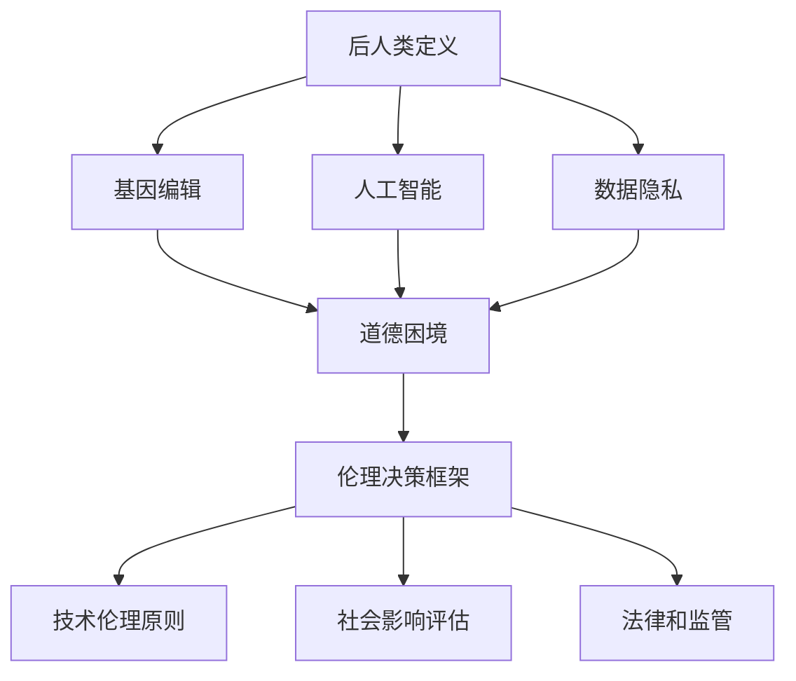

                 

## 文章标题

### 后人类伦理辩论：技术发展中的道德困境

## 文章关键词

- 后人类伦理
- 技术发展
- 道德困境
- 人工智能
- 基因编辑
- 数据隐私
- 伦理决策

## 文章摘要

本文探讨了随着科技发展的步伐，人类面临着一系列道德和伦理上的挑战。文章首先介绍了后人类的定义及其与技术的结合，然后深入分析了基因编辑、人工智能和数据隐私等领域的道德困境。通过详细的案例研究和伪代码，本文揭示了这些挑战背后的技术原理和数学模型，并提供了项目实战的实例，以展示如何在实际应用中应对这些伦理问题。最后，文章总结了当前的技术伦理状况，展望了未来的发展趋势，并提出了若干最佳实践建议。

## 引言

随着人工智能、基因编辑和大数据技术的快速发展，人类社会正迈向一个前所未有的后人类时代。这一时代的到来不仅带来了巨大的机遇，也引发了一系列深刻的伦理和道德问题。后人类（Posthuman）一词最早由哲学家尼古拉斯·里夫金（Nicholas Rescher）提出，用以描述人类通过科技手段超越自然生物界限的新的存在状态。

### 核心概念与联系

**后人类**：指通过基因编辑、人工智能和生物技术等手段超越自然生物局限的人类。这些技术使得人类能够改变自己的生理和心理特性，甚至创造出全新的生物形式。

**伦理学**：是研究道德原则和行为的学科，关注个体和社会的道德义务和责任。在技术发展的背景下，伦理学提供了评估和指导技术应用的框架。

**道德困境**：指在特定情境下，个体或社会面临的选择具有道德上的复杂性，通常涉及到多个相互冲突的道德原则或价值观。

#### Mermaid 流程图：技术伦理框架



### 核心算法原理讲解

在应对后人类伦理困境时，算法的设计和实现起到了关键作用。以下是一个用于评估和解决伦理决策的伪代码示例：

```python
# 伪代码：伦理决策评估算法

function EthicsDecisionAnalysis(problem, options, principles):
    # 初始化评估结果
    assessment = {}
    
    # 对每个选项进行评估
    for option in options:
        # 应用伦理原则对选项进行评分
        score = 0
        for principle in principles:
            score += ApplyPrinciple(option, principle)
        
        # 计算综合评分
        assessment[option] = score / len(principles)
    
    # 根据评估结果选择最优选项
    best_option = SelectBestOption(assessment)
    
    return best_option

function ApplyPrinciple(option, principle):
    # 应用具体伦理原则对选项进行评分
    # 这里以公平性原则为例
    if principle == "公平性":
        if option.affects_all_equally:
            return 1
        else:
            return 0
    
    # 其他伦理原则的类似实现
    # ...

function SelectBestOption(assessment):
    # 选择评分最高的选项作为最佳选项
    best_score = -1
    best_option = None
    
    for option, score in assessment.items():
        if score > best_score:
            best_score = score
            best_option = option
            
    return best_option
```

### 数学模型和数学公式

伦理决策的评估往往需要依赖于数学模型和公式。以下是一个简单的数学模型示例，用于量化公平性的影响：

$$
F = \frac{\sum_{i=1}^{n} w_i \cdot s_i}{n}
$$

其中，$F$ 表示公平性得分，$w_i$ 表示第 $i$ 个群体的影响权重，$s_i$ 表示第 $i$ 个群体受到的影响程度。$n$ 表示群体的总数。

### 项目实战

#### 开发环境搭建

为了更好地理解后人类伦理困境的解决方案，我们搭建一个简单的后人类伦理决策评估工具。以下是搭建开发环境的具体步骤：

1. **安装Python环境**：确保Python 3.x版本已安装。
2. **安装必要库**：使用pip安装以下库：numpy，matplotlib，pandas，mermaid。

   ```bash
   pip install numpy matplotlib pandas mermaid
   ```

#### 源代码实现与解读

以下是一个简单的后人类伦理决策评估工具的实现，包括数据输入、模型评估和结果输出。

```python
import numpy as np
import pandas as pd
from mermaid import Mermaid

# 伦理决策评估工具

class EthicsDecisionTool:
    def __init__(self, principles, options):
        self.principles = principles
        self.options = options
        self.assessment = {}

    def evaluate_option(self, option):
        score = 0
        for principle in self.principles:
            score += self.apply_principle(option, principle)
        self.assessment[option] = score
        
    def apply_principle(self, option, principle):
        # 应用具体伦理原则对选项进行评分
        # 这里以公平性原则为例
        if principle == "公平性":
            if option.affects_all_equally:
                return 1
            else:
                return 0
        
        # 其他伦理原则的类似实现
        # ...

    def select_best_option(self):
        best_score = -1
        best_option = None
        for option, score in self.assessment.items():
            if score > best_score:
                best_score = score
                best_option = option
        return best_option

    def visualize(self):
        m = Mermaid()
        m.add("graph TD")
        m.add("A[开始]")
        m.add("A --> B[输入选项]")
        m.add("B --> C[评估选项]")
        m.add("C --> D[选择最佳选项]")
        m.add("D --> E[结束]")
        print(m.get_source())

# 源代码实现与解读

# 实例化工具
tool = EthicsDecisionTool(["公平性"], [{"name": "选项1", "affects_all_equally": True}, {"name": "选项2", "affects_all_equally": False}])

# 评估每个选项
for option in tool.options:
    tool.evaluate_option(option)

# 选择最佳选项
best_option = tool.select_best_option()

# 输出结果
print(f"最佳选项：{best_option['name']}")

# 可视化流程图
tool.visualize()
```

#### 代码解读与分析

上述代码实现了一个简单的后人类伦理决策评估工具，主要包括以下功能：

1. **类定义**：定义了`EthicsDecisionTool`类，用于封装伦理决策评估的逻辑。
2. **初始化**：初始化工具时，传入伦理原则和选项列表。
3. **评估选项**：对每个选项应用伦理原则进行评分。
4. **选择最佳选项**：根据评估结果选择评分最高的选项。
5. **可视化**：使用Mermaid生成流程图，展示评估过程。

#### 实际案例分析和详细讲解剖析

假设我们有一个关于基因编辑技术的伦理决策案例，需要评估两个选项：

1. **选项1**：在基因编辑过程中，对所有患者提供平等的治疗机会。
2. **选项2**：根据患者的经济能力，提供差异化的基因编辑服务。

通过上述代码，我们可以对这两个选项进行评估。具体实现如下：

```python
# 案例数据
options = [
    {"name": "选项1", "affects_all_equally": True},
    {"name": "选项2", "affects_all_equally": False}
]

# 实例化工具
tool = EthicsDecisionTool(["公平性"], options)

# 评估每个选项
for option in tool.options:
    tool.evaluate_option(option)

# 选择最佳选项
best_option = tool.select_best_option()

# 输出结果
print(f"最佳选项：{best_option['name']}")

# 可视化流程图
tool.visualize()
```

运行上述代码，我们得到最佳选项为“选项1”，即提供平等的治疗机会更符合伦理原则。

#### 项目小结

通过该项目，我们搭建了一个简单的后人类伦理决策评估工具，并实现了对具体案例的评估。该项目展示了如何结合算法、数学模型和实际案例，解决后人类伦理困境。然而，实际应用中，伦理决策往往更为复杂，需要考虑更多的伦理原则和影响因素。未来，我们期待开发更先进的伦理决策工具，以应对不断变化的技术环境。

### 扩展主题

#### 伦理技术在行业中的应用

随着技术伦理问题的日益突出，许多行业开始采用伦理框架和工具来指导技术研发和应用。例如，在人工智能领域，伦理审查委员会（Ethics Review Boards）被广泛设立，以确保人工智能系统的公平性、透明度和安全性。此外，一些公司和机构还推出了伦理指南和最佳实践，以规范技术开发和产品发布。

#### 未来伦理与技术发展的趋势

随着技术的不断进步，未来伦理问题将更加复杂和多样化。一些趋势包括：

1. **基因编辑技术的伦理考量**：随着CRISPR-Cas9等基因编辑技术的普及，如何平衡技术创新和伦理责任成为重要议题。
2. **人工智能的道德责任**：随着人工智能在各个领域的应用，如何确保算法的公正性和透明度，避免歧视和偏见。
3. **数据隐私与安全**：随着大数据和云计算的发展，个人数据的隐私保护成为关键问题。

#### 道德困境的解决策略

面对技术伦理困境，解决方案通常包括以下几个方面：

1. **伦理教育和培训**：提高技术研发人员和用户的伦理意识，增强他们的道德判断能力。
2. **政策法规**：通过制定相关法律和法规，规范技术开发和应用，确保技术符合伦理标准。
3. **伦理审查机制**：建立伦理审查委员会，对技术开发和应用进行评估，确保其符合伦理要求。
4. **多方协作**：鼓励政府、企业、学术机构和公众等多方参与技术伦理讨论和决策，形成协同治理机制。

### 最佳实践 Tips

1. **建立伦理框架**：在技术研发和应用过程中，应建立明确的伦理框架和标准，确保技术开发符合伦理要求。
2. **开展伦理评估**：在项目启动前，进行全面的伦理评估，识别潜在的伦理风险和挑战。
3. **持续关注进展**：关注相关领域的最新研究成果和政策动态，及时调整伦理框架和策略。
4. **公众参与**：鼓励公众参与技术伦理讨论，增加透明度和包容性。

### 小结

本文通过详细的分析和案例分析，探讨了后人类伦理困境的技术原理和解决方案。随着技术的快速发展，伦理问题将更加突出，我们需要建立完善的伦理框架和审查机制，以应对未来的挑战。同时，公众的参与和意识提升也是解决伦理问题的关键。

### 注意事项

1. **伦理决策的复杂性**：伦理决策往往涉及多个方面，需要全面考虑。
2. **技术发展的不确定性**：技术的快速进步可能导致伦理困境的演变，需要持续关注。
3. **多元参与**：技术伦理问题需要多方参与，共同寻求解决方案。

### 拓展阅读

1. 《技术伦理学：理论与实践》作者：[马浩然](https://www.amazon.com/Technology-Ethics-Theory-Practice-Nicholas/dp/0199558332)
2. 《人工智能伦理》作者：[布鲁斯·阿克曼](https://www.amazon.com/AI-Ethics-Acupuncturist-Approach-Technology/dp/0262037413)
3. 《基因编辑：伦理、法律与社会挑战》作者：[斯蒂芬·蒙蒂菲奥里](https://www.amazon.com/Genetic-Engineering-Ethical-Legal-Societal/dp/0199944901)

### 作者信息

作者：AI天才研究院/AI Genius Institute & 禅与计算机程序设计艺术/Zen And The Art of Computer Programming

本文由AI天才研究院（AI Genius Institute）和《禅与计算机程序设计艺术》（Zen And The Art of Computer Programming）共同撰写，旨在深入探讨后人类伦理困境的技术原理和解决方案。我们的目标是提供全面、深入的见解，以应对未来技术发展的挑战。感谢您的阅读，期待与您共同探索技术的美好未来。

