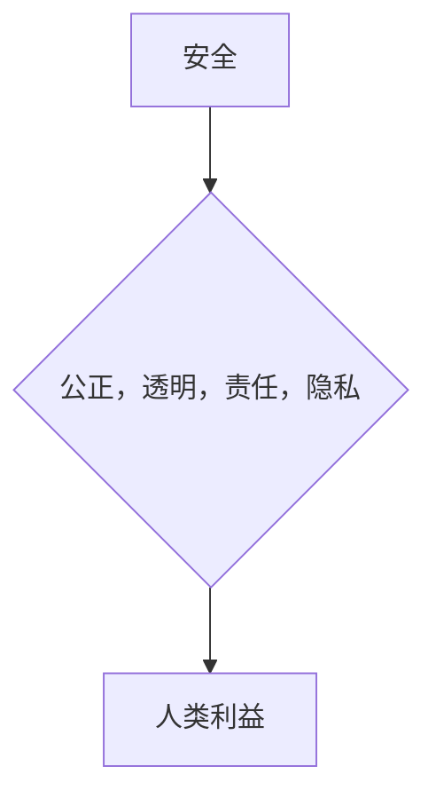

                 


### 第4章 人工智能的伦理考量

## 4.1 人工智能道德原则

### 4.1.1 人工智能道德原则的定义

人工智能道德原则是一套用于指导人工智能系统设计和应用的伦理准则。这些原则旨在确保人工智能在带来技术进步的同时，不会对人类造成不可接受的伤害。核心道德原则通常包括：安全、公正、透明、责任和隐私。

### 4.1.2 核心概念与联系

为了理解人工智能道德原则，我们需要了解以下几个核心概念：

- **安全**：确保人工智能系统的行为不会对人类造成伤害。
- **公正**：确保人工智能系统不带有偏见，公平对待所有人。
- **透明**：确保人工智能系统的决策过程可以被理解和审查。
- **责任**：明确人工智能系统的责任归属，以便在发生问题时进行追责。
- **隐私**：保护用户的个人信息不被滥用。

我们可以使用Mermaid流程图来展示这些概念之间的关系：



### 4.1.3 核心算法原理讲解

为了确保人工智能道德原则的实施，我们需要使用一系列算法和技术来实现这些原则。以下是几个关键算法和技术的简述：

- **公平性检测算法**：用于检测和纠正人工智能系统中可能存在的偏见。
- **透明性增强技术**：如可解释性AI，用于提高人工智能决策过程的可理解性。
- **责任分配模型**：用于明确人工智能系统中的责任归属。

以下是使用伪代码来展示一个公平性检测算法的基本框架：

```python
def detect_fairness(data, model):
    # 数据预处理
    preprocessed_data = preprocess_data(data)

    # 训练基准模型
    base_model = train_model(preprocessed_data)

    # 预测基准模型
    base_predictions = base_model.predict(preprocessed_data)

    # 训练有偏模型
    biased_model = train_model(preprocessed_data, with_bias=True)

    # 预测有偏模型
    biased_predictions = biased_model.predict(preprocessed_data)

    # 计算公平性指标
    fairness_index = calculate_fairness(base_predictions, biased_predictions)

    return fairness_index
```

### 4.1.4 数学模型和公式

为了量化人工智能系统的公正性，我们可以使用一些数学模型和公式。例如，使用公平性差异（fairness difference）来评估模型的公正性：

$$
FD = \frac{\sum_{i}^{N} w_i (p_i - q_i)}{\sum_{i}^{N} w_i}
$$

其中，$p_i$ 和 $q_i$ 分别代表保护属性为 $1$ 和 $0$ 的个体在基准模型和有偏模型下的预测概率，$w_i$ 代表权重。

### 4.1.5 详细讲解与举例说明

为了更好地理解这些算法和模型，我们可以通过以下实例来说明：

- **实例**：一个分类问题，其中我们需要检测人工智能模型对种族的偏见。
- **实现**：使用上述的公平性检测算法，我们可以检测模型对黑人白人的预测概率，并计算公平性差异。
- **分析**：通过分析公平性差异，我们可以确定模型是否存在偏见，并采取相应的纠正措施。

## 4.2 人工智能决策的不公平性

### 4.2.1 不公平性的来源

人工智能决策的不公平性主要来源于数据集、算法设计和偏见。以下是一些常见的来源：

- **数据偏差**：训练数据可能带有种族、性别、年龄等偏见。
- **算法设计**：某些算法可能对特定群体有偏见。
- **标注问题**：标注过程中可能引入偏见。

### 4.2.2 不公平性的影响

不公平性可能导致以下负面影响：

- **歧视**：对特定群体的歧视，如种族、性别歧视。
- **社会不公**：加剧社会不平等，影响社会稳定。
- **法律风险**：可能导致法律诉讼和责任追究。

### 4.2.3 应对措施

为了解决不公平性，我们可以采取以下措施：

- **公平性检测**：使用公平性检测算法检测模型的不公平性。
- **数据清洗**：清理带有偏见的数据，使用更公平的数据集。
- **算法优化**：改进算法设计，减少偏见。
- **透明性提高**：增加模型的透明性，使决策过程更容易被理解和审查。

## 4.3 人工智能的伦理责任

### 4.3.1 责任的定义

人工智能的伦理责任是指人工智能系统在设计、开发和部署过程中，应对人类和社会承担的道德义务。这些责任包括：

- **安全性**：确保人工智能系统不会对人类造成伤害。
- **公正性**：确保人工智能系统的决策是公平和无偏见的。
- **透明性**：确保人工智能系统的决策过程可以被理解和审查。
- **责任归属**：明确人工智能系统的责任归属，以便在发生问题时进行追责。

### 4.3.2 责任归属的挑战

人工智能的伦理责任归属面临以下挑战：

- **技术复杂度**：人工智能系统的复杂度使得责任归属变得困难。
- **多主体参与**：人工智能系统通常涉及多个参与者，如开发者、用户和平台运营商，责任归属难以明确。
- **不可预见性**：人工智能系统可能产生不可预见的行为，责任归属难以确定。

### 4.3.3 责任归属的解决方案

为了解决责任归属的挑战，我们可以采取以下解决方案：

- **法律框架**：制定明确的法律规定，界定人工智能系统的责任。
- **伦理审查**：在人工智能系统开发和应用前进行伦理审查，确保符合伦理标准。
- **透明性**：提高人工智能系统的透明度，使责任归属更清晰。
- **责任保险**：为人工智能系统提供责任保险，以便在发生问题时提供经济赔偿。

### 4.3.4 案例分析

为了更好地理解人工智能的伦理责任，我们可以通过以下案例进行分析：

- **案例**：自动驾驶汽车在事故中的责任归属。
- **分析**：自动驾驶汽车在事故中，可能涉及制造商、车主和乘客等多方责任。通过法律框架和伦理审查，可以明确各方的责任。

## 4.4 人工智能的伦理决策

### 4.4.1 伦理决策的定义

人工智能的伦理决策是指人工智能系统在执行任务时，如何处理伦理问题，做出符合伦理标准的决策。这些决策通常涉及复杂的人类价值观和道德判断。

### 4.4.2 伦理决策的挑战

伦理决策面临以下挑战：

- **道德复杂性**：伦理问题通常涉及多种价值观和利益冲突。
- **不确定性**：伦理决策往往涉及不确定性和不可预见性。
- **技术限制**：当前的人工智能技术难以完全理解和模拟人类伦理决策过程。

### 4.4.3 伦理决策的解决方案

为了解决伦理决策的挑战，我们可以采取以下解决方案：

- **伦理编程**：在人工智能系统中嵌入伦理规则和决策模型。
- **伦理专家参与**：邀请伦理专家参与人工智能系统的设计和开发，确保符合伦理标准。
- **透明性和可解释性**：提高人工智能系统的透明度，使伦理决策过程可以被理解和审查。
- **社会共识**：通过社会讨论和共识，形成一套普遍接受的伦理决策框架。

### 4.4.4 案例分析

为了更好地理解人工智能的伦理决策，我们可以通过以下案例进行分析：

- **案例**：在医疗诊断中，如何处理伦理问题，如器官捐赠和安乐死。
- **分析**：医疗诊断中的伦理决策需要平衡患者利益、社会伦理和医疗资源分配。

## 4.5 人工智能伦理的未来发展

### 4.5.1 伦理法规的完善

随着人工智能技术的发展，各国和地区正在制定和完善相关伦理法规，以规范人工智能的应用。

### 4.5.2 伦理标准的制定

国际组织和企业正在制定一系列伦理标准，以指导人工智能系统的设计、开发和部署。

### 4.5.3 伦理教育的普及

伦理教育正在成为人工智能教育和培训的重要组成部分，以培养具备伦理素养的人工智能专业人士。

### 4.5.4 社会监督和参与

公众对人工智能伦理的关注和参与正在增强，社会监督机制逐渐建立，以确保人工智能系统符合伦理标准。

作者：AI天才研究院/AI Genius Institute & 禅与计算机程序设计艺术 /Zen And The Art of Computer Programming

