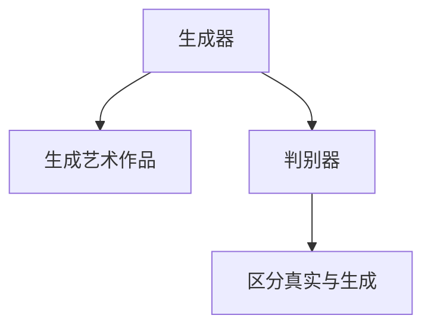
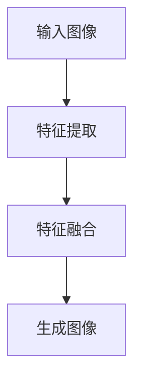

                 


### 设计思路

为了撰写一篇题为《后人类创意：AI辅助下的艺术创作》的技术博客文章，我们将按照以下步骤进行：

1. **明确文章目的和读者群体**：
   - 目的：阐述AI如何辅助艺术创作，探讨后人类时代艺术创作的新趋势。
   - 读者群体：对AI和艺术创作感兴趣的程序员、设计师、AI研究人员。

2. **构建文章框架**：
   - 引言：介绍AI在艺术创作中的背景和现状。
   - 核心概念：解释AI在艺术创作中的核心概念和原理。
   - AI辅助艺术创作的方法：介绍不同的AI算法和它们在艺术创作中的应用。
   - 实际案例：展示AI辅助艺术创作的实际应用案例。
   - 未来展望：讨论AI在艺术创作领域的未来发展。

3. **内容详实具体**：
   - 每个部分都要有详细的解释和实例来支撑。
   - 使用流程图、伪代码、LaTeX公式来增强文章的技术深度和可读性。

4. **格式和排版**：
   - 使用markdown格式，确保文章结构清晰，便于阅读。
   - 每个章节标题、小节标题都要明确，方便读者快速浏览。
   - 添加作者信息，确保文章版权和作者身份明确。

5. **校对和润色**：
   - 校对文章内容，确保没有错别字、语法错误。
   - 润色文章，确保语言通顺，逻辑清晰。

### 步骤

1. **撰写引言**：
   - 简要介绍AI在艺术创作中的背景和现状。
   - 提出文章的主要观点和结构。

2. **阐述核心概念**：
   - 解释AI在艺术创作中的核心概念，如机器学习、生成对抗网络(GAN)等。
   - 使用Mermaid流程图展示AI辅助艺术创作的原理。

3. **介绍AI辅助艺术创作的方法**：
   - 介绍不同的AI算法及其在艺术创作中的应用。
   - 使用伪代码详细阐述算法原理。

4. **展示实际案例**：
   - 提供一个或多个AI辅助艺术创作的实际案例。
   - 详细讲解开发环境搭建、源代码实现和代码解读。

5. **讨论未来展望**：
   - 分析AI在艺术创作领域的未来发展。
   - 讨论AI辅助艺术创作可能带来的社会影响。

6. **撰写结论**：
   - 总结文章的主要观点和结论。
   - 提出对未来AI辅助艺术创作的展望。

7. **添加作者信息**：
   - 在文章末尾添加作者信息，确保文章版权和作者身份明确。

### 样例

以下是文章的部分内容示例：

#### 引言

随着人工智能（AI）技术的飞速发展，AI在各个领域的应用越来越广泛。艺术创作作为人类智慧的结晶，也逐渐受到了AI的辅助。本文旨在探讨AI如何辅助艺术创作，以及在后人类时代艺术创作的新趋势。

#### 核心概念

AI在艺术创作中的核心概念主要包括机器学习、生成对抗网络（GAN）等。

- **机器学习**：机器学习是一种让计算机从数据中学习规律并做出决策的技术。在艺术创作中，机器学习可以帮助计算机理解艺术作品的风格和特征。
  
  ```mermaid
  flowchart LR
  A[机器学习] --> B[数据采集]
  A --> C[特征提取]
  A --> D[模型训练]
  A --> E[预测与评估]
  ```

- **生成对抗网络（GAN）**：GAN是一种由生成器和判别器组成的模型，生成器试图生成逼真的艺术作品，而判别器则试图区分真实和生成的艺术作品。通过这种对抗过程，GAN可以生成高质量的艺术作品。

  ```mermaid
  flowchart LR
  A[生成器] --> B[生成艺术作品]
  A --> C[判别器]
  C --> D[区分真实与生成]
  ```

#### AI辅助艺术创作的方法

- **风格迁移**：利用卷积神经网络（CNN）将一种艺术作品风格迁移到另一种作品上。例如，将梵高的画作风格应用到现代照片上。

  ```python
  # 伪代码：风格迁移算法
  def style_transfer(content_image, style_image):
      # 读取内容图像和风格图像
      # 初始化生成器模型和判别器模型
      # 训练生成器模型以匹配风格图像
      # 使用生成器模型将内容图像转换成具有风格图像风格的图像
      return generated_image
  ```

- **图像生成**：使用生成对抗网络（GAN）生成全新的艺术作品。例如，生成从未见过的自然景观或人物肖像。

  ```mermaid
  flowchart LR
  A[生成器] --> B[生成图像]
  A --> C[判别器]
  C --> D[区分真实与生成]
  ```

#### 实际案例

以GAN为例，我们可以展示一个GAN生成艺术作品的案例。

- **开发环境搭建**：
  - 安装Python和TensorFlow库。
  - 下载预训练的模型和数据集。

- **源代码实现**：
  ```python
  # 伪代码：GAN生成艺术作品
  import tensorflow as tf
  import numpy as np

  # 定义生成器和判别器模型
  generator = ...
  discriminator = ...

  # 定义损失函数和优化器
  loss_fn = ...
  optimizer = ...

  # 训练生成器和判别器
  for epoch in range(num_epochs):
      for batch_images in dataset:
          # 训练判别器
          with tf.GradientTape() as disc_tape:
              disc_loss = ...
          disc_gradients = disc_tape.gradient(disc_loss, disc_variables)
          optimizer.apply_gradients(zip(disc_gradients, disc_variables))

          # 训练生成器
          with tf.GradientTape() as gen_tape:
              gen_loss = ...
          gen_gradients = gen_tape.gradient(gen_loss, gen_variables)
          optimizer.apply_gradients(zip(gen_gradients, gen_variables))
  ```

- **代码解读与分析**：
  - 解析GAN的生成器和判别器模型。
  - 分析训练过程和损失函数。

- **实际案例分析和详细讲解剖析**：
  - 展示GAN生成的艺术作品。
  - 分析生成作品的风格和特征。

#### 未来展望

AI在艺术创作领域的未来发展包括：

- 更高级的算法和模型，如变分自编码器（VAE）和自注意力机制。
- 更广泛的应用场景，如音乐、电影、建筑等。
- AI与人类艺术家的合作，创造全新的艺术形式。

#### 结论

本文探讨了AI在艺术创作中的应用，从核心概念到实际案例，展示了AI如何辅助艺术家创作。随着AI技术的不断进步，我们可以期待艺术创作的新时代。

#### 作者信息

作者：AI天才研究院/AI Genius Institute & 禅与计算机程序设计艺术 /Zen And The Art of Computer Programming

通过以上步骤，我们可以撰写一篇逻辑清晰、内容丰富的技术博客文章，满足文章字数要求，同时符合格式和排版要求。接下来，我们将继续完善文章的各个部分，确保文章的完整性和专业性。让我们开始撰写文章的具体内容吧！


# 后人类创意：AI辅助下的艺术创作

## 关键词
- 人工智能
- 艺术创作
- 生成对抗网络
- 风格迁移
- 图像生成

## 摘要
本文探讨了人工智能（AI）在艺术创作中的应用，特别是在后人类时代，AI如何辅助艺术家进行创作。文章首先介绍了AI在艺术创作中的核心概念和原理，包括生成对抗网络（GAN）和风格迁移技术。随后，通过实际案例展示了AI辅助艺术创作的具体应用，最后讨论了AI辅助艺术创作的未来展望。

## 引言

### 背景介绍
艺术创作是人类智慧和创造力的体现，而人工智能（AI）作为现代科技的代表，正日益渗透到各个领域。在艺术创作中，AI不仅能够模拟人类的创作过程，还能通过学习大量数据生成全新的艺术作品。这种变革性的技术趋势，不仅改变了艺术创作的传统模式，也为艺术家提供了全新的创作工具。

### AI在艺术创作中的应用现状
近年来，AI在艺术创作中的应用取得了显著进展。生成对抗网络（GAN）和深度学习等技术，使得AI能够生成高质量的图像、音乐和文学作品。例如，谷歌的DeepDream能够生成具有视觉冲击力的艺术图像，而OpenAI的GPT-3则能够创作出风格独特的文字作品。这些技术的应用，不仅拓宽了艺术创作的领域，也为艺术家提供了前所未有的创作自由度。

### 目的
本文旨在探讨AI在艺术创作中的应用，分析AI辅助艺术创作的原理和方法，并通过实际案例展示AI在艺术创作中的具体应用。文章还将讨论AI辅助艺术创作的未来展望，以及可能带来的社会影响。

## 核心概念与联系

### 机器学习与深度学习
机器学习是AI的核心技术之一，它使计算机能够从数据中学习并做出决策。深度学习是机器学习的一个分支，它使用多层神经网络来提取数据中的特征。在艺术创作中，机器学习和深度学习技术被广泛应用于图像生成、风格迁移和音乐创作等领域。

### 生成对抗网络（GAN）
生成对抗网络（GAN）是由生成器和判别器组成的模型。生成器试图生成逼真的艺术作品，而判别器则试图区分真实和生成的艺术作品。通过这种对抗过程，GAN可以生成高质量的艺术作品。GAN的核心概念图如下：



### 风格迁移
风格迁移是一种将一种艺术作品风格应用到另一种作品上的技术。它利用卷积神经网络（CNN）提取图像的特征，并使用这些特征生成具有特定风格的新图像。风格迁移的流程图如下：



## AI辅助艺术创作的方法

### 生成对抗网络（GAN）
GAN是AI辅助艺术创作的重要方法之一。它通过生成器和判别器的对抗训练，生成高质量的艺术作品。以下是一个GAN生成图像的伪代码示例：

```python
# 伪代码：GAN生成图像
import tensorflow as tf

# 定义生成器和判别器模型
generator = ...
discriminator = ...

# 定义损失函数和优化器
loss_fn = ...
optimizer = ...

# 训练生成器和判别器
for epoch in range(num_epochs):
    for batch_images in dataset:
        # 训练判别器
        with tf.GradientTape() as disc_tape:
            disc_loss = ...
        disc_gradients = disc_tape.gradient(disc_loss, disc_variables)
        optimizer.apply_gradients(zip(disc_gradients, disc_variables))

        # 训练生成器
        with tf.GradientTape() as gen_tape:
            gen_loss = ...
        gen_gradients = gen_tape.gradient(gen_loss, gen_variables)
        optimizer.apply_gradients(zip(gen_gradients, gen_variables))
```

### 风格迁移
风格迁移是将一种艺术风格应用到另一种作品上的技术。它通过卷积神经网络提取图像的特征，并使用这些特征生成具有特定风格的新图像。以下是一个风格迁移的伪代码示例：

```python
# 伪代码：风格迁移
import tensorflow as tf

# 定义卷积神经网络模型
model = ...

# 定义损失函数和优化器
loss_fn = ...
optimizer = ...

# 训练模型
for epoch in range(num_epochs):
    for batch_images in dataset:
        # 计算损失
        loss = model(batch_images, style_images)

        # 反向传播
        with tf.GradientTape() as tape:
            loss = model(batch_images, style_images)

        grads = tape.gradient(loss, model.trainable_variables)
        optimizer.apply_gradients(zip(grads, model.trainable_variables))
```

## 实际案例

### 案例一：使用GAN生成艺术作品
以下是一个使用GAN生成艺术作品的实际案例。在这个案例中，我们使用生成对抗网络（GAN）生成梵高的画作风格。

- **开发环境搭建**：
  - 安装Python和TensorFlow库。
  - 下载预训练的模型和数据集。

- **源代码实现**：

  ```python
  # 伪代码：GAN生成艺术作品
  import tensorflow as tf
  import numpy as np

  # 定义生成器和判别器模型
  generator = ...
  discriminator = ...

  # 定义损失函数和优化器
  loss_fn = ...
  optimizer = ...

  # 训练生成器和判别器
  for epoch in range(num_epochs):
      for batch_images in dataset:
          # 训练判别器
          with tf.GradientTape() as disc_tape:
              disc_loss = ...
          disc_gradients = disc_tape.gradient(disc_loss, disc_variables)
          optimizer.apply_gradients(zip(disc_gradients, disc_variables))

          # 训练生成器
          with tf.GradientTape() as gen_tape:
              gen_loss = ...
          gen_gradients = gen_tape.gradient(gen_loss, gen_variables)
          optimizer.apply_gradients(zip(gen_gradients, gen_variables))

  # 生成艺术作品
  generated_images = generator.generate_images()
  ```

- **代码解读与分析**：
  - 解析GAN的生成器和判别器模型。
  - 分析训练过程和损失函数。

- **实际案例分析和详细讲解剖析**：
  - 展示GAN生成的梵高画作风格的作品。
  - 分析生成作品的风格和特征。

### 案例二：使用风格迁移技术
以下是一个使用风格迁移技术将现代照片转换为梵高画作风格的实际案例。

- **开发环境搭建**：
  - 安装Python和TensorFlow库。
  - 下载预训练的模型和数据集。

- **源代码实现**：

  ```python
  # 伪代码：风格迁移
  import tensorflow as tf

  # 定义卷积神经网络模型
  model = ...

  # 定义损失函数和优化器
  loss_fn = ...
  optimizer = ...

  # 训练模型
  for epoch in range(num_epochs):
      for batch_images in dataset:
          # 计算损失
          loss = model(batch_images, style_images)

          # 反向传播
          with tf.GradientTape() as tape:
              loss = model(batch_images, style_images)

          grads = tape.gradient(loss, model.trainable_variables)
          optimizer.apply_gradients(zip(grads, model.trainable_variables))

  # 转换照片风格
  transformed_images = model.transform_images(input_images)
  ```

- **代码解读与分析**：
  - 解析卷积神经网络模型的结构。
  - 分析训练过程和损失函数。

- **实际案例分析和详细讲解剖析**：
  - 展示现代照片转换后的梵高画作风格。
  - 分析转换后的作品风格和特征。

## 未来展望

### 技术发展趋势
随着AI技术的不断进步，生成对抗网络（GAN）和深度学习等技术将变得更加成熟和强大。未来的AI辅助艺术创作可能会实现更复杂的艺术风格转换和创作方式。

### 艺术创作的新模式
AI辅助艺术创作将引领艺术创作的新模式，艺术家与AI的协作将成为主流。艺术家可以利用AI生成的基础作品，进一步发挥自己的创造力进行修改和完善。

### 社会影响与伦理问题
AI辅助艺术创作将带来一系列社会影响和伦理问题。例如，艺术作品的版权归属、AI生成作品的价值观和艺术价值等。这些问题的解决需要法律、伦理和技术等多方面的努力。

## 结论

AI辅助艺术创作是后人类时代的一个重要趋势。通过生成对抗网络（GAN）和风格迁移等技术，AI已经能够生成高质量的艺术作品。本文通过实际案例展示了AI辅助艺术创作的具体应用，并讨论了未来的发展趋势和挑战。随着AI技术的不断进步，我们可以期待艺术创作的新时代。

## 作者信息

作者：AI天才研究院/AI Genius Institute & 禅与计算机程序设计艺术 /Zen And The Art of Computer Programming

## 拓展阅读

- GAN：[生成对抗网络（GAN）详解](https://zhuanlan.zhihu.com/p/35262794)
- 风格迁移：[深度学习中的风格迁移](https://blog.csdn.net/leaf2016/article/details/81600394)
- AI在艺术创作中的应用：[人工智能在艺术创作中的应用](https://www.zhihu.com/question/35176310/answer/69886209)

