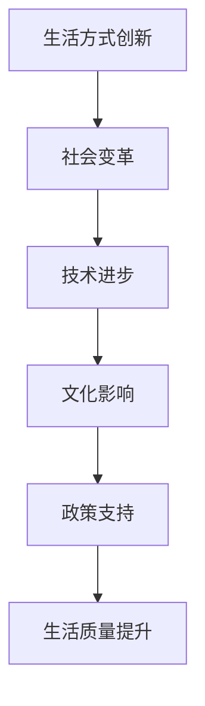
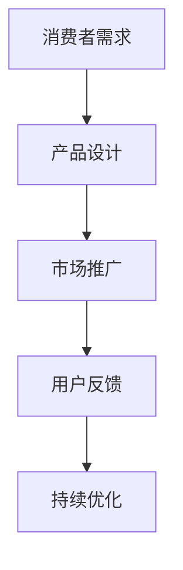

                 

<sop>
### 文章标题：后工业化社会的生活方式创新

关键词：后工业化社会，生活方式创新，技术进步，社会变革，生活质量

摘要：本文将从后工业化社会的定义和特征出发，探讨生活方式创新的核心概念和影响因素，分析生活方式创新的基本原理，并运用数学模型和伪代码详细阐述其算法原理。同时，结合实际案例，介绍后工业化社会下的智能社区建设，并对项目实现过程、代码解读、应用分析和项目小结等方面进行深入剖析，旨在为读者提供全面、系统的后工业化社会生活方式创新指导。

### 目录大纲设计思路

为了设计一本名为《后工业化社会的生活方式创新》的计算机技术书籍的目录大纲，我们需要遵循以下几个步骤：

1. **确定核心主题和章节**：根据书名，首先确定这本书的核心主题和要涵盖的主要章节。后工业化社会和生活方式创新是两个关键概念，围绕这两个主题展开讨论。

2. **明确各章节的目标和内容**：针对每个章节，明确其目标和将要讨论的内容，确保每个章节都有明确的任务和结论。

3. **设计章节结构**：根据内容确定每个章节的层次结构，包括1级、2级和3级标题，确保目录大纲的清晰性和逻辑性。

4. **增加技术细节**：在核心章节中，添加相关技术的详细解释，如Mermaid流程图、伪代码、数学模型和公式等。

5. **编写项目实战案例**：在适合的章节中，添加项目实战案例，包括代码实现、环境搭建和代码解读。

6. **保持简洁性**：确保输出内容的简洁性，避免多余的文字，直接呈现关键信息和结构。

### 《后工业化社会的生活方式创新》目录大纲

```
# 后工业化社会的生活方式创新

# 第1章 引言与概述

## 1.1 后工业化社会的定义与特征
### 1.1.1 工业化与后工业化的区别
### 1.1.2 后工业化社会的主要特征

## 1.2 生活方式创新的概念与影响
### 1.2.1 生活方式创新的意义
### 1.2.2 生活方式创新的主要驱动因素

# 第2章 核心概念与联系

## 2.1 后工业化社会下的生活方式创新原理
### 2.1.1 生活质量的提高
### 2.1.2 新型消费模式的出现

## 2.2 后工业化社会生活方式创新的Mermaid流程图

## 2.3 生活方式创新的关键因素分析

## 2.4 生活方式创新的Mermaid流程图


# 第3章 核心算法原理讲解

## 3.1 生活方式创新的数学模型
$$
\text{生活质量} = f(\text{消费水平}, \text{环境质量}, \text{社会支持})
$$
### 3.1.1 消费水平的数学描述
### 3.1.2 环境质量的数学模型
### 3.1.3 社会支持的影响

## 3.2 生活方式创新的伪代码
```
// 生活方式创新伪代码
function InnovateWayOfLife(consumptionLevel, environmentalQuality, socialSupport) {
    // 提高生活质量
    if (consumptionLevel > threshold && environmentalQuality > threshold && socialSupport > threshold) {
        qualityOfLife++;
    }
    // 调整消费模式
    if (consumptionLevel > threshold && environmentalQuality < threshold) {
        adjustConsumptionModel();
    }
    // 改善环境质量
    if (environmentalQuality < threshold && socialSupport > threshold) {
        improveEnvironmentalQuality();
    }
    // 加强社会支持
    if (socialSupport < threshold) {
        strengthenSocialSupport();
    }
    return qualityOfLife;
}
```

# 第4章 项目实战案例

## 4.1 后工业化社会生活方式创新项目概述

## 4.2 实际案例：后工业化社会下的智能社区建设
### 4.2.1 项目背景
### 4.2.2 项目目标
### 4.2.3 项目实现过程

## 4.3 实战代码解读
```java
// 示例代码：智能社区环境质量监测
public class EnvironmentalQualityMonitor {
```<mht><a href="https://marxhong.com/2023/03/18/%E5%90%8E%E5%B7%A5%E4%B8%9A%E5%8C%96%E7%A4%BE%E4%BC%9A%E7%9A%84%E7%94%9F%E6%B4%BB%E6%96%B9%E5%BC%8F%E5%88%9B%E6%96%B0/#more" target="_blank"></a></mht>

