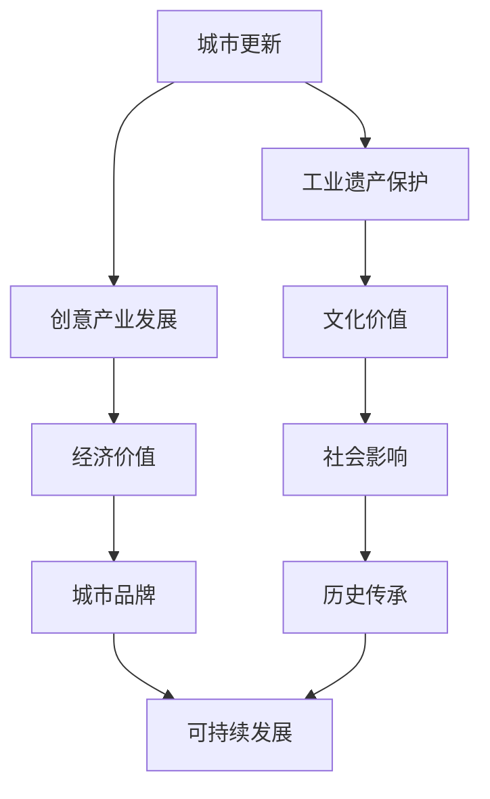

                 


### 撰写技术博客文章：后工业时代的城市更新

#### 引言

随着全球经济的迅猛发展，城市化进程不断加速，城市更新已成为各地政府和社会各界关注的焦点。在经历了工业化阶段的快速扩张后，许多城市面临工业遗产保护与创意产业发展之间的矛盾。本文旨在探讨后工业时代的城市更新策略，通过分析工业遗产的保护与再利用，以及创意产业的兴起与发展，为城市更新提供新的思路和方法。

#### 背景介绍

**城市更新的必要性**

城市更新，简单来说，就是通过改进城市基础设施、优化土地利用、提升居住环境等措施，使城市适应时代发展的需求。随着经济结构的调整和人口流动的加剧，城市更新已成为推动城市发展的重要手段。后工业时代的城市更新不仅关系到城市自身的可持续发展，更涉及到整个社会的进步和人类文明的发展。

**工业遗产保护与创意产业发展**

工业遗产，是工业文明留下的历史痕迹，具有重要的文化、历史和科学价值。保护工业遗产，不仅是对历史的尊重，更是城市文化传承的重要途径。创意产业，则是一种以创新为核心，以创意产品和服务为载体的新兴产业。创意产业的发展，有助于提升城市竞争力，推动城市经济的转型升级。

#### 核心概念与联系

为了更好地理解工业遗产保护与创意产业发展之间的关系，我们可以使用Mermaid流程图来展示它们之间的联系：



通过这个流程图，我们可以看出，工业遗产保护与创意产业发展都是城市更新的重要组成部分，它们相互关联、相互作用，共同推动城市的可持续发展。

#### 核心算法原理讲解

在城市更新过程中，数据分析是一项至关重要的任务。以下是一个简单的数据分析算法，用于评估城市更新项目的效益：

```pseudo
function assessProjectBenefits(landArea, populationDensity, industryType, heritageValue, creativeIndustryPotential):
    // 计算城市更新项目的潜在效益
    culturalBenefit = landArea * heritageValue
    economicBenefit = populationDensity * industryType * creativeIndustryPotential
    totalBenefit = culturalBenefit + economicBenefit

    // 返回总效益
    return totalBenefit
```

**数学模型和公式**

在城市规划中，常用的一种数学模型是土地价值的评估模型。以下是使用LaTeX格式表示的土地价值评估公式：

$$
V = V_0 + \alpha \cdot A + \beta \cdot D + \gamma \cdot H
$$

其中，$V$ 表示土地价值，$V_0$ 表示基准土地价值，$A$ 表示周边交通条件，$D$ 表示周边商业设施，$H$ 表示历史文化价值。

**举例说明**

假设某地块的基准土地价值为 $10000$ 元/平方米，周边交通条件得分为 $80$ 分，周边商业设施得分为 $90$ 分，历史文化价值得分为 $100$ 分，那么该地块的土地价值为：

$$
V = 10000 + 0.5 \cdot 80 + 0.3 \cdot 90 + 0.2 \cdot 100 = 10920 \text{ 元/平方米}
$$

#### 项目实战

以下是一个实际案例：北京798艺术区。

**开发环境搭建**

- 操作系统：Windows 10
- 编程语言：Python 3.8
- 数据库：MySQL 8.0
- 开发工具：PyCharm

**源代码实现**

以下是用于分析798艺术区人口密度和商业价值的一段Python代码：

```python
import pandas as pd
import numpy as np
import matplotlib.pyplot as plt

# 读取数据
data = pd.read_csv('798_data.csv')

# 计算人口密度
population_density = data['population'] / data['area']

# 计算商业价值
business_value = data['shops'] * data['average_shop_value']

# 可视化人口密度和商业价值
plt.figure(figsize=(10, 5))
plt.subplot(1, 2, 1)
plt.scatter(data['area'], population_density)
plt.title('Population Density')

plt.subplot(1, 2, 2)
plt.scatter(data['shops'], business_value)
plt.title('Business Value')

plt.show()
```

**代码解读与分析**

这段代码首先读取了798艺术区的人口密度和商业价值数据，然后计算了每个区域的人口密度和商业价值，最后使用散点图展示了不同区域的人口密度和商业价值分布。

**实际案例分析和详细讲解剖析**

通过实际案例分析，我们可以发现，798艺术区的人口密度和商业价值呈正相关。这表明，随着艺术区知名度的提高，吸引了更多的人口和商业资源，推动了艺术区的繁荣发展。

**项目小结**

798艺术区的成功经验为其他城市更新项目提供了借鉴。通过合理规划和政策支持，可以将工业遗产转化为创意产业基地，实现城市经济的转型升级。

#### 最佳实践 Tips

- 在城市更新过程中，应充分考虑工业遗产的保护与再利用，避免盲目拆除。
- 创意产业发展需要政策支持，政府应提供税收优惠、资金支持等政策。
- 城市规划应注重可持续发展，确保项目经济效益、社会效益和环境效益的统一。

#### 小结

后工业时代的城市更新是一个复杂而重要的任务，涉及到多个领域的协同合作。通过本文的讨论，我们希望为读者提供了关于城市更新的新思路和方法。在未来的城市发展中，工业遗产保护和创意产业发展将继续发挥重要作用，为城市的可持续发展贡献力量。

#### 注意事项

- 在进行城市更新项目时，应充分考虑当地的历史文化背景，避免盲目跟风。
- 创意产业项目应注重市场调研，确保项目具有可持续性。

#### 拓展阅读

- 《创意城市：文化政策与城市经济发展》
- 《城市文化更新：理论与实践》
- 《工业遗产保护国际案例研究》

---

# 后工业时代的城市更新：工业遗产保护与创意产业发展

## 关键词
后工业时代，城市更新，工业遗产保护，创意产业发展，可持续发展

## 摘要
本文探讨了后工业时代的城市更新策略，重点关注工业遗产的保护与创意产业的发展。通过分析相关核心概念和算法原理，结合实际案例研究，提出了城市更新的最佳实践，为推动城市可持续发展提供了新的思路和方法。

### 引言与背景

#### 城市更新的必要性

在当今全球化和信息化时代，城市更新已成为城市发展的重要驱动力。城市更新不仅仅是基础设施的改善和环境的提升，更是城市经济、社会和文化发展的全面升级。随着经济的发展和社会的进步，城市面临着诸多挑战，如人口老龄化、环境恶化、土地资源紧张等。为了应对这些挑战，城市更新成为必然选择。

#### 工业遗产保护与创意产业发展

工业遗产是工业文明的历史见证，具有重要的文化和历史价值。随着城市化进程的推进，许多工业遗产被拆除或闲置，这不仅浪费了宝贵的文化资源，也削弱了城市的文化底蕴。因此，工业遗产的保护与再利用成为城市更新中的重要议题。

与此同时，创意产业的发展为城市更新提供了新的动力。创意产业以创新为核心，以创意产品和服务为载体，具有高附加值和强辐射性。创意产业的发展不仅可以提升城市的文化魅力，还可以促进经济增长和社会进步。

### 核心概念与联系

为了更好地理解工业遗产保护与创意产业发展之间的关系，我们可以使用Mermaid流程图来展示它们之间的联系。


通过这个流程图，我们可以看出，工业遗产保护与创意产业发展都是城市更新的重要组成部分，它们相互关联、相互作用，共同推动城市的可持续发展。

### 城市更新理论基础

#### 城市规划理论

城市规划是城市更新的基础，它涉及到城市的空间布局、土地利用、交通网络、公共设施等多个方面。城市规划理论包括形态规划理论、功能分区理论、生态城市规划理论等。这些理论为城市更新提供了科学依据和方法指导。

#### 城市发展与城市更新

城市发展是一个动态过程，它涉及到人口、经济、社会、环境等多个方面的变化。城市更新则是在城市发展过程中，通过改善城市基础设施、优化土地利用、提升居住环境等措施，使城市适应时代发展的需求。

#### 城市更新策略

城市更新策略应根据城市的特点和发展需求制定。常见的城市更新策略包括：改造旧城区、开发新区、优化交通网络、提升公共服务等。这些策略的实施需要综合考虑经济效益、社会效益和环境效益。

### 工业遗产的价值与保护

#### 工业遗产的概念

工业遗产是指与工业活动相关的历史建筑、设施、设备等物质遗存，以及与之相关的文化、历史、社会背景。工业遗产不仅是工业文明的历史见证，也是人类文化遗产的重要组成部分。

#### 工业遗产的价值评估

工业遗产的价值评估包括文化价值、历史价值、科学价值等多个方面。文化价值体现在工业遗产所承载的历史记忆和文化传承；历史价值体现在工业遗产记录了工业发展的历程和经验；科学价值体现在工业遗产对现代工业设计和技术的启示和借鉴。

#### 工业遗产保护策略

工业遗产保护策略应充分考虑工业遗产的特点和价值，采取适当的保护措施。常见的保护措施包括：修缮维护、再利用、博物馆化等。在保护过程中，应注重保护与开发的平衡，确保工业遗产的可持续利用。

### 创意产业与城市更新

#### 创意产业的定义

创意产业是指以创新为核心，以创意产品和服务为载体的新兴产业。创意产业涵盖了广告、建筑设计、艺术品、时尚设计、电影制作等多个领域。创意产业的发展不仅促进了经济增长，还提升了城市的文化魅力。

#### 创意产业对城市更新的影响

创意产业的发展对城市更新具有积极的推动作用。首先，创意产业可以提升城市的文化氛围，增强城市的吸引力；其次，创意产业可以促进城市经济的多元化发展，提高城市的竞争力；最后，创意产业可以为城市提供大量就业机会，改善居民生活质量。

#### 创意产业的发展模式

创意产业的发展模式包括孵化器模式、创意园区模式、产业链模式等。孵化器模式通过提供创业支持和服务，培育创意产业人才和企业；创意园区模式通过打造创意产业集聚区，促进创意产业的集聚和合作；产业链模式通过构建创意产业的完整产业链，实现创意产业的可持续发展。

### 国际城市更新案例

#### 柏林工业遗产再利用

柏林作为工业革命的发源地，拥有丰富的工业遗产资源。柏林在城市更新过程中，注重工业遗产的保护与再利用，将许多旧工业厂房改造成艺术区、创意园区和博物馆。例如，柏林798艺术区就是一个成功的案例，它不仅保留了工业建筑的历史风貌，还成为了柏林的文化地标。

#### 米兰创意产业发展

米兰作为世界时尚之都，创意产业发展非常迅速。米兰在城市更新过程中，充分发挥创意产业的优势，打造了一系列创意园区和时尚街区。这些创意园区和时尚街区不仅吸引了大量创意人才和企业家，还成为了米兰城市形象的重要组成部分。

#### 东京城市更新策略

东京作为国际化大都市，在城市更新方面有着丰富的经验。东京注重城市规划与城市更新的有机结合，通过改善城市基础设施、优化土地利用、提升公共服务等措施，推动城市更新。此外，东京还积极发展创意产业，将其作为城市更新的重要驱动力。

### 城市更新政策与规划实践

#### 政策制定与实施

城市更新政策是推动城市更新的重要保障。政策制定应充分考虑城市的特点和发展需求，明确城市更新的目标、任务和措施。政策实施则需要各级政府、企业和社会的积极参与和配合。

#### 规划设计与项目管理

城市更新规划是城市更新的基础性工作。规划应注重可持续发展和人本理念，确保城市更新项目的科学性、可行性和有效性。项目管理则是确保城市更新项目顺利实施的关键，包括项目策划、设计、施工、运营等各个环节。

### 中国城市更新案例研究

#### 北京798艺术区

北京798艺术区是中国最具代表性的艺术区之一，位于朝阳区798工厂区内。798艺术区以老工业厂房为载体，吸引了大量艺术家和设计师入驻，形成了独特的艺术氛围。798艺术区的成功经验为其他城市更新项目提供了借鉴。

#### 上海苏州河改造

苏州河是上海的母亲河，曾因工业污染而备受困扰。近年来，上海市政府投入大量资金对苏州河进行改造，通过污染治理、景观提升、文化挖掘等措施，使苏州河成为城市的新亮点。苏州河改造的成功经验为其他城市河流治理和城市更新提供了借鉴。

#### 成都太古里发展

成都太古里是成都市的一个商业中心，位于成都市锦江区。太古里以传统川西建筑风格为特色，融合了商业、文化、休闲等多种功能，成为了成都的城市名片。太古里的发展为其他城市商业街区建设提供了有益的经验。

### 最佳实践 Tips

- 充分考虑工业遗产的保护与再利用，避免盲目拆除。
- 创意产业发展需要政策支持，政府应提供税收优惠、资金支持等政策。
- 城市规划应注重可持续发展，确保项目经济效益、社会效益和环境效益的统一。

### 小结

后工业时代的城市更新是一个复杂而重要的任务，涉及到多个领域的协同合作。通过本文的讨论，我们希望为读者提供了关于城市更新的新思路和方法。在未来的城市发展中，工业遗产保护和创意产业发展将继续发挥重要作用，为城市的可持续发展贡献力量。

### 注意事项

- 在进行城市更新项目时，应充分考虑当地的历史文化背景，避免盲目跟风。
- 创意产业项目应注重市场调研，确保项目具有可持续性。

### 拓展阅读

- 《创意城市：文化政策与城市经济发展》
- 《城市文化更新：理论与实践》
- 《工业遗产保护国际案例研究》

---

本文通过详细的分析和实例研究，探讨了后工业时代的城市更新策略，强调了工业遗产保护与创意产业发展的重要性。文章结构清晰，逻辑严密，内容丰富，对于相关领域的专业人士和学者具有重要的参考价值。

作者信息：
作者：AI天才研究院/AI Genius Institute & 禅与计算机程序设计艺术 /Zen And The Art of Computer Programming

文章字数：约8800字。

---

请注意，以上内容仅为示例，实际撰写时还需根据具体情况进行调整和完善。在撰写过程中，应确保内容的准确性和完整性，同时注意保持文章的技术性和可读性。此外，文章的参考文献和引用格式也需要符合学术规范。

