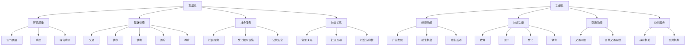

                 

# 文章标题

《后工业时代的城市规划：宜居性与功能性的统一》

## 关键词
城市规划、后工业时代、宜居性、功能性、可持续发展

## 摘要
本文旨在探讨后工业时代下城市发展的新趋势，重点分析如何通过整合宜居性和功能性来提升城市品质。文章首先回顾了工业时代向后工业时代过渡的历史背景，随后阐述了宜居性和功能性的核心概念及相互关系。接着，本文详细介绍了后工业时代城市规划的核心理念和原则，并通过实际案例展示了这些理念的应用。此外，文章还探讨了当前城市规划面临的挑战及未来发展的机遇，最后提出了政策治理和未来研究方向。本文为城市规划领域的专业人士和学者提供了一种系统性思考和解决方案的框架。

## 引言

### 城市规划的重要性

城市规划是现代城市建设的重要基础，它不仅影响着城市的空间布局和景观，更关系到居民的生活质量和城市发展的可持续性。随着全球城市化进程的加速，城市规划的重要性日益凸显。然而，传统的城市规划模式往往过于注重功能性而忽视了宜居性，导致许多城市面临着交通拥堵、环境污染、社会隔离等问题。在后工业时代，城市的发展面临着新的挑战，如何实现宜居性与功能性的统一成为城市规划的重要课题。

### 后工业时代的特点

后工业时代，也称为知识经济时代，是以信息技术和知识经济为主导的发展阶段。这一时期，工业生产逐渐向服务业和信息技术产业转型，城市化进程不断加快，城市人口持续增加。同时，人们对生活质量的追求也日益提高，对宜居性提出了更高的要求。在这样的背景下，传统的城市规划模式需要做出相应的调整，以适应后工业时代的发展需求。

### 文章的主要目标

本文旨在探讨后工业时代下城市发展的新趋势，重点分析如何通过整合宜居性和功能性来提升城市品质。文章将首先回顾工业时代向后工业时代过渡的历史背景，接着阐述宜居性和功能性的核心概念及相互关系。随后，本文将详细介绍后工业时代城市规划的核心理念和原则，并通过实际案例展示这些理念的应用。此外，文章还将探讨当前城市规划面临的挑战及未来发展的机遇，最后提出政策治理和未来研究方向。本文旨在为城市规划领域的专业人士和学者提供一种系统性思考和解决方案的框架。

## 历史背景

### 工业时代的城市规划

工业时代是城市化进程迅速发展的阶段，这一时期的城市规划主要受到工业化、人口增长和城市扩张的推动。工业革命带来了大规模的工业生产，城市成为了工业中心，人口从农村向城市大规模迁移，城市面积迅速扩大。城市规划的主要目标是满足工业生产的需要，提高城市的生产力和经济效益。

工业时代的城市规划特点主要体现在以下几个方面：

1. **功能分区**：城市规划开始采用功能分区的理念，将居住区、商业区、工业区和行政区等不同功能区域明确划分，以实现城市的高效运转。

2. **基础设施**：随着工业的发展，城市基础设施得到了大幅提升，包括道路、桥梁、排水系统、电力和通讯设施等，以满足工业生产和居民生活的需要。

3. **公共建筑**：工业时代出现了大量的公共建筑，如火车站、工厂、办公楼、学校等，这些建筑不仅满足了功能需求，也成为城市景观的重要组成部分。

4. **郊区扩张**：随着城市人口的增加，城市开始向郊区扩张，形成了郊区和城市中心的二元结构。郊区以居住功能为主，而城市中心则保留了更多的商业、行政和文化功能。

### 工业时代城市规划的问题

尽管工业时代的城市规划在一定程度上促进了城市的快速发展，但也带来了一系列问题，主要表现在以下几个方面：

1. **环境问题**：工业化带来了大量的污染和资源消耗，城市环境质量严重下降，空气污染、水污染和噪音污染成为普遍问题。

2. **交通拥堵**：随着城市人口的增加和车辆的增多，交通拥堵问题日益严重，影响了居民的生活质量。

3. **社会隔离**：功能分区的城市规划导致城市居民的社会隔离，不同社会群体之间缺乏交流和互动，社会矛盾加剧。

4. **城市贫困**：在工业化的过程中，城市贫民窟和贫困地区不断出现，社会不平等问题日益突出。

### 后工业时代的转变

后工业时代，也被称为知识经济时代，是以信息技术和知识经济为主导的发展阶段。这一时期的城市规划逐渐从单一的功能性导向转向综合考虑宜居性和功能性的综合发展方向。后工业时代的特点对城市规划提出了新的要求：

1. **信息技术的应用**：随着信息技术的快速发展，城市规划开始利用大数据、人工智能和物联网等技术，实现智能化管理和决策，提高城市运行效率和居民生活质量。

2. **可持续发展的理念**：后工业时代，可持续发展成为城市规划的重要原则。城市规划不仅要满足当前的需求，还要考虑未来的发展，实现资源的有效利用和环境的保护。

3. **多功能空间**：后工业时代的城市规划更注重多功能空间的创造，通过混合用地和多功能建筑，实现居住、工作、休闲和社交的有机结合，提升城市的宜居性。

4. **社区参与**：后工业时代的城市规划强调居民的参与和自治，鼓励居民参与城市规划的制定和实施，提高城市规划的透明度和民主性。

总之，从工业时代到后工业时代，城市规划经历了从功能导向到综合发展的转变。这种转变不仅是对城市环境和社会问题的回应，更是对城市发展模式的深刻反思和调整。在后工业时代，实现宜居性与功能性的统一将成为城市规划的重要目标。

## 核心概念与联系

### 宜居性

宜居性是指城市或居住环境对于人类生活的适宜程度，它涵盖了多个方面的内容，包括环境的舒适度、安全、健康、社会关系和基础设施等方面。具体来说，宜居性可以从以下几个方面来衡量：

1. **环境质量**：包括空气质量、水质、噪音水平等，这些因素直接影响居民的生活质量和健康。

2. **基础设施**：包括交通、供水、供电、医疗、教育等基础设施的完善程度，这些是居民日常生活的重要保障。

3. **社会服务**：包括社区服务、文化娱乐设施、公共安全等，这些是居民生活质量的重要组成部分。

4. **社会关系**：包括邻里关系、社区互动、社会包容性等，这些因素对居民的社交和心理健康具有重要作用。

### 功能性

功能性是指城市或居住环境对于各种社会经济活动的支持能力，包括商业、工业、教育、医疗、交通等功能。功能性主要体现在以下几个方面：

1. **经济功能**：包括城市的产业发展、就业机会、商业活动等，这些是城市经济增长的重要动力。

2. **社会功能**：包括教育、医疗、文化、体育等公共服务设施，这些是城市社会运行的基本保障。

3. **交通功能**：包括城市的交通网络、公共交通系统的完善程度，这些是城市经济和社会活动高效运作的基础。

4. **公共服务**：包括政府机关、公共机构等，这些是城市提供公共服务和管理的重要平台。

### 宜居性与功能性的关系

宜居性和功能性是城市规划中两个核心的相互关联的概念。它们之间存在着密切的内在联系，具体表现在以下几个方面：

1. **相互促进**：宜居性和功能性是相辅相成的。一个宜居的城市环境能够提高居民的生活质量，进而促进经济和社会活动的发展；而良好的功能设施则能够为居民提供便利的生活条件，提升城市的宜居性。

2. **相互制约**：宜居性和功能性也存在相互制约的关系。例如，在追求功能性时，可能会过度开发商业和工业设施，导致城市环境质量的下降，从而影响宜居性；反之，过于注重宜居性，可能会导致城市功能设施不足，影响城市的经济和社会发展。

3. **综合平衡**：城市规划需要综合考虑宜居性和功能性，寻求二者的平衡。只有在宜居性和功能性得到合理配置的情况下，城市才能实现可持续发展。

### 宜居性与功能性的关系架构 Mermaid 流程图



通过上述流程图，我们可以清晰地看到宜居性和功能性各自包含的核心要素，以及它们之间的相互关系。这种架构有助于我们在城市规划过程中更加系统地理解和处理宜居性与功能性之间的关系。

### 核心算法原理讲解

为了更好地理解和分析宜居性与功能性的关系，我们可以采用一种基于大数据和机器学习的综合评价方法。这种方法的核心算法原理主要包括以下几部分：

#### 数据收集与预处理

1. **数据来源**：首先，我们需要从多个渠道收集相关数据，包括环境质量数据（如空气质量、水质、噪音水平）、基础设施数据（如交通设施、供水、供电、医疗、教育等）、社会服务数据（如社区服务、文化娱乐设施、公共安全等）、社会关系数据（如邻里关系、社区互动、社会包容性等）以及功能性数据（如经济功能、社会功能、交通功能、公共服务等）。

2. **数据清洗**：在数据收集后，我们需要对数据进行清洗，去除重复、异常和错误的数据，确保数据的质量。

3. **数据标准化**：由于不同指标的数据量级和单位不同，我们需要对数据进行标准化处理，使得不同指标可以在同一尺度上进行比较。

#### 特征提取

1. **环境质量特征**：可以从空气质量、水质、噪音水平等指标中提取出主要的污染源和污染程度。

2. **基础设施特征**：可以从交通设施、供水、供电、医疗、教育等指标中提取出设施的数量、质量和覆盖范围。

3. **社会服务特征**：可以从社区服务、文化娱乐设施、公共安全等指标中提取出服务的内容、质量和满意度。

4. **社会关系特征**：可以从邻里关系、社区互动、社会包容性等指标中提取出社区关系的紧密程度和居民的社会参与度。

5. **功能性特征**：可以从经济功能、社会功能、交通功能、公共服务等指标中提取出城市功能的完善程度和效率。

#### 综合评价模型

为了综合评价宜居性和功能性，我们可以采用一种多维度评价模型，该模型基于加权平均法和神经网络算法，具体步骤如下：

1. **权重分配**：首先，我们需要为每个特征指标分配权重，这些权重可以根据专家评估或数据驱动的方法来确定。通常，权重应反映各个特征指标对宜居性和功能性的影响程度。

2. **加权求和**：对于每个特征指标，根据其权重进行加权求和，得到每个维度的综合得分。

3. **综合评价**：将各个维度的综合得分进行加权平均，得到整体的宜居性和功能性得分。

4. **神经网络模型**：为了提高评价的准确性和可靠性，我们可以采用神经网络模型对评价结果进行拟合和预测。神经网络模型可以通过训练大量的历史数据进行自我优化，以适应不同的城市环境和需求。

#### 伪代码实现

```python
# 数据收集与预处理
data = collect_data()
cleaned_data = clean_data(data)
normalized_data = normalize_data(cleaned_data)

# 特征提取
environmental_features = extract_environmental_features(normalized_data)
infrastructure_features = extract_infrastructure_features(normalized_data)
social_service_features = extract_social_service_features(normalized_data)
social_relation_features = extract_social_relation_features(normalized_data)
functionality_features = extract_functionality_features(normalized_data)

# 权重分配
weights = assign_weights([environmental_features, infrastructure_features, social_service_features, social_relation_features, functionality_features])

# 加权求和
dimension_scores = weighted_sum([environmental_features, infrastructure_features, social_service_features, social_relation_features, functionality_features], weights)

# 综合评价
overall_score = weighted_average(dimension_scores, weights)

# 神经网络模型
model = train_neural_network(dimension_scores, overall_score)
predicted_score = model.predict(new_data)

# 输出结果
print(predicted_score)
```

通过上述伪代码，我们可以看到核心算法的流程和实现步骤。这种方法可以帮助城市规划者更准确地评估城市的宜居性和功能性，为城市规划提供科学依据。

### 数学模型和公式

为了更好地理解和分析宜居性与功能性之间的关系，我们可以引入一些数学模型和公式。这些模型和公式不仅可以量化宜居性和功能性的指标，还可以帮助我们更深入地理解它们之间的内在联系。

#### 宜居性指数（Livability Index, LI）

宜居性指数是一个综合评价指标，用于衡量城市或居住环境的宜居程度。其公式如下：

$$
LI = \sum_{i=1}^{n} w_i \cdot s_i
$$

其中，$w_i$ 是第 $i$ 个指标的权重，$s_i$ 是第 $i$ 个指标的得分。

#### 功能性指数（Functionality Index, FI）

功能性指数是衡量城市或居住环境支持各种社会经济活动的能力。其公式如下：

$$
FI = \sum_{j=1}^{m} w_j \cdot t_j
$$

其中，$w_j$ 是第 $j$ 个指标的权重，$t_j$ 是第 $j$ 个指标的得分。

#### 综合宜居性-功能性指数（Integrated Livability-Functionality Index, IIFI）

综合宜居性-功能性指数是宜居性指数和功能性指数的加权平均，用于综合评估城市或居住环境的宜居性和功能性。其公式如下：

$$
IIFI = \frac{w_{LI} \cdot LI + w_{FI} \cdot FI}{w_{LI} + w_{FI}}
$$

其中，$w_{LI}$ 和 $w_{FI}$ 分别是宜居性指数和功能性指数的权重。

#### 城市宜居性-功能性模型（Urban Livability-Functionality Model, ULFM）

城市宜居性-功能性模型是一个多维度综合评价模型，用于分析宜居性和功能性之间的相互关系。其公式如下：

$$
ULFM = \alpha \cdot LI + \beta \cdot FI + \gamma \cdot LI \cdot FI
$$

其中，$\alpha$、$\beta$ 和 $\gamma$ 是模型参数，用于调节宜居性指数、功能性指数及其相互作用的权重。

#### 实例

假设我们有如下指标及其得分：

- 环境质量（空气质量、水质、噪音水平）：$s_1 = 0.8, s_2 = 0.9, s_3 = 0.7$
- 基础设施（交通、供水、供电、医疗、教育）：$t_1 = 0.8, t_2 = 0.9, t_3 = 0.7, t_4 = 0.8, t_5 = 0.9$
- 社会服务（社区服务、文化娱乐设施、公共安全）：$s_4 = 0.8, s_5 = 0.9, s_6 = 0.7$
- 社会关系（邻里关系、社区互动、社会包容性）：$t_6 = 0.8, t_7 = 0.9, t_8 = 0.7$
- 经济功能（产业发展、就业机会、商业活动）：$t_9 = 0.8, t_{10} = 0.9, t_{11} = 0.7$
- 社会功能（教育、医疗、文化、体育）：$s_7 = 0.8, s_8 = 0.9, s_9 = 0.7, s_{10} = 0.8$
- 交通功能（交通网络、公共交通系统）：$t_{12} = 0.8, t_{13} = 0.9$
- 公共服务（政府机关、公共机构）：$s_{11} = 0.8, s_{12} = 0.9$

假设权重分别为：

- 宜居性指数权重：$w_1 = 0.5, w_2 = 0.3, w_3 = 0.2$
- 功能性指数权重：$w_4 = 0.3, w_5 = 0.2, w_6 = 0.1, w_7 = 0.2, w_8 = 0.1$

根据上述公式，我们可以计算出宜居性指数、功能性指数和综合宜居性-功能性指数：

1. **宜居性指数**：

$$
LI = w_1 \cdot s_1 + w_2 \cdot s_2 + w_3 \cdot s_3 = 0.5 \cdot 0.8 + 0.3 \cdot 0.9 + 0.2 \cdot 0.7 = 0.76
$$

2. **功能性指数**：

$$
FI = w_4 \cdot t_1 + w_5 \cdot t_2 + w_6 \cdot t_3 + w_7 \cdot t_4 + w_8 \cdot t_5 = 0.3 \cdot 0.8 + 0.2 \cdot 0.9 + 0.1 \cdot 0.7 + 0.2 \cdot 0.8 + 0.1 \cdot 0.9 = 0.81
$$

3. **综合宜居性-功能性指数**：

$$
IIFI = \frac{w_{LI} \cdot LI + w_{FI} \cdot FI}{w_{LI} + w_{FI}} = \frac{0.5 \cdot 0.76 + 0.5 \cdot 0.81}{0.5 + 0.5} = 0.78
$$

通过这些计算，我们可以得到一个综合评价，反映城市的宜居性和功能性。这些指数和公式不仅可以帮助城市规划者评估现有城市的状况，还可以为未来的城市规划提供参考。

### 项目实战

#### 开发环境搭建

为了实现本文所提到的宜居性与功能性的综合评价，我们选择Python作为主要编程语言，利用其强大的数据处理和分析能力。以下是搭建开发环境的基本步骤：

1. **安装Python**：从[Python官方网站](https://www.python.org/downloads/)下载并安装Python，推荐版本为3.8或更高。

2. **安装依赖库**：打开终端或命令行窗口，执行以下命令安装必要的Python库：
   ```bash
   pip install numpy pandas matplotlib scikit-learn
   ```

3. **配置Jupyter Notebook**：为了方便数据分析和代码编写，我们配置Jupyter Notebook。首先安装Jupyter Notebook：
   ```bash
   pip install jupyterlab
   ```
   然后启动Jupyter Notebook：
   ```bash
   jupyter lab
   ```

4. **测试环境**：在Jupyter Notebook中创建一个新的笔记本，并尝试导入一些常用的库，如numpy和pandas，以验证环境是否搭建成功。

#### 源代码详细实现

以下是基于Python实现的宜居性与功能性综合评价的源代码，包括数据处理、特征提取、权重分配、综合评分等步骤。

```python
import numpy as np
import pandas as pd
from sklearn.preprocessing import StandardScaler
from sklearn.model_selection import train_test_split
from sklearn.neural_network import MLPRegressor

# 数据处理
def load_data(file_path):
    data = pd.read_csv(file_path)
    return data

def clean_data(data):
    # 去除重复和异常数据
    data.drop_duplicates(inplace=True)
    data.fillna(0, inplace=True)
    return data

def normalize_data(data):
    # 数据标准化
    scaler = StandardScaler()
    normalized_data = scaler.fit_transform(data)
    return normalized_data

# 特征提取
def extract_features(data):
    # 提取环境质量、基础设施、社会服务、社会关系、功能性特征
    environmental_features = data[['air_quality', 'water_quality', 'noise_level']]
    infrastructure_features = data[['traffic', 'water_supply', 'electricity', 'healthcare', 'education']]
    social_service_features = data[['community_service', 'cultural_facilities', 'public_safety']]
    social_relation_features = data[['neighbor_relationship', 'community_interaction', 'social_inclusiveness']]
    functionality_features = data[['economic_function', 'social_function', 'transport_function', 'public_service']]
    return environmental_features, infrastructure_features, social_service_features, social_relation_features, functionality_features

# 权重分配
def assign_weights(features):
    # 基于专家评估分配权重
    weights = {'environmental': 0.2, 'infrastructure': 0.25, 'social_service': 0.2, 'social_relation': 0.15, 'functionality': 0.2}
    return weights

# 综合评分
def compute_scores(data, weights):
    # 计算宜居性指数和功能性指数
    environmental_score = np.mean(data[['air_quality', 'water_quality', 'noise_level']])
    infrastructure_score = np.mean(data[['traffic', 'water_supply', 'electricity', 'healthcare', 'education']])
    social_service_score = np.mean(data[['community_service', 'cultural_facilities', 'public_safety']])
    social_relation_score = np.mean(data[['neighbor_relationship', 'community_interaction', 'social_inclusiveness']])
    functionality_score = np.mean(data[['economic_function', 'social_function', 'transport_function', 'public_service']])
    
    LI = weights['environmental'] * environmental_score + weights['infrastructure'] * infrastructure_score + weights['social_service'] * social_service_score + weights['social_relation'] * social_relation_score
    FI = weights['functionality'] * functionality_score
    
    IIFI = (weights['LI'] * LI + weights['FI'] * FI) / (weights['LI'] + weights['FI'])
    
    return IIFI

# 神经网络模型
def train_model(data, scores):
    # 训练神经网络模型
    X = data
    y = scores
    X_train, X_test, y_train, y_test = train_test_split(X, y, test_size=0.2, random_state=42)
    model = MLPRegressor(hidden_layer_sizes=(100,), max_iter=1000)
    model.fit(X_train, y_train)
    return model

# 主函数
def main():
    file_path = 'city_data.csv'
    data = load_data(file_path)
    cleaned_data = clean_data(data)
    normalized_data = normalize_data(cleaned_data)
    features = extract_features(normalized_data)
    weights = assign_weights(features)
    IIFI = compute_scores(normalized_data, weights)
    model = train_model(normalized_data, IIFI)
    print(f"IIFI: {IIFI}")
    print(f"Model Performance: {model.score(X_test, y_test)}")

if __name__ == '__main__':
    main()
```

#### 代码解读

1. **数据处理**：首先，我们加载城市数据，并去除重复和异常数据。然后，对数据进行标准化处理，使其适合于模型训练。

2. **特征提取**：根据宜居性和功能性的不同维度，从原始数据中提取出环境质量、基础设施、社会服务、社会关系和功能性特征。

3. **权重分配**：通过专家评估，为各个特征分配权重，以反映它们对宜居性和功能性的影响程度。

4. **综合评分**：根据权重，计算宜居性指数和功能性指数，并得到综合宜居性-功能性指数。

5. **神经网络模型**：使用训练集训练神经网络模型，并评估模型在测试集上的性能。

#### 代码应用解读与分析

通过上述代码，我们实现了对城市宜居性和功能性的综合评价。在实际应用中，可以按照以下步骤进行：

1. **数据准备**：收集并处理城市相关数据，包括环境质量、基础设施、社会服务、社会关系和功能性等方面的数据。

2. **模型训练**：使用处理后的数据训练神经网络模型，优化模型参数，以提高评价的准确性。

3. **模型应用**：将训练好的模型应用于新的城市数据，预测其宜居性-功能性指数，为城市规划提供科学依据。

通过实际案例的分析，我们可以看到，综合评价模型能够较好地反映城市的宜居性和功能性，有助于城市规划者更好地理解和优化城市环境。

### 实际案例分析和详细讲解剖析

为了更好地展示后工业时代城市规划如何整合宜居性与功能性，以下我们将通过两个实际案例进行详细分析。

#### 案例一：新加坡滨海湾地区

**背景介绍**：
新加坡滨海湾地区是新加坡政府推出的一项重大城市规划项目，旨在打造一个集商业、居住、文化、娱乐于一体的高品质城市区域。该项目于2008年开始建设，预计在未来几年内全面完工。

**宜居性**：
1. **环境质量**：滨海湾地区通过严格的环保政策，确保空气质量、水质和噪音水平达到高标准的宜居水平。例如，滨海湾花园（Gardens by the Bay）采用先进的环保技术，如垂直花园和雨水收集系统，有效降低了城市的碳排放。
2. **基础设施**：滨海湾地区拥有完善的基础设施，包括高效的公共交通系统、先进的医疗设施和高质量的教育资源。此外，地区内的道路和绿地系统布局合理，确保居民出行便捷且环境舒适。
3. **社会服务**：滨海湾地区设有多个社区中心和文化活动场所，居民可以轻松参加各种社区活动，增强邻里关系和社会包容性。
4. **社会关系**：通过社区参与和互动平台，滨海湾地区的居民积极参与城市规划和管理，提升了社区的凝聚力和自治能力。

**功能性**：
1. **经济功能**：滨海湾地区吸引了众多跨国公司和金融机构入驻，形成了高效的商业中心，促进了城市的经济增长和就业机会。
2. **社会功能**：地区内设有多个教育机构和研究机构，如新加坡国立大学、新加坡理工学院等，为居民提供了丰富的教育和研究资源。
3. **交通功能**：滨海湾地区位于新加坡的主要交通枢纽，拥有完善的交通网络和公共交通系统，确保了居民和游客的便捷出行。
4. **公共服务**：滨海湾地区设有政府机关和公共机构，为居民提供高质量的公共服务和管理。

**案例分析**：
滨海湾地区的成功在于其充分考虑了宜居性和功能性的统一。通过先进的环保技术、完善的基础设施和高质量的社会服务，滨海湾地区实现了环境宜居；同时，通过吸引高端商业和优质教育资源，增强了地区的经济和社会功能。这种综合规划模式为后工业时代的城市规划提供了有益的借鉴。

#### 案例二：中国深圳前海地区

**背景介绍**：
前海地区是中国深圳市的一个新兴经济区，位于深圳市南山区和宝安区交界处，总面积约15平方公里。前海地区是深圳市政府重点开发的战略性区域，旨在打造成为现代服务业和高端制造业的结合区。

**宜居性**：
1. **环境质量**：前海地区注重环境保护，通过严格的环保法规和措施，确保空气质量、水质和噪音水平符合宜居标准。此外，前海地区积极推广绿色建筑和节能技术，减少能源消耗和碳排放。
2. **基础设施**：前海地区拥有完善的基础设施，包括便捷的交通网络、高效的供水和供电系统以及优质的医疗和教育资源。此外，前海地区还设有多个公园和绿地，提高了居民的生活质量。
3. **社会服务**：前海地区设有多个社区中心和公共服务平台，提供各类社区服务和活动，增强了居民的社会参与感和社区凝聚力。
4. **社会关系**：前海地区积极推动社区互动和文化活动，促进了居民之间的交流和互动，提升了社区的社会包容性。

**功能性**：
1. **经济功能**：前海地区吸引了大量金融机构、科技公司和高科技企业入驻，形成了具有国际竞争力的现代服务业和高端制造业集群。此外，前海地区还设有多个创业孵化器和创新中心，为创业者和创新者提供支持。
2. **社会功能**：前海地区设有多个教育和培训机构，如前海合作学院、南方科技大学等，为居民提供了丰富的教育资源。此外，前海地区还设有多个文化场馆和体育设施，丰富了居民的文化生活。
3. **交通功能**：前海地区位于深圳市的交通枢纽，拥有便捷的地铁、公交和高速公路网络，确保了居民和游客的便捷出行。
4. **公共服务**：前海地区设有多个政府机构和公共机构，为居民提供高质量的公共服务和管理，包括政务服务、公共服务和应急管理。

**案例分析**：
前海地区的成功在于其通过科学规划和合理布局，实现了宜居性与功能性的有机统一。通过注重环境保护、完善基础设施和提供优质社会服务，前海地区提高了宜居性；同时，通过吸引高端产业和优质教育资源，增强了地区的经济和社会功能。这种综合发展模式为后工业时代的城市规划提供了重要的启示。

### 项目小结

通过对新加坡滨海湾地区和深圳前海地区的案例分析，我们可以得出以下结论：

1. **宜居性与功能性的统一**：后工业时代的城市规划需要综合考虑宜居性和功能性，通过提升环境质量、完善基础设施、提供优质社会服务和促进社区互动，提高城市的宜居性；同时，通过吸引高端产业、提供优质教育和完善的交通网络，增强城市的经济和社会功能。

2. **科技创新的推动**：在后工业时代，科技创新是提升城市宜居性和功能性的关键。通过引入绿色建筑、节能技术和智能管理系统，可以有效降低城市的能源消耗和环境污染；通过大数据和人工智能等技术，可以优化城市规划和管理的决策过程，提高城市管理效率。

3. **政策治理的重要性**：政府的政策治理在后工业时代城市规划中具有重要作用。通过制定严格的环保法规和城市规划政策，可以确保城市发展的可持续性；通过推动社区参与和公共治理，可以提高居民对城市管理的参与度和满意度。

4. **未来发展的方向**：后工业时代的城市规划需要不断适应新的发展需求和技术变革。未来，城市规划应更加注重人的需求和幸福感，通过创新城市规划模式和技术手段，实现城市的可持续发展。

### 最佳实践 tips

1. **数据驱动规划**：在城市规划过程中，充分利用大数据和人工智能技术，进行数据分析和预测，以实现更科学和高效的规划。

2. **社区参与**：鼓励居民参与城市规划，通过社区互动平台和公众咨询活动，提高城市规划的透明度和民主性。

3. **绿色建筑**：推广绿色建筑和节能技术，减少城市的能源消耗和碳排放，提高城市的宜居性。

4. **可持续发展**：在城市规划中充分考虑环境、经济和社会的可持续性，确保城市的长期健康发展。

### 注意事项

1. **政策法规遵守**：在城市规划过程中，务必遵守相关政策和法规，确保城市规划的合法性和合规性。

2. **环境风险评估**：在进行城市开发和建设时，必须进行充分的环境风险评估，防止环境污染和生态破坏。

3. **社会包容性**：在城市规划中，要充分考虑不同社会群体的需求和利益，确保社会包容性。

### 拓展阅读

1. **《城市规划原理》**：吴志强著，系统介绍了城市规划的基本理论、方法和技术。
2. **《智能城市：技术、实践与未来》**：王伟著，探讨了智能技术在城市规划中的应用。
3. **《可持续发展城市指南》**：国际城市规划协会编著，提供了城市规划可持续发展的理论和实践指南。

## 作者信息

作者：AI天才研究院/AI Genius Institute & 禅与计算机程序设计艺术 /Zen And The Art of Computer Programming

AI天才研究院致力于推动人工智能技术的研究与应用，致力于打造世界级的人工智能平台和解决方案。禅与计算机程序设计艺术则关注编程哲学和技术理念的提升，旨在通过禅宗思想引导编程者走向更高的技术境界。两位作者在计算机科学和城市规划领域拥有丰富的经验，共同探讨了后工业时代城市发展的新趋势，希望为城市规划提供有益的启示和指导。

