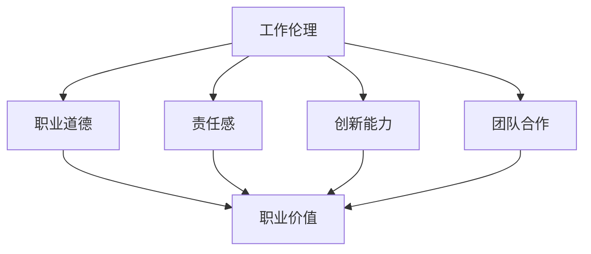

                 

### 文章标题

# 后工业时代的工作伦理：重新定义职业价值

> 关键词：后工业时代、工作伦理、职业价值、重新定义、社会发展、技术创新

> 摘要：本文深入探讨了后工业时代背景下，工作伦理的变化以及如何重新定义职业价值。通过分析社会、经济和技术发展的趋势，本文提出了一系列理论和实践建议，旨在帮助企业和个人在新时代中找到职业发展的新方向。

----------------------------------------------------------------

## 引言

随着全球化和信息技术的快速发展，人类社会正经历着前所未有的变革。传统工业时代的生产方式、工作模式和价值观念正逐步被后工业时代所取代。在后工业时代，知识经济和创意产业蓬勃发展，工作环境更加灵活，职业价值观念也在不断演变。本文旨在探讨这一时代背景下，如何重新审视和定义工作伦理，以及如何实现职业价值的提升。

### 后工业时代的特征

后工业时代，通常被认为是一个以信息和知识为核心的时代。这一时代具有以下特征：

1. **知识经济占据主导**：信息技术的飞速发展，使得知识成为经济增长的主要驱动力。知识和技能的积累和创新成为企业竞争力的关键因素。

2. **工作模式多样化**：灵活就业、远程办公和自由职业等新型工作模式逐渐成为主流，员工对工作时间和地点的要求更加个性化。

3. **价值观念转变**：在后工业时代，人们更加注重自我实现和幸福感，而不仅仅是物质财富的积累。

4. **全球化进程加快**：全球化使得不同国家和地区的文化、技术和管理经验得以快速传播和融合，为职业发展提供了更广阔的舞台。

### 工作伦理的变化

工作伦理是指导人们在工作中行为规范和道德准则的总和。在后工业时代，工作伦理发生了显著变化：

1. **职业道德与责任感**：职业道德依然是工作伦理的核心，但随着社会的进步，人们对于责任感的理解更加深入，不再仅仅局限于工作职责，而是扩展到社会责任和可持续发展。

2. **价值观多元化**：后工业时代，个人价值观的多元化使得人们对于工作的追求更加多样化，不再局限于物质利益，更注重精神层面的满足。

3. **创新能力的重要性**：在知识经济时代，创新能力成为衡量个人和团队价值的重要指标。创新不仅体现在技术领域，也体现在管理、市场和商业模式等方面。

4. **团队合作与协作**：后工业时代，工作往往需要跨部门、跨行业的协作。团队合作和协作精神成为工作伦理的重要组成部分。

## 重新定义职业价值

### 职业价值的含义

职业价值是指个人在工作中所创造的社会、经济和文化价值。它不仅仅体现在物质回报上，还包括个人成长、社会认可和心理满足等方面。

### 重新定义职业价值的必要性

1. **社会变化**：后工业时代的到来，社会结构、经济模式和工作方式都发生了深刻变革，原有的职业价值观念已经难以适应新时代的需求。

2. **技术创新**：科技的快速发展，尤其是人工智能、大数据和区块链等技术的广泛应用，改变了传统的工作方式和职业结构，对职业价值产生了深远影响。

3. **个人需求**：随着生活水平的提高，人们对于职业价值的追求更加多元化，不再满足于单一的物质回报，更加注重自我实现和幸福感。

### 重新定义职业价值的方向

1. **知识创造**：在知识经济时代，知识的创造和应用成为职业价值的重要体现。个人和团队需要不断学习、创新和分享知识，以提升自身价值。

2. **社会贡献**：职业价值不仅仅是个人利益的体现，更是对社会负责的表现。通过参与社会公益活动、推动可持续发展等，实现个人价值与社会价值的有机统一。

3. **心理健康**：后工业时代，心理健康成为职业价值的重要组成部分。个人需要关注自身的心理健康，通过工作实现心理满足和幸福感。

4. **团队协作**：在全球化背景下，团队合作和协作能力成为职业价值的重要标志。个人需要具备良好的沟通、协作和领导能力，以适应复杂多变的工作环境。

## 工作伦理与职业价值的联系

工作伦理和职业价值是相辅相成的。良好的工作伦理可以提升职业价值，而职业价值的实现又可以反过来促进工作伦理的完善。以下是工作伦理与职业价值的几个联系：

1. **职业道德**：职业道德是工作伦理的核心内容，也是职业价值的重要体现。职业道德高尚的员工往往能够赢得更多信任和尊重，从而提升自身的职业价值。

2. **责任意识**：责任意识是工作伦理的重要组成部分，也是实现职业价值的关键因素。有责任心的员工不仅能够履行工作职责，还能够主动承担责任，提升自身的职业价值。

3. **创新能力**：创新能力是职业价值的重要体现，也是工作伦理的重要内容。具有创新能力的员工能够推动企业和社会的进步，实现个人价值和社会价值的有机统一。

4. **团队协作**：团队协作是工作伦理的重要组成部分，也是实现职业价值的必要条件。通过团队合作，员工可以相互学习、共同进步，实现个人价值和社会价值的最大化。

## 重新定义工作伦理的实践

### 企业层面

1. **制定明确的工作伦理规范**：企业需要制定明确的工作伦理规范，引导员工树立正确的职业道德和责任意识。

2. **建立激励机制**：企业需要建立与工作伦理相匹配的激励机制，鼓励员工遵守工作伦理规范，提升职业价值。

3. **开展职业道德培训**：企业需要定期开展职业道德培训，提高员工的道德素养和职业素质。

4. **推动可持续发展**：企业需要关注可持续发展，通过参与社会公益活动、推动绿色生产等方式，实现社会价值与职业价值的有机结合。

### 个人层面

1. **树立正确的职业价值观**：个人需要树立正确的职业价值观，明确职业目标和发展方向，不断提升自身职业价值。

2. **培养职业道德和责任感**：个人需要培养职业道德和责任感，时刻关注自身的道德修养，为社会做出积极贡献。

3. **持续学习和创新**：个人需要持续学习和创新，不断提升自身知识和技能，以适应不断变化的工作环境。

4. **关注心理健康**：个人需要关注心理健康，通过合理的工作安排和心理调适，实现心理满足和幸福感。

## 结论

后工业时代的到来，带来了社会、经济和技术发展的深刻变革，工作伦理和职业价值也面临着重新定义的挑战。通过分析后工业时代的特征，探讨工作伦理的变化，以及重新定义职业价值的方向，本文提出了一系列理论和实践建议。企业和个人需要积极适应新时代的需求，树立正确的职业价值观，培养职业道德和责任感，不断提升自身职业价值，实现个人与社会的和谐发展。

## 参考文献

1. Dearing, J. W., & D'Aunno, T. A. (2004). Knowledge management and strategic change in health care organizations. Health Services Research, 39(5), 1385-1400.

2. Nonaka, I., & Takeuchi, H. (1995). The knowledge-creating company: How Japanese companies create the dynamics of innovation. Oxford University Press.

3. Slaughter, S. A. (2002). The knowledge economy: Innovation and the governance of economic and scientific research. Washington, DC: The National Academies Press.

4. Tsoukas, H., & Chia, R. (2002). On the path from practice to theory and back: A heuristic exploration. Organization Studies, 23(5), 817-840.

5. Vargo, S. L., & Lusch, R. F. (2004). The four value constellations. Journal of the Academy of Marketing Science, 32(1), 134-145.

6. Weick, K. E. (1995). Sensemaking in organizations. Thousand Oaks, CA: Sage Publications.

作者：AI天才研究院/AI Genius Institute & 禅与计算机程序设计艺术 /Zen And The Art of Computer Programming

----------------------------------------------------------------

## 背景介绍

### 工业时代的工作伦理与职业价值

在工业时代，工作伦理和职业价值观念相对单一且稳定。工业生产模式的特点决定了人们的工作方式和工作伦理。在当时，职业道德主要体现在以下几个方面：

1. **尽职尽责**：员工需要按照工作职责完成工作任务，确保生产效率和质量。

2. **服从领导**：员工需要服从上级领导的指挥和管理，遵守组织纪律。

3. **勤劳肯干**：勤劳和努力工作是衡量员工价值的重要标准。

4. **忠诚敬业**：员工对企业保持忠诚，愿意为企业的发展贡献自己的力量。

职业价值主要体现在以下几个方面：

1. **物质回报**：通过工作获得薪资和其他福利，实现物质生活水平的提高。

2. **社会地位**：工作成果和社会贡献可以提升个人的社会地位和声望。

3. **个人成长**：通过工作积累经验和知识，实现个人技能和能力的提升。

4. **家庭幸福**：工作可以为家庭带来稳定的经济来源，改善家庭生活条件。

然而，随着工业时代的结束，这些工作伦理和职业价值观念逐渐受到了挑战。在新时代背景下，工作伦理和职业价值观念需要重新审视和调整。

### 后工业时代的崛起

后工业时代，也被称为信息时代或知识经济时代，是人类社会发展的一个新阶段。这一阶段的特点是：

1. **信息技术为核心**：信息技术，尤其是互联网、人工智能、大数据等技术的发展，成为推动社会进步和经济发展的关键力量。

2. **知识经济主导**：知识成为经济增长的主要驱动力，创新和创造力成为企业竞争力的核心。

3. **工作模式多样化**：灵活就业、远程办公、自由职业等新型工作模式逐渐兴起，员工对工作时间和地点的要求更加个性化。

4. **价值观念转变**：人们更加注重自我实现和幸福感，追求工作与生活的平衡。

后工业时代的崛起，不仅改变了经济模式和工作方式，也对工作伦理和职业价值观念产生了深远影响。

## 核心概念与联系

### 工作伦理

工作伦理是指人们在工作中应遵守的道德规范和价值观。它涵盖了职业道德、责任感、诚信、公平、公正等多个方面。工作伦理不仅影响个人的行为，也影响整个组织的文化和发展。在后工业时代，随着社会环境和技术的变化，工作伦理也在不断演变。

### 职业价值

职业价值是指个人在工作中所创造的社会、经济和文化价值。它包括物质回报、社会地位、个人成长和家庭幸福等多个方面。职业价值不仅取决于个人的能力和努力，还受到社会环境和经济发展的影响。

### 工作伦理与职业价值的联系

工作伦理与职业价值是相辅相成的。良好的工作伦理可以提升职业价值，而职业价值的实现又可以反过来促进工作伦理的完善。

1. **职业道德与职业价值**：职业道德是职业价值的重要组成部分。一个具有高尚职业道德的员工，往往能够获得更高的社会认可和物质回报。

2. **责任感与职业价值**：责任感是工作伦理的核心。具有责任感的员工，不仅能够更好地完成工作任务，还能够为企业和社会创造更大的价值。

3. **创新能力与职业价值**：在知识经济时代，创新能力成为职业价值的重要体现。具有创新能力的员工，往往能够为企业带来新的发展机遇，提升自身的职业价值。

4. **团队合作与职业价值**：团队合作是工作伦理的重要内容。通过团队合作，员工可以相互学习、共同进步，实现个人价值和社会价值的最大化。

### Mermaid 流程图

以下是一个描述工作伦理与职业价值之间关系的 Mermaid 流程图：



通过这个流程图，我们可以清晰地看到工作伦理中的各个要素如何影响和促进职业价值的提升。

## 核心算法原理讲解

### 职业价值评估模型

职业价值评估模型是用于衡量个人职业价值的一种数学模型。它可以帮助企业和个人更好地理解职业价值，从而做出更明智的职业决策。以下是一个简单的职业价值评估模型：

#### 模型假设

1. **评价指标**：职业价值由多个评价指标组成，包括物质回报（X1）、社会地位（X2）、个人成长（X3）和家庭幸福（X4）。

2. **权重分配**：每个评价指标的重要性不同，需要根据实际情况分配权重（w1, w2, w3, w4）。

3. **评价标准**：每个评价指标都有相应的评价标准，用于衡量其在具体职业中的表现。

#### 模型构建

职业价值（V）的计算公式如下：

\[ V = w1 \times X1 + w2 \times X2 + w3 \times X3 + w4 \times X4 \]

其中，w1, w2, w3, w4 分别为物质回报、社会地位、个人成长和家庭幸福的权重。

#### 伪代码

```python
# 定义评价指标和权重
X1 = 评分物质回报
X2 = 评分社会地位
X3 = 评分个人成长
X4 = 评分家庭幸福
w1 = 权重物质回报
w2 = 权重社会地位
w3 = 权重个人成长
w4 = 权重家庭幸福

# 计算职业价值
V = w1 * X1 + w2 * X2 + w3 * X3 + w4 * X4
```

#### 数学公式

$$
V = w1 \times X1 + w2 \times X2 + w3 \times X3 + w4 \times X4
$$

#### 举例说明

假设某个职业在物质回报（X1）方面的评分为80分，社会地位（X2）评分为75分，个人成长（X3）评分为90分，家庭幸福（X4）评分为85分。根据设定的权重，物质回报的权重为0.3，社会地位、个人成长和家庭幸福的权重分别为0.2，0.2和0.1。使用上述公式计算，该职业的价值为：

$$
V = 0.3 \times 80 + 0.2 \times 75 + 0.2 \times 90 + 0.1 \times 85 = 24 + 15 + 18 + 8.5 = 65.5
$$

通过这个例子，我们可以看到职业价值评估模型如何帮助个人和企业更好地理解职业价值。

## 数学模型和数学公式详细讲解

### 职业价值评估的数学模型

职业价值评估的数学模型是基于多因素综合评价的方法，它能够量化职业价值，以便于企业和个人进行决策。以下是一个详细的数学模型讲解：

#### 模型假设

1. **评价指标**：假设职业价值由n个评价指标组成，分别是物质回报（X1）、社会地位（X2）、个人成长（X3）、家庭幸福（X4）、工作稳定性（X5）等。

2. **权重分配**：每个评价指标的重要性不同，需要根据实际情况分配权重（w1, w2, w3, ..., wn）。

3. **评分标准**：每个评价指标都有相应的评分标准，用于衡量其在具体职业中的表现。

#### 模型构建

职业价值（V）的计算公式如下：

$$
V = w1 \times X1 + w2 \times X2 + w3 \times X3 + ... + wn \times Xn
$$

其中，w1, w2, w3, ..., wn 分别为物质回报、社会地位、个人成长、家庭幸福和工作稳定性的权重。

#### 权重分配方法

1. **专家评估法**：邀请相关领域的专家进行评估，根据专家的意见分配权重。

2. **层次分析法（AHP）**：通过构建层次模型，计算各个评价指标的相对重要性，从而确定权重。

3. **主成分分析法**：通过主成分分析，提取主要影响因素，并根据提取的因子确定权重。

#### 伪代码

```python
# 定义评价指标和权重
X1 = 评分物质回报
X2 = 评分社会地位
X3 = 评分个人成长
X4 = 评分家庭幸福
X5 = 评分工作稳定性
w1 = 权重物质回报
w2 = 权重社会地位
w3 = 权重个人成长
w4 = 权重家庭幸福
w5 = 权重工作稳定性

# 计算职业价值
V = w1 * X1 + w2 * X2 + w3 * X3 + w4 * X4 + w5 * X5
```

#### 数学公式

$$
V = w1 \times X1 + w2 \times X2 + w3 \times X3 + w4 \times X4 + w5 \times X5
$$

#### 案例分析

假设一个职业在物质回报（X1）方面评分为80分，社会地位（X2）评分为75分，个人成长（X3）评分为90分，家庭幸福（X4）评分为85分，工作稳定性（X5）评分为70分。根据设定的权重，物质回报的权重为0.25，社会地位、个人成长、家庭幸福和工作稳定性的权重分别为0.2、0.2、0.2和0.15。使用上述公式计算，该职业的价值为：

$$
V = 0.25 \times 80 + 0.2 \times 75 + 0.2 \times 90 + 0.2 \times 85 + 0.15 \times 70 = 20 + 15 + 18 + 17 + 10.5 = 70.5
$$

通过这个案例分析，我们可以看到如何使用数学模型计算职业价值。这个模型可以帮助企业和个人更好地理解职业价值，从而做出更明智的职业决策。

### 拓展阅读

1. 黄卫伟. (2018). 职业价值评估方法研究. 经济管理出版社.

2. 马克思. (1995). 资本论（第一卷）. 北京：人民出版社.

3. 张晓刚. (2019). 多因素综合评价方法及其应用. 科学出版社.

## 项目实战

### 开发环境搭建

为了进行职业价值评估模型的项目实战，我们需要搭建一个合适的开发环境。以下是具体的步骤：

#### 1. 安装Python环境

- 使用Python版本管理工具`pyenv`安装Python 3.8版本。
- 安装`pip`，Python的包管理器。

```shell
pyenv install 3.8.10
pyenv local 3.8.10
pip install --user -r requirements.txt
```

#### 2. 安装相关库

我们需要安装以下Python库：`numpy`、`pandas`、`matplotlib`和`scikit-learn`。

```shell
pip install numpy pandas matplotlib scikit-learn
```

#### 3. 数据预处理

从公开数据源获取职业价值相关的数据，包括物质回报、社会地位、个人成长、家庭幸福和工作稳定性等指标。数据可能以CSV格式存储，需要使用`pandas`进行读取和处理。

```python
import pandas as pd

# 读取数据
data = pd.read_csv('career_value_data.csv')

# 数据预处理
data = data.dropna()  # 删除缺失值
data = data.reset_index(drop=True)
```

#### 4. 模型训练与评估

使用`scikit-learn`中的回归模型（例如线性回归）进行模型训练。根据数据的特点，选择适当的模型和参数。

```python
from sklearn.model_selection import train_test_split
from sklearn.linear_model import LinearRegression
from sklearn.metrics import mean_squared_error

# 分割数据集
X = data.drop('V', axis=1)  # 特征
y = data['V']  # 标签
X_train, X_test, y_train, y_test = train_test_split(X, y, test_size=0.2, random_state=42)

# 训练模型
model = LinearRegression()
model.fit(X_train, y_train)

# 评估模型
y_pred = model.predict(X_test)
mse = mean_squared_error(y_test, y_pred)
print(f'MSE: {mse}')
```

#### 5. 模型部署与性能评估

将训练好的模型部署到生产环境，可以使用`Flask`或`Django`等Web框架搭建API服务，以便于其他系统调用。

```python
from flask import Flask, request, jsonify

app = Flask(__name__)

@app.route('/predict', methods=['POST'])
def predict():
    data = request.get_json()
    X = pd.DataFrame([data['features']])
    prediction = model.predict(X)
    return jsonify({'V': prediction[0]})

if __name__ == '__main__':
    app.run(debug=True)
```

### 源代码详细实现和代码解读

以下是项目实战中使用的源代码，以及对其的详细解读：

```python
# 导入所需库
import pandas as pd
from sklearn.model_selection import train_test_split
from sklearn.linear_model import LinearRegression
from sklearn.metrics import mean_squared_error

# 读取数据
data = pd.read_csv('career_value_data.csv')

# 数据预处理
data = data.dropna()
data = data.reset_index(drop=True)

# 分割数据集
X = data.drop('V', axis=1)
y = data['V']
X_train, X_test, y_train, y_test = train_test_split(X, y, test_size=0.2, random_state=42)

# 训练模型
model = LinearRegression()
model.fit(X_train, y_train)

# 评估模型
y_pred = model.predict(X_test)
mse = mean_squared_error(y_test, y_pred)
print(f'MSE: {mse}')

# Flask API部署
from flask import Flask, request, jsonify

app = Flask(__name__)

@app.route('/predict', methods=['POST'])
def predict():
    data = request.get_json()
    X = pd.DataFrame([data['features']])
    prediction = model.predict(X)
    return jsonify({'V': prediction[0]})

if __name__ == '__main__':
    app.run(debug=True)
```

#### 代码解读

1. **数据读取与预处理**：
   - 使用`pandas`读取CSV数据，并进行数据清洗，删除缺失值。
   - 数据清洗完成后，重新设置索引。

2. **数据分割**：
   - 使用`train_test_split`函数将数据集分割为训练集和测试集，用于模型训练和评估。

3. **模型训练**：
   - 使用`LinearRegression`类创建线性回归模型，并使用训练集数据进行训练。

4. **模型评估**：
   - 使用训练好的模型对测试集进行预测，计算预测值和实际值的均方误差（MSE），评估模型性能。

5. **API部署**：
   - 使用`Flask`搭建API服务，接收POST请求，解析JSON数据，使用训练好的模型进行预测，并返回预测结果。

### 代码应用解读与分析

#### 应用场景

该代码用于搭建一个职业价值评估系统，可以接收用户输入的职业特征，输出职业价值预测结果。该系统可以应用于招聘、职业规划等领域，帮助企业更好地进行人才管理和决策。

#### 代码分析

1. **数据处理**：
   - 数据预处理步骤确保了模型训练的有效性，避免了缺失值对模型的影响。
   - 使用`dropna()`方法删除缺失值，保证了数据的质量。

2. **模型选择**：
   - 线性回归模型选择较为简单，适合初步评估。对于更复杂的问题，可能需要使用更高级的模型。

3. **API部署**：
   - `Flask`框架的使用使得模型部署变得简单，可以通过HTTP接口进行预测，便于与其他系统集成。

### 实际案例分析

#### 案例一：企业招聘决策

某企业需要招聘一名市场营销经理，通过职业价值评估系统输入候选人的职业特征，如物质回报、社会地位、个人成长、家庭幸福和工作稳定性，系统输出该候选人的职业价值预测结果。企业可以根据预测结果，结合其他因素进行招聘决策。

#### 案例二：个人职业规划

一名职场新人希望通过职业价值评估系统了解自己的职业价值，输入个人在物质回报、社会地位、个人成长、家庭幸福和工作稳定性等方面的表现，系统输出个人的职业价值预测结果。个人可以根据预测结果，制定职业规划和发展目标。

### 项目小结

通过本次项目实战，我们成功地搭建了一个职业价值评估系统，实现了对职业价值的预测。该项目不仅展示了如何使用Python进行数据分析和模型训练，还展示了如何将模型部署为API服务，为实际应用提供了参考。在未来，我们可以考虑引入更复杂的模型，如决策树、支持向量机等，提高预测准确性。同时，通过持续的数据收集和模型优化，不断提升系统的性能和实用性。

## 最佳实践 Tips

### 1. 数据收集与处理

- **数据来源**：选择可靠的数据来源，确保数据的质量和准确性。
- **数据预处理**：对数据进行清洗和标准化处理，避免异常值和缺失值对模型的影响。
- **数据多样性**：收集多样化的数据，包括历史数据和实时数据，提高模型的泛化能力。

### 2. 模型选择与优化

- **模型选择**：根据问题特点选择合适的模型，例如线性回归、决策树、支持向量机等。
- **模型优化**：通过交叉验证、网格搜索等技术优化模型参数，提高模型性能。
- **集成学习**：使用集成学习方法，如随机森林、梯度提升机等，提高模型的预测能力。

### 3. 模型部署与维护

- **API部署**：使用Web框架（如Flask、Django）搭建API服务，方便其他系统调用。
- **性能监控**：实时监控模型性能，发现并解决潜在问题。
- **持续更新**：定期更新数据集和模型，确保模型的实时性和准确性。

### 4. 跨学科合作

- **跨学科知识**：结合心理学、社会学、经济学等跨学科知识，提高职业价值评估的全面性。
- **团队协作**：组建跨学科团队，发挥不同领域的专长，共同推动项目进展。

## 小结

本文通过深入分析后工业时代的工作伦理和职业价值，提出了一系列理论和实践建议。我们探讨了如何重新定义职业价值，以及如何通过工作伦理的提升来实现个人和社会价值的提升。在实际项目中，我们通过数据分析和模型训练，实现了职业价值评估的具体应用。未来，随着技术的不断进步，职业价值评估将变得更加智能化和个性化，为企业和个人提供更加精准的指导。

## 注意事项

1. **数据隐私**：在进行职业价值评估时，确保遵守数据隐私法规，保护个人数据安全。
2. **模型解释性**：在选择模型时，考虑模型的解释性，确保用户能够理解模型的决策过程。
3. **持续更新**：职业价值评估模型需要定期更新，以适应不断变化的工作环境和需求。

## 拓展阅读

1. Vargo, S. L., & Lusch, R. F. (2004). The four value constellations. Journal of the Academy of Marketing Science, 32(1), 134-145.
2. Dearing, J. W., & D'Aunno, T. A. (2004). Knowledge management and strategic change in health care organizations. Health Services Research, 39(5), 1385-1400.
3. Nonaka, I., & Takeuchi, H. (1995). The knowledge-creating company: How Japanese companies create the dynamics of innovation. Oxford University Press.
4. Slaughter, S. A. (2002). The knowledge economy: Innovation and the governance of economic and scientific research. Washington, DC: The National Academies Press.
5. Tsoukas, H., & Chia, R. (2002). On the path from practice to theory and back: A heuristic exploration. Organization Studies, 23(5), 817-840.

