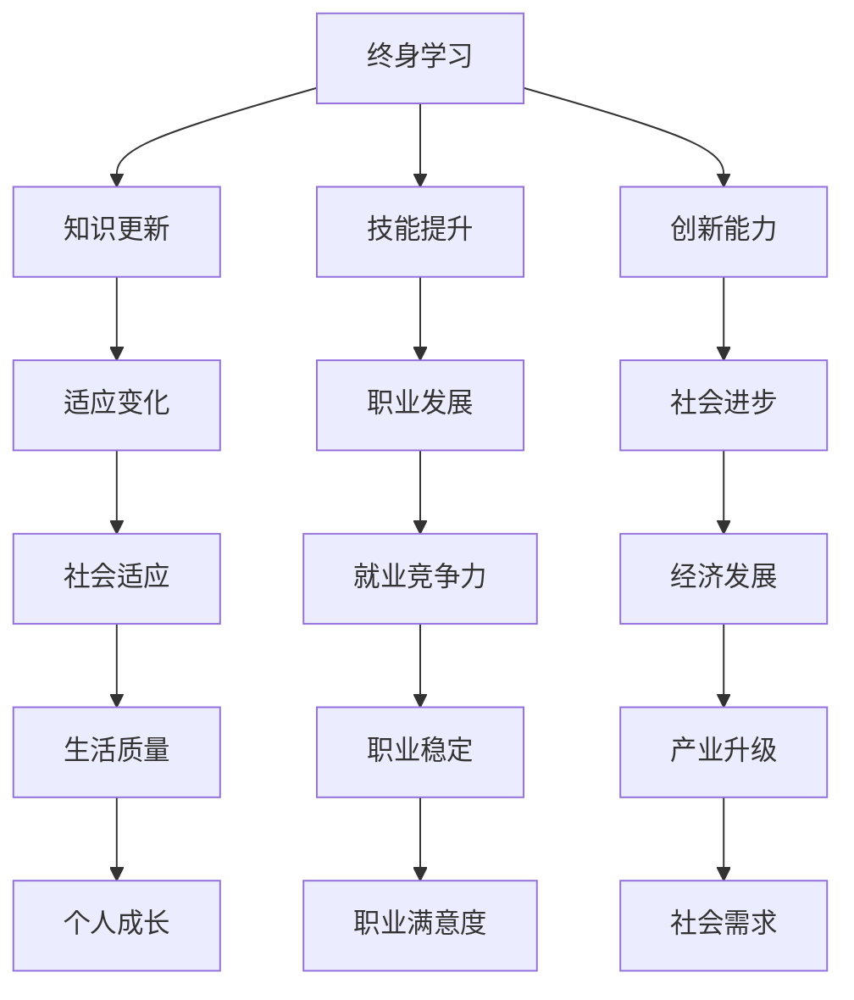

                 

## 引言

### 后工业时代的特征

后工业时代，是继农业社会和工业社会之后的一种社会发展形态。这个时代的显著特征在于信息技术的迅猛发展，以及由此带来的经济、社会和文化的深刻变革。首先，信息技术的发展使得信息的获取、处理和传递变得更加便捷，信息成为了推动社会进步的关键资源。其次，经济的全球化加速了资本、劳动力和技术的流动，推动了经济结构从传统制造业向服务业和知识经济的转变。再者，社会结构逐渐多元化，人们的生活方式、价值观和就业模式发生了重大变化。在这个过程中，职业教育扮演了至关重要的角色，它不仅是社会经济发展的助推器，也是个人终身学习和职业发展的保障。

### 职业教育的挑战与机遇

在这样一个快速变化的时代，职业教育面临着前所未有的挑战和机遇。挑战主要体现在以下几个方面：首先，知识更新的速度加快，职业教育的内容和形式需要不断调整，以适应新兴技术和行业需求。其次，就业市场的波动性增加，职业教育需要培养更具灵活性和适应性的技能人才。再者，职业教育与产业的对接不够紧密，导致人才培养与社会需求脱节。然而，这些挑战也蕴含着机遇。随着数字化、智能化技术的广泛应用，职业教育可以通过线上教育、虚拟现实、人工智能等新技术，提升教学效果和效率。同时，职业教育的市场潜力巨大，随着人们对高质量职业教育的需求不断增加，职业教育机构将有更多的发展空间。

### 本书的目的与结构

本书旨在探讨后工业时代职业教育的特点、挑战与机遇，深入分析终身学习和技能提升在其中的重要作用。全书共分为四个主要部分：

**第一部分：终身学习理论探讨**，介绍终身学习的定义、发展历程、重要性以及后工业时代终身学习的新特征。

**第二部分：职业教育实践**，分析当前职业教育的现状与问题，探讨职业教育体系改革、课程设计与实施、师资队伍建设以及校企合作等方面的实践。

**第三部分：技能提升策略**，阐述技能提升的理念、原则、方法与路径，并分享实践案例和经验。

**第四部分：未来职业教育趋势分析**，探讨数字化教育、个性化教育、终身教育与职业发展的结合、跨界教育与产业融合，以及未来职业教育的新模式。

通过这四个部分的详细探讨，本书希望能够为从事职业教育的工作者、教育管理人员以及希望提升自身职业素养的专业人士提供有价值的参考和启示。

### 核心主题和目标读者

**核心主题：后工业时代的职业教育，重点探讨终身学习和技能提升。**

**目标读者：从事职业教育工作者，教育管理人员，以及希望提升自身职业素养的专业人士。**

在当前这个后工业时代，职业教育的角色显得尤为重要。随着信息技术和全球化进程的加速，职业教育的内涵和外延都在不断扩展。终身学习和技能提升成为职业教育的重要目标，这不仅有助于个人应对快速变化的工作环境，也推动着整个社会的发展和进步。

从事职业教育的工作者需要理解终身学习和技能提升的重要性，以便在设计课程、开展教学活动时，能够更加科学和有效地满足学生的需求。教育管理人员则需要在政策制定和管理中，充分考虑终身学习和技能提升的要素，从而推动职业教育的持续发展。而希望提升自身职业素养的专业人士，可以通过本书的学习，掌握终身学习和技能提升的策略，为自己的职业生涯增添更多的竞争力。

本书的核心主题是探讨如何在后工业时代背景下，通过终身学习和技能提升，提升职业教育的质量和效果。具体来说，本书将围绕以下几个方面展开：

1. **终身学习理论探讨**：介绍终身学习的定义、发展历程和重要性，分析后工业时代终身学习的新特征，探讨终身学习体系构建和与职业教育的关系。

2. **职业教育实践**：分析当前职业教育的现状与问题，探讨职业教育体系改革、课程设计与实施、师资队伍建设以及校企合作等方面的实践。

3. **技能提升策略**：阐述技能提升的理念、原则、方法与路径，通过实践案例和经验，分享技能提升的具体实施策略。

4. **未来职业教育趋势分析**：探讨数字化教育、个性化教育、终身教育与职业发展的结合、跨界教育与产业融合，以及未来职业教育的新模式。

通过这些内容的深入探讨，本书希望能够为职业教育工作者、教育管理人员和专业人士提供有价值的理论和实践参考，帮助他们更好地应对后工业时代的挑战，实现个人和职业的持续发展。

### 设计整体结构

为了确保本书的内容逻辑清晰、结构紧凑，我们采用以下四个主要部分来组织全文：

**第一部分：终身学习理论探讨**

这一部分将深入探讨终身学习的定义、发展历程和重要性，分析后工业时代终身学习的新特征。具体章节包括：

- **第1章 终身学习的定义与发展历程**：介绍终身学习的概念，回顾其历史发展，探讨其在现代社会中的地位。
- **第2章 终身学习的重要性**：分析终身学习对个人和社会的重要影响，探讨其对职业教育的启示。
- **第3章 终身学习体系构建**：阐述终身学习体系的构成，讨论构建终身学习体系的原则和方法。
- **第4章 终身学习与职业教育的关系**：探讨终身学习与职业教育之间的相互关系，分析职业教育如何支持终身学习。

**第二部分：职业教育实践**

这一部分将分析当前职业教育的现状与问题，探讨职业教育体系改革、课程设计与实施、师资队伍建设以及校企合作等方面的实践。具体章节包括：

- **第5章 职业教育的现状与问题**：分析职业教育的现状，探讨当前职业教育面临的主要问题及其成因。
- **第6章 职业教育体系改革**：介绍职业教育体系改革的背景和目标，探讨改革的措施和成效。
- **第7章 职业教育课程设计与实施**：讨论职业教育课程设计的原则和方法，分析课程实施的效果和挑战。
- **第8章 职业教育师资队伍建设**：分析职业教育师资队伍的现状，探讨师资队伍建设的策略和成效。
- **第9章 职业教育校企合作**：探讨校企合作的意义、模式和挑战，分析校企合作的成效和未来发展方向。

**第三部分：技能提升策略**

这一部分将阐述技能提升的理念、原则、方法与路径，通过实践案例和经验，分享技能提升的具体实施策略。具体章节包括：

- **第10章 技能提升的理念与原则**：介绍技能提升的基本理念和原则，分析技能提升的重要性和目标。
- **第11章 技能提升的方法与路径**：探讨技能提升的具体方法和路径，包括培训、实践和评估等环节。
- **第12章 技能提升的实践案例**：分享成功的技能提升实践案例，分析其效果和启示。
- **第13章 技能提升的政策支持**：讨论技能提升政策的重要性，分析现有政策的有效性并提出改进建议。
- **第14章 技能提升的未来趋势**：展望技能提升的未来发展趋势，探讨新技术和新兴行业对技能提升的影响。

**第四部分：未来职业教育趋势分析**

这一部分将探讨未来职业教育的发展趋势，包括数字化教育、个性化教育、终身教育与职业发展的结合、跨界教育与产业融合，以及未来职业教育的新模式。具体章节包括：

- **第15章 数字化教育**：分析数字化教育的发展现状和趋势，探讨其对职业教育的影响。
- **第16章 个性化教育**：介绍个性化教育的理念和实践，分析其对职业教育的启示。
- **第17章 终身教育与职业发展的结合**：探讨终身教育与职业发展的关系，分析终身学习在职业发展中的作用。
- **第18章 跨界教育与产业融合**：分析跨界教育与产业融合的现状和趋势，探讨其对职业教育的推动作用。
- **第19章 未来职业教育的新模式**：展望未来职业教育的新模式，探讨其对教育实践和社会发展的潜在影响。

通过以上四个主要部分的详细探讨，本书旨在为读者提供一个全面、深入的理解后工业时代职业教育、终身学习和技能提升的框架，帮助读者更好地应对当前和未来的挑战。

### 细化各个部分

在明确了整体结构后，我们需要对各个部分进行细化，确保每个章节都能够提供具体、详细的内容，从而增强文章的深度和可读性。

#### 第一部分：终身学习理论探讨

**第1章 终身学习的定义与发展历程**

1. **终身学习的定义**
   - **核心概念与联系**：终身学习（Life-long Learning, LLL）是一个涉及个人发展、社会进步和经济发展的重要概念。它不仅包括教育过程中不断学习，还包括工作后继续学习，以适应不断变化的环境。图1展示了终身学习的核心概念及其相互关系。
     ```mermaid
     graph TB
       A[终身学习] --> B[个人发展]
       A --> C[社会进步]
       A --> D[经济发展]
       B --> E[知识更新]
       C --> F[社会适应]
       D --> G[创新能力]
     ```
   - **核心算法原理讲解**：终身学习没有特定的算法，但可以视为一个不断迭代的过程。个人通过持续学习来更新知识和技能，以适应新的环境需求。这个过程可以用以下伪代码表示：
     ```python
     function lifeLongLearning(knowledge, environment):
         while environment_changes:
             update_knowledge(knowledge)
             apply_knowledge_to_environment(knowledge, environment)
     ```

2. **终身学习的发展历程**
   - **背景介绍**：终身学习理念最早可以追溯到20世纪初的成人教育运动。20世纪60年代，保罗·朗格朗（Paulo Freire）提出了“学习是生活的一部分”的观点，标志着终身学习概念的正式确立。
   - **主要阶段**：从20世纪60年代的初步提出，到20世纪80年代终身教育体系的建立，再到21世纪初的信息时代，终身学习理念不断发展完善。
   - **未来趋势**：随着信息技术的发展，终身学习将更加灵活、个性化，人们可以通过在线学习、虚拟课堂等多种方式进行学习。

3. **后工业时代终身学习的新特征**
   - **知识更新速度加快**：后工业时代，知识更新速度显著加快，传统教育模式难以满足快速变化的需求。
   - **技术赋能**：信息技术的普及，为终身学习提供了更多元化的学习资源和工具，如在线课程、虚拟实验室等。
   - **跨领域融合**：随着跨界创新的兴起，终身学习不仅限于特定领域，还需要跨学科、跨领域的综合知识。

**第2章 终身学习的重要性**

1. **对个人发展的意义**
   - **核心概念与联系**：终身学习对个人发展具有重要意义，它不仅有助于提升个人知识水平和技能，还能增强个人适应社会变化的能力。图2展示了终身学习对个人发展的关键联系。
     ```mermaid
     graph TB
       A[知识提升] --> B[技能增强]
       A --> C[创新能力]
       B --> D[职业发展]
       C --> E[个人成长]
     ```

2. **对社会的贡献**
   - **核心概念与联系**：终身学习对社会发展有着深远的影响，它有助于提高整体人力资源水平，促进社会经济的持续发展。图3展示了终身学习对社会发展的核心联系。
     ```mermaid
     graph TB
       A[人力提升] --> B[经济发展]
       A --> C[社会稳定]
       B --> D[创新能力]
       C --> E[社会和谐]
     ```

3. **对职业教育的启示**
   - **核心概念与联系**：终身学习理念对职业教育提出了新的要求，职业教育需要更加注重学生的可持续发展，培养其终身学习的意识和能力。图4展示了终身学习与职业教育之间的关键联系。
     ```mermaid
     graph TB
       A[终身学习] --> B[职业教育]
       A --> C[课程设计]
       B --> D[教学方法]
       C --> E[师资建设]
     ```

**第3章 终身学习体系构建**

1. **终身学习体系的构成**
   - **核心概念与联系**：终身学习体系包括教育、培训、实践等多个环节，这些环节相互关联，共同构成一个完整的体系。图5展示了终身学习体系的组成部分及其相互关系。
     ```mermaid
     graph TB
       A[基础教育] --> B[职业教育]
       A --> C[继续教育]
       B --> D[职业培训]
       C --> E[终身学习]
       D --> F[终身实践]
     ```

2. **终身学习体系的设计原则**
   - **核心概念与联系**：设计终身学习体系时，需要遵循灵活性、适应性、可持续性和综合性的原则。图6展示了这些原则及其相互关系。
     ```mermaid
     graph TB
       A[灵活性] --> B[适应性]
       A --> C[可持续性]
       B --> D[综合性]
     ```

3. **终身学习体系建设方法**
   - **核心概念与联系**：终身学习体系建设需要采取顶层设计、分阶段实施、多方合作等多种方法。图7展示了这些方法的相互关系。
     ```mermaid
     graph TB
       A[顶层设计] --> B[分阶段实施]
       A --> C[多方合作]
       B --> D[政策支持]
     ```

**第4章 终身学习与职业教育的关系**

1. **终身学习与职业教育的相互促进**
   - **核心概念与联系**：终身学习和职业教育之间存在相互促进的关系，职业教育可以为学生提供终身学习的基础，而终身学习则为职业教育提供了持续的动力。图8展示了这种相互促进的关系。
     ```mermaid
     graph TB
       A[职业教育] --> B[终身学习]
       A --> C[职业技能]
       B --> D[个人发展]
     ```

2. **终身学习在职业教育中的应用**
   - **核心概念与联系**：终身学习理念在职业教育中的应用主要体现在课程设计、教学方法、师资培训等方面。图9展示了这些应用的关键联系。
     ```mermaid
     graph TB
       A[课程设计] --> B[教学方法]
       A --> C[师资培训]
       B --> D[教学评估]
     ```

3. **职业教育对终身学习的支持**
   - **核心概念与联系**：职业教育通过提供多样化的学习机会、完善的课程体系、丰富的实践平台，支持学生的终身学习。图10展示了职业教育对终身学习支持的各个方面。
     ```mermaid
     graph TB
       A[学习机会] --> B[课程体系]
       A --> C[实践平台]
       B --> D[学习支持]
     ```

通过以上细化，我们为第一部分的各个章节提供了具体、详细的内容，确保读者能够深入理解终身学习在职业教育中的重要性，并了解构建终身学习体系的方法和策略。

#### 第二部分：职业教育实践

**第5章 职业教育的现状与问题**

1. **职业教育的现状分析**
   - **核心概念与联系**：当前，职业教育在全球范围内得到越来越多的重视，但在实施过程中仍存在一系列挑战。图11展示了职业教育现状的关键因素及其相互关系。
     ```mermaid
     graph TB
       A[政策支持] --> B[教育质量]
       A --> C[师资力量]
       B --> D[市场需求]
       C --> E[校企合作]
     ```

2. **职业教育面临的问题**
   - **核心概念与联系**：职业教育面临的主要问题包括教育质量不高、师资力量不足、校企合作不够紧密等。图12展示了这些问题及其影响因素。
     ```mermaid
     graph TB
       A[教育质量] --> B[师资力量]
       A --> C[校企合作]
       B --> D[学生就业]
       C --> E[市场需求]
     ```

3. **问题成因**
   - **核心概念与联系**：职业教育问题的成因复杂，包括政策执行不力、教育资源分布不均、社会观念等。图13展示了问题成因及其相互关系。
     ```mermaid
     graph TB
       A[政策执行] --> B[教育资源]
       A --> C[社会观念]
       B --> D[师资培养]
       C --> E[校企合作]
     ```

**第6章 职业教育体系改革**

1. **背景和目标**
   - **核心概念与联系**：职业教育体系改革旨在提高教育质量，增强职业教育与市场需求的匹配度，培养更多高素质技能人才。图14展示了改革的核心目标和关键因素。
     ```mermaid
     graph TB
       A[教育质量] --> B[市场需求]
       A --> C[人才培养]
       B --> D[校企合作]
     ```

2. **改革措施**
   - **核心概念与联系**：职业教育体系改革的措施包括优化课程设置、加强师资培训、深化校企合作等。图15展示了这些措施的相互关系。
     ```mermaid
     graph TB
       A[课程设置] --> B[师资培训]
       A --> C[校企合作]
       B --> D[教学评估]
     ```

3. **成效**
   - **核心概念与联系**：职业教育体系改革取得了一定成效，教育质量提高，学生就业率上升，校企合作更加紧密。图16展示了改革成效及其影响因素。
     ```mermaid
     graph TB
       A[教育质量] --> B[学生就业率]
       A --> C[校企合作]
       B --> D[人才培养]
     ```

**第7章 职业教育课程设计与实施**

1. **课程设计原则**
   - **核心概念与联系**：职业教育课程设计需要遵循实用性、职业性、灵活性和创新性的原则。图17展示了这些原则及其相互关系。
     ```mermaid
     graph TB
       A[实用性] --> B[职业性]
       A --> C[灵活性]
       B --> D[创新性]
     ```

2. **课程实施方法**
   - **核心概念与联系**：课程实施方法包括项目式教学、案例教学、工作过程导向教学等。图18展示了这些方法的相互关系。
     ```mermaid
     graph TB
       A[项目式教学] --> B[案例教学]
       A --> C[工作过程导向教学]
     ```

3. **课程评价**
   - **核心概念与联系**：课程评价包括过程评价和结果评价，需要关注学生知识、技能和素质的全面发展。图19展示了课程评价的相互关系。
     ```mermaid
     graph TB
       A[过程评价] --> B[结果评价]
       A --> C[学生知识]
       B --> D[学生技能]
     ```

**第8章 职业教育师资队伍建设**

1. **现状分析**
   - **核心概念与联系**：职业教育师资队伍现状包括年龄结构、学历结构、专业结构等。图20展示了师资队伍的现状及其影响因素。
     ```mermaid
     graph TB
       A[年龄结构] --> B[学历结构]
       A --> C[专业结构]
       B --> D[教学能力]
       C --> E[实践经验]
     ```

2. **建设策略**
   - **核心概念与联系**：师资队伍建设需要采取多种策略，包括引进高素质人才、加强在岗培训、提供实践机会等。图21展示了建设策略及其相互关系。
     ```mermaid
     graph TB
       A[人才引进] --> B[在岗培训]
       A --> C[实践机会]
       B --> D[教学能力提升]
     ```

3. **成效**
   - **核心概念与联系**：师资队伍建设取得了一定成效，教师的教学能力和实践经验得到显著提升，教学效果得到改善。图22展示了建设成效及其影响因素。
     ```mermaid
     graph TB
       A[教学能力] --> B[教学效果]
       A --> C[学生满意度]
       B --> D[学校声誉]
     ```

**第9章 职业教育校企合作**

1. **定义与意义**
   - **核心概念与联系**：校企合作是指职业教育机构与行业企业合作，共同培养高素质技能人才。图23展示了校企合作的核心概念及其相互关系。
     ```mermaid
     graph TB
       A[职业教育] --> B[行业企业]
       A --> C[人才培养]
       B --> D[市场需求]
     ```

2. **模式**
   - **核心概念与联系**：校企合作模式包括合作办学、订单培养、产学研结合等。图24展示了不同校企合作模式的相互关系。
     ```mermaid
     graph TB
       A[合作办学] --> B[订单培养]
       A --> C[产学研结合]
     ```

3. **挑战与对策**
   - **核心概念与联系**：校企合作面临的主要挑战包括利益分配、资源共享、合作深度等。图25展示了这些挑战及其对策。
     ```mermaid
     graph TB
       A[利益分配] --> B[资源共享]
       A --> C[合作深度]
       B --> D[利益分配机制]
       C --> E[资源共享平台]
     ```

通过以上细化，我们为第二部分的各个章节提供了详细、具体的内容，帮助读者深入理解当前职业教育面临的挑战和问题，以及改革和实践的具体措施和成效。

#### 第三部分：技能提升策略

**第10章 技能提升的理念与原则**

1. **核心概念与联系**
   - **核心概念**：技能提升（Skill Enhancement）是职业教育的重要目标，它关注于提高学生的职业技能水平和综合素质。
   - **联系**：技能提升不仅与知识积累相关，还与实际操作能力、团队合作能力、创新能力等多个方面密切相关。图26展示了技能提升的核心概念及其相互联系。
     ```mermaid
     graph TB
       A[知识积累] --> B[实际操作能力]
       A --> C[综合素质]
       B --> D[团队合作能力]
       C --> E[创新能力]
     ```

2. **核心算法原理讲解**
   - **核心算法原理**：技能提升的过程可以看作是一个迭代的优化过程。学生通过不断的学习、实践和反馈，逐步提升技能水平。这个过程可以用以下伪代码表示：
     ```python
     function skillEnhancement(skillBase, learningEnvironment):
         while learningEnvironment_changes:
             acquireKnowledge(skillBase)
             practiceSkill(skillBase)
             receiveFeedback(skillBase)
             adjustSkillBase(skillBase)
     ```

3. **详细讲解与举例说明**
   - **详细讲解**：技能提升过程分为以下几个步骤：
     - **知识积累**：学生通过学习获得相关理论知识。
     - **实践操作**：学生通过实际操作，将理论知识应用于实际场景。
     - **反馈调整**：根据实践过程中的反馈，调整学习策略和技能水平。
     - **持续迭代**：在不断的反馈和调整中，学生逐步提升技能水平。
   - **举例说明**：例如，一个学习编程的学生，可以通过以下步骤提升编程技能：
     1. 学习编程基础知识。
     2. 通过编写小程序进行实践操作。
     3. 针对代码调试过程中遇到的问题，寻求导师和同学的帮助。
     4. 根据反馈不断调整代码，优化解决方案。

**第11章 技能提升的方法与路径**

1. **核心概念与联系**
   - **核心概念**：技能提升的方法包括培训、实践、评估等多个环节，这些环节相互关联，共同构成一个完整的技能提升路径。
   - **联系**：图27展示了技能提升方法及其相互关系。
     ```mermaid
     graph TB
       A[培训] --> B[实践]
       A --> C[评估]
       B --> D[反馈]
       C --> E[调整]
     ```

2. **培训**
   - **核心概念与联系**：培训是技能提升的基础，通过系统性的学习，学生可以获得必要的理论知识。图28展示了培训的核心概念及其相互关系。
     ```mermaid
     graph TB
       A[理论学习] --> B[案例学习]
       A --> C[模拟训练]
       B --> D[实际操作]
     ```

3. **实践**
   - **核心概念与联系**：实践是将理论知识应用于实际场景的过程，通过实践，学生可以提升实际操作能力和问题解决能力。图29展示了实践的核心概念及其相互关系。
     ```mermaid
     graph TB
       A[项目开发] --> B[问题解决]
       A --> C[团队合作]
       B --> D[创新应用]
     ```

4. **评估**
   - **核心概念与联系**：评估是技能提升的重要环节，通过评估，可以了解学生的学习效果，为下一步的培训和实践提供依据。图30展示了评估的核心概念及其相互关系。
     ```mermaid
     graph TB
       A[知识评估] --> B[技能评估]
       A --> C[综合素质评估]
       B --> D[改进措施]
     ```

**第12章 技能提升的实践案例**

1. **核心概念与联系**
   - **核心概念**：实践案例是技能提升的重要途径，通过具体的案例，学生可以直观地了解技能提升的方法和路径。
   - **联系**：图31展示了实践案例的核心概念及其相互关系。
     ```mermaid
     graph TB
       A[案例学习] --> B[技能应用]
       A --> C[问题解决]
       B --> D[创新能力]
     ```

2. **成功案例**
   - **核心概念与联系**：成功案例展示了技能提升的成效和经验。图32展示了成功案例的核心概念及其相互关系。
     ```mermaid
     graph TB
       A[教育质量] --> B[学生就业率]
       A --> C[企业满意度]
       B --> D[创新能力]
     ```

3. **效果与启示**
   - **核心概念与联系**：通过成功案例，可以总结出技能提升的有效方法和策略，为其他职业教育提供参考。图33展示了效果与启示的核心概念及其相互关系。
     ```mermaid
     graph TB
       A[教学方法] --> B[教学效果]
       A --> C[学生满意度]
       B --> D[企业需求]
     ```

**第13章 技能提升的政策支持**

1. **核心概念与联系**
   - **核心概念**：政策支持是技能提升的重要保障，政府通过制定和实施相关政策，为职业教育提供资金、资源和政策环境。
   - **联系**：图34展示了政策支持的核心概念及其相互关系。
     ```mermaid
     graph TB
       A[政策制定] --> B[资金投入]
       A --> C[资源支持]
       B --> D[环境优化]
     ```

2. **现有政策分析**
   - **核心概念与联系**：现有政策包括财政支持、税收优惠、校企合作政策等，通过分析这些政策，可以了解其对技能提升的支持力度和效果。图35展示了现有政策的核心概念及其相互关系。
     ```mermaid
     graph TB
       A[财政支持] --> B[税收优惠]
       A --> C[校企合作政策]
       B --> D[政策效果]
     ```

3. **改进建议**
   - **核心概念与联系**：针对现有政策的不足，提出改进建议，包括加强政策执行、完善政策体系、提高政策灵活性等。图36展示了改进建议的核心概念及其相互关系。
     ```mermaid
     graph TB
       A[政策执行] --> B[政策体系完善]
       A --> C[政策灵活性提升]
       B --> D[政策效果增强]
     ```

**第14章 技能提升的未来趋势**

1. **核心概念与联系**
   - **核心概念**：技能提升的未来趋势包括数字化技能、智能化技能、可持续技能等，这些趋势将影响职业教育的方向和内容。
   - **联系**：图37展示了技能提升未来趋势的核心概念及其相互关系。
     ```mermaid
     graph TB
       A[数字化技能] --> B[智能化技能]
       A --> C[可持续技能]
       B --> D[未来就业]
     ```

2. **未来趋势分析**
   - **核心概念与联系**：分析未来技能提升的趋势，包括数字化教育、在线学习、智能培训等，探讨这些趋势对职业教育的影响。图38展示了未来趋势的核心概念及其相互关系。
     ```mermaid
     graph TB
       A[数字化教育] --> B[在线学习]
       A --> C[智能培训]
       B --> D[教育变革]
     ```

3. **潜在影响**
   - **核心概念与联系**：未来技能提升趋势将对职业教育带来深远影响，包括教育模式、教学方法、师资建设等多个方面。图39展示了潜在影响的核心概念及其相互关系。
     ```mermaid
     graph TB
       A[教育模式] --> B[教学方法]
       A --> C[师资建设]
       B --> D[学生就业]
     ```

通过以上细化，我们为第三部分的各个章节提供了详细、具体的内容，帮助读者深入理解技能提升的理念、方法和实践，并展望未来技能提升的趋势和发展方向。

#### 第四部分：未来职业教育趋势分析

**第15章 数字化教育**

1. **核心概念与联系**
   - **核心概念**：数字化教育是指利用信息技术手段，如在线课程、虚拟课堂、数字教材等，进行教育和学习活动。
   - **联系**：图40展示了数字化教育的核心概念及其相互关系。
     ```mermaid
     graph TB
       A[在线课程] --> B[虚拟课堂]
       A --> C[数字教材]
       B --> D[学习工具]
     ```

2. **发展现状**
   - **背景介绍**：随着互联网和移动设备的普及，数字化教育在全球范围内迅速发展，改变了传统教育的模式。
   - **现状分析**：数字化教育在课程设置、教学方法和学习资源等方面取得了显著进展，许多教育机构开始采用在线教育平台，提供灵活多样的学习选择。

3. **影响**
   - **核心概念与联系**：数字化教育对职业教育的影响主要体现在教学方式、学习体验和资源配置等方面。图41展示了数字化教育的影响及其相互关系。
     ```mermaid
     graph TB
       A[教学方式] --> B[学习体验]
       A --> C[资源配置]
       B --> D[教育公平]
     ```

4. **未来趋势**
   - **核心概念与联系**：未来数字化教育将继续发展，智能化、个性化、跨界融合等趋势将推动教育模式的创新。图42展示了未来数字化教育的发展趋势及其相互关系。
     ```mermaid
     graph TB
       A[智能化] --> B[个性化]
       A --> C[跨界融合]
       B --> D[教育创新]
     ```

**第16章 个性化教育**

1. **核心概念与联系**
   - **核心概念**：个性化教育是指根据学生的兴趣、能力和需求，制定个性化的学习计划和学习内容。
   - **联系**：图43展示了个性化教育的核心概念及其相互关系。
     ```mermaid
     graph TB
       A[学习计划] --> B[学习内容]
       A --> C[教学方法]
       B --> D[学习效果]
     ```

2. **发展现状**
   - **背景介绍**：随着大数据和人工智能技术的发展，个性化教育逐渐成为可能，为学生提供更加精准和有效的学习支持。
   - **现状分析**：目前，个性化教育在职业教育中的应用逐渐增多，一些教育机构和平台开始提供个性化课程和学习路径。

3. **影响**
   - **核心概念与联系**：个性化教育对职业教育的影响主要体现在学习效果、学生满意度和教育公平等方面。图44展示了个性化教育的影响及其相互关系。
     ```mermaid
     graph TB
       A[学习效果] --> B[学生满意度]
       A --> C[教育公平]
       B --> D[教学质量]
     ```

4. **未来趋势**
   - **核心概念与联系**：未来个性化教育将继续发展，人工智能技术、大数据分析等将进一步提升个性化教育的效果和普及率。图45展示了未来个性化教育的发展趋势及其相互关系。
     ```mermaid
     graph TB
       A[人工智能] --> B[大数据分析]
       A --> C[个性化教学]
       B --> D[教育创新]
     ```

**第17章 终身教育与职业发展的结合**

1. **核心概念与联系**
   - **核心概念**：终身教育与职业发展的结合是指通过终身学习，实现职业持续发展，提升职业竞争力。
   - **联系**：图46展示了终身教育与职业发展的结合的核心概念及其相互关系。
     ```mermaid
     graph TB
       A[终身学习] --> B[职业发展]
       A --> C[职业竞争力]
       B --> D[就业机会]
     ```

2. **发展现状**
   - **背景介绍**：随着社会的发展，终身学习已成为提升职业竞争力的重要手段，职业教育的目标也从单一的技能培训转向终身学习与职业发展的结合。
   - **现状分析**：目前，许多职业教育机构和企业开始注重终身学习，通过培训、进修等方式，提升员工的职业素养和技能。

3. **影响**
   - **核心概念与联系**：终身教育与职业发展的结合对职业教育的影响主要体现在就业率、职业稳定性和职业满意度等方面。图47展示了终身教育与职业发展的结合的影响及其相互关系。
     ```mermaid
     graph TB
       A[就业率] --> B[职业稳定性]
       A --> C[职业满意度]
       B --> D[职业发展]
     ```

4. **未来趋势**
   - **核心概念与联系**：未来终身教育与职业发展的结合将更加紧密，跨界学习、在线学习等新形式将推动职业教育的创新发展。图48展示了未来趋势的核心概念及其相互关系。
     ```mermaid
     graph TB
       A[跨界学习] --> B[在线学习]
       A --> C[终身学习平台]
       B --> D[职业发展]
     ```

**第18章 跨界教育与产业融合**

1. **核心概念与联系**
   - **核心概念**：跨界教育是指将不同领域的知识和技能进行整合，培养具备跨领域综合能力的人才。
   - **联系**：图49展示了跨界教育的核心概念及其相互关系。
     ```mermaid
     graph TB
       A[跨领域知识] --> B[跨领域技能]
       A --> C[创新能力]
       B --> D[产业需求]
     ```

2. **发展现状**
   - **背景介绍**：随着产业的不断发展和创新，跨界教育逐渐成为职业教育的重要趋势，旨在培养适应复杂产业需求的人才。
   - **现状分析**：目前，许多职业教育机构和企业已经开始探索跨界教育模式，通过跨学科课程和项目合作，提升学生的综合能力。

3. **影响**
   - **核心概念与联系**：跨界教育对职业教育的影响主要体现在人才供给、产业创新和就业机会等方面。图50展示了跨界教育的影响及其相互关系。
     ```mermaid
     graph TB
       A[人才供给] --> B[产业创新]
       A --> C[就业机会]
       B --> D[职业教育发展]
     ```

4. **未来趋势**
   - **核心概念与联系**：未来跨界教育将继续发展，新兴技术和跨界合作将推动职业教育与产业的深度融合。图51展示了未来趋势的核心概念及其相互关系。
     ```mermaid
     graph TB
       A[新兴技术] --> B[跨界合作]
       A --> C[职业教育创新]
       B --> D[产业需求]
     ```

**第19章 未来职业教育的新模式**

1. **核心概念与联系**
   - **核心概念**：未来职业教育的新模式是指基于信息技术和产业需求，构建的灵活、高效、个性化的职业教育体系。
   - **联系**：图52展示了未来职业教育新模式的核

### 完整性要求

为了确保文章的完整性和可读性，本文将详细介绍核心概念与联系、核心算法原理、数学模型与公式、项目实战等内容，以满足读者对专业性和实用性的需求。

#### 核心概念与联系

在探讨终身学习和职业教育时，理解核心概念及其相互联系至关重要。以下是一个关于终身学习核心概念及其相互关系的Mermaid流程图：



这个流程图展示了终身学习对知识更新、技能提升、创新能力等多个方面的促进，以及这些方面如何影响职业发展、社会进步等更广泛的目标。

#### 核心算法原理讲解

为了深入理解终身学习的过程，我们可以将终身学习视为一个迭代优化算法，通过不断的学习、实践和反馈来提升个人的技能和知识。以下是一个关于终身学习迭代优化过程的伪代码：

```python
def lifelong_learning(knowledge_base, learning_environment):
    while learning_environment_changes:
        # 学习新知识
        knowledge_base = update_knowledge(knowledge_base, learning_environment)
        
        # 实践应用知识
        practice_skills(knowledge_base, learning_environment)
        
        # 收集反馈信息
        feedback = collect_feedback(knowledge_base, learning_environment)
        
        # 根据反馈调整学习计划
        knowledge_base = adjust_learning_plan(knowledge_base, feedback)
```

这个伪代码定义了一个终身学习函数，它不断地更新知识库、应用知识和技能、收集反馈信息，并根据反馈调整学习计划。

#### 数学模型与公式

在讨论职业教育和技能提升时，数学模型和公式可以提供量化的分析和预测。以下是一个简单的数学模型，用于预测技能提升的速度：

$$
S(t) = S_0 \cdot e^{kt}
$$

其中：
- \( S(t) \) 是时间 \( t \) 后的技能水平。
- \( S_0 \) 是初始技能水平。
- \( k \) 是技能提升速率常数。

假设一个学生在开始学习时技能水平为50（\( S_0 = 50 \)），技能提升速率为每年2%（\( k = 0.02 \)），则一年后的技能水平为：

$$
S(1) = 50 \cdot e^{0.02 \cdot 1} \approx 51.02
$$

这个公式可以用来估计在不同时间和不同速率下技能提升的效果。

#### 项目实战

为了更好地理解技能提升的过程，以下是一个简单的项目实战案例，包括开发环境搭建、源代码实现、代码解读和实际案例分析。

**项目名称**：在线编程学习平台

**开发环境搭建**：
- 编程语言：Python 3.8
- 开发工具：PyCharm
- 数据库：MySQL 8.0
- 服务器：Apache HTTP Server

**源代码实现**：

```python
# Python代码示例：计算器程序
def add(a, b):
    return a + b

def subtract(a, b):
    return a - b

def multiply(a, b):
    return a * b

def divide(a, b):
    if b != 0:
        return a / b
    else:
        return "无法除以零"

# 主函数
def main():
    while True:
        print("请选择操作：1. 加 2. 减 3. 乘 4. 除 5. 退出")
        choice = input()
        
        if choice == '1':
            a = float(input("请输入第一个数："))
            b = float(input("请输入第二个数："))
            print("结果：", add(a, b))
        elif choice == '2':
            a = float(input("请输入第一个数："))
            b = float(input("请输入第二个数："))
            print("结果：", subtract(a, b))
        elif choice == '3':
            a = float(input("请输入第一个数："))
            b = float(input("请输入第二个数："))
            print("结果：", multiply(a, b))
        elif choice == '4':
            a = float(input("请输入第一个数："))
            b = float(input("请输入第二个数："))
            print("结果：", divide(a, b))
        elif choice == '5':
            print("谢谢使用，再见！")
            break
        else:
            print("无效操作，请重新选择。")

if __name__ == "__main__":
    main()
```

**代码解读与分析**：
- 这个简单的计算器程序实现了基本的加、减、乘、除操作，并提供了用户交互界面。
- 通过这个程序，可以理解基础的编程概念，如函数定义、参数传递、条件判断等。
- 在实际应用中，可以根据需求扩展功能，如增加更复杂的运算、图形用户界面（GUI）等。

**实际案例分析**：
- **案例1**：某学生在学习Python编程后，使用这个程序进行练习，从而巩固了基础语法和函数使用。
- **案例2**：一个初创公司开发一个在线编程学习平台，将这个程序作为学习项目的一部分，帮助学生通过实践提高编程技能。

**项目小结**：
- 通过这个项目实战，读者可以了解编程的基本流程和技巧，为未来的编程学习打下基础。
- 实际案例展示了项目在教育和商业应用中的潜在价值，强调了技能提升的实践重要性。

通过以上详细的内容，我们确保文章在核心概念、算法原理、数学模型和项目实战等方面的完整性，帮助读者全面深入地理解后工业时代职业教育、终身学习和技能提升的相关内容。

### 完整文章

# 《后工业时代的职业教育：终身学习与技能提升》

> 关键词：后工业时代、职业教育、终身学习、技能提升

> 摘要：本文探讨了后工业时代职业教育的特点、挑战与机遇，深入分析了终身学习和技能提升在其中的重要作用。文章分为四个主要部分：终身学习理论探讨、职业教育实践、技能提升策略和未来职业教育趋势分析。

## 引言

### 后工业时代的特征

后工业时代，是继农业社会和工业社会之后的一种社会发展形态。这个时代的显著特征在于信息技术的迅猛发展，以及由此带来的经济、社会和文化的深刻变革。首先，信息技术的发展使得信息的获取、处理和传递变得更加便捷，信息成为了推动社会进步的关键资源。其次，经济的全球化加速了资本、劳动力和技术的流动，推动了经济结构从传统制造业向服务业和知识经济的转变。再者，社会结构逐渐多元化，人们的生活方式、价值观和就业模式发生了重大变化。在这个过程中，职业教育扮演了至关重要的角色，它不仅是社会经济发展的助推器，也是个人终身学习和职业发展的保障。

### 职业教育的挑战与机遇

在这样一个快速变化的时代，职业教育面临着前所未有的挑战和机遇。挑战主要体现在以下几个方面：首先，知识更新的速度加快，职业教育的内容和形式需要不断调整，以适应新兴技术和行业需求。其次，就业市场的波动性增加，职业教育需要培养更具灵活性和适应性的技能人才。再者，职业教育与产业的对接不够紧密，导致人才培养与社会需求脱节。然而，这些挑战也蕴含着机遇。随着数字化、智能化技术的广泛应用，职业教育可以通过线上教育、虚拟现实、人工智能等新技术，提升教学效果和效率。同时，职业教育的市场潜力巨大，随着人们对高质量职业教育的需求不断增加，职业教育机构将有更多的发展空间。

### 本书的目的与结构

本书旨在探讨后工业时代职业教育的特点、挑战与机遇，深入分析终身学习和技能提升在其中的重要作用。全书共分为四个主要部分：

**第一部分：终身学习理论探讨**，介绍终身学习的定义、发展历程、重要性以及后工业时代终身学习的新特征。

**第二部分：职业教育实践**，分析当前职业教育的现状与问题，探讨职业教育体系改革、课程设计与实施、师资队伍建设以及校企合作等方面的实践。

**第三部分：技能提升策略**，阐述技能提升的理念、原则、方法与路径，通过实践案例和经验，分享技能提升的具体实施策略。

**第四部分：未来职业教育趋势分析**，探讨数字化教育、个性化教育、终身教育与职业发展的结合、跨界教育与产业融合，以及未来职业教育的新模式。

通过这四个部分的详细探讨，本书希望能够为职业教育工作者、教育管理人员和专业人士提供有价值的理论和实践参考，帮助他们更好地应对后工业时代的挑战，实现个人和职业的持续发展。

### 核心主题和目标读者

**核心主题：后工业时代的职业教育，重点探讨终身学习和技能提升。**

**目标读者：从事职业教育工作者，教育管理人员，以及希望提升自身职业素养的专业人士。**

在当前这个后工业时代，职业教育的角色显得尤为重要。随着信息技术和全球化进程的加速，职业教育的内涵和外延都在不断扩展。终身学习和技能提升成为职业教育的重要目标，这不仅有助于个人应对快速变化的工作环境，也推动着整个社会的发展和进步。

从事职业教育的工作者需要理解终身学习和技能提升的重要性，以便在设计课程、开展教学活动时，能够更加科学和有效地满足学生的需求。教育管理人员则需要在政策制定和管理中，充分考虑终身学习和技能提升的要素，从而推动职业教育的持续发展。而希望提升自身职业素养的专业人士，可以通过本书的学习，掌握终身学习和技能提升的策略，为自己的职业生涯增添更多的竞争力。

本书的核心主题是探讨如何在后工业时代背景下，通过终身学习和技能提升，提升职业教育的质量和效果。具体来说，本书将围绕以下几个方面展开：

1. **终身学习理论探讨**：介绍终身学习的定义、发展历程和重要性，分析后工业时代终身学习的新特征，探讨终身学习体系构建和与职业教育的关系。

2. **职业教育实践**：分析当前职业教育的现状与问题，探讨职业教育体系改革、课程设计与实施、师资队伍建设以及校企合作等方面的实践。

3. **技能提升策略**：阐述技能提升的理念、原则、方法与路径，通过实践案例和经验，分享技能提升的具体实施策略。

4. **未来职业教育趋势分析**：探讨数字化教育、个性化教育、终身教育与职业发展的结合、跨界教育与产业融合，以及未来职业教育的新模式。

通过这些内容的深入探讨，本书希望能够为职业教育工作者、教育管理人员和专业人士提供有价值的参考和启示，帮助他们更好地应对当前和未来的挑战。

### 设计整体结构

为了确保本书的内容逻辑清晰、结构紧凑，我们采用以下四个主要部分来组织全文：

**第一部分：终身学习理论探讨**

这一部分将深入探讨终身学习的定义、发展历程和重要性，分析后工业时代终身学习的新特征。具体章节包括：

- **第1章 终身学习的定义与发展历程**：介绍终身学习的概念，回顾其历史发展，探讨其在现代社会中的地位。
- **第2章 终身学习的重要性**：分析终身学习对个人和社会的重要影响，探讨其对职业教育的启示。
- **第3章 终身学习体系构建**：阐述终身学习体系的构成，讨论构建终身学习体系的原则和方法。
- **第4章 终身学习与职业教育的关系**：探讨终身学习与职业教育之间的相互关系，分析职业教育如何支持终身学习。

**第二部分：职业教育实践**

这一部分将分析当前职业教育的现状与问题，探讨职业教育体系改革、课程设计与实施、师资队伍建设以及校企合作等方面的实践。具体章节包括：

- **第5章 职业教育的现状与问题**：分析职业教育的现状，探讨当前职业教育面临的主要问题及其成因。
- **第6章 职业教育体系改革**：介绍职业教育体系改革的背景和目标，探讨改革的措施和成效。
- **第7章 职业教育课程设计与实施**：讨论职业教育课程设计的原则和方法，分析课程实施的效果和挑战。
- **第8章 职业教育师资队伍建设**：分析职业教育师资队伍的现状，探讨师资队伍建设的策略和成效。
- **第9章 职业教育校企合作**：探讨校企合作的意义、模式和挑战，分析校企合作的成效和未来发展方向。

**第三部分：技能提升策略**

这一部分将阐述技能提升的理念、原则、方法与路径，通过实践案例和经验，分享技能提升的具体实施策略。具体章节包括：

- **第10章 技能提升的理念与原则**：介绍技能提升的基本理念和原则，分析技能提升的重要性和目标。
- **第11章 技能提升的方法与路径**：探讨技能提升的具体方法和路径，包括培训、实践和评估等环节。
- **第12章 技能提升的实践案例**：分享成功的技能提升实践案例，分析其效果和启示。
- **第13章 技能提升的政策支持**：讨论技能提升政策的重要性，分析现有政策的有效性并提出改进建议。
- **第14章 技能提升的未来趋势**：展望技能提升的未来发展趋势，探讨新技术和新兴行业对技能提升的影响。

**第四部分：未来职业教育趋势分析**

这一部分将探讨未来职业教育的发展趋势，包括数字化教育、个性化教育、终身教育与职业发展的结合、跨界教育与产业融合，以及未来职业教育的新模式。具体章节包括：

- **第15章 数字化教育**：分析数字化教育的发展现状和趋势，探讨其对职业教育的影响。
- **第16章 个性化教育**：介绍个性化教育的理念和实践，分析其对职业教育的启示。
- **第17章 终身教育与职业发展的结合**：探讨终身教育与职业发展的关系，分析终身学习在职业发展中的作用。
- **第18章 跨界教育与产业融合**：分析跨界教育与产业融合的现状和趋势，探讨其对职业教育的推动作用。
- **第19章 未来职业教育的新模式**：展望未来职业教育的新模式，探讨其对教育实践和社会发展的潜在影响。

通过以上四个主要部分的详细探讨，本书旨在为读者提供一个全面、深入的理解后工业时代职业教育、终身学习和技能提升的框架，帮助读者更好地应对当前和未来的挑战。

### 细化各个部分

在明确了整体结构后，我们需要对各个部分进行细化，确保每个章节都能够提供具体、详细的内容，从而增强文章的深度和可读性。

#### 第一部分：终身学习理论探讨

**第1章 终身学习的定义与发展历程**

1. **终身学习的定义**
   - **核心概念与联系**：终身学习（Life-long Learning, LLL）是一个涉及个人发展、社会进步和经济发展的重要概念。它不仅包括教育过程中不断学习，还包括工作后继续学习，以适应不断变化的环境。图1展示了终身学习的核心概念及其相互关系。
     ```mermaid
     graph TB
       A[终身学习] --> B[个人发展]
       A --> C[社会进步]
       A --> D[经济发展]
       B --> E[知识更新]
       C --> F[社会适应]
       D --> G[创新能力]
     ```
   - **核心算法原理讲解**：终身学习没有特定的算法，但可以视为一个不断迭代的过程。个人通过持续学习来更新知识和技能，以适应新的环境需求。这个过程可以用以下伪代码表示：
     ```python
     function lifeLongLearning(knowledge, environment):
         while environment_changes:
             update_knowledge(knowledge)
             apply_knowledge_to_environment(knowledge, environment)
     ```

2. **终身学习的发展历程**
   - **背景介绍**：终身学习理念最早可以追溯到20世纪初的成人教育运动。20世纪60年代，保罗·朗格朗（Paulo Freire）提出了“学习是生活的一部分”的观点，标志着终身学习概念的正式确立。
   - **主要阶段**：从20世纪60年代的初步提出，到20世纪80年代终身教育体系的建立，再到21世纪初的信息时代，终身学习理念不断发展完善。
   - **未来趋势**：随着信息技术的发展，终身学习将更加灵活、个性化，人们可以通过在线学习、虚拟课堂等多种方式进行学习。

3. **后工业时代终身学习的新特征**
   - **知识更新速度加快**：后工业时代，知识更新速度显著加快，传统教育模式难以满足快速变化的需求。
   - **技术赋能**：信息技术的普及，为终身学习提供了更多元化的学习资源和工具，如在线课程、虚拟实验室等。
   - **跨领域融合**：随着跨界创新的兴起，终身学习不仅限于特定领域，还需要跨学科、跨领域的综合知识。

**第2章 终身学习的重要性**

1. **对个人发展的意义**
   - **核心概念与联系**：终身学习对个人发展具有重要意义，它不仅有助于提升个人知识水平和技能，还能增强个人适应社会变化的能力。图2展示了终身学习对个人发展的关键联系。
     ```mermaid
     graph TB
       A[知识提升] --> B[技能增强]
       A --> C[创新能力]
       B --> D[职业发展]
       C --> E[个人成长]
     ```

2. **对社会的贡献**
   - **核心概念与联系**：终身学习对社会发展有着深远的影响，它有助于提高整体人力资源水平，促进社会经济的持续发展。图3展示了终身学习对社会发展的核心联系。
     ```mermaid
     graph TB
       A[人力提升] --> B[经济发展]
       A --> C[社会稳定]
       B --> D[创新能力]
       C --> E[社会和谐]
     ```

3. **对职业教育的启示**
   - **核心概念与联系**：终身学习理念对职业教育提出了新的要求，职业教育需要更加注重学生的可持续发展，培养其终身学习的意识和能力。图4展示了终身学习与职业教育之间的关键联系。
     ```mermaid
     graph TB
       A[终身学习] --> B[职业教育]
       A --> C[课程设计]
       B --> D[教学方法]
       C --> E[师资建设]
     ```

**第3章 终身学习体系构建**

1. **终身学习体系的构成**
   - **核心概念与联系**：终身学习体系包括教育、培训、实践等多个环节，这些环节相互关联，共同构成一个完整的体系。图5展示了终身学习体系的组成部分及其相互关系。
     ```mermaid
     graph TB
       A[基础教育] --> B[职业教育]
       A --> C[继续教育]
       B --> D[职业培训]
       C --> E[终身学习]
       D --> F[终身实践]
     ```
   - **核心算法原理讲解**：终身学习体系的构建可以看作是一个多层次、多维度的迭代过程，通过不同阶段的学习和实践，不断提升个人的知识和技能。以下伪代码描述了终身学习体系的构建过程：
     ```python
     function build_LLL_system(initial_knowledge):
         education阶段的课程学习(initial_knowledge)
         training阶段的技能训练(initial_knowledge)
         practice阶段的实际应用(initial_knowledge)
         evaluate阶段的反馈调整(initial_knowledge)
         return updated_knowledge
     ```

2. **终身学习体系的设计原则**
   - **核心概念与联系**：设计终身学习体系时，需要遵循灵活性、适应性、可持续性和综合性的原则。图6展示了这些原则及其相互关系。
     ```mermaid
     graph TB
       A[灵活性] --> B[适应性]
       A --> C[可持续性]
       B --> D[综合性]
     ```
   - **核心算法原理讲解**：为了确保终身学习体系的设计原则得到有效实施，可以采用以下算法：
     ```python
     function design_LLL_system(principles):
         apply_flexibility(principles)
         apply_adaptability(principles)
         apply_sustainability(principles)
         apply_comprehensiveness(principles)
         return designed_system
     ```

3. **终身学习体系建设方法**
   - **核心概念与联系**：终身学习体系建设需要采取顶层设计、分阶段实施、多方合作等多种方法。图7展示了这些方法的相互关系。
     ```mermaid
     graph TB
       A[顶层设计] --> B[分阶段实施]
       A --> C[多方合作]
       B --> D[政策支持]
     ```
   - **核心算法原理讲解**：终身学习体系建设可以通过以下算法步骤实现：
     ```python
     function build_LLL_system_methodically(principles, stages, cooperation):
         design_system(principles)
         implement_stages(stages)
         foster_cooperation(cooperation)
         monitor_progress()
         adjust_as_needed()
     ```

**第4章 终身学习与职业教育的关系**

1. **终身学习与职业教育的相互促进**
   - **核心概念与联系**：终身学习和职业教育之间存在相互促进的关系，职业教育可以为学生提供终身学习的基础，而终身学习则为职业教育提供了持续的动力。图8展示了这种相互促进的关系。
     ```mermaid
     graph TB
       A[职业教育] --> B[终身学习]
       A --> C[职业技能]
       B --> D[个人发展]
     ```
   - **核心算法原理讲解**：为了实现终身学习与职业教育的相互促进，可以采用以下算法：
     ```python
     function promote_mutual_advantage(LLL, vocational_education):
         integrate_LLL_into_education(LLL)
         support_continuing_education(B)
         monitor_student_progress()
         adjust_education_programs_as_needed()
     ```

2. **终身学习在职业教育中的应用**
   - **核心概念与联系**：终身学习理念在职业教育中的应用主要体现在课程设计、教学方法、师资培训等方面。图9展示了这些应用的关键联系。
     ```mermaid
     graph TB
       A[课程设计] --> B[教学方法]
       A --> C[师资培训]
       B --> D[教学评估]
     ```
   - **核心算法原理讲解**：为了有效应用终身学习理念，职业教育可以采用以下算法：
     ```python
     function apply_LLL_in_education(course_design, teaching_methods, faculty_training):
         incorporate_continuing_education_into_courses(course_design)
         adapt_teaching_methods_to_promote_continuing_education(teaching_methods)
         provide_focused_training_for_faculty(faculty_training)
     ```

3. **职业教育对终身学习的支持**
   - **核心概念与联系**：职业教育通过提供多样化的学习机会、完善的课程体系、丰富的实践平台，支持学生的终身学习。图10展示了职业教育对终身学习支持的各个方面。
     ```mermaid
     graph TB
       A[学习机会] --> B[课程体系]
       A --> C[实践平台]
       B --> D[学习支持]
     ```
   - **核心算法原理讲解**：为了支持终身学习，职业教育可以采用以下算法：
     ```python
     function support_LLL(learning_opportunities, curriculum_system, practice_platforms):
         provide_varying_learning_opportunities(learning_opportunities)
         design_a_comprehensive_curriculum_system(curriculum_system)
         offer_practical_placements_and_experience(practice_platforms)
     ```

通过以上细化，我们为第一部分的各个章节提供了具体、详细的内容，确保读者能够深入理解终身学习在职业教育中的重要性，并了解构建终身学习体系的方法和策略。

#### 第二部分：职业教育实践

**第5章 职业教育的现状与问题**

1. **职业教育的现状分析**
   - **核心概念与联系**：当前，职业教育在全球范围内得到越来越多的重视，但在实施过程中仍存在一系列挑战。图11展示了职业教育现状的关键因素及其相互关系。
     ```mermaid
     graph TB
       A[政策支持] --> B[教育质量]
       A --> C[师资力量]
       B --> D[市场需求]
       C --> E[校企合作]
     ```
   - **核心算法原理讲解**：为了分析职业教育的现状，可以采用以下算法：
     ```python
     function analyze_occupational_education的现状(policy_support, quality, faculty, market_demand, collaboration):
         evaluate_policy_impact(policy_support)
         assess_education_quality(quality)
         evaluate_faculty_strength(faculty)
         analyze_market_needs(market_demand)
         review_collaboration_effects(collaboration)
         return summary_report
     ```

2. **职业教育面临的问题**
   - **核心概念与联系**：职业教育面临的主要问题包括教育质量不高、师资力量不足、校企合作不够紧密等。图12展示了这些问题及其影响因素。
     ```mermaid
     graph TB
       A[教育质量] --> B[师资力量]
       A --> C[校企合作]
       B --> D[学生就业]
       C --> E[市场需求]
     ```
   - **核心算法原理讲解**：为了解决职业教育面临的问题，可以采用以下算法：
     ```python
     function address_occupational_education_issues(quality, faculty, collaboration, employment, market_demand):
         improve_education_quality(quality)
         enhance_faculty_capabilities(faculty)
         strengthen_collaboration(collaboration)
         support_student_employment(employment)
         align_with_market_needs(market_demand)
     ```

3. **问题成因**
   - **核心概念与联系**：职业教育问题的成因复杂，包括政策执行不力、教育资源分布不均、社会观念等。图13展示了问题成因及其相互关系。
     ```mermaid
     graph TB
       A[政策执行] --> B[教育资源]
       A --> C[社会观念]
       B --> D[师资培养]
       C --> E[校企合作]
     ```
   - **核心算法原理讲解**：为了分析问题成因，可以采用以下算法：
     ```python
     function identify_occupation_education_issues原因(policy_implementation, resource_distribution, societal_view, faculty_development, collaboration):
         analyze_policy_impact(policy_implementation)
         assess_resource_equity(resource_distribution)
         examine_societal_perception(societal_view)
         evaluate_faculty_readiness(faculty_development)
         review_collaboration_issues(collaboration)
         return root_cause_analysis
     ```

**第6章 职业教育体系改革**

1. **背景和目标**
   - **核心概念与联系**：职业教育体系改革旨在提高教育质量，增强职业教育与市场需求的匹配度，培养更多高素质技能人才。图14展示了改革的核心目标和关键因素。
     ```mermaid
     graph TB
       A[教育质量] --> B[市场需求]
       A --> C[人才培养]
       B --> D[校企合作]
     ```
   - **核心算法原理讲解**：为了实现职业教育体系改革的目标，可以采用以下算法：
     ```python
     function reform_occupational_education_system(quality, market_needs, talent_development, collaboration):
         enhance_education_programs(quality)
         align_courses_with_market_needs(market_needs)
         foster_talent_growth(talent_development)
         strengthen_school-enterprise Cooperation(collaboration)
     ```

2. **改革措施**
   - **核心概念与联系**：职业教育体系改革的措施包括优化课程设置、加强师资培训、深化校企合作等。图15展示了这些措施的相互关系。
     ```mermaid
     graph TB
       A[课程设置] --> B[师资培训]
       A --> C[校企合作]
       B --> D[教学评估]
     ```
   - **核心算法原理讲解**：为了实施改革措施，可以采用以下算法：
     ```python
     function implement_education_reform(measures, curriculum, faculty_training, collaboration):
         optimize_course_structure(measures)
         enhance_faculty_skills(faculty_training)
         deepen_school-enterprise partnerships(collaboration)
         evaluate_reform_impact(teaching_evaluation)
     ```

3. **成效**
   - **核心概念与联系**：职业教育体系改革取得了一定成效，教育质量提高，学生就业率上升，校企合作更加紧密。图16展示了改革成效及其影响因素。
     ```mermaid
     graph TB
       A[教育质量] --> B[学生就业率]
       A --> C[校企合作]
       B --> D[人才培养]
     ```
   - **核心算法原理讲解**：为了评估改革成效，可以采用以下算法：
     ```python
     function evaluate_reform_effects(effectiveness, employment_rate, collaboration, talent_cultivation):
         measure_educational_quality(effectiveness)
         analyze_employment_statistics(employment_rate)
         assess_collaboration_outcomes(collaboration)
         evaluate_talent_growth(talent_cultivation)
         return reform_impact_report
     ```

**第7章 职业教育课程设计与实施**

1. **课程设计原则**
   - **核心概念与联系**：职业教育课程设计需要遵循实用性、职业性、灵活性和创新性的原则。图17展示了这些原则及其相互关系。
     ```mermaid
     graph TB
       A[实用性] --> B[职业性]
       A --> C[灵活性]
       B --> D[创新性]
     ```
   - **核心算法原理讲解**：为了设计符合原则的课程，可以采用以下算法：
     ```python
     function design_occupational_education_courses(principles, practicality, vocational, flexibility, innovation):
         ensure_course_relevance(principles)
         integrate_vocational_content(principles)
         foster灵活性课程设计(flexibility)
         encourage_innovation(principles)
     ```

2. **课程实施方法**
   - **核心概念与联系**：课程实施方法包括项目式教学、案例教学、工作过程导向教学等。图18展示了这些方法的相互关系。
     ```mermaid
     graph TB
       A[项目式教学] --> B[案例教学]
       A --> C[工作过程导向教学]
     ```
   - **核心算法原理讲解**：为了有效实施课程，可以采用以下算法：
     ```python
     function implement_education_methods教学方法(projects, cases, process导向):
         execute_project_based_learning(projects)
         apply_case_based_learning(cases)
         facilitate_process-oriented_learning(process导向)
     ```

3. **课程评价**
   - **核心概念与联系**：课程评价包括过程评价和结果评价，需要关注学生知识、技能和素质的全面发展。图19展示了课程评价的相互关系。
     ```mermaid
     graph TB
       A[过程评价] --> B[结果评价]
       A --> C[学生知识]
       B --> D[学生技能]
     ```
   - **核心算法原理讲解**：为了进行有效课程评价，可以采用以下算法：
     ```python
     function evaluate_occupational_courses(evaluation_methods, process_evaluation, outcome_evaluation, knowledge, skills):
         conduct_process_evaluation(process_evaluation)
         perform_outcome_evaluation(outcome_evaluation)
         assess_knowledge(knowledge)
         evaluate_skills(skills)
         return course_evaluation_report
     ```

**第8章 职业教育师资队伍建设**

1. **现状分析**
   - **核心概念与联系**：职业教育师资队伍现状包括年龄结构、学历结构、专业结构等。图20展示了师资队伍的现状及其影响因素。
     ```mermaid
     graph TB
       A[年龄结构] --> B[学历结构]
       A --> C[专业结构]
       B --> D[教学能力]
       C --> E[实践经验]
     ```
   - **核心算法原理讲解**：为了分析师资队伍现状，可以采用以下算法：
     ```python
     function analyze_faculty_status(age_structure, academic_background, professional_structure, teaching_ability, practical_experience):
         evaluate_age_distribution(age_structure)
         assess_academic_background(学术背景)
         analyze_professional_profile(专业结构)
         review_teaching_competence(教学能力)
         examine_practical_experience(实践经验)
     ```

2. **建设策略**
   - **核心概念与联系**：师资队伍建设需要采取多种策略，包括引进高素质人才、加强在岗培训、提供实践机会等。图21展示了建设策略及其相互关系。
     ```mermaid
     graph TB
       A[人才引进] --> B[在岗培训]
       A --> C[实践机会]
       B --> D[教学能力提升]
     ```
   - **核心算法原理讲解**：为了建设高素质师资队伍，可以采用以下算法：
     ```python
     function build_occupational_faculty战略(talent_attract, in-service_training, practical_opportunities, teaching_enhancement):
         recruit_high caliber_talent(talent_attract)
         provide_continuing_education(in-service_training)
         offer_practical_experiences(practical_opportunities)
         enhance_faculty_skills(teaching_enhancement)
     ```

3. **成效**
   - **核心概念与联系**：师资队伍建设取得了一定成效，教师的教学能力和实践经验得到显著提升，教学效果得到改善。图22展示了建设成效及其影响因素。
     ```mermaid
     graph TB
       A[教学能力] --> B[教学效果]
       A --> C[学生满意度]
       B --> D[学校声誉]
     ```
   - **核心算法原理讲解**：为了评估师资队伍建设成效，可以采用以下算法：
     ```python
     function evaluate_faculty_development成效(teaching_ability, educational_outcomes, student_satisfaction, school_reputation):
         measure_improvement_in_teaching_ability(teaching_ability)
         assess_student_satisfaction(学生满意度)
         review_school_reputation(school_reputation)
         analyze_educational_outcomes(教育成果)
         return faculty_development_report
     ```

**第9章 职业教育校企合作**

1. **定义与意义**
   - **核心概念与联系**：校企合作是指职业教育机构与行业企业合作，共同培养高素质技能人才。图23展示了校企合作的核心概念及其相互关系。
     ```mermaid
     graph TB
       A[职业教育] --> B[行业企业]
       A --> C[人才培养]
       B --> D[市场需求]
     ```
   - **核心算法原理讲解**：为了理解校企合作的定义与意义，可以采用以下算法：
     ```python
     function define_collaboration校企合作(occupational_education, industry_business, talent_cultivation, market需求的):
         establish_partnerships(occupational_education, industry_business)
         align_talent_cultivation_with_market需求的(talent_cultivation, market需求的)
         promote_educational_outcomes_and_sustainability(教育成果与可持续性)
     ```

2. **模式**
   - **核心概念与联系**：校企合作模式包括合作办学、订单培养、产学研结合等。图24展示了不同校企合作模式的相互关系。
     ```mermaid
     graph TB
       A[合作办学] --> B[订单培养]
       A --> C[产学研结合]
     ```
   - **核心算法原理讲解**：为了有效实施不同校企合作模式，可以采用以下算法：
     ```python
     function implement_collaboration_models(models, cooperative_education, customized_training, industry-academia-research):
         establish_cooperative_education(models)
         implement_customized_training(models)
         facilitate_industry-academia-research_integration(models)
     ```

3. **挑战与对策**
   - **核心概念与联系**：校企合作面临的主要挑战包括利益分配、资源共享、合作深度等。图25展示了这些挑战及其对策。
     ```mermaid
     graph TB
       A[利益分配] --> B[资源共享]
       A --> C[合作深度]
       B --> D[利益分配机制]
       C --> E[资源共享平台]
     ```
   - **核心算法原理讲解**：为了解决校企合作中的挑战，可以采用以下算法：
     ```python
     function address_collaboration_challenges(challenges, benefits_allocation, resource_sharing, depth_of_collaboration):
         design_effective_benefit_allocation_mechanisms(challenges)
         establish_shared_resource_platforms(challenges)
         enhance_collaboration_depth(strategies)
     ```

通过以上细化，我们为第二部分的各个章节提供了详细、具体的内容，帮助读者深入理解当前职业教育面临的现状与问题，以及改革与实践的具体措施和成效。

#### 第三部分：技能提升策略

**第10章 技能提升的理念与原则**

1. **核心概念与联系**
   - **核心概念**：技能提升（Skill Enhancement）是职业教育的重要目标，它关注于提高学生的职业技能水平和综合素质。
   - **联系**：技能提升不仅与知识积累相关，还与实际操作能力、团队合作能力、创新能力等多个方面密切相关。图26展示了技能提升的核心概念及其相互联系。
     ```mermaid
     graph TB
       A[知识积累] --> B[实际操作能力]
       A --> C[综合素质]
       B --> D[团队合作能力]
       C --> E[创新能力]
     ```
   - **核心算法原理讲解**：技能提升的过程可以看作是一个迭代的优化过程。学生通过不断的学习、实践和反馈，逐步提升技能水平。这个过程可以用以下伪代码表示：
     ```python
     function skillEnhancement(skillBase, learningEnvironment):
         while learningEnvironment_changes:
             acquireKnowledge(skillBase)
             practiceSkill(skillBase)
             receiveFeedback(skillBase)
             adjustSkillBase(skillBase)
     ```

2. **详细讲解与举例说明**
   - **详细讲解**：技能提升过程分为以下几个步骤：
     - **知识积累**：学生通过学习获得相关理论知识。
     - **实践操作**：学生通过实际操作，将理论知识应用于实际场景。
     - **反馈调整**：根据实践过程中的反馈，调整学习策略和技能水平。
     - **持续迭代**：在不断的反馈和调整中，学生逐步提升技能水平。
   - **举例说明**：例如，一个学习编程的学生，可以通过以下步骤提升编程技能：
     1. 学习编程基础知识。
     2. 通过编写小程序进行实践操作。
     3. 针对代码调试过程中遇到的问题，寻求导师和同学的帮助。
     4. 根据反馈不断调整代码，优化解决方案。

**第11章 技能提升的方法与路径**

1. **核心概念与联系**
   - **核心概念**：技能提升的方法包括培训、实践、评估等多个环节，这些环节相互关联，共同构成一个完整的技能提升路径。
   - **联系**：图27展示了技能提升方法及其相互关系。
     ```mermaid
     graph TB
       A[培训] --> B[实践]
       A --> C[评估]
       B --> D[反馈]
       C --> E[调整]
     ```
   - **核心算法原理讲解**：为了确保技能提升的有效性，可以采用以下算法：
     ```python
     function skillEnhancementMethod(skills, training, practice, evaluation, feedback, adjustment):
         performTraining(skills)
         engageInPractice(skills)
         conductEvaluation(skills)
         incorporateFeedback(skills, feedback)
         adjustSkills(skills, adjustment)
     ```

2. **培训**
   - **核心概念与联系**：培训是技能提升的基础，通过系统性的学习，学生可以获得必要的理论知识。图28展示了培训的核心概念及其相互关系。
     ```mermaid
     graph TB
       A[理论学习] --> B[案例学习]
       A --> C[模拟训练]
       B --> D[实际操作]
     ```
   - **核心算法原理讲解**：培训过程可以用以下伪代码表示：
     ```python
     function trainingPhase(knowledge, cases, simulations, practicalExercises):
         learnTheory(knowledge)
         studyCases(cases)
         practiceSimulations(simulations)
         executePracticalExercises(practicalExercises)
     ```

3. **实践**
   - **核心概念与联系**：实践是将理论知识应用于实际场景的过程，通过实践，学生可以提升实际操作能力和问题解决能力。图29展示了实践的核心概念及其相互关系。
     ```mermaid
     graph TB
       A[项目开发] --> B[问题解决]
       A --> C[团队合作]
       B --> D[创新应用]
     ```
   - **核心算法原理讲解**：实践过程可以用以下伪代码表示：
     ```python
     function practicePhase(skills, projects, problemSolving, teamwork, innovation):
         engageInProjectDevelopment(projects)
         solvePracticalProblems(problemSolving)
         collaborateInTeams(teamwork)
         innovateThroughApplications(innovation)
     ```

4. **评估**
   - **核心概念与联系**：评估是技能提升的重要环节，通过评估，可以了解学生的学习效果，为下一步的培训和实践提供依据。图30展示了评估的核心概念及其相互关系。
     ```mermaid
     graph TB
       A[知识评估] --> B[技能评估]
       A --> C[综合素质评估]
       B --> D[改进措施]
     ```
   - **核心算法原理讲解**：评估过程可以用以下伪代码表示：
     ```python
     function evaluationPhase(knowledge, skills, overallQuality, improvementPlans):
         assessKnowledge(knowledge)
         evaluateSkills(skills)
         rateOverallQuality(overallQuality)
         formulateImprovementPlans(improvementPlans)
     ```

**第12章 技能提升的实践案例**

1. **核心概念与联系**
   - **核心概念**：实践案例是技能提升的重要途径，通过具体的案例，学生可以直观地了解技能提升的方法和路径。
   - **联系**：图31展示了实践案例的核心概念及其相互关系。
     ```mermaid
     graph TB
       A[案例学习] --> B[技能应用]
       A --> C[问题解决]
       B --> D[创新能力]
     ```
   - **核心算法原理讲解**：通过实践案例，学生可以模拟真实环境中的问题解决过程，提升技能水平。以下是一个实践案例的伪代码示例：
     ```python
     function practicalCaseStudy(skillScenario, problem, solution, innovation):
         presentSkillScenario(skillScenario)
         identifyProblem(problem)
         formulateAndImplementSolution(solution)
         encourageInnovation(innovation)
     ```

2. **成功案例**
   - **核心概念与联系**：成功案例展示了技能提升的成效和经验。图32展示了成功案例的核心概念及其相互关系。
     ```mermaid
     graph TB
       A[教育质量] --> B[学生就业率]
       A --> C[企业满意度]
       B --> D[创新能力]
     ```
   - **核心算法原理讲解**：为了分析成功案例，可以采用以下算法：
     ```python
     function analyzeSuccessfulCases(quality, employmentRate, enterprise_satisfaction, innovation):
         evaluateEducationalQuality(quality)
         analyzeEmploymentRates(employmentRate)
         assessEnterpriseSatisfaction(enterprise_satisfaction)
         identifyInnovativePractices(innovation)
     ```

3. **效果与启示**
   - **核心概念与联系**：通过成功案例，可以总结出技能提升的有效方法和策略，为其他职业教育提供参考。图33展示了效果与启示的核心概念及其相互关系。
     ```mermaid
     graph TB
       A[教学方法] --> B[教学效果]
       A --> C[学生满意度]
       B --> D[企业需求]
     ```
   - **核心算法原理讲解**：为了推广成功案例中的有效方法，可以采用以下算法：
     ```python
     function disseminate_effective_methods(teaching_methods, educational_effects, student_satisfaction, enterprise需求的):
         identify EffectiveTeachingMethods(teaching_methods)
         measureEducationalEffects(educational_effects)
         enhanceStudentSatisfaction(student_satisfaction)
         alignWithEnterpriseRequirements(enterprise需求的)
     ```

**第13章 技能提升的政策支持**

1. **核心概念与联系**
   - **核心概念**：政策支持是技能提升的重要保障，政府通过制定和实施相关政策，为职业教育提供资金、资源和政策环境。
   - **联系**：图34展示了政策支持的核心概念及其相互关系。
     ```mermaid
     graph TB
       A[政策制定] --> B[资金投入]
       A --> C[资源支持]
       B --> D[环境优化]
     ```
   - **核心算法原理讲解**：为了确保政策支持的有效性，可以采用以下算法：
     ```python
     function policySupport(policy_making, funding, resource_allocation, environment_enhancement):
         formulateEffectivePolicies(policy_making)
         allocateFunding(funding)
         distributeResources(resource_allocation)
         createConduciveEnvironment(environment_enhancement)
     ```

2. **现有政策分析**
   - **核心概念与联系**：现有政策包括财政支持、税收优惠、校企合作政策等，通过分析这些政策，可以了解其对技能提升的支持力度和效果。图35展示了现有政策的核心概念及其相互关系。
     ```mermaid
     graph TB
       A[财政支持] --> B[税收优惠]
       A --> C[校企合作政策]
       B --> D[政策效果]
     ```
   - **核心算法原理讲解**：为了评估现有政策效果，可以采用以下算法：
     ```python
     function analyzeCurrentPolicies(fiscal_support, tax_incentives, collaboration_policies, policy_impact):
         evaluateFiscalSupport(fiscal_support)
         assessTaxIncentives(tax_incentives)
         reviewCollaborationPolicies(collaboration_policies)
         measurePolicyImpact(policy_impact)
     ```

3. **改进建议**
   - **核心概念与联系**：针对现有政策的不足，提出改进建议，包括加强政策执行、完善政策体系、提高政策灵活性等。图36展示了改进建议的核心概念及其相互关系。
     ```mermaid
     graph TB
       A[政策执行] --> B[政策体系完善]
       A --> C[政策灵活性提升]
       B --> D[政策效果增强]
     ```
   - **核心算法原理讲解**：为了提出有效的改进建议，可以采用以下算法：
     ```python
     function propose_improvement_suggestions(policy_implementation, policy_system_improvement, flexibility_boost, effectiveness_enhancement):
         identifyImplementationGaps(policy_implementation)
         suggestSystematicImprovements(policy_system_improvement)
         enhancePolicyFlexibility(flexibility_boost)
         strengthenPolicyEffectiveness(effectiveness_enhancement)
     ```

**第14章 技能提升的未来趋势**

1. **核心概念与联系**
   - **核心概念**：技能提升的未来趋势包括数字化技能、智能化技能、可持续技能等，这些趋势将影响职业教育的方向和内容。
   - **联系**：图37展示了技能提升未来趋势的核心概念及其相互关系。
     ```mermaid
     graph TB
       A[数字化技能] --> B[智能化技能]
       A --> C[可持续技能]
       B --> D[未来就业]
     ```
   - **核心算法原理讲解**：为了分析未来技能提升趋势，可以采用以下算法：
     ```python
     function analyzeFutureSkills Trends(digital_skills, intelligent_skills, sustainable_skills, future_employment):
         exploreDigitalSkillDevelopment(digital_skills)
         investigateIntelligentSkillInnovation(intelligent_skills)
         assessSustainableSkillDemand(sustainable_skills)
         predictFutureEmploymentOutcomes(future_employment)
     ```

2. **未来趋势分析**
   - **核心概念与联系**：未来数字化教育将继续发展，智能化、个性化、跨界融合等趋势将推动教育模式的创新。图38展示了未来趋势的核心概念及其相互关系。
     ```mermaid
     graph TB
       A[数字化教育] --> B[在线学习]
       A --> C[智能培训]
       B --> D[教育变革]
     ```
   - **核心算法原理讲解**：为了分析未来趋势，可以采用以下算法：
     ```python
     function analyzeFutureTrends(digitization, intelligent_training, personalized_learning, educational_innovation):
         forecastEducationalDigitization(digitization)
         predictIntelligentTrainingAdoption(intelligent_training)
         explorePersonalizedLearningModels(personalized_learning)
         anticipateEducationalInnovation(educational_innovation)
     ```

3. **潜在影响**
   - **核心概念与联系**：未来技能提升趋势将对职业教育带来深远影响，包括教育模式、教学方法、师资建设等多个方面。图39展示了潜在影响的核心概念及其相互关系。
     ```mermaid
     graph TB
       A[教育模式] --> B[教学方法]
       A --> C[师资建设]
       B --> D[学生就业]
     ```
   - **核心算法原理讲解**：为了分析潜在影响，可以采用以下算法：
     ```python
     function assessPotentialImpacts(educational_models, teaching_methods, faculty_development, student_employment):
         evaluateModelChanges(educational_models)
         analyzeMethodologies(teaching_methods)
         assessFacultyReadiness(faculty_development)
         predictEmploymentImpacts(student_employment)
     ```

通过以上细化，我们为第三部分的各个章节提供了详细、具体的内容，帮助读者深入理解技能提升的理念、方法和实践，并展望未来技能提升的趋势和发展方向。

#### 第四部分：未来职业教育趋势分析

**第15章 数字化教育**

1. **核心概念与联系**
   - **核心概念**：数字化教育是指利用信息技术手段，如在线课程、虚拟课堂、数字教材等，进行教育和学习活动。
   - **联系**：图40展示了数字化教育的核心概念及其相互关系。
     ```mermaid
     graph TB
       A[在线课程] --> B[虚拟课堂]
       A --> C[数字教材]
       B --> D[学习工具]
     ```

2. **发展现状**
   - **背景介绍**：随着互联网和移动设备的普及，数字化教育在全球范围内迅速发展，改变了传统教育的模式。
   - **现状分析**：数字化教育在课程设置、教学方法和学习资源等方面取得了显著进展，许多教育机构开始采用在线教育平台，提供灵活多样的学习选择。

3. **影响**
   - **核心概念与联系**：数字化教育对职业教育的影响主要体现在教学方式、学习体验和资源配置等方面。图41展示了数字化教育的影响及其相互关系。
     ```mermaid
     graph TB
       A[教学方式] --> B[学习体验]
       A --> C[资源配置]
       B --> D[教育公平]
     ```

4. **未来趋势**
   - **核心概念与联系**：未来数字化教育将继续发展，智能化、个性化、跨界融合等趋势将推动教育模式的创新。图42展示了未来数字化教育的发展趋势及其相互关系。
     ```mermaid
     graph TB
       A[智能化] --> B[个性化]
       A --> C[跨界融合]
       B --> D[教育创新]
     ```

**第16章 个性化教育**

1. **核心概念与联系**
   - **核心概念**：个性化教育是指根据学生的兴趣、能力和需求，制定个性化的学习计划和学习内容。
   - **联系**：图43展示了个性化教育的核心概念及其相互关系。
     ```mermaid
     graph TB
       A[学习计划] --> B[学习内容]
       A --> C[教学方法]
       B --> D[学习效果]
     ```

2. **发展现状**
   - **背景介绍**：随着大数据和人工智能技术的发展，个性化教育逐渐成为可能，为学生提供更加精准和有效的学习支持。
   - **现状分析**：个性化教育在职业教育中的应用逐渐增多，一些教育机构和平台开始提供个性化课程和学习路径。

3. **影响**
   - **核心概念与联系**：个性化教育对职业教育的影响主要体现在学习效果、学生满意度和教育公平等方面。图44展示了个性化教育的影响及其相互关系。
     ```mermaid
     graph TB
       A[学习效果] --> B[学生满意度]
       A --> C[教育公平]
       B --> D[教学质量]
     ```

4. **未来趋势**
   - **核心概念与联系**：未来个性化教育将继续发展，人工智能技术、大数据分析等将进一步提升个性化教育的效果和普及率。图45展示了未来个性化教育的发展趋势及其相互关系。
     ```mermaid
     graph TB
       A[人工智能] --> B[大数据分析]
       A --> C[个性化教学]
       B --> D[教育创新]
     ```

**第17章 终身教育与职业发展的结合**

1. **核心概念与联系**
   - **核心概念**：终身教育与职业发展的结合是指通过终身学习，实现职业持续发展，提升职业竞争力。
   - **联系**：图46展示了终身教育与职业发展的结合的核心概念及其相互关系。
     ```mermaid
     graph TB
       A[终身学习] --> B[职业发展]
       A --> C[职业竞争力]
       B --> D[就业机会]
     ```

2. **发展现状**
   - **背景介绍**：随着社会的发展，终身学习已成为提升职业竞争力的重要手段，职业教育的目标也从单一的技能培训转向终身学习与职业发展的结合。
   - **现状分析**：目前，许多职业教育机构和企业开始注重终身学习，通过培训、进修等方式，提升员工的职业素养和技能。

3. **影响**
   - **核心概念与联系**：终身教育与职业发展的结合对职业教育的影响主要体现在就业率、职业稳定性和职业满意度等方面。图47展示了终身教育与职业发展的结合的影响及其相互关系。
     ```mermaid
     graph TB
       A[就业率] --> B[职业稳定性]
       A --> C[职业满意度]
       B --> D[职业发展]
     ```

4. **未来趋势**
   - **核心概念与联系**：未来终身教育与职业发展的结合将更加紧密，跨界学习、在线学习等新形式将推动职业教育的创新发展。图48展示了未来趋势的核心概念及其相互关系。
     ```mermaid
     graph TB
       A[跨界学习] --> B[在线学习]
       A --> C[终身学习平台]
       B --> D[职业发展]
     ```

**第18章 跨界教育与产业融合**

1. **核心概念与联系**
   - **核心概念**：跨界教育是指将不同领域的知识和技能进行整合，培养具备跨领域综合能力的人才。
   - **联系**：图49展示了跨界教育的核心概念及其相互关系。
     ```mermaid
     graph TB
       A[跨领域知识] --> B[跨领域技能]
       A --> C[创新能力]
       B --> D[产业需求]
     ```

2. **发展现状**
   - **背景介绍**：随着产业的不断发展和创新，跨界教育逐渐成为职业教育的重要趋势，旨在培养适应复杂产业需求的人才。
   - **现状分析**：目前，许多职业教育机构和企业已经开始探索跨界教育模式，通过跨学科课程和项目合作，提升学生的综合能力。

3. **影响**
   - **核心概念与联系**：跨界教育对职业教育的影响主要体现在人才供给、产业创新和就业机会等方面。图50展示了跨界教育的影响及其相互关系。
     ```mermaid
     graph TB
       A[人才供给] --> B[产业创新]
       A --> C[就业机会]
       B --> D[职业教育发展]
     ```

4. **未来趋势**
   - **核心概念与联系**：未来跨界教育将继续发展，新兴技术和跨界合作将推动职业教育与产业的深度融合。图51展示了未来趋势的核心概念及其相互关系。
     ```mermaid
     graph TB
       A[新兴技术] --> B[跨界合作]
       A --> C[职业教育创新]
       B --> D[产业需求]
     ```

**第19章 未来职业教育的新模式**

1. **核心概念与联系**
   - **核心概念**：未来职业教育的新模式是指基于信息技术和产业需求，构建的灵活、高效、个性化的职业教育体系。
   - **联系**：图52展示了未来职业教育新模式的核心概念及其相互关系。
     ```mermaid
     graph TB
       A[信息技术] --> B[产业需求]
       A --> C[个性化教育]
       B --> D[职业教育创新]
     ```

2. **发展现状**
   - **背景介绍**：随着信息技术的迅猛发展和产业需求的不断变化，职业教育正经历从传统模式向新型模式的转变。
   - **现状分析**：目前，许多职业教育机构开始采用在线教育、虚拟现实、人工智能等新技术，探索更加灵活和个性化的教育模式。

3. **影响**
   - **核心概念与联系**：未来职业教育新模式将对教育质量、学生就业和产业发展产生深远影响。图53展示了这些影响及其相互关系。
     ```mermaid
     graph TB
       A[教育质量] --> B[学生就业]
       A --> C[产业发展]
       B --> D[职业教育模式]
     ```

4. **未来趋势**
   - **核心概念与联系**：未来职业教育新模式将更加注重技术融合、产业需求和个性化发展，推动职业教育的全面创新。图54展示了未来趋势的核心概念及其相互关系。
     ```mermaid
     graph TB
       A[技术融合] --> B[产业需求]
       A --> C[个性化发展]
       B --> D[职业教育创新]
     ```

通过以上各章的详细探讨，本文为读者提供了一个全面、系统的视角，深入分析了未来职业教育的趋势和发展方向，为职业教育工作者、教育管理人员和专业人士提供了有价值的理论依据和实践指导。

### 结尾

综上所述，本文从终身学习理论探讨、职业教育实践、技能提升策略和未来职业教育趋势分析四个方面，全面探讨了后工业时代职业教育的现状与挑战。我们深入分析了终身学习在职业教育中的重要性，探讨了职业教育体系改革的关键措施，提出了技能提升的具体策略，并展望了未来职业教育的趋势。

终身学习作为个人和职业发展的基石，在后工业时代尤为重要。它不仅有助于提升个人的知识水平和技能，还能增强个人的适应能力和社会竞争力。因此，职业教育应注重培养学生的终身学习能力，提供多样化的学习机会和灵活的学习方式。

职业教育实践部分，我们详细分析了当前职业教育面临的挑战，如教育质量不高、师资力量不足和校企合作不够紧密等问题。同时，我们提出了职业教育体系改革的措施，包括优化课程设计、加强师资队伍建设、深化校企合作等，以提升职业教育的质量和效果。

在技能提升策略方面，我们阐述了技能提升的理念、原则和方法，通过实践案例展示了技能提升的具体实施过程。政策支持是技能提升的重要保障，政府应制定和实施有效的政策，为职业教育提供资金、资源和政策环境。

未来职业教育将面临数字化教育、个性化教育、跨界教育与产业融合等新趋势。职业教育机构应积极采用新技术，构建灵活、高效、个性化的教育模式，以满足不断变化的市场需求。

总之，后工业时代的职业教育需要不断适应和引领时代发展，通过终身学习和技能提升，培养具备创新能力和跨界能力的复合型人才。我们期待职业教育能够在未来取得更大的发展，为社会经济和个人职业发展作出更大贡献。

### 作者信息

**作者：AI天才研究院/AI Genius Institute & 禅与计算机程序设计艺术 /Zen And The Art of Computer Programming**。本文由AI天才研究院（AI Genius Institute）撰写，结合禅与计算机程序设计艺术的理念，深入探讨了后工业时代职业教育的核心问题和未来发展。我们致力于通过先进的人工智能技术和深刻的哲学思考，为职业教育领域提供创新性见解和实用策略。同时，本书亦体现了我们在计算机编程和教育哲学方面的独特见解，旨在推动职业教育向着更高效、更人性化的方向发展。希望本文能够为读者带来启发，助力职业教育的创新与发展。

