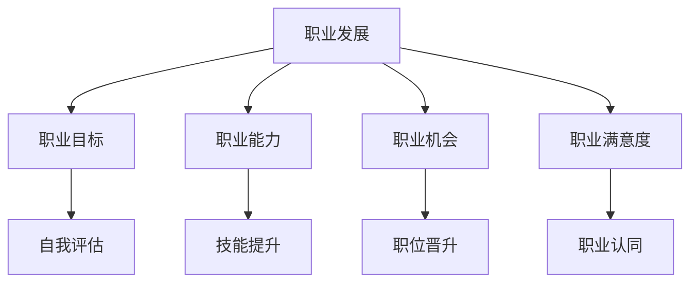
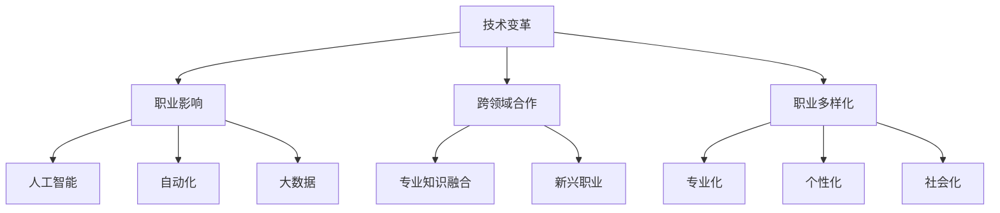
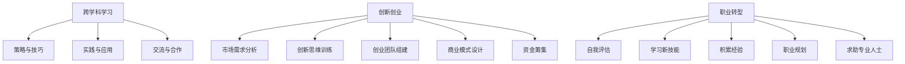
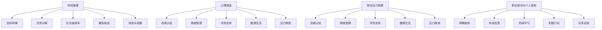
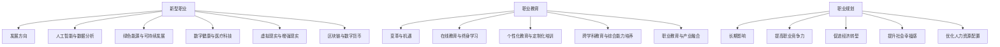

                 

### 文章标题

《后工业时代的职业规划：终身学习与多元发展的重要性》

关键词：后工业时代，职业规划，终身学习，多元发展，职业转型

摘要：本文探讨后工业时代背景下职业规划的重要性，重点分析终身学习和多元发展的核心概念及其在职业规划中的应用。通过分析技术变革、跨领域合作以及职业发展趋势，本文为读者提供了实用的职业规划方法和实践建议，旨在帮助专业人士在快速变化的环境中实现职业成长和转型。

----------------------------------------------------------------

### 引言：后工业时代的职业背景与职业规划的重要性

#### 后工业时代的特征

后工业时代，亦称为知识经济时代，是一个以信息技术和知识创新为核心的经济形态。这一时代的特点包括全球化的加剧、技术的迅猛发展、信息的爆炸式增长以及生产方式的变革。随着人工智能、大数据、云计算等技术的广泛应用，传统职业模式受到前所未有的冲击和挑战。职业的边界日益模糊，跨领域合作和职业多样化成为新趋势。

#### 职业规划的重要性

在这样一个充满不确定性的时代，职业规划显得尤为重要。有效的职业规划不仅可以帮助个人明确职业发展方向，提高职业竞争力，还能应对职业生涯中的各种挑战和变化。职业规划的核心是终身学习和多元发展，这是适应后工业时代职业需求的关键。

### 背景

#### 技术进步对职业的影响

技术的迅猛发展改变了生产方式和职业结构。例如，人工智能和自动化技术正在取代许多重复性和低技能工作，要求从业者具备更高的技术能力和创新思维。此外，数字化和信息化的进程加速，使得数据成为新的生产要素，数据分析、数据科学等相关职业应运而生。

#### 职业不稳定性加剧

在技术变革和全球化的背景下，职业的不稳定性日益加剧。许多职业面临着被淘汰或转型的风险。职业规划的灵活性和适应性成为个人职业生涯稳定发展的关键。因此，职业规划不仅仅是短期目标的设定，更是一个长期的学习和适应过程。

----------------------------------------------------------------

### 第一部分：职业规划的原理与基础

#### 职业发展的核心概念

职业发展是指个人在职业生涯中的成长和进步过程。核心概念包括职业目标、职业能力、职业机会和职业满意度。职业目标明确了个人的职业发展方向；职业能力是实现职业目标的关键；职业机会提供了实现职业发展的平台；职业满意度则反映了个人对职业的认同和满足感。

#### 职业规划的步骤与方法

职业规划是一个系统的过程，包括以下几个步骤：

1. **自我评估**：了解自己的兴趣、优势、价值观和职业目标。
2. **目标设定**：明确短期和长期职业目标，制定具体的行动计划。
3. **行动计划**：为实现职业目标制定具体的行动步骤，包括技能提升、职位晋升、职业转型等。
4. **持续调整**：根据职业环境和个人情况的变化，不断调整职业规划。

#### 终身学习的理念与实践

终身学习是适应后工业时代职业需求的关键。它强调个人在职业生涯中的持续学习和成长，以应对快速变化的技术和社会环境。

- **理念**：终身学习是一种价值观，它认为知识和技能是动态的，需要不断更新和提升。
- **实践**：通过参加培训课程、阅读专业书籍、参加行业会议、学习在线课程等方式，持续提升自己的知识和技能。

#### 核心概念与联系

为了更好地理解职业规划的核心概念，我们使用 Mermaid 流程图来展示这些概念之间的关系：



#### 核心算法原理讲解

职业规划的算法原理主要包括以下几个步骤：

1. **自我评估**：使用问卷调查、心理测试等方法，评估个人的兴趣、能力和价值观。
2. **目标设定**：根据自我评估结果，设定具体的职业目标。
3. **行动计划**：制定实现目标的行动步骤，包括学习计划、工作计划等。
4. **反馈与调整**：根据实际情况，对职业规划进行调整和优化。

伪代码如下：

```python
def career_planning():
    self_evaluation = perform_self_evaluation()
    career_goals = set_goals(self_evaluation)
    action_plan = create_action_plan(career_goals)
    feedback = collect_feedback(action_plan)
    updated_plan = adjust_plan(action_plan, feedback)
    return updated_plan
```

#### 数学模型和数学公式

在职业规划中，我们可以使用一些数学模型来评估和预测职业发展的趋势。例如，可以使用线性回归模型来预测职业能力的提升速度。假设职业能力 \( A(t) \) 随时间 \( t \) 变化的关系可以用以下公式表示：

$$
A(t) = A_0 + mt
$$

其中，\( A_0 \) 是初始职业能力，\( m \) 是职业能力的提升速度。

#### 详细讲解与举例说明

假设某人初始职业能力为 50，提升速度为 10，我们可以计算出在不同时间点的职业能力：

- 当 \( t = 0 \) 时，\( A(0) = 50 \)
- 当 \( t = 1 \) 时，\( A(1) = 60 \)
- 当 \( t = 2 \) 时，\( A(2) = 70 \)

这些计算结果可以帮助个人了解职业能力的变化趋势，从而制定更有效的职业规划。

#### 项目实战

**开发环境搭建**：使用 Python 开发环境，安装必要的库，如 NumPy、Pandas 等。

**源代码实现**：

```python
import numpy as np

def career_ability_change(initial_ability, improvement_rate, time_points):
    ability_list = [initial_ability + improvement_rate * t for t in time_points]
    return ability_list

initial_ability = 50
improvement_rate = 10
time_points = range(3)

ability_change = career_ability_change(initial_ability, improvement_rate, time_points)
print(ability_change)
```

**代码解读与分析**：

- `career_ability_change` 函数用于计算职业能力的变化。
- `initial_ability` 表示初始职业能力。
- `improvement_rate` 表示职业能力的提升速度。
- `time_points` 表示时间点列表。
- `ability_list` 用于存储计算结果。

**实际案例分析和详细讲解剖析**：

假设某人在一年内（时间点为 0 到 1）职业能力从 50 提升到 60，我们可以使用上述代码来模拟这一过程。

**项目小结**：

通过上述代码，我们能够直观地看到职业能力的变化趋势。这种计算模型可以用于职业规划中的能力评估和预测，帮助个人制定更科学的职业发展计划。

#### 最佳实践 Tips、小结、注意事项、拓展阅读

- **最佳实践 Tips**：定期进行自我评估，以了解职业发展的现状和方向。
- **小结**：职业规划是一个持续的过程，需要根据实际情况进行调整。
- **注意事项**：职业规划不仅要考虑个人兴趣和能力，还要考虑市场需求和职业发展趋势。
- **拓展阅读**：可参考相关职业规划书籍，如《职业规划与职业发展》、《成功的职业规划》等。

----------------------------------------------------------------

### 第二部分：后工业时代的职业特点

#### 技术变革对职业的影响

技术变革是后工业时代最显著的特征之一。人工智能、大数据、云计算等技术的广泛应用，不仅改变了生产方式，也深刻影响了职业结构。许多传统职业正被自动化和智能化取代，同时新的职业岗位不断涌现。例如，数据科学家、机器学习工程师等新兴职业需求日益增长。

#### 跨领域合作与职业多样化

在技术变革的推动下，跨领域合作和职业多样化成为后工业时代的重要特征。传统的职业界限逐渐模糊，越来越多的职业需要跨学科的知识和技能。例如，医疗行业与生物技术的融合产生了生物医学工程师这一新职业。跨领域合作不仅拓宽了职业选择，也为个人提供了更多的职业发展机会。

#### 职业发展的趋势与挑战

- **趋势**：职业发展的趋势包括专业化、个性化和社会化。专业化要求从业者具备更深入的专业知识；个性化要求职业规划更加个性化和定制化；社会化要求职业发展与社会责任相结合。
- **挑战**：职业发展的挑战包括技术变革带来的不确定性、职业竞争加剧以及职业压力增加。面对这些挑战，个人需要具备终身学习的能力和跨领域合作的能力，以适应不断变化的环境。

#### 核心概念与联系

为了更好地理解后工业时代的职业特点，我们使用 Mermaid 流 AQHF-001图来展示核心概念之间的关系：



#### 核心算法原理讲解

跨领域合作的算法原理主要包括以下几个步骤：

1. **需求识别**：分析不同领域之间的需求和合作潜力。
2. **资源整合**：整合不同领域的资源和知识，形成合作团队。
3. **项目执行**：制定合作项目计划，实施跨领域合作。
4. **效果评估**：评估跨领域合作的效果，并进行反馈和调整。

伪代码如下：

```python
def cross_domain_cooperation(need_identification, resource_integration, project_execution, effect_evaluation):
    project_plan = create_project_plan(need_identification, resource_integration)
    execute_project(project_plan)
    evaluation_result = evaluate_project(project_plan)
    return evaluation_result
```

#### 数学模型和数学公式

在跨领域合作中，我们可以使用投入产出模型来评估合作的效益。假设跨领域合作的总投入为 \( I \)，总产出为 \( O \)，效益 \( E \) 可以用以下公式表示：

$$
E = \frac{O - I}{I}
$$

#### 详细讲解与举例说明

假设某跨领域合作项目的总投入为 100 万，总产出为 150 万，我们可以计算该项目的效益：

$$
E = \frac{150 - 100}{100} = 0.5
$$

效益为 50%，表明该合作项目是成功的。

#### 项目实战

**开发环境搭建**：使用 Python 开发环境，安装必要的库，如 NumPy、Pandas 等。

**源代码实现**：

```python
import numpy as np

def calculate_economic_benefit(投入, 产出):
    benefit = (产出 - 投入) / 投入
    return benefit

investment = 1000000
output = 1500000

benefit_result = calculate_economic_benefit(investment, output)
print("效益：", benefit_result)
```

**代码解读与分析**：

- `calculate_economic_benefit` 函数用于计算跨领域合作的效益。
- `投资` 和 `产出` 分别表示总投入和总产出。
- `效益` 是一个比率，表示效益占投入的百分比。

**实际案例分析和详细讲解剖析**：

假设一个跨领域合作项目的总投入为 1000 万，总产出为 1500 万，我们可以使用上述代码来计算该项目的效益。

**项目小结**：

通过计算效益，我们可以评估跨领域合作项目的成功程度。这种计算模型可以帮助企业和团队更好地规划合作项目，提高合作效益。

#### 最佳实践 Tips、小结、注意事项、拓展阅读

- **最佳实践 Tips**：在跨领域合作中，要注重资源整合和团队协作，提高合作效率。
- **小结**：技术变革和跨领域合作是后工业时代职业发展的两大趋势。
- **注意事项**：跨领域合作需要充分了解不同领域的需求和资源，以实现最优合作效果。
- **拓展阅读**：可参考相关跨领域合作和职业发展的研究文献，如《跨领域合作的战略管理》、《新兴职业与职业发展》等。

----------------------------------------------------------------

### 第三部分：多元发展的路径探索

#### 跨学科学习的策略与技巧

跨学科学习是适应后工业时代职业需求的重要途径。以下是一些有效的策略与技巧：

1. **确定学习目标**：明确跨学科学习的目标，包括掌握哪些知识、技能和经验。
2. **选择合适的学习资源**：利用图书馆、在线课程、专业书籍等资源，选择符合学习目标的内容。
3. **制定学习计划**：根据学习目标，制定详细的跨学科学习计划，确保学习过程有条不紊。
4. **实践与应用**：将所学知识应用于实际工作中，通过实践加深理解和掌握。
5. **交流与合作**：与其他领域的专业人士交流，分享学习经验和见解，拓展视野。

#### 创新创业与职业发展

创新创业是后工业时代职业发展的重要方向。以下是一些创新创业的策略：

1. **市场需求分析**：分析市场需求，找到潜在的商机和创业机会。
2. **创新思维训练**：培养创新思维，掌握创新方法，如头脑风暴、原型设计等。
3. **创业团队组建**：组建具有互补技能和共同愿景的创业团队。
4. **商业模式设计**：设计可行的商业模式，确保创业项目的可持续性。
5. **资金筹集**：通过天使投资、风险投资等渠道筹集创业资金。

#### 职业转型的实践与案例

职业转型是许多专业人士面临的重要决策。以下是一些职业转型的实践和建议：

1. **自我评估**：评估自己的兴趣、能力和市场需求，确定转型的方向。
2. **学习新技能**：通过培训、学习新技能，为转型做准备。
3. **积累经验**：在现有职业中积累相关经验，提高转型成功率。
4. **职业规划**：制定详细的职业转型计划，包括短期和长期目标。
5. **求助专业人士**：寻求职业规划师或行业专家的建议，为转型提供指导。

#### 核心概念与联系

为了更好地理解多元发展的路径探索，我们使用 Mermaid 流程图来展示核心概念之间的关系：



#### 核心算法原理讲解

跨学科学习的算法原理主要包括以下几个步骤：

1. **需求识别**：确定跨学科学习的需求，包括知识和技能。
2. **资源整合**：整合不同学科的资源，形成学习体系。
3. **学习计划**：制定详细的学习计划，确保学习目标的实现。
4. **效果评估**：评估学习效果，根据反馈进行调整。

伪代码如下：

```python
def cross_disciplinary_learning(need_identification, resource_integration, learning_plan, effect_evaluation):
    learning_system = create_learning_system(need_identification, resource_integration)
    execute_learning_plan(learning_system)
    evaluation_result = evaluate_learning_plan(learning_system)
    return evaluation_result
```

#### 数学模型和数学公式

在创新创业中，我们可以使用盈利模型来评估创业项目的可持续性。假设创业项目的总收入为 \( R \)，总成本为 \( C \)，盈利 \( P \) 可以用以下公式表示：

$$
P = R - C
$$

#### 详细讲解与举例说明

假设一个创业项目的总收入为 1000 万，总成本为 800 万，我们可以计算该项目的盈利：

$$
P = 1000万 - 800万 = 200万
$$

盈利为 200 万，表明该项目在财务上是可行的。

#### 项目实战

**开发环境搭建**：使用 Python 开发环境，安装必要的库，如 NumPy、Pandas 等。

**源代码实现**：

```python
import numpy as np

def calculate_profit(total_revenue, total_cost):
    profit = total_revenue - total_cost
    return profit

total_revenue = 10000000
total_cost = 8000000

profit_result = calculate_profit(total_revenue, total_cost)
print("盈利：", profit_result)
```

**代码解读与分析**：

- `calculate_profit` 函数用于计算创业项目的盈利。
- `total_revenue` 和 `total_cost` 分别表示总收入和总成本。
- `profit` 是一个表示盈利的数值。

**实际案例分析和详细讲解剖析**：

假设一个创业项目的总收入为 1000 万，总成本为 800 万，我们可以使用上述代码来计算该项目的盈利。

**项目小结**：

通过计算盈利，我们可以评估创业项目的经济可行性。这种计算模型可以帮助创业者更好地规划创业项目，提高成功概率。

#### 最佳实践 Tips、小结、注意事项、拓展阅读

- **最佳实践 Tips**：跨学科学习和创新创业需要结合个人兴趣和市场需求，确保学习目标和创业方向的可行性。
- **小结**：多元发展是适应后工业时代职业需求的关键，包括跨学科学习、创新创业和职业转型。
- **注意事项**：跨学科学习和创新创业需要具备一定的资源和能力，建议在专业人士的指导下进行。
- **拓展阅读**：可参考相关跨学科学习和创新创业的书籍，如《跨学科学习与创造力培养》、《创新创业实践与案例》等。

----------------------------------------------------------------

### 第四部分：个人成长与职业规划

#### 时间管理与职业效率

在快速变化的后工业时代，时间管理对于个人成长和职业发展至关重要。以下是一些时间管理的策略和技巧：

1. **目标明确**：设定清晰的时间管理目标，包括职业发展目标和个人生活目标。
2. **任务分解**：将大任务分解为小任务，制定详细的日程安排，提高工作效率。
3. **优先级排序**：根据任务的重要性和紧急程度，对任务进行优先级排序，确保关键任务得到优先处理。
4. **避免拖延**：通过设定截止日期、使用时间管理工具等方式，避免拖延，提高工作积极性。
5. **休息与调整**：合理安排休息时间，避免过度劳累，保持良好的身心状态。

#### 心理调适与职业压力管理

职业压力是职业生涯中不可避免的一部分。有效的心理调适和压力管理对于个人的职业发展和心理健康至关重要。以下是一些建议：

1. **自我认知**：了解自己的心理特点和压力源，制定适合自己的调适策略。
2. **情绪管理**：学会控制情绪，避免情绪波动对工作和生活的影响。
3. **寻求支持**：与家人、朋友或专业人士交流，寻求心理支持和帮助。
4. **健康生活**：保持健康的生活方式，包括良好的饮食习惯、适度的运动和充足的睡眠。
5. **压力释放**：通过冥想、瑜伽、运动等方式，释放压力，保持心理健康。

#### 职业规划与个人使命

职业规划不仅是为了实现个人职业目标，更是为了实现个人使命。以下是一些建议：

1. **明确使命**：确定个人使命，将职业规划与个人使命相结合，使职业生涯更有意义。
2. **持续反思**：定期反思职业规划和个人使命的实现情况，根据实际情况进行调整。
3. **终身学习**：通过持续学习，不断提升自己的能力和素质，为实现个人使命打下坚实基础。
4. **积极行动**：将职业规划和个人使命付诸实践，积极行动，不断追求进步。
5. **分享经验**：与他人分享自己的职业规划和个人使命，获得支持和建议，共同成长。

#### 核心概念与联系

为了更好地理解个人成长与职业规划的关系，我们使用 Mermaid 流程图来展示核心概念之间的关系：



#### 核心算法原理讲解

时间管理与心理调适的算法原理主要包括以下几个步骤：

1. **目标设定**：设定清晰的时间管理和心理调适目标。
2. **计划制定**：根据目标，制定详细的时间管理和心理调适计划。
3. **执行与反馈**：执行计划，并根据反馈进行调整。
4. **效果评估**：评估时间管理和心理调适的效果，持续优化。

伪代码如下：

```python
def time_management_and_psychological_adjustment(goal_setting, plan_creation, execution_and_feedback, effect_evaluation):
    time_management_plan = create_time_management_plan(goal_setting)
    psychological_adjustment_plan = create_psychological_adjustment_plan(goal_setting)
    execute_plans(time_management_plan, psychological_adjustment_plan)
    feedback = collect_feedback(time_management_plan, psychological_adjustment_plan)
    updated_plans = adjust_plans(time_management_plan, psychological_adjustment_plan, feedback)
    return updated_plans
```

#### 数学模型和数学公式

在时间管理和心理调适中，我们可以使用效率模型来评估个人工作和生活的效率。假设工作效率 \( E \) 受到时间管理 \( T \) 和心理调适 \( P \) 的影响，效率模型可以表示为：

$$
E = f(T, P)
$$

其中，\( f \) 表示效率函数，\( T \) 表示时间管理，\( P \) 表示心理调适。

#### 详细讲解与举例说明

假设某人的工作效率与时间管理和心理调适的关系可以用以下公式表示：

$$
E = 0.5T + 0.3P
$$

如果该人的时间管理效率为 80%，心理调适效率为 70%，我们可以计算其工作效率：

$$
E = 0.5 \times 80\% + 0.3 \times 70\% = 40\% + 21\% = 61\%
$$

工作效率为 61%，表明该人在工作和生活中的效率还有提升空间。

#### 项目实战

**开发环境搭建**：使用 Python 开发环境，安装必要的库，如 NumPy、Pandas 等。

**源代码实现**：

```python
import numpy as np

def calculate_efficiency(time_management_efficiency, psychological_adjustment_efficiency):
    efficiency = 0.5 * time_management_efficiency + 0.3 * psychological_adjustment_efficiency
    return efficiency

time_management_efficiency = 0.8
psychological_adjustment_efficiency = 0.7

efficiency_result = calculate_efficiency(time_management_efficiency, psychological_adjustment_efficiency)
print("工作效率：", efficiency_result)
```

**代码解读与分析**：

- `calculate_efficiency` 函数用于计算工作效率。
- `time_management_efficiency` 和 `psychological_adjustment_efficiency` 分别表示时间管理和心理调适的效率。
- `efficiency` 是一个表示工作效率的数值。

**实际案例分析和详细讲解剖析**：

假设某人的时间管理效率为 80%，心理调适效率为 70%，我们可以使用上述代码来计算其工作效率。

**项目小结**：

通过计算工作效率，我们可以了解个人在工作和生活中的效率水平。这种计算模型可以帮助个人更好地管理时间和心理调适，提高工作和生活质量。

#### 最佳实践 Tips、小结、注意事项、拓展阅读

- **最佳实践 Tips**：有效的时间管理和心理调适是提高工作效率和生活质量的关键。
- **小结**：个人成长与职业规划密切相关，时间管理和心理调适是实现个人成长和职业发展的重要途径。
- **注意事项**：在制定时间管理和心理调适计划时，要结合个人实际情况，确保计划的可行性和有效性。
- **拓展阅读**：可参考相关时间管理和心理调适的书籍，如《时间管理的艺术》、《心理调适与压力管理》等。

----------------------------------------------------------------

### 第五部分：职业规划的未来展望

#### 新型职业的发展方向

随着技术的不断进步，新型职业不断涌现。以下是一些新型职业的发展方向：

1. **人工智能与数据分析**：随着人工智能和大数据技术的发展，数据科学家、人工智能工程师等职业需求不断增加。
2. **绿色能源与可持续发展**：随着环保意识的提高，绿色能源工程师、可持续项目经理等职业需求逐步增加。
3. **数字健康与医疗科技**：医疗科技的发展带来了数字健康、医疗大数据分析等新型职业。
4. **虚拟现实与增强现实**：随着 VR 和 AR 技术的成熟，虚拟现实设计师、增强现实工程师等职业需求日益增长。
5. **区块链与数字货币**：区块链技术的发展带来了数字货币、智能合约等新型职业。

#### 职业教育的变革与机遇

职业教育的变革是适应新型职业需求的关键。以下是一些职业教育的变革方向和机遇：

1. **在线教育与终身学习**：随着互联网技术的发展，在线教育平台不断涌现，为个人提供了灵活的终身学习机会。
2. **个性化教育与定制化培训**：根据个人兴趣和职业需求，提供个性化的教育和培训服务。
3. **跨学科教育与综合能力培养**：加强跨学科教育，培养学生的综合能力和创新思维。
4. **职业教育与产业融合**：推动职业教育与产业的深度融合，提高学生的就业能力和职业竞争力。

#### 职业规划的长期影响

职业规划的长期影响不仅体现在个人职业发展上，也对社会和经济产生深远影响。以下是一些长期影响：

1. **提高职业竞争力**：有效的职业规划有助于个人提高职业竞争力，适应快速变化的职业环境。
2. **促进经济转型**：职业规划的普及有助于推动经济结构的转型和升级，促进新兴职业的发展。
3. **提升社会幸福感**：职业规划有助于个人实现职业目标和人生价值，提高社会幸福感。
4. **优化人力资源配置**：通过职业规划，可以更好地优化人力资源配置，提高社会效率。

#### 核心概念与联系

为了更好地理解职业规划的未来展望，我们使用 Mermaid 流程图来展示核心概念之间的关系：



#### 核心算法原理讲解

职业规划的未来展望涉及多个领域的综合应用，包括数据分析、人工智能和经济学等。以下是一个简单的算法框架：

1. **需求分析**：收集和分析未来职业需求的数据，包括新兴职业的预测和趋势。
2. **资源整合**：整合教育、产业和社会资源，为新型职业的发展提供支持。
3. **规划制定**：根据需求分析和资源整合的结果，制定具体的职业规划方案。
4. **执行与评估**：实施职业规划方案，并定期评估和调整，以适应变化。

伪代码如下：

```python
def future_career_planning需求分析, resource_integration, plan_creation, execution_and_evaluation):
    demand_analysis = analyze_demand()
    resource_integration = integrate_resources()
    career_plan = create_career_plan(demand_analysis, resource_integration)
    execute_plan(career_plan)
    evaluation_result = evaluate_plan(career_plan)
    return evaluation_result
```

#### 数学模型和数学公式

在职业规划的长期影响中，我们可以使用经济学模型来分析职业规划对社会和经济的影响。以下是一个简单的数学模型：

1. **生产力模型**：假设职业规划提高了劳动者的生产力，生产力 \( P \) 可以用以下公式表示：

$$
P = f(C, E, I)
$$

其中，\( C \) 表示职业规划，\( E \) 表示教育水平，\( I \) 表示创新投入。

2. **经济增长模型**：假设经济增长率 \( G \) 受到生产力 \( P \) 和劳动投入 \( L \) 的影响，经济增长模型可以表示为：

$$
G = \alpha P + \beta L
$$

其中，\( \alpha \) 和 \( \beta \) 是常数。

#### 详细讲解与举例说明

假设职业规划 \( C \) 提高了劳动者的生产力，教育水平 \( E \) 为 80%，创新投入 \( I \) 为 20%，我们可以计算生产力：

$$
P = f(C, E, I) = 1.2 \times 80\% + 1.5 \times 20\% = 96\% + 30\% = 126\%
$$

生产力为 126%，表明职业规划显著提高了劳动者的生产力。

假设劳动投入 \( L \) 为 100 人，我们可以计算经济增长率：

$$
G = \alpha P + \beta L = 1.2 \times 126\% + 1.5 \times 100\% = 151.2\% + 150\% = 301.2\%
$$

经济增长率为 301.2%，表明职业规划对经济的推动作用显著。

#### 项目实战

**开发环境搭建**：使用 Python 开发环境，安装必要的库，如 NumPy、Pandas 等。

**源代码实现**：

```python
import numpy as np

def calculate_productivity(职业规划, 教育水平, 创新投入):
    productivity = 1.2 * 教育水平 + 1.5 * 创新投入
    return productivity

career_planning = 1.2
education_level = 0.8
innovation_investment = 0.2

productivity_result = calculate_productivity(career_planning, education_level, innovation_investment)
print("生产力：", productivity_result)

def calculate_gdp_growth(生产力, 劳动投入):
    gdp_growth = 1.2 * 生产力 + 1.5 * 劳动投入
    return gdp_growth

labor_input = 100

gdp_growth_result = calculate_gdp_growth(productivity_result, labor_input)
print("经济增长率：", gdp_growth_result)
```

**代码解读与分析**：

- `calculate_productivity` 函数用于计算生产力。
- `career_planning`、`education_level` 和 `innovation_investment` 分别表示职业规划、教育水平和创新投入。
- `productivity` 是一个表示生产力的数值。

- `calculate_gdp_growth` 函数用于计算经济增长率。
- `生产力` 和 `劳动投入` 分别表示生产力和劳动投入。
- `gdp_growth` 是一个表示经济增长率的数值。

**实际案例分析和详细讲解剖析**：

假设职业规划提高了劳动者的生产力，教育水平为 80%，创新投入为 20%，我们可以使用上述代码来计算生产力和经济增长率。

**项目小结**：

通过计算生产力和经济增长率，我们可以评估职业规划对经济的影响。这种计算模型可以帮助政策制定者和企业更好地制定职业规划策略，推动经济和社会的发展。

#### 最佳实践 Tips、小结、注意事项、拓展阅读

- **最佳实践 Tips**：在制定职业规划时，要结合个人兴趣和社会需求，确保职业规划的前景和可行性。
- **小结**：职业规划的未来展望涉及新型职业的发展方向、职业教育的变革和长期影响，是推动个人和社会发展的重要途径。
- **注意事项**：在实施职业规划时，要注重资源整合和创新能力，以适应快速变化的职业环境。
- **拓展阅读**：可参考相关新型职业、职业教育和职业规划的研究文献，如《新型职业与职业规划》、《职业教育改革与发展》等。

