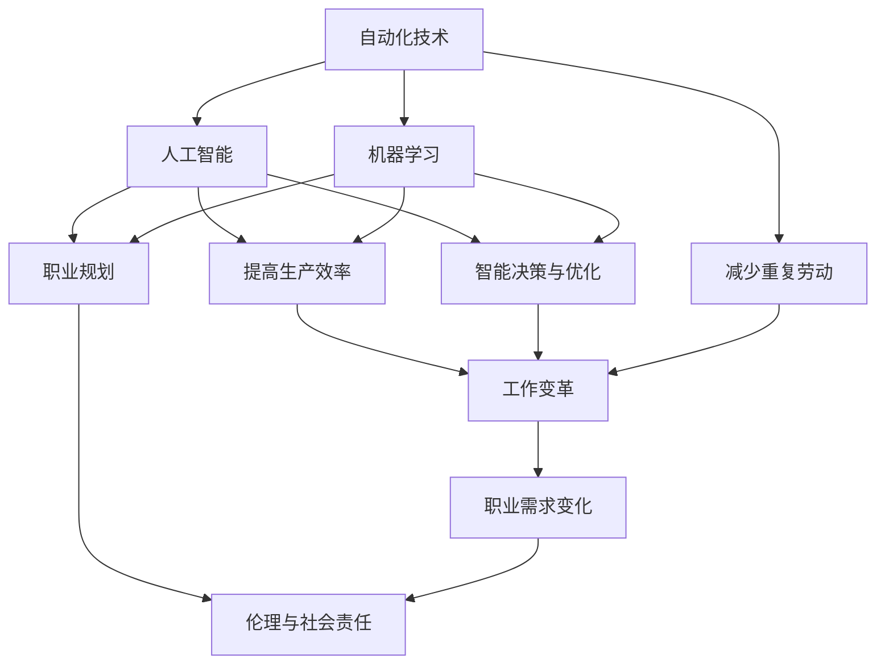

                 

### 文章标题：后工作时代生存手册：自动化世界中的人生规划

#### 关键词：
- 自动化
- 工作转型
- 技术技能
- 职业规划
- 伦理与责任

#### 摘要：
随着自动化技术的飞速发展，传统的工作模式正经历深刻的变革。本书旨在为读者提供一份实用的生存手册，帮助他们在后工作时代找到自己的位置，实现人生规划。通过深入探讨自动化技术的核心概念、影响及应对策略，本书将为读者揭示自动化时代的工作、生活方式和持续学习的路径，助力他们从容应对未来的挑战。

----------------------------------------------------------------

### 前言：后工作时代的概念引出

在21世纪，科技的发展正在以前所未有的速度重塑着我们的世界。人工智能、机器人技术、自动化系统等先进技术的应用，正在颠覆传统的生产方式，改变着社会的运行机制。这一现象，我们称之为“后工作时代”。

#### 自动化的崛起

自动化技术并非新生事物，但它在过去几十年中经历了飞速的发展。计算机科学、机器学习、大数据分析等领域的突破，为自动化技术的实现提供了强大的技术支持。如今，自动化技术已经广泛应用于制造业、服务业、医疗、金融等各个行业，大大提高了生产效率和经济效益。

#### 自动化对工作的冲击

自动化的崛起给传统工作带来了巨大的冲击。一方面，自动化技术能够替代大量的重复性、低技能劳动，从而减少了对这些工作岗位的需求。另一方面，自动化技术也创造了许多新的工作岗位，但这些岗位往往要求具备更高的技术能力和专业素养。

#### 应对策略

面对自动化带来的冲击，我们需要采取一系列应对策略。首先，个人需要不断学习新技能，提升自身竞争力。其次，企业和组织需要调整人力资源策略，培养适应自动化时代的员工。此外，政府和社会也需要积极参与，制定相应的政策和措施，为自动化时代的到来做好准备。

#### 书籍目的

本书旨在为读者提供一份全面、实用的生存手册，帮助他们更好地理解自动化技术及其对工作、生活的影响，并提供有效的应对策略。通过本书的阅读，读者将能够：

1. **理解自动化技术的基本原理和应用场景**。
2. **规划个人职业发展路径，适应自动化时代的需求**。
3. **提升个人技术技能和软技能，增强竞争力**。
4. **关注自动化伦理与社会责任问题，做出明智的选择**。

本书将分为四个主要部分，分别从技术、职业规划、生活方式和未来展望四个角度，深入探讨自动化时代的人生规划。

----------------------------------------------------------------

### 核心概念与联系

在探讨自动化技术对工作的影响之前，我们需要首先明确几个核心概念，并了解它们之间的相互关系。以下是几个关键概念及其联系的Mermaid流程图。

#### 关键概念

1. **自动化技术**：指利用计算机、机器人等技术手段，实现生产、管理、服务等过程的自动化。
2. **人工智能**：指通过计算机模拟人类的智能行为，实现智能决策、问题求解等能力。
3. **机器学习**：指利用大数据和算法，使计算机自动从数据中学习并改进性能的过程。
4. **职业规划**：指个人根据自己的兴趣、能力和市场需求，制定职业发展的目标和路径。
5. **伦理与社会责任**：指在技术发展和应用过程中，关注技术对人类社会的影响，并承担相应的社会责任。

#### Mermaid流程图



#### 概念联系分析

1. **自动化技术**与**人工智能**和**机器学习**密切相关。人工智能和机器学习为自动化技术提供了强大的技术支持，使自动化系统能够更智能、更高效地完成任务。
2. **职业规划**受到**自动化技术**、**人工智能**和**机器学习**的深刻影响。自动化技术的应用改变了传统的职业结构，职业需求发生了变化，个人需要根据这些变化调整职业规划。
3. **伦理与社会责任**是**自动化技术**和**人工智能**发展中不可忽视的问题。技术发展不能脱离伦理和社会责任，需要在技术设计和应用中充分考虑其对人类和社会的影响。

通过这个流程图，我们可以清晰地看到自动化技术、人工智能、机器学习、职业规划、伦理与社会责任之间的相互联系，为后续内容的展开提供了基础。

----------------------------------------------------------------

### 第一部分：自动化技术的基础与影响

#### 第1章：自动化技术的发展与影响

#### 1.1 自动化技术的基本原理

自动化技术，顾名思义，是指通过机械、电子、计算机等技术，使生产、管理、服务等过程实现自动化。其核心在于利用传感器、控制器、执行器等设备，使系统能够根据预设的程序或实时数据，自主完成特定任务。

##### 1.1.1 基本原理概述

自动化技术的实现依赖于以下几个基本原理：

1. **传感器技术**：传感器是自动化系统的“眼睛”和“耳朵”，能够感知环境变化，并将物理信号转换为电信号。
2. **控制器技术**：控制器是自动化系统的“大脑”，负责接收传感器输入的信号，根据预设的程序或算法进行处理，生成控制信号。
3. **执行器技术**：执行器是自动化系统的“手脚”，根据控制器的信号执行具体的动作。

##### 1.1.2 自动化技术的应用

自动化技术在不同行业有着广泛的应用，以下是几个典型案例：

1. **制造业**：自动化生产线在制造业中得到了广泛应用，如汽车制造、电子装配等。通过自动化技术，大大提高了生产效率和产品质量，降低了人力成本。
2. **服务业**：在服务业中，自动化技术主要用于客户服务、订单处理等。例如，自动售票系统、自动点餐系统等，提高了服务效率，改善了用户体验。
3. **医疗行业**：在医疗行业中，自动化技术主要用于手术机器人、医疗影像分析等。手术机器人可以实现高精度的手术操作，医疗影像分析可以辅助医生诊断疾病，提高诊断的准确性和效率。
4. **农业**：在农业中，自动化技术主要用于农田管理、农作物种植等。例如，自动喷灌系统、无人机植保等，提高了农业生产效率，降低了劳动成本。

#### 1.2 自动化技术在各行业的应用案例

1. **制造业**：自动化生产线是制造业的核心技术之一。通过使用机器人、传感器和计算机控制系统，可以实现对生产过程的实时监控和自动调整。例如，丰田汽车公司的生产线上，自动化技术被广泛应用于车身焊接、涂装、装配等环节，大大提高了生产效率和质量。
2. **服务业**：在服务业中，自动化技术主要用于提升客户服务体验。例如，酒店行业的自助入住系统、自动送餐机器人等，不仅提高了服务效率，还降低了人力成本。此外，物流行业也广泛应用自动化技术，如自动分拣系统、无人仓库等，提高了物流效率，降低了运营成本。
3. **医疗行业**：医疗行业的自动化技术主要体现在手术机器人、医疗影像分析和智能诊断等领域。例如，达芬奇手术机器人可以实现高精度的微创手术，提高手术成功率和安全性。同时，人工智能技术在医疗影像分析中的应用，可以辅助医生快速、准确地诊断疾病，提高诊断的准确性。
4. **农业**：农业自动化技术的应用主要包括农田管理、农作物种植和收获等环节。例如，自动喷灌系统可以根据土壤湿度自动控制灌溉，提高水资源利用效率。无人机植保可以实现对农田的实时监测和精确施药，提高农药利用率和农作物产量。

#### 1.3 自动化对职业和社会的影响

1. **对职业的影响**：

   自动化技术的应用对职业市场产生了深远的影响，具体表现在以下几个方面：

   - **职业需求变化**：自动化技术替代了大量重复性、低技能的工作，对劳动力的需求减少。同时，自动化技术的应用也创造了许多新的职业机会，如自动化工程师、机器人操作员、智能系统维护员等。
   - **技能需求升级**：随着自动化技术的发展，对劳动者的技术能力和专业素养要求越来越高。传统的劳动技能已经无法满足自动化时代的需求，劳动者需要不断学习新技能，以适应职业发展的变化。
   - **就业结构变化**：自动化技术的普及导致就业结构发生变化，一些传统行业的工作岗位减少，而新兴行业的工作岗位增多。这要求劳动者具备跨行业的适应能力和学习能力，以应对就业市场的变化。

2. **对社会的影响**：

   自动化技术的应用不仅改变了职业市场，还对社会产生了深远的影响，具体表现在以下几个方面：

   - **生产效率提高**：自动化技术能够提高生产效率，降低生产成本，从而推动经济增长。同时，自动化技术的应用也使得企业能够更好地应对市场需求的变化，提高市场竞争力。
   - **生活质量改善**：自动化技术的应用使得许多日常生活变得更加便捷，提高了人们的生活质量。例如，智能家居系统、智能交通系统等，不仅提高了生活便利性，还改善了人们的生活环境。
   - **社会结构变化**：自动化技术的普及改变了传统的生产方式和社会结构，对社会关系和价值观产生了影响。例如，自动化技术的应用可能导致人与人之间的直接互动减少，加剧了社会分化和矛盾。此外，自动化技术的普及也可能导致贫富差距的加大，需要社会各方共同努力解决。

#### 结论

自动化技术的应用对职业和社会产生了深远的影响。劳动者需要不断学习新技能，适应自动化时代的需求，以应对职业市场的变化。同时，政府和社会也需要积极参与，制定相应的政策和措施，为自动化时代的到来做好准备。只有这样，才能在自动化时代实现可持续发展和和谐社会的建设。

----------------------------------------------------------------

#### 第2章：自动化时代的职业规划

#### 2.1 职业需求变化与技能转型

随着自动化技术的不断发展和普及，职业市场的需求也在发生显著变化。传统的职业岗位正逐渐被自动化技术所取代，而新的职业岗位也在不断涌现。这种变化对劳动者的技能要求提出了新的挑战，促使人们进行技能转型，以适应自动化时代的需求。

##### 2.1.1 传统职业岗位的变化

1. **重复性、低技能劳动减少**：自动化技术能够高效地完成重复性、低技能的工作，如制造业中的流水线作业、服务业中的简单客户服务等。这些工作将逐渐被机器人、自动售货机等自动化设备所取代，导致相关职业岗位的需求减少。

2. **高技能、专业性岗位增加**：自动化技术的发展需要大量的高技能人才，如自动化工程师、机器人编程师、人工智能算法工程师等。这些岗位需要劳动者具备深厚的专业知识和技能，能够设计和维护复杂的自动化系统。

##### 2.1.2 新兴职业岗位的涌现

1. **数据分析师**：随着大数据技术的发展，数据分析师成为了一个热门职业。数据分析师负责收集、处理和分析大量数据，为企业提供决策支持。这一职业对劳动者的数据分析能力和逻辑思维能力要求较高。

2. **人工智能工程师**：人工智能工程师是自动化时代的新兴职业。他们负责设计和开发人工智能系统，使机器能够模拟人类思维和行为。这一职业需要劳动者具备扎实的计算机科学和数学基础，以及良好的编程能力。

3. **自动化系统集成师**：自动化系统集成师负责将各种自动化设备、系统和软件集成到一个统一的平台上，实现自动化生产和管理。这一职业需要劳动者具备丰富的自动化技术知识和系统集成经验。

##### 2.1.3 技能转型策略

1. **提升技术技能**：劳动者需要不断学习新技术，提升自己的技术技能。例如，学习编程语言、掌握自动化工具和设备的使用方法、了解人工智能和大数据分析的基本原理等。

2. **拓展专业领域**：劳动者可以根据自己的兴趣和市场需求，选择一个专业领域进行深入学习和研究。例如，可以选择专注于制造业自动化、服务业智能化、医疗机器人等领域。

3. **培养创新思维**：创新思维是自动化时代劳动者必备的素质。劳动者需要培养解决问题的能力，善于从不同角度思考问题，提出新的解决方案。

4. **增强跨领域能力**：自动化时代的工作往往涉及多个领域的技术和知识。劳动者需要具备跨领域的能力，能够理解和应用不同领域的知识和技能，以应对复杂的职业需求。

#### 2.2 职业规划策略与方法

在自动化时代，进行有效的职业规划至关重要。以下是一些职业规划策略和方法，帮助劳动者在自动化时代找到自己的职业定位。

##### 2.2.1 自我评估

1. **兴趣与特长**：了解自己的兴趣和特长，找到与之匹配的职业方向。例如，对技术感兴趣可以选择从事自动化工程师、人工智能工程师等职业。

2. **价值观与目标**：明确自己的价值观和职业目标，为自己的职业规划提供方向。例如，追求高薪可以选择金融行业，追求技术创新可以选择科技企业。

##### 2.2.2 市场需求分析

1. **行业前景**：分析各个行业的发展趋势，选择具有良好发展前景的行业。例如，人工智能、大数据、云计算等领域正处于快速发展阶段，就业机会较多。

2. **职业需求**：了解各个职业的市场需求，选择需求量大的职业。例如，数据分析师、人工智能工程师等职业在自动化时代具有很高的需求。

##### 2.2.3 学习与成长

1. **持续学习**：自动化时代要求劳动者具备持续学习的能力，以适应不断变化的职业需求。可以通过在线课程、培训班、自学等方式，不断更新自己的知识体系。

2. **实践经验**：积累实践经验是提升职业能力的重要途径。可以通过实习、项目经验、参与比赛等方式，提升自己的实际操作能力。

3. **职业网络**：建立良好的职业网络，可以为自己的职业发展提供支持和机会。可以通过参加行业会议、加入专业组织、与同行交流等方式，拓展职业网络。

#### 2.3 自动化时代的就业机会与挑战

在自动化时代，劳动者面临着前所未有的就业机会和挑战。

##### 2.3.1 就业机会

1. **技术岗位**：自动化技术需要大量的技术人才，如自动化工程师、机器人编程师、人工智能工程师等。这些岗位提供了丰富的就业机会。

2. **新兴行业**：自动化技术的发展催生了众多新兴行业，如智能家居、智能交通、医疗机器人等。这些行业的发展为劳动者提供了广阔的职业空间。

3. **跨国企业**：随着全球化的推进，跨国企业在自动化领域的投资不断增长，为劳动者提供了更多的就业机会。

##### 2.3.2 挑战

1. **技能要求高**：自动化时代对劳动者的技能要求更高，需要具备跨领域的知识和能力，这对劳动者的学习和成长提出了更高的要求。

2. **竞争激烈**：自动化技术的发展使得求职者的数量增加，竞争更加激烈。劳动者需要不断提升自己的竞争力，以在激烈的竞争中脱颖而出。

3. **职业稳定性**：自动化技术的普及可能导致某些职业的消失，劳动者需要适应职业的变化，以保持职业的稳定性。

#### 结论

自动化时代为劳动者带来了丰富的就业机会和挑战。劳动者需要具备持续学习的能力，提升自己的技术技能和专业素养，以适应职业需求的变化。同时，劳动者也需要关注自动化技术对职业的影响，进行有效的职业规划，以在自动化时代找到自己的职业定位。

----------------------------------------------------------------

### 第二部分：个人技能提升与适应自动化

#### 第3章：技术技能的升级与拓展

在自动化时代，技术技能的升级与拓展显得尤为重要。随着自动化技术的发展，劳动者的技术技能也在不断演变。本章将探讨如何提升技术技能，特别是计算机编程与数据分析技能，以及如何掌握人工智能与机器学习基础，为读者提供一套系统化的技能提升方案。

##### 3.1 计算机编程与数据分析技能

计算机编程是自动化时代不可或缺的技能。掌握编程语言和算法是提升计算机编程技能的关键。以下是几种常用的编程语言和算法，以及它们在自动化中的应用。

###### 3.1.1 常用编程语言

1. **Python**：Python 是一种高级编程语言，广泛应用于自动化控制和数据分析。其简洁的语法和丰富的库函数使其成为初学者和专业人士的首选。Python 在自动化中的应用包括自动化测试、爬虫和数据采集等。

   ```python
   # Python 示例：自动化测试
   def test_addition():
       assert 1 + 1 == 2
       assert 2 + 2 == 4
   ```

2. **C/C++**：C和C++是底层编程语言，广泛应用于操作系统、嵌入式系统和高性能计算。它们提供了对硬件的精细控制，是开发自动化控制系统和工业应用的重要工具。

   ```c
   // C 示例：计算圆周率
   double calculate_pi(int iterations) {
       double result = 0.0;
       for (int i = 0; i < iterations; i++) {
           result += pow(-1, i) / (2 * i + 1);
       }
       return result * 4;
   }
   ```

3. **Java**：Java 是一种跨平台的编程语言，广泛应用于企业级应用和移动开发。其强大的平台无关性和丰富的库函数使其在自动化系统中有着广泛的应用，如嵌入式系统开发、企业级应用等。

   ```java
   // Java 示例：简单Java程序
   public class HelloWorld {
       public static void main(String[] args) {
           System.out.println("Hello, World!");
       }
   }
   ```

###### 3.1.2 数据分析算法

1. **线性回归**：线性回归是一种用于分析两个或多个变量之间线性关系的算法。它广泛应用于数据分析、预测建模等领域。

   ```python
   # Python 示例：线性回归
   from sklearn.linear_model import LinearRegression

   X = [[1], [2], [3], [4]]
   y = [2, 4, 5, 4]

   model = LinearRegression()
   model.fit(X, y)

   print(model.predict([[5]]))
   ```

2. **决策树**：决策树是一种用于分类和回归的算法。它通过一系列规则来划分数据，并在每个节点选择最优划分标准。

   ```python
   # Python 示例：决策树分类
   from sklearn.tree import DecisionTreeClassifier

   X = [[0, 0], [1, 1], [1, 0], [0, 1]]
   y = [0, 1, 1, 0]

   model = DecisionTreeClassifier()
   model.fit(X, y)

   print(model.predict([[1, 0]]))
   ```

##### 3.2 人工智能与机器学习基础

人工智能（AI）和机器学习（ML）是自动化时代的重要技术。掌握人工智能和机器学习的基础知识，有助于劳动者在自动化领域中发挥更大的作用。以下是人工智能和机器学习的一些基础概念和算法。

###### 3.2.1 人工智能基础

1. **机器学习**：机器学习是一种通过数据训练模型，使其能够自主学习和改进性能的技术。常见的机器学习算法包括监督学习、无监督学习和强化学习。

2. **神经网络**：神经网络是一种模仿生物神经系统的计算模型。它通过多层神经元结构，实现复杂的非线性变换。

3. **深度学习**：深度学习是一种基于神经网络的机器学习技术。它通过多层神经网络结构，实现复杂的数据分析和模式识别。

###### 3.2.2 常见机器学习算法

1. **支持向量机（SVM）**：支持向量机是一种用于分类和回归的算法。它通过找到一个最优的超平面，将不同类别的数据分开。

   ```python
   # Python 示例：SVM分类
   from sklearn.svm import SVC

   X = [[0, 0], [1, 1], [1, 0], [0, 1]]
   y = [0, 1, 1, 0]

   model = SVC()
   model.fit(X, y)

   print(model.predict([[1, 0]]))
   ```

2. **K-最近邻（KNN）**：K-最近邻是一种简单的分类算法。它通过计算新数据点与训练数据点之间的距离，选择最近的k个邻居，并根据邻居的分类结果进行预测。

   ```python
   # Python 示例：KNN分类
   from sklearn.neighbors import KNeighborsClassifier

   X = [[0, 0], [1, 1], [1, 0], [0, 1]]
   y = [0, 1, 1, 0]

   model = KNeighborsClassifier(n_neighbors=3)
   model.fit(X, y)

   print(model.predict([[1, 0]]))
   ```

##### 3.3 自动化工具与编程语言应用

在实际应用中，自动化工具和编程语言的选择取决于具体需求和场景。以下是一些常用的自动化工具和编程语言，以及它们在自动化系统中的应用。

###### 3.3.1 自动化工具

1. **RPA（机器人流程自动化）**：RPA 通过软件机器人模拟人类操作，实现自动化流程。它广泛应用于财务、人力资源、客户服务等领域。

2. **SCADA（监控与数据采集）**：SCADA 系统用于监控工业过程，实现数据采集和远程控制。它广泛应用于制造业、能源行业等。

###### 3.3.2 编程语言

1. **Python**：Python 在自动化系统开发中有着广泛的应用，如 Web 开发、数据分析、自动化测试等。

2. **Java**：Java 在企业级应用和移动开发中有着广泛的应用，如 Spring 框架、Android 应用等。

3. **C/C++**：C/C++ 在嵌入式系统和高性能计算中有着广泛的应用，如嵌入式操作系统、高性能服务器等。

##### 3.4 技能提升建议

为了在自动化时代提升个人技术技能，以下是一些建议：

1. **系统学习编程语言**：选择一门编程语言，系统地学习其语法、库函数和应用场景。

2. **实践项目**：通过实践项目，将所学知识应用到实际场景中，提升实际操作能力。

3. **持续学习**：自动化技术不断发展，需要持续学习新技术和新工具，以保持竞争力。

4. **参与社区**：参与技术社区，与其他开发者交流，学习最佳实践和新技术。

通过提升技术技能，劳动者能够更好地适应自动化时代的需求，提高个人竞争力，实现职业发展。

----------------------------------------------------------------

#### 第4章：软技能的培养与提升

在自动化时代，技术技能固然重要，但软技能同样不可或缺。软技能，又称非技术技能，是指沟通能力、团队协作、领导力、创新思维等在技术和专业领域之外的能力。这些能力在自动化时代的工作中发挥着至关重要的作用，能够帮助劳动者更好地适应技术变革，提升工作效率，实现个人成长。

##### 4.1 沟通能力与团队协作

沟通能力是劳动者在工作中必须具备的基本能力。在自动化时代，随着远程工作和跨部门协作的增多，良好的沟通能力显得尤为重要。

###### 4.1.1 沟通技巧

1. **主动倾听**：倾听是有效沟通的基础。劳动者需要学会主动倾听他人的意见和需求，理解对方意图，避免误解和冲突。

2. **清晰表达**：清晰的表达能力能够帮助劳动者准确地传达自己的观点和需求。使用简洁、明了的语言，避免使用专业术语或模糊不清的表述。

3. **积极反馈**：在沟通过程中，及时给予反馈是重要的环节。积极反馈能够帮助对方了解自己的需求和期望，促进双方的理解和合作。

###### 4.1.2 团队协作

团队协作是自动化时代工作中不可或缺的能力。一个高效的团队能够更好地应对复杂的项目和工作任务。

1. **明确目标**：团队成员需要明确共同的目标和任务，确保每个人的工作方向一致。

2. **分工合作**：根据团队成员的能力和特长，合理分工，发挥每个人的优势，提高团队整体效率。

3. **沟通畅通**：团队内部保持沟通畅通，及时分享信息，解决问题，避免因信息不畅导致的误解和延误。

4. **相互支持**：团队成员之间相互支持，共同面对困难和挑战，增强团队凝聚力。

##### 4.2 领导力与创新思维

领导力和创新思维是自动化时代劳动者必备的软技能。在技术变革的浪潮中，具备领导力和创新思维的劳动者能够引领团队，推动技术的发展和应用。

###### 4.2.1 领导力

1. **激励团队**：领导者需要具备激励团队的能力，激发团队成员的积极性和创造力，共同实现目标。

2. **决策能力**：领导者需要具备决策能力，能够在复杂的环境中做出明智的决策，为团队指明方向。

3. **沟通协调**：领导者需要具备良好的沟通协调能力，能够与团队成员、上级和利益相关者建立良好的关系，协调各方资源，推动项目顺利进行。

###### 4.2.2 创新思维

1. **问题解决**：创新思维能够帮助劳动者从不同角度思考问题，寻找创新的解决方案，克服技术难题。

2. **思维开放**：开放的心态能够帮助劳动者接受新的想法和观点，激发创新思维，推动技术的进步。

3. **持续学习**：创新思维离不开持续学习。劳动者需要不断学习新技术、新知识，拓宽视野，提升自身的创新能力。

##### 4.3 时间管理与工作效率

在自动化时代，高效的时间管理和工作效率是劳动者成功的关键。良好的时间管理和工作效率能够帮助劳动者在有限的时间内完成更多的工作，提高工作效率和质量。

###### 4.3.1 时间管理技巧

1. **目标明确**：明确每天的工作目标，制定详细的计划和任务清单，确保工作有明确的方向。

2. **优先级排序**：根据任务的重要性和紧急程度，对任务进行优先级排序，确保先完成重要且紧急的任务。

3. **时间分配**：合理分配工作时间，避免长时间连续工作导致的疲劳，提高工作效率。

4. **避免拖延**：克服拖延症，避免因拖延导致的工作延误和效率低下。

###### 4.3.2 工作效率提升

1. **自动化工具**：利用自动化工具和软件，如项目管理工具、时间管理应用等，提高工作效率。

2. **团队协作**：与团队成员建立良好的协作关系，共同分担工作，提高整体工作效率。

3. **持续优化**：不断反思和优化工作流程和方法，寻找提高工作效率的新途径。

通过培养和提升软技能，劳动者能够在自动化时代中更好地适应工作环境，提升个人竞争力，实现职业发展。

----------------------------------------------------------------

### 第三部分：自动化时代的生活方式

#### 第5章：自动化技术与生活品质

自动化技术的发展不仅深刻影响了职业和工作方式，也正在改变我们的生活方式，极大地提高了生活品质。智能家居、自动化工具和在线服务等多种自动化技术的应用，使得我们的生活变得更加便捷、高效和舒适。

##### 5.1 智能家居的应用与优化

智能家居是通过物联网（IoT）技术，将家庭中的各种设备连接起来，实现智能控制和自动化管理。以下是一些智能家居的应用场景和优化建议：

###### 5.1.1 应用场景

1. **智能照明**：通过智能照明系统，可以远程控制家中的灯光，实现场景化照明，如早晨自动唤醒模式、晚上休息模式等。

2. **智能温控**：智能温控系统可以根据室内温度和用户习惯自动调整空调温度，提高舒适度，同时节约能源。

3. **智能安防**：智能摄像头和门锁等设备可以实时监控家中的安全状况，实现远程报警和自动锁闭功能，提高家庭安全。

4. **智能家电**：智能冰箱、洗衣机、烤箱等家电可以通过手机或语音助手进行控制，实现远程操作和自动化管理。

###### 5.1.2 优化建议

1. **系统整合**：选择具有良好兼容性的智能家居系统，将各种设备整合在一起，实现无缝连接和协同工作。

2. **隐私保护**：在使用智能家居时，需要注意隐私保护，避免个人信息泄露，确保家庭安全。

3. **节能环保**：通过智能控制系统，实现家电的节能运行，降低能源消耗，减少对环境的影响。

##### 5.2 自动化对消费行为的影响

自动化技术的普及不仅改变了生产方式，也改变了消费行为。以下是一些自动化技术对消费行为的影响：

###### 5.2.1 影响分析

1. **个性化消费**：自动化技术可以根据用户的行为数据和偏好，提供个性化的产品推荐和服务，满足用户的个性化需求。

2. **便捷购物**：在线购物平台和移动支付技术的普及，使得购物变得更加便捷。自动化技术可以实现一键下单、智能配送等功能，提高购物体验。

3. **消费决策**：自动化技术可以通过数据分析，帮助消费者做出更明智的消费决策。例如，通过购物推荐算法，为消费者提供最佳购买时机和优惠信息。

##### 5.3 自动化时代的健康与生活方式

自动化技术不仅提高了生活品质，还在健康和生活方式方面产生了积极影响。以下是一些自动化技术在健康和生活方式中的应用：

###### 5.3.1 应用场景

1. **健康管理**：智能手环、健康监测仪等设备可以实时监测用户的健康状况，如心率、血压、睡眠质量等，帮助用户进行健康管理和疾病预防。

2. **智能健身**：智能健身设备可以通过实时反馈和数据分析，提供个性化的健身计划，帮助用户更高效地进行锻炼。

3. **健康饮食**：智能冰箱、智能烹饪设备可以根据用户的饮食偏好和健康需求，提供个性化的饮食建议和营养搭配。

###### 5.3.2 持续改进

1. **数据整合**：通过整合各类健康数据，实现全面的健康监测和评估，为用户提供更精准的健康管理建议。

2. **个性化服务**：基于用户的行为数据和健康数据，提供个性化的健康服务，如健康咨询、营养指导等。

3. **健康与生活方式的融合**：通过自动化技术，将健康生活方式融入日常生活的各个方面，如智能健身、健康饮食、心理健康等，实现健康与生活的无缝融合。

#### 结论

自动化技术的发展不仅改变了职业和工作方式，也正在改变我们的生活方式，极大地提高了生活品质。通过智能家居、自动化工具和在线服务的应用，我们的生活变得更加便捷、高效和舒适。同时，自动化技术也在健康和生活方式方面产生了积极影响，为我们的健康管理和生活质量的提升提供了有力支持。在自动化时代，我们需要积极适应这些变化，充分利用自动化技术，提升我们的生活品质。

----------------------------------------------------------------

### 第6章：自动化伦理与社会责任

随着自动化技术的发展和应用，自动化伦理与社会责任问题逐渐成为公众关注的焦点。自动化技术在带来便利和效益的同时，也引发了一系列伦理和社会问题。如何应对这些问题，确保自动化技术的健康发展，是当前我们需要深入探讨的重要课题。

#### 6.1 自动化技术的伦理问题

自动化技术的伦理问题主要集中在以下几个方面：

##### 6.1.1 职业替代与失业问题

自动化技术的广泛应用可能导致大量职业的消失，特别是在制造业、服务业等领域。这一现象将导致部分劳动者失业，引发社会的不稳定。如何平衡自动化技术的发展与劳动者的权益保障，是一个重要的伦理问题。

##### 6.1.2 隐私保护

自动化技术的应用涉及大量的数据收集和处理，包括个人隐私数据。如何保护用户的隐私，防止数据泄露和滥用，是自动化伦理的重要问题。同时，自动化技术可能对用户的行为进行监控，如何确保用户的隐私不受侵犯，也是一个伦理挑战。

##### 6.1.3 安全问题

自动化系统在运行过程中可能会出现故障或失误，导致安全事故。例如，自动驾驶汽车的安全问题、工业自动化系统的可靠性问题等。如何确保自动化系统的安全运行，防止意外事故的发生，是自动化伦理的关键问题。

##### 6.1.4 人机关系

自动化技术的发展改变了人机关系，可能会对人的心理和社会行为产生负面影响。例如，过度依赖自动化技术可能导致人类技能的退化，影响人类的独立性和自主性。如何平衡人机关系，确保人类的主体地位，是一个重要的伦理问题。

#### 6.2 社会责任与企业伦理

在自动化技术的应用过程中，企业和社会都有责任确保其健康发展，避免伦理问题的出现。

##### 6.2.1 企业社会责任

1. **公平就业**：企业在推动自动化技术的同时，需要关注劳动者的就业问题，提供合理的培训和职业转换机会，确保劳动者的权益。
2. **隐私保护**：企业在收集和处理用户数据时，需要严格遵守隐私保护法规，采取有效的数据安全措施，确保用户隐私不受侵犯。
3. **产品安全**：企业需要确保自动化产品的安全性能，进行严格的质量检测，防止产品故障导致的安全事故。
4. **社会责任**：企业应承担社会责任，关注社会问题，积极参与公益事业，为社会和谐发展做出贡献。

##### 6.2.2 政府与政策

政府在自动化技术的应用中扮演着重要角色，需要制定相应的政策和法规，规范自动化技术的发展和应用。

1. **就业政策**：政府可以出台相关政策，促进劳动者的职业转换和再就业，减少自动化技术带来的就业压力。
2. **隐私保护法规**：政府应制定严格的隐私保护法规，规范数据收集、处理和使用的范围和方式，确保用户隐私得到有效保护。
3. **安全标准**：政府应制定严格的安全标准，确保自动化系统的安全性能，防止安全事故的发生。
4. **社会监管**：政府应加强对自动化技术的监管，确保企业的社会责任得到落实，维护社会公共利益。

#### 6.3 自动化时代的法律与政策

自动化技术的发展需要法律与政策的支持，确保其健康发展。以下是一些自动化时代的法律与政策建议：

1. **就业保护政策**：政府应出台就业保护政策，为失业劳动者提供培训和再就业机会，减少自动化技术对就业市场的影响。
2. **数据保护法规**：政府应制定数据保护法规，规范数据收集、处理和使用的范围和方式，确保用户隐私不受侵犯。
3. **安全标准法规**：政府应制定严格的安全标准法规，确保自动化系统的安全性能，防止安全事故的发生。
4. **知识产权保护**：政府应加强对知识产权的保护，鼓励技术创新和成果转化，促进自动化技术的发展和应用。
5. **伦理审查机制**：政府应建立伦理审查机制，对自动化技术的应用进行伦理评估，确保其符合社会伦理标准。

#### 结论

自动化技术的发展和应用带来了巨大的社会变革，同时也引发了一系列伦理和社会问题。为确保自动化技术的健康发展，我们需要关注自动化伦理问题，加强社会责任与企业伦理的落实，制定相应的法律与政策。只有这样，才能在自动化时代实现技术进步与社会和谐的双赢。

----------------------------------------------------------------

### 第四部分：未来展望与持续学习

#### 第7章：自动化世界的未来趋势

随着自动化技术的不断进步，未来世界将呈现一系列显著的趋势。这些趋势不仅会改变我们的生活方式，还会深刻影响工作形态、社会结构和教育体系。以下是自动化世界未来可能的发展趋势：

##### 7.1 自动化技术的发展方向

1. **更高效、更智能的自动化系统**：未来的自动化系统将更加高效、更加智能。借助人工智能和机器学习技术，自动化系统将能够自主学习和优化，提高生产效率和服务质量。

2. **跨领域的集成应用**：自动化技术将跨越不同领域，实现跨领域的集成应用。例如，智能制造与智慧城市的融合，医疗自动化与健康管理系统的结合等。

3. **物联网（IoT）的普及**：物联网技术将实现各种设备和系统的互联互通，形成智能化、自动化的网络环境。这将进一步推动自动化技术的发展和应用。

##### 7.2 未来工作形态的变革

1. **远程工作与协作**：随着自动化技术的发展，远程工作将成为主流。人们可以通过虚拟现实（VR）和增强现实（AR）等技术，实现远程协作和工作效率的提升。

2. **职业角色的转变**：随着自动化技术的普及，许多传统职业将消失，而新的职业角色将应运而生。劳动者需要具备跨领域的知识和技能，以适应不断变化的工作环境。

3. **灵活工作制度**：未来的工作制度将更加灵活，人们可以根据个人需求和偏好，灵活安排工作和休息时间。这将为劳动者提供更大的自由度和灵活性。

##### 7.3 持续学习的重要性

在自动化时代，持续学习成为劳动者必备的能力。以下原因说明了持续学习的重要性：

1. **技术快速更新**：自动化技术发展迅猛，新技术和新工具层出不穷。劳动者需要不断学习，以跟上技术发展的步伐。

2. **职业竞争加剧**：随着自动化技术的普及，职业竞争将更加激烈。劳动者需要不断提升自己的技能和知识，以保持竞争力。

3. **适应变化的工作环境**：自动化时代的工作环境不断变化，劳动者需要具备快速适应变化的能力。持续学习能够帮助劳动者适应新环境，提高工作效率。

#### 第8章：持续学习的实践方法

为了在自动化时代保持竞争力，劳动者需要采取一系列持续学习的实践方法。以下是一些建议：

##### 8.1 学习资源与平台介绍

1. **在线课程平台**：如 Coursera、Udacity、edX 等，提供大量专业的在线课程，涵盖计算机科学、人工智能、数据科学等多个领域。

2. **专业社区与论坛**：如 Stack Overflow、GitHub、Reddit 等，是学习和交流技术问题的平台，可以帮助劳动者解决实际问题。

3. **技术博客与文档**：如 Medium、Medium、GitHub Pages 等，许多技术专家和公司会在这里分享技术博客和文档，提供丰富的学习资源。

##### 8.2 学习策略与实践

1. **目标明确**：制定明确的学习目标，确保学习有明确的方向和目标。

2. **系统学习**：选择一门专业领域，进行系统学习，从基础到高级，逐步提升自己的技能和知识。

3. **实践应用**：通过实践项目，将所学知识应用到实际场景中，提升实际操作能力。

4. **定期复习**：定期复习所学知识，巩固记忆，确保知识点的掌握。

5. **互动交流**：参与技术社区，与其他开发者交流，学习最佳实践和新技术。

##### 8.3 持续学习与个人成长

1. **时间管理**：合理安排学习时间，确保持续学习的连贯性和效果。

2. **培养兴趣**：培养对学习内容的兴趣，提高学习的积极性和主动性。

3. **终身学习**：树立终身学习的理念，将学习视为一种生活方式，不断提升自己的综合素质。

通过持续学习，劳动者能够不断提升自己的技能和知识，适应自动化时代的需求，实现个人成长和职业发展。

----------------------------------------------------------------

### 附录：自动化时代的学习资源指南

在自动化时代，持续学习是劳动者提升自身竞争力的重要途径。以下是一些自动化时代的学习资源指南，帮助劳动者找到适合自己的学习材料和学习方法。

#### 附录 A: 自动化时代的学习资源指南

1. **在线课程平台**：

   - **Coursera**：提供大量由世界一流大学和机构提供的在线课程，涵盖计算机科学、人工智能、数据科学等领域。
   - **Udacity**：专注于提供实用技能的在线课程，如自动化、机器人技术、数据分析等。
   - **edX**：由哈佛大学和麻省理工学院合作创办，提供免费在线课程，涵盖计算机科学、人工智能、机器学习等领域。

2. **技术博客与文档**：

   - **GitHub**：许多开源项目的技术博客和文档，是学习自动化技术的好资源。
   - **Medium**：许多技术专家和公司在这里分享技术博客，提供丰富的学习内容。
   - **Stack Overflow**：一个问答社区，适合解决编程和学习中的具体问题。

3. **专业社区与论坛**：

   - **Reddit**：有许多关于自动化技术、人工智能等领域的子版块，适合交流和获取最新动态。
   - **LinkedIn Learning**：提供各种职业技能的学习视频和课程，适合职场人士提升技能。

4. **技术会议与研讨会**：

   - **Google I/O**：谷歌的年度开发者大会，提供关于人工智能、自动化技术的最新趋势和研究成果。
   - **AWS re:Invent**：亚马逊云服务的年度大会，涵盖云计算、自动化技术等领域的最新动态。

5. **专业书籍**：

   - 《深度学习》（Deep Learning），Ian Goodfellow 等：深度学习领域的经典教材，适合初学者和专业人士。
   - 《人工智能：一种现代方法》（Artificial Intelligence: A Modern Approach），Stuart J. Russell 等：人工智能领域的全面教材，适合深入学习。

#### 附录 B: 自动化工具与应用案例

1. **RPA（机器人流程自动化）工具**：

   - **UiPath**：一个流行的RPA平台，支持自动化各种重复性任务。
   - **Blue Prism**：提供高级自动化功能，适合复杂流程的自动化。

2. **智能物联网（IoT）平台**：

   - **IBM Watson IoT**：提供全面的物联网解决方案，包括数据采集、分析和可视化。
   - **AWS IoT**：亚马逊云服务的物联网平台，支持设备连接、数据存储和分析。

3. **人工智能与机器学习工具**：

   - **TensorFlow**：谷歌开发的开源机器学习框架，广泛用于深度学习和人工智能项目。
   - **PyTorch**：一个流行的深度学习框架，适用于研究、开发和应用。

通过这些学习资源和工具，劳动者可以在自动化时代不断提升自己的技能，适应技术的发展和应用，实现个人成长和职业发展。

----------------------------------------------------------------

### 文章总结

本文详细探讨了自动化时代下的人生规划，从技术、职业规划、生活方式和未来展望四个方面，提供了全面、实用的指导。随着自动化技术的飞速发展，劳动者需要不断提升自己的技术技能和软技能，以适应不断变化的工作环境。同时，自动化技术也在改变我们的生活方式，提高生活品质，同时也带来了一系列伦理和社会责任问题。

#### 重要观点回顾

1. **自动化技术的发展与影响**：自动化技术正在改变职业结构，创造新的就业机会，同时对劳动者提出了新的技能要求。

2. **职业规划与技能转型**：劳动者需要根据职业需求的变化，进行技能转型，提升技术技能和软技能，以适应自动化时代的需求。

3. **持续学习的重要性**：在自动化时代，持续学习是保持竞争力的关键，劳动者需要不断学习新技术和新工具。

4. **自动化伦理与社会责任**：自动化技术的应用需要关注伦理和社会责任问题，确保技术的发展符合社会道德和法律要求。

5. **未来趋势与展望**：自动化技术将继续发展，未来工作形态将发生变化，劳动者需要具备跨领域的知识和技能。

#### 结论

自动化时代带来了前所未有的机遇和挑战。劳动者需要积极适应这些变化，通过持续学习和不断提升自己的技能，实现个人成长和职业发展。同时，社会和企业也需要关注自动化伦理和社会责任问题，确保技术的发展符合社会价值观和道德要求。只有这样，我们才能在自动化时代实现技术进步与社会和谐的双赢。

----------------------------------------------------------------

### 作者信息

作者：AI天才研究院/AI Genius Institute & 禅与计算机程序设计艺术 /Zen And The Art of Computer Programming

AI天才研究院是一家专注于人工智能研究和应用的高科技研究院，致力于推动人工智能技术的发展和应用。研究院拥有一支由世界级人工智能专家、程序员和软件架构师组成的团队，具备深厚的技术积累和丰富的项目实践经验。研究院的研究成果在人工智能、机器学习、自然语言处理等领域取得了显著成就，为全球人工智能技术的发展和应用做出了重要贡献。

《禅与计算机程序设计艺术》是作者在计算机编程领域的经典著作，旨在通过禅宗思想，探讨编程的本质和艺术。该书深入阐述了编程的核心原理和技巧，提供了许多实用的编程方法和技巧，深受广大编程爱好者和专业开发者的喜爱。

作者通过其丰富的实践经验和深刻的理论研究，为读者提供了关于自动化时代生存和发展的宝贵建议。希望本书能够帮助广大读者在自动化时代找到自己的位置，实现人生规划，迎接未来的挑战。

