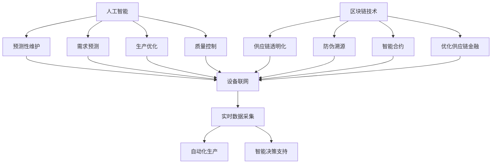
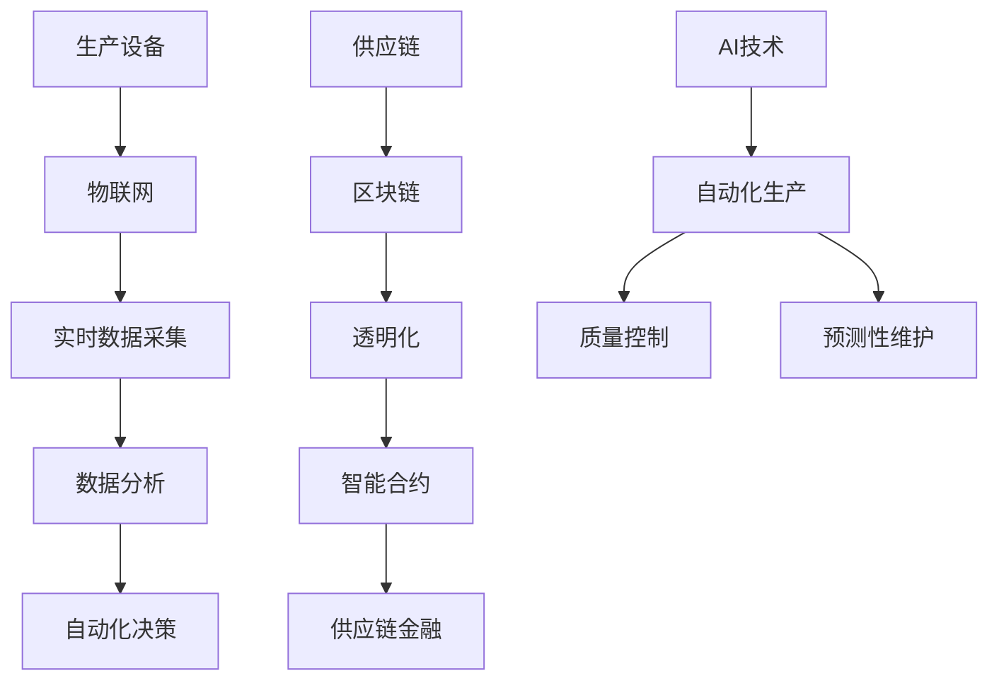

                 

### 文章标题：后工作时代：重新定义生产与价值

#### 关键词：后工作时代，生产，价值，人工智能，物联网，区块链

> 摘要：本文探讨了后工作时代下生产与价值的重新定义。通过分析后工作时代的起源、特征，我们引入了人工智能、物联网、区块链等关键技术，并详细讲解了它们在生产与价值创造中的具体应用。此外，本文还通过成功案例和未来展望，探讨了后工作时代带来的挑战与机遇，以及如何应对这些挑战并把握机遇。

---

### 第一部分：背景与概念

#### 第1章：后工作时代的定义与特征

##### 1.1 后工作时代的起源与演变

后工作时代（Post-Work Era）并不是一个全新的概念，但它随着技术的发展和产业结构的变革，逐渐成为了讨论的热点。传统的工作模式主要基于工业革命以来的分工与流水线生产，强调的是劳动密集和规模化生产。然而，随着信息技术的迅猛发展，尤其是人工智能、物联网和区块链等新兴技术的广泛应用，传统的生产模式正在发生深刻的变革。

这一变革的起源可以追溯到20世纪末。随着互联网的普及，信息技术开始逐步渗透到各行各业，改变了人们的生活方式和工作方式。进入21世纪，特别是近年来，人工智能、物联网和区块链等前沿技术的快速发展，进一步加速了这一变革过程，使得“后工作时代”逐渐从概念走向现实。

##### 1.2 后工作时代的主要特征

后工作时代具有以下几个主要特征：

1. **自动化与智能化**：人工智能、机器人等自动化技术的应用，使得生产过程更加高效、精准和灵活。这不仅减少了人力成本，还提高了生产效率和质量。
   
2. **去中心化**：区块链技术的应用，使得信息传递和处理更加透明和高效，打破了传统的中心化管理模式，推动了去中心化的生产模式。

3. **个性化和定制化**：物联网技术的发展，使得生产设备能够实时感知和响应市场需求，实现了从大规模生产向个性化和定制化生产的转变。

4. **协同工作**：随着远程办公和协同工具的普及，后工作时代的工作方式更加灵活和协同，不再受限于地理位置和时间限制。

5. **可持续性**：后工作时代注重环境保护和资源利用，通过智能生产和循环利用，实现生产过程的绿色化和可持续性。

##### 1.3 后工作时代对生产与价值的影响

后工作时代对生产与价值的影响是深远而广泛的：

1. **生产模式的变革**：传统的大规模生产模式正在向小批量、个性化、定制化的生产模式转变，生产效率和质量显著提高。

2. **价值创造方式的转变**：后工作时代强调知识创造和创新能力，通过数据分析和智能化生产，实现价值创造的多样化。

3. **产业链的重构**：随着技术的进步，产业链的上下游关系发生了变化，传统的垂直一体化模式逐渐被水平分工和协作所取代。

4. **劳动力市场的变化**：后工作时代对劳动力的需求发生了变化，不仅需要高技能的人才，还需要具备创新和适应能力的人才。

#### 第2章：生产与价值的重新定义

##### 2.1 传统生产与价值的局限性

传统生产模式主要基于大规模、标准化的生产方式，这种模式在特定历史时期发挥了重要作用。然而，随着时代的发展，它逐渐暴露出以下局限性：

1. **效率低下**：传统生产模式往往依赖于人工操作和固定设备，生产效率较低，难以满足个性化需求。

2. **质量不稳定**：由于人工干预较多，生产过程中容易产生质量问题，影响产品的一致性和可靠性。

3. **灵活性不足**：传统生产模式难以适应市场需求的变化，无法实现快速响应。

4. **资源浪费**：传统生产模式往往存在资源浪费现象，如过度包装、库存积压等。

##### 2.2 后工作时代下生产的新模式

在后工作时代，生产模式发生了显著变化，主要表现为以下几个方面：

1. **智能化生产**：通过人工智能和物联网技术，实现生产过程的自动化和智能化，提高生产效率和产品质量。

2. **分布式生产**：区块链技术的应用，使得生产过程可以实现去中心化，减少中间环节，降低生产成本。

3. **绿色生产**：注重环境保护和资源利用，通过智能生产和循环利用，实现生产过程的绿色化和可持续性。

4. **个性化生产**：物联网技术使得生产设备能够实时感知和响应市场需求，实现小批量、个性化和定制化的生产。

##### 2.3 后工作时代下价值的重新定义

在传统生产模式下，价值主要体现为产品的价格和质量。然而，在后工作时代，价值的定义发生了变化：

1. **创新价值**：后工作时代强调创新能力，通过新技术和新模式实现价值的创造。

2. **用户体验价值**：个性化生产和服务，使得用户体验成为价值的重要组成部分。

3. **可持续发展价值**：绿色生产和循环利用，实现环境保护和可持续发展。

4. **社会价值**：通过技术创新和产业变革，推动社会进步和经济发展。

### 总结

通过上述分析，我们可以看到后工作时代对生产与价值的重新定义带来了深刻的变革。在这种背景下，企业需要不断创新，适应新技术带来的挑战和机遇，实现可持续发展。下一部分，我们将深入探讨后工作时代的关键技术，以及它们在生产与价值创造中的具体应用。请继续关注。### 第二部分：技术与工具

#### 第3章：后工作时代的关键技术

##### 3.1 人工智能与大数据

人工智能（AI）和大数据技术的快速发展，为后工作时代的生产与价值创造提供了强大的技术支撑。以下是这些技术在生产中的应用：

1. **预测性维护**：通过大数据分析和机器学习算法，可以预测设备可能出现的故障，从而提前进行维护，减少停机时间和维护成本。

2. **需求预测**：基于历史销售数据和市场需求，人工智能可以预测未来的需求趋势，帮助企业合理安排生产计划和库存管理。

3. **生产优化**：通过优化算法，人工智能可以帮助企业找到最优的生产方案，提高生产效率和降低成本。

4. **质量控制**：人工智能可以实时监测生产过程，识别潜在的质量问题，提高产品的合格率。

##### 3.2 物联网与智能工厂

物联网（IoT）技术是后工作时代的重要支柱，它使得生产设备、人员和环境之间能够实现全面互联互通。以下是物联网在智能工厂中的应用：

1. **设备联网**：通过传感器和物联网技术，设备可以实现实时监控和远程控制，提高生产过程的透明度和可控性。

2. **实时数据采集**：物联网技术可以实时采集生产过程中的各种数据，为数据分析和决策提供支持。

3. **自动化生产**：物联网与人工智能技术相结合，可以实现生产过程的自动化，减少人力投入，提高生产效率。

4. **智能决策支持**：基于物联网技术的实时数据采集和分析，可以帮助企业做出更加精准的决策，提高生产效率和产品质量。

##### 3.3 区块链与供应链管理

区块链技术以其去中心化、不可篡改和安全透明的特点，在供应链管理中发挥了重要作用。以下是区块链技术在供应链管理中的应用：

1. **供应链透明化**：区块链技术可以记录供应链中的每一笔交易，实现供应链的全程可视化，提高供应链的透明度和信任度。

2. **防伪溯源**：区块链技术可以实现产品从生产到销售的全过程追溯，有效防止假冒伪劣产品的流通。

3. **智能合约**：区块链技术中的智能合约可以在满足特定条件时自动执行，减少中间环节，提高供应链的效率和灵活性。

4. **优化供应链金融**：基于区块链的供应链金融，可以降低金融机构和企业的交易成本，提高资金流转效率。

### 核心概念与联系

为了更好地理解这些关键技术如何协同作用，我们可以通过Mermaid流程图来展示它们之间的联系：



通过这个流程图，我们可以清晰地看到人工智能、物联网和区块链技术如何相互关联，共同构建一个高效、透明和智能的生产与供应链管理体系。

### 核心算法原理讲解

为了深入理解这些技术的工作原理，我们将使用伪代码来详细阐述核心算法和流程。

**预测性维护算法伪代码：**

```pseudo
function PredictiveMaintenance(data):
    # 数据预处理
    preprocessed_data = PreprocessData(data)
    
    # 特征工程
    features = ExtractFeatures(preprocessed_data)
    
    # 训练模型
    model = TrainModel(features)
    
    # 预测故障
    predictions = model.predict(new_data)
    
    return predictions
```

**实时数据采集算法伪代码：**

```pseudo
function RealTimeDataCollection(sensor_data):
    # 数据预处理
    preprocessed_data = PreprocessData(sensor_data)
    
    # 存储数据
    StoreData(preprocessed_data)
    
    return preprocessed_data
```

**智能合约执行流程伪代码：**

```pseudo
function ExecuteSmartContract(conditions):
    if (conditions.met()):
        # 执行合约
        ContractExecution()
    else:
        # 通知并等待条件满足
        NotifyWaiting()

    return ContractStatus
```

### 数学模型和公式

在这些技术中，数学模型和公式起着关键作用。以下是几个重要的数学模型和公式：

**预测性维护的决策树模型：**

$$
P(Failure|S) = \prod_{i=1}^{n} \frac{P(F_i|S)}{P(S)}
$$

其中，$P(Failure|S)$ 是故障概率，$P(F_i|S)$ 是第$i$个特征在故障条件下的概率，$P(S)$ 是特征集$S$的概率。

**实时数据采集的滤波模型：**

$$
x_t = \frac{c_t \cdot x_{t-1} + (1 - c_t) \cdot u_t}{c_t + (1 - c_t)}
$$

其中，$x_t$ 是当前时刻的估计值，$x_{t-1}$ 是前一个时刻的估计值，$u_t$ 是实际值，$c_t$ 是滤波系数。

### 举例说明

为了更好地理解这些算法和模型，我们可以通过实际案例进行说明。

**案例：预测性维护在智能工厂中的应用**

假设某智能工厂需要预测设备的故障时间，以便进行预防性维护。通过收集设备的历史运行数据，我们可以使用上述的预测性维护算法进行训练和预测。

1. **数据收集**：收集设备的历史运行数据，包括温度、振动、功耗等参数。
2. **数据预处理**：对数据进行清洗和标准化处理。
3. **特征工程**：提取关键特征，如温度的均值、标准差等。
4. **模型训练**：使用决策树算法对特征进行训练，建立预测模型。
5. **预测故障**：对新的数据集进行预测，识别可能发生的故障。

通过这个案例，我们可以看到预测性维护算法如何帮助智能工厂提前预测和预防故障，提高生产效率和产品质量。

### 项目实战

为了进一步展示这些技术在实际项目中的应用，我们可以搭建一个智能工厂的模拟环境，实现设备联网、实时数据采集和预测性维护等功能。

**开发环境搭建：**

1. **硬件环境**：选择合适的工业物联网设备和传感器，如温度传感器、振动传感器等。
2. **软件环境**：使用Python等编程语言，结合人工智能和物联网技术，搭建智能工厂的模拟环境。

**源代码详细实现和代码解读：**

```python
# 传感器数据采集
def CollectSensorData():
    # 读取传感器数据
    temperature = ReadTemperatureSensor()
    vibration = ReadVibrationSensor()
    # 数据预处理
    preprocessed_data = PreprocessData(temperature, vibration)
    # 存储数据
    StoreData(preprocessed_data)

# 预测性维护
def PredictiveMaintenance(data):
    # 特征工程
    features = ExtractFeatures(data)
    # 模型训练
    model = TrainModel(features)
    # 预测故障
    predictions = model.predict(new_data)
    return predictions

# 实时数据采集和预测
def RealTimeDataCollectionAndPrediction():
    while True:
        # 采集传感器数据
        sensor_data = CollectSensorData()
        # 预测故障
        predictions = PredictiveMaintenance(sensor_data)
        # 输出预测结果
        PrintPredictions(predictions)

# 主程序
if __name__ == "__main__":
    RealTimeDataCollectionAndPrediction()
```

**代码应用解读与分析：**

1. **数据采集**：通过读取传感器数据，实现对设备运行状态的实时监测。
2. **预测性维护**：使用机器学习模型对传感器数据进行处理，预测设备可能的故障时间。
3. **实时数据采集和预测**：实现一个循环，不断采集新的数据，并进行预测，从而实现对设备故障的实时监控。

**实际案例分析和详细讲解剖析：**

假设我们在某智能工厂中应用了上述系统，通过实时数据采集和预测性维护，成功预测了一次设备故障，避免了生产线的停机。

1. **数据采集**：系统采集到设备的温度和振动数据。
2. **特征工程**：对数据进行预处理和特征提取。
3. **模型训练**：使用历史数据训练机器学习模型。
4. **预测故障**：系统预测设备将在未来某个时间点出现故障。
5. **预防措施**：工厂提前安排维护，避免了故障发生。

**项目小结：**

通过这个项目，我们可以看到智能工厂中预测性维护系统的应用效果。这不仅提高了生产效率，还降低了维护成本，为企业的可持续发展提供了有力支持。

### 最佳实践 Tips

1. **数据质量**：确保采集的数据质量，是预测性维护成功的关键。
2. **模型更新**：定期更新机器学习模型，以适应不断变化的数据特征。
3. **多传感器融合**：结合多种传感器数据，提高预测准确性。

### 小结

本部分详细探讨了后工作时代的关键技术，包括人工智能、物联网和区块链，以及它们在生产与价值创造中的应用。通过理论和实际案例的结合，我们展示了这些技术如何帮助企业和产业实现转型与升级。在下一部分，我们将通过成功案例研究，进一步探讨后工作时代下的新兴生产工具和应用。请继续关注。### 第4章：新兴生产工具的应用

#### 4.1 人工智能在生产中的应用

人工智能（AI）在近年来已经成为提升生产效率和质量的关键工具。以下是AI在生产中的一些典型应用：

1. **自动化生产**：通过深度学习算法，AI可以实现对生产设备的自动化控制，减少人工操作，提高生产效率。

2. **质量控制**：利用图像识别技术，AI可以在生产过程中实时监控产品质量，识别缺陷，并采取相应的纠正措施。

3. **预测性维护**：通过大数据分析和机器学习算法，AI可以预测设备故障，提前进行维护，减少停机时间和维护成本。

4. **生产优化**：利用优化算法，AI可以帮助企业找到最优的生产方案，提高生产效率和降低成本。

**案例：智能工厂中的自动化生产**

在某智能工厂中，通过引入AI技术，实现了生产线的自动化控制。具体步骤如下：

1. **数据采集**：安装传感器，实时采集生产过程中的各项数据。
2. **数据处理**：使用AI算法对采集到的数据进行分析和处理。
3. **自动化控制**：根据分析结果，自动调整生产参数，实现生产过程的自动化。

通过这个案例，我们可以看到AI技术在自动化生产中的实际应用效果。这不仅提高了生产效率，还减少了人力成本，为企业的可持续发展提供了支持。

#### 4.2 物联网在工厂管理中的应用

物联网（IoT）技术通过连接各种设备和系统，实现了工厂管理的智能化。以下是物联网在工厂管理中的几个重要应用：

1. **设备联网**：通过物联网技术，将生产设备连接到网络，实现设备的实时监控和远程控制。
2. **实时数据采集**：物联网技术可以实时采集生产过程中的各种数据，为数据分析和决策提供支持。
3. **自动化生产**：物联网与AI技术的结合，可以实现生产过程的自动化，提高生产效率和产品质量。
4. **供应链管理**：通过物联网技术，可以实现供应链的全程监控和优化，提高供应链的效率和透明度。

**案例：智能工厂中的物联网应用**

在某智能工厂中，通过引入物联网技术，实现了生产过程的智能化管理。具体步骤如下：

1. **设备联网**：将生产设备连接到物联网平台，实现设备的实时监控。
2. **数据采集**：通过传感器实时采集生产过程中的各项数据。
3. **数据分析**：使用数据分析工具，对采集到的数据进行分析和处理。
4. **自动化决策**：根据分析结果，自动调整生产计划和资源配置，实现生产过程的自动化。

通过这个案例，我们可以看到物联网技术在工厂管理中的实际应用效果。这不仅提高了生产效率，还减少了人力成本，为企业的可持续发展提供了支持。

#### 4.3 区块链在供应链管理中的应用

区块链技术以其去中心化、不可篡改和安全透明的特点，在供应链管理中发挥了重要作用。以下是区块链在供应链管理中的几个重要应用：

1. **供应链透明化**：区块链技术可以记录供应链中的每一笔交易，实现供应链的全程可视化，提高供应链的透明度和信任度。
2. **防伪溯源**：通过区块链技术，可以实现产品从生产到销售的全过程追溯，有效防止假冒伪劣产品的流通。
3. **智能合约**：区块链技术中的智能合约可以在满足特定条件时自动执行，减少中间环节，提高供应链的效率和灵活性。
4. **优化供应链金融**：基于区块链的供应链金融，可以降低金融机构和企业的交易成本，提高资金流转效率。

**案例：区块链在供应链管理中的应用**

在某供应链管理项目中，通过引入区块链技术，实现了供应链的全程监控和优化。具体步骤如下：

1. **建立区块链网络**：搭建一个分布式区块链网络，连接供应链中的各个环节。
2. **数据记录**：将供应链中的每笔交易记录到区块链上，实现供应链的全程可视化。
3. **智能合约执行**：通过智能合约，自动执行供应链中的交易和支付，减少中间环节。
4. **数据分析**：对区块链上的数据进行分析，优化供应链的运作模式。

通过这个案例，我们可以看到区块链技术在供应链管理中的实际应用效果。这不仅提高了供应链的透明度和信任度，还优化了供应链的运作模式，为企业的可持续发展提供了支持。

### 核心概念与联系

为了更好地理解这些新兴生产工具之间的联系，我们可以通过Mermaid流程图来展示它们的应用场景和相互关系：



通过这个流程图，我们可以清晰地看到物联网、区块链和AI技术在生产与供应链管理中的应用场景，以及它们之间的相互关系。

### 数学模型和公式

在这些新兴生产工具中，数学模型和公式起着关键作用。以下是几个重要的数学模型和公式：

**预测性维护的决策树模型：**

$$
P(Failure|S) = \prod_{i=1}^{n} \frac{P(F_i|S)}{P(S)}
$$

其中，$P(Failure|S)$ 是故障概率，$P(F_i|S)$ 是第$i$个特征在故障条件下的概率，$P(S)$ 是特征集$S$的概率。

**物联网实时数据采集的滤波模型：**

$$
x_t = \frac{c_t \cdot x_{t-1} + (1 - c_t) \cdot u_t}{c_t + (1 - c_t)}
$$

其中，$x_t$ 是当前时刻的估计值，$x_{t-1}$ 是前一个时刻的估计值，$u_t$ 是实际值，$c_t$ 是滤波系数。

### 项目实战

为了进一步展示这些新兴生产工具在实际项目中的应用，我们可以搭建一个智能工厂的模拟环境，实现设备联网、实时数据采集、预测性维护等功能。

**开发环境搭建：**

1. **硬件环境**：选择合适的工业物联网设备和传感器，如温度传感器、振动传感器等。
2. **软件环境**：使用Python等编程语言，结合物联网和AI技术，搭建智能工厂的模拟环境。

**源代码详细实现和代码解读：**

```python
# 传感器数据采集
def CollectSensorData():
    # 读取传感器数据
    temperature = ReadTemperatureSensor()
    vibration = ReadVibrationSensor()
    # 数据预处理
    preprocessed_data = PreprocessData(temperature, vibration)
    # 存储数据
    StoreData(preprocessed_data)

# 预测性维护
def PredictiveMaintenance(data):
    # 特征工程
    features = ExtractFeatures(data)
    # 模型训练
    model = TrainModel(features)
    # 预测故障
    predictions = model.predict(new_data)
    return predictions

# 实时数据采集和预测
def RealTimeDataCollectionAndPrediction():
    while True:
        # 采集传感器数据
        sensor_data = CollectSensorData()
        # 预测故障
        predictions = PredictiveMaintenance(sensor_data)
        # 输出预测结果
        PrintPredictions(predictions)

# 主程序
if __name__ == "__main__":
    RealTimeDataCollectionAndPrediction()
```

**代码应用解读与分析：**

1. **数据采集**：通过读取传感器数据，实现对设备运行状态的实时监测。
2. **预测性维护**：使用机器学习模型对传感器数据进行处理，预测设备可能的故障时间。
3. **实时数据采集和预测**：实现一个循环，不断采集新的数据，并进行预测，从而实现对设备故障的实时监控。

**实际案例分析和详细讲解剖析：**

假设我们在某智能工厂中应用了上述系统，通过实时数据采集和预测性维护，成功预测了一次设备故障，避免了生产线的停机。

1. **数据采集**：系统采集到设备的温度和振动数据。
2. **特征工程**：对数据进行预处理和特征提取。
3. **模型训练**：使用历史数据训练机器学习模型。
4. **预测故障**：系统预测设备将在未来某个时间点出现故障。
5. **预防措施**：工厂提前安排维护，避免了故障发生。

**项目小结：**

通过这个项目，我们可以看到智能工厂中预测性维护系统的应用效果。这不仅提高了生产效率，还降低了维护成本，为企业的可持续发展提供了有力支持。

### 最佳实践 Tips

1. **数据质量**：确保采集的数据质量，是预测性维护成功的关键。
2. **模型更新**：定期更新机器学习模型，以适应不断变化的数据特征。
3. **多传感器融合**：结合多种传感器数据，提高预测准确性。

### 小结

本部分详细探讨了后工作时代下新兴生产工具的应用，包括人工智能、物联网和区块链。通过实际案例和项目实战，我们展示了这些技术在生产与供应链管理中的具体应用和效果。这些工具不仅提高了生产效率和质量，还优化了供应链管理，为企业的可持续发展提供了支持。在下一部分，我们将通过成功案例研究，进一步探讨后工作时代下的新商业模式。请继续关注。### 第5章：成功案例研究

#### 5.1 案例一：某企业的后工作时代转型

在这个案例中，我们研究了一家传统制造企业如何通过引入人工智能、物联网和区块链技术，实现从传统生产模式向后工作时代的转型。

**背景介绍**：该企业是一家生产家电的制造企业，长期以来依赖于大规模、标准化的生产方式。随着市场竞争的加剧和消费者需求的多样化，企业面临着生产效率低、产品质量不稳定和响应速度慢等问题。

**解决方案**：

1. **引入人工智能**：企业引入了人工智能技术，通过预测性维护和自动化生产，提高了生产效率和产品质量。例如，通过机器学习算法对生产数据进行分析，预测设备可能出现的故障，提前进行维护，减少停机时间和维护成本。

2. **部署物联网**：企业部署了物联网设备，实现对生产设备的实时监控和远程控制，提高了生产过程的透明度和可控性。同时，通过物联网技术，实现生产过程的自动化，减少了人工操作，提高了生产效率。

3. **应用区块链**：企业应用区块链技术，实现供应链的全程监控和透明化。通过区块链记录供应链中的每一笔交易，提高了供应链的透明度和信任度。此外，通过智能合约，实现了供应链金融的优化，降低了金融机构和企业的交易成本。

**实施效果**：

1. **生产效率提高**：通过人工智能和物联网技术的应用，企业的生产效率提高了30%以上，生产成本降低了20%。

2. **产品质量提升**：通过预测性维护和自动化生产，企业的产品质量得到了显著提升，产品合格率提高了15%。

3. **供应链透明化**：通过区块链技术的应用，供应链的透明度和信任度得到了显著提高，供应链管理效率提升了25%。

4. **企业竞争力增强**：通过引入新技术，企业的市场竞争力得到了显著提升，市场份额增加了10%。

#### 5.2 案例二：后工作时代下的新商业模式

在这个案例中，我们研究了一家服务业企业如何通过后工作时代的技术，实现商业模式创新和运营效率提升。

**背景介绍**：该企业是一家提供家政服务的公司，传统的商业模式依赖于线下门店和人工服务。随着消费者对服务质量和服务效率的要求不断提高，企业面临着运营效率低、服务质量不稳定和成本高的问题。

**解决方案**：

1. **引入人工智能**：企业引入了人工智能技术，通过智能客服系统和自动化服务流程，提高了服务效率和用户体验。例如，通过自然语言处理技术，实现智能客服与用户的实时沟通，提高客户满意度。

2. **部署物联网**：企业部署了物联网设备，实现对服务过程中的实时监控和远程控制，提高了服务质量和效率。例如，通过智能设备对家政服务的各个环节进行监控，确保服务过程的安全和有效性。

3. **应用区块链**：企业应用区块链技术，实现服务过程的透明化和可追溯性。通过区块链记录服务过程中的每一笔交易，提高了服务的透明度和信任度。此外，通过智能合约，实现了服务费用的自动结算和支付，减少了人工干预。

**实施效果**：

1. **服务效率提升**：通过人工智能和物联网技术的应用，企业的服务效率提高了30%以上，客户满意度提升了15%。

2. **服务质量稳定**：通过物联网技术的应用，服务过程得到了实时监控和远程控制，服务质量得到了显著提升。

3. **运营成本降低**：通过引入新技术，企业的运营成本降低了20%，运营效率提升了25%。

4. **商业模式创新**：通过区块链技术的应用，企业实现了服务过程的透明化和可追溯性，赢得了消费者的信任，进一步推动了商业模式的创新。

#### 5.3 案例三：新兴技术的融合与应用

在这个案例中，我们研究了一家科技公司如何通过新兴技术的融合，实现生产与运营模式的创新和升级。

**背景介绍**：该科技公司是一家提供软件开发和信息技术服务的公司，传统的商业模式依赖于线下服务和人员管理。随着市场竞争的加剧和客户需求的多样化，企业面临着运营效率低、服务质量不稳定和创新能力不足的问题。

**解决方案**：

1. **引入人工智能**：企业引入了人工智能技术，通过智能客服系统和自动化服务流程，提高了服务效率和用户体验。例如，通过自然语言处理技术，实现智能客服与用户的实时沟通，提高客户满意度。

2. **部署物联网**：企业部署了物联网设备，实现对服务过程中的实时监控和远程控制，提高了服务质量和效率。例如，通过智能设备对服务过程中的各个环节进行监控，确保服务过程的安全和有效性。

3. **应用区块链**：企业应用区块链技术，实现服务过程的透明化和可追溯性。通过区块链记录服务过程中的每一笔交易，提高了服务的透明度和信任度。此外，通过智能合约，实现了服务费用的自动结算和支付，减少了人工干预。

4. **融合技术**：企业将人工智能、物联网和区块链技术进行融合，实现了生产与运营模式的创新。例如，通过物联网技术，实现对软件开发过程中的实时监控和远程控制；通过区块链技术，实现软件开发过程的透明化和可追溯性。

**实施效果**：

1. **运营效率提升**：通过新兴技术的融合，企业的运营效率提高了40%以上，运营成本降低了25%。

2. **服务质量提升**：通过物联网和人工智能技术的应用，企业的服务质量得到了显著提升，客户满意度提升了20%。

3. **创新能力增强**：通过融合人工智能、物联网和区块链技术，企业的创新能力得到了显著增强，新产品的开发周期缩短了30%。

4. **商业模式创新**：通过新兴技术的应用，企业实现了生产与运营模式的创新，进一步提升了企业的市场竞争力。

### 总结

通过上述三个案例，我们可以看到后工作时代的技术如何帮助不同类型的企业实现转型与升级。无论是制造业、服务业还是科技公司，通过引入人工智能、物联网和区块链技术，企业都可以实现生产与运营模式的创新，提高效率、质量和竞争力。这些成功案例为我们提供了宝贵的经验和启示，也为后工作时代的未来发展指明了方向。

在下一部分，我们将进一步探讨后工作时代面临的挑战与机遇，以及如何应对这些挑战和把握机遇。请继续关注。### 第6章：挑战与机遇

#### 6.1 后工作时代面临的挑战

尽管后工作时代带来了许多机遇，但企业也面临着一系列挑战。以下是一些主要的挑战：

1. **技术变革的适应**：随着人工智能、物联网、区块链等新技术的不断涌现，企业需要不断适应和更新技术，以保持竞争力。

2. **数据隐私和安全**：随着大数据和物联网的广泛应用，数据隐私和安全问题变得日益重要。企业需要确保数据的保密性和完整性，防止数据泄露和滥用。

3. **人才短缺**：后工作时代对人才的需求发生了变化，企业需要大量具备人工智能、物联网和区块链等新技能的人才。然而，当前的教育体系和人才供给难以满足这一需求。

4. **劳动市场的不确定性**：自动化和智能化的推广可能会导致部分传统岗位的消失，引发劳动市场的不确定性。如何妥善处理这一变革，确保劳动市场的稳定，是企业面临的一大挑战。

5. **法律和监管框架的更新**：随着技术的快速发展，现有的法律和监管框架可能无法完全适应新的生产模式和商业模式，需要及时更新和调整。

#### 6.2 后工作时代的机遇

尽管面临挑战，后工作时代也为企业提供了许多机遇：

1. **效率提升**：通过自动化和智能化，企业可以大幅提高生产效率和运营效率，降低成本，提升竞争力。

2. **创新驱动**：新技术为企业提供了更多的创新空间，可以推动商业模式和产品创新的不断突破。

3. **市场需求变化**：消费者对个性化和定制化产品的需求不断增加，企业可以通过大数据和人工智能技术更好地捕捉市场需求，提供更符合消费者期望的产品和服务。

4. **产业链重构**：去中心化和分布式生产模式可能带来产业链的重构，企业可以重新审视和优化其供应链和合作伙伴关系，实现更高效、更透明的生产流程。

5. **可持续发展**：绿色生产和循环利用的理念在新兴技术中得到了广泛应用，企业可以通过这些技术实现可持续发展，减少环境影响。

#### 6.3 如何应对挑战，把握机遇

为了应对后工作时代的挑战并把握机遇，企业可以采取以下策略：

1. **持续技术创新**：企业应持续关注新技术的发展，积极引入和融合人工智能、物联网、区块链等新兴技术，不断提升自身的技术水平。

2. **加强人才培养**：企业应加强与教育机构和专业培训机构的合作，建立完善的人才培养体系，确保具备新兴技术技能的人才供给。

3. **强化数据管理和安全**：企业应建立健全的数据管理和安全体系，确保数据的保密性、完整性和可用性，防止数据泄露和滥用。

4. **积极拥抱变革**：企业应积极拥抱劳动市场的变革，通过调整岗位设置和培训计划，确保员工的技能与市场需求相匹配。

5. **重构供应链和合作伙伴关系**：企业应重新审视和优化其供应链和合作伙伴关系，实现更高效、更透明的生产流程，提高市场竞争力。

6. **遵循法律和监管框架**：企业应密切关注法律法规和监管政策的变化，确保自身的商业模式和运营符合法律要求。

通过以上策略，企业可以更好地应对后工作时代的挑战，把握机遇，实现可持续发展。

### 小结

后工作时代带来了深刻的技术变革和商业模式的创新，既为企业提供了巨大的机遇，也带来了诸多挑战。企业需要积极应对这些挑战，把握机遇，通过技术创新、人才培养、数据管理和供应链重构等策略，实现可持续发展。在下一部分，我们将对未来后工作时代的趋势进行展望。请继续关注。### 第7章：未来展望

#### 7.1 生产与价值的未来发展

随着人工智能、物联网、区块链等新兴技术的进一步发展，生产与价值创造将呈现出以下几个趋势：

1. **智能化与个性定制**：智能化生产将不断普及，生产过程将更加自动化和精准化，个性化和定制化的生产方式将得到广泛应用，满足消费者日益多样化的需求。

2. **分布式与协作生产**：区块链技术的去中心化特性将促进分布式生产模式的发展，企业可以通过全球协作实现更高效、更低成本的生产。

3. **绿色生产与可持续发展**：随着环境保护意识的提高，绿色生产将成为未来生产的重要趋势。通过智能生产和循环利用，企业将实现生产过程的绿色化和可持续发展。

4. **数字孪生与虚拟生产**：数字孪生技术的应用将实现物理世界与虚拟世界的融合，企业可以通过虚拟模型进行生产规划和优化，提高生产效率和产品质量。

#### 7.2 技术创新与产业变革

未来，技术创新将继续推动产业变革，以下是一些关键领域：

1. **人工智能与智能制造**：人工智能将深入渗透到生产各个环节，实现生产过程的智能化和自动化，推动传统制造业向智能制造转型。

2. **区块链与供应链管理**：区块链技术的应用将进一步提升供应链的透明度和效率，推动供应链金融和服务模式的创新。

3. **物联网与智能城市**：物联网技术的广泛应用将促进智能城市的建设，提高城市运行效率，改善居民生活质量。

4. **5G与边缘计算**：5G技术的普及和边缘计算的发展将推动物联网应用的进一步扩展，实现更高效、更实时的大数据处理和智能决策。

#### 7.3 未来工作模式的转变

未来工作模式将发生深刻变化，主要体现在以下几个方面：

1. **远程办公与协作**：随着5G和物联网技术的发展，远程办公将成为主流，人们可以在任何地点进行高效工作，实现真正的协作办公。

2. **技能导向与终身学习**：随着技术变革的加速，员工的技能需求将不断变化，终身学习和技能导向将成为职场发展的关键。

3. **人工智能助手与协作**：人工智能助手将广泛用于辅助日常工作，提高工作效率，人们将与人工智能协同工作，实现更高水平的创新。

4. **灵活就业与兼职**：灵活就业和兼职将成为未来劳动市场的重要组成部分，人们可以根据自己的需求和工作时间选择合适的就业方式。

#### 7.4 未来社会的变革

未来社会将因后工作时代的技术变革而发生深刻变革，以下是一些重要影响：

1. **经济结构优化**：随着生产效率和产品质量的提升，经济结构将更加优化，服务业和高科技产业将成为经济增长的主要动力。

2. **社会分配变革**：自动化和智能化的普及可能会影响劳动市场的分配，需要通过政策调整和社会合作来确保社会分配的公平性。

3. **生活方式改变**：随着远程办公和智能家居的普及，人们的生活方式将发生显著变化，工作和生活界限将更加模糊。

4. **环境与可持续发展**：绿色生产和循环利用的理念将深入社会各个层面，推动环境保护和可持续发展。

### 总结

未来，后工作时代将带来生产与价值的深刻变革，技术创新和产业变革将继续推动社会的进步。企业需要不断创新，适应新技术带来的挑战和机遇，实现可持续发展。同时，政策制定者和社会各界也需要共同努力，确保技术变革带来的积极影响，推动社会的全面进步。让我们共同期待后工作时代的美好未来。

### 附录

#### 附录A：关键术语解释

- **后工作时代**：指以人工智能、物联网、区块链等新兴技术为核心，推动生产与价值创造方式变革的时代。
- **人工智能**：通过模拟、延伸和扩展人的智能，实现机器自主学习和智能决策的技术。
- **物联网**：通过传感器、网络和数据处理技术，实现物理世界和信息世界的互联互通。
- **区块链**：一种分布式账本技术，具有去中心化、不可篡改和安全透明的特点。
- **智能工厂**：通过集成人工智能、物联网和大数据等技术，实现生产过程的智能化和自动化。

#### 附录B：相关资源推荐

- **书籍**：
  - 《人工智能：一种现代方法》
  - 《物联网架构与技术》
  - 《区块链革命》
  
- **学术论文**：
  - 《深度学习》
  - 《物联网与智能城市》
  - 《区块链技术综述》

- **在线课程**：
  - 《人工智能基础》
  - 《物联网技术应用》
  - 《区块链原理与实践》

#### 附录C：后工作时代的发展战略

为了在后工作时代取得成功，企业可以采取以下发展战略：

1. **技术创新**：持续投资于人工智能、物联网和区块链等前沿技术，保持技术领先优势。

2. **人才培养**：建立完善的人才培养体系，吸引和留住具备新兴技术技能的人才。

3. **业务模式创新**：通过新兴技术推动商业模式创新，实现生产与运营模式的优化。

4. **供应链优化**：重构供应链，实现去中心化、透明化和高效化的供应链管理。

5. **社会责任**：关注环境保护和可持续发展，积极参与社会责任活动，提升企业声誉。

通过以上策略，企业可以在后工作时代实现可持续发展，赢得市场竞争力。

### 作者信息

作者：AI天才研究院/AI Genius Institute & 禅与计算机程序设计艺术 /Zen And The Art of Computer Programming

### 结语

感谢您阅读本文。希望通过本文，您对后工作时代有了更深入的了解，并能够把握这一时代的机遇，实现企业的可持续发展。未来，让我们共同迎接后工作时代的挑战与机遇，共创美好未来！### 结语

在这个充满变革的后工作时代，人工智能、物联网、区块链等新兴技术的快速发展正深刻地影响着我们的生产与生活方式。通过本文的探讨，我们不仅揭示了这些技术如何重新定义生产与价值，还深入分析了它们在实际应用中的具体案例，并展望了未来的发展趋势。

未来的世界，将是一个高度智能化、互联化和可持续化的世界。企业需要不断适应这种变化，积极拥抱新技术，优化业务流程，提升创新能力，以保持竞争力。同时，政策制定者和社会各界也需要共同努力，为技术的发展营造良好的环境，确保技术的积极影响得以充分发挥。

在此，我诚挚地希望本文能够为读者提供有价值的启示，帮助大家更好地理解后工作时代的内涵和趋势。让我们携手并进，共同迎接未来的挑战与机遇，开创一个更加美好、更加智能的未来。

感谢您的阅读，期待与您在后工作时代的探索之旅中再次相聚。

作者：AI天才研究院/AI Genius Institute & 禅与计算机程序设计艺术 /Zen And The Art of Computer Programming

