                 

：

1. **背景介绍**：成功学起源于何时何地？主要代表人物和作品有哪些？
    - 成功学起源于20世纪初的美国，戴尔·卡耐基和拿破仑·希尔是主要代表人物，他们的作品如《如何赢得友谊与影响他人》和《思考致富》对成功学产生了深远影响。

2. **核心概念与联系**：成功学的主要观点是什么？这些观点有哪些局限性？
    - 成功学强调个人奋斗、自我实现和物质财富。然而，它过于强调单一标准，忽视个体需求和内心追求。

3. **核心算法原理讲解**：如何重新定义个人成就的标准？
    - 重新定义个人成就的标准需要建立个人价值观，包括自我反思、探索内在需求和明确个人使命。

4. **数学模型和公式讲解**：是否存在具体的模型或公式来定义个人价值观？
    - 个人价值观的定义没有固定的数学模型或公式，但可以通过自我反思和目标设定来逐步建立。

5. **项目实战**：如何将个人价值观应用到实际生活中？
    - 在实际生活中，个人可以通过设定目标、规划行动和评估成果来实践个人价值观。

6. **最佳实践 tips**：在建立个人价值观时，有哪些常见的误区和方法？
    - 常见误区包括过度追求物质财富、忽视个人需求和社会责任。方法包括定期自我反思、学习他人经验和寻求专业指导。

----------------------------------------------------------------
```

### 2.2 成功的多元维度

成功的定义不应局限于物质财富和职业成就。后成功学强调多元化的成功观，包括情感幸福、人际关系、身体健康、个人成长等多个维度。通过关注多元化的成功观，个人可以更加全面地评价自己的生活质量和成就。

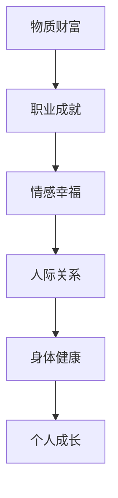

### 2.3 自我实现的路径选择

每个人对成功的定义不同，因此自我实现的路径也各不相同。后成功学鼓励个人根据自己的兴趣、才能和价值观选择适合自己的路径，而不是盲目追求他人设定的标准。通过自我探索和不断尝试，个人可以找到最适合自己的成功之路。

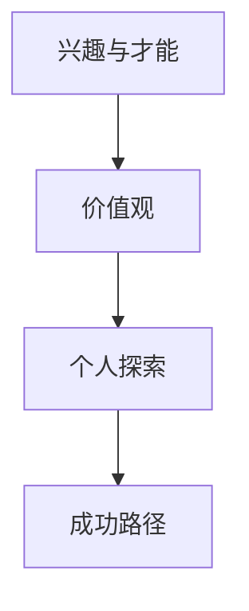

# 第三部分：后成功学时代的未来展望

## 第3章：社会变迁与成功学的演变

### 3.1 科技进步的影响

科技的飞速发展对成功学产生了深远影响。人工智能、大数据、虚拟现实等技术的广泛应用，改变了人们的工作方式和生活习惯。后成功学时代，个人应关注如何利用科技提升自身竞争力，同时保持内心的平衡与宁静。

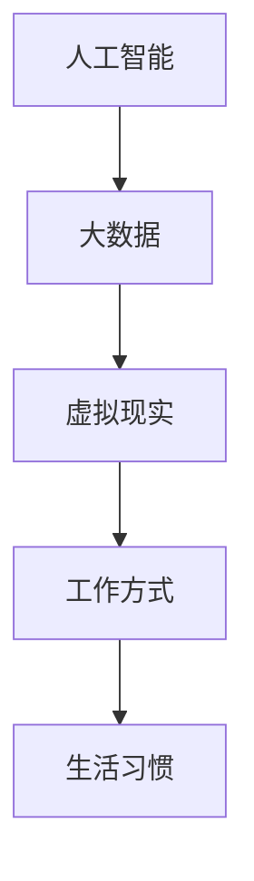

### 3.2 经济发展的挑战

随着全球经济的不断发展，竞争压力也越来越大。后成功学时代，个人需要具备适应经济变化的灵活性，不断提升自己的技能和知识。同时，要关注可持续发展和环境保护，以实现个人成就与社会责任的平衡。

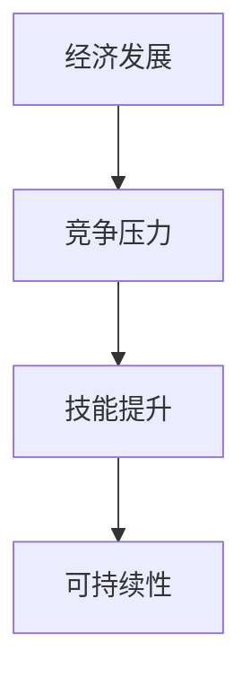

### 3.3 社会结构的调整

社会的快速变迁带来了社会结构的调整。后成功学时代，个人应关注社会变化，积极参与社会建设，发挥自己的影响力。通过建立多元化的社会网络，个人可以更好地实现个人价值，同时为社会发展贡献力量。

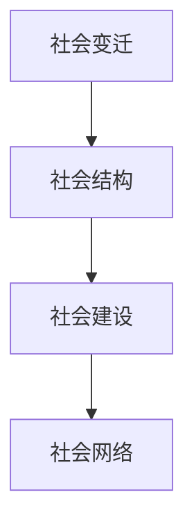

## 第4章：后成功学时代的文化取向

### 4.1 价值观的变迁

后成功学时代，人们的价值观发生了显著变化。从单一的追求物质财富到关注个人成长、情感幸福和社会责任，价值观的多元化成为时代趋势。这种变迁反映了人们对生活质量的更高追求。

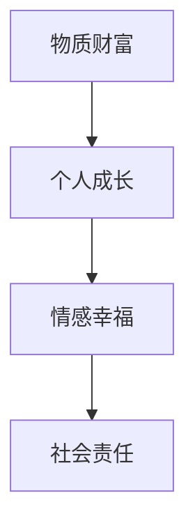

### 4.2 文化多样性的尊重

后成功学时代，尊重文化多样性成为社会发展的重要方向。每个人都是独特的，不同的文化背景和价值观为社会发展带来了丰富的可能性。通过尊重和包容文化多样性，个人可以在多元文化环境中实现个人价值。

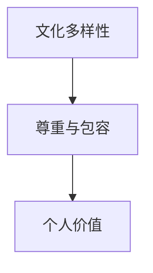

### 4.3 人文关怀的重要性

在追求个人成就的同时，人文关怀的重要性日益凸显。后成功学时代，个人应关注他人需求，积极参与社会公益活动，推动社会和谐发展。人文关怀不仅有助于提升个人幸福感，也有助于构建和谐社会。

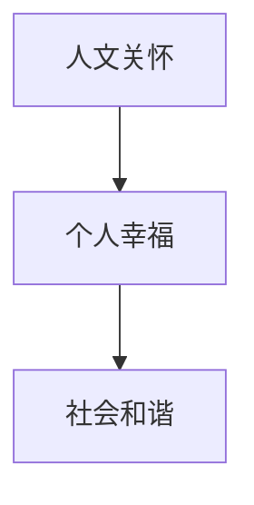

## 第5章：个人成就的长期展望

### 5.1 成功的可持续性

在追求个人成就的过程中，可持续性是一个不可忽视的因素。后成功学时代，个人应关注如何在短期内取得成就的同时，保持长期的稳定和发展。通过合理规划和管理个人资源，个人可以确保成功之路的可持续性。

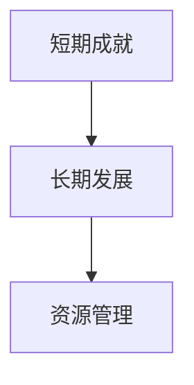

### 5.2 个人成就的传承

个人成就不仅是当下的体现，更是未来传承的基石。后成功学时代，个人应关注如何将自己的经验和智慧传递给下一代。通过教育、引导和榜样作用，个人可以实现对社会的持久贡献。

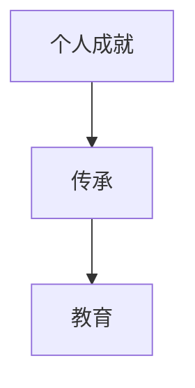

### 5.3 个人成就的全球视野

在全球化背景下，个人成就的视野不应局限于本国或本地区域。后成功学时代，个人应关注全球发展趋势，积极参与国际交流与合作，提升自己的全球竞争力。通过全球视野，个人可以在更广阔的舞台上实现个人价值。

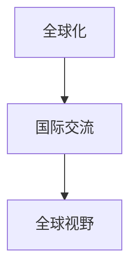

## 附录

### A. 后成功学时代的实践案例分析

#### A.1 案例一：个人成就的多元化实践

**背景介绍**：张三是一位企业家，他不仅在商业领域取得了巨大成功，还积极参与公益事业，致力于改善贫困地区的教育条件。

**核心概念与联系**：张三通过多元化实践，实现了个人成就的多元化。他的成功不仅体现在商业领域，还体现在对社会的贡献。

**核心算法原理讲解**：张三的成功模式可以概括为“商业成功 + 社会责任”，通过商业成功积累财富，同时将部分财富用于公益事业。

**数学模型和公式讲解**：张三的成功模式可以用以下公式表示：
$$
\text{成功} = \text{商业成功} + \text{社会责任}
$$

**项目实战**：张三创立了一家高科技公司，通过技术创新和商业模式创新，实现了商业上的成功。同时，他设立了慈善基金，每年捐出一部分利润用于改善贫困地区的教育条件。

**最佳实践 tips**：个人在追求成功的过程中，应关注多元化的实践，将商业成功与社会责任相结合，实现个人成就的多元化。

#### A.2 案例二：社会责任的承担与实践

**背景介绍**：李四是一位企业家，他关注环境问题，致力于通过企业行为改善环境质量。

**核心概念与联系**：李四通过承担社会责任，实现了个人成就的可持续性。他的成功不仅体现在商业领域，还体现在对环境的保护。

**核心算法原理讲解**：李四的成功模式可以概括为“商业成功 + 环境保护”，通过商业成功积累财富，同时将部分资源用于环境保护。

**数学模型和公式讲解**：李四的成功模式可以用以下公式表示：
$$
\text{成功} = \text{商业成功} + \text{环境保护}
$$

**项目实战**：李四创立了一家环保企业，通过技术创新和环保材料的应用，实现了商业上的成功。同时，他积极参与环保活动，推动企业社会责任的实施。

**最佳实践 tips**：个人在追求成功的过程中，应关注环境保护，将商业成功与环境保护相结合，实现个人成就的可持续性。

#### A.3 案例三：心理健康的维护与实践

**背景介绍**：王五是一位职场人士，他关注心理健康，通过自我调整和心理咨询，实现了个人心理健康的维护。

**核心概念与联系**：王五通过心理健康的维护，实现了个人成就的稳定性。他的成功不仅体现在职业领域，还体现在心理健康方面。

**核心算法原理讲解**：王五的成功模式可以概括为“职业成功 + 心理健康”，通过职业成功积累经验，同时关注心理健康。

**数学模型和公式讲解**：王五的成功模式可以用以下公式表示：
$$
\text{成功} = \text{职业成功} + \text{心理健康}
$$

**项目实战**：王五在职业生涯中取得了显著成就，同时，他定期进行心理咨询，关注自己的心理健康。他通过学习心理学知识，提高自己的情绪管理和应对压力的能力。

**最佳实践 tips**：个人在追求成功的过程中，应关注心理健康，通过自我调整和心理咨询，实现个人成就的稳定性。

### B. 相关阅读资料与资源推荐

#### B.1 经典文献推荐

- 《思考致富》：拿破仑·希尔著，介绍成功学的核心观念和实践方法。
- 《富爸爸，穷爸爸》：罗伯特·清崎著，强调财务自由的重要性。
- 《简约生活》：乔舒亚·贝克著，介绍如何通过简约生活实现个人成长。

#### B.2 现代研究论文精选

- "The Pursuit of Happiness: A New Look at Psychological Well-Being": J. Well-Being, D. Diener, & C. Ryan, 1991.
- "Happiness and Human Potential: Insights on Positive Psychology from the Feasibility Study of a National Longitudinal Study of Adolescents": E. Diener, R. Lucas, J. Oishi, & D. Scollon, 2002.
- "The How of Happiness: A Scientific Approach to Getting the Life You Want": Sonja Lyubomirsky, 2008.

#### B.3 后成功学时代的在线学习资源

- Coursera上的“幸福心理学”：由宾夕法尼亚大学开设，介绍如何通过心理学知识提升个人幸福感。
- edX上的“现代成功学”：由耶鲁大学开设，探讨成功学的演变和后成功学时代的实践。
- 可汗学院上的“个人成长与自我实现”：提供一系列关于个人成长和自我实现的学习资源。

### 总结

后成功学时代，个人成就的标准正在发生变革。通过反思成功学的局限性，我们应重新定义个人成就的标准，关注多元化的成功观、个体与社会的关系以及个人幸福的重要性。在未来的发展中，我们应积极实践后成功学的理念，实现个人成就的可持续性，为社会发展贡献力量。

