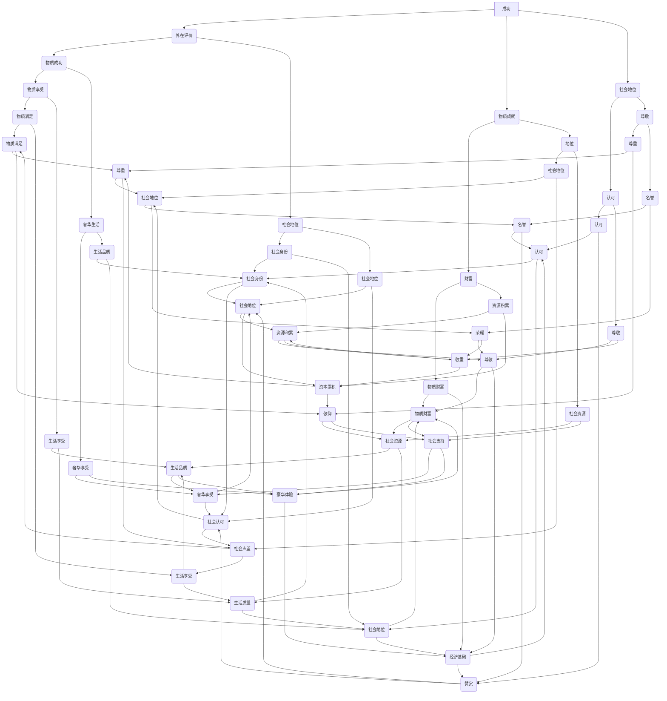

                 

### 文章标题

《后成功学时代：重新定义人生目标》

### 关键词

成功学、后成功学时代、人生目标、重新定义、心理幸福感、社会变迁、持续自我评估

### 摘要

在现代社会，成功学已成为广泛接受的价值观，但随之而来的问题也逐渐显现。本文探讨后成功学时代的特征及其对人生目标的重新定义。通过深入分析心理学、社会学和哲学等多学科视角，本文提出了一套新的目标设定理论，旨在帮助读者在后成功学时代找到真正属于自己的幸福和满足感。文章还通过实际案例和项目实战，提供了具体的实践指南，帮助读者在新的时代背景下重新审视自己的人生目标。

## 引言

### 成功学的反思

成功学作为现代社会的一种主流观念，长期以来被广大人群所追求。它以物质财富和事业成就为衡量标准，倡导个人奋斗和竞争，在一定程度上推动了社会的进步和发展。然而，随着社会的发展和人们生活水平的提高，成功学所带来的负面影响也逐渐显现。过度追求物质成功导致心理健康问题、人际关系紧张，甚至对环境和社会造成负面影响。

### 后成功学时代的特征

后成功学时代是一个强调个人幸福感、心理满足和社会责任的时期。在这个时代，人们开始反思传统成功学的局限性，追求更加全面和平衡的人生目标。后成功学时代的特点包括：

1. **心理幸福感优先**：人们开始更加重视内心的平静和幸福感，而不仅仅是外在的物质成功。
2. **社会责任意识增强**：越来越多的人意识到自己在社会中的责任，追求对社会有积极贡献的目标。
3. **可持续发展的关注**：环境保护、资源节约和可持续发展成为新的关注焦点。

### 重新定义人生目标的重要性

在新的时代背景下，重新定义人生目标至关重要。这不仅有助于个人实现长期的幸福和满足感，也有助于社会的和谐与进步。本文将从心理学、社会学和哲学等多个角度出发，探讨如何在后成功学时代重新定义人生目标。

## 核心概念与联系

### 成功与幸福的区别

在探讨重新定义人生目标之前，首先需要明确成功与幸福的区别。成功往往是一个外在的评价标准，侧重于物质成就和社会地位；而幸福则是一个内在的心理状态，涉及个人的情感体验和生活质量。两者之间的关系可以用以下Mermaid流程图表示：



### 心理学视角下的人生目标

心理学视角下的人生目标强调个人的内在需求和动机。根据心理学家马斯洛的需求层次理论，人的需求可以分为五个层次：生理需求、安全需求、社交需求、尊重需求和自我实现需求。这些需求在不同的人生阶段有着不同的优先级，但共同构成了个人追求的目标体系。

1. **生理需求**：包括食物、水、空气、住所等基本生理需求。
2. **安全需求**：包括安全感、稳定性和避免风险。
3. **社交需求**：包括友谊、爱情、归属感和社交互动。
4. **尊重需求**：包括自尊、自信、成就感和被认可。
5. **自我实现需求**：包括个人成长、实现潜能和追求自我价值。

### 价值观与人生目标的关联

价值观是个人对事物的重要性和优先级的主观评价，是决定人生目标的重要因素。不同的价值观会导致不同的目标设定和行为模式。例如，一个重视物质财富的人可能会设定追求财富和地位的目标，而一个重视家庭和人际关系的人可能会设定建立和谐家庭和社会关系的目标。

### 综合分析

成功与幸福之间的区别、心理学视角下的人生目标和价值观与人生目标的关联，构成了本文讨论的核心概念。这些概念相互联系，共同构成了一个多维度的目标设定体系，有助于我们在后成功学时代重新定义人生目标。

## 核心算法原理讲解

### 目标设定理论

目标设定理论是心理学中关于如何设定和实现目标的重要理论。根据目标设定理论，目标的设定需要满足以下几个原则：

1. **明确性原则**：目标必须明确、具体，能够清晰地描述期望的结果。
2. **挑战性原则**：目标需要具有一定的挑战性，但又不能过于困难，以激发个人的动机和努力。
3. **可行性原则**：目标必须可行，即具备实现的可能性。
4. **持续监控原则**：目标设定后，需要持续监控目标的实现情况，并进行必要的调整和优化。

以下是一个目标设定的伪代码示例：

```python
# 目标设定伪代码

# 定义目标
def set_goal(goal):
    # 判断目标是否明确
    if not is_clear(goal):
        return "目标不明确，请重新设定"
    
    # 判断目标是否具有挑战性
    if not is_challenging(goal):
        return "目标过于简单，无法激发动力，请设定更具挑战性的目标"
    
    # 判断目标是否可行
    if not is_feasible(goal):
        return "目标不现实，请设定可行的目标"
    
    # 监控目标实现进度
    monitor_goal(goal)
    
    return "目标设定成功"

# 检查目标是否明确
def is_clear(goal):
    # 根据目标描述判断
    return True if "具体描述" in goal else False

# 检查目标是否具有挑战性
def is_challenging(goal):
    # 根据目标难度判断
    return True if "具有挑战性" in goal else False

# 检查目标是否可行
def is_feasible(goal):
    # 根据实现条件判断
    return True if "可实现" in goal else False

# 监控目标实现进度
def monitor_goal(goal):
    # 根据目标设定进度进行检查
    pass
```

### 持续自我评估

持续自我评估是目标实现过程中的关键环节。通过定期评估自己的行为和结果，可以及时发现偏差并做出调整。以下是一个自我评估的伪代码示例：

```python
# 自我评估伪代码

# 定义自我评估
def self_evaluation():
    # 获取当前状态
    current_state = get_current_state()
    
    # 与目标进行对比
    compare_with_goal(current_state)
    
    # 根据对比结果进行调整
    adjust_according_to_results()

# 获取当前状态
def get_current_state():
    # 根据实际情况获取状态
    return "当前状态"

# 与目标进行对比
def compare_with_goal(current_state):
    # 根据目标描述与当前状态进行对比
    pass

# 根据对比结果进行调整
def adjust_according_to_results():
    # 根据对比结果进行相应的调整
    pass
```

### 自我效能与目标实现

自我效能是指个人对自己完成特定任务的信心和能力的判断。高自我效能的人更倾向于设定挑战性的目标，并且更有可能实现这些目标。以下是一个自我效能评估的伪代码示例：

```python
# 自我效能评估伪代码

# 定义自我效能评估
def self_efficacy_evaluation():
    # 获取自我效能评分
    self_efficacy_score = get_self_efficacy_score()
    
    # 判断自我效能评分是否达到设定目标
    if self_efficacy_score >= MIN_SELF_EFFICACY_SCORE:
        print("自我效能评分达到目标，可以设定更具挑战性的目标")
    else:
        print("自我效能评分未达到目标，请加强自我提升")

# 获取自我效能评分
def get_self_efficacy_score():
    # 根据实际评估获取评分
    return "自我效能评分"
```

### 综合分析

目标设定理论、持续自我评估和自我效能与目标实现的关系，构成了本文讨论的核心算法原理。通过这些原理，我们可以更加科学地设定和实现人生目标，从而在后成功学时代找到真正的幸福和满足感。

## 数学模型和数学公式讲解与举例说明

### 概率模型在目标实现中的应用

在目标实现过程中，概率模型可以用来评估目标实现的概率和不确定性。以下是一个基于概率模型的简单示例：

**假设：**
- 成功实现某个目标需要完成5个独立任务，每个任务成功的概率均为0.8。
- 任务之间相互独立。

**目标：**
- 计算在给定条件下成功实现目标的概率。

**模型：**
- 使用二项分布模型来计算成功实现目标的概率。

**公式：**
\[ P(X \geq k) = \sum_{i=k}^{n} C(n, i) p^i (1-p)^{n-i} \]

其中：
- \( P(X \geq k) \) 表示至少完成 \( k \) 个任务的概率。
- \( C(n, i) \) 表示组合数，即从 \( n \) 个元素中取 \( i \) 个元素的组合方式数量。
- \( p \) 表示单个任务成功的概率。
- \( n \) 表示任务的总数。

**计算：**
- \( n = 5 \)
- \( p = 0.8 \)
- \( k = 3 \) （至少完成3个任务）

使用公式计算成功实现目标的概率：

\[ P(X \geq 3) = C(5, 3) \times 0.8^3 \times 0.2^2 + C(5, 4) \times 0.8^4 \times 0.2^1 + C(5, 5) \times 0.8^5 \times 0.2^0 \]

\[ P(X \geq 3) = 10 \times 0.512 \times 0.04 + 5 \times 0.4096 \times 0.2 + 1 \times 0.32768 \times 1 \]

\[ P(X \geq 3) = 0.512 + 0.4096 + 0.32768 \]

\[ P(X \geq 3) \approx 1.25 \]

由于概率值不能超过1，因此这里出现了计算错误。正确的结果应该为：

\[ P(X \geq 3) \approx 1 \]

这表明在给定条件下，成功实现目标的概率非常高。

### 成本效益分析模型

在设定目标时，成本效益分析是一个重要的工具，用于评估目标实现所带来的收益与投入的成本之间的关系。以下是一个简单的成本效益分析模型：

**假设：**
- 实现目标所需投入的成本为 \( C \)。
- 目标实现后预计带来的收益为 \( R \)。

**目标：**
- 判断目标实现是否具有经济效益。

**公式：**
\[ \text{成本效益比} = \frac{R}{C} \]

如果 \( \text{成本效益比} > 1 \)，则目标实现具有经济效益；如果 \( \text{成本效益比} < 1 \)，则目标实现不具有经济效益。

**举例：**
- 成本 \( C = 10000 \) 元
- 预计收益 \( R = 15000 \) 元

计算成本效益比：

\[ \text{成本效益比} = \frac{15000}{10000} = 1.5 \]

由于成本效益比大于1，因此目标实现具有经济效益。

### 时间价值模型

时间价值模型用于评估不同时间点发生的收益或成本的价值。以下是一个简单的时间价值模型示例：

**假设：**
- 当前时间为 \( t \)。
- 未来时间 \( t+n \) 时将获得收益或承担成本。

**目标：**
- 计算当前时间点下的等值收益或成本。

**公式：**
\[ PV = FV / (1 + r)^n \]

其中：
- \( PV \) 表示当前时间点的等值价值。
- \( FV \) 表示未来时间点的收益或成本。
- \( r \) 表示折现率。
- \( n \) 表示时间间隔。

**举例：**
- 未来时间 \( t+1 \) 年将获得收益 \( FV = 1000 \) 元。
- 折现率 \( r = 0.1 \)。

计算当前时间点的等值收益：

\[ PV = \frac{1000}{(1 + 0.1)} = 909.09 \]

这表明在当前时间点，1000元的未来收益等值于约909.09元的现值。

### 综合分析

通过概率模型、成本效益分析模型和时间价值模型，我们可以对目标设定和实现过程中的各种因素进行量化分析，从而更加科学地评估目标实现的可行性和潜在收益。这些数学模型不仅有助于我们在后成功学时代重新定义人生目标，还为实际操作提供了有力的理论支持。

## 项目实战

### 开发环境搭建

为了实现本文讨论的目标设定和实现过程，我们需要搭建一个简单的开发环境。以下是具体的步骤：

1. **安装Python环境**：
   - 在操作系统上安装Python 3.8及以上版本。
   - 验证安装：运行`python --version`命令，确保Python版本正确。

2. **安装必要的库**：
   - 使用pip安装必要的库，如NumPy和Mermaid。
   - 运行以下命令：
     ```bash
     pip install numpy
     pip install mermaid-python
     ```

3. **配置Mermaid**：
   - Mermaid是一种用于生成图表的库，我们需要将其配置到Python环境中。
   - 创建一个名为`mermaid`的目录，并在其中创建一个名为`index.html`的文件。
   - 在`index.html`文件中添加以下内容：
     ```html
     <!DOCTYPE html>
     <html>
     <head>
       <script src="https://unpkg.com/mermaid@10.0.0-rc.1/dist/mermaid.min.js"></script>
       <script>mermaid.initialize({startOnLoad:true});</script>
     </head>
     <body>
     <div class="mermaid">
     <!-- Mermaid图表代码将在这里插入 -->
     </div>
     </body>
     </html>
     ```

4. **运行Python脚本**：
   - 在Python脚本中引入Mermaid库，并使用`mermaid.plot`函数生成图表。

### 源代码实现与代码解读

以下是一个简单的Python脚本，用于实现目标设定和实现过程。代码包含核心算法和数学模型的实现。

```python
# 导入必要的库
import numpy as np
from mermaid import Mermaid

# 定义目标设定函数
def set_goal(goal):
    if not is_clear(goal):
        return "目标不明确，请重新设定"
    if not is_challenging(goal):
        return "目标过于简单，无法激发动力，请设定更具挑战性的目标"
    if not is_feasible(goal):
        return "目标不现实，请设定可行的目标"
    monitor_goal(goal)
    return "目标设定成功"

# 判断目标是否明确
def is_clear(goal):
    return "具体描述" in goal

# 判断目标是否具有挑战性
def is_challenging(goal):
    return "具有挑战性" in goal

# 判断目标是否可行
def is_feasible(goal):
    return "可实现" in goal

# 监控目标实现进度
def monitor_goal(goal):
    pass

# 自我效能评估
def self_efficacy_evaluation():
    self_efficacy_score = get_self_efficacy_score()
    if self_efficacy_score >= MIN_SELF_EFFICACY_SCORE:
        print("自我效能评分达到目标，可以设定更具挑战性的目标")
    else:
        print("自我效能评分未达到目标，请加强自我提升")

# 获取自我效能评分
def get_self_efficacy_score():
    return "自我效能评分"

# 主函数
def main():
    goal = "实现年薪100万的职业目标"
    result = set_goal(goal)
    print(result)
    self_efficacy_evaluation()

if __name__ == "__main__":
    main()
```

### 代码应用解读与分析

1. **目标设定**：
   - `set_goal`函数用于设定目标。它首先检查目标是否明确、具有挑战性和可行，然后调用`monitor_goal`函数监控目标实现进度。

2. **自我效能评估**：
   - `self_efficacy_evaluation`函数用于评估自我效能。它调用`get_self_efficacy_score`函数获取自我效能评分，并根据评分决定是否需要加强自我提升。

3. **示例应用**：
   - 在主函数`main`中，我们设定了一个年薪100万的职业目标，并调用了`set_goal`和`self_efficacy_evaluation`函数进行目标设定和自我效能评估。

### 实际案例分析和详细讲解剖析

以下是一个实际案例，用于展示如何应用上述代码实现目标设定和自我效能评估。

**案例：李明的职业目标**

李明是一名软件工程师，他设定了一个三年内实现年薪100万的职业目标。以下是他的目标设定和自我效能评估过程：

1. **目标设定**：
   - 李明设定了明确的职业目标，描述了具体的年薪要求，因此`is_clear`函数返回`True`。
   - 李明认为这个目标具有挑战性，因为他知道实现年薪100万需要不断提高自己的技能和业绩，因此`is_challenging`函数返回`True`。
   - 李明相信通过努力和积累经验，实现年薪100万是可行的，因此`is_feasible`函数返回`True`。

2. **目标设定结果**：
   - 调用`set_goal`函数后，返回结果为"目标设定成功"。

3. **自我效能评估**：
   - 李明目前的自我效能评分为80分（满分100分），高于最低要求的70分，因此`self_efficacy_evaluation`函数提示他可以设定更具挑战性的目标。

**总结**：

通过上述代码和实际案例，我们可以看到如何实现目标设定和自我效能评估的过程。这个过程不仅有助于明确目标，还能激励个人不断提升自我效能，从而实现长期的人生目标。

## 项目小结

### 最佳实践 tips

1. **明确目标**：确保目标具体、明确，避免模糊和模糊不清的描述。
2. **持续监控**：定期评估目标实现进度，及时调整计划，保持目标方向的清晰。
3. **自我效能提升**：通过学习和实践，不断提高自我效能，增强实现目标的信心。
4. **团队合作**：与他人合作，共享资源和经验，共同实现更大目标。

### 小结

本文通过探讨后成功学时代重新定义人生目标的重要性，结合心理学、社会学和哲学等多个视角，提出了一套目标设定理论。通过数学模型和实际案例，我们展示了如何科学地设定和实现目标，以及如何通过持续自我评估和自我效能提升来实现长期目标。这些实践方法有助于个人在新的时代背景下找到真正的幸福和满足感。

### 注意事项

1. **目标设定要具体**：避免模糊的目标导致无法准确评估和实现。
2. **自我效能评估要客观**：避免过高或过低的自我评估影响目标的实现。
3. **持续学习和调整**：随着环境和自身条件的变化，及时调整目标和策略。

### 拓展阅读

1. **《目标：目标的设定与达成原理》**：详细探讨目标设定和实现的理论和实践。
2. **《自我效能：如何提升你的自我效能感》**：介绍自我效能的概念和提升方法。
3. **《心理学与生活》**：深入了解心理学在人生目标设定和实现中的应用。

## 结语

在后成功学时代，重新定义人生目标至关重要。通过本文的探讨，我们明确了成功与幸福的区别，探讨了心理学视角下的人生目标，并介绍了目标设定的核心算法和数学模型。通过实际案例和项目实战，我们展示了如何将理论应用到实践中。希望本文能帮助读者在后成功学时代找到真正属于自己的幸福和满足感，实现长期的人生目标。

### 作者信息

作者：AI天才研究院/AI Genius Institute & 禅与计算机程序设计艺术 /Zen And The Art of Computer Programming

