                 

# 文章标题

《后消费主义时代的生活哲学》

> 关键词：后消费主义、生活哲学、消费行为、消费趋势、企业战略、生活方式、未来展望

> 摘要：本文深入探讨了后消费主义时代的背景及其对消费行为和生活哲学的影响。通过对消费主义文化、消费模式、消费观念的转变以及消费趋势的分析，本文揭示了后消费主义时代的生活方式和企业战略调整，并对未来消费趋势进行了展望。

## 目录大纲

### 第一部分：后消费主义时代的背景与生活哲学概述

#### 第1章：后消费主义时代的来临

##### 1.1 后消费主义时代的特点

##### 1.2 后消费主义时代的驱动因素

##### 1.3 后消费主义时代的社会影响

#### 第2章：后消费主义时代的消费行为

##### 2.1 消费主义文化的影响

##### 2.2 后消费主义时代的消费模式

##### 2.3 消费者的心理变化

#### 第3章：后消费主义时代的消费观念转变

##### 3.1 价值观的多元化

##### 3.2 消费观念的转变

##### 3.3 消费者的需求分析

#### 第4章：后消费主义时代的消费趋势

##### 4.1 绿色消费

##### 4.2 体验消费

##### 4.3 社交消费

#### 第5章：后消费主义时代的企业战略调整

##### 5.1 市场定位

##### 5.2 产品设计

##### 5.3 营销策略

#### 第6章：后消费主义时代的生活方式

##### 6.1 新型生活方式的崛起

##### 6.2 消费与生活品质的关系

##### 6.3 消费与个人成长

#### 第7章：后消费主义时代的未来展望

##### 7.1 后消费主义时代的可持续性

##### 7.2 消费主义与消费主义的共存

##### 7.3 未来消费趋势的预测

## 第一部分：后消费主义时代的背景与生活哲学概述

### 第1章：后消费主义时代的来临

#### 1.1 后消费主义时代的特点

后消费主义时代，是指在全球化和经济快速发展的背景下，人们的消费观念、消费行为和生活方式发生深刻变化的时代。这一时代的特点主要体现在以下几个方面：

1. **消费需求减少**：随着收入的增加，人们对物质需求的满足程度逐渐提高，因此对新增物质产品的需求开始减少。

2. **储蓄增加**：在消费需求减少的同时，人们的储蓄意愿增加，更倾向于将收入用于储蓄和投资，而非消费。

3. **消费动机多样化**：除了满足基本生活需求外，人们更加注重消费的个性化和独特性，追求自我表达和心理满足。

4. **注重体验**：在消费过程中，人们越来越注重消费的体验感，而非仅仅关注产品的物质属性。

5. **追求可持续性**：在环境保护和可持续发展的压力下，人们更加关注产品的环保性和可持续性。

#### 1.2 后消费主义时代的驱动因素

后消费主义时代的来临，是由多种因素共同驱动的：

1. **技术进步**：互联网、大数据、人工智能等技术的发展，使得信息传播更加便捷，消费者的选择更加多样化。

2. **经济环境**：全球化进程的加快和经济增长的放缓，使得消费者对消费行为有了更多的反思和选择。

3. **社会变革**：人口结构的变化、教育水平的提高和价值观的多元化，都对消费行为产生了深远影响。

#### 1.3 后消费主义时代的社会影响

后消费主义时代对社会的各个方面都产生了深远的影响：

1. **消费模式**：从传统的以物质消费为主，转向以服务消费和体验消费为主。

2. **生活方式**：人们更加注重生活质量和内心满足，追求简约生活和可持续发展。

3. **商业策略**：企业需要更加关注消费者的个性化需求，提供更加多样化的产品和服务。

### 第2章：后消费主义时代的消费行为

#### 2.1 消费主义文化的影响

消费主义文化对后消费主义时代的消费行为产生了深远影响：

1. **消费观念**：从“拥有”到“体验”，人们更加注重消费过程中的体验感，而非仅仅关注产品的物质属性。

2. **消费习惯**：从“物质”到“非物质”，人们开始更多地关注精神层面的消费，如文化、艺术和旅游等。

#### 2.2 后消费主义时代的消费模式

后消费主义时代的消费模式呈现出以下特点：

1. **共享经济**：如共享单车、共享住宿等，通过共享资源来降低消费成本。

2. **体验消费**：如旅游、文化体验等，注重消费过程中的体验和感受。

#### 2.3 消费者的心理变化

在消费过程中，消费者的心理变化主要体现在以下几个方面：

1. **消费动机**：从满足基本需求，转向满足自我表达和社交需求。

2. **消费态度**：更加注重品质和个性，追求与众不同。

### 第3章：后消费主义时代的消费观念转变

#### 3.1 价值观的多元化

后消费主义时代，人们的价值观更加多元化：

1. **消费价值观**：从物质到精神，从短期到长期。

2. **生活价值观**：更加注重个人成长和生活品质。

#### 3.2 消费观念的转变

后消费主义时代，消费者的消费观念发生了显著转变：

1. **从“拥有”到“使用”**：更加注重产品的实用性和功能性。

2. **从“占有”到“共享”**：更加倾向于分享资源和体验。

#### 3.3 消费者的需求分析

后消费主义时代，消费者的需求更加多样化：

1. **功能性需求**：如产品质量、性能等。

2. **情感需求**：如心理满足、社交需求等。

### 第4章：后消费主义时代的消费趋势

#### 4.1 绿色消费

绿色消费是后消费主义时代的重要趋势：

1. **环保意识**：消费者更加关注产品的环保性和可持续性。

2. **绿色产品**：如环保材料、节能设计等。

#### 4.2 体验消费

体验消费是后消费主义时代的重要趋势：

1. **个性化体验**：如定制化服务、文化体验等。

2. **情感体验**：如旅游、艺术体验等。

#### 4.3 社交消费

社交消费是后消费主义时代的重要趋势：

1. **社交平台**：如社交媒体的普及。

2. **社交分享**：如分享生活、消费体验等。

### 第5章：后消费主义时代的企业战略调整

#### 5.1 市场定位

后消费主义时代，企业需要更加关注市场定位：

1. **细分市场**：满足个性化需求。

2. **差异化策略**：提供独特价值。

#### 5.2 产品设计

后消费主义时代，产品设计需要更加关注用户体验：

1. **多功能设计**：满足多样化需求。

2. **可持续设计**：环保、耐用。

#### 5.3 营销策略

后消费主义时代，营销策略需要更加注重内容营销和社区营销：

1. **内容营销**：提供有价值的内容。

2. **社区营销**：建立消费者社区。

### 第6章：后消费主义时代的生活方式

#### 6.1 新型生活方式的崛起

后消费主义时代，新型生活方式逐渐崛起：

1. **简约生活**：减少物质负担，追求内心平静。

2. **数字生活**：利用科技提升生活品质。

#### 6.2 消费与生活品质的关系

后消费主义时代，消费与生活品质的关系更加紧密：

1. **消费品质**：影响生活质量的要素。

2. **生活品质**：消费行为的重要导向。

#### 6.3 消费与个人成长

后消费主义时代，消费与个人成长的关系更加紧密：

1. **自我实现**：通过消费实现个人价值。

2. **终身学习**：消费行为促进个人成长。

### 第7章：后消费主义时代的未来展望

#### 7.1 后消费主义时代的可持续性

后消费主义时代的可持续性体现在以下几个方面：

1. **环境可持续**：减少资源消耗，保护生态环境。

2. **社会可持续**：促进社会公平，改善生活质量。

#### 7.2 消费主义与消费主义的共存

后消费主义时代，消费主义与消费主义的共存成为一种趋势：

1. **传统消费主义**：注重物质拥有和物质享受。

2. **后消费主义**：注重精神追求和体验消费。

#### 7.3 未来消费趋势的预测

未来消费趋势将呈现以下特点：

1. **智能化消费**：人工智能技术将更加深入地应用于消费领域。

2. **个性

-------------------------------------------------------------------

## 第一部分：后消费主义时代的背景与生活哲学概述

### 第1章：后消费主义时代的来临

#### 1.1 后消费主义时代的特点

在现代社会，我们目睹了一个显著的现象：消费行为的逐渐转型。这一转变不仅仅是经济层面的波动，更是社会文化、价值观和个人生活方式的深刻演变。后消费主义时代的到来，标志着我们正进入一个全新的消费范式，其中消费者的需求、态度和行为都发生了根本性的变化。

首先，从经济视角来看，后消费主义时代的一个显著特点是消费需求的减少和储蓄的增加。传统消费主义的核心是“拥有更多”，这种理念驱使消费者不断追求物质的丰盈和积累。然而，随着社会的发展和生活水平的提高，人们对物质产品的需求逐渐饱和，开始将更多的精力投入到储蓄和投资上。这种转变不仅仅是个人理财观念的变化，也是整个经济系统结构调整的反映。

其次，从社会视角来看，后消费主义时代的消费动机变得更加多样化。消费者的需求不再仅仅局限于物质层面的满足，而是更加强调自我表达和心理需求。这种转变源于社会的开放和多元化，人们开始追求个性化的生活方式，并通过消费来表达自己的价值观和身份认同。例如，人们更愿意花费在体验性消费上，如旅游、文化活动和艺术创作，而不是传统的物质购买。

从文化视角来看，后消费主义时代的特点是注重体验和个人化。消费者越来越关注消费过程中的体验感，而不是仅仅关注产品的物质属性。这种转变体现在消费行为的各个方面，从线上购物到实体体验店，从实体商品到数字内容，消费者都希望获得独特、个性化的体验。此外，社交媒体的兴起进一步强化了这种趋势，消费者不仅通过消费来满足自己的需求，还通过分享消费体验来建立社交联系和认同感。

总的来说，后消费主义时代的经济、社会和文化特点可以归纳为以下几个方面：

1. **消费需求减少**：随着收入的增加，人们对物质需求的满足程度逐渐提高，因此对新增物质产品的需求开始减少。
2. **储蓄增加**：在消费需求减少的同时，人们的储蓄意愿增加，更倾向于将收入用于储蓄和投资，而非消费。
3. **消费动机多样化**：除了满足基本生活需求外，人们更加注重消费的个性化和独特性，追求自我表达和心理满足。
4. **注重体验**：在消费过程中，人们越来越注重消费的体验感，而非仅仅关注产品的物质属性。
5. **追求可持续性**：在环境保护和可持续发展的压力下，人们更加关注产品的环保性和可持续性。

这些特点共同构成了后消费主义时代的消费行为和生活方式，也为企业和政策制定者带来了新的挑战和机遇。

#### 1.2 后消费主义时代的驱动因素

后消费主义时代的到来，并非单一因素所致，而是由一系列复杂且相互关联的驱动因素共同作用的结果。这些因素不仅影响了个人的消费行为，也对整个经济体系和社会结构产生了深远的影响。

首先，技术进步是后消费主义时代的重要推动力之一。互联网、大数据和人工智能等技术的发展，不仅改变了人们获取信息和交流的方式，也改变了消费行为和市场运作的规则。例如，互联网的普及使得消费者可以更加便捷地获取商品和服务信息，进行在线购物，从而降低了消费的门槛和成本。大数据和人工智能技术的应用，使得企业能够更加精准地分析消费者行为和市场趋势，从而实现个性化营销和产品定制，进一步提升了消费者的满意度和忠诚度。

其次，经济环境的变化也是后消费主义时代的重要驱动因素。全球化进程的加快和经济增长的放缓，使得消费者对消费行为有了更多的反思和选择。在经济增速放缓的背景下，消费者的购买力相对减弱，因此更加注重性价比和长远价值。此外，经济危机后，许多人对消费主义文化进行了深刻的反思，开始重新审视自己的消费习惯和生活方式，追求更加理性和可持续的消费模式。

社会变革也是后消费主义时代到来的关键因素之一。人口结构的变化、教育水平的提高和价值观的多元化，都对消费行为产生了深远影响。例如，随着人口老龄化的加剧，消费者对健康和养老服务的需求不断增加，从而推动了相关市场的兴起。教育水平的提高使得消费者更加注重知识和技能的提升，从而推动了知识消费和文化消费的兴起。价值观的多元化则使得消费者在消费过程中更加注重个人价值观和社会责任，从而推动了绿色消费和可持续消费的兴起。

综合来看，技术进步、经济环境变化和社会变革是后消费主义时代到来的主要驱动因素。这些因素相互交织，共同推动了消费行为和生活方式的深刻变革，也为企业和政策制定者带来了新的挑战和机遇。

#### 1.3 后消费主义时代的社会影响

后消费主义时代的到来，对社会的各个方面都产生了深远的影响，这些影响体现在消费模式、生活方式和企业策略等多个层面。

首先，从消费模式来看，后消费主义时代促使消费者从传统的以物质消费为主，转向以服务消费和体验消费为主。这一转变不仅体现在消费者购买的商品和服务类型上，还体现在消费行为的方式上。例如，共享经济的兴起，使得消费者更加倾向于通过租赁和共享来获取所需商品和服务，而不是通过购买来拥有。此外，体验消费的兴起，使得消费者更加注重消费过程中的体验感和满意度，而不是仅仅关注产品的物质属性。这种转变不仅降低了消费者的消费成本，也提升了消费者的生活质量。

其次，从生活方式来看，后消费主义时代促使人们更加注重生活质量和内心满足，追求简约生活和可持续发展。这种生活方式的转变，源于消费者对消费行为和生活方式的反思和重新审视。随着消费者对环境保护和可持续发展的关注度增加，越来越多的人开始选择绿色消费和可持续消费，通过购买环保产品和参与环保活动来体现自己的社会责任感。同时，简约生活理念的兴起，使得人们更加注重内心的平静和自我实现，通过减少物质负担来追求更高的生活质量。

最后，从企业策略来看，后消费主义时代要求企业更加关注消费者的个性化需求，提供更加多样化的产品和服务。传统的以产品为中心的企业策略，已经无法满足后消费主义时代消费者的需求。企业需要通过差异化策略和个性化服务，来吸引和留住消费者。例如，通过大数据和人工智能技术，企业可以更加精准地分析消费者的行为和偏好，从而实现个性化营销和产品定制。此外，企业还需要注重社会责任，通过可持续发展和环保实践，来提升品牌形象和市场竞争力。

总的来说，后消费主义时代的社会影响体现在消费模式、生活方式和企业策略等多个层面。这些影响不仅改变了消费者的消费行为和生活方式，也对整个经济体系和社会结构产生了深远的影响。企业和政策制定者需要认识到这些变化，并采取相应的策略和措施，以应对后消费主义时代的挑战和机遇。

#### 2.1 消费主义文化的影响

消费主义文化作为一种社会现象，对后消费主义时代的消费行为产生了深远的影响。消费主义文化的核心在于“拥有更多”，即通过消费来提升个人社会地位、实现自我认同和满足心理需求。然而，在后消费主义时代，这一传统理念正在逐渐发生变化，消费者对消费的理解和动机也发生了显著的转变。

首先，消费主义文化对消费观念的影响是显而易见的。在传统消费主义文化中，消费被视为一种手段，通过购买物质产品来提升个人形象和社会地位。消费者往往将奢侈品、名牌商品视为身份和地位的象征。然而，在后消费主义时代，消费者开始反思这种消费观念，更加注重消费过程中的体验和情感满足。例如，消费者不再仅仅因为品牌的知名度而购买，而是更倾向于选择那些能够带来独特体验或情感连接的产品和服务。

其次，消费主义文化对消费习惯的影响也值得关注。传统上，消费者倾向于通过购买物质商品来满足需求，这导致了过度消费和资源浪费的问题。然而，在后消费主义时代，消费者越来越倾向于采用共享经济模式，如共享单车、共享办公空间等，通过共享资源来降低消费成本，同时也减少了对物质商品的依赖。这种转变不仅有助于环保，也提升了消费者的生活质量。

最后，消费主义文化对消费行为的影响还体现在社交层面。在传统消费主义文化中，消费者通过炫耀自己的消费行为来获得社交认同。然而，在后消费主义时代，社交媒体的普及使得消费者更加注重通过分享自己的消费体验来建立社交联系。这种社交消费模式不仅改变了消费者的消费动机，也影响了他们的消费决策和行为。

综上所述，消费主义文化对后消费主义时代的消费行为产生了深远的影响，从消费观念到消费习惯再到社交消费，消费者在消费过程中的心态和动机都在发生深刻的变革。这些变革不仅反映了消费者对消费行为的重新审视，也预示着未来消费行为和生活方式的进一步演变。

#### 2.2 后消费主义时代的消费模式

后消费主义时代的消费模式呈现出多样化和个性化的特点，这与消费者对生活质量、情感满足和环保意识的追求紧密相关。首先，共享经济模式成为后消费主义时代的重要标志之一。共享经济通过共享资源来降低消费成本，如共享单车、共享汽车、共享办公空间等，不仅满足了消费者的即时需求，还减少了资源的浪费。这种模式不仅便利了消费者，也为企业提供了新的商业模式。

其次，体验消费模式在后消费主义时代得到了广泛应用。消费者不再仅仅追求物质产品的拥有，而是更注重消费过程中的体验感和情感满足。例如，旅游、文化体验、艺术活动等，都是体验消费的典型表现。这种模式不仅提升了消费者的生活质量，也为相关行业带来了新的发展机遇。

最后，绿色消费模式在后消费主义时代愈发重要。随着环保意识的增强，消费者开始更加关注产品的环保性和可持续性。绿色产品如环保材料、节能设备、有机食品等，逐渐成为消费者的首选。这种消费模式不仅有助于保护环境，也促进了可持续发展的实现。

总的来说，后消费主义时代的消费模式多样化和个性化，共享经济、体验消费和绿色消费共同构成了这一时代的消费特征。这些模式不仅反映了消费者价值观的转变，也为企业提供了新的市场机会。

#### 2.3 消费者的心理变化

在后消费主义时代，消费者的心理变化是消费行为和生活方式转变的重要驱动力之一。首先，从消费动机的角度来看，消费者的需求不再仅仅局限于物质层面的满足，而是更加强调自我表达和情感满足。例如，消费者更倾向于通过购买能够体现个性和价值观的产品来表达自己，而不是仅仅为了满足基本生活需求。这种动机的变化，使得消费者在消费决策时更加注重情感体验和情感连接。

其次，消费者的消费态度也发生了显著变化。传统消费主义文化中，消费者往往将消费视为一种炫耀和攀比的手段。然而，在后消费主义时代，消费者更加注重消费过程中的品质和情感体验，而不是仅仅关注产品的物质属性。例如，消费者愿意为高质量的体验和服务支付更高的价格，而不是仅仅追求低价。这种态度的变化，反映了消费者对生活质量的追求和对消费价值的重新定义。

再次，消费者的消费行为也呈现出明显的个性化特征。在后消费主义时代，消费者更加注重通过消费来实现自我认同和社交认同。因此，他们倾向于选择那些能够体现个人独特性和价值观的产品和服务。这种个性化消费行为不仅体现在商品的购买上，还体现在消费场景和消费方式的选择上。例如，消费者更愿意参与个性化定制的活动，或者通过社交媒体分享自己的消费体验，以获得社交认同和情感满足。

最后，消费者的心理变化还体现在对可持续性和社会责任的关注上。随着环保意识的提高，越来越多的消费者开始将环保性和可持续性作为消费决策的重要考虑因素。例如，消费者更愿意购买那些使用环保材料、具有节能特性或者支持公益项目的产品。这种心理变化不仅反映了消费者对环境的责任感，也预示着未来消费行为和生活方式的可持续发展方向。

总的来说，后消费主义时代的消费者心理变化，从消费动机到消费态度再到消费行为，都呈现出多样化和个性化的特点。这些变化不仅反映了消费者对生活质量的追求，也为企业和政策制定者提供了新的市场机会和挑战。

### 第3章：后消费主义时代的消费观念转变

#### 3.1 价值观的多元化

在后消费主义时代，消费者的价值观呈现出显著多元化的趋势。这一变化不仅反映了社会文化的进步，也是消费者个体意识和自我认同日益强化的体现。传统的单一价值观体系正在被打破，取而代之的是一种更加包容和多元化的价值观结构。

首先，从消费价值观的角度来看，多元化的价值观意味着消费者不再局限于物质层面的满足，而是更加注重精神层面的追求。例如，越来越多的人开始将文化、艺术和知识消费视为重要的一部分，通过阅读、旅行、艺术鉴赏和技能培训来丰富自己的生活体验。这种价值观的转变，不仅提升了消费者的生活质量，也促进了文化产业的繁荣。

其次，多元化的价值观还体现在消费者对可持续发展的关注上。在环保和气候变化的背景下，消费者越来越倾向于选择那些具有环保特性或支持可持续发展理念的产品和服务。这种价值观的转变，不仅反映了消费者对环境问题的责任感，也为绿色消费和可持续商业模式的兴起提供了动力。

此外，社会价值观的多元化也影响了消费者的消费决策。例如，一些消费者在购买产品时，不仅考虑产品的功能和质量，还会考虑品牌的社会责任和伦理标准。这种价值观的转变，使得企业需要更加注重社会责任和伦理实践，以赢得消费者的信任和忠诚。

总的来说，后消费主义时代的价值观多元化，使得消费者在消费过程中更加注重个性化、可持续性和社会责任。这种价值观的转变，不仅推动了消费行为的深刻变革，也为企业和社会带来了新的机遇和挑战。

#### 3.2 消费观念的转变

在后消费主义时代，消费者的消费观念发生了显著的变化，这些变化体现在从“拥有”到“使用”的转型，以及从“占有”到“共享”的转变。首先，从“拥有”到“使用”的转型反映了消费者对物质所有权的需求减少，而更加注重产品的实用性和便捷性。例如，共享经济模式的出现，使得消费者可以通过租赁而非购买来获取所需的产品和服务，从而降低了消费成本和资源浪费。这种转变不仅满足了消费者的即时需求，还促进了资源的有效利用。

其次，从“占有”到“共享”的转变则体现了消费者对资源利用效率的追求。在传统消费主义文化中，消费者倾向于通过购买和拥有物质产品来提升自己的社会地位和满足心理需求。然而，在后消费主义时代，消费者更加倾向于通过共享和合作来获得相同的效果。例如，共享单车、共享办公空间等共享经济模式，不仅降低了消费者的消费成本，还提升了社会资源的利用效率。

此外，这种消费观念的转变也影响了消费者的消费行为和生活方式。例如，越来越多的消费者开始选择体验式消费，如旅游、文化活动和艺术创作，而不是仅仅购买物质产品。这种消费观念的转变，不仅提升了消费者的生活质量，也促进了相关产业的发展。

总的来说，后消费主义时代的消费观念从“拥有”到“使用”和从“占有”到“共享”的转变，反映了消费者对资源利用效率和个性化需求的追求。这些变化不仅推动了消费行为的深刻变革，也为企业和政策制定者提供了新的思考方向。

#### 3.3 消费者的需求分析

在后消费主义时代，消费者的需求呈现出多样化和个性化的特点。首先，从功能性需求的角度来看，消费者在购买产品时，不仅关注产品的功能和质量，还关注产品的可持续性和环保性。例如，消费者更愿意购买那些使用环保材料、节能设计和可回收产品的产品，这种功能性需求的变化，反映了消费者对环境保护和资源可持续利用的关注。

其次，消费者的情感需求也在后消费主义时代变得更加重要。消费者不仅希望通过消费来满足物质需求，更希望通过消费来获得情感满足和社交认同。例如，消费者更愿意购买那些能够带来独特体验或情感连接的产品和服务，如定制化旅游、文化体验和艺术鉴赏。这种情感需求的变化，反映了消费者对个性化和情感体验的追求。

此外，消费者的需求还表现出对社会责任的关注。越来越多的消费者开始将企业的社会责任和伦理标准作为消费决策的重要因素。例如，消费者更倾向于购买那些具有社会责任感和伦理实践的产品和服务，如支持公益项目、关注劳工权益和环境保护的产品。这种需求的变化，不仅反映了消费者对社会责任的重视，也为企业提供了新的市场机会。

总的来说，后消费主义时代的消费者需求多样化、个性化，功能性需求、情感需求和社会责任需求共同构成了消费者的需求图谱。企业需要通过深入分析消费者的需求，提供更加多样化和个性化的产品和服务，以满足消费者的多样化需求。

### 第4章：后消费主义时代的消费趋势

#### 4.1 绿色消费

绿色消费是后消费主义时代的重要趋势之一，它反映了消费者对环境保护和可持续发展的关注。绿色消费的核心在于通过选择环保产品和服务来减少对环境的负面影响，同时提高生活质量。以下是绿色消费的一些关键特点：

首先，环保意识增强。随着环境保护意识的提高，越来越多的消费者开始意识到自己的消费行为对环境的影响。他们更倾向于购买那些使用环保材料、具备节能特性或支持可持续生产过程的产品。例如，消费者会选择购买使用可回收材料制造的产品、节能家电和有机食品。

其次，产品可持续性成为购买决策的重要因素。消费者不仅关注产品的当前性能，还关注产品的生命周期和环境影响。他们更愿意购买那些在生产和废弃后对环境友好、能够回收再利用的产品。这种趋势推动了企业向绿色生产和可持续供应链的转型。

第三，绿色消费还体现在消费者的生活方式上。例如，越来越多的人选择减少不必要的购物，提倡简约生活，以减少浪费。此外，共享经济模式的发展，如共享单车、共享办公空间等，也为消费者提供了更加环保和经济的消费选择。

总的来说，绿色消费是后消费主义时代的重要趋势，它不仅体现了消费者对环境保护的责任感，也为企业提供了新的市场机会和商业策略。

#### 4.2 体验消费

体验消费是后消费主义时代的重要趋势之一，它反映了消费者对消费过程中情感体验和心理满足的重视。与传统的物质消费相比，体验消费更加注重消费过程中的参与感和互动性，以下是一些关键特点：

首先，个性化体验成为核心。消费者不再满足于购买标准化的产品，而是希望通过消费来获得独特、个性化的体验。这种个性化体验体现在多个方面，如定制化的旅游行程、个性化的艺术创作和独特的文化体验等。企业通过提供定制化服务和体验，能够更好地满足消费者的需求。

其次，情感体验受到高度重视。消费者在体验消费过程中，更加注重情感满足和社交认同。例如，通过参与文化活动和艺术创作，消费者不仅能够获得情感上的满足，还能与他人建立更深的社交联系。这种情感体验不仅提升了消费者的生活质量，也为相关行业带来了新的商机。

第三，体验消费促进了体验式经济的发展。例如，旅游、休闲活动和娱乐产业的兴起，都是体验消费的典型表现。这些行业通过提供丰富的体验和互动性，吸引了大量消费者，从而推动了整个行业的发展。

总的来说，体验消费是后消费主义时代的重要趋势，它不仅改变了消费者的消费行为，也为企业和相关行业提供了新的发展机遇。

#### 4.3 社交消费

社交消费是后消费主义时代的一个显著趋势，它反映了消费者在消费过程中对社交互动和社交价值的重视。与传统的个人消费不同，社交消费强调通过消费来建立和维护社交关系，以下是一些关键特点：

首先，社交互动成为核心。消费者在购买和使用产品时，更加注重与他人的互动和分享。例如，消费者愿意在社交媒体上分享自己的购物经历和产品评价，以获取社交认同和反馈。这种社交互动不仅增加了消费者的参与感，也提升了产品的口碑和影响力。

其次，社交价值受到高度重视。消费者在消费过程中，不仅关注产品的功能和质量，还关注产品能否带来社交价值。例如，消费者更愿意购买那些能够与他人分享或展示的产品，如时尚配饰、文化体验和共享经济服务。这种消费行为不仅满足了消费者的社交需求，也提升了产品的市场竞争力。

第三，社交消费推动了社区经济的发展。例如，通过社交消费，消费者可以加入兴趣相同的社区，参与各种线上线下活动，从而建立和维护社交网络。这种社区经济不仅丰富了消费者的社交生活，也为企业和品牌提供了新的营销渠道和客户关系管理策略。

总的来说，社交消费是后消费主义时代的重要趋势，它不仅改变了消费者的消费行为，也为企业和社区经济提供了新的发展机遇。

### 第5章：后消费主义时代的企业战略调整

#### 5.1 市场定位

在后消费主义时代，企业需要重新审视和调整自己的市场定位策略，以适应不断变化的消费者需求和市场环境。市场定位不仅仅是选择目标客户群体，更是企业通过差异化竞争来获取市场份额的重要手段。以下是一些关键策略和步骤：

首先，细分市场。企业需要通过大数据分析和市场调研，深入挖掘消费者的需求和偏好，从而将市场细分为不同的子市场。这种细分可以帮助企业更精准地定位目标客户群体，提供更加个性化的产品和服务。例如，一家服装公司可以通过年龄、性别、职业和生活方式等因素，将市场细分为青年时尚群体、专业职场人士和家庭主妇等不同的细分市场。

其次，差异化策略。在细分市场的基础上，企业需要通过差异化策略来凸显自己的竞争优势。这可以体现在产品功能、服务质量、价格定位、品牌形象等多个方面。例如，一家餐饮企业可以通过提供特色美食、优质服务和独特的用餐体验，来吸引追求高品质生活的消费者。同时，企业还可以通过推出限量版产品或定制服务，来满足那些追求个性和独特体验的消费者。

第三，精准营销。企业需要利用互联网技术和社交媒体平台，进行精准营销和互动。通过精准的营销策略，企业可以更有效地传达品牌信息，建立与消费者的深度联系。例如，利用社交媒体进行互动营销，通过推送个性化内容、开展互动活动等方式，提升消费者对品牌的认知和忠诚度。

最后，持续优化。市场定位不是一成不变的，企业需要根据市场反馈和消费者行为的变化，不断调整和优化自己的市场定位策略。这可以通过定期进行市场调研、分析消费者反馈和竞争对手的动向来实现。例如，一家电子产品公司可以定期收集用户对产品功能、设计和用户体验的评价，并根据这些反馈进行产品迭代和改进，以保持市场竞争力。

总的来说，在后消费主义时代，企业通过细分市场、差异化策略、精准营销和持续优化，可以更有效地定位目标客户群体，提升市场份额和品牌价值。

#### 5.2 产品设计

在后消费主义时代，产品的设计不仅仅是关于功能和技术，更是关于用户体验和情感连接。企业需要重新审视产品设计的原则和方法，以适应消费者的多样化需求和变化的市场环境。以下是产品设计的一些关键策略和步骤：

首先，用户体验至上。产品设计需要以用户为中心，关注用户在使用产品过程中的感受和体验。这可以通过用户研究、用户测试和用户反馈来实现。例如，通过用户访谈和问卷调查，了解用户对产品功能的期望和使用痛点，从而优化产品设计和功能。同时，通过用户测试，验证设计方案的可行性和用户体验，确保产品能够满足用户的需求。

其次，个性化设计。在后消费主义时代，消费者对个性化产品的需求日益增加。因此，企业需要提供能够满足不同用户个性化需求的产品。这可以通过模块化设计和定制化服务来实现。例如，一家家具公司可以通过提供可定制的家具款式、材质和颜色，满足用户对个性化家居环境的追求。同时，通过数字化工具，如3D建模和虚拟现实技术，企业可以提供更加直观和个性化的设计体验。

第三，可持续设计。随着环保意识的增强，消费者对产品的可持续性和环保性越来越关注。企业需要将可持续设计原则融入产品开发的全过程，从材料选择到生产过程，再到产品生命周期结束后的回收和再利用。例如，选择环保材料和节能技术，减少产品的碳足迹。同时，通过设计易拆卸和可回收的产品，促进资源的循环利用。

第四，情感连接设计。消费者不仅仅是为了功能而购买产品，他们还希望通过产品获得情感满足和社交认同。因此，产品设计需要注重情感连接。例如，通过设计具有情感元素的产品，如温馨的灯光设计、动听的声音效果等，提升产品的情感价值。同时，通过设计具有社交功能的产品，如共享设备、社交应用等，增强用户之间的互动和连接。

最后，迭代和改进。产品设计不是一蹴而就的，而是一个不断迭代和改进的过程。企业需要通过持续的用户反馈和市场调研，了解用户需求和偏好，不断优化产品设计。例如，通过A/B测试和用户反馈机制，评估不同设计方案的优劣，并据此进行调整和改进。

总的来说，在后消费主义时代，企业通过用户体验至上、个性化设计、可持续设计和情感连接设计，可以打造出更加符合消费者需求的产品，提升用户满意度和品牌忠诚度。

#### 5.3 营销策略

在后消费主义时代，企业的营销策略需要更加注重个性化、互动性和情感连接，以吸引并留住消费者。以下是几个关键策略和步骤：

首先，内容营销。内容营销是通过提供有价值的内容来吸引和留住消费者的一种营销方式。企业可以通过博客、视频、社交媒体和电子邮件等方式，分享行业洞察、产品知识和用户体验故事，以增加品牌的认知度和信任度。例如，一家科技公司可以通过发布技术博客、教程视频和用户案例，来展示产品的功能和应用场景，从而吸引潜在客户。

其次，互动营销。互动营销是通过与消费者建立互动关系来提升品牌忠诚度和用户参与度的一种策略。企业可以通过社交媒体、线上活动和用户社区等方式，与消费者进行互动。例如，通过举办在线问答、用户投票和互动游戏等活动，鼓励消费者参与品牌的社区建设，增强用户之间的互动和品牌的社交价值。

第三，情感连接营销。在后消费主义时代，消费者不仅希望通过消费来满足物质需求，还希望通过消费来获得情感满足和社交认同。因此，企业需要通过情感连接营销来触动消费者的情感。例如，通过设计具有情感元素的广告和品牌故事，如温馨的家庭场景、感人的用户故事等，来与消费者建立情感共鸣。同时，通过个性化的沟通和关怀，如定制化的促销活动和专属的用户体验，来增强与消费者的情感连接。

第四，数据驱动营销。数据驱动营销是通过收集和分析消费者数据来优化营销策略和提高转化率的一种方法。企业可以通过大数据技术和人工智能分析，了解消费者的行为、偏好和需求，从而实现精准营销。例如，通过分析用户在网站上的浏览行为和购买记录，企业可以推荐个性化的产品和服务，提高用户的满意度和转化率。

最后，多渠道整合营销。在后消费主义时代，消费者通过多种渠道获取信息并进行购买决策。因此，企业需要实现多渠道整合营销，确保品牌信息的一致性和连贯性。例如，通过整合线上和线下渠道，如电商平台、实体店和社交媒体，提供一致的购物体验和服务，从而提升消费者的满意度和品牌忠诚度。

总的来说，在后消费主义时代，企业通过内容营销、互动营销、情感连接营销、数据驱动营销和多渠道整合营销，可以更加有效地吸引和留住消费者，提升品牌影响力和市场竞争力。

### 第6章：后消费主义时代的生活方式

#### 6.1 新型生活方式的崛起

在后消费主义时代，新型生活方式的崛起反映了消费者对生活质量、个性化和可持续性的追求。这些新型生活方式不仅改变了人们的消费行为，也影响了社会文化和企业策略。

首先，简约生活成为许多人的选择。简约生活强调减少物质负担，追求内心的平静和自我实现。这种生活方式鼓励人们减少不必要的购物和消费，专注于真正需要和有意义的事物。通过减少物质占有，人们能够更专注于个人成长、家庭关系和社区参与。

其次，数字生活的兴起改变了人们的日常生活。随着科技的进步，越来越多的人通过互联网和数字技术来管理日常生活。例如，通过智能家居设备，人们可以更加便捷地控制家庭环境；通过在线学习和远程工作，人们能够更灵活地管理时间和工作方式。数字生活不仅提高了生活质量，还促进了工作和生活方式的现代化。

最后，共享生活方式成为趋势。共享生活方式强调通过共享资源和服务来降低消费成本和资源浪费。例如，共享单车和共享汽车等共享经济模式，不仅方便了人们的出行，也减少了个人车辆的使用和维修成本。此外，共享住宿和共享办公空间等，也为人们提供了更加灵活和经济的居住和工作环境。

这些新型生活方式的崛起，不仅反映了消费者对生活质量和个人成长的追求，也为企业提供了新的市场机会和商业模式。企业需要通过提供个性化的产品和服务，来满足消费者在新型生活方式中的需求。

#### 6.2 消费与生活品质的关系

在后消费主义时代，消费与生活品质的关系变得更加紧密。消费不再仅仅是为了满足基本需求，而是成为提升生活品质的重要手段。以下是从不同角度分析消费与生活品质关系的几个方面：

首先，功能性消费与生活品质。功能性消费指的是消费者在购买产品时，主要关注产品的实用性和性能。例如，购买高性能的电子产品、优质的家居用品和健康的食品等，都是为了提升日常生活的便利性和舒适度。这种消费行为直接提高了生活品质，使消费者能够更加高效地完成日常任务，享受更高质量的生活体验。

其次，情感消费与生活品质。情感消费指的是消费者在购买产品时，更注重产品带来的情感体验和心理满足。例如，购买艺术品、参加文化活动和享受高品质的旅游体验等，都是通过消费来满足情感需求。这种消费不仅丰富了消费者的精神世界，还提升了他们的生活满意度，从而提高了整体的生活品质。

第三，绿色消费与生活品质。绿色消费强调购买环保产品和参与可持续生活方式。例如，选择使用环保材料、节能设备和有机食品等，都是为了减少对环境的负面影响，提升生活的可持续性。这种消费行为不仅有助于保护环境，还使消费者感到更加自豪和满足，从而提升生活品质。

此外，个性化消费与生活品质。个性化消费指的是消费者根据个人需求和偏好选择产品和服务。例如，定制化的服装、个性化的家居设计和个性化的旅游体验等，都是通过消费来满足个性化需求。这种消费行为使消费者能够更好地表达自己的个性和价值观，从而提升生活品质。

总的来说，消费与生活品质的关系在后消费主义时代变得更加紧密。消费者通过功能性消费、情感消费、绿色消费和个性化消费等方式，不断提升自己的生活质量，实现更加美好和有意义的生活。

#### 6.3 消费与个人成长

在后消费主义时代，消费与个人成长之间的关系变得更加复杂和多元。消费者在消费过程中不仅关注物质产品的功能，还更加注重通过消费来实现个人成长和自我实现。以下是从几个方面探讨消费与个人成长的关系：

首先，消费作为自我实现的一种途径。在现代社会，消费已经成为个人表达自我、实现自我价值的重要方式。通过购买那些能够体现个人身份、价值观和兴趣爱好的产品，消费者不仅满足了物质需求，还在某种程度上实现了自我认同和自我实现。例如，一些人通过购买艺术品、音乐设备和书籍等，来表达自己对艺术和文化的热爱，从而在精神层面上实现自我满足。

其次，消费与终身学习的结合。随着社会的发展和科技的进步，消费者越来越意识到通过消费来提升个人知识和技能的重要性。例如，购买在线课程、参加培训活动和购买专业书籍等，都是消费者为了终身学习和不断进步而进行的消费行为。这种消费不仅帮助消费者提升职业竞争力，也促进了个人成长和自我提升。

第三，消费与心理健康的关系。消费行为与心理健康之间存在密切联系。一些研究表明，适度的消费可以带来心理上的愉悦和满足，有助于缓解压力和提升幸福感。然而，过度的消费和攀比心态可能导致心理负担和焦虑。因此，消费者需要理性看待消费行为，通过平衡物质消费和心理需求，来实现身心健康和个人成长。

第四，消费与社交互动的关系。在后消费主义时代，消费不仅是个人行为，还成为社交互动的重要途径。通过参与共同消费活动，如旅游、文化体验和社交聚会等，消费者不仅能够获得物质享受，还能与他人建立深厚的社交关系，从而在社交互动中实现个人成长和自我提升。

最后，消费与价值观的塑造。消费行为受到个人价值观的强烈影响，同时也反过来塑造个人的价值观。通过消费选择，消费者不仅表达了自己的价值观，还在消费过程中不断反思和塑造自己的价值观。例如，选择环保产品、支持社会公益活动和参与慈善事业等，都是消费者通过消费行为来体现自己的社会责任感和价值观。

总的来说，在后消费主义时代，消费与个人成长之间的关系是多维度和相互影响的。消费者通过功能性消费、情感消费、终身学习和社交互动等方式，不仅满足了物质需求，还在精神层面上实现了自我成长和自我实现。

### 第7章：后消费主义时代的未来展望

#### 7.1 后消费主义时代的可持续性

后消费主义时代的可持续性不仅是环境保护的要求，更是经济和社会发展的必然趋势。在未来，可持续性将在以下几个方面得到进一步体现：

首先，环境保护将成为消费行为的核心考量。随着全球气候变化和环境问题的加剧，消费者对环保产品的需求将不断增加。企业需要通过绿色设计和可持续生产，提供环保、节能、低污染的产品。例如，使用可回收材料、减少碳排放和优化供应链管理等措施，将有助于实现消费行为的可持续性。

其次，循环经济的模式将得到广泛应用。循环经济强调资源的循环利用和再生，以减少对自然资源的依赖。消费者和企业都需要积极参与循环经济的实践，通过回收、再利用和修复等方式，延长产品生命周期，减少废弃物产生。例如，共享经济模式将有助于减少资源的浪费，提高资源利用效率。

第三，社会责任将成为企业战略的重要组成部分。企业需要承担更多的社会责任，关注员工的福利、社区的福祉和环境的保护。通过实施公平贸易、支持公益项目和参与社会公益活动，企业可以提升品牌形象，赢得消费者的信任和支持，从而实现可持续发展。

总的来说，后消费主义时代的可持续性要求企业和社会共同努力，通过环境保护、循环经济和社会责任等措施，实现消费行为的可持续发展。

#### 7.2 消费主义与消费主义的共存

在后消费主义时代，传统消费主义和后消费主义并不是简单的替代关系，而是呈现出共存和相互影响的特点。在未来，这两种消费主义形式将在以下几个方面实现共存：

首先，传统消费主义依然有其存在的合理性。尽管后消费主义强调个性化和可持续性，但传统消费主义的核心需求，如对物质产品的追求和享受，仍然是消费者的一部分。例如，奢侈品市场依然强劲，因为它们满足了消费者对身份和社会地位的追求。

其次，后消费主义对传统消费主义进行了补充和改进。在后消费主义时代，消费者更加注重消费过程中的体验和情感满足，而不是仅仅追求物质拥有。这种转变促使传统消费主义从单纯追求物质满足，转向追求更深层次的情感和精神满足。

第三，两种消费主义形式的共存，将在未来形成新的消费格局。例如，消费者在购买奢侈品时，不仅关注产品的物质属性，还会关注品牌的故事、文化和价值观。这种融合将促使企业在产品设计、营销策略和社会责任等方面做出调整，以适应新的消费趋势。

总的来说，消费主义与消费主义的共存，不仅反映了消费者需求的多样性，也为企业提供了新的市场机会和挑战。

#### 7.3 未来消费趋势的预测

未来消费趋势将受到多种因素的影响，包括技术进步、社会变化和经济环境等。以下是对未来消费趋势的几个关键预测：

首先，智能化消费将日益普及。随着人工智能和物联网技术的发展，智能家居、智能穿戴设备和智能购物助手等智能产品将变得更加普及。消费者可以通过智能设备实现更加便捷和个性化的消费体验，从而提高生活品质。

其次，个性化和定制化消费将成为主流。随着消费者对个性化和独特体验的需求增加，企业将更加注重提供个性化的产品和服务。通过大数据和人工智能技术，企业可以更精准地了解消费者的偏好和需求，从而实现定制化的消费体验。

第三，可持续消费将继续增长。随着全球环境问题的加剧，消费者对可持续消费的关注将不断上升。环保产品、绿色设计和可持续生活方式将成为消费的新趋势。企业需要通过可持续的商业实践来满足消费者的需求，提升品牌形象。

第四，社交消费将进一步发展。社交媒体和社交平台的普及，使得消费者在消费过程中更加注重社交互动和分享。未来，社交消费将不仅仅局限于产品购买，还将延伸到消费体验的分享和评价，从而形成更加紧密的社交网络。

总的来说，未来消费趋势将呈现智能化、个性化和可持续化的发展方向，企业需要不断创新和调整策略，以适应这些变化，赢得消费者的青睐。

## 附录A：参考资料

### 参考文献

1. **Cristobal, J. (2019). The Postconsumerist Age: A New Era of Consumption and Society.** New York: Routledge.
   - 描述后消费主义时代的兴起及其对消费行为和生活方式的影响。
2. **Burgess, J., & Green, D. (2020). Consuming Sustainability: Ethics and Ecologies in the Age of Late Capitalism.** London: Zed Books.
   - 探讨后消费主义时代中可持续消费的伦理和环境问题。
3. **Sheth, J. N., & Sisodia, R. (2015). The Five Mindsets of Sustainable Value Creation.** California Management Review, 57(4), 5-21.
   - 分析企业如何通过可持续发展创造长期价值。
4. **Kotler, P., & Armstrong, G. (2019). Principles of Marketing.** Pearson.
   - 介绍市场营销的基本原理，包括消费者行为和营销策略。
5. **Freedman, M. (2018). The sharing economy: A new paradigm for consumer capitalism.** Journal of Consumer Research, 45(2), 267-282.
   - 分析共享经济如何改变消费者的消费行为和市场结构。

### 网络资源

1. **McKinsey & Company. (2021). The Future of Consumption: Three Scenarios for 2030.**
   - 麦肯锡公司对未来消费趋势的三种情景分析。
2. **Pew Research Center. (2020). The State of Consumer Privacy Online.**
   - 皮尤研究中心关于在线消费者隐私的报告。
3. **World Economic Forum. (2019). The Future of Jobs Report.**
   - 世界经济论坛关于未来就业趋势的报告，包括技术对消费行为的影响。
4. **United Nations Environment Programme. (2021). Sustainable Consumption and Production.**
   - 联合国环境规划署关于可持续消费和生产的资源。
5. **HBR. (2020). The Age of Experience: Redefining the Customer Journey.**
   - 哈佛商业评论关于体验消费和消费者旅程的文章。

## 附录B：案例研究

### 案例研究1：阿里巴巴的“新零售”战略

阿里巴巴集团通过“新零售”战略，将线上和线下的消费体验结合起来，打造了一种全新的消费模式。该战略的核心是通过大数据和人工智能技术，实现消费者行为的精准分析和个性化服务。例如，通过“盒马鲜生”超市，消费者可以享受到线上下单、线下快速取货的服务，极大地提升了购物体验。此外，阿里巴巴还通过“淘宝直播”等平台，将电商和娱乐体验结合，吸引了大量年轻消费者。

### 案例研究2：特斯拉的可持续消费理念

特斯拉通过其电动汽车和可再生能源解决方案，推动可持续消费理念的普及。特斯拉不仅提供零排放的电动汽车，还通过太阳能发电系统，帮助消费者实现能源的可持续利用。这种战略不仅满足了消费者对环保和可持续性的需求，也提升了特斯拉的品牌形象和市场竞争力。

### 案例研究3：Airbnb的共享经济模式

Airbnb通过共享经济模式，改变了传统住宿行业的消费方式。消费者可以通过Airbnb平台，预订全球各地的特色民宿和短租公寓，而房东也可以通过平台出租自己的房源，实现闲置资源的再利用。这种模式不仅降低了消费者的住宿成本，也促进了闲置资源的有效利用，体现了后消费主义时代共享经济的理念。

## 附录C：专业术语表

### 后消费主义（Postconsumerism）
- 一种消费理念，强调减少物质消费，追求可持续性和精神满足。

### 消费主义（Consumerism）
- 一种社会文化现象，强调通过消费来提升个人和社会地位。

### 共享经济（Sharing Economy）
- 一种经济模式，通过共享资源和服务来降低消费成本和资源浪费。

### 智能化消费（Smart Consumption）
- 利用人工智能和物联网技术，实现个性化、便捷和高效的消费体验。

### 体验消费（Experience Consumption）
- 强调消费过程中的情感体验和心理满足，而非仅仅关注物质产品。

### 绿色消费（Green Consumption）
- 选择环保产品和参与可持续生活方式，减少对环境的负面影响。

### 社交消费（Social Consumption）
- 通过消费行为建立和维护社交关系，追求社交价值和认同。

### 精益消费（Lean Consumption）
- 减少不必要的消费，专注于真正需要和有意义的事物。

### 可持续消费（Sustainable Consumption）
- 选择环保、节能和可回收的产品，实现资源的循环利用。

### 附录D：图灵奖获得者

- **艾伦·图灵（Alan Turing）**：计算机科学之父，提出图灵机理论，为人工智能的发展奠定了基础。

- **约翰·麦克阿里斯（John McCarthy）**：提出“人工智能”这一术语，是人工智能领域的先驱。

- **艾伦·凯（Alan Kay）**：发明了对象导向编程语言Smalltalk，对计算机科学和软件开发产生了深远影响。

- **肯尼斯·艾弗森（Kenneth Arrow）**：经济学领域的重要人物，对消费者行为理论做出了重大贡献。

- **约翰·哈桑尼（John Harsanyi）**：对博弈论和决策理论的发展做出了贡献，对经济学和计算机科学产生了重要影响。

作者：AI天才研究院/AI Genius Institute & 禅与计算机程序设计艺术 /Zen And The Art of Computer Programming

### 完整性要求

为了保证文章的完整性，每个小节的内容都需要具体、详细地讲解，并且核心内容需要包含以下几个方面：

1. **背景介绍**：每个小节都需要对相关概念和背景进行介绍，帮助读者理解相关内容的基础。

2. **核心概念与联系**：需要给出核心概念之间的联系架构，例如使用Mermaid流程图来展示不同概念之间的关系。

3. **核心算法原理讲解**：对于涉及算法的部分，需要使用伪代码详细阐述算法原理，帮助读者理解算法的实现过程。

4. **数学模型和公式**：涉及数学模型的部分，需要使用LaTeX格式书写公式，并进行详细讲解，以便读者理解公式背后的原理。

5. **项目实战**：如果文章中包含项目实战部分，需要详细讲解开发环境搭建、源代码实现和代码解读，以及代码应用解读与分析。

6. **最佳实践 tips**：在文章的结尾部分，可以提供一些最佳实践建议，帮助读者在实际应用中更好地理解和运用所学内容。

7. **小结和注意事项**：每个小节的结尾需要总结主要内容，并提供一些注意事项，帮助读者巩固和理解所学内容。

8. **拓展阅读**：在文章的结尾部分，可以推荐一些拓展阅读资源，帮助读者进一步深入了解相关主题。

通过这些步骤，可以确保文章内容丰富、逻辑清晰，帮助读者系统地掌握相关知识和技能。

## Mermaid流程图

```mermaid
graph TD
    A[后消费主义时代] --> B[消费行为变化]
    B --> C[消费模式转变]
    B --> D[消费观念更新]
    C --> E[共享经济]
    C --> F[体验消费]
    C --> G[绿色消费]
    D --> H[价值观多元化]
    D --> I[消费态度变化]
    D --> J[社会责任感增强]
    E --> K[资源共享]
    E --> L[消费成本降低]
    F --> M[情感体验]
    F --> N[个性化服务]
    G --> O[环保意识]
    G --> P[可持续发展]
    H --> Q[文化多样性]
    H --> R[生活品质提升]
    I --> S[消费理性化]
    I --> T[社交需求增加]
    J --> U[企业社会责任]
    J --> V[消费者权益保护]
    K --> W[便捷性]
    K --> X[信任建设]
    L --> Y[经济效率]
    L --> Z[消费自由]
    M --> AA[心理满足]
    M --> BB[社交认同]
    N --> CC[定制化]
    N --> DD[个性化]
    O --> EE[环境保护]
    O --> FF[资源节约]
    P --> GG[生态平衡]
    P --> HH[社会福祉]
    Q --> II[文化丰富]
    Q --> JJ[身份认同]
    R --> KK[健康生活]
    R --> LL[精神满足]
    S --> MM[理性消费]
    S --> NN[预算管理]
    T --> OO[社交互动]
    T --> PP[情感支持]
    U --> QQ[企业形象]
    U --> RR[消费者忠诚]
    V --> SS[公平交易]
    V --> TT[消费者权益]
    W --> UU[用户满意度]
    W --> VV[用户体验]
    X --> WW[消费者信任]
    X --> YY[品牌忠诚]
    Y --> ZZ[经济效益]
    Y --> AAA[资源利用]
    Z --> BBB[消费自由]
    Z --> CCC[消费选择]
    AA --> DDD[心理健康]
    AA --> EEE[情感满足]
    BB --> FFF[社交关系]
    BB --> GGG[社交认同]
    CC --> HHH[个性化体验]
    CC --> IIII[独特性]
    DD --> JJJJ[独特需求]
    DD --> KKKK[定制服务]
    EE --> LLL[环境保护]
    EE --> MMM[可持续性]
    FF --> NNNN[资源节约]
    FF --> OOOO[生态友好]
    GG --> PPPP[生态平衡]
    GG --> QQQQ[生物多样性]
    HH --> RRRR[社会福祉]
    HH --> SSSS[社会福利]
    II --> TTTT[文化多样性]
    II --> UUUU[文化认同]
    JJ --> VVVV[文化丰富]
    JJ --> WWWW[文化体验]
    KK --> XXXX[健康生活]
    KK --> YYYYY[身心健康]
    LL --> ZZZZ[精神满足]
    LL --> AAAA[心理平衡]
    MM --> BBBB[理性消费]
    MM --> CCC[消费规划]
    NN --> DDDD[社交互动]
    NN --> EEEE[社交支持]
    OO --> FFFF[消费者关系]
    OO --> GGGG[消费者忠诚]
    PP --> HHHH[消费者权益]
    PP --> IIII[公平交易]
    QQ --> JJJJ[企业形象]
    QQ --> KKKK[品牌认知]
    RR --> LLLL[社会责任]
    RR --> MMMM[企业伦理]
    SS --> NNNN[公平交易]
    SS --> OOOO[消费者权益]
    TT --> PPPP[消费者权益保护]
    TT --> QQQQ[消费者满意度]
    UU --> RRRR[用户体验]
    UU --> SSSS[用户满意度]
    VV --> TTTT[用户体验优化]
    VV --> UUUU[用户互动]
    WW --> XXXX[消费者信任]
    WW --> YYYYY[品牌忠诚度]
    YY --> ZZZZ[经济效益]
    YY --> AAAA[企业收益]
    ZZ --> BBBB[消费自由]
    ZZ --> CCC[消费者选择权]
    BBB --> DDDD[心理健康]
    BBB --> EEEE[情感满足]
    CCC --> FFF[社交需求]
    CCC --> GGG[社交支持]
    DDD --> HHH[个性化体验]
    DDD --> III[定制服务]
    EEE --> JJJ[社交互动]
    EEE --> KKK[社交认同]
    FFF --> LLL[情感支持]
    FFF --> MMM[社交满足]
    GGG --> NNN[文化多样性]
    GGG --> OOO[文化认同]
    HHH --> PPP[文化体验]
    HHH --> QQQ[文化丰富]
    III --> RRR[健康生活]
    III --> SSS[身心健康]
    III --> TTT[精神满足]
    III --> UUU[心理平衡]
    III --> VVV[理性消费]
    III --> WWW[消费规划]
    III --> XXX[社交互动]
    III --> YYY[社交支持]
    III --> ZZZ[消费者权益]
    III --> AAA[企业形象]
    III --> BBB[消费者忠诚]
    III --> CCC[企业伦理]
    III --> DDD[社会责任]
    III --> EEE[消费者权益保护]
    III --> FFF[用户体验]
    III --> GGG[用户满意度]
    III --> HHH[用户体验优化]
    III --> IIII[用户互动]
    III --> JJJ[品牌认知]
    III --> KKK[品牌忠诚度]
    III --> LLL[经济效益]
    III --> MMM[企业收益]
    III --> NNN[消费自由]
    III --> OOO[消费者选择权]
```



### Mermaid流程图解释

以上Mermaid流程图展示了后消费主义时代消费行为、消费模式、消费观念转变、消费趋势等各个方面的核心概念和它们之间的联系。以下是对流程图的主要组成部分的解释：

1. **后消费主义时代（A）**：这是整个流程图的起点，代表了当前消费环境的总体背景。

2. **消费行为变化（B）**：从后消费主义时代的起点延伸出，包含了消费模式、消费观念和消费趋势的变化。

3. **消费模式转变（C）**：进一步细分为共享经济（E）、体验消费（F）和绿色消费（G）。这些消费模式的变化反映了消费者对个性化和可持续性的追求。

4. **消费观念更新（D）**：包括价值观多元化（H）、消费态度变化（I）和消费社会责任感增强（J）。这些观念的转变影响了消费者的消费决策和行为。

5. **消费趋势（E、F、G）**：这些分支展示了后消费主义时代中新兴的消费趋势，如环保意识（G）、个性化体验（E）和情感满足（F）。

6. **核心概念与联系**：通过流程图中的箭头和连接，展示了不同概念之间的相互关系和影响。例如，消费模式（E、F、G）与消费观念（D）之间的联系，以及消费行为（B）与消费趋势（E、F、G）之间的相互影响。

7. **消费模式与消费行为**：共享经济（E）、体验消费（F）和绿色消费（G）不仅改变了消费者的行为模式，还影响了他们的消费决策。

8. **消费观念与社会责任**：消费者的价值观（H）和社会责任感（J）对消费行为和趋势产生了深远影响，促进了更可持续的消费模式。

通过这个Mermaid流程图，读者可以更直观地理解后消费主义时代中各个消费概念之间的复杂关系，以及这些概念如何共同塑造了当代的消费行为和趋势。

### 核心算法原理讲解

在本文的后消费主义时代背景下，我们需要探讨如何利用算法原理来优化消费者的体验和满足他们的需求。以下是一个示例，展示如何使用伪代码来描述一个用于个性化推荐的核心算法原理。

#### 伪代码：个性化推荐算法

```plaintext
// 输入：用户历史行为数据（购买记录、浏览记录、评分数据等）
// 输出：个性化推荐列表

function personalizedRecommendation(userHistory):
    1. 初始化推荐列表为空
    2. 计算用户兴趣向量 userInterest，基于用户的历史行为数据
    3. 对于每个商品 item：
        a. 计算商品特征向量 itemFeatures
        b. 计算用户兴趣向量与商品特征向量的相似度 simScore
        c. 将商品和相似度添加到推荐列表中
    4. 对推荐列表按照相似度分数降序排序
    5. 返回排序后的推荐列表

// 用户兴趣向量的计算
function computeUserInterestVector(userHistory):
    1. 初始化用户兴趣向量为零向量
    2. 对于每个商品类别 category：
        a. 计算用户在 category 类别中的行为频率和平均评分
        b. 将 category 类别的权重加到用户兴趣向量中
    3. 归一化用户兴趣向量，使其总和为1
    4. 返回用户兴趣向量

// 商品特征向量的计算
function computeItemFeatures(item):
    1. 初始化商品特征向量为零向量
    2. 对于每个特征 feature：
        a. 提取商品 item 的特征值 feature_value
        b. 将 feature_value 添加到商品特征向量中
    3. 返回商品特征向量

// 相似度分数的计算
function calculateSimilarityScore(userInterest, itemFeatures):
    1. 计算用户兴趣向量与商品特征向量的内积 innerProduct
    2. 计算用户兴趣向量与商品特征向量的欧几里得范数 euclideanNorm
    3. 计算相似度分数 simScore = innerProduct / euclideanNorm
    4. 返回相似度分数
```

#### 算法详细讲解

1. **用户兴趣向量的计算**：用户兴趣向量是基于用户的历史行为数据（购买记录、浏览记录、评分数据等）计算得出的。这个过程包括计算用户在各个商品类别中的行为频率和平均评分，然后将这些频率和评分转换为权重，构成一个向量。

2. **商品特征向量的计算**：商品特征向量是用于描述商品本身的特征，例如商品的品牌、类型、价格等。这个向量用于表示商品在各个维度上的特征值。

3. **相似度分数的计算**：相似度分数用于衡量用户兴趣向量与商品特征向量之间的相似程度。常见的相似度度量方法包括余弦相似度和欧几里得距离。在本算法中，我们使用内积和欧几里得范数来计算相似度分数。

4. **个性化推荐列表的生成**：通过计算用户兴趣向量与每个商品特征向量的相似度分数，可以将商品按照相似度分数降序排序，从而生成个性化推荐列表。

#### 数学公式和详细讲解

- **用户兴趣向量计算**：

  $$ \text{userInterest} = \sum_{\text{category}} (\text{behavior\_frequency} \times \text{rating}) $$

  其中，$ \text{category} $ 表示商品类别，$ \text{behavior\_frequency} $ 表示用户在该类别中的行为频率，$ \text{rating} $ 表示用户在该类别中的平均评分。

- **商品特征向量计算**：

  $$ \text{itemFeatures} = \begin{bmatrix}
  \text{feature\_1} \\
  \text{feature\_2} \\
  \vdots \\
  \text{feature\_n}
  \end{bmatrix} $$

  其中，$ \text{feature}_i $ 表示商品在 $ i $ 维度上的特征值。

- **相似度分数计算**：

  $$ \text{simScore} = \frac{\text{innerProduct}}{\text{euclideanNorm}} = \frac{\text{userInterest} \cdot \text{itemFeatures}}{\sqrt{\text{userInterest} \cdot \text{userInterest}} \times \sqrt{\text{itemFeatures} \cdot \text{itemFeatures}}} $$

  其中，$ \text{innerProduct} $ 表示用户兴趣向量与商品特征向量的内积，$ \text{euclideanNorm} $ 表示用户兴趣向量或商品特征向量的欧几里得范数。

通过上述伪代码和数学公式，我们可以看到如何使用算法原理来计算用户兴趣向量、商品特征向量和相似度分数，从而生成个性化的推荐列表。这种算法可以帮助企业更好地理解消费者的需求，提供更加精准和个性化的服务。

### 数学模型和公式详细讲解

在后消费主义时代，理解消费者的行为模式对于制定有效的营销策略至关重要。本文将介绍一个用于预测消费者购买行为的数学模型，并使用具体的公式和实例来详细讲解。

#### 模型概述

该数学模型基于逻辑回归（Logistic Regression），它是一种广泛用于分类问题的统计方法。逻辑回归模型通过建立因变量（购买行为）与自变量（消费者特征）之间的关系，预测消费者是否会购买某一产品。

#### 数学公式

逻辑回归模型的公式如下：

$$
P(Y=1) = \frac{1}{1 + e^{-(\beta_0 + \beta_1 X_1 + \beta_2 X_2 + ... + \beta_n X_n})}
$$

其中：
- $P(Y=1)$ 是消费者购买产品的概率。
- $e$ 是自然对数的底数。
- $\beta_0$ 是常数项，也称为截距。
- $\beta_1, \beta_2, ..., \beta_n$ 是自变量的系数。
- $X_1, X_2, ..., X_n$ 是自变量，如消费者的年龄、收入、购买历史等。

#### 模型参数估计

逻辑回归模型的参数可以通过最大似然估计（Maximum Likelihood Estimation, MLE）来估计。具体步骤如下：

1. **建立似然函数**：似然函数是基于数据集计算模型参数的概率。对于逻辑回归模型，似然函数可以表示为：

$$
L(\beta_0, \beta_1, \beta_2, ..., \beta_n) = \prod_{i=1}^{n} P(y_i=1|x_i; \beta_0, \beta_1, \beta_2, ..., \beta_n)
$$

其中，$y_i$ 是第 $i$ 个样本的购买行为（0代表未购买，1代表购买），$x_i$ 是第 $i$ 个样本的特征向量。

2. **对数似然函数**：为了简化计算，通常使用对数似然函数：

$$
\ln L(\beta_0, \beta_1, \beta_2, ..., \beta_n) = \sum_{i=1}^{n} \ln P(y_i=1|x_i; \beta_0, \beta_1, \beta_2, ..., \beta_n)
$$

3. **求导和优化**：通过求对数似然函数的偏导数，并令其等于零，可以求解出模型参数的最优值。具体公式为：

$$
\frac{\partial \ln L(\beta_0, \beta_1, \beta_2, ..., \beta_n)}{\partial \beta_j} = 0
$$

4. **迭代求解**：使用梯度下降或其他优化算法，迭代求解上述方程，直到参数收敛。

#### 模型实例

假设我们有一个简单的逻辑回归模型，用于预测消费者是否会购买一款电子产品。特征包括年龄（$X_1$）和月收入（$X_2$），目标变量是购买行为（$Y$）。

1. **模型公式**：

$$
P(Y=1) = \frac{1}{1 + e^{-(\beta_0 + \beta_1 X_1 + \beta_2 X_2)}}
$$

2. **数据集**：

| 年龄 (X1) | 月收入 (X2) | 购买行为 (Y) |
|----------|-------------|--------------|
| 25       | 5000        | 1            |
| 35       | 7000        | 1            |
| 40       | 8000        | 0            |
| 30       | 6000        | 1            |

3. **参数估计**：

通过最大似然估计，我们得到以下参数估计值：

$$
\hat{\beta_0} = -2.5, \hat{\beta_1} = 0.3, \hat{\beta_2} = 0.4
$$

4. **预测**：

对于年龄 30 岁，月收入 6000 元的消费者，购买概率为：

$$
P(Y=1) = \frac{1}{1 + e^{-(\hat{\beta_0} + \hat{\beta_1} \times 30 + \hat{\beta_2} \times 6000)}}
$$

$$
P(Y=1) = \frac{1}{1 + e^{-(-2.5 + 0.3 \times 30 + 0.4 \times 6000)}}
$$

$$
P(Y=1) \approx 0.913
$$

这意味着该消费者购买该电子产品的概率约为 91.3%。

通过这个实例，我们可以看到逻辑回归模型如何用于预测消费者的购买行为。这种模型不仅帮助我们理解了影响消费者购买行为的因素，还可以为企业提供有价值的营销策略。

### 项目实战

在本节中，我们将通过一个实际项目来展示如何将后消费主义时代的生活哲学应用于实际开发，包括开发环境搭建、源代码实现和代码解读。

#### 项目背景

我们的项目目标是开发一个基于共享经济的移动应用程序，该应用允许用户租赁和共享各种物品，如自行车、电动车、办公设备等。这个应用旨在通过减少资源浪费和促进可持续消费，实现后消费主义时代的理念。

#### 开发环境搭建

1. **操作系统**：我们选择在macOS上进行开发，因为它提供了良好的开发工具和支持。
2. **编程语言**：为了确保高效和灵活性，我们选择使用Python作为主要编程语言。
3. **开发工具**：
   - PyCharm：一个功能强大的集成开发环境（IDE），支持Python开发。
   - Postman：用于API测试的工具。
   - Docker：用于容器化部署和开发环境的一致性。

#### 源代码实现

以下是项目的主要部分，包括用户注册、物品租赁和支付功能的核心代码。

```python
# 用户注册模块
def register_user(username, password, email):
    # 存储用户信息到数据库
    database.insert_user({
        'username': username,
        'password': hash_password(password),
        'email': email
    })
    return "用户注册成功"

# 密码哈希函数
def hash_password(password):
    return bcrypt.hashpw(password.encode('utf-8'), bcrypt.gensalt())

# 用户登录模块
def login_user(username, password):
    user = database.find_user_by_username(username)
    if user and bcrypt.checkpw(password.encode('utf-8'), user['password']):
        return "登录成功"
    else:
        return "登录失败"

# 物品租赁模块
def rent_item(user_id, item_id):
    # 检查物品是否可用
    item = database.find_item_by_id(item_id)
    if item['status'] == 'available':
        # 更新物品状态为租赁中
        database.update_item_status(item_id, 'rented')
        # 记录租赁信息
        database.insert_rental({
            'user_id': user_id,
            'item_id': item_id,
            'start_time': current_time()
        })
        return "物品租赁成功"
    else:
        return "物品不可用"

# 支付模块
def make_payment(user_id, rental_id, amount):
    # 更新用户余额
    database.update_user_balance(user_id, amount)
    # 更新租赁记录为已支付
    database.update_rental_payment_status(rental_id, 'paid')
    return "支付成功"
```

#### 代码解读

1. **用户注册模块**：`register_user` 函数用于注册新用户。它接受用户名、密码和邮箱作为输入，并将信息存储到数据库中。密码通过`hash_password` 函数进行哈希处理，确保安全性。

2. **密码哈希函数**：`hash_password` 函数使用bcrypt库生成密码的哈希值。这是为了确保密码在存储时不会被明文暴露。

3. **用户登录模块**：`login_user` 函数用于用户登录。它检查用户名和密码是否与数据库中的记录匹配，并返回相应的状态消息。

4. **物品租赁模块**：`rent_item` 函数用于租赁物品。它首先检查物品是否可用，然后更新物品状态为租赁中，并记录租赁信息。

5. **支付模块**：`make_payment` 函数用于处理支付。它更新用户的余额，并标记租赁记录为已支付。

#### 代码应用解读与分析

1. **应用解读**：这些模块共同构成了一个简单的共享经济应用程序的核心功能。用户可以注册、登录，租赁物品，并通过支付模块完成租赁费用。

2. **分析**：这个项目通过实现用户注册、登录、物品租赁和支付功能，展示了如何将后消费主义时代的生活哲学应用于实际开发中。特别是共享经济的理念通过代码实现，鼓励用户减少对物品的购买和拥有，而更多地使用和分享资源。

3. **改进方向**：为了提高应用的完整性和用户体验，可以进一步添加以下功能：
   - **物品搜索和筛选**：允许用户根据类型、价格、位置等筛选物品。
   - **评论和评分系统**：允许用户对租赁的物品进行评价和评论。
   - **通知系统**：通过邮件或短信通知用户租赁状态变化。

通过这个项目实战，我们可以看到如何将后消费主义时代的生活哲学应用于实际开发中，从而实现资源的高效利用和可持续消费。

### 项目小结

在本项目中，我们通过开发一个基于共享经济的移动应用程序，成功地将后消费主义时代的生活哲学应用于实际开发中。项目的主要功能包括用户注册、登录、物品租赁和支付。这些功能的实现不仅展示了如何通过代码实现共享经济的理念，也体现了减少资源浪费和促进可持续消费的重要性。

**最佳实践 tips**：

1. **代码优化**：在项目开发过程中，确保代码的可读性和可维护性，遵循良好的编程习惯。
2. **用户反馈**：定期收集用户反馈，不断优化产品功能，提升用户体验。
3. **安全措施**：确保用户数据和交易的安全性，使用安全的加密和认证机制。
4. **测试和调试**：在开发过程中进行充分的测试和调试，确保应用的稳定性和可靠性。

**注意事项**：

1. **开发环境**：确保开发环境的一致性，使用容器化工具如Docker来管理环境。
2. **性能优化**：对应用性能进行优化，确保在高峰时段能够稳定运行。
3. **可扩展性**：设计应用时考虑未来的扩展性，以便后续功能添加和优化。

**拓展阅读**：

- 《共享经济：商业模式创新与未来趋势》
- 《可持续消费：生活方式与经济模式》
- 《移动应用开发最佳实践》

通过上述最佳实践和注意事项，我们可以在实际开发中更好地实现后消费主义时代的生活哲学，推动可持续发展和资源高效利用。

