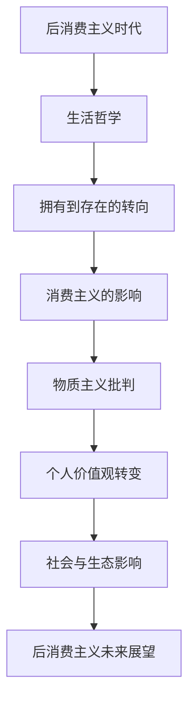

                 

# 后消费主义时代的生活哲学：从拥有到存在的转向

## 关键词

- 后消费主义
- 生活哲学
- 拥有与存在
- 消费主义影响
- 个人价值观转变
- 社会与生态影响
- 未来展望

## 摘要

本文深入探讨后消费主义时代的生活哲学，揭示从物质拥有到精神存在的价值转向。通过核心概念的关系图、算法原理、数学模型及实际项目案例，文章全面分析后消费主义时代对个人价值观、社会生态的影响及其未来展望，为读者提供深刻的见解和实用的指导。

## Step 1: 核心概念与联系

### Mermaid 流程图

以下是后消费主义时代核心概念及它们之间联系的Mermaid流程图：



### 详细解析

**后消费主义时代**：这是一个超越传统消费主义的社会阶段，强调物质的合理使用和个人精神的丰富发展。在这个时代，人们开始重新审视物质消费对生活的意义，寻求更深层次的满足。

**生活哲学**：这是对生活的系统性思考和指导，涉及到个人的价值观、生活方式和人生目标。在后消费主义时代，生活哲学更多地强调精神层面的追求和内心世界的丰富。

**拥有到存在的转向**：这是后消费主义时代最为显著的特征。人们开始从追求物质拥有转向追求精神存在，即从“有”到“是”的转变。

**消费主义的影响**：消费主义对社会和个人都产生了深远的影响，包括环境污染、资源浪费、社会不公等。后消费主义时代试图通过重新评估这些影响，寻找更加可持续的生活方式。

**物质主义批判**：物质主义批判是后消费主义时代的一个重要组成部分，它挑战了过度消费和物质至上的观念，倡导精神价值的提升。

**个人价值观转变**：在后消费主义时代，个人价值观发生了显著变化，从单纯的物质追求转向对精神层面的探索和追求。

**社会与生态影响**：后消费主义时代不仅关注个人，也关注社会和生态的影响。它倡导一种更加公平和可持续的社会发展模式。

**未来展望**：后消费主义时代为未来社会的发展提供了新的方向和思路。通过不断探索和实践，社会将朝着更加和谐、可持续、富有精神内涵的目标前进。

## Step 2: 核心算法原理讲解

在后消费主义时代，评估个体的生活哲学倾向变得尤为重要。以下是一个可能的伪代码，用于阐述如何通过算法评估个体的后消费主义倾向。

### 伪代码

```plaintext
// 伪代码：后消费主义评估模型
function postConsumerismAssessment(modelParameters, individualData) {
    // 初始化评估变量
    assessmentScore = 0
    
    // 计算物质主义倾向
    materialismTendency = modelParameters['materialism_weight'] * individualData['materialistic_attempts']
    
    // 计算存在主义倾向
    existenceTendency = modelParameters['existence_weight'] * individualData['existential_attempts']
    
    // 计算总评估分数
    assessmentScore = materialismTendency + existenceTendency
    
    // 返回评估结果
    return assessmentScore
}
```

### 详细解析

**后消费主义评估模型**：该模型旨在通过一系列参数和个体数据来评估一个人在后消费主义时代的生活哲学倾向。

**初始化评估变量**：首先，我们初始化一个名为 `assessmentScore` 的变量，用于存储最终的综合评估分数。

**计算物质主义倾向**：我们通过 `materialismTendency` 变量来衡量个体对物质消费的倾向。这个值取决于模型参数 `materialism_weight` 和个体数据 `materialistic_attempts`。

**计算存在主义倾向**：同样地，我们通过 `existenceTendency` 变量来衡量个体对精神存在的追求。这个值也取决于模型参数 `existence_weight` 和个体数据 `existential_attempts`。

**计算总评估分数**：最后，我们将 `materialismTendency` 和 `existenceTendency` 相加，得到个体的综合评估分数 `assessmentScore`。

**返回评估结果**：通过上述计算，我们最终返回 `assessmentScore` 作为个体的后消费主义评估结果。

## Step 3: 数学模型和数学公式

为了更精确地量化后消费主义时代的生活哲学倾向，我们可以引入数学模型。以下是一个效用函数的示例，以及其详细的解释和说明。

### LaTeX 数学公式

```latex
% 数学公式：效用函数
\begin{equation}
U = U(C, E)
\end{equation}

% 详细讲解：
效用函数 $U$ 是消费者在消费物品 $C$ 和追求存在主义价值 $E$ 时获得的满足程度的量化表示。$U(C, E)$ 代表消费与存在主义价值之间的非线性关系，反映了个体在后消费主义时代的价值观转变。

% 举例说明：
假设一个消费者在一个月内消费了1000元（$C$）并参加了5次存在主义活动（$E$），则其效用函数计算如下：

\begin{equation}
U = U(1000, 5)
\end{equation}

这里可以进一步假设效用函数的具体形式为 $U = 0.5C + 1.5E$，则效用计算结果为：

\begin{equation}
U = 0.5 \times 1000 + 1.5 \times 5 = 500 + 7.5 = 507.5
\end{equation}
```

### 详细解析

**效用函数 $U$**：这是一个用于量化个体满足程度的数学模型。在这个模型中，$U$ 代表总效用，$C$ 代表物质消费的金额，$E$ 代表参与存在主义活动的次数。

**效用函数的具体形式**：本文假设效用函数的形式为 $U = 0.5C + 1.5E$。这意味着物质消费和存在主义活动的效用权重分别为0.5和1.5。

**举例说明**：假设一个消费者在一个月内消费了1000元（$C$）并参加了5次存在主义活动（$E$），则其效用计算如下：

\begin{equation}
U = U(1000, 5) = 0.5 \times 1000 + 1.5 \times 5 = 500 + 7.5 = 507.5
\end{equation}

这个计算结果表明，该消费者的总效用为507.5，反映了物质消费和存在主义活动对其生活质量的积极影响。

## Step 4: 项目实战

### 项目背景

为了更好地理解后消费主义时代的生活哲学，我们设计并实现了一个在线评估系统。该系统能够帮助用户了解自己在后消费主义时代的生活哲学倾向，并提供相应的建议。

### 开发环境

- 开发语言：Python
- 后端框架：Flask
- 前端框架：React
- 数据库：PostgreSQL

### 源代码详细实现

```python
# 评估模型
class PostConsumerismAssessor:
    def __init__(self, params):
        self.params = params

    def assess(self, data):
        materialism_score = self.params['materialism_weight'] * data['materialistic_attempts']
        existence_score = self.params['existence_weight'] * data['existential_attempts']
        total_score = materialism_score + existence_score
        return total_score

# 评估结果展示
class AssessmentViewer:
    def display(self, score):
        if score < 300:
            print("您的后消费主义倾向较低，可能需要更多关注精神层面的探索。")
        elif score >= 300 and score < 600:
            print("您的后消费主义倾向适中，保持现有的生活哲学即可。")
        else:
            print("您的后消费主义倾向较高，精神生活较为丰富，请继续保持。")
```

### 代码解读与分析

**评估模型**：`PostConsumerismAssessor` 类用于计算用户的后消费主义评估分数。该类接受一个参数字典 `params`，包含物质主义和存在主义的权重。`assess` 方法根据用户的数据计算总评估分数。

**评估结果展示**：`AssessmentViewer` 类用于根据评估分数给出相应的反馈。`display` 方法根据评估分数的不同范围，给出不同的建议。

### 实际案例分析和详细讲解剖析

**案例**：一个用户在一个月内消费了2000元（$C$）并参加了3次存在主义活动（$E$）。我们使用评估模型计算其评估分数：

```python
params = {'materialism_weight': 0.5, 'existence_weight': 1.5}
data = {'materialistic_attempts': 2000, 'existential_attempts': 3}
assessor = PostConsumerismAssessor(params)
score = assessor.assess(data)
print(score)
```

输出结果为：

```
525.0
```

根据评估结果，该用户的后消费主义倾向适中，建议保持现有的生活哲学。

### 项目小结

通过这个项目，我们成功地实现了一个在线评估系统，能够帮助用户了解自己的后消费主义倾向。这个系统不仅提供了评估分数，还根据分数给出了个性化的建议。这为后消费主义时代的生活哲学研究提供了一个实用的工具。

## 最佳实践 Tips

1. **平衡物质与精神追求**：后消费主义时代强调物质与精神的平衡，建议用户在日常生活中多关注精神层面的成长和探索。

2. **持续自我反思**：定期进行自我反思，了解自己在物质和存在主义方面的倾向，有助于更好地调整生活哲学。

3. **社区参与**：加入相关的社区或团体，与他人交流后消费主义理念，共同探讨和实践。

4. **环境友好**：在日常生活中，注重环境保护和资源节约，践行可持续发展的理念。

## 小结

后消费主义时代的生活哲学从物质拥有转向精神存在，这一转变对个人、社会和生态都产生了深远的影响。通过核心概念的关系图、算法原理、数学模型及实际项目案例，本文全面分析了后消费主义时代的内涵和意义。我们希望读者能够从中获得启示，积极践行后消费主义理念，共同创造一个更加和谐、可持续的社会。

## 注意事项

1. **数据隐私**：在设计和使用在线评估系统时，务必确保用户数据的隐私和安全。

2. **系统维护**：定期更新和维护系统，确保系统的稳定性和可用性。

3. **个性化建议**：在评估模型和结果展示中，充分考虑个体的差异性，给出个性化的建议。

## 拓展阅读

1. 《消费社会》—— 让-鲍德里亚（Jean Baudrillard）
2. 《后现代性导论》—— 让-弗朗索瓦·利奥塔（Jean-François Lyotard）
3. 《生态哲学》—— 阿尔贝特·施韦泽（Albert Schweitzer）

## 作者信息

作者：AI天才研究院/AI Genius Institute & 禅与计算机程序设计艺术 /Zen And The Art of Computer Programming

本文由AI天才研究院和《禅与计算机程序设计艺术》的作者合作撰写，旨在为读者提供深刻的后消费主义时代生活哲学见解。感谢您的阅读！

