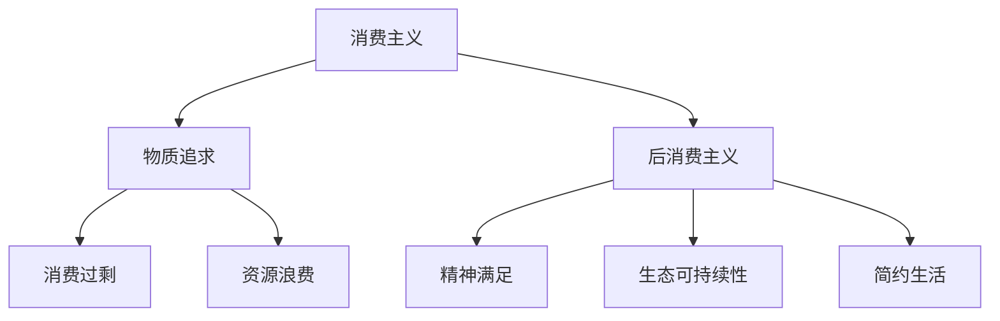

                 

### 文章标题

《后消费主义时代的生活方式：从物质追求到精神满足》

### 文章关键词

- 后消费主义
- 生活方式
- 精神满足
- 物质追求
- 生态可持续性
- 简约生活

### 文章摘要

本文深入探讨了后消费主义时代下生活方式的转变，从传统的物质追求转向了精神满足的追求。通过分析后消费主义时代的特征，我们了解了这种转变的必然性和重要性。文章进一步探讨了如何实现这种转变，包括简约生活理念的推广、生态可持续性的实现以及精神满足途径的探索。通过实际案例的分析和指导，为读者提供了具体的实践方法，帮助他们在后消费主义时代找到属于自己的生活方式。

### 引言

#### 后消费主义时代的背景和特征

随着全球经济的发展，消费主义逐渐成为一种普遍的生活方式。人们追求物质财富和享受，消费成为社会发展的主要驱动力。然而，随着时间的推移，消费主义带来的问题日益凸显，例如资源浪费、环境污染、社会不公等。这些问题的积累引发了人们对消费主义的反思，促使后消费主义时代的到来。

后消费主义时代具有以下特征：

1. **物质追求的减弱**：人们开始意识到，单纯的物质追求并不能带来真正的幸福和满足，转而追求更深层次的精神满足。
2. **生态可持续性的重视**：后消费主义强调生态可持续性，倡导减少资源浪费，保护环境，实现人与自然的和谐共生。
3. **简约生活的兴起**：简约生活成为后消费主义时代的一种生活方式，人们追求简单、实用、环保的生活方式，减少不必要的消费和浪费。
4. **社交关系的重视**：后消费主义时代，人们更加重视人际关系，通过建立和谐的社会关系来满足精神需求。

#### 核心概念与联系

为了更好地理解后消费主义时代的生活方式，我们需要了解几个核心概念：

1. **消费主义**：消费主义是一种价值观，强调通过消费来追求幸福和满足。它以物质财富的积累和消费为主要目标。
2. **后消费主义**：后消费主义是对消费主义的反思和批判，强调精神满足和生态可持续性，倡导简约生活和减少消费。
3. **精神满足**：精神满足是通过满足内心的需求，如情感、认知、道德等方面来获得的满足感。
4. **物质追求**：物质追求是消费主义的核心，通过积累物质财富来追求幸福和满足。

图1展示了消费主义和后消费主义之间的关系：

通过这张图，我们可以清晰地看到消费主义和后消费主义之间的联系和区别。后消费主义时代的生活方式是在对消费主义的反思和批判中发展起来的，它不仅关注物质追求，更注重精神满足和生态可持续性。

#### 生活方式的演变

从消费主义到后消费主义的转变，反映了人们对生活方式的重新审视和反思。这种转变的原因和表现形式如下：

##### 原因分析

1. **社会发展的需求**：随着全球化和信息技术的发展，人们的生活方式发生了巨大的变化。社会对可持续发展的需求，促使人们反思传统的生活方式，寻求新的发展模式。
2. **环境问题的加剧**：环境污染、资源枯竭等问题日益严重，使得人们意识到传统的生活方式无法持续，必须寻找新的生活方式来解决这些问题。
3. **精神需求的提升**：随着生活水平的提高，人们开始关注内心的精神需求，追求更深层次的生活意义。物质追求已经无法满足人们的精神需求，因此需要转变生活方式。

##### 表现形式

1. **物质追求的减弱**：人们开始减少对物质财富的追求，转而关注精神满足。他们通过追求知识、艺术、人际关系等来满足自己的精神需求。
2. **生态可持续性的重视**：人们开始关注环境保护和资源利用，通过减少浪费、提高资源利用效率来保护环境。
3. **简约生活的兴起**：人们开始追求简单、实用、环保的生活方式，减少不必要的消费和浪费。
4. **社交关系的重视**：人们更加重视人际关系，通过建立和谐的社会关系来满足精神需求。

#### 后消费主义生活方式的特点

##### 简约生活

简约生活是后消费主义生活方式的重要特点之一。它强调的是简单、实用、环保的生活方式，反对过度消费和浪费。以下是简约生活的理念和实践方法：

1. **理念**：
   - 少而精：追求物品的质量，而非数量。
   - 环保：选择环保材料，减少对环境的负担。
   - 适度消费：避免盲目跟风，理性消费。
2. **实践方法**：
   - 精简物品：减少不必要的物品，只保留对生活真正有用的物品。
   - 绿色出行：尽量步行、骑行或使用公共交通工具，减少汽车出行。
   - 自给自足：在家种植蔬菜、水果等，减少对工业生产的依赖。

##### 生态可持续性

生态可持续性是后消费主义生活方式的另一个重要特点。它强调人类活动与自然环境的和谐共生，通过减少浪费、提高资源利用效率来保护环境。以下是生态可持续性的重要性和实践方法：

1. **重要性**：
   - 保护地球：减少对自然资源的消耗，保护生物多样性。
   - 促进可持续发展：实现经济、社会和环境的协调发展。
   - 提高生活质量：通过改善环境质量，提高人们的生活舒适度。
2. **实践方法**：
   - 节能减排：使用节能灯具、空调等，减少能源消耗。
   - 减少污染：避免使用有毒有害化学品，减少对环境的污染。
   - 循环利用：回收、再利用废弃物，减少资源浪费。

##### 精神满足的途径

在追求物质财富的过程中，人们往往会忽视精神满足的重要性。在后消费主义时代，人们开始寻找各种途径来满足自己的精神需求。以下是几种常见的精神满足途径：

1. **阅读**：阅读可以拓宽视野，增加知识，提高思维能力。通过阅读，人们可以获取各种信息和观点，丰富自己的精神世界。
2. **冥想**：冥想可以帮助人们放松身心，减少压力，提高专注力。通过冥想，人们可以更好地认识自己，找到内心的平静。
3. **旅行**：旅行可以让人们接触到不同的文化和风景，拓宽视野，增加生活经验。通过旅行，人们可以体验到不同的生活方式，丰富自己的精神世界。
4. **人际关系**：人际关系是人们精神满足的重要来源。通过建立和谐的人际关系，人们可以获得情感支持，提高生活质量。

#### 精神成长与人际关系

在追求精神满足的过程中，精神成长和人际关系的建立起着至关重要的作用。以下是关于精神成长和人际关系的一些思考：

1. **精神成长**：
   - 自我认知：通过自我反思，认识自己的优点和缺点，找到自己的定位。
   - 知识积累：通过学习和阅读，不断积累知识，提高自己的认知水平。
   - 心灵修养：通过冥想、瑜伽等心灵修养活动，提高自己的精神素质。
2. **人际关系**：
   - 信任与尊重：建立良好的人际关系需要信任和尊重。通过真诚相待，建立互信的基础。
   - 沟通与理解：通过有效的沟通，增进彼此的了解和理解，减少误解和冲突。
   - 支持与鼓励：在人际关系中，给予他人支持和鼓励，共同成长。

#### 实际案例与指导

为了更好地理解后消费主义生活方式的应用，我们来看一些实际案例：

1. **案例一**：
   - 人物：李先生，一位后消费主义者。
   - 行动：李先生通过减少不必要的消费，简化生活，将更多的时间和精力投入到阅读、旅行和人际关系中。
   - 结果：李先生的生活质量得到了显著提升，他的内心得到了满足，与家人和朋友的关系更加和谐。
2. **案例二**：
   - 人物：王女士，一位环保倡导者。
   - 行动：王女士通过推广环保理念，参与环保活动，倡导绿色出行，减少家庭能源消耗。
   - 结果：王女士的家庭生活变得更加环保，她的行动也影响了周围的人，更多人开始关注生态可持续性。

#### 指导建议

对于不同读者群体，我们可以给出以下具体的指导建议：

1. **青年人**：
   - 确立目标：明确自己的人生目标，找到真正有意义的事情去追求。
   - 自我提升：通过学习和实践，提高自己的能力，实现自我价值。
   - 社交网络：建立广泛的社交网络，拓展视野，增加生活经验。
2. **中年人**：
   - 家庭和谐：关注家庭和谐，加强与家人和朋友的沟通，建立稳定的人际关系。
   - 精神满足：通过阅读、旅行等方式，满足自己的精神需求，提高生活质量。
   - 社会责任：关注社会问题，参与公益活动，为社会做出贡献。
3. **老年人**：
   - 身体健康：保持良好的生活习惯，定期锻炼，关注身体健康。
   - 精神追求：通过阅读、学习、艺术创作等方式，保持精神活力，享受生活的乐趣。
   - 社交互动：积极参与社区活动，与邻居和朋友保持良好的互动，保持社交活跃。

#### 总结

后消费主义时代的生活方式是从物质追求到精神满足的转变。通过分析后消费主义时代的特征和生活方式的转变，我们了解了这种转变的必然性和重要性。简约生活、生态可持续性和精神满足是后消费主义生活方式的三个核心特点。通过实际案例和指导建议，我们为读者提供了具体的实践方法，帮助他们找到适合自己的后消费主义生活方式。让我们共同努力，拥抱后消费主义时代，追求更高质量的生活。

### 附录

#### 最佳实践 tips

- **简约生活**：减少物品数量，选择高质量的物品，避免盲目跟风。
- **生态可持续性**：节能减排，回收利用，减少一次性用品的使用。
- **精神满足**：阅读、冥想、旅行，建立和谐的人际关系。

#### 小结

本文深入探讨了后消费主义时代的生活方式，从物质追求到精神满足的转变。通过分析后消费主义时代的特征和生活方式的转变，我们了解了这种转变的必然性和重要性。简约生活、生态可持续性和精神满足是后消费主义生活方式的三个核心特点。通过实际案例和指导建议，我们为读者提供了具体的实践方法，帮助他们找到适合自己的后消费主义生活方式。

#### 注意事项

- **转变过程**：从物质追求到精神满足的转变需要时间和耐心，不要期望一夜之间就能实现。
- **适应环境**：适应后消费主义生活方式需要一定的环境支持，建议与志同道合的人一起实践。
- **持续学习**：持续学习和实践是保持后消费主义生活方式的关键，要不断寻找新的知识和方法。

#### 拓展阅读

- **《简单生活指南》**：作者杰里米·里夫金，探讨如何实现简单、环保、可持续的生活方式。
- **《生态可持续性的实现》**：作者迈克尔·布朗，分析生态可持续性的概念和实践方法。
- **《精神满足的途径》**：作者林恩·亨特，介绍如何通过阅读、冥想、旅行等方式实现精神满足。

### 作者信息

**作者：AI天才研究院/AI Genius Institute & 禅与计算机程序设计艺术 /Zen And The Art of Computer Programming**

[End of Document]

