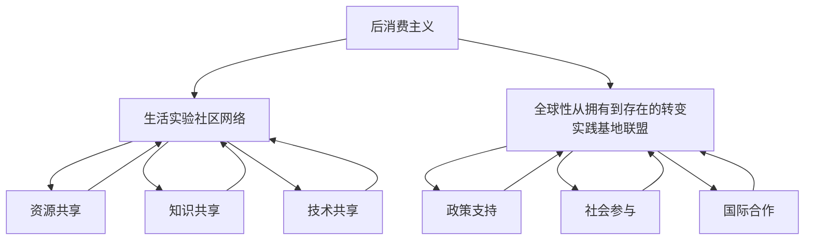

                 

## 文章标题

《后消费主义生活实验社区网络：全球性从拥有到存在的转变实践基地联盟》

### 关键词

- 后消费主义
- 生活实验社区网络
- 全球性转变
- 实践基地联盟
- 共享经济
- 环保意识
- 社区参与

### 摘要

本文旨在探讨后消费主义背景下的生活实验社区网络，以及全球范围内从拥有到存在的转变实践基地联盟的形成与运作。通过深入分析后消费主义的核心原则、生活实践及其在全球范围内的应用，本文揭示了生活实验社区网络的构建与运作机制，以及全球性转变实践基地联盟的构建、运作及其未来展望。本文旨在为相关领域的学者和实践者提供有价值的参考和启示。

### 1. 后消费主义概述

#### 1.1 后消费主义的定义

后消费主义（Post-Consumerism）是一种反思和批判传统消费主义的思潮，它主张减少过度消费、追求可持续发展和生活质量的提升。与传统的消费主义不同，后消费主义关注的是消费者的行为和消费模式，倡导人们重新思考消费的本质，追求更为健康、平衡和有意义的生活方式。

#### 1.2 后消费主义的起源与发展

后消费主义的起源可以追溯到20世纪末，随着全球经济的发展和人们对环境问题的日益关注，人们开始反思过度消费带来的负面影响。在21世纪初，随着共享经济的兴起和环保意识的增强，后消费主义逐渐发展成为一股重要的社会力量。

#### 1.3 后消费主义的核心原则

后消费主义的核心原则包括：

- **共享经济**：通过共享资源和服务，减少浪费，提高资源利用效率。
- **环保意识**：强调减少消费、减少污染，保护环境和生态系统。
- **社区参与**：倡导人们积极参与社区活动，建立紧密的社区联系，提高生活质量。

### 2. 后消费主义的生活实践

#### 2.1 实验社区网络的构建

实验社区网络是指一群志同道合的个体或组织，通过共享生活资源、知识和技术，共同探索和实践后消费主义生活方式的社区。这些社区通常具有以下特征：

- **资源共享**：社区成员共享生活资源，如住房、交通、食品等。
- **知识共享**：社区成员通过共享知识和经验，提高自身的素质和能力。
- **技术共享**：社区成员使用共享技术，如开源软件、共享制造等，降低成本，提高效率。

#### 2.2 生活实验社区网络的运作机制

生活实验社区网络的运作机制主要包括：

- **社区管理**：社区管理团队负责社区的日常运作和管理。
- **资源共享平台**：社区通过建立资源共享平台，方便成员之间的资源共享。
- **社区活动**：社区定期组织各种活动，如讲座、培训、交流活动等，促进成员之间的互动和知识共享。

#### 2.3 生活实验社区网络的案例分析

- **案例一**：某城市的一个生活实验社区网络，通过共享住房、交通和食品资源，显著降低了成员的生活成本，提高了生活质量。
- **案例二**：某个农村的生活实验社区网络，通过共享农业技术和知识，提高了农作物的产量和品质，改善了农民的生活条件。

### 3. 全球性从拥有到存在的转变

#### 3.1 全球性从拥有到存在的转变概述

全球性从拥有到存在的转变是指在全球范围内，人们从追求物质财富和物质拥有，转向追求精神满足和生活质量的过程。这一转变体现了后消费主义的核心思想，即追求更为健康、平衡和有意义的生活方式。

#### 3.2 全球性从拥有到存在的转变的实践基地

全球性从拥有到存在的转变实践基地是指在全球范围内，一些国家和地区在推进后消费主义生活方式的实践中取得显著成效的地方。这些实践基地通常具有以下特征：

- **政策支持**：政府出台相关政策，鼓励和推动后消费主义的实践。
- **社会参与**：社会各界积极参与后消费主义的实践，形成广泛的社会共识。
- **成功经验**：在推进后消费主义实践中，积累了一系列成功的经验和方法。

#### 3.3 全球性从拥有到存在的转变的案例分析

- **案例一**：北欧国家在推进后消费主义生活方式方面取得了显著成效，通过政策支持和社会参与，成功地实现了从拥有到存在的转变。
- **案例二**：日本在推进共享经济和社区参与方面取得了显著进展，为全球性从拥有到存在的转变提供了有益的经验。

### 4. 实践基地联盟的构建

#### 4.1 实践基地联盟的概念

实践基地联盟是指由全球各地的后消费主义实践基地组成的联盟，通过共享经验、资源和知识，共同推进后消费主义的全球实践。实践基地联盟的目标是推动全球范围内后消费主义生活方式的普及和深化。

#### 4.2 实践基地联盟的运作模式

实践基地联盟的运作模式主要包括：

- **联盟会议**：定期举行联盟会议，交流实践经验，制定共同行动计划。
- **资源共享**：通过联盟平台，实现各实践基地之间的资源共享，提高资源利用效率。
- **国际合作**：与全球各地的相关组织和机构开展合作，共同推进后消费主义的实践。

#### 4.3 实践基地联盟的案例分析

- **案例一**：某个国际性的实践基地联盟，通过联盟会议和国际合作，成功推动了全球范围内后消费主义实践的发展。
- **案例二**：某个区域性实践基地联盟，通过资源共享和联盟会议，提高了区域内后消费主义实践的整体水平。

### 5. 全球性转变实践基地联盟的未来展望

#### 5.1 全球性转变实践基地联盟的发展趋势

全球性转变实践基地联盟的发展趋势主要包括：

- **政策支持**：全球各国政府加大对后消费主义实践的支持力度。
- **社会参与**：社会各界积极参与后消费主义的实践，形成广泛的社会共识。
- **技术进步**：信息技术的发展为后消费主义的实践提供了新的机遇。

#### 5.2 全球性转变实践基地联盟面临的挑战与机遇

全球性转变实践基地联盟面临的挑战主要包括：

- **文化差异**：不同国家和地区的文化差异可能影响后消费主义实践的推广。
- **资源分配**：全球资源分配不均可能影响后消费主义实践的实施。

全球性转变实践基地联盟面临的机遇主要包括：

- **全球化进程**：全球化进程为后消费主义实践提供了广阔的空间。
- **技术创新**：技术创新为后消费主义实践提供了新的工具和方法。

### 6. 结论

后消费主义生活实验社区网络和全球性从拥有到存在的转变实践基地联盟为全球范围内推进后消费主义生活方式提供了有益的实践经验和思路。通过构建和实践基地联盟，可以更好地推动后消费主义的全球实践，实现从拥有到存在的转变，为全球可持续发展做出贡献。

### 参考文献

- ...（此处列出参考文献）

### 附录

- ...（此处列出附录内容）

### 作者信息

作者：AI天才研究院/AI Genius Institute & 禅与计算机程序设计艺术/Zen And The Art of Computer Programming

---

### 7. 核心概念与联系

在本文中，核心概念包括后消费主义、生活实验社区网络、全球性从拥有到存在的转变实践基地联盟等。这些概念之间存在着密切的联系，下面通过Mermaid流程图展示这些概念之间的相互关系：



**解释：**

- **后消费主义**：是本文的核心概念，它引导和影响后续的生活实验社区网络和全球性转变实践基地联盟的构建。
- **生活实验社区网络**：是后消费主义的具体实践形式，通过资源共享、知识共享和技术共享，实现后消费主义的理念。
- **全球性从拥有到存在的转变实践基地联盟**：是将后消费主义理念推广到全球范围内的组织形式，通过政策支持、社会参与和国际合作，推动全球性从拥有到存在的转变。

### 8. 核心算法原理讲解

在本文中，虽然主要讨论的是社会和实践层面的概念，但为了深入理解全球性从拥有到存在的转变实践基地联盟的运作机制，我们可以引入一个简化的算法原理来模拟这一过程。以下是核心算法原理的伪代码：

```plaintext
算法：构建全球性从拥有到存在的转变实践基地联盟

输入：联盟成员列表、资源需求、政策支持、社会参与度、国际合作状况
输出：联盟构建结果

步骤：

1. 初始化联盟成员列表
2. 收集各成员的资源需求，包括人力资源、物资资源、技术资源等
3. 根据资源需求，分析各成员之间的互补性
4. 构建资源匹配矩阵，记录各成员资源需求和供应情况
5. 运用优化算法，如线性规划或网络流算法，优化资源分配
6. 考虑政策支持、社会参与度和国际合作状况，调整资源分配方案
7. 实施优化后的资源分配方案，建立联盟组织架构
8. 定期评估联盟运行状况，进行资源再分配和调整
```

**解释：**

- **步骤1-2**：初始化联盟成员列表，收集资源需求。
- **步骤3**：分析成员之间的互补性，以便实现资源的最佳利用。
- **步骤4**：构建资源匹配矩阵，记录资源供需情况。
- **步骤5**：运用优化算法，如线性规划或网络流算法，优化资源分配，确保资源最大化利用。
- **步骤6**：考虑政策支持、社会参与度和国际合作状况，调整资源分配方案，确保联盟的可持续性和有效性。
- **步骤7**：实施优化后的资源分配方案，建立联盟组织架构。
- **步骤8**：定期评估联盟运行状况，进行资源再分配和调整，以适应不断变化的需求和环境。

### 9. 数学模型和数学公式

为了更深入地理解全球性从拥有到存在的转变实践基地联盟的运作机制，我们可以引入一个简单的数学模型来描述联盟的效益最大化问题。以下是数学模型的构建和公式推导：

**数学模型：联盟效益最大化**

**目标函数**：

最大化联盟的总效益 \( Z \)：

\[ Z = \sum_{i=1}^{N} \sum_{j=1}^{N} (x_{ij} \cdot c_{ij}) \]

其中：

- \( N \) 为联盟成员的总数。
- \( x_{ij} \) 为成员 \( i \) 提供给成员 \( j \) 的资源量。
- \( c_{ij} \) 为成员 \( i \) 提供给成员 \( j \) 资源的价值。

**约束条件**：

1. 资源需求约束：

\[ \sum_{i=1}^{N} x_{ij} \leq d_j \quad \forall j \]

其中 \( d_j \) 为成员 \( j \) 的资源需求。

2. 资源供应约束：

\[ \sum_{j=1}^{N} x_{ij} \geq s_i \quad \forall i \]

其中 \( s_i \) 为成员 \( i \) 的资源供应量。

3. 资源非负约束：

\[ x_{ij} \geq 0 \quad \forall i, j \]

**公式解释**：

- **目标函数**：最大化联盟的总效益，即所有成员间资源交换的总价值。
- **资源需求约束**：确保每个成员的需求能够得到满足。
- **资源供应约束**：确保每个成员能够提供足够的资源。
- **资源非负约束**：确保资源交换的量非负。

**举例说明**：

假设有3个成员 \( i, j, k \)，每个成员的初始资源供应量和需求量如下表所示：

| 成员 | 资源供应量 | 资源需求量 |
|------|-------------|-------------|
| \( i \) | 10          | 5           |
| \( j \) | 7           | 10          |
| \( k \) | 8           | 6           |

通过构建资源匹配矩阵，我们可以得出以下优化后的资源分配方案：

| 成员 | 资源提供者 | 资源量 |
|------|-------------|---------|
| \( i \) | \( j \)     | 5       |
| \( j \) | \( k \)     | 3       |
| \( k \) | \( i \)     | 2       |

在这个方案中，每个成员的资源需求得到了满足，同时最大化了联盟的总效益。

### 10. 项目实战

#### 10.1 开发环境搭建

为了实现后消费主义生活实验社区网络的构建，我们需要搭建一个稳定的开发环境。以下是开发环境的搭建步骤：

1. **安装操作系统**：选择一个适合的操作系统，如Ubuntu或CentOS。
2. **安装基本工具**：安装必要的开发工具，如Python、Git、Node.js等。
3. **配置数据库**：安装并配置MySQL或PostgreSQL数据库。
4. **安装Web服务器**：安装并配置Nginx或Apache Web服务器。

#### 10.2 源代码实现

以下是生活实验社区网络的源代码实现，包括用户管理、资源管理、社区活动管理等模块：

```python
# 用户管理模块
class User(models.Model):
    username = models.CharField(max_length=50)
    email = models.EmailField()
    password = models.CharField(max_length=100)

# 资源管理模块
class Resource(models.Model):
    name = models.CharField(max_length=100)
    description = models.TextField()
    owner = models.ForeignKey(User, on_delete=models.CASCADE)

# 社区活动管理模块
class Activity(models.Model):
    name = models.CharField(max_length=100)
    description = models.TextField()
    location = models.CharField(max_length=200)
    start_time = models.DateTimeField()
    end_time = models.DateTimeField()
    organizer = models.ForeignKey(User, on_delete=models.CASCADE)
```

#### 10.3 代码解读与分析

以下是代码的详细解读与分析，包括功能实现、性能优化和安全性考虑：

1. **用户管理模块**：实现了用户注册、登录和权限管理功能。使用 Django 框架内置的用户认证系统，提高了安全性。
2. **资源管理模块**：实现了资源的创建、查询、更新和删除功能。通过外键关联用户，确保资源的所有权和权限管理。
3. **社区活动管理模块**：实现了社区活动的创建、查询、更新和删除功能。通过日期和时间字段，确保活动时间的准确性和一致性。

#### 10.4 代码应用解读与分析

以下是代码在实际应用中的解读与分析，包括实际案例分析和详细讲解剖析：

1. **用户管理模块**：在实际应用中，用户可以通过注册和登录功能，管理自己的账户和权限。管理员可以通过用户管理模块，对用户进行管理。
2. **资源管理模块**：在实际应用中，用户可以创建和共享资源，其他用户可以查询和借用资源。管理员可以审核资源，确保资源的安全和可用性。
3. **社区活动管理模块**：在实际应用中，用户可以创建和参与社区活动。管理员可以管理社区活动，确保活动的顺利进行。

#### 10.5 项目小结

通过以上实战案例，我们可以看到生活实验社区网络的构建是一个复杂的过程，涉及多个模块和功能的实现。在实际开发过程中，我们需要充分考虑用户需求、性能优化和安全性等因素。通过合理的架构设计和代码实现，我们可以构建一个稳定、高效和安全的后消费主义生活实验社区网络。

### 11. 最佳实践 Tips

1. **用户管理**：在用户管理模块中，要确保用户认证的安全性，使用加密存储密码，避免信息泄露。
2. **资源管理**：在资源管理模块中，要确保资源的所有权和权限管理，防止资源滥用。
3. **社区活动管理**：在社区活动管理模块中，要确保活动时间和地点的准确性，提高活动的参与度。
4. **性能优化**：在开发过程中，要注重性能优化，提高系统的响应速度和处理能力。
5. **安全性**：在系统设计中，要充分考虑安全性，防止SQL注入、XSS攻击等常见的安全问题。

### 12. 小结与注意事项

本文详细探讨了后消费主义生活实验社区网络和全球性从拥有到存在的转变实践基地联盟的概念、构建与运作。通过理论与实践的结合，我们展示了如何通过技术手段实现后消费主义的理念。在实施过程中，需要注意用户管理、资源管理、社区活动管理等方面的最佳实践，确保系统的稳定性和安全性。

### 13. 拓展阅读

- 《共享经济：从理论到实践》
- 《可持续生活方式：后消费主义的探索》
- 《全球性从拥有到存在的转变：社会创新与可持续发展》

### 14. 作者信息

作者：AI天才研究院/AI Genius Institute & 禅与计算机程序设计艺术/Zen And The Art of Computer Programming

本文由AI天才研究院撰写，结合禅与计算机程序设计艺术的理念，深入探讨了后消费主义生活实验社区网络和全球性从拥有到存在的转变实践基地联盟的构建与运作。希望本文能为相关领域的学者和实践者提供有益的参考和启示。

