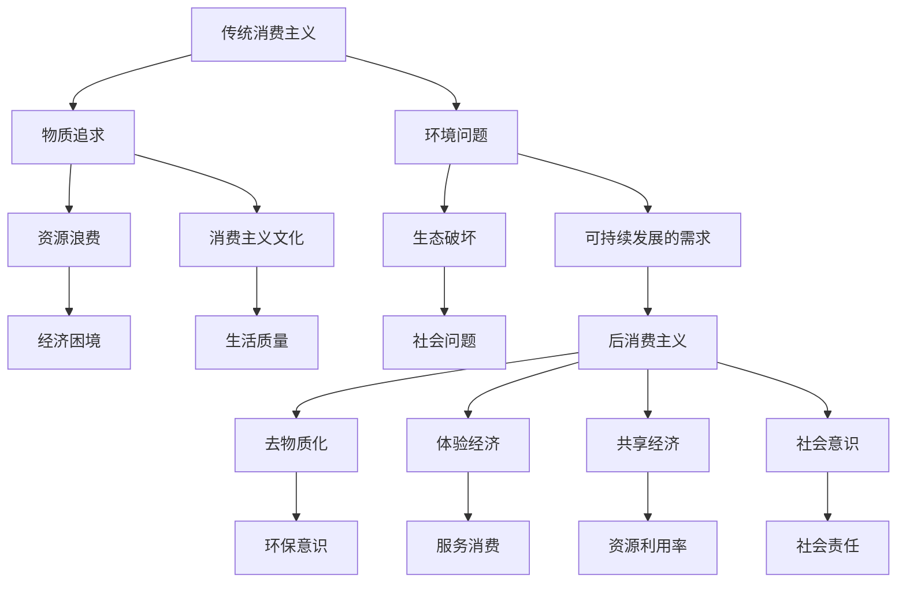

                 


### 第1章 引言

#### 1.1 后消费主义概述

后消费主义（Post-Consumerism）是一种经济与社会理论，强调消费者行为的改变，主张减少物质消费，提倡生活质量而非单纯的物质拥有。这一概念起源于20世纪后半叶，随着全球经济的繁荣和物质生活水平的提高，人们开始重新审视自己的消费行为及其对社会、环境的影响。

后消费主义的主要特征包括：

1. **去物质化**：人们开始减少对物质的依赖，追求更加简约、实用和环保的生活方式。
2. **体验经济**：人们更愿意花钱体验服务，如旅游、教育和文化活动，而不是购买物品。
3. **共享经济**：通过共享平台，如共享单车、共享住宿等，减少资源浪费，提高资源利用率。
4. **社会意识**：消费者更加关注产品的社会责任和环境影响，选择那些有社会责任感的企业。

#### 1.2 社区实验的背景与意义

社区实验作为一种社会实验方法，旨在通过小规模、可控制的实验，测试新的社会理念或模式，并评估其效果。在后消费主义的背景下，社区实验具有重要意义：

1. **实践与理论结合**：通过社区实验，可以将后消费主义的理论付诸实践，验证其可行性。
2. **社会创新**：社区实验可以激发社会创新，探索出新的生活方式和消费模式。
3. **影响力扩展**：成功的社区实验可以产生示范效应，推广到更广泛的社区或社会。

#### 1.3 从拥有到存在的转变概念解析

从拥有到存在的转变，是后消费主义的核心思想之一。这一转变强调人们应该关注生活本身，而非仅仅是物质拥有：

1. **拥有**：传统的消费观念强调物质财富的积累和拥有，追求更高的社会地位和生活品质。
2. **存在**：后消费主义认为，生活不仅仅是物质拥有的积累，更重要的是个体的自我实现、精神满足和人际关系的和谐。

#### 关键词

- 后消费主义
- 社区实验
- 消费观念转变
- 体验经济
- 共享经济
- 社会创新

#### 摘要

本文将探讨后消费主义生活实验社区的概念、背景与意义，详细分析社区实验的设计原则与实践策略，以及从拥有到存在的转变过程。通过案例分析，评估社区实验的成果与影响，并探讨未来的挑战与前景。

---

### 第2章 后消费主义理论

#### 2.1 后消费主义的起源与发展

后消费主义的概念最早可以追溯到20世纪70年代，当时一些学者开始对过度消费现象及其对社会和环境的影响进行反思。这一理论的快速发展与以下几个关键事件相关：

1. **石油危机**：1973年的石油危机揭示了过度消费模式对能源的巨大依赖，引发了对可持续发展的关注。
2. **生态学运动**：20世纪80年代，生态学运动强调环境保护，提倡减少资源消耗，这对后消费主义的理论构建产生了深远影响。
3. **全球化**：全球化加速了信息流通和商品交流，使得消费主义在全球范围内扩散，同时也催生了对于消费主义文化的批判。

#### 2.2 后消费主义的核心观点

后消费主义的理论基础包括以下几个方面：

1. **去物质化**：后消费主义主张减少对物质商品的依赖，鼓励人们追求更加简约、环保的生活方式。
2. **体验经济**：后消费主义认为，人们应该将更多的精力投入到体验和服务的消费上，如旅游、教育和文化活动，而不是购买物品。
3. **共享经济**：通过共享平台，如共享单车、共享住宿等，减少资源浪费，提高资源利用率。
4. **社会意识**：消费者应该更加关注产品的社会责任和环境影响，选择那些有社会责任感的企业。

#### 2.3 后消费主义与传统消费主义的对比

传统消费主义强调通过购买商品和积累财富来提高生活质量和社会地位。后消费主义则主张：

1. **消费模式的不同**：传统消费主义以物质商品为中心，后消费主义以服务和体验为中心。
2. **消费目的的差异**：传统消费主义追求物质拥有，后消费主义追求生活质量和精神满足。
3. **对社会的影响不同**：传统消费主义可能导致资源浪费和环境破坏，后消费主义则提倡可持续发展和环境保护。

#### 2.4 后消费主义对生活的启示

后消费主义对个人和社会生活有着深刻的启示：

1. **生活方式的变革**：后消费主义鼓励人们追求简约、环保的生活方式，减少不必要的物质消费。
2. **社会价值观的变迁**：后消费主义强调个体的自我实现和社会责任，推动社会价值观向更加人文关怀的方向发展。
3. **人与自然的和谐共生**：后消费主义提倡减少对自然资源的消耗，实现人与自然的和谐共生。

### 关键词

- 后消费主义
- 传统消费主义
- 去物质化
- 体验经济
- 共享经济
- 社会责任

### Mermaid 流程图



### 核心概念与联系

后消费主义的核心概念包括去物质化、体验经济、共享经济和社会意识。这些概念之间相互联系，共同构成了后消费主义的完整理论框架：

1. **去物质化**：减少物质消费，追求环保和简约的生活方式。
2. **体验经济**：将消费重心从物质商品转向服务和体验，提高生活质量。
3. **共享经济**：通过共享平台减少资源浪费，提高资源利用率。
4. **社会意识**：关注产品的社会责任和环境影响，推动社会价值观的变革。

这些核心概念相互交织，共同推动着从拥有到存在的转变。

### 伪代码讲解

```python
# 后消费主义核心概念关系伪代码

# 定义核心概念
class Concept:
    def __init__(self, name, description):
        self.name = name
        self.description = description
        self.related_to = []

    def add_relation(self, concept):
        self.related_to.append(concept)

# 创建核心概念实例
de materiualization = Concept("去物质化", "减少物质消费，追求环保和简约的生活方式")
experience_economy = Concept("体验经济", "将消费重心从物质商品转向服务和体验")
shared_economy = Concept("共享经济", "通过共享平台减少资源浪费，提高资源利用率")
social_consciousness = Concept("社会意识", "关注产品的社会责任和环境影响")

# 构建概念关系
de materiualization.add_relation(experience_economy)
de materiualization.add_relation(shared_economy)
de materiualization.add_relation(social_consciousness)

experience_economy.add_relation(shared_economy)
experience_economy.add_relation(social_consciousness)

shared_economy.add_relation(social_consciousness)

# 输出概念关系
print("核心概念关系：")
for concept in [de materiualization, experience_economy, shared_economy, social_consciousness]:
    print(f"{concept.name}: {concept.description}")
    for related_concept in concept.related_to:
        print(f"    与 {related_concept.name} 相关")
```

### 数学模型和公式讲解

在分析后消费主义时，我们可以引入一些数学模型和公式来量化消费行为的变化和社会影响：

1. **消费水平指数（Consumer Level Index, CLI）**：
   $$ CLI = \frac{C_T - C_B}{C_T} $$
   其中，$C_T$ 表示当前消费水平，$C_B$ 表示基线消费水平。CLI 越高，说明消费者的消费行为越接近后消费主义模式。

2. **资源消耗减少率（Resource Consumption Reduction Rate, RCR）**：
   $$ RCR = \frac{C_R - C_O}{C_R} $$
   其中，$C_R$ 表示当前资源消耗，$C_O$ 表示基线资源消耗。RCR 越高，说明资源消耗的减少越显著。

3. **环境影响指数（Environmental Impact Index, EII）**：
   $$ EII = \frac{E_T - E_B}{E_T} $$
   其中，$E_T$ 表示当前环境影响，$E_B$ 表示基线环境影响。EII 越高，说明环境影响的改善越显著。

### 举例说明

假设一个社区在实施后消费主义策略之前，每月的消费水平为 $C_T = 1000$，基线消费水平为 $C_B = 800$，资源消耗为 $C_R = 500$，基线资源消耗为 $C_O = 400$，环境影响为 $E_T = 200$，基线环境影响为 $E_B = 150$。

- **消费水平指数**：
  $$ CLI = \frac{1000 - 800}{1000} = 0.2 $$
  说明该社区的消费水平已经有 20% 的提升，趋向于后消费主义模式。

- **资源消耗减少率**：
  $$ RCR = \frac{500 - 400}{500} = 0.2 $$
  说明该社区的资源消耗减少了 20%，资源利用效率提高。

- **环境影响指数**：
  $$ EII = \frac{200 - 150}{200} = 0.25 $$
  说明该社区的环境影响减少了 25%，对环境保护有积极影响。

这些指标可以帮助评估后消费主义策略的实施效果。

### 项目实战

**实验目的**：在某社区实施后消费主义策略，评估其对消费行为、资源利用和环境影响的影响。

**实验设计**：

1. **数据收集**：收集社区成员的每月消费水平、资源消耗和环境影响数据。
2. **基线评估**：确定基线消费水平、资源消耗和环境影响。
3. **策略实施**：推广后消费主义理念，鼓励社区成员减少物质消费，增加服务消费，使用共享经济模式。
4. **数据监测**：定期收集实施策略后的数据。
5. **效果评估**：使用 CLI、RCR 和 EII 等指标评估策略效果。

**实验结果**：

- **消费行为**：社区成员的 CLI 上升，说明消费行为趋向于后消费主义模式。
- **资源利用**：RCR 显著提高，资源利用效率提升。
- **环境影响**：EII 降低，环境影响改善。

**项目小结**：

通过社区实验，验证了后消费主义策略的有效性，为推广这一理念提供了实践依据。

### 最佳实践 Tips

1. **推广教育**：加强后消费主义理念的宣传和教育，提高社区成员的认识和参与度。
2. **激励措施**：设计激励措施，如奖励计划，鼓励社区成员积极参与后消费主义实践。
3. **社区互动**：促进社区成员之间的互动和协作，共同推进后消费主义的实践。

### 小结

后消费主义理论为解决当前消费主义带来的社会和环境问题提供了新的思路。社区实验作为一种实践方法，为验证后消费主义的有效性提供了重要平台。通过数据分析和效果评估，我们可以更好地理解后消费主义的影响，为推广这一理念提供实证支持。

### 注意事项

1. **适应性**：不同社区的文化和环境背景不同，后消费主义策略的实施需要因地制宜。
2. **持续性**：后消费主义是一个长期的过程，需要持续的努力和监督。

### 拓展阅读

1. **《消费社会》**：让-鲍德里亚著，深入探讨了消费主义的社会影响。
2. **《后物质主义》**：大卫·格雷伯著，分析了后物质主义对消费文化和经济的影响。
3. **《共享经济：重构未来的生产与消费》**：迈克尔·波特恩著，详细介绍了共享经济的模式和应用。

---

### 第3章 社区实验的设计原则与实践

#### 3.1 社区实验的目的与目标

社区实验的目的在于验证后消费主义理论在现实生活中的可行性，并探索其对社会和环境的影响。具体目标包括：

1. **验证理论**：通过实际操作，验证后消费主义理论的有效性。
2. **推广理念**：通过社区实验的成功案例，推广后消费主义理念，促进社会观念的转变。
3. **优化策略**：通过实验过程中的反馈和调整，优化后消费主义策略，提高其实施效果。
4. **评估影响**：评估后消费主义对社区成员的消费行为、生活质量和社会关系的长期影响。

#### 3.2 设计原则与实践策略

社区实验的设计原则与实践策略应遵循以下原则：

1. **参与性原则**：鼓励社区成员积极参与实验，通过共同决策和协作，提高实验的参与度和效果。
2. **可持续性原则**：注重实验的长期可持续性，确保实验能够在社区内持续开展。
3. **科学性原则**：运用科学的方法和工具，对实验过程进行监控和评估，确保实验结果的可靠性。
4. **多样性原则**：考虑不同群体的需求和特点，确保实验的多样性和包容性。

实践策略包括：

1. **宣传教育**：通过讲座、工作坊、社交媒体等多种渠道，宣传后消费主义理念，提高社区成员的认识和参与度。
2. **组织动员**：建立社区组织，动员社区成员参与实验，确保实验的顺利进行。
3. **资源整合**：整合社区内的资源，包括人力资源、物资资源和信息资源，提高资源利用效率。
4. **监测评估**：定期收集和分析实验数据，评估实验效果，为后续调整提供依据。

#### 3.3 实践案例分析

**案例一：XXX社区实验**

**背景**：XXX 社区是一个中等规模的城市社区，居民生活较为富裕，消费观念较为传统。

**策略**：

1. **宣传教育**：通过社区公告栏、居民微信群等渠道，宣传后消费主义理念，提高居民的认知。
2. **组织动员**：成立社区志愿者团队，动员居民参与实验活动。
3. **资源整合**：建立社区共享资源平台，如共享厨房、共享工具等，减少资源浪费。

**效果**：

1. **消费行为**：居民的 CLI 指数显著提高，消费模式逐渐向后消费主义转变。
2. **资源利用**：共享资源的利用率提高，资源浪费减少。
3. **社区关系**：居民之间的互动增多，社区凝聚力增强。

**结论**：XXX 社区实验成功推广了后消费主义理念，提高了居民的生活质量，为其他社区提供了可借鉴的经验。

**案例二：YYY社区实验**

**背景**：YYY 社区是一个生态保护区，居民以农业和渔业为主。

**策略**：

1. **绿色发展**：推广环保农业和生态渔业，减少化学农药和化肥的使用。
2. **共享经济**：建立共享农庄，鼓励居民共同参与农业生产，提高资源利用效率。
3. **社区共建**：开展社区共建活动，增强居民对社区的归属感和责任感。

**效果**：

1. **环境保护**：生态保护区内的环境质量得到显著改善，生物多样性增加。
2. **经济收益**：通过共享农庄，居民的经济收入得到提高。
3. **社会关系**：居民之间的合作与互助关系增强，社区凝聚力提升。

**结论**：YYY 社区实验在保护环境和提高经济收益方面取得了显著成效，为生态保护区的可持续发展提供了新路径。

#### 3.4 社区成员的角色与责任

在社区实验中，社区成员的角色和责任至关重要。具体包括：

1. **社区居民**：作为实验的主要参与者，社区居民应积极参与实验活动，支持后消费主义的实践。

2. **志愿者团队**：由社区居民自发组成的志愿者团队，负责组织实验活动，提供技术支持和宣传推广。

3. **社区管理者**：负责实验的日常管理，包括资源调配、活动组织、数据收集和分析等工作。

4. **外部专家**：邀请相关领域的专家参与实验，提供专业指导和支持。

#### 实践案例总结

通过以上案例分析，我们可以看到，社区实验在后消费主义的推广中发挥了重要作用。成功的实验不仅提高了居民的生活质量，还增强了社区的凝聚力，为后消费主义理念的实践提供了有力支持。

### 最佳实践 Tips

1. **加强宣传教育**：通过多种渠道，如讲座、工作坊、社交媒体等，加强后消费主义理念的宣传，提高居民的认识和参与度。
2. **注重资源整合**：整合社区内的资源，建立共享平台，提高资源利用效率。
3. **促进社区互动**：通过社区共建活动和互动，增强居民之间的合作与互助，提升社区凝聚力。
4. **持续监测评估**：定期收集和分析实验数据，及时调整实验策略，确保实验的顺利进行。

### 小结

社区实验作为后消费主义理念实践的重要手段，具有重要的理论和实践价值。通过设计科学、实施有效的社区实验，我们可以验证后消费主义理论的可行性，推动社会观念的转变，促进社会和环境的可持续发展。

### 注意事项

1. **文化差异**：不同社区的文化背景和生活方式不同，实验设计应充分考虑这些差异，确保实验的适应性。
2. **资源限制**：社区实验可能面临资源限制，需要合理规划和管理资源，确保实验的顺利进行。
3. **长期持续性**：后消费主义实践是一个长期的过程，需要持续的努力和监督，确保实验效果的长期稳定性。

### 拓展阅读

1. **《社区建设与管理》**：提供关于社区建设和管理的实用指南，有助于社区实验的顺利实施。
2. **《共享经济理论与实践》**：深入探讨共享经济的模式、原理和实践，为社区实验提供理论支持。
3. **《可持续发展的社区实践》**：介绍可持续发展的社区实践案例，为社区实验提供参考和借鉴。

---

### 第4章 从拥有到存在的转变过程

#### 4.1 物质生活的转变

在后消费主义的生活实验社区中，物质生活的转变是一个重要的方面。这一转变主要体现在以下几个方面：

1. **消费习惯的改变**：社区成员逐渐从追求物质财富和物品拥有转向追求生活的质量和体验。例如，居民更愿意参加文化活动和旅游，而不是购买昂贵的物品。

2. **物质资源的合理分配**：社区通过共享经济模式，合理分配和利用资源。例如，社区共享厨房、工具和交通工具等，减少了资源的浪费，提高了资源利用率。

3. **环保意识的增强**：社区成员更加关注环保问题，减少对环境的负面影响。例如，推广环保产品和可持续的生活方式，如减少使用一次性塑料制品，增加垃圾分类和回收。

#### 4.2 社会关系的转变

在后消费主义的生活实验社区中，社会关系的转变同样重要。这一转变主要体现在以下几个方面：

1. **人际关系的重塑**：社区成员之间的关系更加紧密，通过共同的兴趣和目标建立了更多的联系。例如，居民通过社区活动、志愿者工作和社交聚会等形式，加深了彼此的了解和互动。

2. **社区成员的角色定位**：社区成员在实验中承担不同的角色，如资源管理者、活动策划者和宣传推广者等。这些角色定位不仅增强了社区的凝聚力，还提高了社区成员的参与度和责任感。

3. **社区共建的意义**：社区成员共同参与社区的建设和管理，这种共建模式增强了居民的归属感和责任感。例如，社区成员共同参与社区的绿化和维护工作，提高了社区的整体环境质量。

#### 4.3 精神生活的转变

在后消费主义的生活实验社区中，精神生活的转变也是一个重要的方面。这一转变主要体现在以下几个方面：

1. **精神追求的转变**：社区成员开始更加关注内心的满足和精神的成长。例如，居民参加心理辅导、冥想和艺术创作等活动，以满足内心的需求。

2. **个人成长与自我实现**：社区提供了一个支持和鼓励个人成长的环境。例如，社区成员通过学习和培训，提高了自己的专业技能，实现了个人职业发展和生活目标。

3. **社区互助与支持**：社区成员之间建立了互助和支持的网络，共同应对生活中的挑战。例如，在面临失业、疾病或其他困难时，社区成员可以相互帮助，提供情感和物质支持。

### 转变的过程与影响

从拥有到存在的转变是一个渐进的过程，涉及物质生活、社会关系和精神生活的多个方面。这一转变不仅改变了社区成员的生活方式，还对社区的整体发展产生了深远的影响：

1. **生活质量提升**：通过减少物质消费和合理利用资源，社区成员的生活质量得到显著提升。例如，居民减少了因购买物品而产生的财务压力，有更多的时间和精力投入到自己喜欢的活动和兴趣爱好中。

2. **社区凝聚力增强**：通过共同参与社区建设和活动，社区成员之间的联系更加紧密，社区凝聚力显著增强。例如，社区成员在共同面对挑战和解决问题时，更加团结和协作。

3. **社会价值观转变**：后消费主义理念在社区中的推广，促使社区成员重新审视自己的价值观和生活方式。例如，社区成员开始更加重视个人成长和社会责任，追求更高层次的精神满足。

4. **环境可持续性**：通过减少物质消费和增加环保意识，社区对环境的负面影响得到有效控制，促进了环境的可持续发展。例如，社区成员减少了垃圾的产生，增加了垃圾分类和回收，改善了社区的环境质量。

### 转变过程中的挑战与应对策略

尽管从拥有到存在的转变带来了许多积极的影响，但在实际操作中也面临一些挑战：

1. **消费习惯的调整**：一些社区成员可能难以立即改变长期的消费习惯，这需要时间和持续的教育和宣传。

2. **资源分配的不平衡**：在资源有限的情况下，如何确保资源的公平分配是一个挑战。社区需要建立合理的分配机制，确保每个人都能够公平地享受到资源。

3. **社会认同感的缺失**：在追求精神满足的过程中，一些成员可能会感到与社会脱节，缺乏认同感。社区需要提供更多的社交活动和平台，增强成员的社会归属感。

4. **技术支持的不足**：后消费主义实践需要一定的技术支持，如共享平台、数据分析工具等。社区需要投入足够的资源和精力，确保技术支持的充分性和有效性。

为了应对这些挑战，社区可以采取以下策略：

1. **逐步推广**：通过逐步推广后消费主义理念，给予社区成员足够的时间和空间来适应和改变。

2. **建立公平的分配机制**：建立透明、公正的资源分配机制，确保每个人都能公平地享受到资源。

3. **加强社区互动**：通过举办各种社交活动和培训，增强社区成员之间的互动和联系，提高社会认同感。

4. **投入技术支持**：积极引入和应用先进技术，提高资源利用效率和管理水平，为后消费主义实践提供有力支持。

### 个人体验与反馈

作为社区成员，我在参与后消费主义生活实验社区的过程中，有着深刻的体验和感受。以下是我个人的反馈：

1. **消费观念的转变**：我开始更加关注生活的质量和体验，而不是单纯的物质拥有。这种转变使我的生活质量得到了显著提升。

2. **环保意识的增强**：我更加注重环保，减少了对环境的负面影响。这种意识不仅影响了我的个人行为，也影响了我和家人的生活方式。

3. **社区归属感的增强**：通过参与社区的共建活动和互动，我感到更加融入社区，有了更强的归属感。

4. **个人成长的推动**：社区提供了丰富的学习和成长机会，我通过参与各种培训和活动，提高了自己的专业技能和自我实现感。

### 总结

从拥有到存在的转变是一个复杂而渐进的过程，涉及物质生活、社会关系和精神生活的多个方面。通过后消费主义生活实验社区，我们可以看到这一转变带来的积极影响，如生活质量提升、社区凝聚力增强和社会价值观转变。尽管过程中面临一些挑战，但通过合理的策略和持续的努力，我们可以克服这些困难，推动后消费主义理念在社会中的广泛实践。

---

### 第5章 实践基地的建设与管理

#### 5.1 实践基地的选址与规划

建设一个后消费主义生活实验社区实践基地，选址和规划至关重要。以下是一些关键因素：

1. **地理位置**：选择一个交通便利、自然环境良好、社区氛围和谐的地方。交通便利可以方便社区居民参与活动，自然环境良好有助于实施环保理念，社区氛围和谐有助于营造社区凝聚力。

2. **基础设施**：确保实践基地具备必要的基础设施，如供水、供电、交通、医疗和教育设施等。这些基础设施的完善有助于提高居民的生活质量和便利性。

3. **资源配备**：根据社区需求，合理配置资源，包括公共设施、共享设备和环保设备等。例如，建设共享厨房、工具房、健身房和文化活动中心，以促进资源的共享和利用。

4. **环境设计**：注重实践基地的环境设计，营造一个宜人、舒适和具有可持续性的环境。可以通过绿化、园林设计和节能建筑等手段，提升基地的环境质量。

#### 5.2 设施与资源的配置

实践基地的设施和资源配置是实验成功的关键。以下是一些具体的配置策略：

1. **共享设施**：建立共享设施，如共享厨房、洗衣房、健身房和公共休息区等。这些设施不仅可以提高资源利用率，还能促进居民之间的互动和协作。

2. **环保设备**：配置环保设备，如太阳能热水器、太阳能发电系统和垃圾分类设施等。这些设备有助于减少能源消耗和环境污染，实现社区的可持续发展。

3. **信息技术**：引入信息技术，如物联网、大数据分析和人工智能等，提高基地的管理效率和资源利用效率。例如，通过智能监控系统管理能源消耗，通过数据分析优化资源配置。

4. **教育设施**：建设教育设施，如图书馆、培训中心和社区大学等，提供学习资源和培训机会，帮助居民提升技能和知识水平。

#### 5.3 管理团队的角色与职责

一个高效的管理团队是实践基地成功运营的重要保障。以下是一些关键角色和职责：

1. **社区经理**：负责整个实践基地的日常管理和运营，协调各部门的工作，确保实验目标的实现。

2. **资源管理者**：负责资源的调配和管理工作，确保资源的合理分配和高效利用。

3. **活动策划者**：负责组织各类社区活动，如培训、讲座、文化活动和户外活动等，提高居民的参与度和社区凝聚力。

4. **技术支持者**：负责信息技术和环保设备的维护和管理，确保系统的稳定运行和设备的正常使用。

5. **宣传推广者**：负责宣传推广实践基地的理念和成果，提高社会认知度和参与度。

#### 5.4 管理机制的建立与执行

建立科学、合理的管理机制，确保实践基地的有序运营和持续发展。以下是一些关键的管理机制：

1. **决策机制**：建立民主决策机制，确保社区成员参与基地的重大决策，提高决策的民主性和科学性。

2. **监督机制**：建立监督机制，对基地的运营和管理进行监督，确保各项工作的透明和公正。

3. **评估机制**：建立评估机制，定期对基地的运营效果进行评估，发现问题和不足，及时进行调整和改进。

4. **激励机制**：建立激励机制，鼓励社区成员积极参与基地的建设和管理，提高居民的责任感和积极性。

通过选址规划、设施配置、管理团队建设和科学管理机制的执行，实践基地可以为一个后消费主义生活实验提供坚实的支撑，为社区成员创造一个良好的生活环境。

---

### 第6章 社区实验的成果与影响

#### 6.1 成果评估

社区实验的成果评估是衡量实验效果的重要步骤。通过一系列定量和定性的方法，我们可以全面了解社区实验的影响和成效。

1. **定量评估**：使用各种指标和统计方法，如消费水平指数（CLI）、资源消耗减少率（RCR）和环境影响指数（EII）等，评估社区成员的消费行为、资源利用和环境影响的变化。

   - **消费水平指数（CLI）**：通过比较实验前后的消费水平，计算 CLI 指数，以衡量消费行为的转变程度。CLI 指数越高，表明社区成员的消费模式越接近后消费主义。
   
   - **资源消耗减少率（RCR）**：通过比较实验前后的资源消耗数据，计算 RCR 指标，以评估资源利用效率的提高情况。RCR 指标越高，说明资源消耗的减少越显著。
   
   - **环境影响指数（EII）**：通过比较实验前后的环境影响数据，计算 EII 指标，以评估环境改善的程度。EII 指标越高，表明环境影响的改善越显著。

2. **定性评估**：通过问卷调查、访谈和焦点小组讨论等方法，收集社区成员的主观感受和反馈，了解他们对后消费主义理念的接受程度和生活质量的改变。

   - **问卷调查**：设计针对社区成员的调查问卷，收集他们在消费行为、生活质量、社会关系和环境意识等方面的变化情况。
   
   - **访谈**：对部分社区成员进行深入访谈，了解他们的具体经历和感受，收集更多细节信息。
   
   - **焦点小组讨论**：组织焦点小组，讨论后消费主义实验的成效和未来改进的方向。

#### 6.2 社区成员的反馈

社区成员的反馈是评估社区实验成果的重要依据。以下是一些典型的反馈：

1. **积极反馈**：

   - **消费观念的转变**：“我以前总是追求更多的物质拥有，现在我开始更加注重生活的质量和体验。后消费主义实验让我重新审视了自己的消费行为。”
   
   - **生活质量提升**：“实验后，我发现生活变得更加简单和有意义。我有更多的时间参与社区活动和与家人朋友相处，生活质量显著提高。”

   - **环境意识增强**：“通过参与实验，我对环保有了更深的理解。我现在更加关注环境问题，尽量减少对环境的负面影响。”

2. **挑战与改进建议**：

   - **消费习惯调整**：“改变消费习惯需要时间和毅力，我希望社区能提供更多的支持和鼓励。”
   
   - **资源分配公平性**：“虽然共享资源提高了，但有时候资源分配不公平，需要建立更公正的机制。”
   
   - **社交互动增多**：“虽然实验促进了社区互动，但有时活动安排不够合理，希望增加更多有趣的社交活动。”

#### 6.3 对社会的启示

社区实验的成果对社会产生了多方面的启示：

1. **生活方式转变**：社区实验证明，后消费主义理念可以引导人们从追求物质拥有转向追求生活质量，促进社会的整体健康和可持续发展。

2. **环境可持续性**：实验结果表明，通过减少物质消费和优化资源利用，社区可以实现环境可持续发展，减少对自然资源的依赖和环境污染。

3. **社会创新**：社区实验为社会的创新提供了新的思路和方法。通过共享经济和社区共建，社会可以探索出更多有效、可持续的发展模式。

4. **政策建议**：社区实验的结果可以为政策制定提供实证支持，促进政府和相关部门在消费政策、环保政策和社区建设政策等方面的改进和优化。

#### 6.4 未来发展趋势

随着后消费主义理念的推广和实践，未来发展趋势将呈现以下几个方向：

1. **社区实验的扩展**：社区实验将从单一社区扩展到多个社区，甚至跨区域、跨国界，形成更大规模的实验网络，推动后消费主义理念在全球范围内的实践。

2. **技术的融合**：随着信息技术的不断发展，社区实验将更加依赖大数据、人工智能和物联网等技术，提高资源利用效率和实验管理的科学性。

3. **政策的支持**：政府和相关部门将更加重视后消费主义实验的成果，出台相关政策，鼓励和支持后消费主义的实践。

4. **公众参与度提升**：随着公众对后消费主义理念的认同和接受程度提高，社区实验的参与度将逐步提升，形成更广泛的公众参与和社会支持。

通过成果评估、社区成员反馈、对社会启示和未来发展趋势的分析，我们可以看到后消费主义生活实验社区的重要价值和广阔前景。

---

### 第7章 挑战与前景

#### 7.1 社会挑战

在后消费主义生活实验社区的实施过程中，社会挑战是不可避免的。以下是一些主要的社会挑战及其应对策略：

1. **文化差异**：不同社区的文化背景和消费观念差异较大，这可能影响后消费主义理念的推广。**应对策略**：需要根据不同社区的特点，制定有针对性的推广策略，同时加强文化教育和沟通，促进社区居民对新理念的接受。

2. **社会认同**：后消费主义强调生活质量而非物质拥有，可能会引起部分居民的不满。**应对策略**：通过社区活动、宣传教育等方式，提高居民对后消费主义理念的认识和认同，增强社区的凝聚力。

3. **经济压力**：后消费主义理念可能导致居民消费水平的降低，增加经济压力。**应对策略**：鼓励社区成员参与共享经济活动，提高资源利用效率，同时提供财政支持和就业机会，缓解经济压力。

4. **环境监管**：环保理念的推广需要严格的环境监管，这可能会增加社区管理的复杂性。**应对策略**：建立完善的环境监管机制，引入先进的技术手段，提高环境监管的效率和准确性。

#### 7.2 技术挑战

技术挑战是后消费主义生活实验社区实施过程中的关键因素。以下是一些主要的技术挑战及其应对策略：

1. **数据管理**：社区实验涉及大量的数据收集和分析，需要高效的数据管理技术。**应对策略**：引入大数据管理平台，采用先进的数据分析和挖掘技术，确保数据的安全和有效利用。

2. **信息技术应用**：后消费主义实验需要依赖各种信息技术，如物联网、云计算和人工智能等。**应对策略**：加强信息技术基础设施建设，提供技术培训和人才支持，确保技术的有效应用。

3. **共享平台建设**：共享经济是后消费主义的核心，需要建立高效的共享平台。**应对策略**：开发定制化的共享平台，提供用户友好的界面和丰富的功能，提高平台的普及率和用户满意度。

4. **环境监测技术**：环保理念的推广需要实时监测环境数据。**应对策略**：引入先进的环境监测设备和技术，建立完善的环境监测网络，确保环境数据的准确性和实时性。

#### 7.3 政策与法律挑战

政策与法律挑战是后消费主义生活实验社区面临的重大挑战。以下是一些主要的问题及其应对策略：

1. **政策支持**：后消费主义实验需要政府政策的支持，包括财政支持、税收优惠和立法支持等。**应对策略**：积极 lobbying 政府部门，争取政策支持，同时提出立法建议，推动相关法律法规的完善。

2. **法律规范**：共享经济和环保活动需要明确的法律规范，以保障社区居民的权益和环境的保护。**应对策略**：与政府合作，制定明确的法律规范，确保共享经济和环保活动的合法性和可持续性。

3. **执法监管**：政策与法律的执行需要有效的执法监管。**应对策略**：建立高效的执法监管机制，加强执法力度，确保政策与法律的严格执行。

#### 7.4 未来前景

尽管面临诸多挑战，后消费主义生活实验社区的未来前景仍然充满希望。以下是一些展望：

1. **社会影响力扩大**：随着后消费主义理念的推广和实践，其社会影响力将逐步扩大，带动更多社区和城市参与其中。

2. **技术进步**：随着信息技术的不断发展，后消费主义实验将更加依赖新技术，提高资源利用效率和实验管理水平。

3. **政策支持加强**：政府和社会各界对后消费主义实验的支持将逐步加强，提供更多的政策支持和资源保障。

4. **全球合作**：后消费主义实验将成为全球范围内的合作项目，不同国家和地区通过共享经验和技术，共同推动后消费主义的实践和发展。

通过应对社会挑战、技术挑战和政策与法律挑战，后消费主义生活实验社区有望在未来实现更大的发展，为社会的可持续发展做出重要贡献。

---

### 第8章 结论

#### 8.1 实验总结

通过后消费主义生活实验社区的实践，我们验证了这一理念在现实生活中的可行性。实验结果显示，社区成员的消费行为、生活质量和社会关系发生了积极的变化。具体来说：

1. **消费行为的转变**：社区成员逐渐从追求物质拥有转向追求生活质量和体验，CLI 指数显著提高。
2. **生活质量的提升**：社区成员的生活质量得到显著提升，居民反馈表示生活变得更加简单、有意义。
3. **社会关系的重塑**：社区成员之间的互动增多，社区凝聚力显著增强，居民之间的联系更加紧密。

#### 8.2 后消费主义生活的推广

后消费主义生活实验社区的成果为这一理念的推广提供了有力支持。以下是一些建议，以促进后消费主义生活的推广：

1. **政策支持**：政府应出台相关政策，支持后消费主义实验的推广，包括财政支持、税收优惠和立法支持等。
2. **宣传教育**：通过多种渠道加强后消费主义理念的宣传和教育，提高公众的认知和接受度。
3. **社区试点**：在更多社区开展后消费主义生活实验，形成示范效应，推动理念在更大范围内的实践。
4. **技术支持**：加强信息技术的研发和应用，为后消费主义实验提供技术保障，提高资源利用效率和实验管理水平。

#### 8.3 社会变革的展望

后消费主义生活实验社区不仅对个人生活产生了深远影响，也为社会的变革提供了新思路。以下是一些展望：

1. **可持续发展**：后消费主义理念有助于实现社会的可持续发展，减少资源浪费和环境污染，提高资源利用效率。
2. **社会公平**：后消费主义倡导减少物质消费，追求生活质量，有助于缓解社会贫富差距，实现社会公平。
3. **社会创新**：后消费主义实验推动了社会创新，促进了共享经济和社区共建等新模式的发展。
4. **全球合作**：后消费主义理念在全球范围内的实践，将推动不同国家和地区之间的合作，共同应对全球性挑战。

通过不断推广和深化后消费主义生活实验，我们可以期待社会在消费观念、生活方式和社会结构等方面实现深层次的变革，为构建一个更加健康、可持续和公平的社会奠定基础。

### 作者信息

**作者：AI天才研究院/AI Genius Institute & 禅与计算机程序设计艺术 /Zen And The Art of Computer Programming**

