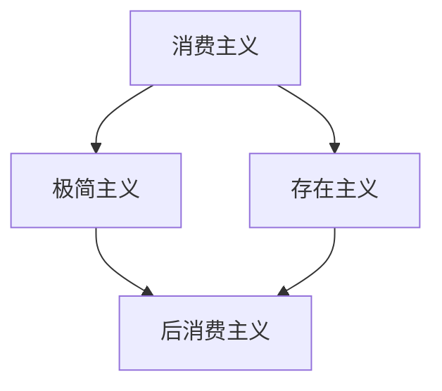

                 


### 完整性要求

为了确保文章内容的完整性，我们需要按照以下几个步骤来展开：

#### 背景介绍

首先，我们需要介绍《后消费主义生活实验：从拥有到存在的30天挑战》这本书的背景。我们可以从以下几个方面进行介绍：

- **后消费主义的概念**：解释什么是后消费主义，它与传统的消费主义有何不同。
- **生活实验的来源**：探讨这种生活实验的起源，以及它为何成为一种流行的个人成长方式。
- **30天挑战的意义**：阐述为何选择30天作为挑战的时间长度，以及这个时间长度对于实验效果的潜在影响。

#### 核心概念与联系

接着，我们需要详细阐述与后消费主义相关的核心概念，并分析它们之间的关系。以下是几个关键概念：

- **消费主义**：介绍消费主义的历史、特点及其对个人和社会的影响。
- **极简主义**：探讨极简主义的理念、实践方法以及与后消费主义的关系。
- **存在主义**：阐述存在主义的基本原理，以及它在后消费主义中的地位。

为了更直观地展示这些概念之间的关系，我们可以使用Mermaid流程图来制作一个概念架构图。以下是一个示例：



#### 核心算法原理讲解

在文章的核心部分，我们需要详细讲解后消费主义生活实验的核心算法原理。这里，我们可以采用伪代码来详细阐述实验的流程和算法。以下是一个简化的伪代码示例：

```python
// 后消费主义生活实验伪代码

// 初始化变量
day_count = 0
daily_challenge_success = False

// 主循环
while day_count < 30:
    // 每天的挑战
    daily_challenge_success = perform_daily_challenge()

    // 数据收集与评估
    data = collect_data()
    evaluate_challenge(data)

    // 更新计数器
    day_count += 1

// 实验结束
if daily_challenge_success:
    print("成功完成30天挑战！")
else:
    print("挑战未成功，但收获了许多启示。")
```

#### 数学模型和公式

在后消费主义生活实验中，可能涉及到一些数学模型和公式。为了确保读者理解，我们需要详细讲解这些公式及其应用场景。以下是一个简单的数学模型示例：

$$
\text{生活质量指数} = \frac{\text{幸福指数} + \text{自由度指数}}{2}
$$

这个公式表示生活质量指数是由幸福指数和自由度指数的加权平均得出的。其中，幸福指数和自由度指数可以通过问卷调查或者个人体验来评估。

#### 项目实战

为了更好地展示后消费主义生活实验的应用，我们可以通过一个实际项目来讲解。以下是一个项目实战的概述：

- **开发环境搭建**：介绍如何搭建一个用于跟踪和评估生活实验的数字化平台。
- **源代码详细实现**：展示源代码的关键部分，并提供代码解读。
- **代码应用解读与分析**：分析代码在实际应用中的作用，并提供案例分析。
- **实际案例分析和详细讲解剖析**：分享一个真实的生活实验案例，并进行详细的分析和讲解。

#### 最佳实践 tips

最后，我们需要为读者提供一些最佳实践建议，帮助他们更好地进行后消费主义生活实验：

- **设定明确的目标**：在开始实验前，明确自己的目标和期望。
- **坚持记录**：定期记录实验的进展和感受，以便于后续的评估和总结。
- **寻求支持**：与朋友、家人或社群分享你的实验，获得他们的支持和反馈。

### 小结

在文章的结尾，我们需要对全文进行小结，总结后消费主义生活实验的主要内容和意义，并鼓励读者尝试这一实验，以获得对生活的新认识和改变。

---

通过以上步骤，我们可以确保文章内容的完整性，同时为读者提供丰富的信息和实用建议。现在，我们可以开始撰写文章的各个部分，逐步完善全文。让我们一步一步地构建这篇文章，确保每一个部分都详细、具体、有深度。准备好了吗？让我们开始吧！

