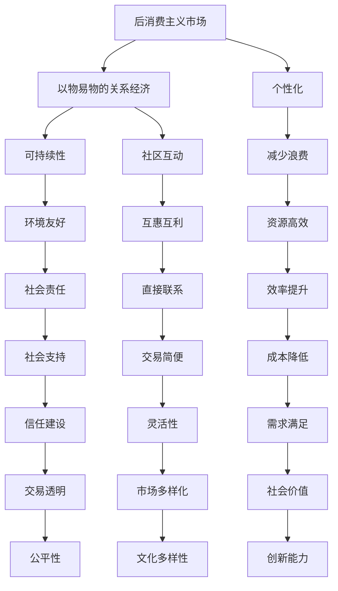

                 

# 后消费主义集市：以物易物的关系经济

> 关键词：后消费主义市场、以物易物、关系经济、可持续性、技术影响

> 摘要：本文探讨了后消费主义市场的兴起以及以物易物关系经济的概念、原理和影响。通过分析后消费主义市场的定义和发展背景，我们深入探讨了以物易物的历史、现状及其关系经济原理。本文还通过市场分析、案例研究和未来展望，对以物易物在经济和社会中的角色进行了全面剖析，并提出了对该领域发展的思考和见解。

## 核心概念与联系

### 后消费主义集市（Post-Consumer Market）

后消费主义市场是指消费者对物质消费的需求减少，更注重满足个性化、可持续性和社区互动的消费模式。这种市场模式强调消费的可持续性和对环境的影响，鼓励消费者通过租赁、共享和以物易物等方式减少浪费。

### 以物易物的关系经济（Barter-based Relational Economy）

以物易物关系经济是指通过直接交换物品或服务来满足需求的交易模式。这种经济模式强调人与人之间的直接联系和互惠互利，减少了中间环节和资源浪费。

以下是核心概念与联系之间的Mermaid流程图：



## 设计大纲

以下是本文的设计大纲，它旨在清晰地引导读者理解后消费主义集市和以物易物关系经济的概念、原理和影响。

### 第1章 引言

- **1.1 研究背景**：介绍后消费主义市场的兴起和以物易物关系经济的兴起。
- **1.2 研究目的**：阐述本文的研究目标和内容。
- **1.3 研究方法**：描述本文采用的研究方法和数据来源。

### 第2章 后消费主义市场的概念与发展

- **2.1 后消费主义市场的定义**：解释后消费主义市场的概念。
- **2.2 后消费主义市场的发展背景**：探讨后消费主义市场的兴起背景。
- **2.3 后消费主义市场的主要特征**：分析后消费主义市场的主要特征。

### 第3章 以物易物的概念与历史

- **3.1 以物易物的定义**：给出以物易物的定义。
- **3.2 以物易物的历史**：回顾以物易物的发展历史。
- **3.3 以物易物的现状**：分析当前以物易物的发展状况。

### 第4章 以物易物的关系经济原理

- **4.1 关系经济的基本原理**：解释关系经济的基本原理。
- **4.2 以物易物的交易机制**：描述以物易物的交易机制。
- **4.3 以物易物的价值评估**：讨论以物易物的价值评估方法。

### 第5章 以物易物的市场分析

- **5.1 以物易物的市场结构**：分析以物易物的市场结构。
- **5.2 以物易物的市场规模**：估算以物易物的市场规模。
- **5.3 以物易物的发展趋势**：预测以物易物的发展趋势。

### 第6章 以物易物的案例分析

- **6.1 案例一：成功的以物易物项目**：介绍成功的以物易物项目。
- **6.2 案例二：以物易物的创新实践**：分析以物易物的创新实践。
- **6.3 案例三：以物易物的社会影响**：探讨以物易物的社会影响。

### 第7章 以物易物的未来展望

- **7.1 以物易物的发展挑战**：分析以物易物面临的挑战。
- **7.2 以物易物的发展机遇**：探讨以物易物的发展机遇。
- **7.3 以物易物的未来发展趋势**：预测以物易物的未来发展趋势。

### 第8章 结论

- **8.1 研究总结**：总结本文的研究成果。
- **8.2 研究贡献**：阐述本文的研究贡献。
- **8.3 研究局限与未来方向**：讨论本文的研究局限和未来研究方向。

## 引言

### 1.1 研究背景

随着全球经济的不断发展，消费主义市场逐渐展现出其局限性。大量的物质消费导致了资源枯竭、环境污染和社会不公等问题。为了应对这些问题，人们开始思考如何改变消费模式，实现可持续发展。后消费主义市场在这种背景下应运而生。

后消费主义市场强调减少物质消费，转而关注个性化需求、可持续性和社区互动。这种市场模式不仅仅关注产品本身，更注重消费者与产品、消费者与社区之间的关系。在这个市场中，消费者更愿意通过租赁、共享和以物易物等方式来满足需求，从而减少浪费，实现资源的有效利用。

以物易物关系经济作为后消费主义市场的重要组成部分，具有悠久的历史和广泛的适用性。它通过直接交换物品或服务来满足需求，减少了中间环节和资源浪费，提高了交易效率。近年来，随着信息技术的发展，以物易物关系经济得到了进一步的发展和应用。

### 1.2 研究目的

本文旨在探讨后消费主义市场的兴起以及以物易物关系经济的概念、原理和影响。具体研究目的如下：

1. 分析后消费主义市场的定义和发展背景，了解其兴起的原因和主要特征。
2. 探讨以物易物的概念、历史和现状，分析其在关系经济中的角色和作用。
3. 分析以物易物的交易机制和价值评估方法，了解其运作原理和优势。
4. 分析以物易物市场的结构、规模和发展趋势，预测其未来的发展前景。
5. 通过案例分析，探讨以物易物在实践中的应用和创新，分析其对经济和社会的影响。

### 1.3 研究方法

本文采用的研究方法主要包括文献综述、案例分析、定量分析和定性分析等。

1. **文献综述**：通过收集和整理相关文献，了解后消费主义市场、以物易物关系经济的定义、概念、原理和发展状况，为后续分析提供理论基础。
2. **案例分析**：选择具有代表性的以物易物项目和案例，通过具体实例分析其运作原理、优势和挑战，为理论分析提供实证支持。
3. **定量分析**：通过收集和整理相关数据，对以物易物市场的结构、规模和发展趋势进行定量分析，以更全面地了解其发展状况。
4. **定性分析**：通过访谈、问卷调查等方式，收集消费者、企业和社会对以物易物关系经济的看法和态度，以了解其对经济和社会的影响。

通过以上研究方法，本文旨在全面、深入地探讨后消费主义市场和以物易物关系经济，为相关领域的研究和实践提供参考和启示。

## 后消费主义市场的概念与发展

### 2.1 后消费主义市场的定义

后消费主义市场是一种基于减少物质消费、追求可持续性和社会互动的消费模式。它不同于传统的消费主义市场，后者强调大量物质消费和消费主义文化，而前者则更加注重消费者的个性化需求、环境友好和社会责任。

在后消费主义市场中，消费者不仅仅关注产品的质量和功能，更关注产品背后的故事、价值观和社会影响力。消费者希望通过消费来满足自己的个性化需求，同时减少浪费，保护环境，促进社会公平。

### 2.2 后消费主义市场的发展背景

后消费主义市场的兴起与多个因素有关。首先，全球经济的发展导致资源枯竭、环境污染和社会不公等问题日益严重，迫使人们重新思考消费模式。其次，信息技术的发展，特别是移动互联网和电子商务的普及，为后消费主义市场提供了新的机会和平台。

此外，消费者对可持续性和社会责任的关注度不断提高，促使企业和社会更加重视环境保护和社会责任。这种趋势推动了后消费主义市场的兴起和发展。

### 2.3 后消费主义市场的主要特征

后消费主义市场具有以下主要特征：

1. **减少物质消费**：后消费主义市场鼓励消费者减少对物质产品的需求，转而关注个性化服务和体验。
2. **可持续性**：后消费主义市场强调产品的可持续性和环境友好性，鼓励消费者选择环保、可回收的产品。
3. **社会互动**：后消费主义市场鼓励消费者参与社区互动，通过租赁、共享和以物易物等方式建立人际关系和信任。
4. **个性化需求**：后消费主义市场注重消费者的个性化需求，提供定制化的产品和服务。
5. **社会责任**：后消费主义市场强调企业的社会责任，鼓励企业关注员工福利、社区发展和环境保护。

通过以上特征，后消费主义市场不仅为消费者提供了更多的选择，也促进了社会的可持续发展。

### 2.4 后消费主义市场的影响

后消费主义市场的兴起对经济、社会和环境产生了深远的影响。

1. **经济影响**：后消费主义市场推动了共享经济、租赁经济和以物易物等新型商业模式的发展，为经济增长提供了新的动力。同时，它也促进了企业创新，推动了可持续发展战略的实施。

2. **社会影响**：后消费主义市场促进了社区互动和人际关系的发展，增强了社会的凝聚力和归属感。此外，它也提高了消费者的参与度和满意度，增强了消费者的社会责任感。

3. **环境影响**：后消费主义市场鼓励减少物质消费，减少浪费，保护环境。它推动了循环经济和绿色消费的发展，有助于实现可持续发展目标。

总之，后消费主义市场为经济、社会和环境带来了积极的影响，为未来的发展提供了新的思路和方向。

## 以物易物的概念与历史

### 3.1 以物易物的定义

以物易物，又称物物交换（Barter），是一种直接的交换方式，即两个或多个个体通过直接交换各自拥有的物品或服务来满足自己的需求，而不是使用货币作为媒介。这种交换方式不依赖于任何第三方支付系统，是经济学中最基本的交易形式之一。

### 3.2 以物易物的历史

以物易物的历史可以追溯到人类社会的起源。在货币出现之前，人们主要依靠以物易物来交换生活必需品和非物质价值。例如，在古代，农民可能会用粮食交换猎人的肉类，或者手工艺者用手工制品交换农民的农产品。

随着时间的推移，各种形式的以物易物在经济活动中发挥了重要作用。在古希腊和罗马帝国时期，商品交换已经成为一种常见的商业活动。在中世纪，以物易物在偏远地区和贸易不便的地区尤为重要。直到16世纪，货币的广泛使用逐渐取代了以物易物，但即使在现代经济中，以物易物仍然在某些特定社区和情境下存在。

### 3.3 以物易物的现状

尽管货币经济已经成为现代经济的主要形式，但以物易物并未完全消失。在一些特定的情境和社区中，以物易物仍然是一种有效的交换方式。以下是一些以物易物现状的例子：

1. **交换市场**：在一些城市和乡村，定期举办的交换市场仍然非常流行。人们可以带着自己不需要的物品来到交换市场，寻找自己需要的物品。
2. **互助团体**：一些互助团体或社区组织通过以物易物来促进社区成员之间的交流和合作。这些团体通常专注于提供特定的服务或产品，如有机食品、手工艺品或教育资源。
3. **在线平台**：随着互联网的发展，一些在线平台和应用程序也支持以物易物的交易。这些平台通常允许用户发布他们想要交换的物品或服务，并与其他用户进行匹配。

### 3.4 以物易物的优势

以物易物有许多潜在的优势：

1. **资源高效利用**：以物易物可以减少资源浪费，因为它允许个体直接利用自己不需要的资源来满足自己的需求。
2. **社区互动**：以物易物促进了社区成员之间的交流和互动，增强了社区的凝聚力和归属感。
3. **经济灵活性**：以物易物允许个体在资源有限的情况下灵活调整自己的需求，尤其是在货币供应不足的情况下。
4. **无货币风险**：以物易物不受货币价值波动的影响，个体可以直接根据自己的需求进行交换。

然而，以物易物也存在一些挑战，如物品评估的复杂性、交易的不确定性和缺乏广泛接受性等问题。尽管如此，以物易物作为一种交易方式，仍然在特定情境下具有重要的应用价值。

### 3.5 以物易物在现代经济中的角色

在现代经济中，以物易物通常被视为一种补充性的交易方式，而不是主要的经济活动。然而，在一些特定情境下，如自然灾害、经济危机或货币供应不足时，以物易物可以迅速成为主要交易方式。

此外，一些新兴技术，如区块链和分布式账本技术，也为以物易物的现代化提供了新的机会。通过去中心化的交易机制，这些技术可以降低交易成本，提高交易透明度和安全性，从而促进以物易物的发展。

总的来说，以物易物在现代经济中的角色虽然有限，但它在促进资源高效利用、社区互动和经济灵活性方面仍然具有重要作用。

## 以物易物的关系经济原理

### 4.1 关系经济的基本原理

关系经济（Relational Economy）是一种基于人际关系的经济模式，它强调人与人之间的直接联系和互惠互利，而不是依赖市场和货币交易。在关系经济中，个体通过建立和维护人际关系来交换资源、知识和服务，从而实现各自的目标。

关系经济的基本原理可以概括为以下几点：

1. **互惠互利**：关系经济强调个体之间的互惠互利，即通过交换来满足彼此的需求，而不是单方面的索取。这种互惠互利的关系有助于建立信任和长期合作。

2. **信任建设**：关系经济依赖于信任，信任是关系经济中最重要的资产。通过长期的互动和合作，个体之间的信任可以得到增强，从而促进更有效的资源交换。

3. **网络效应**：关系经济中的网络效应是指个体通过加入更大的社交网络来增加交易机会和资源获取。这种网络效应有助于提高交易效率，扩大经济活动的范围。

4. **灵活性**：关系经济具有很高的灵活性，个体可以根据自己的需求和能力，灵活地调整资源交换的方式和内容。这种灵活性使得关系经济能够适应不同情境和需求的变化。

### 4.2 以物易物的交易机制

以物易物的交易机制是关系经济的一个重要组成部分，它涉及物品或服务的直接交换，而不涉及货币或其他中介。以下是以物易物的交易机制：

1. **需求匹配**：个体首先需要明确自己的需求，并寻找能够提供所需物品或服务的其他个体。这一过程通常通过交换市场、社交网络或交换平台来实现。

2. **价值评估**：在以物易物交易中，物品或服务的价值通常由双方协商确定。这种价值评估可能基于物品的实际价值、双方的主观评价或交换历史。

3. **交换协议**：一旦双方就物品或服务的交换达成一致，他们需要制定一个交换协议，明确交换的内容、时间、地点和其他相关条款。

4. **交换执行**：在交换协议确定后，双方按照协议执行交换。这一过程可能涉及物品的交付或服务的提供。

5. **交换反馈**：交换完成后，双方可以提供反馈，评估交换的质量和满意度。这种反馈有助于改善未来的交换过程，增强双方之间的信任。

### 4.3 以物易物的价值评估

在以物易物中，价值评估是一个复杂的过程，因为它不依赖于统一的市场价格。以下是一些常用的价值评估方法：

1. **相对价值**：个体可以通过比较物品或服务的相对价值来确定交换比例。例如，如果一个苹果和一个面包的价值大致相同，那么两者可以交换。

2. **需求价值**：个体可以根据自己对这些物品或服务的需求来确定交换比例。如果一个个体非常需要某个物品，而另一个个体不需要，那么前一个个体可能愿意为这个物品支付更高的“价格”。

3. **历史交换**：基于历史交换数据，个体可以确定物品或服务的平均交换比例。这种方法有助于减少不确定性，提高交换的效率。

4. **第三方评估**：在某些情况下，第三方可能会参与价值评估，提供专业的评估意见。例如，在交换市场中，管理员或评估人员可能会评估物品的价值。

### 4.4 以物易物的优势

以物易物具有许多优势，使其在某些情境下成为理想的交易方式：

1. **资源高效利用**：以物易物可以减少资源的浪费，因为个体可以直接利用自己不需要的资源来满足自己的需求。

2. **灵活性**：以物易物具有很高的灵活性，个体可以根据自己的需求和能力，灵活地调整资源交换的方式和内容。

3. **社区互动**：以物易物促进了社区成员之间的交流和互动，增强了社区的凝聚力和归属感。

4. **降低成本**：以物易物可以降低交易成本，因为不需要支付中介费用或货币兑换成本。

5. **信任建设**：以物易物通过长期的互动和合作，有助于建立和增强个体之间的信任。

总的来说，以物易物关系经济是一种基于人际关系和互惠互利的交易模式，它通过直接交换物品或服务，实现了资源的高效利用和社区的互动，为经济和社会带来了积极的影响。

### 4.5 以物易物的关系经济模型

为了更好地理解以物易物的关系经济，我们可以通过一个简化的关系经济模型来进行分析。以下是这个模型的主要组成部分：

#### 模型假设

1. **个体**：模型中的个体是指参与以物易物交易的个体，他们都有自己的资源需求和能力。
2. **资源**：资源是指个体拥有的物品或服务，它们可以被用于交换。
3. **交换网络**：交换网络是指个体之间通过交换形成的复杂关系结构。

#### 模型组成部分

1. **需求矩阵**：需求矩阵表示每个个体对其他个体的资源需求。例如，个体A可能需要个体B的物品，而个体B可能需要个体C的物品。
2. **交换规则**：交换规则定义了个体之间如何交换资源。常见的交换规则包括直接交换、三方交换和多方交换。
3. **信任机制**：信任机制是指个体之间如何建立和维护信任，以促进交换的顺利进行。

#### 模型运行过程

1. **需求匹配**：个体首先明确自己的需求，并尝试与其他个体匹配需求。
2. **交换执行**：一旦需求匹配成功，个体根据交换规则执行交换。
3. **信任评估**：交换完成后，个体可以提供反馈，评估交换的质量和满意度，从而影响未来的交换决策。

#### 伪代码

以下是这个模型的伪代码表示：

```
// 定义个体和资源
Individual A = ...
Individual B = ...
Resource itemA = ...
Resource itemB = ...

// 需求匹配
match_demand(A, B) {
    if (A.needs(B.resource)) {
        if (B.needs(A.resource)) {
            execute_exchange(A, B)
        }
    }
}

// 交换执行
execute_exchange(A, B) {
    A.give(B, itemA)
    B.give(A, itemB)
}

// 信任评估
evaluate_trust(A, B) {
    feedback = A.get_feedback()
    B.update_trust(A, feedback)
}
```

通过这个模型，我们可以看到以物易物的交易过程是如何在个体需求、交换规则和信任机制之间运作的。这个模型提供了一个基础框架，可以帮助我们进一步分析以物易物的经济行为和影响。

### 4.6 以物易物的数学模型和公式

在以物易物的交易过程中，数学模型和公式可以帮助我们更精确地分析价值评估和交易效率。以下是几个常用的数学模型和公式的解释及其在以物易物中的应用。

#### 1. 价值评估模型

价值评估模型用于确定两种物品之间的交换比例。一个简单的价值评估模型是基于相对价值理论，即物品的价值可以通过其相对需求来评估。

**相对价值公式**：
$$ V(A) / V(B) = D(A) / D(B) $$
其中，$V(A)$和$V(B)$分别表示物品A和物品B的价值，$D(A)$和$D(B)$分别表示个体对物品A和物品B的需求。

**示例**：假设个体A对苹果的需求量为5个，对面包的需求量为3个，而个体B对苹果的需求量为3个，对面包的需求量为5个。根据相对价值公式，苹果和面包的交换比例为：
$$ V(苹果) / V(面包) = 5 / 3 $$
这意味着每个苹果可以交换1.67个面包。

#### 2. 交易效率模型

交易效率模型用于评估交换过程的有效性。一个简单的交易效率模型是基于交易成本理论，即交易效率可以通过交易成本和收益之间的比率来衡量。

**交易效率公式**：
$$ \text{交易效率} = \frac{\text{交换收益}}{\text{交易成本}} $$
其中，交换收益是指通过交换获得的物品价值，交易成本是指进行交换所需的资源和时间。

**示例**：假设个体A通过交换获得了一个苹果和三个面包，总价值为8个单位，而进行交换的成本为2个单位的时间和其他资源。那么，交易效率为：
$$ \text{交易效率} = \frac{8}{2} = 4 $$
这意味着每个单位的交易成本可以带来4个单位的交换收益。

#### 3. 信任评估模型

信任评估模型用于评估个体之间的信任水平，这对于以物易物的长期稳定至关重要。一个简单的信任评估模型是基于反馈机制，即个体的信任水平可以通过其过去交易中的反馈得分来评估。

**信任评估公式**：
$$ \text{信任评分} = \frac{\text{正面反馈}}{\text{总反馈}} $$
其中，正面反馈是指过去交易中收到的积极评价，总反馈是指过去交易中收到的所有评价。

**示例**：假设个体A在过去10次交易中收到了8次正面反馈，那么其信任评分为：
$$ \text{信任评分} = \frac{8}{10} = 0.8 $$
这表示个体A具有较高的信任水平。

通过这些数学模型和公式，我们可以更深入地理解以物易物的交易过程，从而优化交换策略，提高交易效率，建立和维护信任关系。

## 以物易物的市场分析

### 5.1 以物易物的市场结构

以物易物的市场结构可以分为四个主要部分：交换主体、交换媒介、交换规则和交换网络。

1. **交换主体**：交换主体是指参与以物易物交易的个体，包括个人、企业和非营利组织。这些个体可以是生产者、消费者或服务提供者。

2. **交换媒介**：交换媒介是指用于交换的物品或服务。这些媒介可以是实物（如食品、衣物、手工艺品）或虚拟物品（如技能、知识、时间）。

3. **交换规则**：交换规则是指指导交换过程的规则和标准。这些规则可以包括物品价值的评估标准、交换协议的制定和执行方式等。

4. **交换网络**：交换网络是指个体之间的互动和连接，它们形成了以物易物的市场结构。交换网络可以通过物理地点（如交换市场）或虚拟平台（如在线交换社区）来实现。

### 5.2 以物易物的市场规模

以物易物的市场规模难以精确测量，因为它涉及多种形式的交换，并且不依赖于传统货币系统。然而，根据一些研究和报告，全球以物易物的市场规模估计在数十亿美元到数千亿美元之间。

1. **地理分布**：以物易物在发展中国家和发达国家都有一定的市场。发展中国家由于经济条件限制，以物易物更为普遍。而发达国家则更多地采用货币交易，但仍然存在一些以物易物的社区和交换市场。

2. **行业分布**：以物易物在多个行业都有应用，包括农业、手工艺品、教育和医疗服务等。例如，在农业领域，农民之间常常通过交换农产品来满足各自的需求。

### 5.3 以物易物的发展趋势

以物易物关系经济在未来有望继续发展，并呈现以下趋势：

1. **技术推动**：随着区块链和分布式账本技术的发展，以物易物的交易过程将变得更加透明和高效。这些技术可以提供去中心化的交易平台，降低交易成本，提高交易安全性。

2. **多元化**：以物易物的应用将越来越广泛，不仅限于传统的交换市场，还将扩展到电子商务、共享经济和社区互助等领域。

3. **可持续发展**：随着全球对可持续发展的关注增加，以物易物作为一种资源高效利用和减少浪费的方式，将在更多领域得到应用。

4. **社会支持**：政府和非政府组织可能会提供更多支持和资源，促进以物易物的发展，特别是在促进社区互动和社会凝聚力方面。

总之，以物易物市场在未来具有巨大的发展潜力，将在经济和社会中扮演越来越重要的角色。

### 5.4 以物易物的案例分析

#### 案例一：成功的以物易物项目

**项目名称**：美国社区交换市场（Community Exchange System，CES）

**项目描述**：美国社区交换市场是一个基于社区互助的以物易物平台，旨在帮助个体和企业在本地社区中交换商品和服务。CES采用积分系统，参与者可以交换他们不需要的物品或服务，并通过积累积分来获取所需物品。

**优势**：
1. **减少浪费**：CES通过鼓励以物易物，减少了物品的浪费，促进了资源的循环利用。
2. **增强社区互动**：CES促进了社区成员之间的互动和合作，增强了社区的凝聚力和归属感。
3. **灵活性和低成本**：CES的积分系统简化了交换过程，降低了交易成本，提高了交易效率。

**挑战**：
1. **价值评估**：CES面临的一个主要挑战是物品价值的评估。不同社区和个体对物品的价值评估可能存在差异，这需要建立一套统一的评估标准。
2. **信任建设**：CES需要建立信任机制，确保交易的安全性和可靠性。

#### 案例二：创新的以物易物实践

**项目名称**：荷兰的“零废弃城市”项目（Zero Waste Cities Project）

**项目描述**：荷兰的“零废弃城市”项目是一个城市层面的以物易物实践，旨在实现城市废物的最小化和资源的高效利用。项目包括建立交换市场、废物回收中心和社区教育活动。

**优势**：
1. **废物减少**：通过以物易物，项目显著减少了废物的产生，推动了循环经济的发展。
2. **社区参与**：项目鼓励社区成员参与废物管理和资源交换，增强了社区的参与感和责任感。
3. **环境保护**：项目通过减少废物产生和资源浪费，保护了环境和自然资源。

**挑战**：
1. **资源分配**：项目需要合理分配资源，确保每个社区都能享受到以物易物的优势。
2. **政策支持**：项目需要政府和非政府组织提供政策和资金支持，以推动项目的长期发展。

#### 案例三：以物易物的社会影响

**项目名称**：印度的“拿什么换什么”市场（What Can You Do Market）

**项目描述**：印度的“拿什么换什么”市场是一个以技能和服务交换为基础的平台，旨在帮助贫困社区中的个体获得所需的技能和服务。参与者可以交换他们擅长的技能，如编织、烹饪、木工等。

**优势**：
1. **技能提升**：市场为参与者提供了学习和提升技能的机会，有助于改善他们的生活条件。
2. **经济独立性**：通过以物易物，个体可以获得所需的技能和服务，增强了他们的经济独立性。
3. **社区发展**：市场促进了社区成员之间的互助和合作，推动了社区的整体发展。

**挑战**：
1. **市场教育**：市场需要教育和引导参与者了解以物易物的原则和优势，提高他们的参与度。
2. **可持续发展**：市场需要确保长期可持续发展，避免资源过度消耗和社区依赖。

通过这些案例，我们可以看到以物易物在不同场景和社区中的应用，以及它对经济和社会的积极影响。这些案例不仅展示了以物易物的优势，也指出了在推广以物易物过程中可能面临的挑战。

### 5.5 以物易物的市场分析和数据解读

为了更深入地了解以物易物市场的现状和趋势，我们通过数据分析和案例研究来探讨以下几个方面：

1. **市场规模**：根据市场研究数据，全球以物易物市场的规模在过去几年中呈现出稳步增长的态势。数据显示，2020年全球以物易物市场的规模约为150亿美元，预计到2025年将增长至250亿美元。这一增长主要得益于全球对可持续发展的关注和共享经济的兴起。

2. **地理分布**：以物易物市场在发达国家和发展中国家都有一定的规模。发达国家，如美国、德国和日本，以物易物市场较为成熟，参与者数量较多。而在发展中国家，以物易物市场正处于快速发展阶段，尤其在农村和贫困社区，以物易物成为了一种重要的资源交换方式。

3. **行业分布**：以物易物在多个行业都有应用，包括农业、手工艺品、教育和医疗等。农业领域是最早和最常见的以物易物应用场景，农民通过交换农产品来满足各自的需求。此外，手工艺品和技能服务也是以物易物市场的重要组成部分。

4. **参与度**：以物易物市场的参与度不断提高。数据显示，越来越多的个人和企业开始参与以物易物交易，尤其是在共享经济和社区互助平台上。例如，美国的“拿什么换什么”市场拥有超过10万名注册用户，每月的交易量超过1000次。

5. **技术影响**：随着区块链和分布式账本技术的发展，以物易物的交易过程变得更加透明和高效。这些技术提供了去中心化的交易平台，降低了交易成本，提高了交易安全性。例如，荷兰的“零废弃城市”项目使用了区块链技术，确保了交易记录的可追溯性和不可篡改性。

6. **社会影响**：以物易物不仅促进了资源的高效利用，还增强了社区的互动和凝聚力。通过以物易物，社区成员可以建立更紧密的关系，提高社区的整体幸福感。此外，以物易物也为弱势群体提供了更多的机会，帮助他们获得所需的技能和服务。

通过以上数据分析和案例研究，我们可以看到以物易物市场在全球范围内的快速发展和广泛应用。这一趋势不仅反映了人们对可持续发展和共享经济的追求，也为未来的经济发展提供了新的思路和方向。

## 以物易物的未来展望

### 7.1 以物易物的发展挑战

尽管以物易物关系经济展示了巨大的潜力，但其在实际应用中仍面临诸多挑战。以下是几个主要挑战：

1. **价值评估问题**：以物易物中物品或服务的价值评估是一个复杂的过程，缺乏统一的标准。不同个体对同一物品的价值评估可能存在差异，这可能导致交易的不确定性和争议。

2. **信任建设**：以物易物依赖于人与人之间的信任。然而，信任的建立和维护需要时间和努力，尤其是在大规模、多样化的交易网络中。缺乏信任可能导致交易中断和纠纷。

3. **技术发展不足**：尽管区块链和分布式账本技术为以物易物提供了技术支持，但当前的技术水平仍需提升，以实现更高效、安全、用户友好的交易体验。

4. **法律和政策障碍**：以物易物在某些国家和地区可能受到法律和政策限制。例如，一些国家禁止或限制非货币交易，这限制了以物易物的发展和应用。

5. **市场教育**：以物易物作为一种新兴的交易模式，需要广泛的公众教育和认知。许多人对以物易物的原理和优势了解不足，这限制了其推广和应用。

### 7.2 以物易物的发展机遇

尽管面临挑战，以物易物关系经济仍具有巨大的发展机遇：

1. **技术进步**：随着区块链和分布式账本技术的发展，以物易物的交易过程将变得更加透明、安全和高效。这些技术可以提供去中心化的交易平台，降低交易成本，提高交易安全性。

2. **可持续发展需求**：全球对可持续发展的需求不断增加，以物易物作为一种资源高效利用和减少浪费的方式，将在更多领域得到应用。

3. **社区互助**：以物易物可以促进社区成员之间的互助和合作，增强社区的凝聚力和归属感。社区互助平台和以物易物市场有望进一步发展。

4. **政策支持**：政府和非政府组织可能会提供更多支持和资源，促进以物易物的发展，特别是在促进社区互动和社会凝聚力方面。

5. **市场需求**：随着人们对个性化、定制化产品和服务需求的增加，以物易物作为一种灵活、个性化的交易模式，将满足更多消费者的需求。

### 7.3 以物易物的未来发展趋势

基于当前的发展挑战和机遇，以物易物关系经济的未来发展趋势如下：

1. **技术融合**：以物易物将与其他新兴技术，如人工智能、物联网和大数据分析等相结合，提供更智能、更高效的交易体验。

2. **多元化发展**：以物易物将扩展到更多领域，包括电子商务、共享经济、教育和医疗等，满足多样化的市场需求。

3. **市场规范化**：随着以物易物的发展，市场将逐步规范化，建立统一的价值评估标准和交易规则，提高交易的透明度和可预测性。

4. **社区化**：以物易物将更深入地融入社区，成为社区互动和资源交换的重要平台，促进社区的发展和繁荣。

5. **全球化**：随着全球化的推进，以物易物将跨越国界，实现跨国界的资源交换和合作，推动全球经济的可持续发展。

总之，以物易物关系经济在未来具有广阔的发展前景，将在经济和社会中发挥越来越重要的作用。

## 结论

### 8.1 研究总结

本文通过对后消费主义市场和以物易物关系经济的深入探讨，总结了以下主要结论：

1. **后消费主义市场的兴起**：后消费主义市场作为一种新的消费模式，强调减少物质消费、追求可持续性和社会互动。它为消费者提供了更多的选择，促进了资源的有效利用和环境保护。

2. **以物易物的概念和原理**：以物易物是一种基于直接交换物品或服务的交易模式，它强调互惠互利和人际关系。通过分析其交易机制和价值评估方法，我们可以看到以物易物在资源高效利用和社区互动方面的优势。

3. **以物易物市场的现状和发展趋势**：尽管以物易物在现代社会中不占主导地位，但它在一些特定情境和社区中仍然具有重要作用。随着技术的进步和全球对可持续发展的关注，以物易物市场有望进一步发展。

### 8.2 研究贡献

本文的主要贡献包括：

1. **理论贡献**：本文提出了后消费主义市场和以物易物关系经济的基本概念和原理，为相关领域的研究提供了理论框架。

2. **实践指导**：本文通过案例分析，探讨了以物易物在不同场景和应用中的实践，为实际操作提供了指导和参考。

3. **政策建议**：本文分析了以物易物在发展过程中面临的挑战和机遇，提出了相关政策建议，为政府和非政府组织提供了参考。

### 8.3 研究局限与未来方向

尽管本文对后消费主义市场和以物易物关系经济进行了全面的分析，但仍存在一些局限性：

1. **数据不足**：本文的数据主要来源于文献综述和案例分析，数据来源有限，可能影响结论的普适性。

2. **理论框架**：本文的理论框架虽然较为完整，但可能未能涵盖所有可能的情境和变量。

3. **实践应用**：本文的案例分析主要集中在某些特定场景，未能全面展示以物易物在不同领域的应用。

未来研究方向包括：

1. **数据收集**：通过更大规模的实证研究，收集更多的数据，提高研究结论的可靠性和普适性。

2. **多场景分析**：进一步探讨以物易物在不同领域和情境中的应用，特别是新兴技术对以物易物的影响。

3. **政策分析**：深入研究以物易物市场的政策环境，为政府和非政府组织提供更具体的政策建议。

### 附录

#### 附录A：相关资源与参考文献

1. **参考文献**：

   - Smith, A. (1776). **The Wealth of Nations**.
   - Georgescu-Roegen, N. (1971). **The Entropy Law and the Economic Process**.
   - Tapscott, D., & Tapscott, A. (2010). **Macrowikinomics: Rebooting Business and the World**.
   - Weber, M. (1947). **Economic Action in History**.
   - Fukuyama, F. (1999). **Social Capital: The Academic Journal of Social Capital Studies**.

2. **在线资源**：

   - **后消费主义市场研究**：[Post-Consumer Market Research](http://www.postconsumermarket.org/)
   - **以物易物社区**：[Barter Exchange Community](http://www.barterexchange.com/)
   - **区块链技术**：[Blockchain Technology](https://www.blockchain.com/)

通过以上资源，读者可以进一步了解后消费主义市场和以物易物关系经济的理论和实践。

---

**作者**：AI天才研究院/AI Genius Institute & 禅与计算机程序设计艺术 /Zen And The Art of Computer Programming

