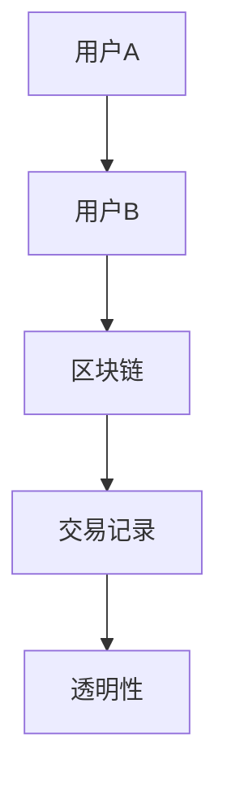
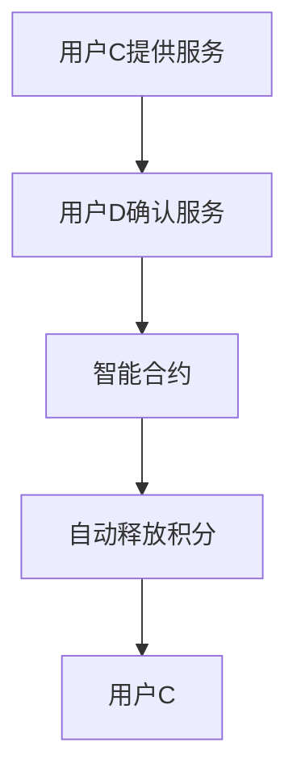
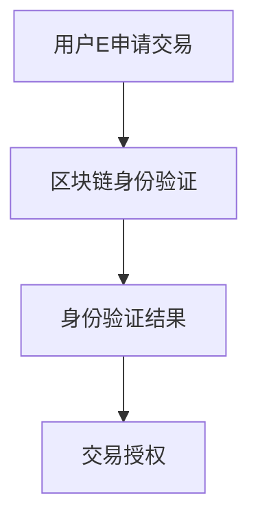
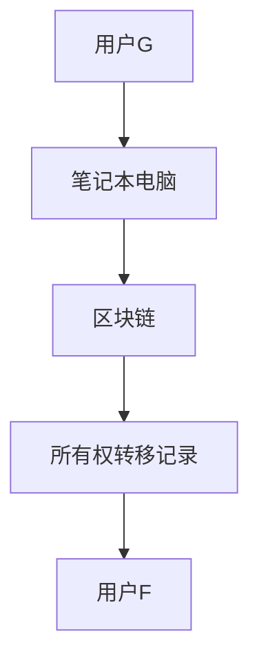
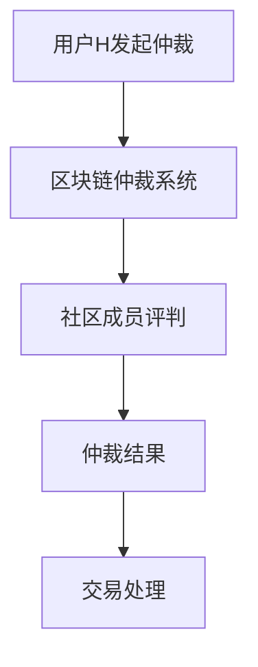

                 

### 文章标题

# 《后消费主义集市：以物易物的社区经济实践》

### 关键词

- 后消费主义
- 社区经济
- 以物易物
- 区块链技术
- 社会影响力

### 摘要

本文深入探讨了后消费主义时代下，以物易物的社区经济实践。通过对后消费主义的兴起背景、特征及其影响的分析，本文揭示了以物易物作为一种新型经济模式的历史沿革、当前应用及其在社区中的重要性。进一步，文章从理论基础、社区组织管理、技术支持、法律政策环境等方面，系统地阐述了以物易物在社区经济实践中的运作机制和潜在挑战。通过案例分析，本文总结了成功的实践经验和启示，并对未来以物易物社区经济的发展趋势与前景进行了展望。文章旨在为后消费主义时代下的社区经济实践提供理论支持和实践指导。  

----------------------------------------------------------------

### 第一部分：后消费主义的兴起与影响

#### 第1章：后消费主义的兴起与影响

##### 1.1 后消费主义的概念与特征

后消费主义，是指在社会经济结构中，消费行为和消费观念逐渐从传统的物质追求转向更为多元、环保、可持续的价值观。这一概念最早由法国社会学家让·鲍德里亚提出，他在《消费社会》一书中指出，消费不再是简单的经济行为，而是一种文化现象和社会建构。后消费主义主要特征包括：

1. **去物质化**：消费者不再单纯追求物质财富，而是关注体验、情感和自我表达。
2. **可持续性**：消费者更加注重环保、公平和可持续发展，倾向于选择环保产品和绿色消费方式。
3. **共享经济**：共享、租赁、以物易物等新兴经济模式成为替代传统消费的途径。
4. **去中心化**：消费者逐渐从传统的集中化消费模式转向更加分散、个性化的消费选择。

##### 1.2 后消费主义的背景与动力

后消费主义的兴起，与以下几个因素密切相关：

1. **经济危机**：2008年全球金融危机后，人们对传统消费模式产生质疑，开始寻求新的消费方式和经济模式。
2. **环境问题**：全球变暖、资源枯竭等环境问题日益严重，促使人们反思传统消费方式，转向可持续消费。
3. **技术进步**：互联网和移动设备的普及，为新兴消费模式和共享经济提供了技术支持。
4. **社会变革**：社会结构变化，尤其是中产阶级崛起，改变了消费者的需求和价值观。

##### 1.3 后消费主义对社会的影响

后消费主义的兴起，对社会产生了深远的影响：

1. **消费模式转变**：消费者从物质消费转向体验消费，消费重心逐渐从拥有转向使用。
2. **经济结构调整**：以物易物、共享经济等新型经济模式逐渐崛起，改变了传统经济的结构。
3. **社会公平**：可持续消费和共享经济有助于缩小贫富差距，实现社会公平。
4. **环境影响**：后消费主义倡导环保、可持续发展，有助于缓解环境问题。

### 小结

后消费主义的兴起，标志着社会消费观念的深刻变革。它不仅推动了消费模式的转变，还对经济结构、社会公平和环境保护产生了积极影响。在接下来的章节中，我们将进一步探讨以物易物这一新兴经济模式，以及其在社区经济实践中的应用。

----------------------------------------------------------------

#### 第2章：以物易物的历史与现状

##### 2.1 以物易物的起源与发展

以物易物，是指在没有货币介入的情况下，直接通过物品之间的交换来满足彼此的需求。这种交易方式可以追溯到人类社会的早期阶段。考古学研究表明，早在新石器时代，人类就已经开始进行以物易物的交换。以下是以物易物的发展历程：

1. **原始社会**：在原始社会中，以物易物是主要的经济交易方式。人们通过交换工具、食品、衣物等物品来满足彼此的需求。
2. **古代文明**：在古埃及、古希腊、古罗马等古代文明中，以物易物也得到了广泛的应用。这些文明中，以物易物不仅是经济交易方式，还是社会地位和权力的象征。
3. **中世纪**：在中世纪，以物易物逐渐与货币交易相结合，但仍保留了一定的影响力。特别是在偏远地区和农村，以物易物仍然是主要的交易方式。
4. **现代**：进入现代社会，随着货币经济的普及，以物易物逐渐被视为一种辅助性的经济交易方式。然而，在近年来，随着后消费主义的兴起，以物易物再次受到关注，并在社区经济中发挥了重要作用。

##### 2.2 当代以物易物的方式与模式

在当代，以物易物的方式和模式发生了很大的变化。以下是一些主要的以物易物方式与模式：

1. **线下交易**：线下交易是传统且常见的一种以物易物方式。人们在社区市场、跳蚤市场、社区中心等场所，通过面对面交流来交换物品。
2. **线上平台**：随着互联网的普及，许多线上平台应运而生，为人们提供了一种便捷的以物易物方式。这些平台包括以物易物网站、社交媒体群组、应用程序等。
3. **社区交换系统**：社区交换系统是一种以物易物的组织形式，它通过建立一个交换网络，使得社区成员可以更高效地交换物品。这种系统通常采用积分制或点数制，使得交换过程更加公平和透明。
4. **共享经济**：共享经济模式中的共享、租赁、以物易物等，也为以物易物提供了新的可能性。例如，共享单车、共享汽车等共享经济模式，使得物品的利用效率大大提高。

##### 2.3 以物易物在社区中的应用案例

以物易物在社区中的应用案例丰富多样，以下是一些典型的案例：

1. **社区跳蚤市场**：许多社区会定期举办跳蚤市场，鼓励居民将自己不再使用的物品进行交换。这种方式不仅减少了资源的浪费，还促进了社区成员之间的交流和互动。
2. **社区交换群组**：在一些社交媒体平台上，社区成员可以加入以物易物群组，通过发布需求信息和供应信息，实现物品的交换。这种方式使得以物易物更加便捷和高效。
3. **社区交换系统**：一些社区会建立自己的交换系统，例如积分制或点数制，鼓励居民参与以物易物活动。这种系统通常结合线上和线下交易，为居民提供了一种全面的交换平台。
4. **以物易物合作社**：在一些地区，以物易物合作社应运而生。这些合作社通过组织居民参与以物易物活动，提高了物品的利用效率，促进了社区经济的繁荣。

### 小结

以物易物作为一种古老的经济交易方式，在现代社会焕发出新的生机。通过线下交易、线上平台、社区交换系统和共享经济等多种方式，以物易物在社区中发挥着重要作用。它不仅促进了资源的循环利用，还增强了社区凝聚力，为后消费主义时代下的社区经济实践提供了有力支持。在接下来的章节中，我们将进一步探讨以物易物的理论基础，以及它在社区经济实践中的具体应用。

----------------------------------------------------------------

### 第3章：以物易物的理论基础

##### 3.1 以物易物的经济学原理

以物易物作为一种经济交易方式，其经济学原理可以追溯到基本的市场交换理论。以下是以物易物的主要经济学原理：

1. **供需理论**：供需理论是经济学中解释价格形成和商品交易的基本理论。在以物易物的交易中，供需理论同样适用。当某一种物品的需求量大于供应量时，该物品的相对价值会上升，反之亦然。通过供需的动态平衡，以物易物实现了物品的有效分配。

2. **价格理论**：在货币交易中，价格是交易双方达成一致的关键因素。而在以物易物中，物品的价值是通过双方协商确定的。这种协商过程可以看作是一种非货币价格的形成机制。通过比较不同物品之间的相对价值，交易双方可以确定一个双方都满意的交换比例。

3. **效用理论**：效用理论认为，消费者在购买商品时，会根据商品对自身的边际效用来决定购买量。在以物易物中，交易双方也会考虑物品对自身的效用，从而决定交换的意愿和数量。这种效用考量使得以物易物更加关注个人的实际需求，而非单纯的物质财富积累。

4. **市场效率**：市场效率是指市场在资源分配上的高效性。在传统货币经济中，市场效率往往通过价格机制来实现。而在以物易物中，市场效率的实现机制有所不同。通过社区成员之间的直接交流和信息共享，以物易物社区能够更快速地响应需求变化，提高资源分配的效率。

##### 3.2 以物易物的社会学意义

以物易物在社会学领域也有着重要的意义。以下是以物易物的社会学意义：

1. **社区凝聚力**：以物易物活动促进了社区成员之间的交流和互动，增强了社区的凝聚力。通过参与以物易物活动，居民之间的联系更加紧密，社区感得以增强。

2. **社会公平**：以物易物有助于缩小贫富差距，实现社会公平。在传统消费主义社会中，贫富差距往往导致资源分配的不公平。而以物易物通过直接交换物品，使得资源分配更加公平，减少了财富积累带来的不公平现象。

3. **社会创新**：以物易物的兴起，为传统经济模式提供了新的思路和可能性。它激发了社会创新，促进了新的经济模式的产生和发展。例如，共享经济、协作消费等新兴经济模式，都是以物易物的理念为基础。

4. **文化传承**：以物易物作为一种古老的经济交易方式，承载了丰富的文化内涵。通过以物易物活动，人们可以传承和发扬传统文化，增强文化认同感。

##### 3.3 以物易物与可持续发展

以物易物在可持续发展方面也具有显著的意义。以下是以物易物与可持续发展的关系：

1. **资源循环利用**：以物易物促进了资源的循环利用，减少了资源浪费。在传统消费主义社会中，大量资源被生产、消费和丢弃，造成了严重的资源浪费和环境破坏。而以物易物通过物品的再次利用，实现了资源的有效循环。

2. **减少碳排放**：以物易物减少了商品的生产和运输，从而降低了碳排放。传统消费主义社会中，商品的生产和运输过程中会产生大量的碳排放。而以物易物通过本地化交易，减少了长距离运输的需求，有助于降低碳排放。

3. **社会公平与可持续发展**：以物易物在实现社会公平的同时，也促进了可持续发展。通过促进资源的循环利用和减少碳排放，以物易物为可持续发展提供了有力支持。

4. **环境保护**：以物易物倡导环保、绿色消费，有助于环境保护。它鼓励人们选择环保产品和绿色消费方式，减少了环境污染和资源浪费。

### 小结

以物易物作为一种经济交易方式，具有丰富的经济学原理和社会学意义。它不仅促进了资源的循环利用和环境保护，还有助于增强社区凝聚力和社会公平。在可持续发展方面，以物易物发挥着重要作用，为构建绿色、公平和可持续的社区经济提供了新的思路和可能性。在接下来的章节中，我们将进一步探讨以物易物在社区经济实践中的具体应用，以及面临的挑战和解决方案。

----------------------------------------------------------------

### 第4章：以物易物的社区组织与管理

#### 4.1 以物易物社区组织的构建

以物易物社区组织的构建是确保这一经济模式顺利运行的基础。以下是构建以物易物社区组织的关键步骤：

1. **确定目标与愿景**：首先，需要明确以物易物社区组织的目标和愿景。例如，提高社区资源利用效率、增强社区凝聚力、推动可持续发展等。明确的目标和愿景将指导后续的组织构建工作。

2. **选择组织形式**：以物易物社区组织可以采用多种形式，如社区合作社、志愿者组织、线上平台等。选择适合的组织形式，需要考虑社区规模、资源状况、成员需求等因素。

3. **招募成员**：通过宣传和推广，吸引社区成员参与以物易物社区组织。招募过程中，可以优先考虑对以物易物理念有认同感的成员，以及有实际需求或资源的成员。

4. **制定规章制度**：制定合理的规章制度，确保以物易物社区组织的正常运作。规章制度应包括物品交换的原则、交换流程、积分制度、纠纷解决机制等。

5. **建立沟通渠道**：建立有效的沟通渠道，确保社区成员之间能够及时交流信息、反馈意见和解决问题。沟通渠道可以包括线上平台、线下会议、社区公告等。

#### 4.2 以物易物的管理机制

有效的管理机制是确保以物易物社区组织高效运作的关键。以下是几种常用的管理机制：

1. **积分制度**：积分制度是一种常见的以物易物管理机制，通过给予交换双方一定数量的积分来激励他们参与交换活动。积分可以用来兑换物品或服务，从而促进社区资源的循环利用。

2. **供需匹配**：通过建立供需匹配机制，确保社区成员的需求能够及时得到满足。供需匹配可以采用线上平台、线下活动、定期市场等方式进行。

3. **监督与审计**：定期对以物易物社区组织进行监督与审计，确保交换过程的公平、透明和合规。监督与审计可以包括对交换记录的审查、对成员行为的监督等。

4. **反馈与改进**：鼓励社区成员提供反馈意见，并根据反馈进行改进。反馈机制可以包括定期调查、意见箱、在线评价等。

#### 4.3 以物易物的社区文化构建

以物易物的社区文化构建是推动这一经济模式持续发展的动力。以下是构建以物易物社区文化的关键步骤：

1. **宣传与教育**：通过宣传和教育活动，提高社区成员对以物易物理念的认识和理解。宣传渠道可以包括社区公告、宣传海报、讲座、研讨会等。

2. **示范引领**：通过示范引领，树立以物易物的典范，激励更多社区成员参与。示范引领可以包括以物易物先进个人、优秀组织等评选活动。

3. **社区活动**：定期举办以物易物社区活动，如跳蚤市场、交换派对等，增强社区成员的参与感和归属感。

4. **文化传承**：以物易物作为一种古老的经济交易方式，承载了丰富的文化内涵。在构建以物易物社区文化时，应注重传承和弘扬这一文化。

### 小结

以物易物社区组织的构建、管理机制的建立和社区文化的构建，是确保以物易物经济模式成功运行的重要保障。通过明确目标与愿景、选择合适的组织形式、制定规章制度、建立沟通渠道，可以构建一个高效、公平和可持续的以物易物社区组织。同时，通过积分制度、供需匹配、监督与审计等管理机制，可以确保以物易物社区组织的规范运作。最后，通过宣传与教育、示范引领、社区活动和文化传承，可以构建一个积极、健康和富有活力的以物易物社区文化。这些措施将为以物易物社区经济实践提供坚实的支持。

----------------------------------------------------------------

#### 5.1 以物易物的技术支持与工具

随着信息技术的不断发展，以物易物在社区经济实践中得到了有效的技术支持。以下是一些关键技术和工具，它们为以物易物的实施提供了便利：

1. **区块链技术**：

区块链技术是一种分布式数据库技术，具有去中心化、透明、不可篡改等特点。在以物易物中，区块链技术可以用于记录交易信息，确保交易的公正和透明。以下是以区块链技术为核心的应用场景：

- **交易记录**：通过区块链技术，可以记录每一次以物易物交易的详细信息，包括交易时间、物品名称、交易双方等。这有助于提高交易的透明度，防止欺诈行为。

- **智能合约**：智能合约是一种自动执行合约条款的计算机程序。在以物易物中，智能合约可以用于自动执行交易条款，例如当交易双方满足合同条件时，自动释放相应的物品或积分。

- **去中心化身份验证**：区块链技术可以提供去中心化的身份验证服务，确保交易双方的身份真实可靠。这有助于防止假冒伪劣商品的出现，提高交易的安全性和可靠性。

2. **物联网技术**：

物联网技术通过连接各种物理设备，实现数据的实时采集、传输和分析。在以物易物中，物联网技术可以用于提高交易效率和物品管理。

- **智能设备**：通过物联网技术，可以将各种智能设备（如传感器、智能锁等）连接到以物易物平台。这有助于实现物品的远程监控和管理，提高交易的便捷性和安全性。

- **实时监控**：物联网技术可以实时监控物品的状态，如位置、使用情况等。这有助于确保物品的安全，防止物品丢失或损坏。

3. **大数据分析**：

大数据分析技术可以对以物易物的交易数据进行深入分析，发现交易中的规律和趋势。以下是大数据分析在以物易物中的应用：

- **供需预测**：通过分析历史交易数据，可以预测社区成员的需求和供应情况。这有助于优化交易流程，提高物品的匹配效率。

- **行为分析**：大数据分析可以揭示社区成员的行为模式，如喜好、需求等。这有助于提供个性化的交换建议，增强用户体验。

- **风险控制**：通过分析交易数据，可以发现潜在的风险点，如欺诈行为、物品质量问题等。这有助于提前防范风险，确保交易的安全性和可靠性。

4. **移动应用**：

移动应用为以物易物提供了便捷的线上平台，使交易过程更加灵活和高效。以下是一些移动应用的功能：

- **交换信息发布**：社区成员可以在移动应用上发布交换信息，包括物品名称、数量、需求等。

- **实时匹配**：移动应用可以根据社区成员的需求和供应，实现实时匹配，提高交易的成功率。

- **交易记录查询**：社区成员可以随时查询自己的交易记录，了解自己的交换历史和积分情况。

5. **人工智能**：

人工智能技术可以在以物易物中提供智能化的服务和决策支持。以下是一些人工智能的应用：

- **智能推荐**：人工智能可以根据社区成员的行为数据和偏好，提供个性化的交换推荐，提高用户的满意度。

- **智能客服**：人工智能可以用于提供智能客服服务，解答用户的问题，提高用户的服务体验。

- **风险控制**：人工智能可以通过分析交易数据，识别潜在的风险，提前采取措施，确保交易的安全性和可靠性。

#### 小结

以物易物在社区经济实践中的技术支持与工具多样，从区块链技术到物联网、大数据分析、移动应用和人工智能，各种技术相互结合，为以物易物的实施提供了全方位的支持。这些技术不仅提高了交易效率和物品管理的便捷性，还增强了交易的安全性和透明度。在未来，随着技术的不断进步，以物易物将迎来更加广阔的发展前景，为社区经济注入新的活力。

----------------------------------------------------------------

#### 5.2 区块链技术在以物易物中的应用

区块链技术在以物易物中的应用，极大地提升了交易的透明度、安全性和效率。以下是区块链技术在不同方面的具体应用：

1. **交易记录的透明性**：

区块链技术通过分布式账本的方式，确保了每一笔交易记录都是公开透明的。这意味着，任何参与交易的成员都可以查看交易的详细信息，包括交易的时间、物品名称、交易双方等。这种透明性有效防止了欺诈行为的发生，增强了社区成员对交易平台的信任。

**示例：**

假设在以物易物平台上，用户A向用户B交换了一台旧手机，并约定通过区块链技术记录交易信息。当交易完成时，区块链会记录以下信息：



在这个例子中，区块链技术确保了交易记录的透明性，用户A和用户B都可以查看交易的具体信息。

2. **智能合约的自动执行**：

智能合约是基于区块链技术的一种自动化合同执行机制。当交易双方满足智能合约中的条件时，智能合约会自动执行相应的操作，例如释放物品或积分。这种自动执行机制提高了交易的效率，减少了人工干预的可能，从而降低了交易成本。

**示例：**

假设用户C在以物易物平台上与用户D进行交易，用户C提供了某种服务，用户D需要支付相应的积分。智能合约可以设置为，当用户D确认服务完成后，自动释放相应的积分给用户C。以下是智能合约的执行流程：



在这个例子中，智能合约确保了交易的自动执行，用户D无需手动支付积分，提高了交易的效率。

3. **去中心化的身份验证**：

区块链技术提供了去中心化的身份验证服务，确保交易双方的身份真实可靠。这意味着，交易双方的个人信息不会被集中存储，而是分布在各个节点上，从而提高了信息的安全性和隐私性。

**示例：**

假设用户E想要在以物易物平台上进行交易，但需要首先进行身份验证。用户E可以通过区块链技术进行身份验证，确保其身份的真实性。以下是身份验证的流程：



在这个例子中，区块链技术确保了用户E的身份验证过程，提高了交易的安全性和可信度。

4. **物品的所有权转移记录**：

在以物易物中，物品的所有权转移是一个重要的环节。区块链技术可以记录每一次物品的所有权转移，确保所有权转移的透明和可追溯。

**示例：**

假设用户F在以物易物平台上交换了一台笔记本电脑，该笔记本电脑的所有权从用户G转移到了用户F。区块链技术可以记录这一过程，确保所有权转移的透明和可追溯。以下是所有权转移的记录：



在这个例子中，区块链技术确保了笔记本电脑所有权转移的记录，提高了交易的透明度和可追溯性。

5. **去中心化的交易仲裁**：

区块链技术提供了一个去中心化的交易仲裁系统，当交易发生纠纷时，可以快速、公正地解决争议。这种去中心化的仲裁方式，减少了传统仲裁机构的介入，降低了交易成本。

**示例：**

假设用户H在以物易物平台上购买了一台二手手机，但收到后发现手机存在质量问题。用户H可以通过区块链技术发起交易仲裁，请求其他社区成员进行评判。以下是仲裁的流程：



在这个例子中，区块链技术提供了一个去中心化的交易仲裁系统，确保交易的公正和透明。

#### 小结

区块链技术在以物易物中的应用，极大地提升了交易的透明度、安全性和效率。通过交易记录的透明性、智能合约的自动执行、去中心化的身份验证、物品的所有权转移记录和去中心化的交易仲裁，区块链技术为以物易物社区经济实践提供了强有力的技术支持。这些应用不仅提高了交易的安全性和可靠性，还促进了社区成员之间的信任和合作。

----------------------------------------------------------------

#### 5.3 以物易物平台设计与开发

以物易物平台的设计与开发是一个复杂而精细的过程，涉及用户界面设计、后端架构、数据库设计等多个方面。以下是搭建一个简单的以物易物平台的基本步骤和核心功能模块。

##### 开发环境

- **编程语言**：Python
- **Web框架**：Flask
- **数据库**：SQLite
- **前端框架**：Bootstrap

##### 核心功能模块

1. **用户注册与登录**：

用户注册与登录模块是平台的基础功能，允许用户创建账户并登录系统。以下是一个简单的用户注册和登录的伪代码实现：

```python
# 用户注册
def register(username, password, email):
    # 验证用户输入的有效性
    if not validate_input(username, password, email):
        return "Invalid input"
    
    # 将用户信息存储在数据库
    cursor.execute("INSERT INTO users (username, password, email) VALUES (?, ?, ?)", (username, password, email))
    db.commit()
    return "User registered successfully"

# 用户登录
def login(username, password):
    cursor.execute("SELECT * FROM users WHERE username = ? AND password = ?", (username, password))
    user = cursor.fetchone()
    if user:
        return "Login successful"
    else:
        return "Invalid credentials"
```

2. **物品发布与搜索**：

物品发布与搜索模块允许用户发布物品信息，并搜索感兴趣的商品。以下是一个简单的物品发布和搜索的伪代码实现：

```python
# 发布物品
def publish_item(user_id, item_name, item_description, item_quantity):
    cursor.execute("INSERT INTO items (user_id, item_name, item_description, item_quantity) VALUES (?, ?, ?, ?)", (user_id, item_name, item_description, item_quantity))
    db.commit()
    return "Item published successfully"

# 搜索物品
def search_items(query):
    cursor.execute("SELECT * FROM items WHERE item_name LIKE ?", ('%' + query + '%',))
    items = cursor.fetchall()
    return items
```

3. **物品交换与消息通知**：

物品交换与消息通知模块实现物品之间的交换和通知功能。以下是一个简单的物品交换和消息通知的伪代码实现：

```python
# 提出交换请求
def request_exchange(sender_id, receiver_id, sender_item_id, receiver_item_id):
    cursor.execute("INSERT INTO exchanges (sender_id, receiver_id, sender_item_id, receiver_item_id, status) VALUES (?, ?, ?, ?, ?)", (sender_id, receiver_id, sender_item_id, receiver_item_id, "pending"))
    db.commit()
    return "Exchange request sent"

# 处理交换请求
def handle_exchange_request(exchange_id, decision):
    cursor.execute("UPDATE exchanges SET status = ? WHERE id = ?", (decision, exchange_id))
    db.commit()
    if decision == "approved":
        # 更新物品所有权
        update_item_ownership(exchange_id)
        # 发送消息通知
        send_notification(exchange_id)
    return "Exchange request handled"
```

4. **消息通知系统**：

消息通知系统用于向用户发送交易请求、交易成功等通知。以下是一个简单的消息通知系统的伪代码实现：

```python
# 发送通知
def send_notification(exchange_id):
    exchange = get_exchange_by_id(exchange_id)
    if exchange.status == "approved":
        message = f"Exchange with {exchange.receiver_name} has been approved."
        send_message(exchange.sender_id, message)
        send_message(exchange.receiver_id, message)
```

##### 源代码实现

以下是搭建一个简单的以物易物平台的基本源代码实现：

```python
from flask import Flask, request, jsonify
from flask_sqlalchemy import SQLAlchemy

app = Flask(__name__)
app.config['SQLALCHEMY_DATABASE_URI'] = 'sqlite:///exchange.db'
db = SQLAlchemy(app)

class User(db.Model):
    id = db.Column(db.Integer, primary_key=True)
    username = db.Column(db.String(80), unique=True, nullable=False)
    password = db.Column(db.String(120), nullable=False)
    email = db.Column(db.String(120), unique=True, nullable=False)

class Item(db.Model):
    id = db.Column(db.Integer, primary_key=True)
    user_id = db.Column(db.Integer, db.ForeignKey('user.id'), nullable=False)
    item_name = db.Column(db.String(120), nullable=False)
    item_description = db.Column(db.Text, nullable=False)
    item_quantity = db.Column(db.Integer, nullable=False)

class Exchange(db.Model):
    id = db.Column(db.Integer, primary_key=True)
    sender_id = db.Column(db.Integer, db.ForeignKey('user.id'), nullable=False)
    receiver_id = db.Column(db.Integer, db.ForeignKey('user.id'), nullable=False)
    sender_item_id = db.Column(db.Integer, db.ForeignKey('item.id'), nullable=False)
    receiver_item_id = db.Column(db.Integer, db.ForeignKey('item.id'), nullable=False)
    status = db.Column(db.String(20), default="pending")

# 注册用户
@app.route('/register', methods=['POST'])
def register():
    data = request.get_json()
    return register_user(data['username'], data['password'], data['email'])

# 登录用户
@app.route('/login', methods=['POST'])
def login():
    data = request.get_json()
    return login_user(data['username'], data['password'])

# 发布物品
@app.route('/publish_item', methods=['POST'])
def publish_item():
    data = request.get_json()
    return publish_item_to_db(data['user_id'], data['item_name'], data['item_description'], data['item_quantity'])

# 搜索物品
@app.route('/search_items', methods=['GET'])
def search_items():
    query = request.args.get('query')
    return search_for_items(query)

# 交换请求
@app.route('/request_exchange', methods=['POST'])
def request_exchange():
    data = request.get_json()
    return request_exchange_items(data['sender_id'], data['receiver_id'], data['sender_item_id'], data['receiver_item_id'])

# 处理交换请求
@app.route('/handle_exchange_request', methods=['POST'])
def handle_exchange_request():
    data = request.get_json()
    return handle_exchange_request_from_db(data['exchange_id'], data['decision'])

if __name__ == '__main__':
    db.create_all()
    app.run(debug=True)
```

##### 代码解读

1. **用户注册与登录**：用户注册与登录模块通过接收用户输入的用户名、密码和电子邮件，验证输入的有效性，并在数据库中存储用户信息。登录模块验证用户名和密码，返回登录结果。

2. **物品发布与搜索**：物品发布模块允许用户发布物品信息，包括物品名称、描述和数量。搜索物品模块允许用户通过关键词搜索感兴趣的物品。

3. **物品交换与消息通知**：交换请求模块允许用户提出物品交换请求，包括发送方、接收方和交换物品。处理交换请求模块根据用户决策（接受或拒绝）更新交换状态，并通知相关用户。

##### 实际应用解读与分析

以物易物平台在社区经济中的应用，不仅促进了资源的循环利用，还增强了社区成员之间的互动和信任。以下是一些实际应用解读与分析：

1. **资源循环利用**：以物易物平台鼓励社区成员将不再使用的物品进行交换，减少了资源的浪费。通过平台，物品可以在社区成员之间循环利用，提高了资源的使用效率。

2. **增强社区互动**：以物易物平台为社区成员提供了一个交流和交换的平台，促进了社区成员之间的互动和合作。通过平台，社区成员可以结识新朋友，分享资源和经验，增强了社区凝聚力。

3. **信任建设**：在以物易物平台中，通过区块链技术记录交易信息，确保交易的透明性和可追溯性。这种透明性有助于建立社区成员之间的信任，降低了交易风险。

4. **可持续发展**：以物易物平台倡导可持续消费理念，鼓励社区成员选择环保、绿色消费方式。通过平台的推广和应用，可以推动社区向更加可持续发展的方向迈进。

##### 项目小结

搭建一个简单的以物易物平台，是推动社区经济实践的重要步骤。通过用户注册与登录、物品发布与搜索、物品交换与消息通知等核心功能模块，平台为社区成员提供了一个便捷、透明、高效的交换平台。实际应用解读与分析表明，以物易物平台在资源循环利用、增强社区互动、信任建设和可持续发展等方面具有显著的作用。在未来，随着技术的不断进步，以物易物平台有望在更广泛的社区中得到应用，为社区经济注入新的活力。

----------------------------------------------------------------

### 6.1 以物易物的法律法规现状

以物易物作为一种非货币交易方式，在全球范围内的法律法规现状不尽相同。以下是对几个主要国家和地区的以物易物法律法规现状的概述：

1. **美国**：

在美国，以物易物活动通常被视为合法的商业行为。美国税法规定，以物易物交易被视为商品销售，需要缴纳销售税。此外，一些州还要求以物易物平台注册为商业实体，并遵守相关的商业法规。例如，加利福尼亚州要求以物易物平台注册为有限合伙企业（LLC）。

2. **欧洲**：

在欧洲，以物易物活动在不同国家受到不同程度的法律监管。一些国家，如德国和意大利，已经制定了专门的法律来规范以物易物交易。德国的《以物易物法》规定，以物易物交易必须遵守商业法规，并需要缴纳增值税。意大利的《交换与互助法》则规定了以物易物交易的具体规则和税负。而在其他一些国家，如英国和法国，以物易物活动尚未有专门的法律规定，但通常被视为一种非正式的经济活动。

3. **中国**：

在中国，以物易物活动尚未有明确的法律法规予以规范。然而，中国税法规定，以物易物交易应按照商品交易对待，需要缴纳相应的税费。例如，根据《中华人民共和国增值税法》，以物易物交易中的商品转让应缴纳增值税。此外，中国的《商业法》和《合同法》也对以物易物交易提供了一定的法律保护。

4. **其他国家**：

在加拿大、澳大利亚和新西兰等国家和地区，以物易物活动也通常被视为合法的商业行为。这些国家通常要求以物易物平台遵守当地的商业法规，并缴纳相关的税费。

总体而言，以物易物在全球范围内的法律法规现状存在一定的差异。一方面，许多国家已经认识到以物易物作为一种新兴的经济模式，对其进行了法律规范。另一方面，也有一些国家对以物易物的法律地位尚未明确，这可能导致以物易物交易的合法性和安全性受到一定的影响。

### 6.2 政策环境对以物易物的影响

政策环境对以物易物的发展具有重要影响。以下从几个方面分析政策环境对以物易物的影响：

1. **税收政策**：

税收政策是以物易物发展的重要影响因素。一些国家对以物易物交易实行税收减免政策，以鼓励这种非货币交易方式的发展。例如，一些国家规定，以物易物交易在一定额度内可以免税。这种税收政策有助于降低以物易物交易的税负，提高社区成员参与以物易物的积极性。

2. **商业法规**：

商业法规对以物易物的合法性提供了法律保障。一些国家要求以物易物平台注册为商业实体，并遵守相关的商业法规。这种法规要求有助于规范以物易物交易的行为，提高交易的透明度和安全性。然而，对于一些小型社区或非正式组织来说，这些法规要求可能带来一定的运营成本。

3. **政府支持**：

政府支持是以物易物发展的重要推动力。一些政府通过提供资金支持、技术培训和宣传推广等方式，积极推动以物易物的发展。例如，一些政府设立了专项资金，用于支持以物易物社区项目的实施。此外，政府还可以通过举办以物易物活动，提高公众对以物易物的认知和参与度。

4. **市场规范**：

市场规范对以物易物的发展具有重要作用。一些国家通过制定市场规范，确保以物易物交易的公平和透明。例如，规定交易双方的信息披露义务、交易过程记录保存等。这些市场规范有助于提高以物易物的交易质量和信誉度，增强社区成员的信任。

### 6.3 推动以物易物发展的政策建议

为了推动以物易物在全球范围内的健康发展，以下是一些建议：

1. **完善法律法规**：

各国政府应进一步完善以物易物的法律法规，明确其法律地位，规范交易行为。可以参考已有国家的成功经验，制定符合本国实际情况的以物易物法律法规，为以物易物的发展提供法律保障。

2. **税收优惠**：

政府可以考虑对以物易物交易实行税收优惠，降低税负，鼓励社区成员参与以物易物活动。例如，对小额交易实行免税政策，或者对特定类型的以物易物交易提供税收减免。

3. **政策支持**：

政府应积极推动以物易物的发展，提供资金支持、技术培训和宣传推广。例如，设立专项资金，支持以物易物社区项目的实施；组织以物易物培训和研讨会，提高公众的认知和参与度。

4. **市场规范**：

政府应制定市场规范，确保以物易物交易的公平和透明。可以借鉴其他国家的成功经验，制定信息披露、交易记录保存等规范，提高交易的质量和信誉度。

5. **国际合作**：

各国政府可以加强国际合作，分享以物易物的经验和技术，共同推动以物易物在全球范围内的健康发展。例如，通过国际组织和会议，交流以物易物的政策、实践和案例。

### 小结

以物易物在全球范围内的法律法规现状存在一定的差异，政策环境对以物易物的发展具有重要影响。为了推动以物易物的健康发展，各国政府应完善法律法规、提供税收优惠、政策支持、市场规范和国际合作。这些措施将为以物易物社区经济实践提供有力的支持和保障。

----------------------------------------------------------------

#### 7.1 国内外以物易物案例分析

以物易物作为一种新兴经济模式，在全球范围内得到了广泛应用。以下是一些国内外以物易物案例的分析，以揭示其成功经验和实践启示。

##### 国内案例分析

1. **深圳“物物交换平台”**：

深圳“物物交换平台”是一个以线上平台为基础的以物易物社区。该平台通过搭建一个信息交流平台，让社区成员发布物品需求信息，实现物品的交换。以下是该平台的成功经验和实践启示：

- **成功经验**：物物交换平台通过提供便捷的信息发布和搜索功能，提高了物品交换的效率。平台还引入了积分制度，鼓励社区成员积极参与交换活动。
- **实践启示**：该案例表明，线上平台是推动以物易物发展的重要工具。通过提供高效的信息交换和激励机制，可以有效提高物品交换的成功率和参与度。

2. **杭州“东关交换市集”**：

杭州“东关交换市集”是一个线下以物易物活动，通过定期举办跳蚤市场，鼓励居民将自己不再使用的物品进行交换。以下是该活动的成功经验和实践启示：

- **成功经验**：东关交换市集通过举办线下活动，增强了居民之间的互动和交流，提高了社区凝聚力。活动还通过设立交换规则，确保了交换过程的公平和有序。
- **实践启示**：线下活动是促进以物易物发展的重要手段。通过举办各类以物易物活动，可以增强社区成员的参与感和归属感，推动以物易物在社区中的广泛应用。

##### 国际案例分析

1. **美国的“TimeBank”**：

TimeBank是一个全球性的以时值为交换单位的以物易物社区。成员通过为社区提供志愿服务来获取时间币，再用时间币交换其他成员提供的服务。以下是TimeBank的成功经验和实践启示：

- **成功经验**：TimeBank通过建立时间币的交换机制，实现了物品和服务的自由交换。这种机制不仅促进了社区资源的循环利用，还增强了社区成员之间的互助合作精神。
- **实践启示**：建立有效的交换机制是推动以物易物发展的重要保障。通过设计合理的交换规则和激励机制，可以确保以物易物活动的公平、透明和可持续。

2. **德国的“Tauschring”**：

Tauschring是一个以线上平台为基础的以物易物社区，通过积分制度鼓励成员参与交换活动。以下是Tauschring的成功经验和实践启示：

- **成功经验**：Tauschring通过线上平台实现了物品交换的高效化和便捷化。平台还提供了丰富的社区功能，如论坛、活动发布等，增强了社区成员的互动和交流。
- **实践启示**：线上平台是推动以物易物发展的重要工具。通过提供便捷的信息交换和多样化的社区功能，可以吸引更多成员参与以物易物活动。

#### 7.2 以物易物社区经济实践案例分析

以下是对两个以物易物社区经济实践案例的分析：

1. **深圳“福田区以物易物社区试点项目”**：

深圳“福田区以物易物社区试点项目”是在福田区推广以物易物的社区试点项目。以下是该项目的主要内容和成果：

- **主要内容**：项目通过建立以物易物平台、组织以物易物活动、开展社区宣传等方式，推动以物易物在社区中的普及和应用。
- **成果**：项目取得了显著成效，提高了社区资源的利用效率，增强了社区成员之间的互动和信任。项目还推动了社区经济的繁荣，促进了社区可持续发展。

2. **杭州“上城区社区以物易物实践项目”**：

杭州“上城区社区以物易物实践项目”是在上城区推广以物易物的社区实践项目。以下是该项目的主要内容和成果：

- **主要内容**：项目通过组织跳蚤市场、交换派对等活动，鼓励居民参与以物易物。项目还开展了系列宣传活动，提高居民对以物易物的认知和接受度。
- **成果**：项目取得了良好效果，居民参与度不断提高，社区资源利用效率显著提升。项目还促进了社区文化的传承和发展，增强了社区凝聚力。

#### 7.3 以物易物社区经济实践的经验与启示

通过对国内外以物易物案例的分析，我们可以总结出以下经验和启示：

1. **政策支持**：

政府政策的支持是推动以物易物社区经济实践的重要保障。政府可以通过提供财政支持、税收优惠、政策指导等方式，鼓励社区开展以物易物活动，推动以物易物的普及和应用。

2. **平台建设**：

平台建设是推动以物易物社区经济实践的重要基础。线上平台和线下活动相结合，可以提供便捷的物品交换渠道，提高交换效率。同时，平台还应具备信息发布、搜索、积分制度等功能，增强社区成员的参与度和互动性。

3. **社区文化构建**：

社区文化的构建是推动以物易物社区经济实践的重要动力。通过举办各类以物易物活动，可以增强社区成员的参与感和归属感，营造良好的社区氛围。同时，宣传和推广以物易物的理念，提高居民对以物易物的认知和接受度。

4. **可持续发展**：

以物易物社区经济实践应注重可持续发展。通过推动资源的循环利用、减少碳排放、促进社区互助合作等方式，实现经济、社会和环境的协调发展。

### 小结

国内外以物易物案例分析表明，以物易物社区经济实践具有显著的社会和经济效益。通过政策支持、平台建设、社区文化构建和可持续发展，以物易物社区经济实践可以为社区经济注入新的活力，促进社区可持续发展。未来，随着技术的不断进步和政策的不断完善，以物易物社区经济实践有望在更广泛的社区中得到应用，为构建绿色、公平和可持续的社区经济模式提供有力支持。

----------------------------------------------------------------

### 8.1 以物易物的发展趋势与挑战

随着社会经济的不断发展，以物易物作为一种新兴的经济模式，正在逐渐崭露头角。以下是当前以物易物的发展趋势以及可能面临的挑战：

#### 8.1.1 发展趋势

1. **技术进步的推动**：

随着信息技术的不断进步，尤其是区块链、物联网和大数据等新兴技术的应用，以物易物的效率和安全性得到了显著提升。这些技术为以物易物提供了透明的交易记录、智能合约和去中心化身份验证等功能，使得以物易物更加便捷和可靠。

2. **共享经济的融合**：

共享经济模式与以物易物的结合，为以物易物的发展提供了新的契机。共享经济强调资源的高效利用和共享，与以物易物的理念高度契合。通过共享经济的平台和模式，以物易物可以更加便捷地实现物品和服务的交换，促进社区资源的循环利用。

3. **政策支持的加强**：

在全球范围内，越来越多的政府开始意识到以物易物的重要性和潜力，并逐步加强对以物易物的政策支持。例如，一些国家开始制定相关法律法规，明确以物易物的法律地位，提供税收优惠和财政支持，以推动以物易物的发展。

4. **社区意识的提升**：

随着人们对环保、可持续发展和社区参与的重视程度不断提高，以物易物作为一种绿色、环保、可持续的经济模式，得到了越来越多的关注和支持。越来越多的社区开始举办以物易物活动，推动社区成员之间的互动和合作。

#### 8.1.2 挑战

1. **法律法规不完善**：

尽管一些国家已经开始对以物易物进行法律规范，但整体而言，全球范围内的以物易物法律法规仍然不完善。这导致以物易物交易存在一定的法律风险，影响其发展。

2. **交易流程复杂**：

以物易物交易流程相对复杂，涉及物品评估、需求匹配、交易确认等多个环节。这增加了交易的成本和难度，影响了交易的效率和用户体验。

3. **信任问题**：

在以物易物中，信任问题是一个重要的挑战。由于交易双方不熟悉，可能导致交易风险和纠纷。如何建立有效的信任机制，确保交易的安全性和可靠性，是当前面临的重要问题。

4. **技术门槛高**：

以物易物的实施需要一定的技术支持，如区块链、物联网等新兴技术。这对一些小型社区或非专业机构来说，可能存在技术门槛高、维护成本高等问题。

### 8.2 应对挑战的策略与建议

针对以物易物面临的挑战，以下是一些建议和策略：

1. **完善法律法规**：

政府应进一步完善以物易物的法律法规，明确其法律地位，规范交易行为。同时，可以借鉴国际先进经验，制定符合本国实际情况的法律法规，为以物易物的发展提供法律保障。

2. **简化交易流程**：

通过技术创新，简化以物易物的交易流程。例如，引入智能合约技术，实现交易的自动化和高效化。同时，建立高效的供需匹配机制，提高交易的成功率和用户体验。

3. **建立信任机制**：

建立有效的信任机制，确保以物易物的安全性和可靠性。例如，通过区块链技术记录交易信息，提高交易的透明度。同时，建立纠纷解决机制，确保交易纠纷得到及时、公正的解决。

4. **降低技术门槛**：

政府可以提供技术支持，降低以物易物的技术门槛。例如，提供技术培训、技术咨询等，帮助社区和机构掌握以物易物所需的技术。同时，可以鼓励科技创新，研发更适合以物易物的技术解决方案。

5. **加强政策支持**：

政府应加大对以物易物的政策支持力度，提供财政支持、税收优惠等政策，鼓励社区和企业参与以物易物活动。同时，可以制定相关政策，推动以物易物在社区中的普及和应用。

### 小结

以物易物作为一种新兴的经济模式，具有巨大的发展潜力。然而，在发展的过程中，也面临诸多挑战。通过完善法律法规、简化交易流程、建立信任机制、降低技术门槛和加强政策支持等策略，可以有效地应对这些挑战，推动以物易物在全球范围内的健康发展。

----------------------------------------------------------------

### 9.1 以物易物在社区经济中的作用

以物易物在社区经济中发挥着重要的作用，不仅推动了资源的循环利用，还促进了社区成员之间的互动和合作。以下从几个方面详细阐述以物易物在社区经济中的作用：

1. **促进资源循环利用**：

以物易物通过将不再使用的物品重新投入到社区经济中，实现了资源的循环利用。这种方式减少了资源的浪费，降低了资源的消耗。例如，一个家庭不再使用的旧家具，可以通过以物易物平台与另一个家庭交换成他们需要的物品，从而避免了一方资源的闲置和另一方的资源短缺。通过这种方式，以物易物有助于减少资源的浪费，提高资源的使用效率。

2. **降低经济成本**：

以物易物可以降低社区成员的经济负担。在传统的货币交易中，人们需要购买新的物品来满足需求，这往往需要支付一定的费用。而通过以物易物，社区成员可以直接交换他们需要的物品，无需支付额外的费用。这种交易方式不仅节省了金钱，还减少了交易过程中的物流成本。例如，一个居民可能不需要购买新的厨具，而是可以通过以物易物平台与另一个居民交换他们不再使用的厨具，从而避免了购买新厨具的费用。

3. **增强社区凝聚力**：

以物易物活动为社区成员提供了一个交流和互动的平台，增强了社区的凝聚力。通过参与以物易物活动，社区成员可以结识新朋友，分享资源和经验，建立信任和合作关系。例如，社区可以定期举办以物易物市场或交换派对，鼓励居民将自己不再使用的物品进行交换。这不仅促进了资源的循环利用，还增强了社区成员之间的互动和合作，营造了良好的社区氛围。

4. **促进社区参与**：

以物易物活动鼓励社区成员积极参与社区事务，提高了社区成员的参与度。通过参与以物易物活动，社区成员可以体验到社区经济的好处，增强对社区的认同感和归属感。例如，社区可以成立以物易物合作社，鼓励居民参与合作社的运营和管理，共同决定社区资源的分配和使用。这种参与机制不仅提高了社区成员的积极性，还有助于构建一个更加和谐、繁荣的社区。

5. **推动可持续发展**：

以物易物作为一种环保、绿色的经济模式，有助于推动社区的可持续发展。通过减少资源的浪费和降低碳排放，以物易物有助于减轻环境压力，保护生态系统。例如，通过以物易物，社区可以减少对自然资源的需求，降低工业生产带来的污染。此外，以物易物还可以促进社区成员之间的互助合作，增强社区的韧性和抗风险能力。

### 9.2 以物易物与社区经济的融合

以物易物与社区经济的融合，为社区经济的可持续发展提供了新的思路和路径。以下从几个方面探讨以物易物与社区经济的融合：

1. **社区经济的内涵与特点**：

社区经济是指以社区为单位，通过资源整合、供需匹配、协同合作等方式，实现社区内经济活动的有效运行。社区经济具有以下特点：

- **本地性**：社区经济主要在社区内部进行，资源、信息和交易活动都集中在社区内，减少了长距离运输和能源消耗。
- **协同性**：社区经济强调社区成员之间的协同合作，通过共同参与社区事务，实现资源的最大化利用。
- **可持续性**：社区经济注重可持续发展，通过减少资源的浪费和环境污染，保护生态环境。

2. **以物易物与社区经济的融合**：

以物易物与社区经济的融合，主要体现在以下几个方面：

- **资源整合**：以物易物通过社区成员之间的直接交换，实现了社区内资源的有效整合。社区成员可以根据自己的需求和资源，进行物品的交换，从而实现资源的最优配置。
- **供需匹配**：以物易物通过建立供需匹配机制，提高了社区内资源的利用效率。社区成员可以通过发布需求和供应信息，实现物品的有效匹配，减少资源的浪费。
- **协同合作**：以物易物活动鼓励社区成员之间的协同合作，通过共同参与社区事务，增强社区的凝聚力和归属感。
- **可持续发展**：以物易物与社区经济的融合，有助于推动社区的可持续发展。通过减少资源的浪费和环境污染，保护生态环境，实现经济、社会和环境的协调发展。

3. **以物易物在社区经济中的实际应用**：

以物易物在社区经济中有着广泛的应用，以下是一些实际案例：

- **社区交换市场**：社区可以定期举办交换市场，鼓励居民将自己不再使用的物品进行交换。这种活动不仅促进了资源的循环利用，还增强了社区的凝聚力。
- **社区互助合作社**：社区可以成立互助合作社，鼓励居民参与合作社的运营和管理，共同决定社区资源的分配和使用。合作社可以通过以物易物的方式，实现社区内资源的共享和优化配置。
- **共享经济平台**：社区可以建立共享经济平台，为居民提供共享自行车、共享汽车等共享服务。通过这些平台，居民可以方便地进行物品的交换和共享，提高资源的使用效率。

### 9.3 以物易物社区经济的未来前景

随着社会的不断进步和技术的不断发展，以物易物社区经济的前景令人期待。以下从几个方面展望以物易物社区经济的未来前景：

1. **技术驱动**：

随着信息技术的不断发展，以物易物社区经济将得到进一步的提升。区块链、物联网和大数据等新兴技术的应用，将提高以物易物的交易效率、安全性和透明度。通过这些技术的支持，以物易物社区经济将变得更加高效、智能和可持续。

2. **政策支持**：

政府政策的支持将是推动以物易物社区经济发展的重要力量。随着对以物易物认识程度的提高，越来越多的政府将出台相关政策，支持以物易物的发展。这些政策包括税收优惠、财政支持、法律保障等，将为以物易物社区经济提供有力的支持。

3. **社区参与**：

以物易物社区经济的未来发展离不开社区成员的积极参与。通过举办各类以物易物活动，提高社区成员对以物易物的认知和接受度，激发社区成员的参与热情。随着社区成员的积极参与，以物易物社区经济将得到更加广泛的应用和推广。

4. **全球化发展**：

以物易物社区经济不仅在国内发展，还将向全球扩展。随着全球化进程的加快，越来越多的国家和地区将关注和参与到以物易物的实践中来。通过国际间的合作与交流，以物易物社区经济将实现全球化发展，为全球社区经济的可持续发展做出贡献。

### 小结

以物易物在社区经济中发挥着重要的作用，促进了资源的循环利用、降低了经济成本、增强了社区凝聚力和促进了社区参与。以物易物与社区经济的融合，为社区经济的可持续发展提供了新的思路和路径。随着技术的进步、政策的支持和社区成员的积极参与，以物易物社区经济具有广阔的发展前景，将在全球范围内得到广泛应用和推广。

----------------------------------------------------------------

### 10.1 全书总结

本文从后消费主义的兴起、以物易物的历史与现状、理论基础、社区组织与管理、技术支持、法律政策环境、案例分析、发展趋势与挑战等方面，全面深入地探讨了以物易物在社区经济实践中的重要性。通过分析，我们可以得出以下几点总结：

1. **后消费主义的兴起**：后消费主义时代的特征，如去物质化、可持续性和共享经济，推动了以物易物的复兴。

2. **以物易物的历史与现状**：以物易物作为一种古老的经济模式，在当代社会得到了新的发展，通过线下交易、线上平台、社区交换系统和共享经济等多种方式，在社区中发挥了重要作用。

3. **以物易物的理论基础**：以物易物在经济学、社会学和可持续发展等方面具有丰富的理论基础，它不仅促进了资源的循环利用，还增强了社区凝聚力和社会公平。

4. **社区组织与管理**：以物易物社区组织的构建、管理机制的建立和社区文化的构建，是确保以物易物经济模式成功运行的重要保障。

5. **技术支持与工具**：区块链、物联网、大数据分析和人工智能等新兴技术，为以物易物的实施提供了强有力的技术支持。

6. **法律政策环境**：完善法律法规、加强政策支持是推动以物易物发展的关键。

7. **案例分析**：国内外以物易物案例的分析，为以物易物社区经济实践提供了宝贵的经验和启示。

8. **发展趋势与挑战**：以物易物社区经济面临着技术、法律和信任等挑战，但通过技术创新、政策支持和社区参与，有望实现可持续发展。

### 10.2 研究展望

未来研究可以从以下几个方面展开：

1. **深化理论探讨**：进一步深化以物易物的经济学、社会学和可持续发展的理论研究，为以物易物的社区经济实践提供更加坚实的理论支撑。

2. **技术整合与创新**：探索更多以物易物技术整合与创新的应用，如区块链与物联网的融合、大数据分析与人工智能在以物易物中的应用等。

3. **跨学科研究**：推动以物易物与经济学、社会学、环境科学等跨学科的研究，从多维度探讨以物易物的社会影响和经济效益。

4. **案例分析扩展**：增加更多国家和地区以物易物案例的分析，总结不同文化背景下以物易物社区经济实践的共性与差异。

5. **政策建议**：针对不同国家和地区，提出更加具体和可操作的以物易物政策建议，推动全球范围内以物易物社区经济的健康发展。

### 10.3 对读者的建议

对于希望进一步了解和研究以物易物的读者，以下是一些建议：

1. **阅读相关书籍**：推荐阅读《消费社会》、《共享经济》、《可持续消费》等书籍，深入了解后消费主义和以物易物的理论背景。

2. **参与实践**：参与社区以物易物活动，亲身体验以物易物的实际操作过程，加深对以物易物的理解和认识。

3. **学习技术**：学习区块链、物联网、大数据分析等新兴技术，掌握以物易物所需的技术工具。

4. **交流与分享**：加入以物易物相关的线上社群或论坛，与其他研究者、实践者交流经验，分享研究成果。

5. **持续关注**：持续关注以物易物领域的最新动态和发展趋势，了解政策变化和技术进步对以物易物社区经济实践的影响。

### 结语

以物易物作为一种新兴的经济模式，在后消费主义时代具有重要的现实意义和发展前景。通过本文的探讨，我们希望为以物易物社区经济实践提供理论支持和实践指导。未来，随着技术的不断进步和政策的不断完善，以物易物社区经济有望在全球范围内得到更广泛的应用，为构建绿色、公平和可持续的社区经济模式贡献力量。

**作者：AI天才研究院/AI Genius Institute & 禅与计算机程序设计艺术 /Zen And The Art of Computer Programming**

