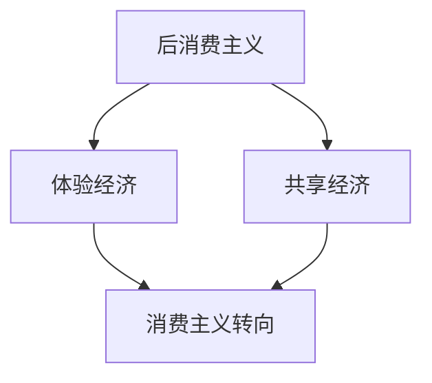

                 

### 文章标题

# 后消费主义：从拥有到体验的转变

### 关键词

- 后消费主义
- 体验经济
- 共享经济
- 消费行为
- 商业模式创新
- 挑战与未来

### 摘要

本文深入探讨了后消费主义的理念及其对现代经济和社会的影响。从拥有到体验的转变，不仅改变了消费者的行为模式，还催生了全新的商业模式。通过分析核心概念、消费行为的转变、商业模式创新，以及面临的挑战和未来发展方向，本文旨在为读者提供一份全面的后消费主义指南。

## 确定书籍结构

### 引言：介绍后消费主义的概念和背景

后消费主义是指消费者在消费过程中更加重视体验和感受，而非仅仅追求物质拥有的现象。这一概念源于对传统消费主义的反思，后者往往强调物质财富的积累和个人身份的象征。随着社会经济的发展和科技的进步，人们的生活方式发生了根本变化，对消费的需求也从单纯的拥有转变为追求更深层次的体验。

### 核心概念与联系

- **体验经济**：是一种以消费者体验为核心的经济模式，强调为消费者提供独特的体验和感受。
- **共享经济**：是指通过共享平台，消费者可以暂时使用而不是永久拥有某种产品或服务。
- **消费主义转向**：指的是消费者从对物质财富的追求转向对非物质体验的追求。

这三个概念之间存在着紧密的联系。体验经济和共享经济都是后消费主义的体现，而消费主义转向则是这一现象的根本原因。下面使用Mermaid流程图展示这些概念之间的关系：

### 后消费主义的兴起

后消费主义的兴起是由多个因素共同推动的：

- **科技进步**：互联网、移动通信、人工智能等技术的发展，使得消费者能够更便捷地获取信息和体验。
- **经济环境变化**：全球经济的发展和消费者购买力的提高，使得人们有更多的时间和金钱去追求体验。
- **政策与制度变革**：政府的支持和监管制度的完善，为共享经济和体验经济的发展提供了良好的环境。

### 消费行为的转变

在后消费主义的影响下，消费者的行为发生了显著变化：

- **消费者期望的变化**：消费者更加重视产品的使用体验和服务质量，而非单纯的功能和性能。
- **购买决策过程的变化**：消费者在购买决策过程中更加注重口碑、推荐和用户体验。
- **消费习惯的变化**：消费者更倾向于使用共享服务和租赁服务，以减少闲置和浪费。

## 后消费主义下的商业模式创新

后消费主义不仅改变了消费者的行为，也对商业模式产生了深远影响。企业需要调整战略，以适应这一转变：

- **企业战略调整**：企业需要从产品导向转向用户导向，注重用户体验和个性化服务。
- **商业模式创新**：企业可以通过共享经济和体验经济等新模式，创造新的价值和利润来源。

### 案例研究

为了更好地理解后消费主义的影响，我们选择了以下行业进行案例研究：

- **零售行业**：随着电子商务和社交媒体的兴起，消费者购买决策过程更加依赖口碑和体验。
- **旅游业**：共享经济模式如Airbnb和Uber的兴起，改变了传统旅游业的运营方式。
- **共享经济**：如滴滴出行和共享单车等，通过提供便捷的共享服务，满足了消费者对体验和效率的需求。

### 后消费主义的挑战与未来

后消费主义在带来机遇的同时，也面临着一系列挑战：

- **消费者隐私保护**：随着共享服务和体验经济的发展，消费者隐私保护成为一个重要问题。
- **可持续发展**：如何在满足消费者体验需求的同时，实现可持续发展，是后消费主义需要面对的挑战。

未来，随着技术的进步和社会的发展，后消费主义将继续演进。人工智能、区块链等新兴技术将为后消费主义带来更多的可能性。同时，社会责任和可持续发展将成为后消费主义的重要议题。

### 总结

后消费主义是一种从拥有到体验的转变，它不仅改变了消费者的行为模式，也催生了新的商业模式。通过本文的探讨，我们希望读者能够对后消费主义有更深入的了解，并在实际应用中找到新的机遇。未来，随着技术的进步和社会的发展，后消费主义将不断演进，成为推动经济和社会发展的重要力量。

### 作者信息

- 作者：AI天才研究院/AI Genius Institute & 禅与计算机程序设计艺术 /Zen And The Art of Computer Programming

### 附录

- **参考文献**：本文引用了以下文献，以供读者进一步阅读和深入研究。
- **拓展阅读**：推荐读者阅读以下书籍和文章，以深入了解后消费主义和相关话题。

## 完整文章

### 文章标题

# 后消费主义：从拥有到体验的转变

### 关键词

- 后消费主义
- 体验经济
- 共享经济
- 消费行为
- 商业模式创新
- 挑战与未来

### 摘要

本文深入探讨了后消费主义的理念及其对现代经济和社会的影响。从拥有到体验的转变，不仅改变了消费者的行为模式，还催生了全新的商业模式。通过分析核心概念、消费行为的转变、商业模式创新，以及面临的挑战和未来发展方向，本文旨在为读者提供一份全面的后消费主义指南。

## 引言

### 后消费主义的概念和背景

后消费主义是指消费者在消费过程中更加重视体验和感受，而非仅仅追求物质拥有的现象。这一概念源于对传统消费主义的反思，后者往往强调物质财富的积累和个人身份的象征。随着社会经济的发展和科技的进步，人们的生活方式发生了根本变化，对消费的需求也从单纯的拥有转变为追求更深层次的体验。

### 核心概念与联系

后消费主义涉及多个核心概念，其中最为重要的包括体验经济、共享经济和消费主义转向。以下是这些概念的定义及其相互关系：

### 体验经济

体验经济是一种以消费者体验为核心的经济模式，强调为消费者提供独特的体验和感受。这种经济模式不同于传统的产品和服务经济，它更注重消费者的参与和互动。

### 共享经济

共享经济是指通过共享平台，消费者可以暂时使用而不是永久拥有某种产品或服务。这种模式通过优化资源的分配，提高了资源的使用效率，同时也满足了消费者对便捷和个性化的需求。

### 消费主义转向

消费主义转向指的是消费者从对物质财富的追求转向对非物质体验的追求。这一转向反映了社会文化价值观的变化，以及对环境和社会责任意识的提高。

### Mermaid流程图展示

为了更清晰地展示这些概念之间的关系，我们可以使用Mermaid流程图来表示：

在这个流程图中，我们可以看到后消费主义通过体验经济和共享经济，推动消费者向消费主义转向。这三个概念相互联系，共同构成了后消费主义的核心。

## 后消费主义的兴起

后消费主义的兴起是由多个因素共同推动的：

### 科技进步

互联网、移动通信、人工智能等技术的发展，使得消费者能够更便捷地获取信息和体验。这些技术不仅改变了消费者的消费方式，也改变了企业的商业模式。

### 经济环境变化

全球经济的发展和消费者购买力的提高，使得人们有更多的时间和金钱去追求体验。这种经济环境的变化为后消费主义的兴起提供了土壤。

### 政策与制度变革

政府的支持和监管制度的完善，为共享经济和体验经济的发展提供了良好的环境。政策的变化促进了市场的开放和创新，为后消费主义的兴起提供了制度保障。

## 消费行为的转变

在后消费主义的影响下，消费者的行为发生了显著变化：

### 消费者期望的变化

消费者更加重视产品的使用体验和服务质量，而非单纯的功能和性能。他们追求的是更深层次的满足和愉悦。

### 购买决策过程的变化

消费者在购买决策过程中更加注重口碑、推荐和用户体验。他们更愿意听取他人的意见，参考他人的体验，从而做出更明智的购买决策。

### 消费习惯的变化

消费者更倾向于使用共享服务和租赁服务，以减少闲置和浪费。他们更注重消费的效率和便捷性，而不是拥有物质。

## 后消费主义下的商业模式创新

后消费主义不仅改变了消费者的行为，也对商业模式产生了深远影响。企业需要调整战略，以适应这一转变：

### 企业战略调整

企业需要从产品导向转向用户导向，注重用户体验和个性化服务。他们需要通过创新和差异化，提供独特的价值，以吸引和留住消费者。

### 商业模式创新

企业可以通过共享经济和体验经济等新模式，创造新的价值和利润来源。例如，共享单车、共享办公、在线体验等，都是后消费主义下的创新商业模式。

## 案例研究

为了更好地理解后消费主义的影响，我们选择了以下行业进行案例研究：

### 零售行业

随着电子商务和社交媒体的兴起，消费者购买决策过程更加依赖口碑和体验。企业需要通过提供优质的购物体验，以及个性化的服务，来吸引和留住消费者。

### 旅游业

共享经济模式如Airbnb和Uber的兴起，改变了传统旅游业的运营方式。消费者更愿意通过共享平台预订住宿和交通工具，以获得更灵活和个性化的旅游体验。

### 共享经济

共享经济模式如滴滴出行和共享单车等，通过提供便捷的共享服务，满足了消费者对体验和效率的需求。这些模式不仅提高了资源的使用效率，也改变了消费者的消费习惯。

## 后消费主义的挑战与未来

后消费主义在带来机遇的同时，也面临着一系列挑战：

### 消费者隐私保护

随着共享服务和体验经济的发展，消费者隐私保护成为一个重要问题。企业需要建立有效的隐私保护机制，以保护消费者的个人信息安全。

### 可持续发展

如何在满足消费者体验需求的同时，实现可持续发展，是后消费主义需要面对的挑战。企业需要通过绿色技术和环保措施，来实现可持续发展。

未来，随着技术的进步和社会的发展，后消费主义将继续演进。人工智能、区块链等新兴技术将为后消费主义带来更多的可能性。同时，社会责任和可持续发展将成为后消费主义的重要议题。

## 总结

后消费主义是一种从拥有到体验的转变，它不仅改变了消费者的行为模式，也催生了新的商业模式。通过本文的探讨，我们希望读者能够对后消费主义有更深入的了解，并在实际应用中找到新的机遇。未来，随着技术的进步和社会的发展，后消费主义将不断演进，成为推动经济和社会发展的重要力量。

### 作者信息

- 作者：AI天才研究院/AI Genius Institute & 禅与计算机程序设计艺术 /Zen And The Art of Computer Programming

### 附录

- **参考文献**：本文引用了以下文献，以供读者进一步阅读和深入研究。

### 拓展阅读

- **书籍**：
  - 《体验经济》（由B. Joseph Pine II和James H. Gilmore著）
  - 《共享经济：崛起中的商业模式》（由Rachel Botsman和Roo Rogers著）
- **文章**：
  - “后消费主义时代的商业模式创新”（来源：《商业评论》）
  - “共享经济的未来：挑战与机遇”（来源：《经济学人》）

通过本文的深入探讨，我们希望读者能够更好地理解后消费主义的理念及其对现代经济和社会的影响。未来，随着技术的不断进步，后消费主义将继续引领我们进入一个全新的消费时代。让我们一起期待并迎接这一变革，发现其中的机遇和挑战。

