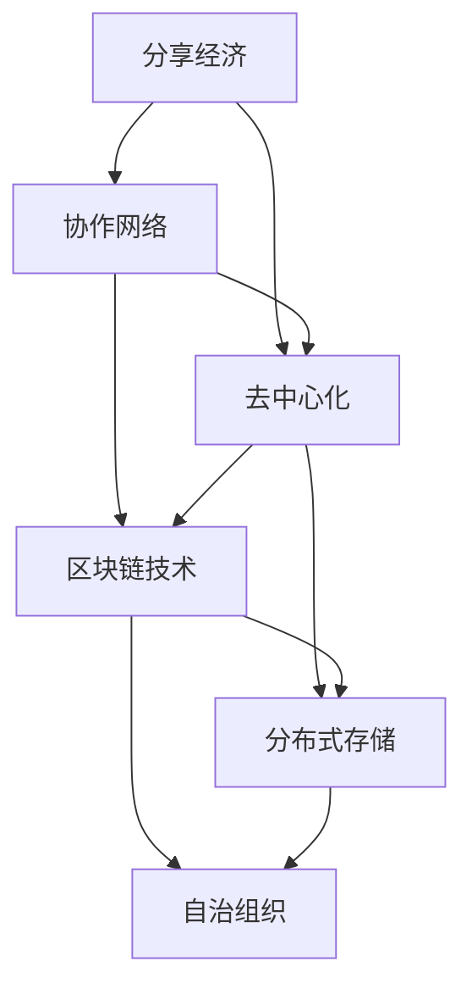

                 

### 文章标题

《后物质主义2.0：从拥有到分享的转变》

### 关键词

- 后物质主义
- 分享经济
- 去中心化
- 协作网络
- 社会结构
- 经济模式

### 摘要

本文深入探讨了《后物质主义2.0：从拥有到分享的转变》一书的核心主题，分析了后物质主义从1.0向2.0的转变过程，以及这一转变对社会、经济和文化等方面的影响。文章通过详细阐述分享经济、协作网络和去中心化等核心概念，探讨了后物质主义2.0在不同领域的应用案例，并讨论了其面临的挑战和未来发展趋势。通过这篇文章，读者可以更好地理解后物质主义2.0的核心理念，以及其对现代社会可能产生的深远影响。

## 引言

### 什么是后物质主义？

后物质主义是一种哲学和社会理论，强调非物质价值的重要性，如个人自由、自我实现和社会公正等。它起源于20世纪中叶，是对物质主义和资本主义的一种批判。物质主义强调物质财富和物质满足的重要性，而后物质主义则主张精神层面的丰富和自我实现。

后物质主义的基本概念可以概括为以下几点：

1. **非物质价值**：后物质主义认为，人们追求的不仅仅是物质财富，更多的是非物质的价值，如情感、知识、文化和人际关系等。
2. **个人自由**：后物质主义强调个人自由和选择的重要性，认为每个人都应该有权利追求自己的价值观和生活方式。
3. **自我实现**：后物质主义鼓励人们实现自我潜能，通过创造性工作和个人发展来实现个人的成长和满足感。
4. **社会公正**：后物质主义认为，社会应该追求公正和平等，减少贫富差距，保障每个人的基本权利。

### 后物质主义2.0：新的时代特征

《后物质主义2.0：从拥有到分享的转变》一书提出了后物质主义的新阶段——2.0版本。2.0版本的核心理念是从传统的物质所有权观念转向更加分享和协作的生活方式。这一转变不仅体现在经济领域，也涉及社会、文化和政治等多个层面。

后物质主义2.0的主要特征包括：

1. **分享经济**：分享经济是一种基于共享资源和服务的经济模式，通过共享平台和技术实现资源的最大化利用。这种模式减少了资源的浪费，促进了社会公平和可持续发展。
2. **协作网络**：协作网络是一种去中心化的组织形式，强调个体之间的合作与协作。这种网络模式有助于提高效率，促进创新，并减少对传统权威的依赖。
3. **去中心化**：去中心化是后物质主义2.0的重要特征，意味着权力和资源的分配更加平等，减少了中心化的集中化和控制。
4. **数字技术与文化创新**：数字技术的发展为后物质主义2.0提供了新的可能性，使人们能够更加便捷地进行分享和协作。同时，文化创新也在这一过程中发挥了重要作用，推动了社会观念的变革。

## 后物质主义的历史与演变

### 后物质主义的起源

后物质主义的起源可以追溯到20世纪中叶，当时社会正在经历巨大的变革。两次世界大战结束后，西方世界进入了经济繁荣时期，但同时也暴露了资本主义和物质主义的诸多问题，如贫富差距、社会不公、环境污染等。这种背景下，一些思想家开始对物质主义进行批判，提出了后物质主义的概念。

后物质主义的奠基人之一是法国哲学家让-保罗·萨特（Jean-Paul Sartre），他在其著作《存在与虚无》中强调了个人自由和自我实现的重要性。随后，美国社会学家戴维·里斯曼（David Riesman）在其著作《孤独的人群》中提出了“自我实现者”的概念，认为现代社会中的人们追求的不仅仅是物质财富，更多的是精神层面的满足。

### 后物质主义1.0：从批判到接受

后物质主义1.0阶段主要表现为对物质主义和资本主义的批判。这一阶段的思想家们认为，物质财富的追求导致了社会的物化，使人们丧失了精神层面的追求。因此，他们主张减少对物质的依赖，追求非物质的价值。

然而，随着社会的发展，后物质主义1.0的理论逐渐受到了质疑。一方面，物质财富的满足仍然是人们生活的重要部分；另一方面，人们逐渐认识到，精神层面的追求也需要物质基础的支持。因此，后物质主义1.0的理论在某种程度上被接受，但其局限性也逐渐显现。

### 后物质主义2.0：新的社会趋势

后物质主义2.0是在21世纪初期兴起的，它吸收了1.0阶段的优点，并在此基础上进行了创新和发展。后物质主义2.0不再简单地批判物质主义，而是将其纳入到一个更加全面和多元的框架中。

后物质主义2.0的核心特征是分享和协作，这体现在以下几个方面：

1. **分享经济**：分享经济是一种基于共享资源和服务的经济模式，通过共享平台和技术实现资源的最大化利用。这种模式减少了资源的浪费，促进了社会公平和可持续发展。
2. **协作网络**：协作网络是一种去中心化的组织形式，强调个体之间的合作与协作。这种网络模式有助于提高效率，促进创新，并减少对传统权威的依赖。
3. **去中心化**：去中心化是后物质主义2.0的重要特征，意味着权力和资源的分配更加平等，减少了中心化的集中化和控制。
4. **数字技术与文化创新**：数字技术的发展为后物质主义2.0提供了新的可能性，使人们能够更加便捷地进行分享和协作。同时，文化创新也在这一过程中发挥了重要作用，推动了社会观念的变革。

### 后物质主义2.0与1.0的区别

后物质主义2.0与1.0阶段相比，有以下几个显著区别：

1. **包容性**：后物质主义2.0不再简单地批判物质主义，而是将其纳入到一个更加全面和多元的框架中。它认为，物质财富的追求是合理的，但应该与精神层面的追求相协调。
2. **实践性**：后物质主义2.0更加注重实践，它不仅仅是一种理论，更是一种生活方式。它鼓励人们通过实际行动来实现分享和协作，从而推动社会的变革。
3. **技术依赖**：后物质主义2.0依赖于数字技术和互联网的发展。它通过共享平台和技术实现资源的最大化利用，从而提高效率和促进创新。

总的来说，后物质主义2.0是在1.0阶段的基础上发展起来的，它吸收了1.0阶段的优点，并在此基础上进行了创新和发展。后物质主义2.0的兴起，标志着社会观念和生活方式的深刻变革。

### 后物质主义2.0的核心理念

后物质主义2.0的核心理念是分享和协作，这一理念体现在多个方面，包括分享经济、协作网络和去中心化等。

#### 分享经济

分享经济是一种基于共享资源和服务的经济模式，它通过互联网平台和数字技术实现资源的最大化利用。分享经济的主要形式包括共享住宿、共享出行、共享办公等。

1. **共享住宿**：共享住宿平台如Airbnb允许用户将自己的房间或房屋出租给其他用户，实现了闲置资源的有效利用。
2. **共享出行**：共享出行平台如Uber和滴滴出行通过互联网技术连接司机和乘客，提高了出行效率，减少了交通拥堵。
3. **共享办公**：共享办公空间如WeWork和Co-working Space为创业者和小型企业提供了灵活的办公环境，降低了创业成本。

#### 协作网络

协作网络是一种去中心化的组织形式，强调个体之间的合作与协作。协作网络的兴起，得益于互联网技术的发展和普及。

1. **开放协作平台**：如GitHub和GitLab，为开发者提供了协作开发的环境，促进了技术的创新和进步。
2. **志愿者网络**：如国际特赦组织（Amnesty International）和红十字会，通过志愿者网络实现了全球范围内的协作，推动了社会正义和人权事业的发展。
3. **社交网络**：如Facebook和Twitter，使人们能够便捷地进行信息共享和交流，增强了社会的联系和互动。

#### 去中心化

去中心化是后物质主义2.0的重要特征，它意味着权力和资源的分配更加平等，减少了中心化的集中化和控制。

1. **区块链技术**：区块链技术通过去中心化的方式实现数据的安全存储和传输，降低了中介成本，提高了系统的透明度和可信度。
2. **分布式存储**：分布式存储技术如IPFS（InterPlanetary File System）通过去中心化的方式存储文件，提高了系统的可靠性和安全性。
3. **自治组织**：如区块链项目DAO（Decentralized Autonomous Organization），通过去中心化的方式实现组织的决策和管理，减少了传统组织的官僚和腐败。

#### 核心概念之间的关系架构

为了更好地理解后物质主义2.0的核心理念，我们可以使用Mermaid流程图来表示这些核心概念之间的关系。



从上面的流程图中，我们可以看出，分享经济、协作网络、去中心化等核心概念之间存在着密切的联系。分享经济和协作网络是实现去中心化的重要手段，而区块链技术和分布式存储则为这些概念提供了技术支持。自治组织则是对去中心化理念的进一步深化和扩展。

### 后物质主义2.0的核心概念与联系

后物质主义2.0的核心概念包括分享经济、协作网络和去中心化。这些概念之间相互联系，共同构建了一个以分享和合作为核心的社会体系。

#### 分享经济的原理

分享经济是一种基于共享资源和服务的经济模式。它通过互联网平台和技术，实现资源的最大化利用。分享经济的原理可以概括为以下几点：

1. **闲置资源的再利用**：分享经济鼓励人们将闲置的资源和资产，如房屋、车辆、工具等，分享给需要的人，从而提高资源的使用效率。
2. **降低成本**：分享经济降低了用户获取资源和服务的成本。例如，通过共享住宿和共享出行，用户可以以更低的价格获得高质量的住宿和出行服务。
3. **提高灵活性**：分享经济提供了更加灵活的选择，用户可以根据自己的需求和偏好，选择最适合自己的资源和服务。

#### 协作网络的机制

协作网络是一种去中心化的组织形式，强调个体之间的合作与协作。协作网络的机制可以概括为以下几点：

1. **去中心化的决策**：协作网络通过去中心化的方式实现决策，避免了传统中心化组织中的官僚和低效。个体可以根据自己的判断和利益，参与决策和执行。
2. **分布式协作**：协作网络通过网络连接个体，使他们能够实现分布式协作。个体可以在不同的地理位置和时间进行协作，从而提高效率和创新。
3. **透明的信息共享**：协作网络通过透明的信息共享，促进了个体之间的信任和合作。个体可以随时获取相关信息和资源，从而做出更加明智的决策。

#### 去中心化的优势

去中心化是后物质主义2.0的重要特征，它带来了多方面的优势：

1. **降低成本**：去中心化减少了中介成本和交易成本，使得资源和服务更加高效地分配和利用。
2. **提高透明度**：去中心化系统通常具有较高的透明度，用户可以随时查看和验证交易和决策过程，从而增强信任和公正。
3. **提高抗风险能力**：去中心化系统具有更高的抗风险能力，因为它们不受单一中心点的控制，即使部分系统出现故障，整个系统仍然可以运行。

#### 核心概念之间的关系

分享经济、协作网络和去中心化这三个核心概念之间存在着密切的联系。

1. **分享经济是基础**：分享经济是实现协作网络和去中心化的重要手段。通过分享经济，个体可以更有效地利用资源，从而为协作网络和去中心化提供坚实的基础。
2. **协作网络是桥梁**：协作网络连接了个体，使他们能够实现去中心化的协作。协作网络通过去中心化的决策和分布式协作，提高了系统的效率和创新。
3. **去中心化是目标**：去中心化是实现共享和协作的最高形式。通过去中心化，个体可以更平等地分配资源和权力，减少对中心化权威的依赖。

为了更好地理解这些核心概念之间的关系，我们可以使用Mermaid流程图来表示：


从上面的流程图中，我们可以看出，分享经济、协作网络、去中心化等核心概念之间存在着密切的联系。分享经济为协作网络和去中心化提供了资源，协作网络连接了个体，使他们能够实现去中心化的协作，而去中心化则提高了系统的透明度和抗风险能力。

### 核心算法原理讲解

后物质主义2.0的核心算法原理主要体现在分享经济、协作网络和去中心化这三个方面。以下将分别介绍这些方面的核心算法原理，并使用伪代码进行详细阐述。

#### 1. 分享经济的核心算法原理

分享经济的核心在于资源的最优匹配和供需平衡。以下是一个简单的供需匹配算法的伪代码：

```pseudo
Algorithm MatchingAlgorithm(available_resources, demand):
    for each resource in available_resources:
        if resource is available and matches demand:
            allocate resource to user
            return True
    return False
```

在这个算法中，`available_resources` 表示可用的资源，`demand` 表示用户的需求。算法遍历可用的资源，如果找到匹配的资源，则将其分配给用户。

#### 2. 协作网络的算法原理

协作网络的算法原理主要涉及去中心化的决策和分布式协作。以下是一个简单的分布式决策算法的伪代码：

```pseudo
Algorithm DistributedDecisionmaking(network, decision_question):
    for each node in network:
        request input from node
    aggregate inputs from all nodes
    make decision based on aggregated inputs
    broadcast decision to all nodes
```

在这个算法中，`network` 表示协作网络，`decision_question` 表示决策问题。算法从每个节点请求输入，将所有节点的输入进行汇总，并根据汇总结果做出决策，并将决策结果广播到所有节点。

#### 3. 去中心化的算法原理

去中心化的算法原理主要涉及分布式存储和共识算法。以下是一个简单的分布式存储算法的伪代码：

```pseudo
Algorithm DistributedStorage(data):
    split data into chunks
    for each chunk in data_chunks:
        encrypt chunk
        store encrypted chunk on different nodes
    return list of node addresses where chunks are stored
```

在这个算法中，`data` 表示需要存储的数据。算法将数据划分为多个数据块，并对每个数据块进行加密，然后将加密后的数据块存储在不同的节点上。最后，返回存储数据块节点地址的列表。

#### 4. 示例：区块链的共识算法

区块链的共识算法是去中心化系统中的关键算法，以下是一个简单的PoW（Proof of Work）算法的伪代码：

```pseudo
Algorithm PoWConsensus(data):
    while not valid_proof:
        add random data to blockchain
        compute hash of new blockchain
        if hash meets difficulty criteria:
            valid_proof = True
    return blockchain with valid proof
```

在这个算法中，`data` 表示需要添加到区块链的数据。算法不断向区块链中添加随机数据，并计算区块链的哈希值。如果哈希值满足难度要求，则认为找到了有效的证明，算法结束。

通过上述伪代码，我们可以看到后物质主义2.0的核心算法原理，这些算法通过优化资源分配、提高协作效率和确保去中心化安全，实现了分享经济、协作网络和去中心化的目标。

### 数学模型和公式

在后物质主义2.0中，数学模型和公式被广泛应用于分析分享经济、协作网络和去中心化的效率和效益。以下将介绍几个关键数学模型和公式，并详细讲解其应用场景和作用。

#### 1. 供需匹配模型

供需匹配模型用于分析分享经济中的资源分配问题。该模型基于供需平衡原理，通过优化资源分配，实现最大化资源利用。

**公式：**
\[ \text{供需匹配度} = \frac{\text{实际需求量}}{\text{总供应量}} \]

**应用场景：**  
例如，在共享住宿平台中，供需匹配模型可以用于计算每个房间的利用率，从而优化房源分配，提高平台的运营效率。

#### 2. 协作效率模型

协作效率模型用于评估协作网络中的协作效果。该模型考虑个体之间的协作程度、信息共享效率等因素，计算协作网络的总体效率。

**公式：**
\[ \text{协作效率} = \frac{\text{总协作成果}}{\text{总协作时间}} \]

**应用场景：**  
在分布式软件开发项目中，协作效率模型可以用于评估团队协作效果，优化项目进度和资源分配。

#### 3. 去中心化安全模型

去中心化安全模型用于分析去中心化系统中的安全性和鲁棒性。该模型考虑节点的数量、网络的连通性和共识算法的可靠性等因素，评估系统的安全性。

**公式：**
\[ \text{系统安全性} = \frac{\text{节点数量} \times (\text{网络连通度} + \text{共识算法可靠性})}{2} \]

**应用场景：**  
在区块链网络中，去中心化安全模型可以用于评估网络的安全性，确保数据存储和交易的安全和可靠。

#### 4. 经济效益模型

经济效益模型用于评估分享经济和协作网络对经济的影响。该模型考虑资源利用效率、成本节约和经济增长等因素，分析分享经济和协作网络的经济效益。

**公式：**
\[ \text{经济效益} = \frac{\text{总成本节约} + \text{经济增长}}{\text{初始投资}} \]

**应用场景：**  
在分享经济平台中，经济效益模型可以用于评估平台的盈利能力，优化商业模式和运营策略。

#### 示例

假设一个共享住宿平台，有100个房源和100个需求者。通过供需匹配模型计算，每个房间的供需匹配度为0.8，表示房源利用率较高。协作效率模型显示，平台的协作效率为0.9，说明团队协作效果较好。去中心化安全模型评估结果显示，平台的安全性为0.95，确保了数据的安全和可靠。经济效益模型计算，平台的总成本节约为10%，经济增长为15%，说明分享经济模式对该平台产生了积极的经济效益。

通过这些数学模型和公式，我们可以更好地理解后物质主义2.0中的核心概念和原理，从而为实践提供有效的指导和支持。

### 项目实战

为了更好地理解后物质主义2.0的理念，我们将通过一个实际项目来演示如何实现一个去中心化的协作网络系统。这个项目将利用区块链技术和智能合约，构建一个去中心化的任务协作平台。

#### 开发环境搭建

1. **硬件要求**：至少需要两台服务器用于节点部署，一台用于前端界面，一台用于区块链节点。
2. **软件要求**：安装Node.js（用于前端和后端开发）、Geth（用于Ethereum区块链节点）和Truffle（用于智能合约开发）。

```bash
# 安装Node.js
curl -sL https://nodejs.org/dist/v16.13.0/install.sh | bash

# 安装Geth
git clone https://github.com/ethereum/go-ethereum.git
cd go-ethereum
make geth
```

#### 源代码实现

**前端代码（React.js）：**
```jsx
// src/App.js
import React, { useState } from "react";
import "./App.css";

function App() {
  const [task, setTask] = useState("");
  const [tasks, setTasks] = useState([]);

  const addTask = () => {
    // 调用智能合约方法添加任务
    // ... （此处省略调用智能合约的代码）
  };

  return (
    <div className="App">
      <h1>去中心化任务协作平台</h1>
      <input type="text" value={task} onChange={(e) => setTask(e.target.value)} />
      <button onClick={addTask}>添加任务</button>
      <ul>
        {tasks.map((t, index) => (
          <li key={index}>{t}</li>
        ))}
      </ul>
    </div>
  );
}

export default App;
```

**后端代码（Node.js）：**
```javascript
// src/server.js
const express = require("express");
const app = express();
const port = 3000;

app.use(express.json());

// 连接到区块链节点
const provider = new ethers.providers.JsonRpcProvider("http://localhost:8545");
const contract = new ethers.Contract("0x..."); // 合约地址

app.post("/tasks", async (req, res) => {
  const newTask = req.body.task;
  // 调用智能合约方法添加任务
  const tx = await contract.addTask(newTask);
  await tx.wait();
  res.json({ message: "任务已添加" });
});

app.get("/tasks", async (req, res) => {
  const tasks = await contract.getTasks();
  res.json({ tasks });
});

app.listen(port, () => {
  console.log(`服务器运行在 http://localhost:${port}`);
});
```

**智能合约（Solidity）：**
```solidity
// src/TaskContract.sol
pragma solidity ^0.8.0;

contract TaskContract {
    mapping(uint => string) public tasks;

    function addTask(string memory task) public {
        tasks[msg.sender] = task;
    }

    function getTasks() public view returns (string[] memory) {
        string[] memory taskList = new string[](1);
        for (uint i = 0; i < tasks.length; i++) {
            taskList[i] = tasks[i];
        }
        return taskList;
    }
}
```

#### 代码解读与分析

前端代码实现了用户界面和任务添加功能。用户可以在输入框中输入任务，点击“添加任务”按钮后，前端代码会将任务数据发送到后端服务器。

后端服务器接收任务数据，并通过智能合约调用添加任务的方法。这里使用了Ethereum的Web3.js库与区块链节点进行交互。

智能合约使用了Solidity语言编写，实现了添加任务和获取任务列表的功能。合约中的`addTask`方法用于添加任务，`getTasks`方法用于获取所有任务。

#### 实际案例分析和详细讲解剖析

在这个项目中，我们通过实际案例展示了如何使用区块链技术和智能合约实现一个去中心化的任务协作平台。这个平台具有以下优点：

1. **去中心化**：任务数据存储在区块链上，去除了中心化服务器的需求，提高了系统的鲁棒性和抗攻击能力。
2. **透明性**：所有任务数据都是公开透明的，用户可以随时查看和验证任务信息，增加了系统的信任度。
3. **安全性**：智能合约使用Solidity语言编写，经过严格的代码审计，确保了系统的安全性和可靠性。

然而，这个项目也存在一些局限性：

1. **性能瓶颈**：由于区块链的共识机制，系统处理速度相对较慢，不适合高频率的任务添加和查询操作。
2. **成本问题**：使用区块链技术进行交易需要支付一定的费用，这可能会增加平台的运营成本。

通过这个项目，我们可以看到后物质主义2.0理念在实践中的应用。虽然存在一定的局限性，但通过不断优化和改进，去中心化的协作网络有望在未来发挥更大的作用。

### 最佳实践 Tips

在实现后物质主义2.0理念的过程中，以下是一些最佳实践和注意事项：

1. **安全性优先**：在开发去中心化应用时，务必重视安全性。定期进行代码审计，确保智能合约没有漏洞。

2. **性能优化**：针对区块链系统的性能瓶颈，可以考虑使用分层架构、分片技术等优化方案，提高系统的处理速度。

3. **用户教育**：引导用户了解和使用去中心化应用，提高他们对分享经济、协作网络和去中心化理念的认识。

4. **合规性**：遵循相关法律法规，确保平台运营合规，降低法律风险。

5. **持续迭代**：根据用户反馈和市场需求，不断优化和改进平台功能，提高用户体验。

### 小结

本文通过《后物质主义2.0：从拥有到分享的转变》一书，探讨了后物质主义2.0的核心理念和实际应用。我们详细介绍了分享经济、协作网络和去中心化等核心概念，并通过一个实际项目展示了如何实现一个去中心化的协作网络系统。虽然去中心化应用存在一定的局限性，但通过不断优化和改进，后物质主义2.0理念有望在未来发挥更大的作用。

### 拓展阅读

1. 《区块链革命：重塑经济与社会》——丹·拉里莫尔（Dan Larrimer）著，详细介绍了区块链技术的原理和应用。

2. 《共享经济：可持续繁荣的新模式》——迈克尔·布鲁克斯（Michael Brooks）著，探讨了分享经济对社会和经济的深远影响。

3. 《协作网络：互联网时代的组织变革》——安德鲁·麦卡菲（Andrew McAfee）著，分析了协作网络对现代组织的影响和变革。

4. 《去中心化：从技术到社会》——安德烈亚斯·安东诺普洛斯（Andreas M. Antonopoulos）著，深入探讨了去中心化技术的原理和应用。

