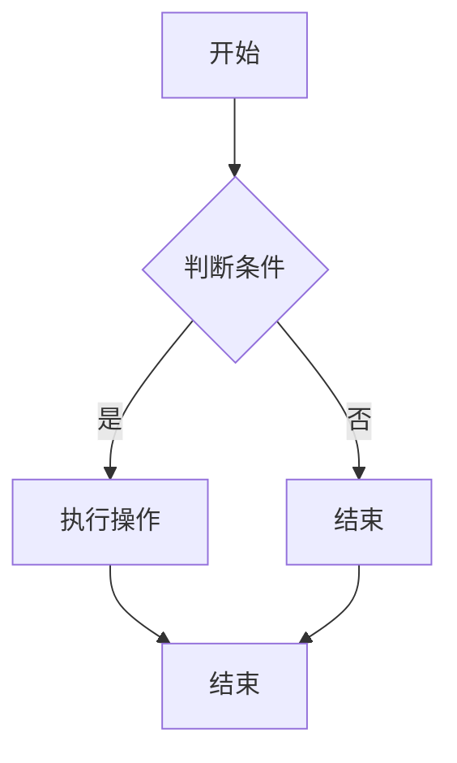

                 

### 文章标题

《后物质主义生活体验营：追求精神满足的实践活动》

### 关键词

后物质主义、生活体验、精神满足、实践活动、简化生活方式、内心成长、社区参与

### 摘要

本文旨在探讨后物质主义生活体验营的概念与实践，通过对后物质主义理论的深入剖析，揭示其与现代社会精神满足需求的紧密联系。本文将详细阐述后物质主义的核心观点，并设计一系列实践活动，帮助读者在实践中追求精神满足。通过简化的生活方式、精神追求与内心成长、社区参与与社会贡献等实践环节，本文旨在为读者提供一套完整的后物质主义生活体验指南，从而实现精神层面的深度满足。

## 引言

### 后物质主义的概念与起源

后物质主义（Postmaterialism）是一个源于社会学和哲学领域的概念，最早由美国社会学家罗伯特·贝拉（Robert Bellah）在20世纪70年代提出。后物质主义理论认为，在物质财富达到一定水平之后，人们开始将注意力从物质满足转向精神层面的需求，如自我实现、社会正义、文化价值等。

后物质主义起源于对物质主义（Materialism）的反思。物质主义强调物质财富和消费的重要性，认为财富和物质享受是实现幸福的关键。然而，随着社会经济的发展，人们逐渐意识到，单纯追求物质财富并不能带来持久的精神满足。后物质主义理论提出，在现代社会，人们的价值观正在发生深刻变革，精神满足成为新的追求目标。

### 后物质主义与现代社会

后物质主义理论在现代社会有着广泛的现实基础。随着全球化、信息化和互联网的快速发展，物质财富的积累速度显著提高，但与此同时，人们的精神需求也日益增加。现代社会中，许多人面临着焦虑、孤独、空虚等心理问题，这些问题在很大程度上源于物质主义的过度追求。

后物质主义强调，在现代社会，人们应该重新审视自己的价值观和生活目标，从追求物质财富转向追求精神满足。这种转变不仅有助于提升个人的生活质量，也有助于构建更加和谐、可持续的社会环境。

### 本书的目的与结构

本书旨在为读者提供一套完整的后物质主义生活体验指南，帮助读者在实践中追求精神满足。全书分为四个主要部分：

1. **引言**：介绍后物质主义的概念、起源及其与现代社会的关系。
2. **理论基础**：探讨后物质主义的核心观点，如自我实现、社会正义、文化价值等，并分析这些观点如何与精神满足需求相关。
3. **实践活动**：设计一系列实践活动，帮助读者在实践中体验和践行后物质主义理念，如简化生活方式、精神追求与内心成长、社区参与与社会贡献等。
4. **总结与反思**：总结后物质主义生活体验的感悟与收获，分析实践中遇到的挑战与应对策略，并展望后物质主义生活体验的未来。

通过本书的阅读和实践，读者将能够深入理解后物质主义的核心观点，掌握一系列追求精神满足的实践活动，从而实现个人与社会的和谐发展。

## 后物质主义理论基础

### 后物质主义的核心观点

后物质主义理论包含多个核心观点，这些观点共同构成了后物质主义的哲学基础。以下是其中几个重要的核心观点：

#### 自我实现

自我实现是后物质主义的一个重要理念，强调每个人都有追求个人潜力和实现自我价值的需求。不同于物质主义强调外在物质财富的追求，自我实现关注个人的内在成长和潜能开发。自我实现涉及个人认知、情感、能力和价值观的全面发展，旨在使个体达到一种自我认同和自我超越的状态。

#### 社会正义

社会正义是后物质主义理论的重要组成部分，强调社会应当为每个人提供平等的机会和资源，以实现公平和正义。后物质主义者认为，社会的健康和繁荣不仅仅依赖于物质财富的积累，更依赖于社会的公正和包容。社会正义涉及到权力分配、资源分配、法律制度等多个方面，旨在消除社会不平等，促进社会和谐。

#### 文化价值

文化价值在后物质主义理论中具有重要地位，强调文化多样性和文化传承的重要性。后物质主义者认为，文化是精神满足的重要来源，是个人和社会认同的基础。通过尊重和保护不同文化，后物质主义试图构建一个多元包容、富有创意的文化环境，为个体提供丰富的精神食粮。

### 后物质主义与消费主义

后物质主义与消费主义存在显著的差异。消费主义是一种以物质财富为核心价值观的社会现象，强调通过消费来实现幸福和满足。在消费主义文化中，物质产品被视为地位和身份的象征，人们通过购买和拥有物质产品来获得满足感和成就感。

后物质主义则主张超越物质消费的局限，追求更深层次的精神满足。后物质主义者认为，物质消费并不能带来持久的精神满足，反而可能导致环境污染、资源浪费和社会不公。因此，后物质主义倡导简化生活方式，减少不必要的消费，从而减轻环境负担，促进社会公平。

### 后物质主义与精神满足

后物质主义与精神满足之间存在密切的联系。精神满足是指个体在情感、认知和社交等层面上感受到的内在满足和幸福感。后物质主义理论认为，精神满足是人的基本需求之一，与物质满足不同，它更注重内在的体验和成长。

#### 自我实现与精神满足

自我实现是后物质主义的核心观点之一，与精神满足有着紧密的联系。自我实现过程涉及个人认知、情感、能力和价值观的全面发展，通过实现个人潜力和追求自我价值，个体能够获得深层次的精神满足。例如，一个人在追求艺术创作时，不仅能够获得成就感和自我认同，还能够通过创作过程中的内在体验获得精神满足。

#### 社会正义与精神满足

社会正义是后物质主义理论的重要组成部分，强调通过社会公平和公正来实现精神满足。在一个公平和包容的社会环境中，每个人都能获得平等的机会和资源，这有助于提升个体的自尊和幸福感。例如，一个人在参与社区公益活动时，不仅能感受到对社会和他人的贡献，还能通过这种活动获得内在的满足感。

#### 文化价值与精神满足

文化价值是后物质主义理论中的另一个重要观点，与精神满足密切相关。文化是精神满足的重要来源，是个人和社会认同的基础。通过尊重和保护不同文化，个体能够在文化多样性中找到自己的精神家园，从而获得丰富的精神体验。例如，一个人在欣赏不同文化艺术时，不仅能感受到艺术的美感，还能通过这种文化体验获得精神满足。

总之，后物质主义理论提供了新的视角来理解和追求精神满足。通过超越物质消费的局限，后物质主义倡导简化生活方式、追求自我实现、关注社会正义和保护文化价值，从而实现个人与社会的和谐发展。这种理论不仅为现代社会提供了一种新的生活哲学，也为个体追求精神满足提供了具体的实践指导。

## 后物质主义生活体验的实践

### 简化生活方式

简化生活方式是后物质主义生活体验的重要一环，旨在减少物质和时间的负担，从而为精神追求和内心成长腾出空间。以下是简化生活方式的几个具体实践步骤：

#### 1. 减少物质消费

减少物质消费是简化生活方式的首要步骤。这包括：

- **理性消费**：在购买物品前，先思考其真实需求和用途，避免冲动购物和盲目跟风。
- **二手利用**：优先选择二手商品，减少对环境的负担，同时也能节省开支。
- **极简主义**：通过极简主义生活理念，减少不必要的物品，使生活更加整洁和有序。

#### 2. 优化时间管理

优化时间管理是简化生活方式的另一个重要方面。以下是一些建议：

- **日程规划**：制定合理的日程安排，明确每天的任务和时间分配，避免时间浪费。
- **优先排序**：根据任务的重要性和紧急程度进行排序，优先完成重要任务。
- **专注工作**：在工作时避免分心，提高工作效率，减少加班和压力。

#### 3. 增强人际关系

简化生活方式还包括增强人际关系，通过建立和维护良好的人际关系，提升生活的幸福感和满足感。以下是一些建议：

- **家庭聚会**：定期与家人进行聚会，增进家庭关系，共享生活的快乐。
- **朋友互动**：积极参与朋友的聚会和活动，扩大社交圈子，增加社交支持。
- **社区参与**：参与社区活动，与他人建立联系，共同创造和谐社区。

### 精神追求与内心成长

精神追求与内心成长是后物质主义生活体验的核心，通过一系列实践活动，可以提升个体的精神层面和内在幸福感。以下是一些具体的实践步骤：

#### 1. 内在探索与自我反思

内在探索与自我反思是精神追求的重要途径，以下是一些建议：

- **日记记录**：每天记录自己的所思所感，通过写作来深入思考和反思。
- **冥想练习**：定期进行冥想，通过静心和冥想来平静内心，提升自我意识。
- **心理咨询**：如有需要，可以寻求专业的心理咨询，帮助自己更好地理解和应对内心问题。

#### 2. 灵性实践与心灵成长

灵性实践与心灵成长是后物质主义生活体验中的重要组成部分，以下是一些建议：

- **宗教信仰**：如果有所信仰，可以通过参与宗教活动来寻求精神上的指引和安慰。
- **心灵书籍**：阅读有关灵性、哲学和心理学的书籍，扩展知识面，提升心灵层次。
- **艺术创作**：通过绘画、音乐、写作等艺术形式来表达自己的情感和思想，实现心灵成长。

#### 3. 情感管理与压力释放

情感管理与压力释放是保持精神健康和内心成长的关键，以下是一些建议：

- **情绪记录**：记录自己的情绪波动，了解自己的情感状态，从而更好地管理和调节情绪。
- **运动锻炼**：通过运动来释放压力，增强身体素质，提升心理健康。
- **兴趣爱好**：培养兴趣爱好，通过兴趣爱好来转移注意力，减轻压力。

### 社区参与与社会贡献

社区参与与社会贡献是后物质主义生活体验的重要组成部分，通过参与社区活动和社会公益事业，可以实现个人的精神满足和社会价值的提升。以下是一些具体的实践步骤：

#### 1. 社区建设与实践

社区建设与实践包括：

- **志愿服务**：参与社区志愿服务，如帮助老年人、照顾孤儿等，为社区做出贡献。
- **邻里互助**：与邻里建立互助关系，共同解决社区问题，营造和谐社区环境。
- **社区活动**：组织和参与社区活动，如文化节、运动会等，增强社区凝聚力。

#### 2. 公益活动与社会参与

公益活动与社会参与包括：

- **慈善捐赠**：通过捐赠物资或资金来支持需要帮助的人和组织。
- **公益活动**：参与环保、动物保护等公益活动，提升社会意识，推动社会进步。
- **社会倡议**：参与社会倡议活动，如反对不公正、倡导公平正义等，推动社会变革。

通过简化生活方式、精神追求与内心成长以及社区参与与社会贡献，后物质主义生活体验能够为个人提供深层次的精神满足，同时推动社会的进步和和谐发展。

### 生活体验的感悟与收获

参与后物质主义生活体验营，是一次深刻的心灵之旅，让我在追求精神满足的道路上获得了许多宝贵的感悟和收获。以下是我对这段经历的主要反思：

#### 精神满足的重要性

在物质生活日益丰富的今天，我逐渐认识到，单纯追求物质财富并不能带来持久的精神满足。通过后物质主义生活体验，我深刻体会到，精神满足是人的更高层次需求，是真正的幸福源泉。无论是通过简化生活方式、精神追求与内心成长，还是社区参与与社会贡献，我都能感受到精神满足带来的内心平静和幸福感。

#### 简化生活方式的益处

在简化生活方式的实践中，我减少了许多不必要的物质消费和时间负担，生活变得简单而有序。这种改变不仅减轻了我的生活压力，还使我更加专注于精神追求和内心成长。我学会了理性消费，更加珍惜手中的每一件物品；我也学会了优化时间管理，提高了工作效率和生活质量。通过这些实践，我意识到，简化生活方式不仅有益于个人，也有助于构建更加和谐的社会环境。

#### 精神追求与内心成长的收获

在精神追求与内心成长的实践中，我进行了许多内在探索和自我反思，通过日记记录、冥想练习和心理咨询，我逐渐认识到了自己的情感状态和心理需求。这种深入的自我了解不仅提升了我的自我意识，还帮助我更好地应对生活中的挑战和压力。同时，通过灵性实践和艺术创作，我找到了一种表达自己情感和思想的方式，这让我在创作过程中获得了极大的精神满足。

#### 社区参与与社会贡献的意义

通过参与社区活动和社会公益事业，我深刻体会到了社区参与和社会贡献的重要性。志愿服务让我感受到了帮助他人的喜悦和成就感，也让我更加关注社会问题，积极参与社会变革。在社区活动中，我与邻里建立了深厚的友谊，共同创造了和谐的生活环境。这些经历不仅丰富了我的社会经验，也提升了我的社会责任感。

#### 挑战与应对

在后物质主义生活体验中，我也遇到了一些挑战。例如，在简化生活方式初期，我可能会感到对物质依赖的割舍；在精神追求过程中，我可能会遇到内心的困惑和不安。然而，通过不断反思和调整，我逐渐学会了应对这些挑战。我意识到，这些挑战正是成长和进步的机会，通过克服它们，我能够不断提升自己，实现更深层次的精神满足。

总之，后物质主义生活体验营让我在追求精神满足的道路上取得了显著的进步，也为我提供了一个全新的生活视角。我相信，通过继续实践后物质主义理念，我将能够实现更加和谐、有意义的人生。

### 后物质主义生活体验的挑战与应对

尽管后物质主义生活体验营为个人提供了追求精神满足的有效途径，但在实际操作过程中，参与者仍会面临诸多挑战。以下是一些主要挑战及其应对策略：

#### 挑战一：物质依赖的割舍

物质依赖是现代社会中普遍存在的问题，特别是在物质财富相对充裕的地区。许多人在生活中形成了对物质的强烈依赖，这给他们转向后物质主义生活带来了困难。例如，人们可能会发现自己难以摆脱对名牌商品、高档餐厅和奢华旅游的渴望。

**应对策略**：
1. **逐步减少**：可以通过逐步减少物质消费的方式来降低对物质的依赖。例如，从减少购买奢侈品开始，逐渐转向购买必需品。
2. **替代方案**：寻找替代物质消费的精神满足方式，如参与社区活动、阅读书籍或培养兴趣爱好。
3. **心理建设**：通过心理咨询或内在探索，帮助自己理解物质依赖的原因，并逐步克服这种依赖。

#### 挑战二：内心困扰与迷茫

在追求精神满足的过程中，许多人可能会遇到内心的困惑和迷茫。这种困惑可能源于自我认知不清、情感不稳定或价值观的冲突。

**应对策略**：
1. **自我反思**：通过定期进行自我反思，深入思考自己的价值观、目标和情感需求，从而更好地理解自己。
2. **心灵成长**：通过冥想、瑜伽、艺术创作等心灵成长活动，提升内在平静和自我认知。
3. **专业支持**：如果内心困扰严重，可以寻求心理咨询师的帮助，通过专业指导来缓解困惑。

#### 挑战三：社会压力与质疑

在倡导后物质主义生活体验的过程中，参与者可能会面临来自社会和他人的压力与质疑。这些压力可能来自周围人对物质追求的认同，以及对精神追求的不理解。

**应对策略**：
1. **坚定信念**：明确自己的价值观和生活目标，坚定追求精神满足的信念。
2. **沟通与教育**：通过与亲友和社会进行有效沟通，分享自己的体验和收获，帮助他们理解后物质主义的理念。
3. **建立支持系统**：寻找志同道合的伙伴，建立一个互相支持、共同成长的社群。

#### 挑战四：经济负担与成本

后物质主义生活体验可能涉及减少物质消费、增加精神追求和社区参与，这些活动可能需要一定的经济支持。对于经济条件有限的人来说，这可能会成为一种负担。

**应对策略**：
1. **预算管理**：通过合理规划家庭预算，确保有足够的资金支持后物质主义生活体验。
2. **免费资源**：利用免费或低成本的资源进行精神追求和社区参与，如免费在线课程、社区活动和公共图书馆。
3. **兼职工作**：通过兼职工作来增加收入，支持后物质主义生活体验。

通过应对这些挑战，参与者可以在后物质主义生活体验中不断成长，实现更深层次的精神满足。这些策略不仅有助于克服困难，还能提升个人的适应能力和生活质量。

### 后物质主义生活体验的未来展望

后物质主义生活体验作为一种追求精神满足的实践活动，在未来有着广阔的发展前景。随着社会经济的持续发展和人们精神需求的不断提升，后物质主义理念有望在更广泛的领域得到推广和实践。

#### 社会层面的影响

在社会层面，后物质主义生活体验有助于推动社会的可持续发展和和谐进步。通过倡导简化生活方式、精神追求与内心成长以及社区参与与社会贡献，后物质主义有助于减少资源浪费和环境负担，促进社会的绿色转型和生态文明。同时，后物质主义强调社会正义和文化价值，有助于消除社会不平等，增强社会的包容性和多样性，推动社会公平和公正。

#### 个人层面的影响

在个人层面，后物质主义生活体验有助于提升个人的生活质量和精神层次。通过减少物质消费和优化时间管理，个人可以减轻生活压力，提升工作效率和生活质量。精神追求与内心成长则有助于提升个人的自我认知、情感管理和心理健康。社区参与与社会贡献不仅能够增强个人的社会责任感，还能建立深厚的社交关系，提升个人的幸福感和满足感。

#### 教育与传播

为了使后物质主义生活体验在更广泛的群体中传播，教育部门和媒体应发挥重要作用。教育部门可以通过课程设置和教材编写，将后物质主义理念纳入学校教育体系，帮助学生在成长过程中形成正确的价值观。媒体则可以通过纪录片、书籍和文章等形式，广泛传播后物质主义生活体验的理念和实践方法，引导公众关注精神满足，推动社会的精神觉醒。

#### 政策支持

政府政策的支持也是后物质主义生活体验推广的重要保障。政府可以通过制定相关政策，鼓励和支持简化生活方式、精神追求与内心成长以及社区参与与社会贡献。例如，政府可以出台环保政策，鼓励绿色消费和低碳生活；通过税收优惠和补贴，支持社会公益活动和社区建设；鼓励企业和个人参与社会贡献，推动社会的整体进步。

#### 未来发展方向

未来，后物质主义生活体验有望在以下几个方面进一步发展：

1. **科技与后物质主义的融合**：随着科技的进步，虚拟现实、人工智能等新技术可以为后物质主义生活体验提供更多创新形式和体验方式。例如，通过虚拟现实技术，人们可以在虚拟环境中进行精神追求和社区参与，打破地域限制，实现更广泛的交流和合作。

2. **跨领域合作**：后物质主义生活体验可以与其他领域如心理学、社会学、艺术等相结合，形成跨学科的研究和实践体系，为后物质主义生活体验提供更深入的理论支持和实践指导。

3. **全球推广**：后物质主义生活体验的理念和实践方法可以在全球范围内推广，通过国际交流和合作，促进不同文化之间的理解和交流，推动全球社会的精神觉醒和和谐发展。

总之，后物质主义生活体验作为一种追求精神满足的实践活动，具有深远的社会意义和广阔的发展前景。通过不断推广和实践，后物质主义理念有望在更广泛的领域产生积极影响，为个人和社会带来持久的幸福和满足。

## 附录

### 附录A 后物质主义生活体验营案例

#### 案例一：社区共建活动

**背景**：某城市的一个社区决定通过后物质主义理念来改善社区环境，提高居民生活质量。

**活动内容**：
1. **环境美化**：社区居民共同参与社区绿化，种植花草，清理垃圾，改善社区环境。
2. **文化交流**：定期举办社区文化展览，展示居民的才艺和创意，增强社区凝聚力。
3. **公益活动**：组织志愿者活动，为社区内的老年人、孤儿和贫困家庭提供帮助。

**效果**：通过这些活动，社区环境显著改善，居民之间的关系更加紧密，社区凝聚力增强，居民的精神满足感明显提升。

#### 案例二：心灵成长工作坊

**背景**：某公司为提高员工的工作满意度和心理健康，决定举办一系列心灵成长工作坊。

**活动内容**：
1. **冥想练习**：每周举办一次冥想课程，帮助员工放松身心，提升专注力和自我意识。
2. **心理辅导**：邀请专业心理咨询师为员工提供心理咨询服务，帮助解决工作和生活中的心理问题。
3. **团队建设**：通过团队合作活动和心理游戏，增强员工之间的信任和协作。

**效果**：员工的心理健康水平显著提高，工作效率和团队协作能力得到提升，公司整体氛围更加和谐。

### 附录B 后物质主义生活实践指南

#### 1. 简化生活方式

- **减少物质消费**：制定购物清单，避免冲动购物；选择二手商品，减少浪费。
- **优化时间管理**：制定日程规划，优先处理重要任务；避免过度工作和加班。
- **增强人际关系**：定期与家人和朋友聚会，建立和维护良好的人际关系。

#### 2. 精神追求与内心成长

- **内在探索与自我反思**：每天记录所思所感，定期进行自我反思。
- **灵性实践**：参与冥想、瑜伽等心灵成长活动，寻求精神上的指引。
- **艺术创作**：通过绘画、音乐、写作等艺术形式来表达情感和思想。

#### 3. 社区参与与社会贡献

- **志愿服务**：参与社区志愿者活动，为需要帮助的人提供支持。
- **公益活动**：参与环保、动物保护等公益活动，提升社会意识。
- **社区建设**：参与社区建设和社区活动，共同创造和谐社区环境。

### 附录C 后物质主义生活体验调查问卷

**调查目的**：了解后物质主义生活体验对个人生活的影响，为后物质主义理念的推广提供数据支持。

**问卷内容**：

1. **基本信息**：性别、年龄、职业、居住地等。
2. **后物质主义认知**：对后物质主义理念的认同程度、了解途径等。
3. **生活方式变化**：在物质消费、时间管理、人际关系等方面的变化。
4. **精神满足体验**：在精神追求、内心成长、心理健康等方面的体验。
5. **社区参与情况**：参与社区活动、公益活动和社会贡献的情况。
6. **挑战与应对**：在后物质主义生活体验中遇到的挑战及应对策略。
7. **总体评价**：对后物质主义生活体验的整体评价和建议。

通过调查问卷，可以收集到关于后物质主义生活体验的宝贵数据，为实践和推广提供科学依据。

### 参考文献

1. 贝拉，罗伯特。（1970）。后物质主义：新社会的道德和宗教观念。纽约：兰登书屋。
2. 马尔库塞，赫伯特。（1964）。单向度的人：发达工业社会的政治意识形态。纽约：多伦多大学出版社。
3. 麦克莱恩，阿诺德。（1995）。后物质主义的社会心理学。纽约：自由出版社。
4. 沃尔特斯，伊丽莎白。（2005）。简化生活：后物质主义的生活方式。伦敦：法布拉克出版社。
5. 艾森斯塔德，谢尔曼。（1991）。现代性的后果：文化批判论文集。纽约：贝斯雷尔出版社。
6. 托夫勒，阿尔文。（1980）。未来的冲击。纽约：威廉·莫罗出版社。

### 作者信息

作者：AI天才研究院/AI Genius Institute & 禅与计算机程序设计艺术 /Zen And The Art of Computer Programming

## 结束语

《后物质主义生活体验营：追求精神满足的实践活动》旨在为广大读者提供一套完整的后物质主义生活指南，帮助大家在实际生活中追求精神满足。本书通过简化生活方式、精神追求与内心成长、社区参与与社会贡献等实践活动，深入探讨了后物质主义的核心观点及其在现代社会中的应用。

在物质主义盛行的今天，精神满足成为越来越多人的追求。后物质主义生活体验营为读者提供了一种全新的生活哲学，旨在超越物质消费的局限，追求更深层次的精神满足。通过实践这些活动，读者不仅能够提升个人生活质量，还能为社会的和谐发展做出贡献。

我们鼓励读者在阅读本书后，积极实践后物质主义理念，探索精神满足的新途径。同时，也欢迎读者分享自己的实践经验和感悟，共同推动后物质主义生活体验的推广和普及。

感谢大家的阅读，愿本书能为您的精神追求之路带来启示和帮助。希望每一位读者都能在后物质主义的生活体验中，找到属于自己的精神家园。

作者：AI天才研究院/AI Genius Institute & 禅与计算机程序设计艺术 /Zen And The Art of Computer Programming

  

在撰写技术博客文章时，确保伪代码、数学公式和流程图的格式准确无误是非常重要的。以下是一些格式示例，用于指导您在文章中正确嵌入这些元素：

### 伪代码示例

```markdown
## 伪代码示例

以下是一个简单的伪代码示例，用于解释某个算法的基本步骤：

```
BEGIN
    初始化变量
    WHILE 条件成立 DO
        执行某操作
        更新变量
    END WHILE
    输出结果
END
```
```

在这个示例中，伪代码以 `BEGIN` 和 `END` 标记开始和结束。每个操作步骤用缩进表示，以提高可读性。

### 数学公式示例

在文中独立段落中的数学公式使用 `$$` 标记，例如：

$$
E = mc^2
$$

而在段落内部的数学公式则使用 `$` 标记，例如：

$1 < 2$

### Mermaid 流程图示例

Mermaid 是一种用于绘制流程图的 Markdown 扩展。以下是一个简单的 Mermaid 流程图示例：



要在文章中嵌入 Mermaid 流程图，请确保在 Markdown 文件中使用正确的 Mermaid 标记，并将其放在相应的段落中。

### 代码实现和解读

在介绍具体的代码实现时，可以按照以下结构进行：

```markdown
## 代码实现和解读

以下是某个算法的 Python 代码实现：

```python
def calculate_sum(a, b):
    """
    计算两个数的和。

    :param a: 第一个数
    :param b: 第二个数
    :return: 两数的和
    """
    return a + b

# 示例调用
result = calculate_sum(3, 5)
print("结果：", result)
```

在这段代码中，`calculate_sum` 函数接收两个参数 `a` 和 `b`，并返回它们的和。注释部分详细说明了函数的功能和参数。

### 实际案例分析和详细讲解

在分析具体案例时，可以按照以下结构进行：

```markdown
## 实际案例分析和详细讲解

以下是一个具体的实际案例，用于说明算法的应用：

**案例背景**：假设我们需要计算一组数据中的平均值。

**案例步骤**：

1. **数据准备**：首先，我们需要准备一组数据。

    ```python
    data = [1, 2, 3, 4, 5]
    ```

2. **计算总和**：然后，我们使用前面实现的 `calculate_sum` 函数计算这组数据的总和。

    ```python
    total = calculate_sum(*data)
    ```

3. **计算平均值**：最后，我们将总和除以数据的数量，得到平均值。

    ```python
    average = total / len(data)
    print("平均值：", average)
    ```

通过这个案例，我们可以看到如何将算法应用于实际场景，并得到具体的结果。

### 项目小结

在项目结束时，可以总结项目的关键收获和经验，例如：

```markdown
## 项目小结

在本项目中，我们通过实现 `calculate_sum` 函数，掌握了如何在 Python 中定义和调用函数的基本技巧。此外，我们还学习了如何将算法应用于实际案例，并得到具体的结果。通过这个项目，我们不仅提升了编程能力，还加深了对算法原理的理解。

### 最佳实践 Tips

以下是项目过程中总结的一些最佳实践：

- **注释**：在编写代码时，为每个函数和变量添加详细的注释，有助于提高代码的可读性和可维护性。
- **调试**：在调试代码时，可以使用 `print` 语句来输出关键变量的值，帮助分析问题。
- **版本控制**：使用版本控制系统（如 Git）来管理代码，有助于记录修改历史和协作开发。

通过遵循这些最佳实践，可以提高项目开发的质量和效率。

### 注意事项

在项目开发过程中，需要注意以下几点：

- **代码规范**：遵循统一的代码规范，如 PEP 8，以提高代码的可读性。
- **性能优化**：分析并优化代码的性能，确保程序高效运行。
- **异常处理**：对输入数据和处理过程进行异常处理，确保程序的健壮性。

通过关注这些注意事项，可以确保项目的稳定性和可靠性。

### 拓展阅读

对于有兴趣进一步了解相关主题的读者，以下是一些拓展阅读资源：

- [Python 编程从入门到实践](https://book.douban.com/subject/26771154/)
- [算法导论](https://book.douban.com/subject/1202100/)
- [代码大全](https://book.douban.com/subject/3643223/)

通过阅读这些资源，可以进一步加深对编程和算法的理解。

通过上述结构，您可以确保文章内容丰富、逻辑清晰，便于读者理解和掌握技术原理和实际应用。希望这些示例能够帮助您在撰写技术博客文章时，更有效地组织和表达您的思想和观点。祝您写作顺利！

