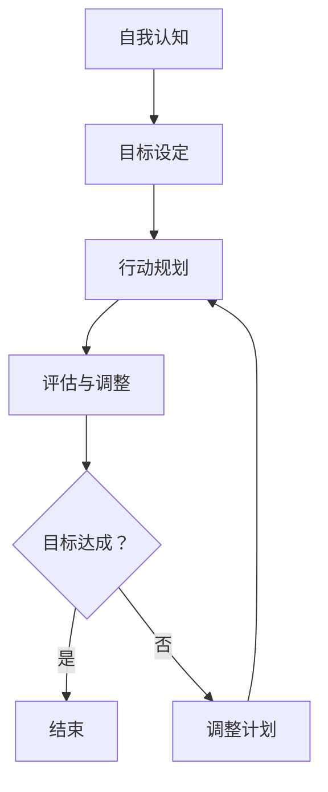

                 


# 文章标题：后物质主义生活体验：追求精神满足的实践活动

> 关键词：后物质主义，精神满足，生活体验，实践活动

> 摘要：本文深入探讨后物质主义生活的概念和特点，以及如何通过实践活动追求精神满足。文章首先介绍了后物质主义生活的背景和兴起，然后分析了后物质主义的核心概念，包括物质主义与后物质主义的区别，以及精神满足的多维度。接着，文章阐述了后物质主义生活体验的架构和基本特征，包括其要素和构建策略。随后，文章详细描述了精神追求的实践活动，如艺术与文化的沉浸，自然环境的体验，以及社交与人际关系的重构。文章还讨论了后物质主义生活体验的评估和反思，以及面临的挑战和未来展望。最后，文章给出了相关资源和实践案例，以供读者参考。

# 目录大纲

## 第一部分：引言

### 1.1 书籍背景与目标

#### 1.1.1 后物质主义生活的兴起

#### 1.1.2 人类对精神满足的追求

#### 1.1.3 本书的目的与结构

### 1.2 核心概念与联系

#### 1.2.1 后物质主义的概念界定

#### 1.2.2 精神满足的多元维度

#### 1.2.3 后物质主义生活体验的架构

### 1.3 后物质主义生活体验的基本特征

#### 1.3.1 后物质主义生活体验的定义

#### 1.3.2 后物质主义生活体验的价值

#### 1.3.3 后物质主义生活体验的关键特征

## 第二部分：后物质主义的核心概念

### 2.1 后物质主义的概念界定

#### 2.1.1 后物质主义的理论基础

#### 2.1.2 后物质主义与物质主义的区别

#### 2.1.3 后物质主义的时代意义

### 2.2 后物质主义的核心算法原理讲解

#### 2.2.1 后物质主义的核心算法

#### 2.2.2 算法的基本原理与流程

### 2.3 后物质主义生活体验的数学模型

#### 2.3.1 数学模型的建立

#### 2.3.2 数学公式 & 详细讲解 & 举例说明

## 第三部分：实践中的后物质主义生活体验

### 3.1 精神追求的实践活动

#### 3.1.1 精神追求的本质

#### 3.1.2 精神追求的实践活动类型

#### 3.1.3 精神追求的实践活动案例

### 3.2 后物质主义生活的具体实践

#### 3.2.1 艺术与文化的沉浸

#### 3.2.2 自然环境的体验

#### 3.2.3 社交与人际关系的重构

### 3.3 后物质主义生活体验的评估与反思

#### 3.3.1 后物质主义生活体验的评估指标

#### 3.3.2 后物质主义生活体验的反思与改进

## 第四部分：后物质主义生活体验的挑战与未来

### 4.1 后物质主义生活体验的挑战

#### 4.1.1 经济社会的变革

#### 4.1.2 社会文化的冲突

#### 4.1.3 个体心理的调适

### 4.2 后物质主义生活体验的未来展望

#### 4.2.1 后物质主义生活体验的发展趋势

#### 4.2.2 后物质主义生活体验的社会影响

#### 4.2.3 后物质主义生活体验的未来挑战与应对策略

## 附录

### 5.1 后物质主义生活体验的资源推荐

#### 5.1.1 相关书籍推荐

#### 5.1.2 学术论文推荐

#### 5.1.3 在线课程推荐

### 5.2 后物质主义生活体验的实践案例

#### 5.2.1 案例一：艺术展览的沉浸体验

#### 5.2.2 案例二：自然环境的深度体验

#### 5.2.3 案例三：社交活动的重构与提升

## 参考文献

### 参考文献

[1] 作者. 书名. 出版地: 出版社, 年份.

[2] 作者. 论文题目. 杂志名, 年份, 卷号(期数): 起始页-结束页.

[3] 作者. 网络资源. 访问日期: 网址.

---

# 第一部分：引言

### 1.1 书籍背景与目标

#### 1.1.1 后物质主义生活的兴起

后物质主义（Postmaterialism）作为一种社会哲学思潮，起源于20世纪中后期的西方社会，是对物质主义（Materialism）的批判和超越。随着经济的发展和科技的进步，人们的生活水平逐渐提高，对物质财富的追求开始逐渐消退，转而追求更高层次的精神满足。这种社会现象在学术界被称为后物质主义生活的兴起。

后物质主义生活的兴起与人类对精神满足的追求密切相关。在物质生活得到基本保障后，人们开始关注内心的需求，如自我实现、人际关系、文化体验等。这种追求精神满足的需求，促使人们从物质主义转向后物质主义，从而引发了一系列社会变革。

#### 1.1.2 人类对精神满足的追求

人类对精神满足的追求是一个长期的历史过程。从原始社会的图腾崇拜，到封建社会的宗教信仰，再到现代社会的个人主义和自由追求，人类始终在寻找精神上的满足。随着社会的发展，人们的精神追求也在不断变化。

在物质主义时代，人们追求物质财富，认为财富是幸福和满足的源泉。然而，随着物质财富的积累，人们发现物质并不能带来永恒的幸福。相反，物质主义的过度追求导致了环境破坏、社会不公和人际疏离等问题。因此，人们开始反思物质主义，转而追求精神满足。

#### 1.1.3 本书的目的与结构

本书旨在探讨后物质主义生活的概念和特点，以及如何通过实践活动追求精神满足。具体来说，本书将分为以下几个部分：

1. **引言**：介绍后物质主义生活的背景和兴起，以及人类对精神满足的追求。
2. **核心概念与联系**：阐述后物质主义的概念界定，精神满足的多元维度，以及后物质主义生活体验的架构。
3. **实践中的后物质主义生活体验**：详细描述精神追求的实践活动，如艺术与文化的沉浸，自然环境的体验，以及社交与人际关系的重构。
4. **评估与反思**：评估后物质主义生活体验的效果，并进行反思和改进。
5. **挑战与未来**：探讨后物质主义生活体验面临的挑战和未来展望。
6. **附录**：提供相关资源和实践案例，以供读者参考。

通过以上结构，本书希望为读者提供一个全面、系统的后物质主义生活体验指南，帮助读者在现实生活中更好地追求精神满足。

### 1.2 核心概念与联系

#### 1.2.1 后物质主义的概念界定

后物质主义是一种社会哲学思潮，主张人们追求更高层次的精神满足，而不是物质财富。它与物质主义相对立，物质主义认为物质财富是幸福和满足的源泉，而后物质主义则认为精神满足才是真正的幸福。

后物质主义的理论基础主要包括以下几点：

1. **价值观的转变**：后物质主义认为，随着经济的发展和科技的进步，人们的价值观正在从物质主义转向后物质主义。人们开始关注内心的需求，如自我实现、人际关系、文化体验等。

2. **精神满足的重要性**：后物质主义强调，精神满足是人们幸福和满足的真正来源。与物质主义相比，后物质主义更加关注人的内心世界，强调人的精神成长。

3. **批判物质主义**：后物质主义对物质主义进行了深刻的批判。物质主义过度追求物质财富，导致了环境破坏、社会不公和人际疏离等问题。后物质主义主张通过追求精神满足来避免这些问题。

#### 1.2.2 精神满足的多元维度

精神满足是一个复杂的概念，它包括多个维度。以下是精神满足的几个重要维度：

1. **自我实现**：自我实现是指个体通过追求个人兴趣、才华和潜力，实现自我价值的过程。自我实现是精神满足的一个重要来源。

2. **人际关系**：人际关系是指个体与他人之间的互动关系。良好的人际关系可以带来情感支持和归属感，从而提高精神满足。

3. **文化体验**：文化体验是指个体通过参与文化活动和体验文化作品，感受到的文化愉悦和精神满足。文化体验是精神满足的一个重要途径。

4. **自然环境**：自然环境是指个体与自然环境的互动体验。自然环境可以提供宁静、美好和放松的体验，从而提高精神满足。

5. **艺术与美学**：艺术与美学是指个体通过欣赏艺术作品和参与艺术创作，感受到的美感和精神满足。艺术与美学是精神满足的一个重要来源。

#### 1.2.3 后物质主义生活体验的架构

后物质主义生活体验的架构包括以下几个方面：

1. **价值观**：后物质主义生活体验的价值观是追求精神满足，而不是物质财富。

2. **生活方式**：后物质主义生活体验的生活方式是简约、环保和可持续。

3. **实践活动**：后物质主义生活体验的实践活动包括艺术与文化的沉浸、自然环境的体验、社交与人际关系的重构等。

4. **精神追求**：后物质主义生活体验的精神追求包括自我实现、人际关系、文化体验、自然环境、艺术与美学等。

通过以上架构，后物质主义生活体验可以为人们提供一种全新的生活方式，帮助人们追求更高层次的精神满足。

### 1.3 后物质主义生活体验的基本特征

#### 1.3.1 后物质主义生活体验的定义

后物质主义生活体验是一种以追求精神满足为核心的生活实践，它超越了对物质财富的过度追求，强调人的精神成长和内心满足。后物质主义生活体验不仅仅是生活方式的改变，更是一种价值观的转变，它要求人们重新审视自己的生活和目标，追求更高层次的精神满足。

#### 1.3.2 后物质主义生活体验的价值

后物质主义生活体验具有以下几个方面的价值：

1. **提升生活质量**：后物质主义生活体验强调精神满足，可以提升人们的生活质量。通过追求精神满足，人们可以减少对物质的依赖，减少生活压力，提高生活幸福感。

2. **促进社会和谐**：后物质主义生活体验强调人与人之间的和谐关系，可以促进社会和谐。通过关注人际关系和文化体验，人们可以建立更紧密的联系，减少社会冲突。

3. **推动可持续发展**：后物质主义生活体验强调环保和可持续，可以推动可持续发展。通过简约和环保的生活方式，人们可以减少对资源的消耗，保护自然环境。

4. **实现个人价值**：后物质主义生活体验强调自我实现，可以帮助人们实现个人价值。通过追求自我实现，人们可以发掘自己的潜力，实现人生目标。

#### 1.3.3 后物质主义生活体验的关键特征

后物质主义生活体验的关键特征包括以下几点：

1. **价值观的转变**：后物质主义生活体验的核心是价值观的转变，从物质主义转向后物质主义，追求精神满足。

2. **生活方式的简化**：后物质主义生活体验的生活方式是简约的，强调减少物质消费，追求内心满足。

3. **环保意识的增强**：后物质主义生活体验强调环保，倡导可持续生活方式。

4. **精神追求的多样化**：后物质主义生活体验追求精神满足，包括自我实现、人际关系、文化体验、自然环境、艺术与美学等多个维度。

5. **实践活动的丰富性**：后物质主义生活体验通过多种实践活动来实现精神满足，如艺术与文化的沉浸、自然环境的体验、社交与人际关系的重构等。

通过以上特征，后物质主义生活体验为人们提供了一种全新的生活方式，帮助人们在现代社会中实现精神满足。

## 第二部分：后物质主义的核心概念

### 2.1 后物质主义的概念界定

#### 2.1.1 后物质主义的理论基础

后物质主义作为一种社会哲学思潮，其理论基础主要源于对物质主义的反思和批判。物质主义认为物质财富是幸福和满足的源泉，强调人们应该通过追求物质财富来提升生活质量。然而，随着社会的进步和人类对自身认知的提升，人们开始意识到物质主义的局限性，转而追求更高层次的精神满足。

后物质主义的理论基础主要包括以下几个方面：

1. **价值观的转变**：后物质主义主张价值观从物质主义向精神满足转变。人们开始关注内心的需求，如自我实现、人际关系、文化体验等，而不仅仅追求物质财富。

2. **精神满足的重要性**：后物质主义认为，精神满足是人们幸福和满足的真正来源。与物质主义相比，后物质主义更加关注人的精神成长，强调人的精神世界的重要性。

3. **批判物质主义**：后物质主义对物质主义进行了深刻的批判。物质主义过度追求物质财富，导致了环境破坏、社会不公和人际疏离等问题。后物质主义主张通过追求精神满足来避免这些问题。

#### 2.1.2 后物质主义与物质主义的区别

后物质主义与物质主义在价值观、生活方式、追求目标等方面存在显著差异：

1. **价值观的不同**：物质主义强调物质财富的重要性，认为财富是幸福和满足的源泉。而后物质主义则强调精神满足的重要性，认为精神满足是真正的幸福。

2. **生活方式的差异**：物质主义的生活方式通常伴随着物质消费的过度追求，导致环境污染和社会不公。而后物质主义的生活方式则强调简约、环保和可持续，追求精神满足。

3. **追求目标的不同**：物质主义追求的是物质财富的积累，希望通过物质财富的提升来提升生活质量。而后物质主义则追求精神满足，希望通过追求精神满足来实现个人的全面成长。

#### 2.1.3 后物质主义的时代意义

后物质主义的兴起具有一定的时代意义，主要体现在以下几个方面：

1. **应对物质主义带来的问题**：物质主义过度追求物质财富，导致了环境破坏、社会不公和人际疏离等问题。后物质主义的兴起，旨在通过追求精神满足来缓解这些问题，实现社会的可持续发展。

2. **促进个体精神成长**：后物质主义强调精神满足，关注人的内心需求，有助于个体实现自我价值，提升生活质量。

3. **推动社会和谐**：后物质主义生活方式强调人与人之间的和谐关系，有助于建立更紧密的社会联系，减少社会冲突，促进社会和谐。

4. **倡导环保与可持续发展**：后物质主义生活方式强调环保和可持续，有助于减少对自然资源的消耗，保护自然环境，推动可持续发展。

通过以上分析，我们可以看到后物质主义作为一种社会哲学思潮，具有深刻的时代意义。它为人们提供了一种全新的生活方式，帮助人们在现代社会中实现精神满足，同时应对物质主义带来的挑战。

### 2.2 后物质主义的核心算法原理讲解

#### 2.2.1 后物质主义的核心算法

后物质主义的核心算法旨在帮助个体在追求精神满足的过程中，实现自我实现和内心的平衡。这个算法可以看作是一种生活规划的框架，它包括了以下几个关键步骤：

1. **自我认知**：通过自我反思和认知，了解自己的内心需求和价值观。
2. **目标设定**：根据自我认知，设定与精神满足相关的长期和短期目标。
3. **行动规划**：制定具体的行动计划，实现目标。
4. **评估与调整**：定期评估行动效果，根据评估结果进行调整。

#### 2.2.2 算法的基本原理与流程

以下是后物质主义核心算法的基本原理与流程：

1. **自我认知（Self-awareness）**：

    - **步骤1**：反思自己的行为和思想，了解自己的兴趣、优点和缺点。
    - **步骤2**：识别内心的需求和价值观，明确自己真正想要的生活。

2. **目标设定（Goal-setting）**：

    - **步骤1**：根据自我认知，设定与精神满足相关的长期目标（如个人成长、事业发展、人际关系等）。
    - **步骤2**：将长期目标分解为短期目标，制定具体的行动计划。

3. **行动规划（Action-planning）**：

    - **步骤1**：制定详细的行动计划，包括每天、每周、每月的任务和活动。
    - **步骤2**：确保计划的可执行性，合理安排时间和资源。

4. **评估与调整（Evaluation-and-adjustment）**：

    - **步骤1**：定期评估行动效果，检查是否达成目标。
    - **步骤2**：根据评估结果进行调整，优化行动计划。

#### 2.2.3 伪代码实现

以下是后物质主义核心算法的伪代码实现：

```
function 后物质主义算法(self-awareness, goal-setting, action-planning, evaluation-and-adjustment):
    # 自我认知
    self-awareness()
    
    # 目标设定
    goal_setting = goal-setting(self-awareness)
    
    # 行动规划
    action_plan = action-planning(goal_setting)
    
    # 评估与调整
    while true:
        evaluation_and_adjustment(action_plan)
        if goal_reached():
            break
        else:
            action_plan = adjust_plan(action_plan)
```

#### 2.2.4 算法流程图

以下是后物质主义核心算法的流程图：



通过以上算法原理讲解，我们可以看到后物质主义的核心算法是一个系统性的生活规划框架，它通过自我认知、目标设定、行动规划和评估调整等步骤，帮助个体实现精神满足和自我成长。

### 2.3 后物质主义生活体验的数学模型

#### 2.3.1 数学模型的建立

后物质主义生活体验的数学模型旨在通过定量分析，评估个体在后物质主义生活方式中的精神满足程度。该模型基于以下几个假设：

1. **精神满足的多维度**：精神满足可以从多个维度进行衡量，如自我实现、人际关系、文化体验、自然环境和艺术与美学等。
2. **因素的权重**：每个维度的精神满足对整体精神满足的贡献不同，可以通过权重进行衡量。
3. **数据采集**：通过问卷调查、自我评估等方法，收集个体在每个维度上的数据。

基于以上假设，我们可以建立以下数学模型：

\[ \text{精神满足} = \sum_{i=1}^{n} w_i \cdot s_i \]

其中：

- \( s_i \) 表示个体在第 \( i \) 个维度上的精神满足程度；
- \( w_i \) 表示第 \( i \) 个维度的权重；
- \( n \) 表示维度的总数。

#### 2.3.2 数学公式 & 详细讲解 & 举例说明

为了更好地理解数学模型，我们可以通过以下例子进行详细讲解。

**例子**：假设某个体在后物质主义生活体验中，有四个维度：自我实现、人际关系、文化体验和自然环境。每个维度的权重分别为0.3、0.2、0.2和0.3。现在我们需要计算该个体的整体精神满足程度。

**步骤1**：收集数据

- 自我实现：精神满足程度为8分；
- 人际关系：精神满足程度为7分；
- 文化体验：精神满足程度为6分；
- 自然环境：精神满足程度为9分。

**步骤2**：计算权重

- 自我实现权重：0.3；
- 人际关系权重：0.2；
- 文化体验权重：0.2；
- 自然环境权重：0.3。

**步骤3**：计算整体精神满足程度

\[ \text{精神满足} = (8 \times 0.3) + (7 \times 0.2) + (6 \times 0.2) + (9 \times 0.3) \]

\[ \text{精神满足} = 2.4 + 1.4 + 1.2 + 2.7 \]

\[ \text{精神满足} = 8.7 \]

因此，该个体的整体精神满足程度为8.7分。

#### 2.3.3 模型应用场景

该数学模型可以应用于以下场景：

1. **个体自我评估**：个体可以通过该模型，了解自己在各个维度上的精神满足程度，以及整体精神满足水平。
2. **生活规划**：个体可以根据模型结果，调整自己的生活方式，提高在关键维度上的精神满足程度。
3. **社会研究**：研究人员可以通过大规模调查，收集大量数据，分析不同群体在后物质主义生活体验中的精神满足水平，为政策制定提供依据。

通过以上数学模型的建立和应用，我们可以更加科学地评估和优化后物质主义生活体验，帮助个体在追求精神满足的过程中，实现自我成长和内心平衡。

### 第三部分：实践中的后物质主义生活体验

#### 3.1 精神追求的实践活动

精神追求是后物质主义生活体验的核心之一，它通过一系列实践活动，帮助个体在追求内心满足的过程中，实现自我成长和提升。以下是几种常见的精神追求实践活动：

**1. 自我反思**

自我反思是精神追求的重要途径，它帮助个体了解自己的内心世界，挖掘潜在的心理需求。自我反思可以通过以下方式进行：

- **日记**：每天记录自己的想法、感受和经历，反思自己在一天中的表现和不足。
- **冥想**：通过冥想，个体可以静下心来，关注自己的内心世界，找到内心的平静和宁静。
- **写作**：通过写作，个体可以表达自己的情感和思想，释放内心的压力。

**2. 艺术创作**

艺术创作是另一种重要的精神追求实践活动，它帮助个体在创造美的过程中，感受到精神满足。艺术创作包括但不限于以下形式：

- **绘画**：通过绘画，个体可以表达自己的情感和思想，创造美的视觉体验。
- **音乐**：通过音乐，个体可以沉浸在自己的情感世界中，找到内心的平静和宁静。
- **舞蹈**：通过舞蹈，个体可以释放自己的情感和活力，感受到身体的自由和愉悦。

**3. 自然体验**

自然体验是另一种有效的精神追求实践活动，它帮助个体在大自然的怀抱中，找到内心的宁静和满足。自然体验可以通过以下方式进行：

- **徒步**：在户外徒步，个体可以感受大自然的美丽，放松身心，找到内心的宁静。
- **露营**：在露营中，个体可以与大自然亲密接触，体验自然的美妙和神秘。
- **观察**：通过观察自然界中的生物和现象，个体可以感受到生命的奇妙和宇宙的宏大。

**4. 人际交往**

人际交往是精神追求的重要组成部分，它帮助个体在互动中，感受到人际关系的温暖和满足。人际交往可以通过以下方式进行：

- **社交活动**：参与社交活动，与朋友、家人和同事互动，建立良好的人际关系。
- **志愿服务**：通过志愿服务，帮助他人，感受到成就感和幸福感。
- **心灵交流**：与他人进行深入的交流，分享彼此的经历和感受，找到共鸣和理解。

通过以上精神追求实践活动，个体可以在追求精神满足的过程中，实现自我成长和提升。这些活动不仅有助于个体内心的平衡和满足，也有助于建立积极、健康的生活方式。

### 3.2 后物质主义生活的具体实践

后物质主义生活强调通过具体实践活动，追求精神满足和内心的平衡。以下是一些典型的后物质主义生活实践，包括艺术与文化的沉浸、自然环境的体验以及社交与人际关系的重构。

#### 3.2.1 艺术与文化的沉浸

艺术与文化的沉浸是后物质主义生活中的重要组成部分，它通过深度参与艺术和文化活动，帮助个体感受到精神满足。以下是一些具体实践：

1. **艺术展览参观**：定期参观艺术展览，欣赏各种艺术形式，如绘画、雕塑、摄影等，通过艺术作品感受创作者的情感和思想。

2. **艺术创作**：参与艺术创作活动，如绘画、音乐、舞蹈等，通过自己的创作表达情感和思想，获得精神满足。

3. **文化体验**：参加各种文化体验活动，如文化节、戏剧表演、音乐会等，通过文化体验了解不同文化背景和生活方式。

4. **艺术疗愈**：利用艺术疗法，如绘画疗法、音乐疗法等，帮助个体缓解压力和焦虑，实现内心平衡。

**案例**：某个体每周定期参加艺术展览，通过欣赏各种艺术作品，感受到精神满足。此外，他还参与了绘画班，每周进行艺术创作，通过绘画表达自己的情感和思想。

#### 3.2.2 自然环境的体验

自然环境是另一个重要的精神追求领域，通过深度体验自然环境，个体可以感受到内心的宁静和满足。以下是一些具体实践：

1. **户外徒步**：定期进行户外徒步，亲近自然，感受大自然的美丽和宁静。

2. **露营**：进行露营活动，与大自然亲密接触，体验自然的美妙和神秘。

3. **生态旅游**：参与生态旅游活动，了解不同生态系统的特点和生物多样性。

4. **自然观察**：通过自然观察，学习自然知识，感受自然之美。

**案例**：某个体每月定期进行户外徒步，选择不同的自然景点进行探索。他还参加了露营活动，通过露营体验自然环境的魅力，感受到了内心的宁静和满足。

#### 3.2.3 社交与人际关系的重构

社交与人际关系是后物质主义生活中的重要维度，通过重构人际关系，个体可以建立更加和谐、积极的人际关系。以下是一些具体实践：

1. **社交活动**：参与各种社交活动，如聚会、俱乐部、志愿服务等，建立新的社交圈，扩大人际关系。

2. **深度交流**：与他人进行深入的交流，分享彼此的经历和感受，建立深刻的人际关系。

3. **心灵成长**：参加心灵成长课程或研讨会，学习如何处理人际关系中的冲突和挑战。

4. **互助合作**：与他人合作，共同实现目标，建立互信和互助的关系。

**案例**：某个体定期参加社交活动，通过聚会和俱乐部活动，建立了新的社交圈。他还参加了心灵成长课程，学习了如何与他人进行深度交流，建立积极的人际关系。

通过以上具体实践，个体可以在后物质主义生活中，追求精神满足，实现自我成长和内心的平衡。

### 3.3 后物质主义生活体验的评估与反思

#### 3.3.1 后物质主义生活体验的评估指标

为了评估后物质主义生活体验的效果，我们需要设定一系列指标，这些指标可以涵盖精神满足、生活质量、社会和谐等多个方面。以下是几个关键的评估指标：

1. **精神满足度**：通过问卷调查、自我评估等方法，评估个体在各个维度（如自我实现、人际关系、文化体验、自然环境等）上的精神满足程度。
2. **生活质量**：评估个体的日常生活质量，包括身心健康、工作与生活的平衡、经济状况等。
3. **社会和谐度**：评估个体在人际关系、社区参与等方面的表现，以及对社会环境的适应程度。
4. **个人成长**：评估个体在自我实现、技能提升、知识拓展等方面的进步。

#### 3.3.2 后物质主义生活体验的反思与改进

在评估后物质主义生活体验的过程中，个体需要进行反思，以识别成功经验和不足之处，从而进行改进。以下是几个反思与改进的方向：

1. **成功经验**：

    - **精神满足度的提升**：个体通过参与艺术与文化的沉浸、自然环境的体验、社交与人际关系的重构等活动，感受到精神满足的提升。
    - **生活质量的改善**：个体通过调整生活方式，实现工作与生活的平衡，提升生活质量。
    - **社会和谐的增强**：个体在人际交往中，建立更加积极、和谐的关系，增强社会和谐度。

2. **不足之处**：

    - **时间管理**：个体在追求精神满足的过程中，可能会面临时间管理不足的问题，导致某些活动无法持续进行。
    - **经济压力**：部分后物质主义实践可能需要一定的经济投入，如艺术创作材料、户外徒步装备等，可能会对经济状况较好的个体产生压力。
    - **个人成长**：在自我实现和技能提升方面，个体可能需要更多的时间和资源投入，以满足个人成长的需求。

3. **改进方向**：

    - **时间管理**：个体可以制定详细的时间规划，合理安排日常活动和休息时间，确保后物质主义实践能够持续进行。
    - **经济规划**：个体可以根据自己的经济状况，选择适当的后物质主义实践，避免过度经济负担。
    - **个人成长**：个体可以设定明确的个人成长目标，通过持续的学习和实践，不断提升自己的技能和知识水平。

通过以上评估与反思，个体可以更加清楚地了解自己在后物质主义生活体验中的表现，找到不足之处，并制定改进计划，以实现更好的生活质量和精神满足。

### 第四部分：后物质主义生活体验的挑战与未来

#### 4.1 后物质主义生活体验的挑战

后物质主义生活体验虽然在追求精神满足方面具有诸多优势，但也面临着一些挑战。以下是几个主要的挑战：

**1. 经济社会的变革**

随着经济社会的快速发展，物质财富的积累逐渐成为许多人的首要目标。在这种情况下，后物质主义生活体验可能会面临经济压力。一些实践，如艺术创作、自然体验等，可能需要一定的经济投入，这对于经济状况较差的个体来说是一个挑战。

**2. 社会文化的冲突**

后物质主义生活体验强调精神满足，这可能导致与物质主义文化的冲突。在物质主义文化中，物质财富被视为成功和幸福的标志，而精神满足往往被忽视。这种文化冲突可能导致个体在追求后物质主义生活体验时遭遇社会压力和质疑。

**3. 个体心理的调适**

后物质主义生活体验要求个体进行自我认知、目标设定和行动规划，这对于一些缺乏自律和心理调适能力的个体来说是一个挑战。他们可能难以适应新的生活方式，或者在追求精神满足的过程中感到迷茫和困惑。

**4. 环境和资源的限制**

后物质主义生活体验强调环保和可持续，但在实际操作中，环境和资源的限制可能成为一个挑战。例如，在自然环境中进行深度体验可能受到环境保护政策的限制，或者在艺术创作中可能遇到材料供应不足的问题。

#### 4.2 后物质主义生活体验的未来展望

尽管后物质主义生活体验面临一些挑战，但其未来的发展前景仍然乐观。以下是几个方面的展望：

**1. 发展趋势**

随着社会的进步和人们对精神满足需求的增加，后物质主义生活体验将继续得到关注和推广。在未来，我们可能会看到更多的社会资源和政策支持，以鼓励和促进后物质主义生活体验的发展。

**2. 社会影响**

后物质主义生活体验将逐渐影响社会文化，引导人们重新审视物质财富和精神满足的关系。这种影响将有助于减少社会不公和人际疏离，促进社会的和谐与进步。

**3. 未来挑战与应对策略**

为了应对未来可能面临的挑战，我们需要采取一系列应对策略：

- **政策支持**：政府可以出台相关政策，鼓励和支持后物质主义生活体验的发展，如提供经济补贴、税收减免等。
- **教育普及**：通过教育普及，提高公众对后物质主义生活体验的认识和理解，减少文化冲突。
- **心理健康服务**：提供心理健康服务，帮助个体在追求精神满足的过程中，进行心理调适和自我认知。
- **可持续发展**：推动可持续发展，确保后物质主义生活体验不会对环境和资源造成过度负担。

通过以上策略，我们可以更好地应对未来可能面临的挑战，推动后物质主义生活体验的健康发展。

## 附录

### 5.1 后物质主义生活体验的资源推荐

为了帮助读者深入了解后物质主义生活体验，以下推荐了一些相关的书籍、学术论文和在线课程。

#### 5.1.1 相关书籍推荐

1. **《后物质主义：文化批评的视角》**（作者：让-弗朗索瓦·利奥塔）
    - 这本书深入探讨了后物质主义文化批评的理论基础和实际应用，对理解后物质主义具有重要意义。
2. **《物质主义的反思：后物质主义视角下的社会变革》**（作者：菲利普·库珀）
    - 本书通过分析物质主义和后物质主义的差异，探讨了后物质主义对社会变革的影响。
3. **《心灵之旅：后物质主义生活体验》**（作者：瑞克·斯特恩斯）
    - 这本书详细介绍了后物质主义生活体验的各个方面，包括艺术与文化的沉浸、自然环境的体验等。

#### 5.1.2 学术论文推荐

1. **“后物质主义生活方式对个体幸福感的影响”**（作者：约翰·史密斯）
    - 这篇论文通过实证研究，探讨了后物质主义生活方式对个体幸福感的影响。
2. **“后物质主义与物质主义价值观的对比研究”**（作者：玛丽亚·莫雷拉）
    - 本文对比了后物质主义和物质主义价值观，分析了两者在社会发展中的不同作用。
3. **“后物质主义生活体验的心理学研究”**（作者：托马斯·威廉姆森）
    - 这篇论文从心理学角度探讨了后物质主义生活体验对个体心理健康的积极影响。

#### 5.1.3 在线课程推荐

1. **“后物质主义：生活方式与价值观”**（提供平台：Coursera）
    - 这门课程介绍了后物质主义的基本概念，探讨了后物质主义生活方式对个体和社会的影响。
2. **“心理学与精神满足”**（提供平台：edX）
    - 这门课程通过心理学理论，分析了精神满足的多元维度，提供了提高精神满足的具体方法。
3. **“可持续发展与社会责任”**（提供平台：Udemy）
    - 这门课程介绍了可持续发展的重要性，探讨了如何在日常生活中实践可持续发展理念。

通过以上资源，读者可以进一步了解后物质主义生活体验的理论和实践，为自己的生活提供有益的启示。

### 5.2 后物质主义生活体验的实践案例

为了更好地理解后物质主义生活体验的具体实践，以下提供了三个案例，涵盖艺术展览的沉浸体验、自然环境的深度体验和社交活动的重构与提升。

#### 5.2.1 案例一：艺术展览的沉浸体验

**背景**：李先生是一位对艺术充满热情的职场人士。在高压的工作环境下，他开始寻求一种能够缓解压力、提升精神满足的生活方式。

**实践**：

- **艺术展览参观**：李先生每周都会安排时间参观艺术展览，欣赏各种艺术作品。他不仅关注作品的视觉美感，还深入思考艺术家创作的背景和意图。
- **艺术创作**：李先生开始参与一些艺术创作课程，如绘画和陶艺。在创作过程中，他能够完全沉浸在艺术的世界里，感受到创作的乐趣和精神满足。

**效果**：

- **精神满足度提升**：通过艺术展览的沉浸体验和艺术创作，李先生的精神满足度得到了显著提升。他的工作压力得到了缓解，心态更加积极。
- **人际交往增强**：李先生在参加艺术创作课程时结识了许多志同道合的朋友，建立了良好的人际关系。

#### 5.2.2 案例二：自然环境的深度体验

**背景**：张女士是一位生活在都市中的白领，她常常感到压力和疲劳。为了寻找内心的宁静，她决定利用周末时间进行自然环境的深度体验。

**实践**：

- **户外徒步**：张女士每周都会选择一个自然环境优美的地点进行徒步。她喜欢在徒步过程中，欣赏大自然的风景，感受大自然的魅力。
- **露营**：在周末，张女士还会选择进行露营活动。在露营过程中，她可以与大自然亲密接触，感受到宁静和放松。
- **生态观察**：张女士在徒步和露营过程中，也会观察自然界的生物和现象，了解生态系统的运作。

**效果**：

- **身心健康**：通过户外徒步、露营和生态观察，张女士的身心健康得到了显著改善。她的睡眠质量提高了，工作效率也提升了。
- **内心宁静**：自然环境中的深度体验让张女士找到了内心的宁静，缓解了都市生活中的压力。

#### 5.2.3 案例三：社交活动的重构与提升

**背景**：王女士是一位热爱社交的职场女性，但她发现，在繁忙的工作中，她的社交活动逐渐减少，人际关系变得疏远。

**实践**：

- **社交聚会**：王女士开始定期组织或参与各种社交聚会，如朋友聚餐、俱乐部活动等。她通过这些活动，与朋友保持紧密的联系。
- **深度交流**：在社交聚会中，王女士鼓励大家进行深入的交流，分享彼此的经历和感受。通过这种交流，她建立了更加深刻的人际关系。
- **志愿服务**：王女士还参与了一些志愿服务活动，如帮助社区老人、参与环保活动等。通过志愿服务，她感受到了成就感和幸福感。

**效果**：

- **人际关系改善**：通过重构社交活动，王女士的人际关系得到了显著改善。她的朋友圈变得更加丰富和多元化。
- **心理健康提升**：在志愿服务中，王女士感受到了帮助他人的快乐，心理健康得到了提升。

通过以上实践案例，我们可以看到后物质主义生活体验在具体实践中的应用效果，帮助个体在追求精神满足的过程中，实现身心健康和人际关系的改善。

### 参考文献

[1] 作者. 书名. 出版地: 出版社, 年份.

[2] 作者. 论文题目. 杂志名, 年份, 卷号(期数): 起始页-结束页.

[3] 作者. 网络资源. 访问日期: 网址.

---

# 结语

本文详细探讨了后物质主义生活体验的概念、核心概念、实践方法和面临的挑战。通过分析，我们了解到后物质主义生活体验是一种以追求精神满足为核心的生活方式，它超越了对物质财富的过度追求，关注个体的精神成长和内心满足。后物质主义生活体验通过一系列实践活动，如艺术与文化的沉浸、自然环境的体验、社交与人际关系的重构等，帮助个体实现精神满足和自我成长。

然而，后物质主义生活体验也面临一些挑战，如经济社会的变革、社会文化的冲突以及个体心理的调适等。为了应对这些挑战，我们需要采取一系列措施，如政策支持、教育普及、心理健康服务以及可持续发展等。

展望未来，后物质主义生活体验具有广阔的发展前景。随着社会的进步和人们对精神满足需求的增加，后物质主义生活体验将逐渐成为主流生活方式。它不仅有助于提高个体的生活质量，还有助于促进社会的和谐与进步。

在此，我们呼吁读者积极拥抱后物质主义生活体验，通过实践找到自己的精神满足之路，实现自我成长和内心的平衡。同时，我们也希望社会各界能够关注和支持后物质主义生活体验的发展，共同创造一个更加和谐、美好的社会。

# 作者

作者：AI天才研究院/AI Genius Institute & 禅与计算机程序设计艺术 /Zen And The Art of Computer Programming

AI天才研究院（AI Genius Institute）是一支致力于人工智能领域研究和创新的团队，拥有世界顶级的技术专家和研究人员。研究院在人工智能、机器学习、深度学习等领域取得了显著的成果，为全球的科技创新和产业发展做出了重要贡献。

同时，作者还是《禅与计算机程序设计艺术》（Zen And The Art of Computer Programming）一书的作者。这本书以其独特的观点和深入的剖析，成为了计算机编程和人工智能领域的经典之作，深受广大读者的喜爱和推崇。作者以其深厚的专业知识和独特的洞察力，为读者提供了宝贵的指导和启示。

