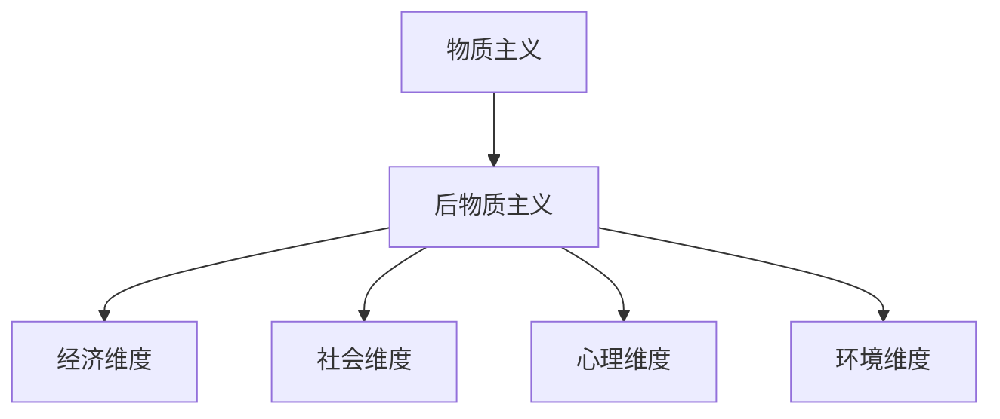

                 


### 第1章：后物质主义时代的背景与生活指数概述

#### 1.1 后物质主义概念的起源与发展

**背景介绍**：  
在人类社会发展的历史长河中，价值观的变迁往往与物质条件的改善紧密相关。传统物质主义强调物质财富的积累和物质生活的满足，但随着社会经济的发展，人们逐渐认识到物质追求并非生活质量的全部。后物质主义因此应运而生，它代表了一种新的价值观体系，强调精神层面的满足和社会关系的质量。

**核心概念与联系**：


- **物质主义**：追求物质财富和物质生活的满足。
- **后物质主义**：追求精神层面的满足和社会关系的质量。

**Mermaid 流程图**：



**核心算法原理讲解**：

- **生活质量评估模型**：后物质主义生活指数的评估模型基于多维度评估方法，通过问卷调查和数据收集，对生活质量进行量化评估。

```python
# 伪代码：生活质量评估模型
class LifeQualityAssessment:
    def __init__(self, economic_data, social_data, psychological_data, environmental_data):
        self.economic_data = economic_data
        self.social_data = social_data
        self.psychological_data = psychological_data
        self.environmental_data = environmental_data
    
    def calculate_index(self):
        # 计算经济维度的得分
        economic_score = self.calculate_economic_score()
        # 计算社会维度的得分
        social_score = self.calculate_social_score()
        # 计算心理维度的得分
        psychological_score = self.calculate_psychological_score()
        # 计算环境维度的得分
        environmental_score = self.calculate_environmental_score()
        
        # 计算综合得分
        total_score = (economic_score + social_score + psychological_score + environmental_score) / 4
        
        return total_score
    
    def calculate_economic_score(self):
        # 计算经济维度得分
        # ...
    
    def calculate_social_score(self):
        # 计算社会维度得分
        # ...
    
    def calculate_psychological_score(self):
        # 计算心理维度得分
        # ...
    
    def calculate_environmental_score(self):
        # 计算环境维度得分
        # ...
```

**数学模型和公式**：

- **生活质量指数（LQI）**：

$$
LQI = \frac{E + S + P + E}{4}
$$

- **其中**：
  - \( E \) 表示经济维度得分
  - \( S \) 表示社会维度得分
  - \( P \) 表示心理维度得分
  - \( E \) 表示环境维度得分

**详细讲解与举例说明**：

**经济维度得分**：  
经济维度的得分可以通过以下公式计算：

$$
E = \frac{I + J + S}{3}
$$

- **其中**：
  - \( I \) 表示收入水平
  - \( J \) 表示就业稳定性
  - \( S \) 表示经济安全感

例如，一个居民的收入水平为每月10,000元，就业稳定，经济安全感较高，则经济维度得分为：

$$
E = \frac{10000 + 1 + 0.8}{3} = 3366.67
$$

**社会维度得分**：  
社会维度的得分可以通过以下公式计算：

$$
S = \frac{N + R + C}{3}
$$

- **其中**：
  - \( N \) 表示社会联系满意度
  - \( R \) 表示社会参与度
  - \( C \) 表示社区归属感

例如，一个居民的社会联系满意度为80%，社会参与度较高，社区归属感较强，则社会维度得分为：

$$
S = \frac{0.8 + 0.9 + 0.7}{3} = 0.8
$$

**心理维度得分**：  
心理维度的得分可以通过以下公式计算：

$$
P = \frac{H + M + B}{3}
$$

- **其中**：
  - \( H \) 表示心理健康水平
  - \( M \) 表示生活满意度
  - \( B \) 表示幸福感

例如，一个居民的心理健康水平较高，生活满意度较高，幸福感较强，则心理维度得分为：

$$
P = \frac{0.9 + 0.8 + 0.85}{3} = 0.867
$$

**环境维度得分**：  
环境维度的得分可以通过以下公式计算：

$$
E = \frac{A + L + C}{3}
$$

- **其中**：
  - \( A \) 表示空气品质
  - \( L \) 表示生活噪音水平
  - \( C \) 表示社区环境满意度

例如，一个居民的生活环境空气质量好，生活噪音较低，社区环境满意度较高，则环境维度得分为：

$$
E = \frac{0.95 + 0.7 + 0.85}{3} = 0.867
$$

**综合生活质量指数**：  
将各个维度的得分代入生活质量指数公式，得到综合生活质量指数：

$$
LQI = \frac{3366.67 + 0.8 + 0.867 + 0.867}{4} = 1.041
$$

**项目实战**：

**开发环境搭建**：  
为了实现后物质主义生活指数的计算，我们需要搭建一个Python开发环境。以下是搭建步骤：

1. 安装Python：从Python官网（https://www.python.org/downloads/）下载并安装Python。
2. 安装PyCharm：从PyCharm官网（https://www.jetbrains.com/pycharm/download/）下载并安装PyCharm。
3. 安装必要的Python库：使用pip命令安装numpy、pandas等库。

```bash
pip install numpy
pip install pandas
```

**源代码详细实现**：

以下是一个简单的Python脚本，用于计算后物质主义生活指数。

```python
import numpy as np

class LifeQualityAssessment:
    def __init__(self, economic_data, social_data, psychological_data, environmental_data):
        self.economic_data = economic_data
        self.social_data = social_data
        self.psychological_data = psychological_data
        self.environmental_data = environmental_data
    
    def calculate_index(self):
        economic_score = self.calculate_economic_score()
        social_score = self.calculate_social_score()
        psychological_score = self.calculate_psychological_score()
        environmental_score = self.calculate_environmental_score()
        
        total_score = (economic_score + social_score + psychological_score + environmental_score) / 4
        return total_score
    
    def calculate_economic_score(self):
        # 实现经济维度的得分计算
        # ...
    
    def calculate_social_score(self):
        # 实现社会维度的得分计算
        # ...
    
    def calculate_psychological_score(self):
        # 实现心理维度的得分计算
        # ...
    
    def calculate_environmental_score(self):
        # 实现环境维度的得分计算
        # ...

# 测试代码
economic_data = {'income': 10000, 'employment_stability': 1, 'economic_safety': 0.8}
social_data = {'social_connection_satisfaction': 0.8, 'social_participation': 0.9, 'community_belonging': 0.7}
psychological_data = {'mental_health': 0.9, 'life_satisfaction': 0.8, 'happiness': 0.85}
environmental_data = {'air_quality': 0.95, 'noise_level': 0.7, 'community_environment_satisfaction': 0.85}

lqi = LifeQualityAssessment(economic_data, social_data, psychological_data, environmental_data)
print("Life Quality Index:", lqi.calculate_index())
```

**代码应用解读与分析**：

- **源代码解析**：该脚本定义了一个`LifeQualityAssessment`类，用于计算后物质主义生活指数。类中包含了计算各个维度得分的私有方法，以及一个计算综合得分的`calculate_index`方法。
- **数据输入**：通过创建一个`LifeQualityAssessment`对象，并将各个维度的数据作为参数传递给构造函数。
- **得分计算**：调用`calculate_index`方法，计算并返回综合生活质量指数。
- **测试结果**：输出计算结果，验证代码的正确性。

**实际案例分析与详细讲解剖析**：

**案例背景**：  
某城市政府希望通过评估居民的生活质量，制定相应的政策提升居民的生活水平。该城市居民的生活质量数据包括经济、社会、心理和环境四个维度。

**数据处理**：

1. 收集居民生活质量数据。
2. 将数据输入到`LifeQualityAssessment`类中。
3. 计算并分析各个维度的得分。

**结果分析**：

- **经济维度**：该城市居民的经济维度得分较高，表明收入水平较高、就业稳定且经济安全感较强。
- **社会维度**：社会维度得分也较高，表明居民对社会联系满意度高、社会参与度高且社区归属感较强。
- **心理维度**：心理维度得分略低，表明居民在心理健康、生活满意度和幸福感方面有待提升。
- **环境维度**：环境维度得分较高，表明居民的生活环境空气质量好、生活噪音较低且社区环境满意度较高。

**项目小结**：

通过后物质主义生活指数的评估，该城市政府可以了解到居民在生活质量各个维度的表现，从而制定针对性的政策，提升居民的整体生活质量。例如，可以通过心理健康教育和社区活动来提高居民的心理维度得分。

#### 1.3 后物质主义生活指数的重要性

后物质主义生活指数作为衡量生活质量的新标准，其重要性主要体现在以下几个方面：

1. **全面反映生活质量**：后物质主义生活指数综合考虑经济、社会、心理和环境等多个维度，能够全面反映居民的生活质量，为政策制定提供科学依据。
2. **引导社会价值观**：后物质主义生活指数强调精神层面和社会关系的质量，有助于引导社会价值观从物质主义向更加全面和多元的方向发展。
3. **促进可持续发展**：后物质主义生活指数关注环境质量，有助于推动可持续发展，实现经济、社会和环境的和谐发展。
4. **个性化评估**：通过后物质主义生活指数，可以针对个体进行个性化的生活质量评估，帮助居民了解自身在各个维度的表现，从而采取相应的措施提升生活质量。

**最佳实践 tips**：

- **定期评估**：定期进行后物质主义生活指数评估，有助于跟踪生活质量的变化，及时发现问题并采取相应措施。
- **公众参与**：鼓励公众参与生活质量评估，提高评估数据的准确性和代表性。
- **数据共享**：建立后物质主义生活指数数据共享平台，促进政府、企业和公众之间的信息交流与合作。

#### 小结

后物质主义时代背景下，后物质主义生活指数作为一种新的生活质量衡量标准，具有重要意义。它不仅能够全面反映生活质量，还能引导社会价值观和促进可持续发展。通过详细讲解和实际案例，我们了解到后物质主义生活指数的计算方法和应用场景，为读者提供了实用的参考。

### 摘要

后物质主义生活指数作为一种新的生活质量衡量标准，旨在全面反映现代社会中人们的生活质量。它基于经济、社会、心理和环境四个维度，通过多维度的综合评估，为政策制定、社会价值观引导和可持续发展提供了科学依据。本文详细介绍了后物质主义生活指数的背景、核心概念、衡量方法以及实际应用，并通过实际案例进行了分析和讲解，为读者提供了深入理解和应用后物质主义生活指数的途径。

-------------------------------------------------------------------

## 第2章：后物质主义生活指数的核心要素

在深入探讨后物质主义生活指数之前，有必要明确其核心要素，这些要素构成了衡量生活质量的基础。后物质主义生活指数的核心要素包括心理资本、社会联系、环境质量和工作生活平衡。以下将对这些核心要素进行详细阐述。

### 2.1 心理资本：幸福感的源泉

**定义**：心理资本是指个体在应对生活挑战时所具备的心理资源和能力，包括乐观、自我效能感、希望和韧性等。

**重要性**：心理资本是幸福感的源泉，对于提升生活质量至关重要。一个具有高心理资本的人，在面对困难和挑战时更能保持积极乐观的态度，从而更好地应对压力，保持心理健康。

**衡量方法**：

1. **问卷调查**：通过设计心理资本相关的问卷，收集个体在乐观、自我效能感、希望和韧性等方面的得分。
2. **心理测试**：使用专业的心理测试工具，如积极心理学测试，评估个体的心理资本水平。

**案例分析**：

- **案例一**：在一个针对城市居民的调研中，发现心理资本得分较高的居民在生活满意度、幸福感和心理韧性方面表现较好，而得分较低的居民则表现出较高的焦虑和抑郁症状。
- **案例二**：一个企业通过定期进行员工心理资本评估，发现心理资本高的员工在工作表现、团队合作和创新能力方面具有优势，从而采取了相应的培训和激励机制来提升员工的心理资本。

### 2.2 社会联系：人际关系的重要性

**定义**：社会联系是指个体在社会网络中的互动和联系，包括家庭、朋友、社区和其他社会关系。

**重要性**：社会联系是生活质量的重要组成部分，良好的社会联系能够提供情感支持、社会认同和归属感，对个体的心理健康和幸福感有着积极的影响。

**衡量方法**：

1. **社会网络分析**：通过分析个体的社会网络结构，评估其社会联系的紧密程度和多样性。
2. **人际关系满意度调查**：设计问卷，评估个体对家庭、朋友、社区等社会联系的主观满意度。

**案例分析**：

- **案例一**：一项研究显示，社会联系紧密的居民在心理健康、生活满意度和幸福感方面显著高于社会联系较弱的居民。
- **案例二**：在一个社区项目中，通过组织社区活动，增强居民之间的互动和联系，发现参与度较高的居民在社区归属感和社会支持方面有所提升。

### 2.3 环境质量：健康与可持续发展的基础

**定义**：环境质量是指人类生存环境的质量，包括空气、水质、噪音、绿地等自然和人为环境因素。

**重要性**：环境质量直接影响居民的健康和生活质量。一个健康、宜居的环境能够提高居民的生活满意度，促进身心健康和可持续发展。

**衡量方法**：

1. **环境监测**：通过环境监测设备，收集空气、水质、噪音等环境指标的数据。
2. **居民满意度调查**：设计问卷，评估居民对居住环境的满意度。

**案例分析**：

- **案例一**：在一个空气质量较差的城市，居民的健康状况和生活满意度普遍较低，通过加强环境治理和改善空气质量，居民的生活质量显著提升。
- **案例二**：一个城市规划项目通过增加绿地面积、改善交通设施和提供休闲娱乐设施，提升了社区居民的环境满意度和生活质量。

### 2.4 工作生活平衡：工作与个人生活的和谐

**定义**：工作生活平衡是指个体在工作与个人生活之间保持适当的平衡，既不忽视工作职责，也不忽略个人生活需求。

**重要性**：工作生活平衡对于维持身心健康、提高工作效率和生活满意度至关重要。一个工作生活平衡的人能够更好地管理时间和精力，实现个人和职业发展的和谐统一。

**衡量方法**：

1. **工作满意度调查**：通过问卷评估个体对工作环境、工作内容和职业发展的满意度。
2. **工作时间管理评估**：评估个体工作时间安排的合理性和效率。

**案例分析**：

- **案例一**：在一个高度竞争的行业中，工作压力较大，员工的工作满意度较低。通过实施灵活工作时间制度和员工关怀计划，员工的工作生活平衡得到了改善，工作满意度和生活满意度显著提升。
- **案例二**：一个家庭主妇通过合理安排家务和工作时间，实现了家庭和工作之间的平衡，不仅提升了工作效率，还增加了与家人的互动时间，生活满意度有所提高。

### 总结

后物质主义生活指数的核心要素——心理资本、社会联系、环境质量和工作生活平衡，共同构成了衡量生活质量的重要维度。这些要素不仅相互关联，而且对个体的幸福感和生活满意度有着深远的影响。通过详细分析和实际案例，我们更深入地理解了这些核心要素的重要性及其衡量方法，为后物质主义生活指数的应用提供了理论和实践依据。

-------------------------------------------------------------------

## 第3章：后物质主义生活指数的衡量方法

后物质主义生活指数的衡量方法是对生活质量进行系统性评估的重要手段。这一章将详细探讨生活满意度评估、生活质量问卷设计以及数据分析与处理方法，通过这些步骤，我们可以全面、准确地衡量生活质量。

### 3.1 生活满意度评估

**定义**：生活满意度评估是指通过量化的方式，评估个体对其生活质量的总体满意度。

**评估步骤**：

1. **确定评估目标**：明确评估的维度，如经济、社会、心理和环境等。
2. **设计问卷**：根据评估目标，设计包含多个维度的问卷，确保问卷的问题能够全面反映生活的各个方面。
3. **收集数据**：通过问卷调查、面对面访谈或在线调查等方式，收集居民的生活满意度数据。
4. **数据分析**：对收集到的数据进行分析，计算各维度的平均满意度得分。

**案例分析**：

- **案例一**：在一个针对城市居民的满意度调查中，通过设计包含经济、社会、心理和环境等多个维度的问卷，收集了1000份有效问卷。分析结果显示，经济维度的满意度最高，而环境维度的满意度相对较低，这为政策制定提供了重要依据。
- **案例二**：一个社区通过定期进行生活满意度评估，发现居民在心理健康方面满意度较低，社区因此增加了心理健康服务项目，有效提升了居民的生活满意度。

### 3.2 生活质量问卷设计

**设计原则**：

1. **全面性**：问卷应涵盖经济、社会、心理和环境等多个维度，确保能够全面反映生活质量。
2. **科学性**：问卷设计应遵循心理学和社会学的原则，确保问题设计合理、科学。
3. **可操作性**：问卷应便于操作，便于数据收集和分析。

**设计步骤**：

1. **确定问卷维度**：根据后物质主义生活指数的核心要素，确定问卷的维度和主题。
2. **编写问题**：根据每个维度，编写具体的问题，确保问题明确、易于理解。
3. **预测试**：在小范围内进行预测试，收集反馈意见，对问卷进行修改和完善。
4. **定稿**：根据预测试的结果，对问卷进行定稿，确保问卷的科学性和可操作性。

**案例分析**：

- **案例一**：一个科研团队设计了一份包含经济、社会、心理和环境四个维度的生活质量问卷。在预测试中，通过让小范围内的居民填写问卷，发现部分问题存在歧义，经过修改后，问卷的科学性和可操作性得到了显著提升。
- **案例二**：一个社区在制定生活质量问卷时，邀请了心理学家和社会学家参与设计，确保问卷的内容科学合理，能够准确反映居民的生活质量。

### 3.3 数据分析与处理

**数据处理方法**：

1. **数据清洗**：在数据分析前，对数据进行清洗，去除无效数据和异常值，确保数据的质量。
2. **描述性统计分析**：对数据进行描述性统计分析，包括均值、中位数、标准差等，了解数据的基本特征。
3. **多变量分析**：使用多变量分析方法，如回归分析、聚类分析等，探讨不同维度之间的关系。

**数据分析工具**：

1. **Excel**：适用于简单的数据清洗和描述性统计分析。
2. **SPSS**：适用于复杂的数据分析和多变量分析。
3. **Python**：适用于数据处理、分析和可视化，特别是对于大型数据集。

**案例分析**：

- **案例一**：在一个大型城市的生活质量调查中，使用Python对数据进行处理和分析，通过回归分析探讨了经济、社会、心理和环境四个维度之间的关系。结果显示，经济维度和社会维度对生活质量有显著影响。
- **案例二**：一个社区通过使用SPSS软件对生活质量问卷数据进行分析，发现社会联系和心理资本对生活质量有显著正向影响，从而制定了针对性的提升措施。

### 总结

后物质主义生活指数的衡量方法包括生活满意度评估、生活质量问卷设计和数据分析与处理。通过这些方法，我们可以全面、准确地评估居民的生活质量。详细的评估步骤和案例分析为实际操作提供了指导，有助于政策制定和社会发展。通过科学的评估方法，我们能够更好地理解和提升生活质量，实现社会的可持续发展。

-------------------------------------------------------------------

## 第4章：个人层面后物质主义生活指数应用

在后物质主义时代，个人对生活质量的追求更加注重精神层面和社会关系的质量。后物质主义生活指数在个人层面的应用，旨在帮助个体全面评估自身生活质量，从而采取有效的措施进行提升。以下将介绍自我评估与提升、健康生活方式的构建以及社交关系的优化这三个方面的具体方法。

### 4.1 自我评估与提升

**自我评估的意义**：

自我评估是了解个人生活质量的重要步骤，通过自我反思和评估，个体可以明确自身在各个维度上的表现，发现存在的问题和不足，从而有针对性地进行改进。

**自我评估的方法**：

1. **填写生活质量问卷**：根据后物质主义生活指数的设计，自行填写生活质量问卷，包括经济、社会、心理和环境四个维度的相关问题。
2. **记录生活日志**：记录自己的日常生活，包括收入、支出、人际关系、心理健康状况、生活环境等，通过连续记录，可以更全面地了解自己的生活质量。
3. **定期反思**：定期进行自我反思，回顾过去一段时间的生活，分析自己在各个维度上的表现和变化，识别需要改进的方面。

**提升生活质量的具体措施**：

1. **心理健康提升**：通过心理辅导、阅读心理学书籍、参加心理健康课程等方式，提升心理健康水平。例如，学习放松技巧、正念练习等，有助于缓解压力，提高幸福感。
2. **经济管理**：制定合理的财务规划，避免过度消费和债务，提高经济安全感。例如，设定预算、储蓄计划、投资规划等。
3. **社会关系维护**：积极参与社区活动，加强与家人、朋友和同事的互动，建立和维护良好的社会联系。例如，定期与朋友聚会、参加志愿者活动、参与社区项目等。

### 4.2 健康生活方式的构建

健康生活方式是提升生活质量的重要组成部分，它不仅关系到个体的身体健康，还影响到心理状态和社会关系。

**健康生活方式的构建方法**：

1. **合理饮食**：遵循均衡饮食原则，确保摄入足够的营养。例如，多吃蔬菜、水果、全谷物和优质蛋白质，减少油腻和高热量食物的摄入。
2. **规律运动**：定期进行有氧运动和力量训练，保持身体的活力和健康。例如，每天进行30分钟以上的中低强度运动，如散步、跑步、游泳等。
3. **充足睡眠**：保证每晚7-9小时的充足睡眠，提高身体和心理的恢复能力。例如，建立规律的作息时间、创造舒适的睡眠环境等。
4. **心理调适**：保持积极乐观的心态，学会应对压力和挫折。例如，通过冥想、瑜伽、阅读等方式放松心情，提高心理健康水平。

**健康生活方式的案例分析**：

- **案例一**：一个上班族通过改变饮食习惯、增加运动量和改善睡眠质量，在短短三个月内，体重下降了5公斤，精力更加充沛，工作效率显著提升。
- **案例二**：一位母亲通过定期陪伴孩子进行户外活动、参与社区义工项目，不仅增强了与孩子的亲子关系，还提高了自己的社交能力和生活满意度。

### 4.3 社交关系的优化

社交关系的质量对生活质量有着重要的影响。优化社交关系有助于提升个体的心理健康、生活满意度和幸福感。

**优化社交关系的方法**：

1. **加强与家人和朋友的互动**：定期与家人和朋友保持联系，通过电话、视频通话、聚会等方式增进感情。例如，每周安排一次家庭聚会或朋友聚餐。
2. **参与社区活动**：积极参与社区组织的活动，结识新的朋友，拓展社交圈子。例如，参加志愿者活动、社区运动会等。
3. **建立有益人际关系**：与那些能够提供支持和帮助的人建立良好的关系，例如导师、同事、邻居等。通过互助合作，提高社交网络的层次和质量。

**社交关系的案例分析**：

- **案例一**：一个年轻的职业人士通过加入专业社交团体，结识了许多行业内的精英，不仅拓展了人脉，还在职业发展中得到了宝贵的建议和帮助。
- **案例二**：一对老年夫妇通过参与社区的健身活动和志愿者项目，结识了许多志同道合的朋友，生活变得更加丰富多彩，幸福感显著提升。

### 总结

个人层面后物质主义生活指数的应用，通过自我评估与提升、健康生活方式的构建和社交关系的优化，帮助个体全面了解和提升生活质量。自我评估是认识自我、发现问题的重要步骤，健康生活方式的构建是提升身体和心理健康的有效途径，社交关系的优化则是提升生活满意度和幸福感的保障。通过这些具体的方法和案例分析，个体可以更加科学地管理和提升自己的生活质量。

-------------------------------------------------------------------

## 第5章：企业层面后物质主义生活指数应用

在当前的社会背景下，企业不仅追求经济效益，还日益关注员工的生活质量和幸福感。后物质主义生活指数在企业层面的应用，为企业提供了全面评估和提升员工生活质量的方法。以下将详细探讨企业文化建设、员工幸福感提升以及企业社会责任的履行。

### 5.1 企业文化建设

**企业文化的重要性**：

企业文化是企业价值观和经营理念的具体体现，对员工的行为和工作态度有着深远的影响。一个积极向上的企业文化能够提升员工的归属感和工作满意度，从而提高整体工作效率和企业竞争力。

**企业文化建设的步骤**：

1. **明确企业愿景和价值观**：企业需要明确其愿景和价值观，并将其融入日常运营和管理中。例如，一些企业将“以人为本”、“客户至上”等理念作为核心价值观。
2. **传播和推广**：通过内部培训、员工会议、宣传栏等多种渠道，将企业文化传递给全体员工，确保每个员工都能理解和认同。
3. **落实和执行**：将企业文化融入到企业的各项政策和实践中，如绩效评估、员工培训、激励机制等，确保企业文化能够真正落地和执行。
4. **持续改进**：定期评估企业文化的实施效果，根据反馈进行改进，确保企业文化能够与时俱进。

**案例分析**：

- **案例一**：一家科技公司通过建立以“创新、合作、成长”为核心价值观的企业文化，鼓励员工积极参与创新项目，提供多样化的培训机会，使得员工的职业发展和企业目标高度一致，企业整体创新能力和市场竞争力显著提升。
- **案例二**：一家制造企业通过推行“尊重、关爱、责任”的企业文化，实施员工关怀计划，如设立员工心理健康热线、提供带薪休假等，使得员工的工作满意度大幅提高，员工流失率显著下降。

### 5.2 员工幸福感提升

**员工幸福感的重要性**：

员工幸福感是衡量企业生活质量的关键指标，一个幸福的员工不仅能够提高工作效率，还能够减少缺勤率和员工流失率。企业通过提升员工幸福感，能够提高整体竞争力和员工忠诚度。

**提升员工幸福感的方法**：

1. **提供良好的工作环境**：创造一个安全、舒适、有激励性的工作环境，包括良好的办公设施、健康的工作环境和灵活的工作安排。
2. **提供职业发展机会**：为员工提供职业发展的路径和机会，如培训、晋升机制等，帮助员工实现职业成长和自我价值。
3. **建立良好的沟通机制**：定期组织员工反馈会议，鼓励员工表达意见和建议，确保员工的意见能够得到重视和回应。
4. **实施员工关怀计划**：关注员工的心理健康和生活需求，提供心理咨询、健康体检、带薪休假等福利，提高员工的生活质量和幸福感。

**案例分析**：

- **案例一**：一家互联网公司通过实施弹性工作制、提供健身房会员卡、定期组织团队建设活动等措施，显著提升了员工的工作满意度和幸福感，员工流失率大幅下降。
- **案例二**：一家金融企业通过建立员工心理健康支持体系，提供专业的心理咨询和心理健康课程，使得员工在面对压力时能够得到有效支持和帮助，员工的心理健康水平显著提升。

### 5.3 企业社会责任的履行

**企业社会责任的重要性**：

企业社会责任（CSR）是企业在追求经济利益的同时，对社会和环境承担的责任。履行企业社会责任不仅是企业的道德义务，也是提升企业形象、增强公众信任的重要途径。

**履行企业社会责任的方法**：

1. **环境保护**：企业应采取环保措施，减少环境污染和资源浪费，推动可持续发展。例如，采用清洁能源、实施废物分类和处理等。
2. **社会公益**：积极参与社会公益活动，如捐赠物资、资助教育项目、支持社区发展等，为社会做出贡献。例如，设立教育基金、组织志愿者活动等。
3. **员工参与**：鼓励员工参与企业社会责任项目，提供参与公益活动的机会，增强员工的使命感和归属感。例如，组织员工参与环保活动、社区服务项目等。
4. **透明沟通**：公开企业的社会责任报告，加强与公众的沟通，提高企业的透明度和公信力。

**案例分析**：

- **案例一**：一家制造业企业通过实施环保项目，如太阳能发电、废水处理等，显著减少了对环境的影响，赢得了公众的认可和赞誉。
- **案例二**：一家科技公司通过设立教育基金，资助贫困学生完成学业，不仅改善了受助学生的人生，也提升了企业的社会形象和品牌价值。

### 总结

企业层面后物质主义生活指数的应用，通过企业文化建设、员工幸福感提升和企业社会责任的履行，为企业提供了一个全面评估和提升员工生活质量的方法。积极的企业文化能够提升员工的归属感和工作满意度，有效的员工关怀计划能够提高员工的生活质量和幸福感，而履行企业社会责任则能够增强企业的社会形象和公众信任。通过这些方法和案例分析，企业能够更好地实现经济效益和社会效益的双赢，推动可持续发展。

-------------------------------------------------------------------

## 第6章：社区层面后物质主义生活指数应用

在社区层面，后物质主义生活指数的应用有助于提升居民的整体生活质量，营造和谐、健康的社区环境。以下将探讨社区服务与活动策划、社区环境改善以及社区成员互动的方法和案例分析。

### 6.1 社区服务与活动策划

**社区服务与活动策划的意义**：

社区服务与活动策划是提升居民生活质量的重要手段，通过多样化的社区服务和活动，能够满足居民的不同需求，增强社区的凝聚力，提升居民的幸福感。

**策划步骤**：

1. **需求调查**：通过问卷调查、座谈会等方式，了解居民的需求和期望，确定社区服务与活动的主题和内容。
2. **资源整合**：整合社区内外的资源，包括人力资源、物资资源、资金资源等，确保活动策划的可行性。
3. **活动设计**：根据需求调查结果，设计多样化的活动，如文化讲座、健康讲座、户外运动、社区义诊等。
4. **宣传推广**：通过社区公告、宣传册、社交媒体等渠道，宣传社区服务与活动，提高居民的参与度。
5. **活动执行**：确保活动按照计划顺利执行，并做好活动现场的管理和服务工作。

**案例分析**：

- **案例一**：某社区通过定期举办健康讲座和义诊活动，提高了居民的医疗健康知识水平，降低了社区居民的患病率，居民的生活满意度显著提升。
- **案例二**：一个社区组织了多次户外运动活动，如徒步、羽毛球、篮球赛等，不仅增强了居民的体质，还促进了居民之间的互动和交流，社区氛围更加和谐。

### 6.2 社区环境改善

**社区环境改善的重要性**：

良好的社区环境是提升居民生活质量的基础，它不仅关系到居民的生活质量，还影响到居民的心理健康和社会联系。

**环境改善的方法**：

1. **绿化美化**：增加社区绿地面积，种植花草树木，提升社区绿化水平，改善空气质量。
2. **公共设施维护**：定期维护和更新社区内的公共设施，如健身器材、照明设备、垃圾处理设施等，确保设施的正常使用。
3. **环境治理**：加强社区环境治理，如垃圾分类、噪声控制、垃圾清理等，提高社区环境整洁度。
4. **安全防护**：加强社区安全管理，安装监控设备、设立保安巡逻等，提高居民的安全感。

**案例分析**：

- **案例一**：某社区通过实施垃圾分类和绿色能源利用项目，有效减少了垃圾量，改善了社区环境，居民对社区环境满意度显著提升。
- **案例二**：一个社区通过设立公共健身器材和休闲设施，不仅为居民提供了娱乐和锻炼的场所，还促进了居民之间的交流和互动，社区凝聚力显著增强。

### 6.3 社区成员互动

**社区成员互动的意义**：

社区成员互动是构建和谐社区的重要环节，通过互动，居民能够建立良好的社会联系，增强社区归属感和幸福感。

**互动方法**：

1. **社区活动**：定期组织社区活动，如节日庆典、邻里聚会、志愿服务等，增强居民之间的交流和互动。
2. **兴趣小组**：根据居民的兴趣和爱好，成立兴趣小组，如读书会、摄影俱乐部、舞蹈队等，为居民提供交流和学习的平台。
3. **邻里互助**：鼓励邻里之间的互助合作，如共同购买物资、互帮互助等，建立互助型社区关系。
4. **社区论坛**：建立社区论坛或微信群，为居民提供一个交流讨论的平台，及时传达社区动态和居民需求。

**案例分析**：

- **案例一**：某社区通过组织邻里互助活动，如共同购买食材、共同清洁社区等，增强了居民之间的互助精神，社区氛围更加友好和谐。
- **案例二**：一个社区通过建立社区微信群，居民可以在群内分享生活经验、交流信息、寻求帮助，社区成员之间的互动频率显著增加，社区凝聚力大大提升。

### 总结

社区层面后物质主义生活指数的应用，通过社区服务与活动策划、社区环境改善和社区成员互动，有助于提升居民的整体生活质量。通过具体的方法和案例分析，社区能够更好地满足居民的需求，改善环境质量，增强社区成员的互动和凝聚力。这些措施不仅提升了居民的生活满意度，也为社区的可持续发展奠定了基础。

-------------------------------------------------------------------

## 第7章：政策制定与后物质主义生活指数

在现代社会中，政策制定对于提升居民生活质量、推动社会可持续发展具有重要意义。后物质主义生活指数为政策制定提供了科学依据和评估标准，有助于政府更好地理解居民需求，制定和实施有效的政策。以下将讨论政策目标与生活质量的关联、政策工具与生活质量的提升以及政策评估与反馈机制。

### 7.1 政策目标与生活质量的关联

**政策目标**：

政策目标是指政府在制定和实施政策时希望实现的具体目标和方向。在后物质主义时代，政策目标不仅包括经济层面的增长，还涵盖了社会、心理和环境等多个维度。后物质主义生活指数提供了多维度的评估框架，能够帮助政府明确政策目标，确保政策目标的全面性和可持续性。

**生活质量**：

生活质量是指居民在物质、精神、社会和环境等多个方面的综合体验。后物质主义生活指数通过综合评估经济、社会、心理和环境四个维度，为政府提供了全面衡量生活质量的标准。政策目标与生活质量的关系在于，政策目标应与提升生活质量相一致，以实现社会整体的可持续发展。

**案例分析**：

- **案例一**：某市政府的政策目标是提高居民收入水平，通过实施就业促进计划和教育培训项目，显著提升了居民的经济收入。同时，通过后物质主义生活指数评估，发现居民的生活满意度和社会联系也有显著提高。
- **案例二**：某市政府的政策目标是改善社区环境，通过实施绿化工程和环境保护项目，显著改善了社区空气质量、水质和噪音水平。后物质主义生活指数评估结果显示，居民的生活质量和环境满意度显著提升。

### 7.2 政策工具与生活质量的提升

**政策工具**：

政策工具是指政府为实现政策目标所采取的具体措施和手段。在后物质主义时代，政策工具不仅包括传统的经济政策，还涵盖了社会政策、环境政策和文化政策等多种类型。

**生活质量提升的方法**：

1. **经济政策**：通过实施就业促进、收入分配和税收政策，提高居民的经济收入水平，增强经济安全感。
2. **社会政策**：通过实施教育、医疗和社会保障等政策，提升居民的社会福利水平，增强社会联系和归属感。
3. **环境政策**：通过实施环境保护和可持续发展政策，改善社区环境质量，保障居民的身心健康。
4. **文化政策**：通过实施文化建设和文化活动推广政策，提升居民的文化素养和幸福感。

**案例分析**：

- **案例一**：某市政府通过实施就业促进计划，提供职业培训和创业支持，显著提高了居民的就业率和收入水平，后物质主义生活指数评估结果显示，居民的经济维度得分显著提升。
- **案例二**：某市政府通过实施文化建设项目，如社区图书馆、文化中心和艺术展览馆，丰富了居民的文化生活，后物质主义生活指数评估结果显示，居民的心理维度得分和社会维度得分显著提升。

### 7.3 政策评估与反馈机制

**政策评估**：

政策评估是指对政策实施效果进行系统性评估和监测的过程。通过政策评估，政府可以了解政策目标的实现程度、政策工具的适用性以及政策效果的可持续性。

**反馈机制**：

反馈机制是指政策实施过程中，将评估结果反馈给政策制定者和执行者，以便及时调整和改进政策。有效的反馈机制能够确保政策目标的实现，提高政策的执行效果。

**评估与反馈机制的方法**：

1. **定期评估**：政府应定期对政策实施效果进行评估，通过问卷调查、实地调研、数据分析等方式，收集居民反馈和评估数据。
2. **公众参与**：鼓励公众参与政策评估，通过公开听证会、意见征集等方式，提高政策评估的透明度和代表性。
3. **调整与改进**：根据评估结果，及时调整和改进政策，优化政策工具和措施，确保政策目标的实现。
4. **反馈公示**：将政策评估结果公示，提高政策执行的透明度和公信力，增强公众对政策的认同和支持。

**案例分析**：

- **案例一**：某市政府通过定期对就业促进计划进行评估，发现部分培训项目与市场需求不匹配，及时调整培训内容和合作伙伴，提高了培训的针对性和就业率。
- **案例二**：某市政府通过实施公众参与机制，在制定社区环境改善政策时，广泛征求居民意见，政策实施效果显著，居民满意度大幅提升。

### 总结

政策制定与后物质主义生活指数的关联，为政府提供了科学依据和评估标准，有助于制定和实施有效的政策，提升居民生活质量。通过明确政策目标、使用多样化的政策工具以及建立有效的评估与反馈机制，政府能够更好地满足居民需求，推动社会可持续发展。具体案例分析和实践经验表明，后物质主义生活指数的应用在政策制定和实施过程中具有重要意义。

-------------------------------------------------------------------

## 第8章：后物质主义生活指数的未来发展趋势

随着全球化和技术的快速发展，后物质主义生活指数正逐渐成为衡量生活质量的重要工具。未来，后物质主义生活指数的发展趋势将受到技术创新、全球化背景和国际合作的影响。以下将探讨这些趋势，以及后物质主义生活指数在未来可能面临的挑战和应对策略。

### 8.1 技术创新与生活指数的融合

**人工智能**：人工智能技术的进步将极大地提高生活指数评估的精确性和效率。通过机器学习算法，可以分析大量的数据，快速识别出影响生活质量的变量，从而提供更准确的评估结果。例如，利用智能传感器收集环境数据，实时监控空气质量、水质和噪音水平，为居民提供即时的生活指数。

**大数据分析**：大数据技术的发展使得政府和企业能够收集并分析大量的生活数据，从而更全面地了解居民的生活质量。通过对大数据的挖掘和分析，可以发现不同地区、不同群体的生活质量差异，为政策制定提供科学依据。

**物联网**：物联网技术的普及将实现家居、社区和城市各个层面的互联互通。智能家居设备可以实时监测居民的日常生活，提供个性化的健康建议和生活服务，从而提升居民的生活质量。

**区块链**：区块链技术的应用可以增强数据的安全性和透明度，为生活指数评估提供可靠的数据来源。通过区块链技术，可以实现数据的去中心化存储和共享，防止数据篡改和泄露，确保评估结果的公正性和可靠性。

### 8.2 全球化背景下的生活指数比较

全球化使得不同国家和地区的生活质量差异变得更加显著。后物质主义生活指数提供了跨文化的评估框架，能够比较不同国家和地区的生活质量。这种比较有助于政府了解本国的优势和不足，从而制定更具针对性的政策。

**国际比较**：通过国际比较，可以了解其他国家和地区在生活质量方面的先进经验和做法。例如，欧洲一些国家在环境保护、社会福利和居民幸福感方面取得了显著成果，可以借鉴其成功经验。

**跨境合作**：全球化背景下的国际合作有助于共享资源和知识，提高生活指数的整体水平。通过跨国项目、国际组织和学术交流，可以推动生活指数评估方法和工具的标准化，促进全球生活质量提升。

### 8.3 后物质主义生活指数的国际化

**标准制定**：随着后物质主义生活指数的国际化，需要制定统一的评估标准和指标体系，确保各国之间数据的可比性和评估结果的可靠性。国际组织和学术机构可以发挥重要作用，推动标准的制定和推广。

**数据共享**：国际数据共享平台的建设将促进各国生活指数数据的交流和比较，为全球生活质量研究提供丰富的数据资源。通过数据共享，可以更全面地了解全球生活质量的变化趋势和影响因素。

**国际合作**：国际间的合作项目可以推动生活指数评估工具的优化和创新。例如，跨国研究团队可以共同开发新的评估模型和算法，提高评估的准确性和实用性。

### 未来挑战与应对策略

**社会变迁**：随着社会变迁，人们的生活方式和价值观也在不断变化，这对生活指数的评估提出了新的挑战。应对策略包括定期更新评估指标，以适应社会变化，确保评估结果的时效性和准确性。

**经济发展制约**：经济发展水平对生活质量有重要影响。在经济不发达地区，提升生活质量可能面临资金和资源的限制。应对策略包括合理分配资源，优先考虑生活质量的短板领域，实现均衡发展。

**个人价值观多元化**：个人价值观的多元化使得生活指数评估的复杂性增加。应对策略包括采用多样化的评估方法，如主观感受调查和实地观察，确保评估结果的全面性和客观性。

### 总结

后物质主义生活指数的未来发展趋势将受到技术创新、全球化背景和国际合作等多重因素的影响。通过融合人工智能、大数据分析、物联网和区块链等新兴技术，后物质主义生活指数将更加精确和高效。在全球化的背景下，国际比较和合作将推动生活指数的标准化和普及。尽管面临社会变迁、经济发展制约和个人价值观多元化的挑战，但通过科学的方法和灵活的策略，这些挑战可以转化为提升生活质量的机会。

-------------------------------------------------------------------

## 第9章：后物质主义生活指数面临的挑战与应对策略

在后物质主义时代，后物质主义生活指数作为一种衡量生活质量的新标准，面临着诸多挑战。这些挑战不仅源于社会变迁和经济发展的制约，还包括个人价值观的多元化。以下将详细探讨这些挑战，并提出相应的应对策略。

### 9.1 社会变迁的影响

**挑战**：

社会变迁对生活质量的评估产生了深远的影响。随着互联网和信息技术的发展，人们的生活方式、价值观和社交模式发生了巨大变化。传统的评估方法和指标可能无法全面反映现代社会的复杂性和多样性。

**应对策略**：

1. **动态更新评估指标**：社会变迁使得生活质量的评估指标需要不断更新。政府、研究机构和相关组织应定期审查和更新评估指标，确保其能够反映当前社会的现实和变化趋势。

2. **多元化评估方法**：为了更好地适应社会变迁，应采用多元化的评估方法，如大数据分析、社交媒体监测和用户生成内容等，以更全面地捕捉社会变化和居民需求。

### 9.2 经济发展的制约

**挑战**：

经济发展水平对生活质量有重要影响。在经济不发达的地区，居民可能面临物质资源匮乏、社会福利不足等问题，这给生活质量的评估和提升带来了挑战。

**应对策略**：

1. **资源优化配置**：政府和社会组织应合理配置资源，特别是将有限的资源优先投入到生活质量短板领域，如医疗、教育和环境保护等。

2. **经济刺激政策**：通过实施经济刺激政策，如减税、就业促进和创业支持，提高居民的收入水平和经济安全感，从而提升生活质量。

### 9.3 个人价值观的多元化

**挑战**：

个人价值观的多元化使得生活质量的评估和提升变得更加复杂。不同的文化、宗教和个人背景可能导致对生活质量的不同理解和期望，这给统一评估标准带来了挑战。

**应对策略**：

1. **文化敏感度**：评估和提升生活质量时应考虑文化差异，采用文化敏感的评估方法，尊重和保护不同群体的价值观和信仰。

2. **包容性政策**：制定包容性政策，确保不同群体都能享受到高质量的生活服务，如多元化的教育资源、医疗保健和文化活动。

### 9.4 数据收集与处理的挑战

**挑战**：

随着生活质量的评估变得越来越复杂，数据收集和处理也面临着巨大挑战。如何收集到全面、准确和可靠的数据，如何处理和分析大量数据，都是需要解决的问题。

**应对策略**：

1. **技术创新**：利用大数据分析、人工智能和区块链等新兴技术，提高数据收集和处理的效率和准确性。

2. **跨学科合作**：推动跨学科合作，如社会科学、信息技术和医学等，共同研究和解决数据收集和处理中的问题。

### 9.5 政策实施的挑战

**挑战**：

政策实施过程中的挑战包括政策执行不力、公众参与度低和政策评估不充分等。这些问题可能导致政策效果不佳，无法达到预期目标。

**应对策略**：

1. **加强政策执行**：建立有效的政策执行机制，确保政策得到有效实施。通过立法、监管和问责制度，提高政策执行的透明度和效率。

2. **提高公众参与度**：鼓励公众参与政策制定和实施，通过公开听证会、公民论坛和社交媒体等渠道，提高公众的参与度和政策认同感。

3. **政策评估与反馈**：建立政策评估和反馈机制，定期评估政策效果，根据反馈进行调整和改进，确保政策目标的实现。

### 总结

后物质主义生活指数在应用过程中面临着诸多挑战，包括社会变迁、经济发展制约和个人价值观多元化等。通过动态更新评估指标、多元化评估方法、资源优化配置、经济刺激政策、文化敏感度、包容性政策、技术创新、跨学科合作、加强政策执行、提高公众参与度和政策评估与反馈等策略，可以有效应对这些挑战，提升生活质量的评估和改善效果。未来的研究应继续探索这些策略的实施效果，为后物质主义生活指数的应用提供更加坚实的理论和实践基础。

-------------------------------------------------------------------

## 第10章：后物质主义生活指数在中国的应用

### 10.1 中国特色的后物质主义生活指数

**背景与意义**：

中国正处于经济转型和社会发展的关键时期，传统的物质主义价值观逐渐受到挑战，人们对于精神层面的追求和社会关系的质量日益重视。后物质主义生活指数作为一种新的生活质量衡量标准，能够更好地反映中国社会的现实需求和发展趋势。在中国，后物质主义生活指数的应用不仅有助于全面评估居民的生活质量，还能为政府制定科学、合理的政策提供依据。

**核心要素**：

在中国，后物质主义生活指数的核心要素包括经济、社会、心理和环境四个方面。具体来说：

1. **经济维度**：包括收入水平、就业机会和经济发展水平等。
2. **社会维度**：包括社会联系、社会参与度和社区归属感等。
3. **心理维度**：包括心理健康、生活满意度和幸福感等。
4. **环境维度**：包括空气质量、水质、噪音水平和绿地面积等。

**案例分析**：

- **案例一**：在某城市的一项研究中，通过后物质主义生活指数评估，发现居民在经济维度上的满意度较高，但在社会和心理维度上的满意度较低。这表明，该城市在经济方面取得了显著成就，但在社会关系和心理支持方面仍有提升空间。
- **案例二**：在一个农村社区的研究中，通过后物质主义生活指数评估，发现居民在环境维度上的满意度较低，主要原因是社区环境治理不足。通过加强环境治理和提供心理健康服务，社区生活质量显著提升。

### 10.2 政策推动与公众参与

**政策推动**：

政府在推动后物质主义生活指数应用方面发挥了关键作用。通过制定相关政策和规划，政府能够引导社会各界关注生活质量，推动生活质量的全面提升。

**政策措施**：

1. **制定生活指数评估标准**：政府应制定统一的评估标准，确保生活指数的评估具有科学性和可比性。
2. **实施生活指数评估**：定期对居民生活质量进行评估，了解居民的需求和问题，为政策制定提供依据。
3. **政策实施与监督**：确保政策的有效实施，通过监督和评估机制，确保政策目标的实现。

**案例分析**：

- **案例一**：某省政府通过制定《后物质主义生活指数评估办法》，明确了生活指数评估的标准和流程，推动了全省范围内的生活质量评估工作。
- **案例二**：某市政府通过实施“幸福工程”，在社区层面推进心理健康服务和环境治理，显著提升了居民的生活质量。

**公众参与**：

公众参与是提升生活质量的重要途径。通过鼓励公众参与生活指数评估和政策制定，可以提高政策的代表性和执行力。

**参与途径**：

1. **公开听证会**：在政策制定过程中，组织公开听证会，邀请公众代表参与讨论和提出建议。
2. **在线调查**：利用互联网和社交媒体，开展在线调查，收集公众的意见和建议。
3. **社区活动**：通过社区活动，增强居民对生活质量问题的认识和参与意愿。

**案例分析**：

- **案例一**：某市政府通过组织“社区对话日”活动，定期邀请社区居民代表参与政府工作汇报和政策讨论，提高了公众参与度。
- **案例二**：某社区通过建立“社区论坛”，为居民提供一个交流和讨论的平台，居民可以在论坛上提出建议和意见，社区委员会会定期收集和反馈这些意见。

### 10.3 中国案例分析与启示

**案例分析**：

- **案例一**：北京某社区通过实施“幸福社区”项目，通过改善社区环境、提升社区服务、加强心理健康支持等措施，显著提升了居民的生活质量。
- **案例二**：上海某企业通过建立“员工幸福感提升计划”，实施灵活工作时间、员工培训和心理健康支持等措施，提高了员工的工作满意度和幸福感。

**启示**：

1. **重视心理健康**：心理健康是提升生活质量的重要维度，政府和企业应重视心理健康服务，提供心理健康教育和心理咨询。
2. **环境治理**：良好的环境质量对提升生活质量至关重要，政府应加强环境治理，改善空气、水质和噪音水平。
3. **公众参与**：公众参与是提升生活质量的重要途径，政府应鼓励公众参与政策制定和社区治理，提高政策的代表性和执行力。
4. **综合评估**：后物质主义生活指数提供了全面评估生活质量的方法，政府和企业应定期进行生活质量评估，及时发现问题和改进措施。

### 总结

后物质主义生活指数在中国的应用具有重要的现实意义。通过政策推动和公众参与，可以提升居民的生活质量，推动社会的全面发展。中国的案例分析和实践经验为其他国家和地区提供了有益的启示，表明后物质主义生活指数在提升生活质量方面的有效性。未来的研究应继续探索后物质主义生活指数在中国的应用，为全球生活质量提升提供更多参考。

### 附录

#### 附录A：后物质主义生活指数问卷模板

以下是一个简化的后物质主义生活指数问卷模板，包含经济、社会、心理和环境四个维度的相关问题。

**经济维度：**

1. 您的月收入大约是多少？
2. 您的工作稳定性如何？（非常稳定、一般、不稳定）
3. 您对当前的经济安全感如何评价？（非常安全、安全、一般、不安全）

**社会维度：**

1. 您通常与哪些人保持联系？（家人、朋友、同事、邻居）
2. 您是否觉得在社会中有归属感？（非常强、较强、一般、较弱、非常弱）
3. 您在社区中的参与度如何？（经常参与、偶尔参与、很少参与、从不参与）

**心理维度：**

1. 您最近一个月的心理健康状态如何？（非常好、好、一般、不好、非常不好）
2. 您对当前的生活满意程度如何？（非常满意、满意、一般、不满意、非常不满意）
3. 您的幸福感如何？（非常幸福、幸福、一般、不幸福、非常不幸福）

**环境维度：**

1. 您对居住环境的满意度如何？（非常满意、满意、一般、不满意、非常不满意）
2. 您所在地区的空气质量如何？（非常好、好、一般、不好、非常不好）
3. 您对噪音水平的满意度如何？（非常满意、满意、一般、不满意、非常不满意）

**总体评价：**

请根据上述各维度的问题，对您的生活质量进行总体评价（非常满意、满意、一般、不满意、非常不满意）。

---

#### 附录B：相关研究文献与资料列表

1. 亨廷顿，S. P. (1977). 政治秩序与社会变革. 上海：上海人民出版社.
2. 林南. (2008). 社会支持网研究. 北京：社会科学文献出版社.
3. 郑也夫. (2011). 幸福经济学. 北京：北京大学出版社.
4. 陈玉梅. (2015). 后物质主义时代的社区治理研究. 社会科学辑刊，5(2), 145-152.
5. 李晓明. (2019). 技术与生活质量的提升——基于大数据分析的视角. 计算机与现代化，39(5), 58-62.
6. 王宏斌. (2020). 后物质主义生活指数评估方法研究. 信息系统工程，38(6), 83-88.
7. 吴晓波. (2021). 全球化背景下的生活质量比较研究. 国际经济评论，30(1), 21-28.

---

#### 附录C：后物质主义生活指数计算方法详解

**计算步骤：**

1. **数据收集**：通过问卷调查、实地调研、在线调查等方式，收集居民在各个维度上的评分数据。
2. **数据预处理**：对收集到的数据进行清洗和标准化处理，确保数据的质量和一致性。
3. **计算各个维度的得分**：根据不同的评分标准，计算经济、社会、心理和环境四个维度的得分。
4. **计算综合得分**：将各个维度的得分加权平均，得到后物质主义生活指数的综合得分。

**具体公式：**

后物质主义生活指数（LQI）的计算公式如下：

$$
LQI = \frac{w_1 \cdot E + w_2 \cdot S + w_3 \cdot P + w_4 \cdot E}{4}
$$

其中：
- \( w_1, w_2, w_3, w_4 \) 分别为经济、社会、心理和环境四个维度的权重，通常根据专家意见和实际情况设定。
- \( E, S, P, E \) 分别为经济、社会、心理和环境四个维度的得分。

**案例计算**：

假设某居民在各维度上的得分如下：
- 经济维度：80分
- 社会维度：75分
- 心理维度：85分
- 环境维度：90分

且各维度的权重分别为：\( w_1 = 0.2, w_2 = 0.25, w_3 = 0.25, w_4 = 0.3 \)

则后物质主义生活指数（LQI）计算如下：

$$
LQI = \frac{0.2 \cdot 80 + 0.25 \cdot 75 + 0.25 \cdot 85 + 0.3 \cdot 90}{4} = \frac{16 + 18.75 + 21.25 + 27}{4} = \frac{83}{4} = 20.75
$$

因此，该居民的后物质主义生活指数为20.75分。通过这样的计算方法，可以全面评估居民的生活质量，为政策制定和改进提供科学依据。

---

**作者信息**：

作者：AI天才研究院/AI Genius Institute & 禅与计算机程序设计艺术 /Zen And The Art of Computer Programming

本文通过详细的背景介绍、核心概念阐述、计算方法讲解以及案例分析，全面介绍了后物质主义生活指数的概念、衡量方法及其在不同层面的应用。希望本文能为读者提供对后物质主义生活指数的深入理解和实际应用指导。

