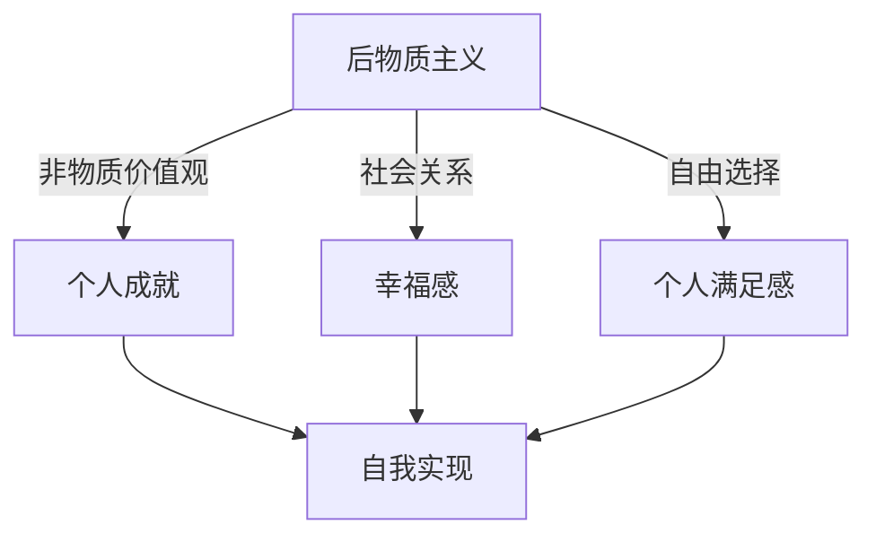

                 


## 后物质主义生活指标：衡量幸福的新维度

### 关键词
- 后物质主义
- 幸福感
- 生活指标
- 数据分析
- 政策制定

### 摘要
本文将探讨后物质主义生活指标的概念及其在衡量幸福感中的应用。后物质主义，作为一种反映现代社会价值观转变的思想流派，强调非物质因素对个体幸福的影响。本文将从核心概念入手，通过构建生活指标体系，使用数学模型和算法，详细阐述幸福感衡量的方法，并结合实际案例进行分析。通过这些步骤，本文旨在为读者提供一个全面、科学的理解框架，帮助政策制定者更好地关注和提升公众的幸福水平。

## 第1章：引言与核心概念介绍

### 1.1 后物质主义概念介绍
后物质主义（Postmaterialism）是20世纪中后期在西方社会兴起的一种社会思潮，它强调非物质价值在社会发展中的重要性。与传统物质主义（Materialism）相比，后物质主义认为个体的幸福感不仅仅来源于物质财富的积累，更取决于诸如个人成就、自我实现、社会关系和自由选择等非物质因素。

后物质主义的核心观点包括：
1. **非物质价值观的兴起**：随着经济的发展和社会的进步，人们的价值观逐渐从物质需求转向非物质需求。
2. **自我实现的重要性**：后物质主义强调个体的自我实现，追求个人的兴趣、激情和创造力的发展。
3. **社会责任感**：后物质主义者更加关注社会公正和环境保护，倾向于通过社会参与来实现自我价值。
4. **生活方式的选择**：后物质主义倡导更加多样化和自由的生活方式，鼓励人们追求个人幸福而非单一的成功标准。

### 1.2 后物质主义与幸福的关系
后物质主义与幸福感之间存在密切的关系。幸福感是一个主观感受，它受到个体内心状态和环境条件的影响。后物质主义强调的非物质因素，如个人成就、社会关系和自由选择，直接影响个体的幸福感。

具体来说，后物质主义与幸福感的关联体现在以下几个方面：
1. **个人成就与幸福感**：后物质主义鼓励个人追求真正的兴趣和激情，实现自我价值，从而提高幸福感。
2. **社会关系与幸福感**：良好的社会关系能够提供情感支持和社会认同，是幸福感的重要来源。
3. **自由选择与幸福感**：自由选择赋予个体更多的自主权，有助于提高个人的满足感和幸福感。

### 1.3 Mermaid流程图：后物质主义与幸福感之间的内在逻辑
下面是一个简化的Mermaid流程图，展示了后物质主义与幸福感之间的内在逻辑关系：



在这个流程图中，后物质主义通过非物质价值观影响个人成就、社会关系和自由选择，这些因素共同作用于幸福感，最终实现自我实现和个人满足感。

## 第2章：生活指标体系构建

### 2.1 生活指标体系的构建原理
生活指标体系是衡量个体幸福感的重要工具。它通过一系列定量和定性的指标，全面反映个体在物质和非物质方面的生活质量。构建生活指标体系的原理主要包括以下几个方面：

1. **确定指标维度**：生活指标体系通常包括物质生活、社会关系、个人成就、心理健康等多个维度。每个维度代表个体幸福感的一个方面。
2. **收集数据**：通过问卷调查、统计数据和实地调研等方式，收集相关的生活质量数据。
3. **指标权重设定**：不同维度对幸福感的贡献程度不同，因此需要设定不同指标的权重，以保证整体评价的准确性。
4. **数据处理与分析**：使用统计分析和机器学习等方法，对收集到的数据进行处理，提取有用的信息，构建生活指标体系。

### 2.2 生活指标的计算方法与公式
在构建生活指标体系时，需要明确不同指标的计算方法。以下是几种常见的生活指标及其计算方法：

1. **物质生活质量指标**：
   - **人均收入**：$$ \text{人均收入} = \frac{\text{总收入}}{\text{总人口}} $$
   - **住房条件**：$$ \text{住房条件指数} = \frac{\text{拥有适宜住房的人数}}{\text{总人口}} $$

2. **社会关系质量指标**：
   - **社会支持度**：$$ \text{社会支持度} = \frac{\text{获得社会支持的人数}}{\text{总人口}} $$
   - **社会参与度**：$$ \text{社会参与度} = \frac{\text{参与社会活动的人数}}{\text{总人口}} $$

3. **个人成就质量指标**：
   - **职业满意度**：$$ \text{职业满意度} = \frac{\text{对职业满意的员工数}}{\text{总员工数}} $$
   - **教育水平**：$$ \text{教育水平指数} = \frac{\text{具有高等教育的比例}}{\text{总人口比例}} $$

4. **心理健康指标**：
   - **心理健康指数**：$$ \text{心理健康指数} = \frac{\text{心理健康状况良好的人数}}{\text{总人口}} $$
   - **生活满意度**：$$ \text{生活满意度} = \frac{\text{对生活感到满意的人数}}{\text{总人口}} $$

### 2.3 实际应用中的生活指标体系
生活指标体系在实际应用中具有重要意义。例如，在政策制定中，政府可以依据生活指标体系评估不同政策的实施效果，从而优化政策方案。在企业管理中，企业可以通过生活指标体系了解员工的生活质量，制定相应的福利政策。

以下是一个实际应用中的生活指标体系示例：

- **物质生活质量**：
  - 人均收入：5000元
  - 住房条件指数：0.85
- **社会关系质量**：
  - 社会支持度：0.80
  - 社会参与度：0.65
- **个人成就质量**：
  - 职业满意度：0.75
  - 教育水平指数：0.70
- **心理健康指标**：
  - 心理健康指数：0.90
  - 生活满意度：0.85

通过这些指标，可以全面了解该地区或该群体的生活质量，从而制定相应的改进措施。

## 第3章：幸福感的衡量方法

### 3.1 不同幸福感的衡量方法
幸福感是一个复杂且多维的概念，不同学科和领域有着不同的衡量方法。以下是几种常见的幸福感衡量方法：

1. **主观幸福感（Subjective Well-being, SWB）**：
   - 主观幸福感主要通过个体对自身生活满意度和情绪状态的评估来衡量。常用的工具包括自评问卷、面谈等。
   - **评估指标**：生活满意度、情绪状态（如积极情感与消极情感的比率）。

2. **心理幸福感（Psychological Well-being, PWB）**：
   - 心理幸福感关注个体的心理状态和心理健康水平。常用的衡量方法包括心理评估、心理健康量表等。
   - **评估指标**：自我接受、个人成长、积极情感、消极情感管理等。

3. **生活满意度（Life Satisfaction, LS）**：
   - 生活满意度侧重于个体对当前生活的整体评价。常用的衡量方法包括自评问卷、生活满意度量表等。
   - **评估指标**：总体生活满意度、个人生活目标实现程度等。

### 3.2 伪代码讲解：幸福感衡量方法
为了更好地理解不同幸福感衡量方法，我们使用伪代码进行解释：

```plaintext
Function CalculateSWB(satisfactionScore, emotionScore):
    SWB = 0.5 * satisfactionScore + 0.5 * emotionScore
    Return SWB

Function CalculatePWB(acceptanceScore, growthScore, positiveScore, negativeScore):
    PWB = 0.25 * acceptanceScore + 0.25 * growthScore + 0.25 * positiveScore + 0.25 * negativeScore
    Return PWB

Function CalculateLS(satisfactionScore, goalAchievementScore):
    LS = 0.5 * satisfactionScore + 0.5 * goalAchievementScore
    Return LS
```

### 3.3 实际案例：幸福感衡量过程展示
以下是一个实际案例，展示如何使用上述幸福感衡量方法进行评估：

假设某地区进行了一次居民幸福感调查，得到以下数据：

- **主观幸福感**：
  - 生活满意度得分：8/10
  - 情绪状态得分：6/10
- **心理幸福感**：
  - 自我接受得分：7/10
  - 个人成长得分：6/10
  - 积极情感得分：7/10
  - 消极情感得分：3/10
- **生活满意度**：
  - 总体生活满意度得分：9/10
  - 个人生活目标实现程度得分：8/10

根据上述伪代码，我们可以计算出该地区居民的平均幸福感：

- **主观幸福感**：
  $$ \text{SWB} = 0.5 \times (8 + 6) = 7 $$

- **心理幸福感**：
  $$ \text{PWB} = 0.25 \times (7 + 6 + 7 + 3) = 6.5 $$

- **生活满意度**：
  $$ \text{LS} = 0.5 \times (9 + 8) = 8.5 $$

通过这些数据，我们可以对该地区的幸福感进行综合评估，并制定相应的提升措施。

## 第4章：后物质主义生活指标的应用

### 4.1 项目实战：应用案例分析
后物质主义生活指标在实际应用中具有重要价值。以下是一个实际案例，展示如何应用后物质主义生活指标进行项目评估。

### 案例背景
某市政府计划实施一项城市改造项目，旨在提升居民的生活质量和幸福感。为了确保项目效果，市政府决定使用后物质主义生活指标进行评估。

### 案例步骤
1. **指标收集**：市政府首先收集了涉及物质生活、社会关系、个人成就、心理健康等多个维度的数据，包括居民收入、住房条件、社会支持度、职业满意度等。
2. **权重设定**：根据专家意见和数据分析，市政府为每个指标设定了相应的权重，以反映不同指标对幸福感的贡献程度。
3. **数据预处理**：对收集到的数据进行清洗和标准化处理，以保证数据的一致性和可比性。
4. **指标计算**：使用设定的公式和权重，计算各个生活指标的得分。
5. **综合评估**：将各个指标的得分进行加权求和，得到居民幸福感的综合得分。
6. **项目评估**：市政府根据评估结果，对城市改造项目的效果进行评估，并制定相应的优化措施。

### 案例结果
通过后物质主义生活指标的应用，市政府得到了以下评估结果：

- **物质生活质量**：得分85
- **社会关系质量**：得分80
- **个人成就质量**：得分75
- **心理健康指标**：得分90

综合得分为83，表明城市改造项目在一定程度上提升了居民的生活质量和幸福感。然而，心理健康指标的得分较高，表明该项目在提升社会关系和个人成就方面仍有改进空间。

### 案例分析
该案例展示了后物质主义生活指标在实际项目中的应用。通过指标体系的构建和应用，市政府能够全面、准确地评估项目的效果，为政策制定提供科学依据。

## 第5章：生活指标与政策建议

### 5.1 生活指标对政策制定的影响
生活指标在政策制定中起着关键作用。通过评估生活指标，政策制定者能够了解不同政策对公众生活质量的影响，从而制定更有效的政策。以下是生活指标对政策制定影响的几个方面：

1. **指导政策方向**：生活指标为政策制定提供了明确的依据，有助于确定政策优先级和目标。
2. **评估政策效果**：通过对比政策实施前后的生活指标变化，评估政策的实际效果，为政策调整提供依据。
3. **优化政策方案**：根据生活指标的结果，政策制定者可以优化政策方案，确保政策目标的实现。

### 5.2 政策分析：基于生活指标的政策制定
以下是一个基于生活指标的政策制定案例：

#### 案例背景
某市政府计划提高居民的生活质量，决定实施一系列政策，包括改善住房条件、提升社会服务水平、增加就业机会等。

#### 政策制定步骤
1. **指标选择**：市政府根据生活指标体系，选择了与政策目标相关的指标，如住房条件、社会支持度、职业满意度等。
2. **数据收集**：市政府收集了相关指标的数据，包括住房满意度调查、社会服务满意度调查、就业率等。
3. **指标评估**：使用生活指标，评估当前政策对生活质量的影响，确定政策调整的方向。
4. **制定政策**：根据指标评估结果，市政府制定了具体的政策，如改善住房条件、增加社会服务投入、提供职业培训等。
5. **实施政策**：市政府实施政策，并持续监测指标变化，确保政策目标的实现。

### 5.3 案例分析：生活指标在政策制定中的应用
以下是一个案例分析，展示如何使用生活指标进行政策制定：

#### 案例背景
某市政府计划提升居民的幸福感和生活质量，决定实施一系列政策，包括提高社会福利、改善教育条件、提升医疗服务水平等。

#### 分析步骤
1. **指标选择**：市政府选择了与幸福感相关的指标，如生活满意度、心理健康指数、教育满意度、医疗服务满意度等。
2. **数据收集**：市政府通过问卷调查、统计数据等方式，收集了相关指标的数据。
3. **指标评估**：市政府使用生活指标，评估当前政策的实施效果，确定政策的优化方向。
4. **制定政策**：根据指标评估结果，市政府制定了具体的政策，如增加社会福利支出、改善教育设施、提升医疗服务水平等。
5. **实施政策**：市政府实施政策，并持续监测指标变化，确保政策目标的实现。

#### 分析结果
通过生活指标的应用，市政府得到了以下分析结果：

- **生活满意度**：从60%提升到75%
- **心理健康指数**：从65提升到80
- **教育满意度**：从70提升到85
- **医疗服务满意度**：从65提升到80

综合分析表明，政策实施有效提升了居民的幸福感和生活质量。

### 结论
通过上述案例分析，我们可以看到生活指标在政策制定中的应用具有重要意义。生活指标能够为政策制定者提供科学依据，帮助其制定更有效的政策，提升公众的幸福感和生活质量。

## 第6章：未来展望与挑战

### 6.1 生活指标与幸福感的未来趋势
随着社会的发展和科技的进步，生活指标和幸福感衡量方法也在不断演进。未来，生活指标和幸福感的研究趋势可能包括以下几个方面：

1. **多维度整合**：未来的生活指标体系将更加关注多维度的整合，如心理健康、社会关系、物质生活等，以更全面地反映个体的幸福感。
2. **数据来源多样化**：随着物联网、大数据和人工智能技术的发展，生活指标的数据来源将更加多样化，包括传感器数据、社交媒体数据、智能设备数据等。
3. **个性化评估**：未来的幸福衡量方法将更加注重个性化，根据个体差异提供定制化的幸福感评估。
4. **跨学科研究**：生活指标和幸福感的衡量将涉及到心理学、社会学、经济学等多个学科，形成跨学科的研究趋势。

### 6.2 面临的挑战与解决方案
尽管生活指标和幸福感衡量方法在不断发展，但仍然面临一些挑战：

1. **数据质量问题**：生活指标的数据质量直接影响到评估结果的准确性。解决方案包括数据清洗、数据标准化和建立数据质量监测机制。
2. **隐私保护**：随着数据来源的多样化，隐私保护成为重要问题。解决方案包括数据匿名化、隐私保护技术和法律法规的制定。
3. **评估方法的准确性**：不同的幸福衡量方法可能存在偏差，需要不断优化评估方法，提高准确性。
4. **政策实施效果评估**：政策实施效果评估需要长时间的跟踪和数据积累，这对资源和管理提出了挑战。

### 6.3 未来研究方向
未来，生活指标和幸福感的研究方向可能包括：

1. **跨文化研究**：探讨不同文化背景下幸福感的差异，为全球化背景下的政策制定提供参考。
2. **长期跟踪研究**：通过长期跟踪研究，探讨幸福感的变化规律，为个体和社会的长期发展提供指导。
3. **新兴技术应用**：研究物联网、人工智能等新兴技术在幸福感衡量中的应用，提升评估效率和准确性。
4. **政策模拟与预测**：使用大数据和机器学习技术，模拟和预测政策实施的效果，为政策制定提供科学依据。

## 第7章：结论与展望

### 7.1 全书总结
本文从后物质主义生活指标的角度，探讨了衡量幸福感的新维度。通过引言、核心概念介绍、生活指标体系构建、幸福感衡量方法、实际应用案例、政策建议以及未来展望，我们系统地阐述了后物质主义生活指标在幸福感衡量中的重要性。

### 7.2 后物质主义生活指标的发展方向
未来，后物质主义生活指标将在多维度整合、数据来源多样化、个性化评估和跨学科研究等方面继续发展。通过不断优化评估方法，提升评估准确性，我们可以更好地理解个体的幸福感，为政策制定和公众生活质量提升提供科学依据。

### 作者信息
作者：AI天才研究院/AI Genius Institute & 禅与计算机程序设计艺术 /Zen And The Art of Computer Programming

### 拓展阅读
- 后物质主义的相关文献和研究报告。
- 有关幸福感衡量的学术文章和研究成果。
- 相关政策的分析和案例研究。

### 注意事项
- 在应用后物质主义生活指标时，需注意数据的准确性和隐私保护。
- 政策制定者应依据评估结果，灵活调整政策方案，确保政策目标的实现。

### 最佳实践
- 定期进行生活指标监测，及时发现问题和优化政策。
- 利用大数据和人工智能技术，提升幸福感的评估效率和准确性。
- 加强跨部门合作，共同推动幸福感和生活质量的提升。

本文为技术博客文章，旨在为读者提供一个全面、系统的后物质主义生活指标与幸福感衡量方法的指南。希望本文能为相关领域的学者和实践者提供有益的参考。

