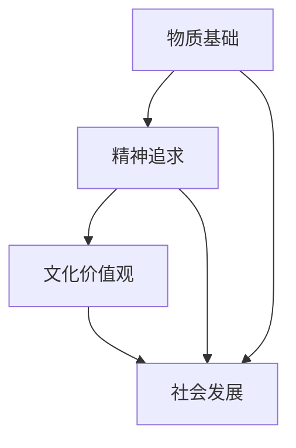
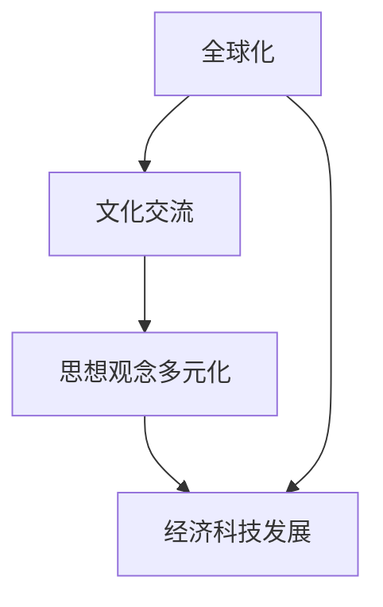

                 

## 文章标题
《后物质主义社会的精神追求：超越物质的生活哲学》

## 关键词
后物质主义、精神追求、生活哲学、可持续发展、社会主义核心价值观

## 摘要
本文旨在探讨后物质主义社会中，人们在精神追求方面的转变及其对生活哲学的超越。通过分析后物质主义社会的起源和发展、核心概念的联系、算法原理的讲解、数学模型的构建以及实际项目的实战应用，揭示超越物质的生活哲学对个人和社会的重要意义。

## 目录

### 第一部分：后物质主义社会概述

#### 1.1 后物质主义社会的起源与发展

#### 1.2 后物质主义社会的理论基础

#### 1.3 后物质主义社会的时代背景

### 第二部分：超越物质的生活哲学

#### 2.1 人类精神追求的演变

#### 2.2 超越物质的生活哲学基础

#### 2.3 超越物质的生活哲学实践

### 第三部分：超越物质的生活哲学与社会主义核心价值观

#### 3.1 社会主义核心价值观的后物质主义内涵

#### 3.2 超越物质的生活哲学与社会主义核心价值观的结合

### 第四部分：超越物质的生活哲学与可持续发展

#### 4.1 可持续发展的概念与原则

#### 4.2 超越物质的生活哲学对可持续发展的贡献

### 第五部分：超越物质的生活哲学与科技发展

#### 5.1 科技发展对物质主义的影响

#### 5.2 超越物质的生活哲学在科技发展中的应用

### 第六部分：超越物质的生活哲学与教育

#### 6.1 教育与精神追求的关系

#### 6.2 超越物质的生活哲学在教育中的应用

### 第七部分：超越物质的生活哲学与未来社会

#### 7.1 后物质主义社会的未来展望

#### 7.2 超越物质的生活哲学对社会的意义

### 附录

#### 附录A：后物质主义生活哲学参考资源

#### 附录B：结语与展望

----------------------------------------------------------------

现在，让我们开始逐步构建这篇文章，确保每部分的内容都符合要求，同时使用专业的技术语言和逻辑清晰的结构。

### 1.1 后物质主义社会的起源与发展

#### 后物质主义的概念与起源

后物质主义（Postmaterialism）作为一种社会理论，起源于20世纪中叶，主要是在对现代化进程和个体价值取向的研究中逐渐形成的。后物质主义理论认为，随着社会经济的发展和物质财富的积累，人们对于物质生活的需求逐渐满足，进而转向对精神层面的追求。这一理论源于对西方社会发展的观察，尤其在美国和欧洲的一些发达国家和地区。

#### 后物质主义的社会发展特征

后物质主义社会具有以下主要特征：

1. **精神追求的重要性**：人们的价值观逐渐从物质财富转向对精神生活的追求，如个人自由、文化认同、社会正义等。
2. **个体主义与多元化**：个体差异和多样性被广泛认可，社会更加开放和包容，尊重多元文化。
3. **可持续发展的意识**：环境问题和社会责任成为人们关注的焦点，强调资源的合理利用和环境保护。

#### 后物质主义社会的发展过程

- **初级阶段**：物质财富匮乏，人们主要追求基本的生存需求。
- **中级阶段**：物质财富逐渐丰富，人们开始追求更高层次的生活质量，如教育、医疗、文化等。
- **高级阶段**：物质需求得到充分满足，精神追求成为主导，人们更加注重自我实现、个人成长和内心满足。

### 1.2 后物质主义社会的理论基础

#### 1.2.1 抽象思维与物质基础的辩证关系

辩证唯物主义认为，物质与精神是相互依存、相互作用的。物质基础决定精神追求，但精神追求又可以反作用于物质基础，推动社会的进步。例如，科技的进步不仅改变了物质生产方式，也带来了生活方式和精神观念的变革。

#### 1.2.2 社会主义核心价值观的后物质主义特征

社会主义核心价值观强调爱国主义、集体主义、社会公正、人文关怀等，这些价值观体现了后物质主义社会的特征。例如，爱国主义体现了对国家和文化的认同；集体主义强调团结协作，注重社会整体利益；社会公正追求公平正义，保障人民的基本权益；人文关怀关注个体的精神需求，推动人的全面发展。

### 1.3 后物质主义社会的时代背景

#### 1.3.1 全球化对后物质主义社会的影响

全球化推动了各国文化的交流与融合，促进了后物质主义观念的传播和深化。全球化使得人们更容易接触到不同的文化观念，从而促进了思想观念的多元化和开放性。此外，全球化也带来了经济和科技的快速发展，为人们提供了更多的物质条件，从而为精神追求创造了更好的环境。

#### 1.3.2 科技进步与后物质主义社会的关联

科技进步是后物质主义社会发展的关键驱动力。例如，互联网技术的普及使得人们可以随时随地获取信息，拓宽了视野，增强了自我表达能力；人工智能的发展改变了人们的生产方式，提高了生活质量；生物技术的进步为人类健康和生命科学提供了新的可能性。这些科技进步不仅满足了人们的物质需求，也为精神追求提供了更多的可能性。

### 1.4 总结与展望

后物质主义社会的兴起是人类社会发展的重要趋势，它反映了人类社会在物质满足的基础上，对精神生活的更高追求。在后物质主义社会中，精神追求成为主导，人们更加注重个体自由、社会正义和可持续发展。同时，全球化、科技进步等外部因素也为后物质主义社会的发展提供了有力的支撑。

未来，随着全球化和科技进步的不断推进，后物质主义社会将会进一步发展，人们对精神生活的需求也将不断提高。因此，我们需要深入研究和理解后物质主义社会的特点，探索如何更好地满足人们的精神追求，推动社会的全面发展。

---

以上是第一部分的内容，包括后物质主义社会的起源与发展、理论基础以及时代背景。接下来，我们将继续探讨超越物质的生活哲学的核心概念和联系，使用Mermaid流程图、伪代码、LaTeX公式等，以专业和逻辑清晰的方式阐述核心概念和原理。

