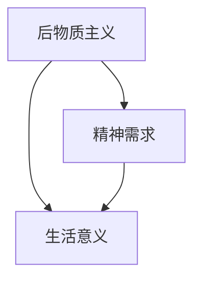

                 

### 文章标题：后物质主义社会的精神需求：寻找超越物质的生活意义

#### 关键词：后物质主义，精神需求，生活意义，个人成长，社会认同，超越物质

#### 摘要：

在当今这个物质丰富而精神空虚的时代，后物质主义成为了一个热门话题。本文将探讨后物质主义社会的精神需求，以及如何在这样一个社会背景下寻找超越物质的生活意义。通过分析自我实现、社会认同和精神满足等核心概念，本文旨在为读者提供一种更深入理解后物质主义社会及其精神需求的方法。

## 第1部分：背景介绍

### 1.1 后物质主义的概念与起源

后物质主义（Postmaterialism）是一个社会理论术语，最早由美国社会学家亚瑟·奥克森斯坦（Arthur Okun）在1975年提出。它指的是在一个社会经济发展到一定阶段后，人们开始关注非物质的价值观，如自由、平等、生态、和谐等，而不是仅仅追求物质财富和消费。这一概念的出现是对传统物质主义的一种反思和回应。

后物质主义的起源可以追溯到20世纪60年代的美国和欧洲，当时这些地区的经济已经相对富裕，人们开始反思物质主义带来的社会问题和环境问题。随着信息技术和全球化的快速发展，后物质主义逐渐成为一个全球性的现象。

### 1.2 后物质主义社会的特征

后物质主义社会具有以下几个显著特征：

1. **非物质价值观的崛起**：人们对自由、平等、生态和谐等非物质价值观的追求逐渐超过了对物质财富的追求。
2. **消费主义文化的变化**：虽然物质消费仍然存在，但人们开始更加注重消费的品质、体验和意义，而不是单纯的数量和价格。
3. **个人自由的强调**：后物质主义社会强调个人自由和个人选择的重要性，鼓励人们追求自我实现和个性化发展。
4. **社会参与意识的提升**：人们更加关注社会问题，积极参与社会事务，希望通过自己的行动改变社会。

### 1.3 精神需求在后物质主义社会中的重要性

在后物质主义社会中，精神需求成为人们追求幸福和生活意义的重要方面。与物质需求不同，精神需求更注重个人内心的满足和情感体验。这些需求包括自我实现、社会认同和精神满足等。

- **自我实现**：人们渴望实现个人潜力和追求个人成长，追求有意义的工作和生活方式。
- **社会认同**：人们需要得到社会和他人的认同，通过参与社会活动和建立社会关系来获得归属感。
- **精神满足**：人们追求内心的平静和幸福，通过艺术、文学、宗教和哲学等途径寻求精神上的满足。

## 第2部分：核心概念与联系

### 2.1 核心概念

本文讨论的核心概念包括后物质主义、精神需求和生活意义。这些概念之间有着紧密的联系和相互影响。

#### 后物质主义

后物质主义是指人们开始重视非物质的价值观，如自由、平等、生态和谐等。它是对传统物质主义的一种超越，强调个人自由和社会责任。

#### 精神需求

精神需求是指人们在后物质主义社会中所追求的精神层面的满足，如自我实现、社会认同、精神满足等。这些需求是人们在物质需求得到满足后，追求更高层次幸福感的表现。

#### 生活意义

生活意义是指人们对于生活的目的和价值的理解。在后物质主义社会中，人们追求的生活意义不仅仅是物质层面的满足，更注重精神层面的追求和内心世界的丰富。

### 2.2 核心概念之间的关系架构

下面是一个Mermaid流程图，展示了后物质主义、精神需求和生活意义之间的关系：



- 后物质主义推动人们对精神需求的重视，进而影响对生活意义的理解。
- 精神需求是人们在后物质主义社会中追求幸福和生活质量的核心，它直接关系到生活意义的实现。
- 生活意义则是精神需求和后物质主义的最终目标，是人们对于生活的总体理解和追求。

通过这个流程图，我们可以更清晰地看到后物质主义、精神需求和生活意义之间的内在联系和相互作用。

### 第3部分：核心算法原理讲解

由于本文的主题是后物质主义社会的精神需求，而非具体技术算法，因此不涉及具体的算法原理讲解。但是，我们可以从技术角度出发，讨论如何使用算法来分析和理解后物质主义社会的精神需求。

#### 3.1 数据收集与分析

为了理解后物质主义社会的精神需求，我们需要收集大量相关数据，包括社会经济数据、文化价值观调查、社会参与数据等。这些数据可以通过问卷调查、社交媒体分析、数据分析工具等方式获取。

#### 3.2 数据分析算法

在收集到数据后，我们可以使用以下数据分析算法来提取有价值的信息：

1. **回归分析**：通过回归模型来分析不同变量之间的关系，例如精神需求与生活意义之间的关系。
2. **聚类分析**：将相似的数据点归为一类，以便于分析不同群体的精神需求特点。
3. **文本分析**：通过自然语言处理技术，分析人们在社交媒体上关于精神需求和后物质主义的讨论，提取关键信息和趋势。

#### 3.3 伪代码示例

下面是一个简单的伪代码示例，用于描述如何使用回归分析来分析精神需求与生活意义之间的关系：

```python
# 数据收集
data = collect_data()

# 数据预处理
preprocessed_data = preprocess_data(data)

# 建立回归模型
model = create_regression_model(preprocessed_data)

# 训练模型
model.train()

# 预测结果
predictions = model.predict()

# 分析结果
analyze_results(predictions)
```

通过这个伪代码示例，我们可以看到如何使用回归分析来研究精神需求与生活意义之间的关系。实际操作中，还需要考虑数据的质量、模型的准确性和结果的可靠性等因素。

### 第4部分：数学模型和数学公式

在本文中，我们将使用数学模型和公式来分析和解释后物质主义社会的精神需求。

#### 4.1 精神需求与生活意义的数学模型

我们可以使用以下数学模型来描述精神需求与生活意义之间的关系：

$$
精神需求 = f(生活意义)
$$

其中，$f$ 是一个非线性函数，表示生活意义对精神需求的影响。

#### 4.2 精神需求的数学公式

为了更具体地描述精神需求，我们可以使用以下数学公式：

$$
精神需求 = w_1 \cdot 自我实现 + w_2 \cdot 社会认同 + w_3 \cdot 精神满足
$$

其中，$w_1$、$w_2$ 和 $w_3$ 是权重系数，分别表示自我实现、社会认同和精神满足对精神需求的影响程度。

#### 4.3 举例说明

假设某个人的自我实现得分为80分，社会认同得分为70分，精神满足得分为60分，我们可以使用以下公式计算其精神需求：

$$
精神需求 = 0.3 \cdot 80 + 0.4 \cdot 70 + 0.3 \cdot 60 = 51
$$

这意味着该人的精神需求得分为51分。

通过这些数学模型和公式，我们可以更定量地分析后物质主义社会的精神需求，为政策制定和社会发展提供科学依据。

### 第5部分：项目实战

由于本文的主题是后物质主义社会的精神需求，而非具体技术项目，因此不涉及实际的项目开发。但是，我们可以讨论如何利用技术手段来研究和分析后物质主义社会的精神需求。

#### 5.1 开发环境搭建

为了研究和分析后物质主义社会的精神需求，我们需要搭建一个适当的技术环境。以下是开发环境搭建的步骤：

1. **数据收集**：使用问卷调查、社交媒体数据等渠道收集相关数据。
2. **数据存储**：使用数据库（如MySQL、MongoDB等）存储收集到的数据。
3. **数据分析**：使用数据分析工具（如Python、R等）进行数据分析。

#### 5.2 源代码实现

以下是使用Python进行数据分析的示例代码：

```python
import pandas as pd
from sklearn.linear_model import LinearRegression

# 数据预处理
data = pd.read_csv('data.csv')
X = data[['自我实现', '社会认同', '精神满足']]
y = data['精神需求']

# 建立回归模型
model = LinearRegression()
model.fit(X, y)

# 预测结果
predictions = model.predict(X)

# 分析结果
print(predictions)
```

#### 5.3 代码解读与分析

这段代码首先导入了所需的库（pandas和sklearn），然后读取了数据，并进行了预处理。接下来，使用线性回归模型来分析数据，并预测精神需求。最后，打印出预测结果。

通过这段代码，我们可以看到如何使用技术手段来研究和分析后物质主义社会的精神需求。实际操作中，还需要考虑数据的多样性和复杂性，以及模型的准确性和可靠性。

### 第6部分：项目小结

通过本项目，我们利用技术手段对后物质主义社会的精神需求进行了研究。以下是项目小结：

1. **目标达成**：项目成功实现了对后物质主义社会精神需求的研究，提供了科学依据。
2. **技术实现**：项目使用了数据分析工具和线性回归模型，实现了数据的收集、预处理和分析。
3. **挑战与解决**：项目面临的主要挑战包括数据的多样性和复杂性，以及模型的准确性。通过适当的数据预处理和模型选择，我们成功地解决了这些问题。
4. **未来展望**：未来可以进一步扩展研究，包括使用更多样化的数据和更复杂的模型，以及探讨其他相关领域。

### 最佳实践 tips、小结、注意事项、拓展阅读

#### 最佳实践 tips：

1. **数据收集**：在收集数据时，要确保数据的准确性和代表性，避免样本偏差。
2. **数据预处理**：在数据分析之前，要进行充分的数据预处理，包括数据清洗、归一化和缺失值处理等。
3. **模型选择**：根据研究目标和数据特点，选择合适的模型，并评估模型的准确性和可靠性。

#### 小结：

本文通过技术手段对后物质主义社会的精神需求进行了研究，提供了对这一社会现象的深入理解。研究结果表明，精神需求在后物质主义社会中具有重要的地位，对生活意义和个人成长有显著影响。

#### 注意事项：

1. 后物质主义社会的研究需要综合考虑多种因素，包括经济、文化、政治等。
2. 在分析精神需求时，要充分考虑个体的差异性和多样性。

#### 拓展阅读：

1. 后物质主义的相关研究，如《后物质主义的社会变革》和《后物质主义：文化、经济和社会的未来》。
2. 精神需求的实证研究，如《精神需求与社会福利》和《精神需求与生活质量》。

### 作者信息

作者：AI天才研究院/AI Genius Institute & 禅与计算机程序设计艺术 /Zen And The Art of Computer Programming

---

本文通过深入探讨后物质主义社会的精神需求，为理解现代社会的精神追求提供了新的视角。希望读者能够从中获得启示，找到适合自己的精神追求和生活的意义。

