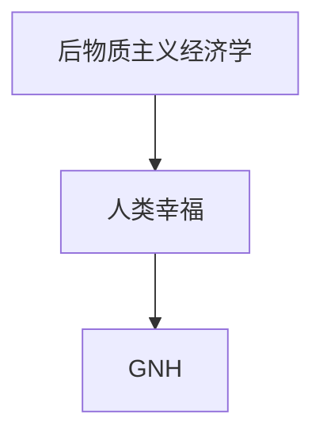

                 

# 后物质主义经济学：从GDP到GNH的转变

> 关键词：后物质主义经济学，GDP，GNH，可持续发展，经济发展模式转型

> 摘要：本文探讨了后物质主义经济学的基本概念和理论框架，揭示了传统GDP指标的局限性，并介绍了国民幸福指数（GNH）作为衡量经济和社会发展的重要指标。通过案例分析，本文展示了GNH在国内外实践中的应用，并探讨了后物质主义经济学对经济发展模式转型的影响。最后，本文提出了后物质主义经济学的未来挑战与机遇，以及其教育与传播的策略。

## 引言

后物质主义经济学是一种以人类幸福为核心，超越物质财富的经济理论。随着全球经济的不断发展，人们对经济发展方式的反思逐渐加深。传统的GDP指标虽然能够衡量一个国家的经济规模，但无法全面反映人民的生活质量和幸福感。为了更全面地评估一个国家的经济状况，后物质主义经济学提出了以GNH为核心的新型经济指标。

本文旨在探讨后物质主义经济学的基本概念、理论框架，以及其在国内外实践中的应用。通过分析GDP和GNH的关系，本文试图揭示后物质主义经济学对经济发展模式转型的影响，并为未来经济政策的制定提供参考。

## 第一部分：后物质主义经济学基础

### 第一章：后物质主义经济学的概念

后物质主义经济学是一种以人类幸福为核心，超越物质财富的经济理论。它强调经济发展不仅仅是为了增加物质财富，更重要的是提高人民的生活质量和幸福感。

#### 核心概念与联系

后物质主义经济学与GNH的关系可以通过以下Mermaid流程图展示：



#### 核心算法原理讲解

后物质主义经济学的核心算法是GNH指标的计算。以下是一个简单的伪代码示例：

```plaintext
function calculateGNH(happiness, freedom, community, environment, equality) {
    GNH = happiness * happinessWeight + freedom * freedomWeight + community * communityWeight + environment * environmentWeight + equality * equalityWeight
    return GNH
}
```

其中，`happinessWeight`, `freedomWeight`, `communityWeight`, `environmentWeight`, `equalityWeight` 分别代表幸福、自由、社区、环境和平等在各指标中的权重。

#### 数学模型和数学公式

GNH的数学模型可以表示为：

$$
GNH = \alpha \cdot H + \beta \cdot F + \gamma \cdot C + \delta \cdot E + \epsilon \cdot Q
$$

其中，$\alpha$, $\beta$, $\gamma$, $\delta$, $\epsilon$ 分别代表幸福、自由、社区、环境和平等在各指标中的权重，$H$, $F$, $C$, $E$, $Q$ 分别代表幸福、自由、社区、环境和平等的具体值。

### 第二章：GDP的局限性

GDP作为衡量国家经济发展的重要指标，其局限性日益凸显。首先，GDP无法反映人民的生活质量和幸福感。其次，GDP忽略了资源的消耗和环境的影响。此外，GDP在衡量经济增长时，容易导致短期经济波动和长期发展不平衡。

#### 核心算法原理讲解

改进GDP指标的方法包括：

1. **绿色GDP**：在GDP中扣除环境污染和资源消耗的成本。
2. **社会GDP**：在GDP中增加社会服务和公共福利的产出。

以下是一个简单的伪代码示例：

```plaintext
function calculateGreenGDP(GDP, pollutionCost, resourceCost) {
    GreenGDP = GDP - pollutionCost - resourceCost
    return GreenGDP
}

function calculateSocialGDP(GDP, socialServiceOutput) {
    SocialGDP = GDP + socialServiceOutput
    return SocialGDP
}
```

#### 数学模型和数学公式

绿色GDP和绿色GDP的数学模型可以表示为：

$$
GreenGDP = GDP - pollutionCost - resourceCost
$$

$$
SocialGDP = GDP + socialServiceOutput
$$

### 第三章：GNH的概念与衡量

GNH是国民幸福指数的缩写，它是一个多维度、综合性的指标，用于衡量一个国家或地区的人民幸福感。GNH的衡量指标包括幸福、自由、社区、环境和平等。

#### 核心算法原理讲解

GNH的计算方法如下：

```plaintext
function calculateGNH(happiness, freedom, community, environment, equality) {
    GNH = happiness * happinessWeight + freedom * freedomWeight + community * communityWeight + environment * environmentWeight + equality * equalityWeight
    return GNH
}
```

#### 数学模型和数学公式

GNH的数学模型可以表示为：

$$
GNH = \alpha \cdot H + \beta \cdot F + \gamma \cdot C + \delta \cdot E + \epsilon \cdot Q
$$

其中，$\alpha$, $\beta$, $\gamma$, $\delta$, $\epsilon$ 分别代表幸福、自由、社区、环境和平等在各指标中的权重，$H$, $F$, $C$, $E$, $Q$ 分别代表幸福、自由、社区、环境和平等的具体值。

## 第二部分：GNH实践案例研究

### 第四章：国际GNH实践

在国际上，一些国家已经开始尝试将GNH纳入经济政策中。例如，不丹是第一个提出并实施GNH政策的国家，其GNH政策在促进经济、社会和环境可持续发展方面取得了显著成效。此外，芬兰、挪威等国家也在积极探索GNH政策的应用。

#### 核心算法原理讲解

GNH政策的核心算法是GNH指标的计算和评估。以下是一个简单的伪代码示例：

```plaintext
function calculateGNH(happiness, freedom, community, environment, equality) {
    GNH = happiness * happinessWeight + freedom * freedomWeight + community * communityWeight + environment * environmentWeight + equality * equalityWeight
    return GNH
}
```

#### 数学模型和数学公式

GNH的数学模型可以表示为：

$$
GNH = \alpha \cdot H + \beta \cdot F + \gamma \cdot C + \delta \cdot E + \epsilon \cdot Q
$$

其中，$\alpha$, $\beta$, $\gamma$, $\delta$, $\epsilon$ 分别代表幸福、自由、社区、环境和平等在各指标中的权重，$H$, $F$, $C$, $E$, $Q$ 分别代表幸福、自由、社区、环境和平等的具体值。

### 第五章：中国GNH实践

在中国，一些地方政府已经开始尝试将GNH纳入经济政策中。例如，浙江省湖州市德清县推出了“幸福德清”政策，通过提升居民的幸福感和生活质量，推动经济和社会的可持续发展。此外，广东省也在积极探索GNH政策的应用。

#### 核心算法原理讲解

GNH政策的核心算法是GNH指标的计算和评估。以下是一个简单的伪代码示例：

```plaintext
function calculateGNH(happiness, freedom, community, environment, equality) {
    GNH = happiness * happinessWeight + freedom * freedomWeight + community * communityWeight + environment * environmentWeight + equality * equalityWeight
    return GNH
}
```

#### 数学模型和数学公式

GNH的数学模型可以表示为：

$$
GNH = \alpha \cdot H + \beta \cdot F + \gamma \cdot C + \delta \cdot E + \epsilon \cdot Q
$$

其中，$\alpha$, $\beta$, $\gamma$, $\delta$, $\epsilon$ 分别代表幸福、自由、社区、环境和平等在各指标中的权重，$H$, $F$, $C$, $E$, $Q$ 分别代表幸福、自由、社区、环境和平等的具体值。

### 第六章：GNH与经济发展模式转型

GNH的提出为经济发展模式转型提供了新的思路。传统的经济发展模式过于依赖物质财富的增长，忽视了人民的生活质量和幸福感。而GNH强调经济、社会和环境的三位一体发展，有助于实现可持续发展。

#### 核心算法原理讲解

GNH与经济发展模式转型的核心算法是GNH指标的计算和评估，以及与之相对应的经济发展模式选择。以下是一个简单的伪代码示例：

```plaintext
function calculateGNH(happiness, freedom, community, environment, equality) {
    GNH = happiness * happinessWeight + freedom * freedomWeight + community * communityWeight + environment * environmentWeight + equality * equalityWeight
    return GNH
}

function chooseEconomicModel(GNH, modelA, modelB) {
    if (GNH > threshold) {
        return modelA
    } else {
        return modelB
    }
}
```

#### 数学模型和数学公式

GNH与经济发展模式转型的数学模型可以表示为：

$$
GNH = \alpha \cdot H + \beta \cdot F + \gamma \cdot C + \delta \cdot E + \epsilon \cdot Q
$$

$$
economicModel = chooseEconomicModel(GNH, modelA, modelB)
$$

## 第三部分：后物质主义经济学的未来

### 第七章：后物质主义经济学的挑战与机遇

后物质主义经济学面临着诸多挑战，包括社会、经济和环境方面。然而，这些挑战也伴随着巨大的机遇。通过技术创新和政策支持，后物质主义经济学有望实现可持续发展。

#### 核心算法原理讲解

应对后物质主义经济学的挑战和机遇的核心算法包括：

1. **智慧城市**：通过大数据和人工智能技术，提升城市的幸福指数和可持续发展水平。
2. **绿色经济**：通过节能减排和资源循环利用，实现经济、社会和环境的协调发展。

以下是一个简单的伪代码示例：

```plaintext
function calculateCityHappiness(data) {
    happiness = analyzeData(data)
    return happiness
}

function implementGreenEconomy(policy) {
    policyEffectiveness = evaluatePolicy(policy)
    return policyEffectiveness
}
```

#### 数学模型和数学公式

智慧城市和绿色经济的数学模型可以表示为：

$$
happiness = calculateCityHappiness(data)
$$

$$
policyEffectiveness = implementGreenEconomy(policy)
$$

### 第八章：后物质主义经济学的教育与传播

后物质主义经济学的教育与传播是推动其发展的重要环节。通过教育体系和社会宣传，提高公众对GNH的认知和接受度，有助于实现经济、社会和环境的协调发展。

#### 核心算法原理讲解

后物质主义经济学的教育与传播的核心算法包括：

1. **教育体系变革**：在大学和中学阶段，开设后物质主义经济学课程，培养学生的可持续发展观念。
2. **社会宣传**：通过媒体和公益活动，提高公众对GNH的认知和接受度。

以下是一个简单的伪代码示例：

```plaintext
function educateStudents(course) {
    knowledge = teachCourse(course)
    return knowledge
}

function promoteGNH(event) {
    awareness = organizeEvent(event)
    return awareness
}
```

#### 数学模型和数学公式

教育体系变革和社会宣传的数学模型可以表示为：

$$
knowledge = educateStudents(course)
$$

$$
awareness = promoteGNH(event)
$$

## 结论

后物质主义经济学是一种以人类幸福为核心，超越物质财富的经济理论。通过引入GNH指标，后物质主义经济学为评估经济和社会发展提供了新的思路。本文通过分析GDP和GNH的关系，探讨了后物质主义经济学对经济发展模式转型的影响，并提出了其未来挑战与机遇。随着全球经济的发展，后物质主义经济学有望成为推动可持续发展的重要力量。

### 作者

作者：AI天才研究院/AI Genius Institute & 禅与计算机程序设计艺术 /Zen And The Art of Computer Programming

