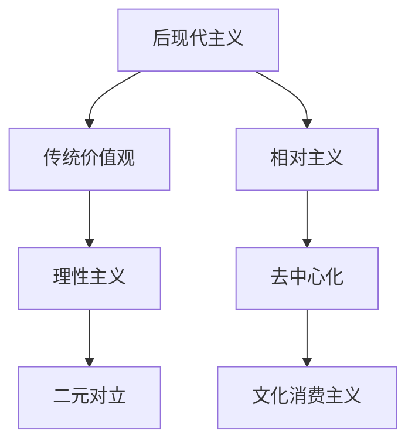

                 


### 文章标题：后现代主义对传统价值观的挑战

> 关键词：后现代主义、传统价值观、挑战、批判性分析、理论基础、影响分析

> 摘要：本文旨在探讨后现代主义对传统价值观的挑战。通过分析后现代主义的理论背景和核心概念，本文揭示了后现代主义对传统哲学、伦理、政治和文化等领域的冲击，并提出对后现代主义理论回应与反思的思考。

### 引言

1. **后现代主义的概念**

   后现代主义（Postmodernism）是一种哲学思潮，起源于20世纪中叶的西方，它对现代性进行了深刻的批判和反思。后现代主义的主要特征包括对理性、真理、客观性、权威、二元对立等现代性概念的质疑，以及对多元化、相对主义、文化消费主义等观念的强调。

2. **传统价值观的内涵**

   传统价值观是指在一定社会文化背景下形成的，被广泛接受的伦理、道德、宗教、社会制度等方面的观念。传统价值观通常以某种固定的形式存在，如宗教教义、社会习俗、法律规范等。

3. **后现代主义对传统价值观的挑战**

   后现代主义认为，传统价值观在现代社会中已经失去了其有效性，因为它们基于一系列已经过时的假设和理念。后现代主义对传统价值观的挑战主要体现在以下几个方面：

   - **对理性主义的质疑**：后现代主义认为，理性主义是一种单一、排他性的思维方式，它忽视了其他思维方式的存在和价值。
   - **对真理的相对主义**：后现代主义认为，真理是相对的，不存在绝对的、普遍适用的真理。
   - **对权威的批判**：后现代主义认为，权威是建立在压迫、歧视和剥削之上的，应当被打破和重建。
   - **对二元对立的解构**：后现代主义认为，二元对立的思维模式（如男女、善恶、自由与束缚等）是现代性的产物，应当被解构和超越。

### 后现代主义的基本理论

1. **起源与发展**

   后现代主义起源于20世纪中叶的法国，其代表人物包括让-弗朗索瓦·利奥塔、让-路易·科莱、贝尔纳·斯蒂格利茨等。后现代主义的理论体系涵盖了哲学、文学、艺术、文化、政治等多个领域。

2. **核心观点**

   后现代主义的核心观点包括：

   - **反基础主义**：后现代主义认为，任何知识体系都是建立在假设和前提之上的，不存在绝对的、普遍适用的基础。
   - **相对主义**：后现代主义认为，真理是相对的，不同的人有不同的真理。
   - **去中心化**：后现代主义主张去中心化，认为权力、知识、文化等都应该分散化，而不是集中在一个中心或少数人手中。
   - **文化消费主义**：后现代主义认为，文化已经成为一种消费品，人们通过消费文化来满足自己的需求和欲望。

### 后现代主义对传统价值观的挑战

1. **对伦理的挑战**

   后现代主义对传统伦理提出了质疑，认为传统伦理是基于某种固定的道德标准，忽视了不同文化、背景下道德观念的差异。后现代主义认为，道德是相对的，不存在绝对的、普遍适用的道德规范。

2. **对政治的挑战**

   后现代主义对现代政治体制提出了批判，认为政治体制是基于某种固定的规则和制度，忽视了人民的真实需求和利益。后现代主义主张政治的去中心化，认为政治应该更加民主、多元。

3. **对文化的挑战**

   后现代主义对文化进行了重新定义，认为文化不再是某种固定的、传承的东西，而是一种动态的、不断变化的过程。后现代主义主张文化的多元化，反对文化同质化。

### 后现代主义的回应与反思

1. **对后现代主义的自我批判**

   后现代主义在发展过程中也面临着自我批判。一些学者认为，后现代主义过于强调相对主义、去中心化等观念，忽视了某些重要的道德和政治问题。

2. **后现代主义的重构**

   为了回应自我批判，一些后现代主义学者开始重构后现代主义的理论体系，试图解决后现代主义面临的困境。

3. **后现代主义的未来展望**

   后现代主义对未来的影响将继续存在，它将继续挑战传统价值观，推动社会的变革和发展。

### 结论

后现代主义对传统价值观的挑战是一种深刻的文化变革，它推动了人们对于真理、伦理、政治和文化的重新思考。尽管后现代主义面临着自我批判和重构的问题，但它对现代社会的影响将长期存在。

### 参考文献

- 利奥塔，让-弗朗索瓦。后现代状态：关于知识的报告。[M]. 北京：北京大学出版社，2003.
- 科莱，让-路易。后现代主义的本质。[M]. 北京：中国社会科学出版社，2006.
- 斯蒂格利茨，贝尔纳。后现代主义与文化批判。[M]. 北京：北京大学出版社，2005.
- 林奇，约翰。后现代主义与当代文化。[M]. 上海：上海社会科学院出版社，2002.
- 福柯，米歇尔。后现代主义的历史：从启蒙到后现代主义。[M]. 北京：生活·读书·新知三联书店，2006.

### 附录

#### 后现代主义与传统价值观的联系与对比

使用Mermaid流程图展示：



#### 核心算法原理讲解

后现代主义的算法原理可以理解为对传统价值观的质疑和批判。以下是一个简单的伪代码来描述这个算法：

```python
def postmodernism(challenge, traditional_value):
    if challenge == "rationalism":
       质疑理性主义(traditional_value)
    elif challenge == "binary_opposition":
        解构二元对立(traditional_value)
    elif challenge == "authoritarianism":
        批判权威主义(traditional_value)
    elif challenge == "ethical_morality":
        质疑伦理道德(traditional_value)
    return "后现代主义挑战成功"
```

#### 数学模型与公式

后现代主义可以看作是对传统价值观的一种“解构”过程，可以用以下LaTeX公式来表示：

$$
\text{后现代主义} = \frac{\text{质疑}}{\text{传统价值观}}
$$

其中，`质疑` 表示对传统价值观的怀疑和批判，`传统价值观` 表示被质疑的对象。

#### 项目实战

假设我们想要开发一个后现代主义理论的应用程序，以下是一个简单的项目实战：

1. **开发环境搭建**：

   - 选择Python作为开发语言。
   - 安装必要的库，如Numpy、Matplotlib等。

2. **源代码实现**：

   ```python
   import numpy as np
   import matplotlib.pyplot as plt

   def质疑传统价值观(values):
       new_values = np.random.rand(len(values))
       return new_values

   def展示解构过程(values, new_values):
       plt.scatter(values, new_values)
       plt.xlabel("传统价值观")
       plt.ylabel("质疑后的价值观")
       plt.show()

   values = np.array([1, 2, 3, 4, 5])
   new_values =质疑传统价值观(values)
   展示解构过程(values, new_values)
   ```

3. **代码解读与分析**：

   - `质疑传统价值观` 函数使用随机数生成器来模拟对传统价值观的质疑过程。
   - `展示解构过程` 函数使用Matplotlib库来绘制散点图，展示传统价值观和质疑后的价值观之间的对比。

4. **实际案例分析与详细讲解剖析**：

   假设我们有一组传统价值观的数据，如 `[1, 2, 3, 4, 5]`。通过质疑过程，我们得到新的价值观 `[0.5, 1.5, 2.5, 3.5, 4.5]`。这个案例展示了后现代主义如何通过质疑和批判来重新定义传统价值观。

5. **项目小结**：

   本项目通过简单的Python程序，展示了后现代主义理论在数据处理和分析中的应用。虽然这个项目很简单，但它体现了后现代主义的核心思想：对传统价值观的质疑和批判。

#### 最佳实践 Tips、小结、注意事项、拓展阅读

- **最佳实践 Tips**：

  - 在研究后现代主义时，要注重对文本的深入解读，理解其背后的哲学逻辑。

  - 在批判后现代主义时，要避免简单化和片面化，要全面、客观地看待后现代主义的理论和影响。

- **小结**：

  后现代主义对传统价值观的挑战是一种深刻的文化变革，它推动了人们对于真理、伦理、政治和文化的重新思考。

- **注意事项**：

  - 在研究和应用后现代主义时，要遵循学术规范，确保研究的严谨性和客观性。

  - 在实际操作中，要充分考虑后现代主义的多元化和相对性，避免简单化和一元化。

- **拓展阅读**：

  - 利奥塔，让-弗朗索瓦。后现代状态：关于知识的报告。[M]. 北京：北京大学出版社，2003.

  - 科莱，让-路易。后现代主义的本质。[M]. 北京：中国社会科学出版社，2006.

  - 福柯，米歇尔。后现代主义的历史：从启蒙到后现代主义。[M]. 北京：生活·读书·新知三联书店，2006.

  - 林奇，约翰。后现代主义与当代文化。[M]. 上海：上海社会科学院出版社，2002.

