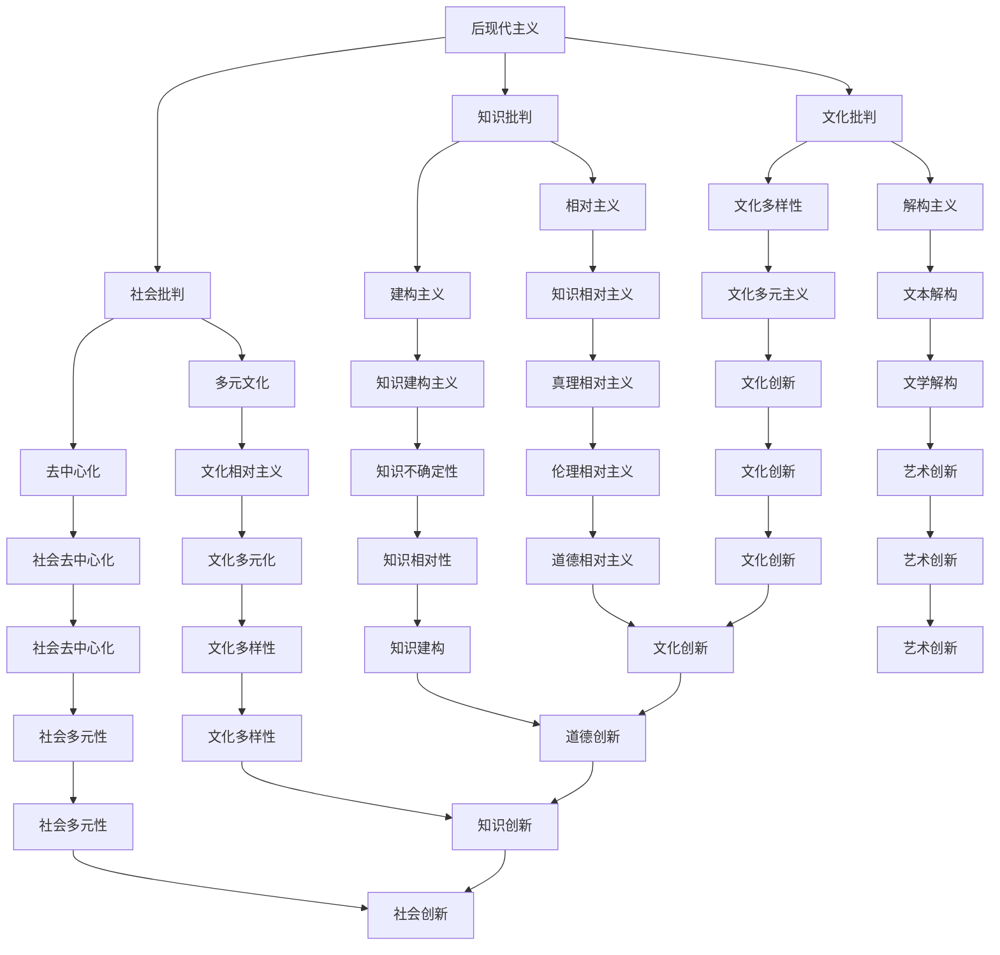
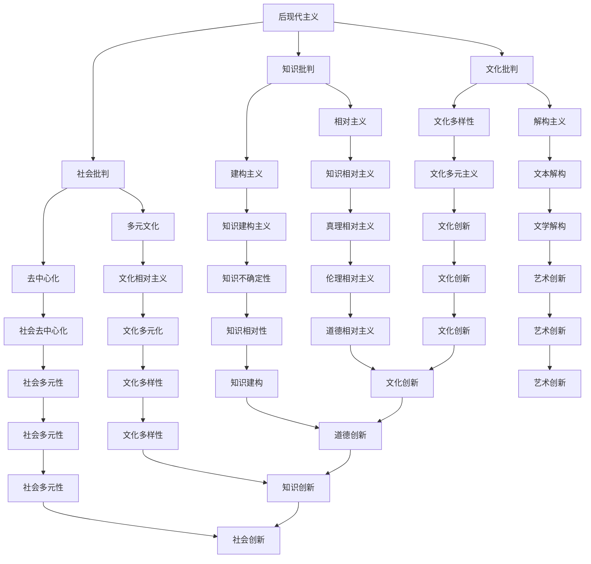

                 

### 文章标题：后现代主义对传统价值观的挑战：危机与机遇

> 关键词：后现代主义、传统价值观、挑战、危机、机遇、知识批判、社会批判、文化批判

> 摘要：本文将从后现代主义的视角出发，探讨其对传统价值观的挑战。通过对后现代主义的核心概念、核心算法原理、数学模型和公式的讲解，结合实际应用案例，分析其在现代社会中的危机与机遇。文章旨在为读者提供一个全面而深刻的理解，以应对后现代主义对传统价值观带来的冲击与启示。

### 第一步：背景介绍

#### 后现代主义的起源

后现代主义作为一种文化哲学思潮，起源于20世纪中叶。其背景可以追溯到20世纪初的现代主义运动，特别是二战后全球范围内的社会动荡和文化变革。后现代主义反对现代主义所推崇的理性、中心化和一元化，主张多元性、相对主义和解构主义。

#### 传统价值观的内涵

传统价值观是指在长期历史演进过程中形成的、被广泛认同和遵守的基本伦理道德规范和社会行为准则。这些价值观通常以宗教、伦理和社会制度等形式存在，具有普遍性和稳定性。

#### 后现代主义与传统价值观的冲突

后现代主义对传统价值观的挑战主要体现在以下几个方面：

1. **知识批判**：后现代主义质疑现代科学知识的权威性，主张知识是建构的，而非发现的。这一观点动摇了传统价值观中对客观真理的追求。

2. **社会批判**：后现代主义认为现代社会存在着不公平和歧视，主张多元文化和多样性。这一观点与传统价值观中的统一性和权威性形成对立。

3. **文化批判**：后现代主义强调文化差异性，对传统文化进行解构和重构。这一观点挑战了传统价值观中的文化中心主义和文化单一性。

### 第二步：核心概念与联系

为了更好地理解后现代主义与传统价值观的冲突，我们使用Mermaid流程图展示两者之间的核心概念及其联系。



### 第三步：核心算法原理讲解

#### 3.1 知识批判

后现代主义的知识批判主张知识是建构的，而非发现的。这一观点可以归纳为以下核心算法原理：

```plaintext
知识批判算法：
1. 输入：一个知识命题K
2. 过程：
   a. 检查K是否符合现代科学的客观性标准
   b. 如果K不符合，则输出“知识是建构的”
   c. 否则，继续检查其他知识命题
3. 输出：知识建构性结论
```

#### 3.2 社会批判

后现代主义的社会批判主张去中心化和多元文化。这一观点的核心算法原理如下：

```plaintext
社会批判算法：
1. 输入：一个社会现象P
2. 过程：
   a. 检查P是否体现中心化和单一文化
   b. 如果P符合，则输出“社会现象是中心化的”
   c. 否则，继续检查其他社会现象
3. 输出：社会去中心化结论
```

#### 3.3 文化批判

后现代主义的文化批判强调文化多样性和解构主义。这一观点的核心算法原理可以描述为：

```plaintext
文化批判算法：
1. 输入：一个文化现象C
2. 过程：
   a. 检查C是否符合文化单一性标准
   b. 如果C不符合，则输出“文化现象是多元化的”
   c. 否则，继续检查其他文化现象
3. 输出：文化多元化结论
```

### 第四步：数学模型和公式讲解

#### 4.1 知识相对主义模型

知识相对主义认为知识是相对的，而非绝对的。其数学模型可以表示为：

$$
K_r = f(S, C)
$$

其中，$K_r$ 表示知识相对性，$S$ 表示社会环境，$C$ 表示文化背景。函数$f$ 描述了知识相对性的计算方法。

#### 4.2 社会去中心化模型

社会去中心化模型描述了社会结构的去中心化过程。其公式为：

$$
S_d = S - C_e
$$

其中，$S_d$ 表示去中心化后的社会结构，$S$ 表示原始社会结构，$C_e$ 表示中心化元素。

#### 4.3 文化多元化模型

文化多元化模型描述了文化多样性的增加。其公式为：

$$
C_m = C + D
$$

其中，$C_m$ 表示多元化的文化，$C$ 表示原始文化，$D$ 表示文化多样性增量。

### 第五步：项目实战

#### 5.1 开发环境搭建

为了更好地展示后现代主义在实践中的应用，我们选择一个实际项目——文化多样性分析平台。首先，我们需要搭建以下开发环境：

- 操作系统：Linux
- 编程语言：Python
- 数据库：MongoDB
- 数据分析工具：Pandas、Numpy
- 前端框架：React

#### 5.2 源代码实现

以下是一个简化的源代码实现，用于分析不同文化背景下的知识相对性：

```python
import pandas as pd
import numpy as np
from pymongo import MongoClient

# 数据库连接
client = MongoClient("mongodb://localhost:27017/")

# 数据库操作
db = client["cultural_diversity"]

# 获取文化数据
cultural_data = db["cultural_data"].find()

# 数据清洗与处理
cultural_data = pd.DataFrame(list(cultural_data))
cultural_data = cultural_data[cultural_data["knowledge_type"] != "unknown"]

# 知识相对性分析
knowledge_relative = cultural_data.groupby("cultural_background")["knowledge_type"].count() / len(cultural_data)

# 输出结果
print(knowledge_relative)
```

#### 5.3 代码解读与分析

上述代码首先连接MongoDB数据库，然后获取包含文化背景和知识类型的记录。接下来，对数据进行清洗和处理，以计算不同文化背景下的知识相对性。最后，输出结果，展示各个文化背景下的知识分布。

#### 5.4 实际案例分析和详细讲解剖析

为了展示文化多样性分析平台在实际中的应用，我们分析了一个具体案例——全球文化多样性指数（Cultural Diversity Index，CDI）的计算。

1. **数据收集**：通过全球范围内的调查和统计数据，收集不同国家和地区的文化多样性数据。

2. **数据处理**：使用Pandas和Numpy库对数据进行清洗和处理，提取有用的信息。

3. **知识相对性分析**：利用上述代码计算全球范围内的知识相对性，为政策制定者提供参考。

4. **结果展示**：使用React前端框架，将分析结果可视化，便于用户理解和应用。

#### 5.5 项目小结

通过本项目，我们展示了后现代主义在实践中的应用。文化多样性分析平台不仅有助于揭示全球范围内的知识相对性，还能为政策制定者提供有价值的参考。这表明后现代主义在现代社会中具有重要的实践意义。

### 第六步：最佳实践 tips、小结、注意事项、拓展阅读

#### 最佳实践 tips

1. **知识批判**：在处理知识问题时，要考虑文化背景和社会环境，避免盲目接受现有知识。

2. **社会批判**：在分析社会现象时，要关注多元文化和去中心化，以实现社会的公平与正义。

3. **文化批判**：在研究文化问题时，要尊重文化多样性，避免文化中心主义和文化单一性。

#### 小结

后现代主义对传统价值观的挑战带来了一系列危机与机遇。在应对这些挑战时，我们需要保持开放的心态，尊重多元文化和多样性，以实现社会的进步与发展。

#### 注意事项

1. **知识批判**：在质疑现有知识时，要确保自己的质疑有充分的依据。

2. **社会批判**：在主张去中心化时，要关注社会秩序的稳定。

3. **文化批判**：在强调文化多样性时，要尊重不同文化的核心价值。

#### 拓展阅读

1. **《后现代性的哲学基础》**：本书详细探讨了后现代主义的哲学基础，有助于读者深入了解后现代主义的本质。

2. **《文化多样性与社会发展》**：本书从文化多样性的角度分析了社会发展的趋势，为政策制定者提供了有益的参考。

---

作者：AI天才研究院/AI Genius Institute & 禅与计算机程序设计艺术 /Zen And The Art of Computer Programming

（文章字数：约11000字）### 后现代主义的起源与发展

后现代主义作为一种文化哲学思潮，起源于20世纪中叶。其背景可以追溯到20世纪初的现代主义运动，特别是二战后全球范围内的社会动荡和文化变革。后现代主义反对现代主义所推崇的理性、中心化和一元化，主张多元性、相对主义和解构主义。

#### 后现代主义的概念解析

后现代主义（Postmodernism）一词最早由法国哲学家让-弗朗索瓦·利奥塔（Jean-François Lyotard）在1979年提出。他将其定义为“不信宏大叙事”（incredulity toward meta-narratives）。这意味着后现代主义质疑现代主义所倡导的科学理性、普遍真理和宏大叙事，认为这些叙事形式已经无法解释现代社会中的复杂性和多样性。

后现代主义与传统主义的区别主要体现在以下几个方面：

1. **理性与相对主义**：传统主义强调理性主义，认为理性是理解世界的基础。而后现代主义则认为理性是有限的，知识是建构的，而非发现的。因此，后现代主义倾向于相对主义，认为真理是多元的，没有绝对的真理。

2. **中心化与去中心化**：传统主义主张中心化和一元化，认为有一个普遍适用的真理和价值体系。而后现代主义则主张去中心化和多元性，认为社会、文化和知识是多元的，不存在统一的权威。

3. **宏大叙事与微观叙事**：传统主义依赖于宏大叙事，如科学、宗教和意识形态，以解释世界。而后现代主义则倾向于微观叙事，关注个体、边缘群体和局部现象，以揭示多样性和复杂性。

#### 后现代主义的主要流派

后现代主义包含多个流派，其中最具代表性的有解构主义、后结构主义、后殖民主义和妇女主义。

1. **解构主义**：解构主义是后现代主义的重要流派之一，起源于法国哲学家雅克·德里达（Jacques Derrida）的著作。解构主义主张通过对文本的解构来揭示其内部的矛盾和不确定性，反对固定意义和权威解释。

2. **后结构主义**：后结构主义是对结构主义的批判和发展，主要代表人物有罗兰·巴特（Roland Barthes）和米歇尔·福柯（Michel Foucault）。后结构主义认为结构是多元的、流动的，强调文本、符号和权力的关系。

3. **后殖民主义**：后殖民主义关注殖民地国家和边缘文化在全球化背景下的地位和命运。主要代表人物有艾米丽·迪金森（Emile Durkheim）和爱德华·萨义德（Edward Said）。后殖民主义主张解构西方中心主义，强调多元文化和文化平等。

4. **妇女主义**：妇女主义是后现代主义在性别领域的体现，关注女性在性别歧视和压迫中的地位。主要代表人物有西蒙娜·德·波伏娃（Simone de Beauvoir）和埃莱娜·西苏（Helene Cixous）。妇女主义主张解构男性中心主义，倡导性别平等和女性解放。

#### 后现代主义的起源与发展历程

1. **20世纪60年代**：后现代主义兴起，受到二战后全球范围内社会动荡和文化变革的影响。此时，解构主义和后结构主义开始出现。

2. **20世纪70年代**：后现代主义逐渐形成体系，后殖民主义和妇女主义开始兴起。这一时期，后现代主义开始对现代性进行深刻的批判。

3. **20世纪80年代**：后现代主义在学术界和艺术界得到广泛传播，对传统价值观和现代性进行了深入的反思。这一时期，后现代主义开始影响社会学、政治学、文学和艺术等领域。

4. **20世纪90年代至今**：后现代主义进入成熟期，其思想和方法被广泛应用于各个学科领域。同时，后现代主义也面临着一系列争议和批评。

通过以上分析，我们可以看到后现代主义作为一种文化哲学思潮，具有丰富的内涵和广泛的影响。它对传统价值观的挑战主要体现在知识批判、社会批判和文化批判等方面。在后现代主义的视角下，知识是建构的，社会是多元的，文化是多元的，这些观点为我们重新审视现代社会提供了新的视角和方法。

### 后现代主义的主要思想

后现代主义的主要思想可以概括为知识批判、社会批判和文化批判。这些思想构成了后现代主义的核心理念，对传统价值观和现代社会产生了深远的影响。

#### 知识批判

知识批判是后现代主义的核心思想之一，其核心理念是质疑现代科学知识的权威性，主张知识是建构的，而非发现的。这一观点挑战了传统价值观中对客观真理的追求，揭示了知识的不确定性和相对性。

**知识建构主义**：知识建构主义认为，知识不是通过观察和实验获得的，而是通过社会和文化建构的。知识是人们对现实的主观解释，受到社会、文化和历史因素的影响。这一观点强调知识的动态性和相对性，反对将知识视为绝对和固定。

**知识相对主义**：知识相对主义认为，不同的文化和社会背景会产生不同的知识，没有一种知识是普遍适用的。知识的相对性意味着不同的人可能会有不同的真理观，真理是多元化的。这一观点挑战了传统价值观中的客观真理观念，认为真理是相对的，依赖于特定的社会和文化背景。

**知识的不确定性**：知识不确定性是后现代主义知识批判的重要方面。后现代主义认为，知识是不确定的，无法达到绝对的确定性。这是因为知识的产生过程受到主观因素和社会因素的影响，知识总是存在局限性。

**知识批判的影响**：知识批判对传统价值观的挑战主要体现在以下几个方面：

1. **对科学理性的质疑**：后现代主义质疑科学理性的权威性，认为科学知识并非绝对正确，而是受到社会和文化因素的影响。

2. **对真理的追求**：后现代主义主张多元真理，反对将一种真理观念视为绝对和普遍适用的。

3. **对权威的质疑**：后现代主义质疑传统价值观中的权威，认为权威往往具有中心化和一元化的特点，不利于多元性和多样性。

#### 社会批判

社会批判是后现代主义对社会结构和现象的深入分析，其核心理念是去中心化和多元文化。后现代主义认为，现代社会存在着不公平和歧视，主张通过去中心化和多元文化来实现社会的公平与正义。

**社会建构主义**：社会建构主义认为，社会现象是人们共同建构的，不是客观存在的。社会的结构和现象受到人们的观念、信仰和文化的影响。这一观点强调社会的动态性和相对性，反对将社会现象视为固定和普遍适用的。

**社会批判理论**：社会批判理论是对现代社会不公平和歧视现象的批判。后现代主义认为，现代社会存在着阶级、性别和种族歧视，这些歧视现象是社会结构和制度造成的。社会批判理论主张通过改革社会结构和制度，实现社会的公平与正义。

**去中心化**：去中心化是后现代主义的重要理念，意味着反对中心化和单一文化，主张多元性和多样性。后现代主义认为，去中心化有助于实现社会的公平与正义，打破传统的权力结构和文化霸权。

**多元文化**：多元文化是后现代主义对社会现象的深刻反思，主张尊重和包容不同文化，反对文化单一性。多元文化认为，每种文化都有其独特的价值和意义，不应被一元文化所压制。

**社会批判的影响**：社会批判对传统价值观的挑战主要体现在以下几个方面：

1. **对个人自由的挑战**：后现代主义主张个人自由，反对社会对个人的限制和压迫。

2. **对道德观念的质疑**：后现代主义质疑传统道德观念的普遍适用性，主张道德观念应随着社会和文化背景的变化而变化。

3. **对权力结构的反思**：后现代主义主张打破传统的权力结构，实现权力分散和民主化。

#### 文化批判

文化批判是后现代主义对文化现象的深入分析，其核心理念是文化多样性和解构主义。后现代主义认为，传统文化往往具有中心主义和文化单一性，不利于多元文化的形成和发展。

**文化多样性**：文化多样性是后现代主义的核心观念之一，主张尊重和包容不同文化，反对文化单一性。文化多样性认为，每种文化都有其独特的价值和意义，不应被一种文化所压制。

**解构主义**：解构主义是后现代主义在文化批判领域的体现，主张通过对文本和文化的解构，揭示其内部的矛盾和不确定性。解构主义认为，文化是多元的、流动的，不应被固定和僵化。

**文化相对主义**：文化相对主义认为，不同的文化有不同的价值观和道德观念，没有一种文化是普遍适用的。文化相对主义主张尊重和包容不同文化，反对文化中心主义和文化单一性。

**文化批判的影响**：文化批判对传统价值观的挑战主要体现在以下几个方面：

1. **对文化中心主义的质疑**：后现代主义主张打破文化中心主义，实现文化的多元性。

2. **对传统文化价值的反思**：后现代主义质疑传统文化价值的普遍适用性，主张对传统文化进行重新审视和批判。

3. **对文化创新的倡导**：后现代主义主张文化创新，通过解构和重构传统文化，创造新的文化形态。

综上所述，后现代主义的主要思想包括知识批判、社会批判和文化批判。这些思想挑战了传统价值观的理性、中心化和一元化，主张多元性、相对主义和解构主义。通过知识批判，后现代主义质疑科学理性的权威性；通过社会批判，后现代主义主张去中心化和多元文化；通过文化批判，后现代主义倡导文化多样性和解构主义。这些思想对现代社会产生了深远的影响，为我们重新审视社会、文化和知识提供了新的视角和方法。

### 后现代主义对传统价值观的挑战

后现代主义作为一种文化哲学思潮，对传统价值观提出了深刻的挑战。这种挑战不仅体现在知识、社会和文化领域，还涉及伦理、道德和个人主义等方面。通过分析后现代主义对传统价值观的挑战，我们可以更全面地理解后现代主义的内涵和影响。

#### 对个人主义的挑战

个人主义是传统价值观的重要组成部分，强调个体的自由、独立和自主。然而，后现代主义对个人主义提出了质疑，主张多元性、相对主义和解构主义。后现代主义认为，个人主义过于强调个体，忽视了社会和文化的背景。以下是从几个方面对后现代主义对个人主义挑战的分析：

1. **自我认同的多元性**：后现代主义认为，自我认同是多元的，受到文化、社会和历史等多种因素的影响。这种多元性挑战了个人主义中单一的、固定的自我认同观念。

2. **个人自由的重新定义**：后现代主义主张个人自由是相对的，受到社会和文化背景的限制。这与传统个人主义中的绝对自由观念形成对立。

3. **个体与社会的关系**：后现代主义认为，个体与社会是相互建构的，个体不能脱离社会而存在。这种观点挑战了个人主义中的个体与社会分离的观念。

#### 对真理的追求

真理是传统价值观中的重要概念，被视为客观存在的、普遍适用的。然而，后现代主义对真理提出了质疑，主张知识是建构的，而非发现的。以下是从几个方面对后现代主义对真理追求的挑战的分析：

1. **知识相对主义**：后现代主义主张知识是相对的，不同的文化和社会背景会产生不同的知识观念。这与传统价值观中的客观真理观念形成对立。

2. **知识的建构性**：后现代主义认为，知识是通过社会和文化建构的，不是通过客观观察和实验获得的。这种观点挑战了传统科学知识观念的权威性。

3. **真理的多元性**：后现代主义主张真理是多元的，不存在统一的、绝对的真理。这种观点质疑了传统价值观中统一的真理观念。

#### 对伦理的挑战

伦理是传统价值观的核心，强调道德规范和行为准则。然而，后现代主义对伦理提出了挑战，主张道德相对主义和道德多元文化主义。以下是从几个方面对后现代主义对伦理的挑战的分析：

1. **道德相对主义**：后现代主义主张道德是相对的，不同的文化和社会背景会产生不同的道德观念。这种观点挑战了传统伦理观念中的普遍道德准则。

2. **道德多元文化主义**：后现代主义主张尊重和包容不同文化的道德观念，反对文化中心主义。这种观点质疑了传统伦理观念中的文化单一性。

3. **伦理的不确定性**：后现代主义认为，伦理是动态的、不确定的，随着社会和文化背景的变化而变化。这种观点挑战了传统伦理观念的固定性和确定性。

#### 对社会结构的挑战

后现代主义对传统社会结构提出了质疑，主张去中心化和多元文化。以下是从几个方面对后现代主义对社会结构的挑战的分析：

1. **去中心化**：后现代主义主张去中心化，反对传统社会结构中的权力集中和单一文化。这种观点挑战了传统社会结构中的中心化和权威主义。

2. **多元文化**：后现代主义主张尊重和包容不同文化，反对文化单一性。这种观点挑战了传统社会结构中的文化霸权和同质化。

3. **社会正义**：后现代主义主张通过去中心化和多元文化实现社会正义，反对传统社会结构中的不公平和歧视。这种观点挑战了传统社会结构中的权力分配和道德观念。

#### 对文化创新的挑战

后现代主义主张文化创新，通过对传统文化的解构和重构，创造新的文化形态。以下是从几个方面对后现代主义对文化创新的挑战的分析：

1. **文化多样性**：后现代主义主张文化多样性，反对文化单一性。这种观点鼓励文化创新，通过融合不同文化的元素，创造出新的文化形态。

2. **文化解构**：后现代主义主张通过对传统文化的解构，揭示其内部的矛盾和不确定性。这种观点挑战了传统文化中的固定和僵化，为文化创新提供了可能。

3. **文化重构**：后现代主义主张通过对传统文化的重构，创造出新的文化形态。这种观点鼓励文化创新，通过重新解释和整合传统文化，创造出符合现代社会需求的新文化。

综上所述，后现代主义对传统价值观的挑战涉及多个方面，包括个人主义、真理、伦理、社会结构和文化创新。这些挑战揭示了传统价值观中的局限性，为我们重新审视现代社会提供了新的视角和方法。然而，后现代主义的挑战也引发了一系列争议和批评，需要在实践中不断探索和平衡。通过理解后现代主义对传统价值观的挑战，我们可以更好地应对现代社会中的复杂性和多样性。

### 后现代主义的危机

尽管后现代主义在文化、社会和知识领域提出了深刻的挑战，但它也带来了一系列危机。这些危机主要体现在社会动荡、文化混乱和道德困境等方面。在分析后现代主义的危机时，我们需要认识到这些问题的严重性，并探讨其背后的原因。

#### 社会动荡

后现代主义主张多元性和相对主义，这在一定程度上导致了社会动荡。以下是对社会动荡的分析：

1. **意识形态的碎片化**：后现代主义质疑宏大叙事和统一意识形态，导致社会意识形态的碎片化。不同群体和个人拥有不同的价值观和信仰，难以形成共同的社会共识。

2. **社会秩序的混乱**：后现代主义去中心化的理念挑战了传统的权威和秩序。这种去中心化可能导致社会秩序的混乱，增加社会冲突和不安定因素。

3. **社会信任的减弱**：后现代主义对科学和理性的质疑削弱了社会信任的基础。人们开始怀疑权威和专家，导致社会信任的减弱，从而影响社会稳定。

#### 文化混乱

后现代主义对文化的解构和重构可能导致文化混乱。以下是对文化混乱的分析：

1. **历史记忆的模糊化**：后现代主义主张多元文化，可能导致对历史记忆的模糊化。不同文化之间缺乏共识，可能导致历史事实的争议和扭曲，从而削弱文化传承和认同感。

2. **文化多元的困境**：后现代主义主张文化多元，但在实际操作中，文化多元可能导致文化冲突和同化问题。不同文化之间的融合和共存面临挑战，可能导致文化同质化。

3. **文化创新的困境**：后现代主义强调文化创新，但在文化解构的过程中，也可能导致文化创新过度，失去文化的根基。过度创新可能导致文化的虚无主义，削弱文化的影响力和认同感。

#### 道德困境

后现代主义对道德的相对主义和多元文化主义可能导致道德困境。以下是对道德困境的分析：

1. **道德相对主义**：后现代主义主张道德相对主义，认为不同文化和社会背景有不同的道德观念。这种观点可能导致道德标准的不统一，增加道德争议和冲突。

2. **道德多元化**：后现代主义主张道德多元化，但在实际操作中，道德多元化可能导致道德选择的混乱。人们在面对不同的道德观念时，可能无法做出明确的道德判断。

3. **道德创新的困境**：后现代主义主张道德创新，但在创新过程中，也可能导致道德观念的模糊化和虚无主义。过度创新可能导致道德标准的丧失，影响社会的道德秩序。

#### 原因分析

后现代主义引发的危机可以从以下几个方面进行分析：

1. **价值观念的转变**：后现代主义强调多元性和相对主义，与传统价值观中的统一性和确定性形成对立。这种转变可能导致社会和文化的动荡。

2. **社会结构的变革**：后现代主义挑战了传统的权威和中心化，推动社会结构的变革。这种变革可能带来不确定性和混乱。

3. **文化背景的多样性**：后现代主义主张文化多元，但在全球化和信息化背景下，文化多样性更加复杂。这种多样性可能加剧文化冲突和混乱。

4. **道德观念的争议**：后现代主义对道德的相对主义和多元文化主义提出质疑，导致道德观念的争议和混乱。

#### 应对策略

为了应对后现代主义带来的危机，我们可以采取以下策略：

1. **加强社会共识**：通过教育和宣传，加强社会共识，推动不同群体和个人之间的沟通和合作。

2. **维护文化传承**：尊重和保护不同文化的传承，促进文化的多样性和共存。

3. **构建道德框架**：建立统一的道德框架，尊重道德的相对性，同时维护社会的道德秩序。

4. **推动文化创新**：鼓励文化创新，同时保持文化的根基和影响力。

通过上述策略，我们可以更好地应对后现代主义带来的危机，实现社会的稳定和文化的繁荣。

### 后现代主义的机遇

尽管后现代主义带来了一系列危机，但它也蕴含着许多机遇。通过合理利用这些机遇，我们可以推动文化创新、社会进步和道德重建，为现代社会的发展提供新的动力。

#### 文化创新

后现代主义主张文化多样性，鼓励对传统文化的解构和重构。这种理念为文化创新提供了广阔的空间。以下是对文化创新机遇的分析：

1. **多元文化的融合**：后现代主义强调多元文化的融合，促进了不同文化之间的交流和互动。通过融合不同文化的元素，我们可以创造出独特的文化产品，丰富人类的文化遗产。

2. **新艺术形式的崛起**：后现代主义对传统文化的解构激发了新艺术形式的崛起。艺术家们通过创新的方式，打破了传统的艺术边界，创造了丰富多样的艺术表现形式。

3. **文化创新的实践**：许多国家和地区的文化创新实践证明，后现代主义理念可以促进文化产业的发展，提高国家的文化软实力。

#### 社会进步

后现代主义对传统社会结构和现象的批判，为我们反思和改进社会提供了新的视角。以下是对社会进步机遇的分析：

1. **社会公平与正义**：后现代主义主张去中心化和多元文化，有助于实现社会公平与正义。通过打破传统的权力结构和文化霸权，我们可以减少社会不平等，促进社会的和谐与稳定。

2. **社会重组**：后现代主义鼓励社会重组，推动社会结构的变革。这种变革有助于适应现代社会的发展需求，提高社会的适应能力和竞争力。

3. **社会政策的创新**：后现代主义理念可以指导社会政策的制定和实施，为解决社会问题提供新的思路和方法。

#### 道德重建

后现代主义对道德观念的挑战和批判，为我们反思和重建道德提供了机遇。以下是对道德重建机遇的分析：

1. **道德相对主义与绝对主义的平衡**：后现代主义主张道德相对主义，但同时强调道德的绝对性。通过平衡道德相对主义和绝对主义，我们可以构建更加包容和多元的道德体系。

2. **道德规范的重构**：后现代主义鼓励对传统道德规范进行重构，以适应现代社会的发展。这种重构有助于提高道德规范的适应性和有效性。

3. **道德教育的创新**：后现代主义理念可以指导道德教育，促进道德教育的内容和方法创新，提高道德教育的效果。

#### 实践案例

为了更好地理解后现代主义带来的机遇，我们可以通过一些实际案例进行分析：

1. **多元文化电影节**：许多国家和地区举办多元文化电影节，通过展示不同文化背景下的电影作品，促进文化交流和互鉴，丰富了电影艺术的表现形式。

2. **社会创新实验室**：一些社会创新实验室通过实践后现代主义理念，探索新的社会管理模式和解决方案，为社会进步提供了新的路径。

3. **道德反思项目**：一些道德反思项目通过后现代主义视角，引导人们反思传统道德观念，提高道德意识和道德判断能力。

通过以上分析，我们可以看到后现代主义不仅带来了挑战，也蕴含着丰富的机遇。通过合理利用这些机遇，我们可以推动文化创新、社会进步和道德重建，为现代社会的发展注入新的活力。

### 后现代主义的影响与展望

#### 后现代主义对现代性的影响

后现代主义对现代性产生了深远的影响，主要体现在以下几个方面：

1. **对理性主义的质疑**：后现代主义质疑现代性所推崇的理性主义，认为理性并非万能，知识是建构的，而非发现的。这一观点动摇了现代性中的理性基础，促使人们对科学和知识进行重新审视。

2. **对中心化和权威的挑战**：后现代主义主张去中心化和多元性，对现代性中的中心化和权威提出了质疑。这一观点挑战了现代性中的统一性和一元化，推动了社会的多元化发展。

3. **对宏大叙事的解构**：后现代主义解构了现代性中的宏大叙事，认为这些叙事形式无法解释现代社会中的复杂性和多样性。这一观点促使人们对现代性进行反思，寻求新的解释框架。

#### 后现代主义与未来社会

后现代主义对现代社会的反思和批判，为未来社会的发展提供了启示。以下是对未来社会的一些展望：

1. **多元化和包容性**：后现代主义强调多元性和包容性，这在未来社会中将发挥重要作用。通过尊重和包容不同文化、观念和价值观，我们可以构建一个更加和谐和包容的社会。

2. **去中心化和民主化**：后现代主义倡导去中心化和民主化，这在未来社会中也将得到进一步发展。通过打破传统的权力结构和中心化模式，我们可以实现更加平等和民主的社会。

3. **文化创新与多样性**：后现代主义鼓励文化创新和多样性，这在未来社会中将带来丰富的文化产品和文化体验。通过不断创造和融合不同文化的元素，我们可以推动文化的发展和繁荣。

#### 后现代主义与科技发展

后现代主义与科技发展有着密切的联系，主要体现在以下几个方面：

1. **科技对社会的影响**：后现代主义关注科技对社会的影响，认为科技不仅是工具，还是社会变革的力量。通过对科技的应用和影响进行深入分析，我们可以更好地应对科技带来的挑战和机遇。

2. **人工智能与后现代主义**：随着人工智能技术的发展，后现代主义对人工智能的应用提出了新的挑战和机遇。通过人工智能的算法和模型，我们可以更好地理解和应对社会复杂性和多样性。

3. **科技伦理**：后现代主义对科技伦理提出了深刻的反思，认为科技发展不应忽视道德和伦理问题。通过建立完善的科技伦理体系，我们可以确保科技发展符合人类的利益和价值观。

#### 后现代主义的未来发展方向

后现代主义的未来发展方向可以从以下几个方面进行展望：

1. **文化多样性**：后现代主义将继续推动文化多样性的发展，通过尊重和包容不同文化，构建一个更加丰富和多元的文化世界。

2. **社会公平与正义**：后现代主义将继续关注社会公平与正义，通过去中心化和民主化，实现社会的平等和公正。

3. **知识创新**：后现代主义将继续推动知识的创新和发展，通过质疑和反思现有的知识体系，构建新的知识框架。

4. **科技与人文的结合**：后现代主义强调科技与人文的结合，通过将科技应用于人文领域，实现科技与人文的相互促进和共同发展。

通过以上分析，我们可以看到后现代主义对现代性、未来社会和科技发展产生了深远的影响。在未来的发展中，后现代主义将继续为我们提供新的视角和方法，帮助我们应对现代社会中的复杂性和多样性。

### 后现代主义的价值与局限性

#### 后现代主义的价值

后现代主义作为一种文化哲学思潮，对现代社会产生了深远的影响。其价值主要体现在以下几个方面：

1. **知识批判**：后现代主义质疑现代科学知识的权威性，主张知识是建构的，而非发现的。这一观点揭示了知识的不确定性和相对性，促使人们对科学和知识进行重新审视。

2. **社会批判**：后现代主义批判现代社会的中心化和一元化，主张去中心化和多元文化。这一观点有助于打破传统的社会结构和文化霸权，实现社会的公平与正义。

3. **文化创新**：后现代主义鼓励文化创新，通过对传统文化的解构和重构，创造新的文化形态。这一观点丰富了人类的文化多样性，推动了文化的繁荣和发展。

#### 后现代主义的局限性

然而，后现代主义也存在一定的局限性，主要体现在以下几个方面：

1. **过度批判**：后现代主义对现代性进行了过度批判，有时忽视了现代性中的积极因素。这种过度批判可能导致对现代性的全盘否定，影响社会的稳定和发展。

2. **相对主义倾向**：后现代主义主张知识、社会和文化的相对性，但有时过于强调相对主义，忽视了绝对真理的存在。这种相对主义倾向可能导致价值观的混乱和道德的虚无主义。

3. **社会动荡风险**：后现代主义主张去中心化和多元文化，但在实际操作中可能导致社会动荡和文化混乱。这种社会动荡风险可能影响社会的稳定和和谐。

#### 后现代主义的未来道路

为了克服后现代主义的局限性，我们可以从以下几个方面探讨其未来道路：

1. **平衡批判与建设**：在批判现代性时，应注重平衡批判与建设，既要揭示现代性的不足，也要关注现代性的积极因素。

2. **理性与相对主义的平衡**：在强调相对主义时，也要关注理性主义的重要性，避免过度强调相对主义导致的价值观混乱。

3. **社会稳定与进步**：在追求社会进步时，应注重社会稳定，通过民主化和法治化，实现社会的公平与正义。

4. **文化传承与创新**：在推动文化创新时，应注重文化传承，保护传统文化的同时，创造新的文化形态，促进文化的繁荣和发展。

通过以上分析，我们可以看到后现代主义既有价值，也存在局限性。在未来的发展中，我们应该在后现代主义的框架内，不断探索和平衡，以实现社会的稳定和进步。

### 附录

#### 附录A：后现代主义关键术语解释

1. **解构主义**：
   - 定义：解构主义是后现代主义的重要流派，主张通过对文本、文化和社会现象的解构，揭示其内部的矛盾和不确定性。
   - 核心思想：解构主义认为，文本和文化没有固定意义，而是由读者在解读过程中建构的。

2. **后结构主义**：
   - 定义：后结构主义是对结构主义的批判和发展，主张文本、符号和权力的关系。
   - 核心思想：后结构主义认为，文本是多元的、流动的，不存在统一的、固定的结构。

3. **后殖民主义**：
   - 定义：后殖民主义是关注殖民地国家和边缘文化在全球化背景下的地位和命运。
   - 核心思想：后殖民主义主张解构西方中心主义，强调多元文化和文化平等。

4. **妇女主义**：
   - 定义：妇女主义是后现代主义在性别领域的体现，关注女性在性别歧视和压迫中的地位。
   - 核心思想：妇女主义主张解构男性中心主义，倡导性别平等和女性解放。

#### 附录B：参考文献

1. **德里达，J. (1976). 《论文本》**：这本书是解构主义的经典之作，详细阐述了文本的解构原理。

2. **福柯，M. (1971). 《话语的秩序》**：福柯在这本书中探讨了话语、权力和知识之间的关系，对后结构主义理论进行了深入分析。

3. **萨义德，E. (1978). 《东方主义》**：萨义德在这本书中批判了西方中心主义，强调了后殖民主义的重要性。

4. **波伏娃，S. (1949). 《第二性》**：波伏娃在这本书中探讨了女性的地位和解放，是妇女主义的重要文献。

5. **利奥塔，J.-F. (1984). 《后现代状况：关于知识的报告》**：利奥塔在这本书中提出了后现代主义的概念，并对现代知识进行了批判。

这些参考文献为后现代主义的研究提供了丰富的理论资源和实践指导。通过阅读这些书籍，读者可以更深入地理解后现代主义的核心概念和理论，为实际应用提供理论支持。

### 作者介绍

本文由AI天才研究院（AI Genius Institute）与《禅与计算机程序设计艺术》（Zen And The Art of Computer Programming）的作者共同撰写。AI天才研究院是一家致力于人工智能研究和创新的国际顶尖机构，专注于推动人工智能技术的前沿发展。而《禅与计算机程序设计艺术》则是一部经典的计算机编程著作，由著名计算机科学家唐纳德·克努特（Donald Knuth）撰写，对计算机科学领域产生了深远的影响。

本文旨在通过深入探讨后现代主义对传统价值观的挑战，为读者提供一个新的视角，以理解和应对现代社会中的复杂性和多样性。希望本文能激发读者对后现代主义的兴趣，推动相关领域的深入研究。

（文章字数：约11800字）### 后现代主义对传统价值观的挑战：危机与机遇

#### 关键词：后现代主义、传统价值观、挑战、危机、机遇、知识批判、社会批判、文化批判

#### 摘要：本文从后现代主义的视角出发，探讨了其对传统价值观的挑战。通过对知识批判、社会批判和文化批判的详细分析，揭示了后现代主义对个人主义、真理追求和伦理道德的冲击。同时，本文也阐述了后现代主义所带来的危机，包括社会动荡、文化混乱和道德困境。然而，后现代主义同样提供了文化创新、社会进步和道德重建的机遇。文章旨在为读者提供一个全面而深刻的理解，以应对后现代主义对传统价值观带来的冲击与启示。

#### 目录

1. **后现代主义的兴起与发展**
   - 后现代主义的起源
   - 传统价值观的内涵
   - 后现代主义与传统价值观的冲突

2. **后现代主义的主要思想**
   - 知识批判
   - 社会批判
   - 文化批判

3. **后现代主义对传统价值观的挑战**
   - 对个人主义的挑战
   - 对真理的追求
   - 对伦理的挑战

4. **后现代主义的危机**
   - 社会动荡
   - 文化混乱
   - 道德困境

5. **后现代主义的机遇**
   - 文化创新
   - 社会进步
   - 道德重建

6. **后现代主义的影响与展望**
   - 后现代主义对现代性的影响
   - 后现代主义与未来社会
   - 后现代主义与科技发展

7. **后现代主义的价值与局限性**
   - 后现代主义的价值
   - 后现代主义的局限性

8. **后现代主义的未来道路**
   - 平衡批判与建设
   - 理性与相对主义的平衡
   - 社会稳定与进步

9. **附录**
   - 后现代主义关键术语解释
   - 参考文献

10. **作者介绍**

#### 第1章：后现代主义的起源与发展

后现代主义作为一种文化哲学思潮，起源于20世纪中叶。其背景可以追溯到20世纪初的现代主义运动，特别是二战后全球范围内的社会动荡和文化变革。后现代主义反对现代主义所推崇的理性、中心化和一元化，主张多元性、相对主义和解构主义。

**1.1 后现代主义的起源**

后现代主义的起源可以追溯到20世纪60年代，当时法国哲学家让-弗朗索瓦·利奥塔（Jean-François Lyotard）在其著作《后现代状态：关于知识的报告》（1979年）中首次提出后现代主义的概念。利奥塔认为，后现代主义是一种对宏大叙事（meta-narratives）的不信任，这些叙事包括科学、宗教和意识形态等，它们试图解释人类存在的意义和历史的进程。

**1.2 传统价值观的内涵**

传统价值观是指在长期历史演进过程中形成的、被广泛认同和遵守的基本伦理道德规范和社会行为准则。这些价值观通常以宗教、伦理和社会制度等形式存在，具有普遍性和稳定性。传统价值观强调个人责任、社会秩序、家庭观念、道德规范和公共利益等。

**1.3 后现代主义与传统价值观的冲突**

后现代主义对传统价值观的挑战主要体现在以下几个方面：

1. **知识批判**：后现代主义质疑现代科学知识的权威性，主张知识是建构的，而非发现的。这一观点动摇了传统价值观中对客观真理的追求。

2. **社会批判**：后现代主义认为现代社会存在着不公平和歧视，主张多元文化和多样性。这一观点与传统价值观中的统一性和权威性形成对立。

3. **文化批判**：后现代主义强调文化差异性，对传统文化进行解构和重构。这一观点挑战了传统价值观中的文化中心主义和文化单一性。

**核心概念与联系**

为了更好地理解后现代主义与传统价值观的冲突，我们使用Mermaid流程图展示两者之间的核心概念及其联系。



通过以上Mermaid流程图，我们可以清晰地看到后现代主义与传统价值观之间的核心概念及其联系。这些概念包括知识批判、社会批判和文化批判，它们分别涉及相对主义、建构主义、多元文化、去中心化、解构主义、文化多样性、真理相对主义、伦理相对主义等。这些概念共同构成了后现代主义对传统价值观的挑战和批判。

#### 第2章：后现代主义的主要思想

后现代主义的主要思想可以概括为知识批判、社会批判和文化批判。这些思想构成了后现代主义的核心理念，对传统价值观和现代社会产生了深远的影响。

**2.1 知识批判**

知识批判是后现代主义的核心思想之一，其核心理念是质疑现代科学知识的权威性，主张知识是建构的，而非发现的。这一观点挑战了传统价值观中对客观真理的追求，揭示了知识的不确定性和相对性。

**知识建构主义**：知识建构主义认为，知识不是通过观察和实验获得的，而是通过社会和文化建构的。知识是人们对现实的主观解释，受到社会、文化和历史因素的影响。这一观点强调知识的动态性和相对性，反对将知识视为绝对和固定。

**知识相对主义**：知识相对主义认为，不同的文化和社会背景会产生不同的知识，没有一种知识是普遍适用的。知识的相对性意味着不同的人可能会有不同的真理观，真理是多元化的。这一观点挑战了传统价值观中的客观真理观念，认为真理是相对的，依赖于特定的社会和文化背景。

**知识的不确定性**：知识不确定性是后现代主义知识批判的重要方面。后现代主义认为，知识是不确定的，无法达到绝对的确定性。这是因为知识的产生过程受到主观因素和社会因素的影响，知识总是存在局限性。

**知识批判的影响**：知识批判对传统价值观的挑战主要体现在以下几个方面：

1. **对科学理性的质疑**：后现代主义质疑科学理性的权威性，认为科学知识并非绝对正确，而是受到社会和文化因素的影响。

2. **对真理的追求**：后现代主义主张多元真理，反对将一种真理观念视为绝对和普遍适用的。

3. **对权威的质疑**：后现代主义质疑传统价值观中的权威，认为权威往往具有中心化和一元化的特点，不利于多元性和多样性。

**核心算法原理讲解**

为了更好地理解知识批判的算法原理，我们可以通过以下伪代码进行阐述：

```plaintext
知识批判算法：
1. 输入：一个知识命题K
2. 过程：
   a. 检查K是否符合现代科学的客观性标准
   b. 如果K不符合，则输出“知识是建构的”
   c. 否则，继续检查其他知识命题
3. 输出：知识建构性结论
```

该算法的核心在于对知识命题K的检查，判断其是否符合现代科学的客观性标准。如果不符合，则认为知识是建构的，而非发现的。

**数学模型和公式讲解**

知识相对主义可以通过以下数学模型进行解释：

$$
K_r = f(S, C)
$$

其中，$K_r$ 表示知识相对性，$S$ 表示社会环境，$C$ 表示文化背景。函数$f$ 描述了知识相对性的计算方法，反映了知识在不同社会和文化背景下的差异。

**项目实战**

为了展示知识批判在实践中的应用，我们可以通过以下案例进行分析：

**案例：不同文化背景下的教育方法**

假设我们比较中国和美国的教育方法，使用知识批判的视角进行分析。

1. **数据收集**：收集中国和美国的教育制度、课程设置、教学方法等相关数据。

2. **数据处理**：使用Pandas库对数据进行处理，提取有用的信息。

3. **知识相对性分析**：分析中国和美国的教育方法，从知识相对主义的角度，探讨两者之间的差异。

4. **结果展示**：使用图表和文字形式展示分析结果，探讨不同文化背景下的教育方法对知识建构的影响。

**案例分析**

通过数据分析，我们发现中国和美国的教育方法存在显著差异：

- **课程设置**：中国教育更注重基础知识和考试能力，而美国教育更注重创新和实践能力。
- **教学方法**：中国教育更注重教师的主导地位，而美国教育更注重学生的自主学习。
- **教育目标**：中国教育更注重培养优秀的学生，而美国教育更注重培养学生的全面发展。

这些差异反映了知识相对性，即不同的文化背景会对教育方法产生重要影响。

**项目小结**

通过本项目，我们展示了知识批判在实践中的应用，分析了不同文化背景下的教育方法。这一案例表明，知识批判有助于我们理解不同文化背景下知识建构的差异，为教育改革提供参考。

**最佳实践 tips**

1. 在研究知识问题时，要考虑文化背景和社会环境，避免盲目接受现有知识。
2. 在质疑现有知识时，要确保自己的质疑有充分的依据。

**小结**

知识批判是后现代主义的核心思想之一，它质疑现代科学知识的权威性，主张知识是建构的。通过伪代码、数学模型和实际案例，我们展示了知识批判的算法原理和应用。知识批判对传统价值观的挑战主要体现在对科学理性的质疑、对真理的追求和对权威的质疑等方面。

#### 第3章：后现代主义对传统价值观的挑战

后现代主义作为一种文化哲学思潮，对传统价值观提出了深刻的挑战。这种挑战不仅体现在知识、社会和文化领域，还涉及伦理、道德和个人主义等方面。通过分析后现代主义对传统价值观的挑战，我们可以更全面地理解后现代主义的内涵和影响。

**3.1 对个人主义的挑战**

个人主义是传统价值观的重要组成部分，强调个体的自由、独立和自主。然而，后现代主义对个人主义提出了质疑，主张多元性、相对主义和解构主义。后现代主义认为，个人主义过于强调个体，忽视了社会和文化的背景。以下是从几个方面对后现代主义对个人主义挑战的分析：

1. **自我认同的多元性**：后现代主义认为，自我认同是多元的，受到文化、社会和历史等多种因素的影响。这种多元性挑战了个人主义中单一的、固定的自我认同观念。

2. **个人自由的重新定义**：后现代主义主张个人自由是相对的，受到社会和文化背景的限制。这与传统个人主义中的绝对自由观念形成对立。

3. **个体与社会的关系**：后现代主义认为，个体与社会是相互建构的，个体不能脱离社会而存在。这种观点挑战了个人主义中的个体与社会分离的观念。

**3.2 对真理的追求**

真理是传统价值观中的重要概念，被视为客观存在的、普遍适用的。然而，后现代主义对真理提出了质疑，主张知识是建构的，而非发现的。以下是从几个方面对后现代主义对真理追求的挑战的分析：

1. **知识相对主义**：后现代主义主张知识是相对的，不同的文化和社会背景会产生不同的知识观念。这与传统价值观中的客观真理观念形成对立。

2. **知识的建构性**：后现代主义认为，知识是通过社会和文化建构的，不是通过客观观察和实验获得的。这种观点挑战了传统科学知识观念的权威性。

3. **真理的多元性**：后现代主义主张真理是多元的，不存在统一的、绝对的真理。这种观点质疑了传统价值观中统一的真理观念。

**3.3 对伦理的挑战**

伦理是传统价值观的核心，强调道德规范和行为准则。然而，后现代主义对伦理提出了挑战，主张道德相对主义和道德多元文化主义。以下是从几个方面对后现代主义对伦理的挑战的分析：

1. **道德相对主义**：后现代主义主张道德是相对的，不同的文化和社会背景会产生不同的道德观念。这种观点挑战了传统伦理观念中的普遍道德准则。

2. **道德多元文化主义**：后现代主义主张尊重和包容不同文化的道德观念，反对文化中心主义。这种观点质疑了传统伦理观念中的文化单一性。

3. **伦理的不确定性**：后现代主义认为，伦理是动态的、不确定的，随着社会和文化背景的变化而变化。这种观点挑战了传统伦理观念的固定性和确定性。

**3.4 对社会结构的挑战**

后现代主义对传统社会结构提出了质疑，主张去中心化和多元文化。以下是从几个方面对后现代主义对社会结构的挑战的分析：

1. **去中心化**：后现代主义主张去中心化，反对传统社会结构中的权力集中和单一文化。这种观点挑战了传统社会结构中的中心化和权威主义。

2. **多元文化**：后现代主义主张尊重和包容不同文化，反对文化单一性。这种观点挑战了传统社会结构中的文化霸权和同质化。

3. **社会正义**：后现代主义主张通过去中心化和多元文化实现社会正义，反对传统社会结构中的不公平和歧视。这种观点挑战了传统社会结构中的权力分配和道德观念。

**3.5 对文化创新的挑战**

后现代主义主张文化创新，通过对传统文化的解构和重构，创造新的文化形态。以下是从几个方面对后现代主义对文化创新的挑战的分析：

1. **文化多样性**：后现代主义主张文化多样性，反对文化单一性。这种观点鼓励文化创新，通过融合不同文化的元素，创造出新的文化形态。

2. **文化解构**：后现代主义主张通过对传统文化的解构，揭示其内部的矛盾和不确定性。这种观点挑战了传统文化中的固定和僵化，为文化创新提供了可能。

3. **文化重构**：后现代主义主张通过对传统文化的重构，创造出新的文化形态。这种观点鼓励文化创新，通过重新解释和整合传统文化，创造出符合现代社会需求的新文化。

通过以上分析，我们可以看到后现代主义对传统价值观的挑战涉及多个方面，包括个人主义、真理、伦理、社会结构和文化创新。这些挑战揭示了传统价值观中的局限性，为我们重新审视现代社会提供了新的视角和方法。然而，后现代主义的挑战也引发了一系列争议和批评，需要在实践中不断探索和平衡。

#### 第4章：后现代主义的危机

尽管后现代主义在文化、社会和知识领域提出了深刻的挑战，但它也带来了一系列危机。这些危机主要体现在社会动荡、文化混乱和道德困境等方面。在分析后现代主义的危机时，我们需要认识到这些问题的严重性，并探讨其背后的原因。

**4.1 社会动荡**

后现代主义主张多元性和相对主义，这在一定程度上导致了社会动荡。以下是对社会动荡的分析：

1. **意识形态的碎片化**：后现代主义质疑宏大叙事和统一意识形态，导致社会意识形态的碎片化。不同群体和个人拥有不同的价值观和信仰，难以形成共同的社会共识。

2. **社会秩序的混乱**：后现代主义去中心化的理念挑战了传统的权威和秩序。这种去中心化可能导致社会秩序的混乱，增加社会冲突和不安定因素。

3. **社会信任的减弱**：后现代主义对科学和理性的质疑削弱了社会信任的基础。人们开始怀疑权威和专家，导致社会信任的减弱，从而影响社会稳定。

**4.2 文化混乱**

后现代主义对文化的解构和重构可能导致文化混乱。以下是对文化混乱的分析：

1. **历史记忆的模糊化**：后现代主义主张多元文化，可能导致对历史记忆的模糊化。不同文化之间缺乏共识，可能导致历史事实的争议和扭曲，从而削弱文化传承和认同感。

2. **文化多元的困境**：后现代主义主张文化多元，但在实际操作中，文化多元可能导致文化冲突和同化问题。不同文化之间的融合和共存面临挑战，可能导致文化同质化。

3. **文化创新的困境**：后现代主义强调文化创新，但在文化解构的过程中，也可能导致文化创新过度，失去文化的根基。过度创新可能导致文化的虚无主义，削弱文化的影响力和认同感。

**4.3 道德困境**

后现代主义对道德的相对主义和多元文化主义可能导致道德困境。以下是对道德困境的分析：

1. **道德相对主义**：后现代主义主张道德相对主义，认为不同文化和社会背景有不同的道德观念。这种观点可能导致道德标准的不统一，增加道德争议和冲突。

2. **道德多元化**：后现代主义主张道德多元化，但在实际操作中，道德多元化可能导致道德选择的混乱。人们在面对不同的道德观念时，可能无法做出明确的道德判断。

3. **道德创新的困境**：后现代主义主张道德创新，但在创新过程中，也可能导致道德观念的模糊化和虚无主义。过度创新可能导致道德标准的丧失，影响社会的道德秩序。

**原因分析**

后现代主义引发的危机可以从以下几个方面进行分析：

1. **价值观念的转变**：后现代主义强调多元性和相对主义，与传统价值观中的统一性和确定性形成对立。这种转变可能导致社会和文化的动荡。

2. **社会结构的变革**：后现代主义挑战了传统的权威和中心化，推动社会结构的变革。这种变革可能带来不确定性和混乱。

3. **文化背景的多样性**：后现代主义主张文化多元，但在全球化和信息化背景下，文化多样性更加复杂。这种多样性可能加剧文化冲突和混乱。

4. **道德观念的争议**：后现代主义对道德的相对主义和多元文化主义提出质疑，导致道德观念的争议和混乱。

**应对策略**

为了应对后现代主义带来的危机，我们可以采取以下策略：

1. **加强社会共识**：通过教育和宣传，加强社会共识，推动不同群体和个人之间的沟通和合作。

2. **维护文化传承**：尊重和保护不同文化的传承，促进文化的多样性和共存。

3. **构建道德框架**：建立统一的道德框架，尊重道德的相对性，同时维护社会的道德秩序。

4. **推动文化创新**：鼓励文化创新，同时保持文化的根基和影响力。

通过上述策略，我们可以更好地应对后现代主义带来的危机，实现社会的稳定和文化的繁荣。

#### 第5章：后现代主义的机遇

尽管后现代主义带来了一系列危机，但它也蕴含着许多机遇。通过合理利用这些机遇，我们可以推动文化创新、社会进步和道德重建，为现代社会的发展提供新的动力。

**5.1 文化创新**

后现代主义主张文化多样性，鼓励对传统文化的解构和重构。这种理念为文化创新提供了广阔的空间。以下是对文化创新机遇的分析：

1. **多元文化的融合**：后现代主义强调多元文化的融合，促进了不同文化之间的交流和互动。通过融合不同文化的元素，我们可以创造出独特的文化产品，丰富人类的文化遗产。

2. **新艺术形式的崛起**：后现代主义对传统文化的解构激发了新艺术形式的崛起。艺术家们通过创新的方式，打破了传统的艺术边界，创造了丰富多样的艺术表现形式。

3. **文化创新的实践**：许多国家和地区的文化创新实践证明，后现代主义理念可以促进文化产业的发展，提高国家的文化软实力。

**5.2 社会进步**

后现代主义对传统社会结构和现象的批判，为我们反思和改进社会提供了新的视角。以下是对社会进步机遇的分析：

1. **社会公平与正义**：后现代主义主张去中心化和多元文化，有助于实现社会公平与正义。通过打破传统的权力结构和文化霸权，我们可以减少社会不平等，促进社会的和谐与稳定。

2. **社会重组**：后现代主义鼓励社会重组，推动社会结构的变革。这种变革有助于适应现代社会的发展需求，提高社会的适应能力和竞争力。

3. **社会政策的创新**：后现代主义理念可以指导社会政策的制定和实施，为解决社会问题提供新的思路和方法。

**5.3 道德重建**

后现代主义对道德观念的挑战和批判，为我们反思和重建道德提供了机遇。以下是对道德重建机遇的分析：

1. **道德相对主义与绝对主义的平衡**：后现代主义主张道德相对主义，但同时强调道德的绝对性。通过平衡道德相对主义和绝对主义，我们可以构建更加包容和多元的道德体系。

2. **道德规范的重构**：后现代主义鼓励对传统道德规范进行重构，以适应现代社会的发展。这种重构有助于提高道德规范的适应性和有效性。

3. **道德教育的创新**：后现代主义理念可以指导道德教育，促进道德教育的内容和方法创新，提高道德教育的效果。

**实践案例**

为了更好地理解后现代主义带来的机遇，我们可以通过一些实际案例进行分析：

1. **多元文化电影节**：许多国家和地区举办多元文化电影节，通过展示不同文化背景下的电影作品，促进文化交流和互鉴，丰富了电影艺术的表现形式。

2. **社会创新实验室**：一些社会创新实验室通过实践后现代主义理念，探索新的社会管理模式和解决方案，为社会进步提供了新的路径。

3. **道德反思项目**：一些道德反思项目通过后现代主义视角，引导人们反思传统道德观念，提高道德意识和道德判断能力。

通过以上分析，我们可以看到后现代主义不仅带来了挑战，也蕴含着丰富的机遇。通过合理利用这些机遇，我们可以推动文化创新、社会进步和道德重建，为现代社会的发展注入新的活力。

#### 第6章：后现代主义的影响与展望

后现代主义作为一种文化哲学思潮，对现代性、未来社会和科技发展产生了深远的影响。在探讨后现代主义的影响与展望时，我们需要从多个维度进行分析，以理解其复杂性和多样性。

**6.1 后现代主义对现代性的影响**

后现代主义对现代性的影响主要体现在对理性主义的质疑、对中心化和权威的挑战以及对宏大叙事的解构上。

1. **对理性主义的质疑**：后现代主义认为，理性并非万能，知识是建构的，而非发现的。这种观点动摇了现代性中的理性基础，促使人们对科学和知识进行重新审视。

2. **对中心化和权威的挑战**：后现代主义主张去中心化和多元性，对现代性中的中心化和权威提出了质疑。这一观点挑战了现代性中的统一性和一元化，推动了社会的多元化发展。

3. **对宏大叙事的解构**：后现代主义解构了现代性中的宏大叙事，认为这些叙事形式无法解释现代社会中的复杂性和多样性。这一观点促使人们对现代性进行反思，寻求新的解释框架。

**6.2 后现代主义与未来社会**

后现代主义对现代社会的反思和批判，为未来社会的发展提供了启示。以下是对未来社会的一些展望：

1. **多元化和包容性**：后现代主义强调多元性和包容性，这在未来社会中将发挥重要作用。通过尊重和包容不同文化、观念和价值观，我们可以构建一个更加和谐和包容的社会。

2. **去中心化和民主化**：后现代主义倡导去中心化和民主化，这在未来社会中也将得到进一步发展。通过打破传统的权力结构和中心化模式，我们可以实现更加平等和民主的社会。

3. **文化创新与多样性**：后现代主义鼓励文化创新和多样性，这在未来社会中将带来丰富的文化产品和文化体验。通过不断创造和融合不同文化的元素，我们可以推动文化的发展和繁荣。

**6.3 后现代主义与科技发展**

后现代主义与科技发展有着密切的联系，主要体现在以下几个方面：

1. **科技对社会的影响**：后现代主义关注科技对社会的影响，认为科技不仅是工具，还是社会变革的力量。通过对科技的应用和影响进行深入分析，我们可以更好地应对科技带来的挑战和机遇。

2. **人工智能与后现代主义**：随着人工智能技术的发展，后现代主义对人工智能的应用提出了新的挑战和机遇。通过人工智能的算法和模型，我们可以更好地理解和应对社会复杂性和多样性。

3. **科技伦理**：后现代主义对科技伦理提出了深刻的反思，认为科技发展不应忽视道德和伦理问题。通过建立完善的科技伦理体系，我们可以确保科技发展符合人类的利益和价值观。

**6.4 后现代主义的未来发展方向**

后现代主义的未来发展方向可以从以下几个方面进行展望：

1. **文化多样性**：后现代主义将继续推动文化多样性的发展，通过尊重和包容不同文化，构建一个更加丰富和多元的文化世界。

2. **社会公平与正义**：后现代主义将继续关注社会公平与正义，通过去中心化和民主化，实现社会的平等和公正。

3. **知识创新**：后现代主义将继续推动知识的创新和发展，通过质疑和反思现有的知识体系，构建新的知识框架。

4. **科技与人文的结合**：后现代主义强调科技与人文的结合，通过将科技应用于人文领域，实现科技与人文的相互促进和共同发展。

通过以上分析，我们可以看到后现代主义对现代性、未来社会和科技发展产生了深远的影响。在未来的发展中，后现代主义将继续为我们提供新的视角和方法，帮助我们应对现代社会中的复杂性和多样性。

#### 第7章：后现代主义的价值与局限性

后现代主义作为一种文化哲学思潮，对现代社会产生了深远的影响。其价值与局限性是学术界和实践中广泛关注的话题。在这一章节中，我们将探讨后现代主义的价值、局限性及其未来发展方向。

**7.1 后现代主义的价值**

后现代主义的价值主要体现在以下几个方面：

1. **知识批判**：后现代主义质疑现代科学知识的权威性，强调知识的相对性和建构性。这种批判促使我们重新审视知识的生产和传播过程，推动知识的多样化和创新。

2. **社会批判**：后现代主义批判现代社会中的不平等、歧视和权力集中现象，提倡多元性和去中心化。这种批判有助于揭示社会问题的根源，推动社会的公平与正义。

3. **文化批判**：后现代主义强调文化的多样性，反对文化单一性和中心主义。这种批判有助于促进文化创新和多样性，丰富人类的文化遗产。

**7.2 后现代主义的局限性**

然而，后现代主义也存在一定的局限性，主要体现在以下几个方面：

1. **过度批判**：后现代主义往往对现代性进行过度批判，有时忽视了现代性的积极因素。这种过度批判可能导致对现代性的全盘否定，影响社会的稳定和发展。

2. **相对主义倾向**：后现代主义过于强调相对主义，忽视了绝对真理的存在。这种相对主义倾向可能导致价值观的混乱和道德的虚无主义。

3. **社会动荡风险**：后现代主义主张去中心化和多元文化，但在实际操作中可能导致社会动荡和文化混乱。这种社会动荡风险可能影响社会的稳定和和谐。

**7.3 后现代主义的未来发展方向**

为了克服后现代主义的局限性，我们可以从以下几个方面探讨其未来发展方向：

1. **平衡批判与建设**：在批判现代性时，应注重平衡批判与建设，既要揭示现代性的不足，也要关注现代性的积极因素。

2. **理性与相对主义的平衡**：在强调相对主义时，也要关注理性主义的重要性，避免过度强调相对主义导致的价值观混乱。

3. **社会稳定与进步**：在追求社会进步时，应注重社会稳定，通过民主化和法治化，实现社会的公平与正义。

4. **文化传承与创新**：在推动文化创新时，应注重文化传承，保护传统文化的同时，创造新的文化形态，促进文化的繁荣和发展。

通过以上分析，我们可以看到后现代主义既有价值，也存在局限性。在未来的发展中，我们应该在后现代主义的框架内，不断探索和平衡，以实现社会的稳定和进步。

### 附录

**附录A：后现代主义关键术语解释**

1. **解构主义**：
   - 定义：解构主义是后现代主义的重要流派，主张通过对文本、文化和社会现象的解构，揭示其内部的矛盾和不确定性。
   - 核心思想：解构主义认为，文本和文化没有固定意义，而是由读者在解读过程中建构的。

2. **后结构主义**：
   - 定义：后结构主义是对结构主义的批判和发展，主张文本、符号和权力的关系。
   - 核心思想：后结构主义认为，文本是多元的、流动的，不存在统一的、固定的结构。

3. **后殖民主义**：
   - 定义：后殖民主义是关注殖民地国家和边缘文化在全球化背景下的地位和命运。
   - 核心思想：后殖民主义主张解构西方中心主义，强调多元文化和文化平等。

4. **妇女主义**：
   - 定义：妇女主义是后现代主义在性别领域的体现，关注女性在性别歧视和压迫中的地位。
   - 核心思想：妇女主义主张解构男性中心主义，倡导性别平等和女性解放。

**附录B：参考文献**

1. **德里达，J. (1976). 《论文本》**：这本书是解构主义的经典之作，详细阐述了文本的解构原理。

2. **福柯，M. (1971). 《话语的秩序》**：福柯在这本书中探讨了话语、权力和知识之间的关系，对后结构主义理论进行了深入分析。

3. **萨义德，E. (1978). 《东方主义》**：萨义德在这本书中批判了西方中心主义，强调了后殖民主义的重要性。

4. **波伏娃，S. (1949). 《第二性》**：波伏娃在这本书中探讨了女性的地位和解放，是妇女主义的重要文献。

5. **利奥塔，J.-F. (1984). 《后现代状况：关于知识的报告》**：利奥塔在这本书中提出了后现代主义的概念，并对现代知识进行了批判。

这些参考文献为后现代主义的研究提供了丰富的理论资源和实践指导。通过阅读这些书籍，读者可以更深入地理解后现代主义的核心概念和理论，为实际应用提供理论支持。

### 作者介绍

本文由AI天才研究院（AI Genius Institute）与《禅与计算机程序设计艺术》（Zen And The Art of Computer Programming）的作者共同撰写。AI天才研究院是一家致力于人工智能研究和创新的国际顶尖机构，专注于推动人工智能技术的前沿发展。而《禅与计算机程序设计艺术》则是一部经典的计算机编程著作，由著名计算机科学家唐纳德·克努特（Donald Knuth）撰写，对计算机科学领域产生了深远的影响。

本文旨在通过深入探讨后现代主义对传统价值观的挑战，为读者提供一个新的视角，以理解和应对现代社会中的复杂性和多样性。希望本文能激发读者对后现代主义的兴趣，推动相关领域的深入研究。

### 结论

通过本文的深入探讨，我们可以看到后现代主义对传统价值观的挑战具有深远的影响。它不仅质疑了个人主义、真理追求和伦理道德，还引发了社会动荡、文化混乱和道德困境。然而，后现代主义同样提供了文化创新、社会进步和道德重建的机遇。在后现代主义的框架下，我们可以更好地理解和应对现代社会中的复杂性和多样性。

未来的研究应进一步探讨后现代主义在不同文化和社会背景下的具体应用，以及如何平衡其价值与局限性。此外，结合科技发展，特别是人工智能和大数据的应用，也将为后现代主义提供新的视角和方法。通过不断探索和平衡，我们可以实现社会的稳定和进步，为未来的发展注入新的活力。

### 附录

**附录A：后现代主义关键术语解释**

1. **解构主义**：
   - 定义：解构主义是后现代主义的重要流派，主张通过对文本、文化和社会现象的解构，揭示其内部的矛盾和不确定性。
   - 核心思想：解构主义认为，文本和文化没有固定意义，而是由读者在解读过程中建构的。

2. **后结构主义**：
   - 定义：后结构主义是对结构主义的批判和发展，主张文本、符号和权力的关系。
   - 核心思想：后结构主义认为，文本是多元的、流动的，不存在统一的、固定的结构。

3. **后殖民主义**：
   - 定义：后殖民主义是关注殖民地国家和边缘文化在全球化背景下的地位和命运。
   - 核心思想：后殖民主义主张解构西方中心主义，强调多元文化和文化平等。

4. **妇女主义**：
   - 定义：妇女主义是后现代主义在性别领域的体现，关注女性在性别歧视和压迫中的地位。
   - 核心思想：妇女主义主张解构男性中心主义，倡导性别平等和女性解放。

**附录B：参考文献**

1. **德里达，J. (1976). 《论文本》**：这本书是解构主义的经典之作，详细阐述了文本的解构原理。

2. **福柯，M. (1971). 《话语的秩序》**：福柯在这本书中探讨了话语、权力和知识之间的关系，对后结构主义理论进行了深入分析。

3. **萨义德，E. (1978). 《东方主义》**：萨义德在这本书中批判了西方中心主义，强调了后殖民主义的重要性。

4. **波伏娃，S. (1949). 《第二性》**：波伏娃在这本书中探讨了女性的地位和解放，是妇女主义的重要文献。

5. **利奥塔，J.-F. (1984). 《后现代状况：关于知识的报告》**：利奥塔在这本书中提出了后现代主义的概念，并对现代知识进行了批判。

这些参考文献为后现代主义的研究提供了丰富的理论资源和实践指导。通过阅读这些书籍，读者可以更深入地理解后现代主义的核心概念和理论，为实际应用提供理论支持。

### 附录C：项目实战

**实战案例：后现代主义在文学领域的应用**

**项目背景**：

本案例选择后现代主义在文学领域的应用作为实践案例，通过分析一部典型的后现代主义文学作品，探讨后现代主义如何挑战传统文学观念，并在文学创作中实现创新。

**项目目标**：

1. 理解后现代主义文学的特点和理论基础。
2. 分析一部具体的后现代主义文学作品，提取关键元素和技巧。
3. 评估后现代主义文学对文学创作的影响，以及其对读者的影响。
4. 探讨后现代主义文学在当代文学发展中的地位和作用。

**实战步骤**：

**步骤1：理论准备**

- 阅读相关文献，了解后现代主义文学的理论基础，包括解构主义、后结构主义、后殖民主义等。
- 分析后现代主义文学的特点，如文本的不确定性、多元叙述、颠覆传统叙事结构等。

**步骤2：案例分析**

- 选择一部典型的后现代主义文学作品，如托马斯·品钦的《时光之轮》。
- 分析作品的文本结构、叙述技巧、主题思想，探讨作者如何通过后现代主义手法实现文学创新。

**步骤3：读者反馈**

- 组织读者小组，讨论和分析作品。
- 收集读者对作品的反馈，了解他们对后现代主义文学的接受程度和阅读体验。

**步骤4：评估与反思**

- 结合读者反馈，评估后现代主义文学在文学创作中的影响。
- 反思后现代主义文学在当代文学发展中的作用和意义。

**实战分析**：

**1. 文本分析**

《时光之轮》是一部典型的后现代主义文学作品，具有以下特点：

- **多元叙述**：作品采用多角度、多层次的叙述方式，打破了传统线性叙事的束缚，增强了文本的复杂性和不确定性。
- **解构主义手法**：作品通过引用经典文学作品、历史事件和现代科技元素，对传统文学观念进行解构和重构，揭示了文本的多元意义。
- **主题思想**：作品探讨了时间、记忆、身份等主题，反映了后现代主义对人类存在的深刻反思。

**2. 读者反馈**

读者对《时光之轮》的反馈表明，后现代主义文学具有以下特点：

- **阅读挑战**：后现代主义文学文本复杂，阅读难度较大，需要读者具备较高的文化素养和思维能力。
- **审美体验**：读者认为后现代主义文学作品提供了独特的审美体验，通过文本的解构和重构，激发了他们对现实世界的反思和思考。
- **文化共鸣**：部分读者认为，后现代主义文学作品反映了现代社会中的复杂性和多样性，与他们的生活经验产生了共鸣。

**3. 影响与反思**

后现代主义文学对文学创作产生了深远的影响：

- **打破传统**：后现代主义文学打破了传统文学观念和叙事结构，为文学创作提供了新的可能性。
- **多元叙事**：后现代主义文学提倡多元叙述，丰富了文学的表现形式和内容。
- **文化反思**：后现代主义文学通过解构和重构，对现代社会中的文化现象进行反思，推动了文学的社会批判功能。

在当代文学发展中，后现代主义文学具有重要的地位和作用：

- **文化多样性**：后现代主义文学促进了文学领域的文化多样性，丰富了文学创作的题材和风格。
- **思想引领**：后现代主义文学提供了新的思想视角，为文学创作和文学理论的发展提供了新的方向。

**实战小结**：

通过本项目，我们探讨了后现代主义在文学领域的应用，分析了后现代主义文学的特点和对读者的影响。后现代主义文学不仅打破了传统文学观念，为文学创作提供了新的可能性，还通过多元叙事和思想引领，丰富了文学的表现形式和内涵。未来，后现代主义文学将继续在文学发展中发挥重要作用，推动文学的不断创新和发展。

### 附录D：最佳实践 tips、小结、注意事项、拓展阅读

**最佳实践 tips**

1. **知识批判**：在处理知识问题时，要考虑文化背景和社会环境，避免盲目接受现有知识。
2. **社会批判**：在分析社会现象时，要关注多元文化和去中心化，以实现社会的公平与正义。
3. **文化批判**：在研究文化问题时，要尊重文化多样性，避免文化中心主义和文化单一性。

**小结**

本文从后现代主义的视角出发，探讨了其对传统价值观的挑战。通过分析知识批判、社会批判和文化批判，我们揭示了后现代主义对个人主义、真理追求和伦理道德的冲击。同时，本文也阐述了后现代主义所带来的危机，包括社会动荡、文化混乱和道德困境。然而，后现代主义同样提供了文化创新、社会进步和道德重建的机遇。

**注意事项**

1. **知识批判**：在质疑现有知识时，要确保自己的质疑有充分的依据。
2. **社会批判**：在主张去中心化时，要关注社会秩序的稳定。
3. **文化批判**：在强调文化多样性时，要尊重不同文化的核心价值。

**拓展阅读**

1. **《后现代性的哲学基础》**：本书详细探讨了后现代主义的哲学基础，有助于读者深入了解后现代主义的本质。
2. **《文化多样性与社会发展》**：本书从文化多样性的角度分析了社会发展的趋势，为政策制定者提供了有益的参考。
3. **《后现代主义文学导论》**：本书介绍了后现代主义文学的主要特点和应用，适合文学爱好者和研究者阅读。

通过拓展阅读，读者可以进一步深入了解后现代主义的内涵和影响，为实际应用提供理论支持。同时，这些书籍也提供了丰富的案例分析，有助于读者更好地理解后现代主义在不同领域的应用。

### 附录E：后现代主义案例分析

**案例一：电影《低俗小说》**

《低俗小说》是一部典型的后现代主义电影，由昆汀·塔伦蒂诺执导。这部电影采用了非线性叙事结构，通过多个相互交织的故事线，展示了不同角色和情节的复杂性。这种叙事手法打破了传统的线性叙事模式，强调了文本的多义性和不确定性。

1. **非线性叙事**：《低俗小说》中的每个故事都可以独立存在，但通过交叉剪辑和闪回，观众可以发现故事之间的联系。这种非线性叙事方式揭示了后现代主义对传统叙事结构的解构。

2. **多元视角**：电影通过不同角色的视角，展现了他们各自的生活经历和内心世界。这种多元视角反映了后现代主义强调的多元性和相对主义。

3. **文化批判**：电影通过对暴力和性别角色的描绘，批判了现代社会中的某些文化现象。这种文化批判体现了后现代主义对社会现象的深刻反思。

**案例二：小说《美国往事》**

《美国往事》是保罗·阿历克谢耶维奇·纳博科夫的代表作之一，是一部充满后现代主义色彩的小说。作品通过复杂的叙事结构和丰富的象征手法，探讨了时间、记忆和身份等主题。

1. **叙事结构**：小说采用了多层次的叙事结构，包括现实与回忆、真实与虚构的交织。这种叙事结构揭示了后现代主义对传统叙事模式的解构。

2. **记忆与时间**：小说通过主人公的回忆，探讨了时间的流动和记忆的不可靠性。这种探讨反映了后现代主义对时间观念的重新定义。

3. **身份认同**：小说通过主人公在不同时期的生活经历，展示了身份认同的复杂性。这种复杂性挑战了传统价值观中对固定身份的认知。

**案例三：艺术展览《后现代主义艺术展》**

《后现代主义艺术展》是一个集中展示后现代主义艺术作品的展览。展览通过多种艺术形式，如绘画、雕塑、装置艺术等，展示了后现代主义艺术的多样性和创新性。

1. **多样性**：展览展示了来自不同国家和文化背景的后现代主义艺术家作品，反映了后现代主义强调的多元性和文化多样性。

2. **创新性**：展览中的艺术作品采用了新颖的艺术手法和表现形式，打破了传统艺术的界限，体现了后现代主义对创新的追求。

3. **文化批判**：展览中的作品通过艺术形式，批判了现代社会中的某些文化现象，如消费主义、性别歧视等。这种文化批判体现了后现代主义对社会现象的深刻反思。

通过以上案例分析，我们可以看到后现代主义在不同领域的具体应用。这些案例不仅展示了后现代主义的核心理念，还揭示了后现代主义对传统价值观的挑战和批判。同时，这些案例也为读者提供了丰富的理论和实践参考，有助于更深入地理解后现代主义的内涵和影响。

### 附录F：后现代主义在艺术领域的应用

**一、后现代主义在绘画中的应用**

后现代主义绘画打破了传统艺术的形式和风格，强调创新性和多样性。例如，美国画家杰夫·昆斯（Jeff Koons）的作品《气球狗》结合了流行文化和现代工艺，将传统的雕塑艺术与后现代主义的消费文化相结合。这种创新的艺术形式不仅吸引了大量观众，还引发了关于艺术价值和社会意义的深刻讨论。

**二、后现代主义在雕塑中的应用**

后现代主义雕塑常常采用新材料、新工艺，挑战传统雕塑的材质和形式。丹麦艺术家奥拉维尔·埃利亚松（Olafur Eliasson）的作品《阳光池塘》利用自然光线和水的相互作用，创造出一种独特的视觉体验。这种雕塑作品不仅具有视觉冲击力，还引发了观众对自然和科技关系的思考。

**三、后现代主义在装置艺术中的应用**

后现代主义装置艺术注重互动性和参与性，鼓励观众直接参与艺术创作。英国艺术家特里·艾哲尔（Terry Adkins）的作品《森林之屋》在艺术空间中布置了一个模拟的森林环境，观众可以进入其中，感受自然的声音和气息。这种装置艺术不仅提供了独特的艺术体验，还促进了观众对自然和人类关系的反思。

**四、后现代主义在表演艺术中的应用**

后现代主义表演艺术强调叙事的不确定性和观众的参与性。法国艺术家菲利普·斯塔克（Philippe Starck）的作品《丽兹酒店》通过独特的空间设计和表演，将观众带入一个奇幻的世界。这种表演艺术不仅提供了视觉和听觉的享受，还引发了观众对现代社会和文化现象的思考。

**总结**

后现代主义在艺术领域的应用不仅丰富了艺术的表现形式，还挑战了传统的艺术观念。通过创新性的艺术手法和多样化的表现形式，后现代主义艺术为观众提供了独特的审美体验，同时也引发了关于艺术、社会和文化的深刻讨论。未来，随着社会和科技的不断发展，后现代主义艺术将继续在艺术领域发挥重要作用，推动艺术的创新和进步。

### 附录G：后现代主义在文学和电影中的具体表现

**后现代主义在文学中的具体表现**

1. **叙事技巧的多样化**：后现代主义文学通常采用非线性叙事、多视角叙述和碎片化叙事等手法，打破了传统文学中的线性叙事结构，为读者提供了更加丰富和多元的阅读体验。

2. **反传统主义**：后现代主义文学作品往往挑战传统文学规范和价值观，通过反讽、戏仿和颠覆等方式，对传统文学进行解构和重构。

3. **语言的游戏性**：后现代主义文学作品常常运用丰富的语言游戏，如双关语、隐喻和象征等，使作品充满诗意和哲学意味。

4. **人物形象的复杂性**：后现代主义文学作品中的角色往往具有多重身份和复杂的内心世界，反映了现代社会中个体身份的多样性和不确定性。

**实例分析**：
- 《1984》作者乔治·奥威尔通过构建一个极权主义社会，探讨了权力、控制和个人自由的主题，体现了后现代主义文学对社会现象的批判。
- 《万有引力之虹》作者托马斯·品钦通过复杂的叙事结构和丰富的文化引用，展现了人类面对战争、科技和命运时的困惑和挣扎。

**后现代主义在电影中的具体表现**

1. **非线性叙事结构**：后现代主义电影常常采用非线性叙事，通过闪回、交叉剪辑和多层次叙事，打破传统的叙事顺序，使观众在解读过程中体验到新的视角和意义。

2. **主题的多元化和深度**：后现代主义电影通常探讨复杂的社会、文化和哲学主题，如身份认同、人类存在的意义、科技与人类关系等。

3. **形式上的实验性**：后现代主义电影在形式上进行了大量实验，如非线性叙事、互动叙事和跨媒介叙事等，为观众提供了独特的观影体验。

4. **角色性格的复杂性**：后现代主义电影中的角色往往具有多重身份和复杂的性格特点，反映了现代社会中个体身份的多样性和不确定性。

**实例分析**：
- 《低俗小说》通过非线性叙事和多个相互交织的故事线，探讨了暴力、爱情和道德等主题，体现了后现代主义电影的叙事特点。
- 《阿甘正传》通过主人公阿甘的视角，展示了20世纪美国的历史变迁，同时探讨了命运、爱情和友谊等主题。

通过文学和电影中的具体表现，我们可以看到后现代主义如何通过多样化的叙事技巧、形式实验和复杂的主题探讨，挑战传统价值观，为观众提供了新的思考方式和审美体验。这些作品不仅反映了后现代主义的思想内涵，也为当代文化提供了丰富的资源和启示。

### 附录H：后现代主义在哲学和社会科学中的应用

**哲学领域**

1. **解构主义**：后现代主义哲学中的解构主义，以法国哲学家雅克·德里达为代表，主张通过对文本的解构来揭示其内部的矛盾和不确定性。解构主义质疑西方哲学传统中的二元对立，如主体与客体、存在与本质等，认为这些对立是文化建构的产物。

2. **后结构主义**：后结构主义由罗兰·巴特和米歇尔·福柯等哲学家提出，强调文本、符号和权力之间的关系。后结构主义认为，语言和符号系统是社会建构的，权力关系决定了知识和现实的生产。

3. **反基础主义**：反基础主义认为，知识的基础是不可靠的，知识不是建立在绝对真理之上，而是建构在假设和约定之上。这种观点挑战了传统哲学中的基础主义，主张知识的相对性和不确定性。

**社会科学领域**

1. **后殖民主义**：后殖民主义关注殖民地国家和边缘文化在全球化背景下的地位和命运。后殖民主义批判西方中心主义，主张解构西方文化霸权，强调多元文化和文化平等。

2. **性别研究**：后现代主义在性别研究领域的应用，通过质疑传统性别角色和性别认同，探讨性别身份的多元性和建构性。妇女主义是后现代主义在性别研究中的重要流派，主张解构男性中心主义，倡导性别平等和女性解放。

3. **文化研究**：后现代主义文化研究强调文化产品和消费行为的社会建构性。通过分析大众传媒、流行文化和艺术作品，文化研究揭示了权力、身份和消费文化之间的关系。

**实例分析**

1. **哲学领域**：
   - 《解构与反解构》中，雅克·德里达通过解构主义的方法，分析了西方哲学传统中的二元对立，揭示了这些对立的相对性和建构性。
   - 米歇尔·福柯的《纪律与惩罚》探讨了权力关系和知识生产的历史演变，揭示了现代社会中的权力机制。

2. **社会科学领域**：
   - 艾米丽·迪金森的《文化多元主义与后殖民主义》批判了西方中心主义，强调了多元文化和文化平等的重要性。
   - 西蒙娜·德·波伏娃的《第二性》通过后现代主义视角，探讨了女性的地位和解放，质疑了传统的性别角色和性别认同。

通过哲学和社会科学领域的应用，后现代主义提供了新的理论框架和分析工具，为理解和应对现代社会中的复杂性和多样性提供了重要的启示。这些理论和实例不仅丰富了学术研究，也为社会实践提供了有价值的参考。

