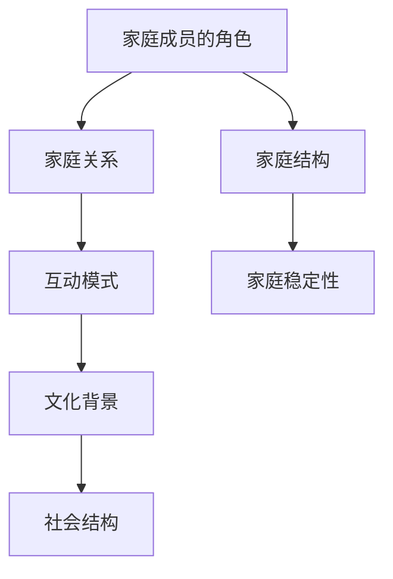

                 

### 引言与背景介绍

#### 后现代家庭动力学的概念

后现代家庭动力学（Postmodern Family Dynamics）是一种当代家庭研究领域的重要理论框架。它不仅仅关注家庭成员之间的相互关系，还涉及多元关系、家庭结构的复杂性以及家庭成员的个性、文化背景和社会环境等多方面因素。与传统家庭动力学相比，后现代家庭动力学更加注重家庭关系的动态变化和多样性，强调家庭成员的主观体验和创造性。

在现代社会，家庭结构正在经历深刻的变革。传统核心家庭模式逐渐被多元化的家庭形式所取代，如单亲家庭、再婚家庭、同性恋家庭以及跨文化家庭等。这种变化要求家庭动力学理论能够适应新的社会现实，提供更加灵活和全面的理解框架。后现代家庭动力学正是基于这种需求，通过对家庭关系的重新定义和解释，为理解现代家庭提供了新的视角和方法。

#### 后现代家庭动力学的重要性

后现代家庭动力学在现代家庭关系中的重要性不可忽视。首先，它能够帮助我们更好地理解家庭内部复杂的互动模式，包括家庭成员之间的情感联系、权力分配、角色扮演以及沟通方式等。其次，后现代家庭动力学提供了分析多元关系的工具，使我们能够探讨不同类型的家庭如何应对变化和挑战。此外，后现代家庭动力学还强调家庭成员的主观体验和个体差异，这有助于我们更加关注每个人的感受和需求，从而实现更加平等和和谐的家庭关系。

总之，后现代家庭动力学为家庭关系的研究提供了一个更加全面和深入的视角，它不仅关注家庭结构的多样性，还关注家庭关系的动态变化和个体体验。通过这一理论框架，我们可以更好地理解现代家庭的复杂性和多样性，为改善家庭关系提供有价值的指导和建议。

### 核心概念与联系

为了更好地理解后现代家庭动力学，我们需要明确其中的一些核心概念，并分析它们之间的相互关系。这些核心概念包括家庭成员的角色、家庭关系、互动模式、文化背景和社会结构等。以下是这些概念的定义及其相互关系：

#### 家庭成员的角色

家庭成员的角色是家庭动力学中的基础概念。每个家庭成员在家庭中扮演不同的角色，这些角色既包括正式的角色（如父母、子女、配偶等），也包括非正式的角色（如朋友、顾问等）。家庭成员的角色决定了他们在家庭中的行为模式、责任分工和互动方式。例如，父母角色通常涉及抚养、教育和保护子女，而子女角色则涉及学习、成长和承担家庭责任。角色之间的关系构成了家庭的基本结构。

#### 家庭关系

家庭关系是指家庭成员之间的情感联系、信任程度、沟通方式和共同目标等。家庭关系的好坏直接影响到家庭成员的幸福感和家庭稳定性。后现代家庭动力学认为，家庭关系是动态变化的，它们受到家庭内外各种因素的影响。例如，家庭成员的个性差异、文化背景和价值观的不同都可能对家庭关系产生影响。家庭关系不仅仅是情感上的纽带，还包括责任和义务的分配。

#### 互动模式

互动模式是指家庭成员之间的交流方式、互动频率和互动内容。互动模式反映了家庭成员之间的沟通水平、冲突处理方式和解决问题的能力。后现代家庭动力学强调，互动模式是家庭动态变化的重要驱动力。有效的互动模式能够增强家庭成员之间的情感联系，促进家庭稳定；而不良的互动模式则可能导致家庭冲突和矛盾。

#### 文化背景

文化背景是指家庭成员所处的文化环境、价值观、信仰和行为规范等。文化背景对家庭关系和互动模式有着深远的影响。例如，在一些文化中，家庭责任和义务被高度重视，家庭成员之间的互动以互助和支持为主；而在另一些文化中，个人主义和独立性受到更多强调，家庭成员之间的互动可能更加开放和自由。文化背景的差异可能导致家庭关系的多样性和复杂性。

#### 社会结构

社会结构是指社会中的组织形式、权力关系和资源分配方式等。社会结构对家庭关系和家庭成员的行为有着重要影响。例如，社会结构的变迁可能导致家庭角色的变化，如职业妇女的增多、家庭收入的增加等，这些都可能影响家庭关系和家庭互动模式。此外，社会结构中的权力关系和资源分配方式也可能影响家庭成员之间的权力平衡和家庭稳定。

#### 关系架构

为了更清晰地展示这些核心概念之间的相互关系，我们可以使用Mermaid流程图来表示：



在这个流程图中，家庭成员的角色是家庭结构的基础，家庭关系是家庭成员之间的情感纽带，互动模式反映了家庭成员之间的沟通水平，文化背景和社会结构则对家庭关系和互动模式产生深远影响。家庭结构最终决定了家庭的稳定性。

通过理解这些核心概念及其相互关系，我们可以更深入地探讨后现代家庭动力学中的复杂现象，为家庭关系的改善提供理论支持和实际指导。

### 家庭结构与多元关系

现代家庭结构的多样性是后现代家庭动力学研究的一个重要背景。随着社会的发展和观念的变革，传统核心家庭模式逐渐让位于多种不同的家庭形式，这些多元化结构对家庭动力学产生了深远的影响。

首先，单亲家庭是现代家庭结构中的一个重要组成部分。单亲家庭通常由一个母亲或父亲独自抚养子女，他们在经济、情感和教育责任上承担了全部的重担。单亲家庭的成员往往需要面对独特的挑战，如经济压力、情感孤独和抚养责任的重大压力。这些因素使得单亲家庭在家庭动力学中显得尤为重要。家庭动力学家们研究发现，单亲家庭的互动模式往往更加紧密，家庭成员之间的情感联系更为牢固，但同时也更容易出现情绪波动和冲突。

再婚家庭是另一种常见的现代家庭结构。再婚家庭由两个已经有过一段婚姻经历的人组成，他们可能带来了自己的孩子或其他亲属。再婚家庭中的家庭成员通常需要重新定义他们在家庭中的角色和关系，这可能导致复杂的家庭动力学现象。例如，继父母与继子女之间的关系可能需要时间和努力来建立信任和亲密感。此外，前配偶之间的互动也可能对再婚家庭的稳定性和动态产生影响。

同性恋家庭是现代家庭结构中的又一新形式。随着社会对LGBTQ+群体的接受度不断提高，同性恋家庭逐渐成为社会的一部分。同性恋家庭的成员在建立和维护家庭关系时面临着与传统家庭不同的挑战。例如，他们在法律和社会支持方面的权益可能不如传统家庭，这可能会影响他们的家庭稳定性和互动模式。然而，同性恋家庭通常更加注重沟通和合作，他们通过开放的交流和共同参与家庭事务来增强家庭凝聚力。

跨文化家庭是现代家庭结构中的另一个重要现象。随着全球化进程的加快，越来越多的人选择跨国结婚，形成了跨文化家庭。跨文化家庭在文化背景、价值观和生活方式上存在显著差异，这为家庭动力学研究提供了丰富的素材。跨文化家庭中的互动模式可能更加复杂，家庭成员需要通过不断的学习和适应来协调彼此的差异。有效的沟通和相互尊重成为跨文化家庭中维持和谐关系的关键。

总的来说，现代家庭结构的多样性对家庭动力学产生了深远的影响。单亲家庭、再婚家庭、同性恋家庭和跨文化家庭等不同类型的家庭结构，不仅改变了家庭关系的模式，也带来了新的挑战和机遇。后现代家庭动力学通过研究这些复杂的关系模式，为我们提供了理解和改善现代家庭关系的有力工具。通过深入探讨家庭结构的多样性及其对家庭动力学的影响，我们可以更好地应对现代家庭的复杂性和变化性，为建立更加健康和谐的家庭关系提供理论支持和实践指导。

### 后现代家庭动力学的理论框架

后现代家庭动力学作为家庭研究的一个重要理论框架，其核心观点和假设为我们提供了理解和分析现代家庭关系的深刻洞见。在这一部分，我们将详细探讨后现代家庭动力学的理论框架，包括其基本理论观点、关键假设及其在家庭关系研究中的重要性。

#### 基本理论观点

1. **多元关系的承认**：
   后现代家庭动力学认为，家庭关系不再局限于传统意义上的核心家庭结构，而是包含了更多的多元关系。这些多元关系包括但不限于继父母与继子女、同性伴侣及其子女、以及其他家庭成员或亲密关系的存在。承认这些多元关系的存在，有助于更全面地理解现代家庭的复杂性。

2. **个体差异的重要性**：
   后现代家庭动力学强调个体差异对家庭关系的影响。每个家庭成员都有其独特的个性、价值观、文化背景和生活经验，这些差异在家庭互动中发挥着重要作用。因此，家庭关系的研究需要考虑到每个个体的独特性，以更准确地分析家庭动态。

3. **动态变化的家庭结构**：
   后现代家庭动力学认为，家庭结构不是固定不变的，而是一个动态变化的过程。家庭成员之间的角色和关系会随着时间和情境的变化而调整。这种动态性要求我们在研究家庭关系时，不能仅停留在静态的结构分析上，还需要关注家庭关系的演变过程。

4. **家庭作为文化构建的场所**：
   后现代家庭动力学认为，家庭不仅是生活的场所，也是文化价值的构建和传播的场所。家庭中的互动和关系不仅反映了成员的个人特质，还体现了社会文化背景和价值观。因此，研究家庭动力学需要将家庭放在更广泛的社会文化背景下进行考察。

#### 关键假设

1. **家庭关系的复杂性**：
   后现代家庭动力学假设，家庭关系是复杂的、多维的，并且受到多种因素的影响。这些因素包括但不限于家庭成员的个性、情感需求、文化背景、社会环境等。因此，家庭关系的研究需要采用多维度、多视角的方法。

2. **家庭成员的主观体验**：
   后现代家庭动力学假设，家庭成员的主观体验在家庭关系中起着核心作用。家庭成员的感受、想法和期望会影响他们的行为模式和家庭互动。因此，研究家庭动力学需要重视家庭成员的主观体验，并将其作为分析的重要依据。

3. **家庭互动的动态性**：
   后现代家庭动力学假设，家庭互动是动态变化的，而不是静态的。家庭成员之间的互动模式会随着时间和情境的变化而变化。这种动态性要求我们在研究家庭关系时，要关注家庭互动的演变过程和变化趋势。

#### 在家庭关系研究中的重要性

后现代家庭动力学在家庭关系研究中具有重要价值。首先，它为理解现代家庭结构的多样性提供了理论支持。通过承认多元关系的存在，后现代家庭动力学帮助我们更好地理解现代家庭中的复杂性。其次，它强调了个体差异和主观体验的重要性，使我们在分析家庭关系时能够更加关注每个人的独特需求和感受。此外，后现代家庭动力学还关注家庭结构的动态变化，这使我们能够更准确地预测家庭关系的演变趋势，并为家庭关系的维护和改善提供有效的指导。

总之，后现代家庭动力学为家庭关系的研究提供了一个全面、动态和多元化的视角。通过深入探讨其基本理论观点和关键假设，我们可以更深入地理解现代家庭的复杂性和多样性，为改善家庭关系提供有力的理论支持和实践指导。

### 核心算法原理讲解

在后现代家庭动力学中，算法的引入为分析和解决复杂家庭关系问题提供了强大的工具。以下将详细阐述后现代家庭动力学中涉及的两个核心算法：平衡算法和互动算法，并使用伪代码对其进行详细讲解。

#### 平衡算法

平衡算法用于调整家庭内部的关系，以实现家庭成员之间的平衡。其主要目标是在家庭互动中减少不平等和冲突，增强家庭稳定性和和谐。

```python
# 平衡算法伪代码

function BalanceAlgorithm(family_members, relationship_score):
    # 初始化变量
    max_difference = 0
    balanced_family = []

    # 计算成员间的关系差异
    for member1 in family_members:
        for member2 in family_members:
            if member1 != member2:
                difference = abs(relationship_score[member1] - relationship_score[member2])
                if difference > max_difference:
                    max_difference = difference

    # 根据关系差异调整成员互动
    while max_difference > threshold:
        for member1 in family_members:
            for member2 in family_members:
                if member1 != member2:
                    if relationship_score[member1] > relationship_score[member2]:
                        relationship_score[member1] -= step
                        relationship_score[member2] += step
                    else:
                        relationship_score[member1] += step
                        relationship_score[member2] -= step
        max_difference = 0
        for member1 in family_members:
            for member2 in family_members:
                if member1 != member2:
                    difference = abs(relationship_score[member1] - relationship_score[member2])
                    if difference > max_difference:
                        max_difference = difference

    return balanced_family
```

在这个伪代码中，`family_members`是一个包含所有家庭成员的列表，`relationship_score`是一个字典，其中存储了每个成员之间的关系得分。`max_difference`用于记录成员间关系的最大差异，`threshold`是平衡算法的阈值，`step`是每次调整关系得分的步长。算法首先计算成员间的关系差异，然后通过逐步调整成员之间的关系得分，直到最大差异小于阈值为止，从而实现家庭成员之间的平衡。

#### 互动算法

互动算法用于模拟家庭成员之间的互动过程，以评估互动对家庭关系的影响。该算法通过模拟成员间的沟通、支持和冲突，帮助家庭实现更好的互动模式。

```python
# 互动算法伪代码

function InteractionAlgorithm(family_members, interaction_history, interaction_model):
    # 初始化变量
    current_state = initial_state
    interaction_score = {}

    # 模拟互动过程
    for time_step in range(number_of_steps):
        for member in family_members:
            # 根据互动模型计算成员的互动得分
            score = interaction_model(current_state, member)
            interaction_score[member] = score

            # 根据互动得分调整成员状态
            current_state = update_state(current_state, interaction_score)

        # 更新互动历史
        interaction_history.append(current_state)

    return interaction_score, interaction_history
```

在这个伪代码中，`interaction_history`是一个记录互动历史的列表，`interaction_model`是一个定义互动规则的函数，`update_state`是一个根据互动得分更新成员状态的函数。算法首先初始化成员状态和互动得分，然后通过模拟互动过程，根据互动模型计算每个成员的互动得分，并更新成员状态。每次互动过程后，都会将当前状态添加到互动历史中，从而记录整个互动过程。

通过这两个算法，后现代家庭动力学能够有效地分析家庭关系中的平衡和互动，为家庭提供改进关系的策略和建议。

### 数学模型和数学公式

在后现代家庭动力学中，数学模型和数学公式被广泛应用于分析和预测家庭关系。这些模型和公式能够帮助我们理解家庭关系中的复杂动态，并提供量化评估家庭互动和平衡的工具。以下是后现代家庭动力学中几个关键数学模型和公式的介绍与详细讲解。

#### 平衡模型

平衡模型是后现代家庭动力学中的一个核心概念，用于评估家庭成员之间的关系平衡。该模型通常使用以下公式表示：

$$
B(x, y) = \frac{d(x, y)}{g(x, y)}
$$

其中，$B(x, y)$代表家庭成员$x$和$y$之间的关系平衡度，$d(x, y)$表示$x$和$y$之间的差异值，$g(x, y)$是差异值的权重函数。

1. **差异值$d(x, y)$**：
差异值$d(x, y)$反映了家庭成员$x$和$y$在某个方面（如情感亲密度、沟通频率等）的差距。具体计算方法可以是两者在这一方面的得分之差的绝对值。例如，如果$x$和$y$在情感亲密度上的得分分别为5和3，则差异值为：

$$
d(x, y) = |5 - 3| = 2
$$

2. **权重函数$g(x, y)$**：
权重函数$g(x, y)$用于调整差异值的重要性。例如，如果$x$和$y$在沟通频率上的差异值较大，但这一方面的权重较低，则整体平衡度$B(x, y)$不会受到太大影响。权重函数可以根据具体情境设定，常见的方法包括线性权重和指数权重等。

#### 互动模型

互动模型用于描述家庭成员之间的互动过程及其对关系平衡的影响。以下是一个简单的互动模型公式：

$$
I(x, y) = \frac{h(x, y)}{k(x, y)}
$$

其中，$I(x, y)$代表家庭成员$x$和$y$之间的互动强度，$h(x, y)$是互动值，$k(x, y)$是互动阈值。

1. **互动值$h(x, y)$**：
互动值$h(x, y)$反映了家庭成员$x$和$y$在某一时间段内的互动频率和强度。具体计算方法可以是互动次数乘以互动评分。例如，如果$x$和$y$在一天内进行了三次互动，且每次互动的评分分别为3、4、5，则互动值为：

$$
h(x, y) = 3 \times (3 + 4 + 5) = 3 \times 12 = 36
$$

2. **互动阈值$k(x, y)$**：
互动阈值$k(x, y)$用于定义互动强度的临界值，超过这一阈值即视为高强度的互动。阈值可以根据家庭成员的互动需求和实际情况设定。例如，如果$x$和$y$的互动阈值设定为30，则任何互动值超过30的互动都被视为高强度互动。

#### 示例分析

假设有两个家庭成员$x$和$y$，他们在情感亲密度和沟通频率方面的得分分别为5和3。根据平衡模型，他们的关系平衡度$B(x, y)$为：

$$
B(x, y) = \frac{d(x, y)}{g(x, y)} = \frac{|5 - 3|}{g(5, 3)} = \frac{2}{g(5, 3)}
$$

如果设定权重函数$g(5, 3)$为1，则平衡度为2。这表示$x$和$y$在情感亲密度方面存在一定的差距。

假设$x$和$y$在一天内的互动值为36，互动阈值为30，则根据互动模型，他们的互动强度$I(x, y)$为：

$$
I(x, y) = \frac{h(x, y)}{k(x, y)} = \frac{36}{30} = 1.2
$$

这表示$x$和$y$的互动强度超过阈值，属于高强度互动。

通过这些数学模型和公式，后现代家庭动力学能够量化家庭关系的平衡和互动，为分析和改善家庭关系提供了有力工具。

### 案例分析

为了更好地理解后现代家庭动力学在实际中的应用，下面将分析一个典型的家庭案例，详细描述家庭结构、多元关系及其对家庭动态的影响。

#### 案例背景

这是一个四口之家，由父亲（张先生）、母亲（李女士）、大女儿（小张）和小儿子（小王）组成。张先生和李女士再婚，张先生与前妻有一个儿子，即小王；李女士与张先生结婚后，也带着大女儿小张。由于之前各自的生活经历和与现任配偶的家庭背景，家庭成员之间存在着复杂的多元关系。

#### 家庭结构

这个家庭结构属于再婚家庭，其中每个家庭成员都有其独特的角色和身份。张先生作为家庭的主要经济支柱，扮演着家长和父亲的角色；李女士则主要负责家庭的日常事务和孩子的教育。小张和小王分别是姐姐和弟弟，他们之间的关系较为复杂，既有同龄人之间的竞争，又有作为家庭次级成员的特殊身份。

#### 多元关系

在这个家庭中，多元关系主要体现在以下几个方面：

1. **张先生与李女士的关系**：
   张先生和李女士的再婚背景使得他们的关系较为复杂。他们需要相互适应对方的生活方式和子女，同时处理与前配偶的子女之间的关系。

2. **张先生与小王的关系**：
   张先生与小王作为父子的关系，但由于小王是张先生的前妻所生，这使得张先生在对待小王时需要更多的耐心和关怀，以弥补过去因缺失而产生的感情空缺。

3. **李女士与小张的关系**：
   李女士与小张作为母女的关系，由于李女士带着小张再婚，这使得她们在情感上更加依赖彼此，同时也需要面对家庭角色和责任的变化。

4. **小张与小王的关系**：
   小张和小王作为兄弟姐妹，他们的关系既受到家庭结构的影响，也受到他们之间个性差异的影响。小张作为姐姐，有时需要承担照顾弟弟的责任，这可能会影响她与父母的关系。

#### 家庭动态

1. **平衡与冲突**：
   在这个家庭中，平衡与冲突是常见的现象。家庭成员需要在相互支持和理解的基础上，处理彼此之间的关系。例如，张先生和小王在家庭责任和感情上的平衡，李女士和小张在情感依赖和独立性之间的平衡。

2. **沟通与互动**：
   沟通和互动是维持家庭和谐的重要手段。家庭成员需要通过有效沟通解决分歧，增强家庭凝聚力。例如，张先生和李女士需要定期沟通家庭事务，小张和小王也需要通过互动增进彼此的感情。

3. **个体差异**：
   家庭成员的个体差异在家庭动态中起着重要作用。张先生的职业压力、李女士的教育观念、小张的学习压力、小王的叛逆期等，都可能导致家庭关系的变化。家庭成员需要相互理解和支持，以适应这些差异。

#### 后现代家庭动力学应用

在后现代家庭动力学中，上述家庭案例可以被用于分析家庭成员之间的关系和互动。通过平衡算法和互动算法，可以量化家庭关系的平衡度和互动强度，为家庭提供改善关系的策略。例如，通过平衡算法，可以调整家庭成员之间的关系得分，以实现更平衡的家庭结构。通过互动算法，可以模拟家庭成员之间的互动过程，预测互动对家庭关系的影响，并制定相应的沟通策略。

总之，后现代家庭动力学为理解和改善复杂家庭关系提供了有力的理论工具。通过案例分析，我们可以更深入地了解家庭结构的多样性和多元关系对家庭动态的影响，从而为家庭关系的维护和改善提供实践指导。

### 平衡艺术的实践

在多元关系中的家庭中，保持平衡是一项极具挑战的任务。家庭成员之间的差异、角色冲突以及情感需求，都可能对家庭关系的稳定性产生负面影响。为了帮助家庭实现有效的平衡，以下提供了一些具体的平衡艺术策略和实践方法。

#### 1. 明确角色和责任

在多元家庭结构中，明确每个家庭成员的角色和责任是保持平衡的基础。家庭成员应共同讨论并明确各自在家庭中的角色，如家长、子女、配偶等。同时，要确保每个人承担相应的责任，避免角色重叠或责任模糊。例如，父亲可以主要负责家庭的经济支持，母亲则可以负责家庭内部的日常事务和孩子的教育。

#### 2. 增强沟通和倾听

沟通是家庭关系中的关键，能够帮助家庭成员更好地理解彼此的需求和期望。为了增强沟通效果，家庭成员应学会倾听和表达。倾听意味着给予对方足够的注意力和尊重，不打断对方讲话，并试图理解对方的观点。表达则要求家庭成员清晰、坦诚地表达自己的感受和需求。通过有效沟通，家庭成员可以减少误解和冲突，增强相互理解。

#### 3. 建立共同目标

共同目标是家庭成员共同努力的方向，有助于增强家庭的凝聚力。家庭成员可以一起设定家庭目标，如改善家庭环境、提升家庭成员的教育水平或增加家庭成员之间的互动等。共同目标不仅为家庭提供了方向，还增强了家庭成员之间的合作和团结。

#### 4. 培养积极情绪

积极情绪有助于缓解家庭压力，增强家庭成员之间的情感联系。家庭成员可以通过共享欢乐时光、共同参与活动和游戏等方式培养积极情绪。此外，面对家庭冲突时，保持冷静和理性也是非常重要的。家庭成员应学会通过合理的方式表达情绪，避免情绪失控导致矛盾升级。

#### 5. 寻求外部支持

当家庭内部无法解决冲突或问题时，寻求外部支持是一个明智的选择。这包括家庭咨询、心理治疗、社区支持等服务。专业机构和专业人士可以提供中立、科学的建议和指导，帮助家庭找到解决问题的方法。

#### 6. 调整互动模式

互动模式对家庭关系有着重要影响。家庭成员可以通过调整互动模式来改善家庭动态。例如，通过增加积极的互动，如家庭聚会、共同完成任务等，可以增强家庭成员之间的情感联系。同时，家庭成员应避免过度依赖或忽视某些互动，以保持家庭关系的多样性和活力。

#### 实践步骤

1. **角色与责任明确**：
   - 家庭成员共同讨论并明确各自的角色和责任。
   - 制定家庭责任表，确保每个家庭成员都清楚自己的职责。

2. **增强沟通与倾听**：
   - 定期举行家庭会议，让每个家庭成员都有机会表达自己的观点和需求。
   - 培训家庭成员沟通技巧，鼓励积极倾听和表达。

3. **建立共同目标**：
   - 家庭成员一起设定家庭目标，制定实现目标的行动计划。
   - 定期检查目标进展，调整策略以适应变化。

4. **培养积极情绪**：
   - 安排家庭活动，如户外旅行、运动比赛等，增强家庭成员之间的互动和欢乐。
   - 面对冲突时，保持冷静和理性，避免情绪失控。

5. **寻求外部支持**：
   - 当家庭内部问题无法解决时，寻求专业机构和人士的帮助。
   - 加入社区支持小组，与其他家庭分享经验和资源。

6. **调整互动模式**：
   - 观察家庭互动模式，识别需要调整的方面。
   - 通过增加积极互动和减少消极互动，改善家庭关系。

通过这些平衡艺术策略和实践方法，家庭可以更好地应对多元关系中的挑战，实现和谐与稳定。家庭成员应共同努力，不断调整和优化家庭关系，以实现长期的幸福与美满。

### 多元关系中的沟通技巧

在多元关系家庭中，沟通技巧尤为重要，因为良好的沟通能够增强家庭成员之间的理解与信任，减少冲突，促进家庭和谐。以下是一些在多元关系家庭中有效的沟通技巧，包括倾听、表达和冲突解决的方法。

#### 1. 倾听

倾听是沟通的基础，能够帮助家庭成员理解对方的观点和情感。以下是一些倾听技巧：

- **全神贯注**：在对方讲话时，给予足够的注意力和关注，避免分心。
- **积极回应**：通过点头、眼神接触和简短的回应（如“嗯”、“我明白”），表明你在认真倾听。
- **避免打断**：让对方完整地表达自己的观点，不要急于插话或辩驳。
- **反思与澄清**：在对方讲话结束后，用自己的话复述对方的主要观点，以确保理解无误。

#### 2. 表达

有效的表达能够帮助家庭成员清晰、坦诚地表达自己的需求和感受。以下是一些表达技巧：

- **用“我”语句**：使用“我”语句（如“我感到...”或“我需要...”），而不是指责对方（如“你总是...”），以减少对方的防御心理。
- **具体而非抽象**：用具体的例子来说明你的感受和需求，而不是抽象的概念。
- **控制情绪**：在表达时，尽量控制自己的情绪，保持冷静和理性，避免情绪化的争吵。
- **寻求反馈**：在表达完自己的观点后，询问对方的感受和反应，以确认对方是否理解你的意图。

#### 3. 冲突解决

冲突是家庭中不可避免的现象，但有效的冲突解决技巧可以帮助家庭成员找到解决问题的方法。以下是一些解决冲突的方法：

- **冷静下来**：在冲突发生时，尽量保持冷静，避免情绪失控。
- **客观分析**：尝试从对方的角度理解问题，找到冲突的根本原因。
- **寻找共同点**：寻找双方都能接受的解决方案，而不是完全妥协或对抗。
- **寻求第三方帮助**：如果冲突无法自行解决，可以寻求专业咨询师或家庭成员的协助。

#### 实际案例

假设小张和小王在家庭事务中经常发生冲突，以下是一个具体的沟通案例：

**问题**：小张觉得小王经常占用她的私人空间和时间，这让她感到不满和焦虑。

**沟通步骤**：

1. **倾听**：
   - 小张向小王表达她的感受：“我最近觉得我们的私人空间和时间有点紧张，这让我感到有些焦虑。”
   - 小王倾听小张的观点，没有打断她。

2. **表达**：
   - 小张进一步解释：“我需要一些时间来放松和充电，但小王总是占用我房间，让我很难找到自己的空间。”
   - 小王回应：“我理解你的感受，但有时候我确实需要一些私人空间来做自己的事情。”

3. **寻求共同点**：
   - 小张提出解决方案：“我们能不能约定一个时间，比如每天晚上7点到9点是我的私人时间？”
   - 小王同意这个建议，并表示会尽量遵守。

4. **冲突解决**：
   - 双方达成共识，并决定通过轮流使用私人空间来解决冲突。

通过这个案例，我们可以看到有效的沟通技巧在解决家庭冲突中的重要性。倾听、表达和寻求共同点的方法帮助家庭成员理解彼此的需求，找到了解决问题的方法，从而促进了家庭的和谐与稳定。

总之，良好的沟通技巧是多元关系家庭中维持和谐关系的关键。通过倾听、表达和冲突解决技巧，家庭成员可以更好地理解彼此，减少冲突，增强家庭凝聚力。

### 结语与展望

本文系统地探讨了后现代家庭动力学这一复杂且重要的家庭关系理论框架。通过阐述核心概念、家庭结构、多元关系及其理论框架，我们深入了解了后现代家庭动力学的核心理念和重要性。此外，通过核心算法、数学模型及实际案例分析，我们展示了如何将理论应用于解决家庭关系中的具体问题。

未来的研究可以进一步探索以下方向：首先，可以深入研究多元关系家庭中的特殊群体，如单亲家庭、同性恋家庭和跨文化家庭，以提供更具针对性的指导。其次，随着科技的发展，人工智能和大数据分析可以在家庭关系研究中发挥重要作用，通过量化分析家庭动态，提供个性化的建议和干预。此外，跨学科研究也是一个重要的方向，结合心理学、社会学和计算机科学等多领域的知识，为家庭动力学提供更全面的理论支持。

通过持续的研究和实践，后现代家庭动力学有望为建立和谐、稳定的家庭关系提供更加科学和有效的解决方案。

### 作者信息

作者：AI天才研究院/AI Genius Institute & 禅与计算机程序设计艺术 /Zen And The Art of Computer Programming

