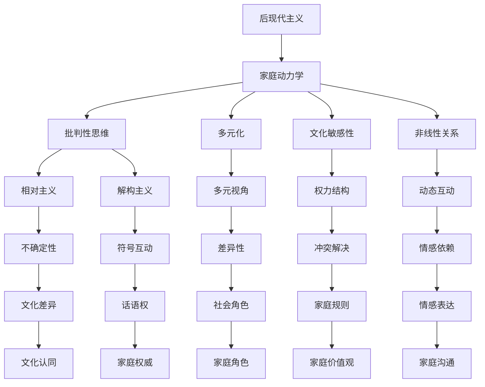

                 


### 概念介绍

**后现代家庭动力学**，顾名思义，是将后现代主义的理论应用到家庭动力学的领域。后现代主义是一种文化、哲学和社会思潮，起源于20世纪中叶，对现代主义进行了批判和反思。后现代家庭动力学关注的是家庭内部成员之间的复杂关系以及这些关系如何动态地影响着家庭的运作和成员的心理健康。

在传统家庭动力学中，家庭被视为一个封闭的系统，家庭成员之间的关系和互动被看作是固定和稳定的。而后现代家庭动力学则认为家庭是一个开放的、动态的、多元的体系。它强调个体的主观经验、文化背景以及权力结构对家庭关系的影响。

### 核心概念与联系

为了更好地理解后现代家庭动力学的核心概念，我们可以用Mermaid流程图来展示它们之间的关系：



这个流程图展示了后现代主义的核心概念如何与家庭动力学相结合，形成了一个多维度的理论框架。

### 核心算法原理讲解

在讲解后现代家庭动力学的核心算法原理时，我们可以通过伪代码来描述这个过程：

```python
# 后现代家庭动力学核心算法伪代码

# 定义家庭成员类
class FamilyMember:
    def __init__(self, name, role, values, beliefs):
        self.name = name
        self.role = role
        self.values = values
        self.beliefs = beliefs
    
    # 成员互动函数
    def interact(self, other):
        # 分析双方价值观和信仰的差异
        value_difference = self.values - other.values
        belief_difference = self.beliefs - other.beliefs
        
        # 计算互动的影响
        impact = value_difference * belief_difference
        
        # 返回互动结果
        return impact

# 初始化家庭成员
family_members = [FamilyMember("Alice", "Parent", [Values], [Beliefs]),
                  FamilyMember("Bob", "Child", [Values], [Beliefs])]

# 进行家庭成员互动
for member1 in family_members:
    for member2 in family_members:
        if member1 != member2:
            result = member1.interact(member2)
            print(f"{member1.name} 和 {member2.name} 互动结果：{result}")
```

这段伪代码定义了一个家庭成员类，包括成员的姓名、角色、价值观和信仰。每个成员之间进行互动时，会计算他们价值观和信仰的差异，并返回互动的影响。

### 数学模型和公式

为了更好地理解后现代家庭动力学中的关系平衡，我们可以引入一个简单的数学模型。假设家庭内部每个成员的影响力可以用一个向量来表示，向量的大小和方向代表成员的价值观和信仰的强度和倾向。

$$
\vec{F}_i = \left| \vec{V}_i \right| \cdot \cos(\theta_i)
$$

其中，$\vec{F}_i$表示成员$i$的影响力，$\vec{V}_i$表示成员$i$的价值观向量，$\theta_i$表示成员$i$的价值观向量与基准向量的夹角。

家庭整体的影响力可以通过所有成员影响力的矢量和来表示：

$$
\vec{F}_{total} = \sum_{i=1}^{n} \vec{F}_i
$$

家庭关系的平衡状态可以通过比较家庭整体影响力和单个成员的影响力来确定：

$$
\delta_i = \vec{F}_{total} - \vec{F}_i
$$

其中，$\delta_i$表示成员$i$与家庭整体影响力之间的差异。如果$\delta_i \approx 0$，则可以认为家庭关系处于平衡状态。

### 举例说明

假设有一个家庭，包括父母和两个孩子。我们可以用以下向量来表示他们的价值观：

$$
\vec{V}_1 = \begin{pmatrix}
1 \\
0 \\
0
\end{pmatrix}, \quad \vec{V}_2 = \begin{pmatrix}
0 \\
1 \\
0
\end{pmatrix}, \quad \vec{V}_3 = \begin{pmatrix}
0 \\
0 \\
1
\end{pmatrix}, \quad \vec{V}_4 = \begin{pmatrix}
0.5 \\
0.5 \\
0
\end{pmatrix}
$$

假设父母和孩子们的价值观向量与基准向量（$\vec{V}_{base} = \begin{pmatrix}
1 \\
1 \\
1
\end{pmatrix}$）的夹角分别为$\theta_1 = 30^\circ$，$\theta_2 = 45^\circ$，$\theta_3 = 60^\circ$，$\theta_4 = 15^\circ$。

计算每个成员的影响力：

$$
\vec{F}_1 = \left| \vec{V}_1 \right| \cdot \cos(\theta_1) = 1 \cdot \cos(30^\circ) = 0.866
$$

$$
\vec{F}_2 = \left| \vec{V}_2 \right| \cdot \cos(\theta_2) = 1 \cdot \cos(45^\circ) = 0.707
$$

$$
\vec{F}_3 = \left| \vec{V}_3 \right| \cdot \cos(\theta_3) = 1 \cdot \cos(60^\circ) = 0.5
$$

$$
\vec{F}_4 = \left| \vec{V}_4 \right| \cdot \cos(\theta_4) = 0.5 \cdot \cos(15^\circ) = 0.433
$$

计算家庭整体影响力：

$$
\vec{F}_{total} = \sum_{i=1}^{4} \vec{F}_i = 0.866 + 0.707 + 0.5 + 0.433 = 2.536
$$

计算每个成员与家庭整体影响力之间的差异：

$$
\delta_1 = \vec{F}_{total} - \vec{F}_1 = 2.536 - 0.866 = 1.670
$$

$$
\delta_2 = \vec{F}_{total} - \vec{F}_2 = 2.536 - 0.707 = 1.829
$$

$$
\delta_3 = \vec{F}_{total} - \vec{F}_3 = 2.536 - 0.5 = 2.036
$$

$$
\delta_4 = \vec{F}_{total} - \vec{F}_4 = 2.536 - 0.433 = 2.103
$$

根据差异值，我们可以判断家庭关系的状态。如果所有差异值接近于0，则家庭关系处于平衡状态。在这个例子中，差异值并不均匀，这意味着家庭关系可能存在一些不平衡。

### 结论

通过上述分析，我们可以看到后现代家庭动力学是如何将后现代主义的核心概念应用到家庭动力学的领域。它提供了一个多维度的理论框架，帮助理解家庭内部成员之间的复杂关系和动态变化。通过数学模型和算法原理的讲解，我们可以更深入地了解家庭关系的平衡艺术。在实际应用中，这些理论和方法可以帮助家庭咨询师和心理学家更好地帮助家庭解决内部冲突，建立更加和谐的关系。

在接下来的章节中，我们将进一步探讨多元关系中的平衡艺术，以及如何通过家庭研讨会来实践这些理论。敬请期待！

