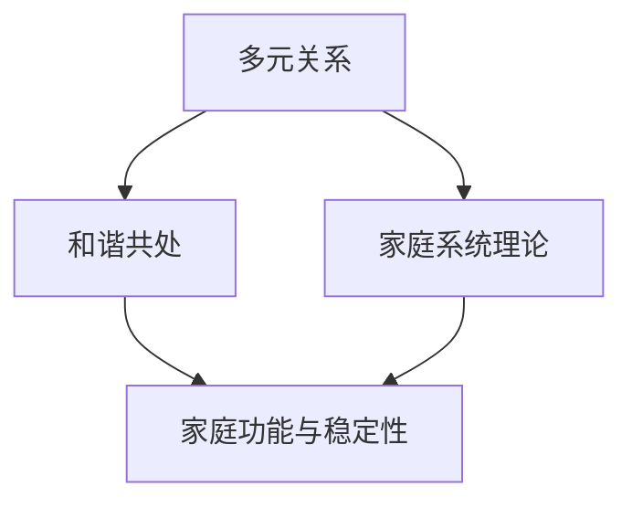
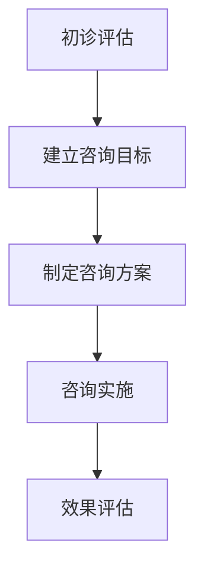

                 


### 《后现代家庭咨询：多元关系中的和谐共处》

#### 关键词：
- 后现代家庭咨询
- 多元关系
- 和谐共处
- 家庭系统理论
- 情绪焦点技术
- 认知行为技术

#### 摘要：
本文旨在探讨后现代家庭咨询在多元关系中的和谐共处策略。通过介绍后现代家庭咨询的理论基础，分析多元关系的概念与处理方法，以及探讨和谐共处的实践技巧，本文为家庭咨询领域提供了新的视角和方法。同时，通过案例分析，本文展示了后现代家庭咨询在实际应用中的效果，为家庭咨询实践提供了有益的参考。

---

### 引言

在现代社会的快速变迁中，家庭关系日益复杂化，传统家庭模式面临诸多挑战。后现代家庭咨询应运而生，旨在应对多元关系中的和谐共处问题。本文将从后现代家庭咨询的背景与意义、多元关系的定义与分类、和谐共处的理念与目标三个方面，逐步探讨这一领域的重要性和实践策略。

### 后现代家庭咨询的理论基础

#### 后现代主义的起源与发展

后现代主义起源于20世纪中叶，是对现代主义的一种批判和反思。其核心观点包括对绝对真理的质疑、对权威的解构、对多元文化的认可等。这些观点为家庭咨询领域提供了新的视角，使咨询师能够更加灵活地处理家庭中的多元关系。

#### 后现代主义与家庭咨询的关系

后现代主义理念在家庭咨询中的应用，主要体现在对家庭系统思维的重视。家庭系统思维强调家庭作为一个整体的互动关系，而不是简单地关注个体成员的心理健康。这种思维模式有助于咨询师全面了解家庭中的多元关系，从而提供更加有效的咨询服务。

#### 家庭系统的基本理论

家庭系统的基本理论包括家庭界限、家庭角色、家庭规则等。这些理论构成了家庭咨询的核心框架，帮助咨询师理解和分析家庭中的问题，并制定相应的解决方案。

### 多元关系的分析

#### 多元关系的定义与分类

多元关系包括内部多元关系（如夫妻关系、亲子关系等）和外部多元关系（如亲戚关系、朋友关系等）。这些关系构成了家庭咨询中的重要内容，需要咨询师进行深入分析。

#### 多元关系中的冲突与解决

冲突是家庭中常见的问题，包括情感冲突、价值观冲突等。咨询师需要了解冲突的类型与表现，并运用合适的策略进行解决，以促进家庭和谐共处。

### 后现代家庭咨询的方法与技术

#### 家庭咨询的基本流程

家庭咨询的基本流程包括初诊评估、咨询方案制定、咨询实施和效果评估等。每个环节都需要咨询师具备专业的知识和技能，以确保咨询服务的质量和效果。

#### 咨询技术的应用

后现代家庭咨询中常用的技术包括认知行为技术和情绪焦点技术。这些技术有助于咨询师帮助家庭成员识别和改变不良的思维和行为模式，从而改善家庭关系。

### 多元关系中的和谐共处策略

#### 和谐共处的原则

和谐共处的原则包括尊重差异、建立信任、沟通与合作等。这些原则为家庭成员提供了相处的基本准则，有助于减少冲突，增进相互理解。

#### 和谐共处的实践技巧

实践技巧包括倾听、表达、沟通技巧等。这些技巧有助于家庭成员更好地理解彼此，建立积极的互动关系，从而实现和谐共处。

### 特殊情境下的家庭咨询

#### 单亲家庭

单亲家庭面临的挑战主要包括经济压力、情感支持不足等。咨询师需要针对这些挑战，提供专业的咨询服务，帮助单亲家庭成员应对困难，实现自我成长。

#### 同性恋家庭

同性恋家庭在传统社会中的地位相对较低，面临更多的歧视和挑战。咨询师需要具备敏感性和专业性，为同性恋家庭提供平等、尊重的咨询服务。

### 案例分析

#### 案例一：单亲母亲的困扰

案例分析展示了咨询师如何帮助单亲母亲解决子女教育、情感支持等问题，实现家庭和谐共处。

#### 案例二：同性恋家庭的认同问题

案例分析探讨了咨询师如何帮助同性恋家庭克服社会歧视，建立积极的家庭关系。

### 总结与展望

本文从后现代家庭咨询的背景与意义、多元关系的分析、和谐共处策略等方面，系统地介绍了后现代家庭咨询的理论和实践。未来，随着社会的不断发展，后现代家庭咨询将在家庭关系中发挥更加重要的作用。

### 附录

#### 附录A：相关资源与工具介绍

介绍后现代家庭咨询相关的书籍、期刊、网络资源等。

#### 附录B：参考文献

列出本文引用的主要文献，以供读者进一步学习和参考。

---

**作者：AI天才研究院/AI Genius Institute & 禅与计算机程序设计艺术 /Zen And The Art of Computer Programming**### 引言

在现代社会的快速变迁中，家庭关系日益复杂化，传统家庭模式面临诸多挑战。后现代家庭咨询应运而生，旨在应对多元关系中的和谐共处问题。本文将从后现代家庭咨询的背景与意义、多元关系的定义与分类、和谐共处的理念与目标三个方面，逐步探讨这一领域的重要性和实践策略。

#### 背景介绍

随着全球化的进程和社会文化的多元化，家庭结构和关系模式也在发生深刻变化。传统的“核心家庭”逐渐被多元化的家庭形态所取代，例如单亲家庭、再婚家庭、同性恋家庭等。这些新的家庭形态带来了前所未有的挑战，传统的家庭咨询模式已经难以应对现代家庭的复杂需求。

后现代家庭咨询正是在这种背景下发展起来的。它强调对家庭关系的全面理解，不仅仅关注家庭内部的情感冲突和问题解决，还关注家庭与外部环境的关系，以及家庭成员个体的心理需求。后现代家庭咨询的核心在于尊重家庭成员的多样性，理解他们的情感和经历，并通过咨询帮助他们建立更加和谐的家庭关系。

#### 核心概念与联系

在后现代家庭咨询中，核心概念包括多元关系、和谐共处和家庭系统理论。这些概念之间存在着紧密的联系，共同构成了家庭咨询的理论基础。

- **多元关系**：多元关系指的是家庭内部和外部复杂的社交网络。家庭内部关系包括夫妻关系、亲子关系、兄弟姐妹关系等；外部关系则包括亲戚关系、朋友关系、社区关系等。这些关系相互作用，共同影响着家庭的功能和稳定性。

- **和谐共处**：和谐共处是家庭咨询的目标，指的是家庭成员之间能够相互尊重、理解和支持，共同面对生活中的挑战。和谐共处不仅仅是一种状态，更是一种动态的过程，需要家庭成员不断地沟通和调整。

- **家庭系统理论**：家庭系统理论是后现代家庭咨询的重要理论基础。该理论认为家庭是一个系统，系统中的每个成员都是相互关联的。家庭成员的行为和情感都会影响到整个家庭系统的运作。因此，咨询师需要从系统的角度来理解家庭问题，而不是仅仅关注个体成员。

以下是一个简化的Mermaid流程图，展示了这些核心概念之间的关系：



在这个流程图中，多元关系和家庭系统理论共同支撑着和谐共处的目标。家庭系统理论提供了一个分析家庭问题的框架，而多元关系则提供了具体的情境和内容。通过这两个核心概念的结合，咨询师可以更全面地理解和处理家庭中的复杂问题。

### 多元关系的定义与分类

在家庭咨询中，多元关系的处理是关键环节。所谓多元关系，是指家庭成员之间以及家庭成员与外部社会环境之间的复杂社交网络。这些关系可以是亲密的，如夫妻关系、亲子关系；也可以是疏远的，如亲戚关系、朋友关系。多元关系的定义不仅仅局限于家庭内部的互动，还包括家庭成员与外部环境的互动，如社区、学校、工作场所等。

#### 内部多元关系

内部多元关系主要指家庭内部成员之间的互动。根据家庭结构的不同，内部多元关系可以分为以下几种：

1. **夫妻关系**：夫妻关系是家庭的核心，直接影响到家庭稳定性和成员的情感健康。夫妻关系的处理需要平衡双方的需求和期望，建立良好的沟通和信任。

2. **亲子关系**：亲子关系是家庭中的另一个重要关系，涉及到父母与子女之间的互动。良好的亲子关系有助于子女的成长和发展，反之则可能导致子女的情感和行为问题。

3. **兄弟姐妹关系**：兄弟姐妹关系对家庭成员的社交能力和情感发展有着重要影响。兄弟姐妹之间的互动可以促进情感交流和团队精神的培养。

#### 外部多元关系

外部多元关系主要指家庭与外部社会环境之间的互动。这些关系对家庭的功能和稳定性也有着重要影响，包括：

1. **亲戚关系**：亲戚关系包括祖父母、叔叔阿姨、堂兄弟姐妹等。亲戚之间的互动可以提供情感支持和社会资源，但也可能带来冲突和压力。

2. **朋友关系**：朋友关系是家庭成员与社会其他成员之间的桥梁，有助于家庭成员融入社区和社会。朋友关系的好坏直接影响到家庭成员的心理健康和社交能力。

3. **社区关系**：社区关系包括家庭成员与邻居、社区组织等的互动。良好的社区关系可以增强家庭成员的社会归属感和安全感。

#### 多元关系中的冲突与解决

多元关系中的冲突是家庭咨询中的常见问题。冲突的原因多种多样，包括价值观的差异、利益的冲突、沟通不畅等。有效的冲突解决策略有助于缓解紧张关系，促进家庭和谐共处。

1. **认知行为技术**：认知行为技术强调通过改变家庭成员的认知和行为来处理冲突。例如，咨询师可以帮助家庭成员识别和调整负面思维模式，从而改善冲突。

2. **情绪焦点技术**：情绪焦点技术关注家庭成员的情感体验，帮助他们在冲突中保持冷静和理性。咨询师可以通过情感表达和情绪调节技巧，帮助家庭成员缓解情绪压力。

3. **沟通技巧**：有效的沟通是解决冲突的重要手段。咨询师可以教授家庭成员沟通技巧，如积极倾听、表达感受、避免指责等，从而改善沟通质量。

通过以上策略，咨询师可以帮助家庭成员理解和处理多元关系中的冲突，促进家庭和谐共处。

### 后现代家庭咨询的理论基础

后现代家庭咨询的理论基础源于后现代主义哲学。后现代主义强调对绝对真理的质疑，对权威的解构，以及对多元文化的认可。这些理念为家庭咨询提供了新的视角，使得咨询师能够更加灵活地处理家庭中的复杂关系。以下是后现代家庭咨询的几个核心理论基础：

#### 后现代主义的起源与发展

后现代主义起源于20世纪中叶，是对现代主义的一种批判和反思。现代主义强调理性、科学和客观性，而后现代主义则质疑这些理念的普适性和有效性。后现代主义认为，知识是相对的，不存在绝对的真理；社会现象是多元化的，不应以单一的视角来解释。

后现代主义的代表人物包括让-弗朗索瓦·利奥塔（Jean-François Lyotard）、米歇尔·福柯（Michel Foucault）和雅克·德里达（Jacques Derrida）等。他们的理论对后现代家庭咨询产生了深远的影响。

#### 后现代主义的核心观点

1. **相对主义**：后现代主义认为，知识是相对的，不同文化和社会背景下的知识具有差异性。在家庭咨询中，这意味着咨询师不应将某一种家庭模式或关系标准强加给家庭成员，而是应尊重他们的独特性和多样性。

2. **去中心化**：后现代主义主张去中心化，即不再将权力和权威集中在某个中心点上。在家庭咨询中，去中心化的理念意味着咨询师应尊重家庭成员的自主性和独立性，而不是将他们视为问题解决的被动对象。

3. **多元文化**：后现代主义强调多元文化的存在和重要性。在家庭咨询中，咨询师应认识到家庭文化的多样性，尊重不同文化背景下的家庭价值观和习俗，并在咨询过程中充分体现这种多样性。

#### 后现代主义与家庭咨询的关系

后现代主义理念在家庭咨询中的应用，主要体现在对家庭系统思维的重视。家庭系统思维认为，家庭是一个整体，家庭成员之间的关系和互动是相互依赖、相互影响的。这种思维模式有助于咨询师全面了解家庭中的多元关系，从而提供更加个性化的咨询服务。

1. **系统思维**：家庭系统思维强调家庭作为一个整体的互动关系，而不是简单地关注个体成员的心理健康。咨询师需要从系统的角度来理解家庭问题，而不是将问题归咎于某个特定的家庭成员。

2. **生态学视角**：后现代家庭咨询采用生态学视角，认为家庭是处于社会环境中的一个生态系统。咨询师需要关注家庭与外部环境之间的互动，以及这些互动如何影响家庭功能。

3. **过程导向**：后现代家庭咨询强调过程的重要性，而不是仅仅关注结果。咨询师应关注家庭成员在咨询过程中的情感体验和认知变化，以便更好地理解他们的需求。

#### 家庭系统的基本理论

家庭系统的基本理论包括家庭界限、家庭角色、家庭规则等。这些理论构成了家庭咨询的核心框架，帮助咨询师理解和分析家庭中的问题，并制定相应的解决方案。

1. **家庭界限**：家庭界限是指家庭成员之间的界限，包括情感界限、行为界限和责任界限等。适当的界限有助于家庭成员保持独立性和自主性，同时维持家庭整体的和谐共处。

2. **家庭角色**：家庭角色是指家庭成员在家庭中所承担的角色和责任。角色定义清晰有助于家庭功能的正常运作，避免角色冲突和混乱。

3. **家庭规则**：家庭规则是指家庭成员共同遵守的行为准则。规则有助于维护家庭秩序，增强家庭成员之间的信任和责任感。

通过以上理论基础，后现代家庭咨询为处理多元关系中的和谐共处提供了有力的理论支持。咨询师可以通过这些理论框架，更深入地理解家庭成员的需求和问题，从而提供更加有效的咨询服务。

### 后现代家庭咨询的方法与技术

#### 家庭咨询的基本流程

家庭咨询的基本流程是确保咨询过程有序进行、有效实施的关键。一个典型的家庭咨询流程通常包括以下几个步骤：

1. **初诊评估**：初诊评估是咨询过程的起点，咨询师通过与家庭成员的初次接触，了解家庭的背景、家庭成员的关系状况以及家庭面临的主要问题。这一步骤的目的是建立信任关系，为后续的咨询工作打下基础。

2. **建立咨询目标**：在初诊评估的基础上，咨询师与家庭成员共同制定咨询目标。这些目标应当是具体、可操作的，并且与家庭成员的需求和期望相一致。

3. **制定咨询方案**：咨询方案的制定是咨询过程中的重要环节，包括确定咨询的方法和技术、设定咨询的频率和时间安排等。咨询师应根据家庭成员的具体情况，选择最合适的咨询方法和策略。

4. **咨询实施**：咨询实施阶段是咨询师与家庭成员共同工作，逐步实现咨询目标的过程。在这一阶段，咨询师需要运用各种咨询技术和方法，帮助家庭成员解决问题，提升家庭功能。

5. **效果评估**：效果评估是咨询过程的最后一步，咨询师需要定期评估咨询的效果，并根据评估结果调整咨询方案。效果评估不仅可以帮助家庭成员了解咨询进展，还能为咨询师提供反馈，优化咨询过程。

以下是一个简化的流程图，展示了家庭咨询的基本流程：



#### 咨询技术的应用

在后现代家庭咨询中，咨询师需要运用多种技术和方法，以应对家庭中的复杂问题。以下是两种常用的咨询技术：认知行为技术和情绪焦点技术。

1. **认知行为技术**：

认知行为技术（Cognitive Behavioral Techniques, CBT）是一种广泛应用于心理治疗的技术，强调通过改变思维和行为模式来改善情绪和行为问题。在家庭咨询中，认知行为技术可以帮助家庭成员识别和调整负面思维模式，从而缓解冲突和压力。

**核心算法原理讲解**：

认知行为技术的核心算法包括以下几个步骤：

- **识别负面思维**：咨询师帮助家庭成员识别和记录他们的负面思维，例如过度概括、以偏概全等。

- **认知重建**：咨询师与家庭成员一起，通过提问和讨论，帮助家庭成员重新评估负面思维，并形成更积极、理性的认知。

- **行为实验**：咨询师鼓励家庭成员将新的认知应用到实际生活中，通过行为实验来验证认知的有效性。

以下是一个简化的伪代码，展示了认知行为技术的算法原理：

```python
def cognitive_reconstruction(thoughts):
    for thought in thoughts:
        if is_negative(thought):
            new_thought = reframe_thought(thought)
            apply_new_thought(new_thought)

def reframe_thought(thought):
    # 根据具体情况重新构建思维
    return new_thought

def is_negative(thought):
    # 判断思维是否为负面思维
    return thought.includes_negative_words()

def apply_new_thought(new_thought):
    # 将新的思维应用到实际生活中
    # 例如，通过日记记录或日常练习来验证思维的有效性
    pass
```

2. **情绪焦点技术**：

情绪焦点技术（Emotion-Focused Therapy, EFT）是一种以情感为核心的咨询方法，旨在帮助个体和家庭成员识别、理解和处理负面情绪。在家庭咨询中，情绪焦点技术可以帮助家庭成员更好地理解和表达情感，从而改善家庭关系。

**核心算法原理讲解**：

情绪焦点技术的核心算法包括以下几个步骤：

- **情感探索**：咨询师引导家庭成员探索他们的情感体验，包括情感的来源、情感的影响等。

- **情感调节**：咨询师帮助家庭成员学习和实践情感调节技巧，如呼吸练习、身体放松等，以减轻负面情绪的影响。

- **情感表达**：咨询师鼓励家庭成员开放地表达自己的情感，通过倾听和反馈，增强家庭成员之间的情感理解和沟通。

以下是一个简化的伪代码，展示了情绪焦点技术的算法原理：

```python
def emotion_focused_therapy():
    explore_emotions()
    regulate_emotions()
    express_emotions()

def explore_emotions():
    # 引导家庭成员探索情感体验
    pass

def regulate_emotions():
    # 帮助家庭成员学习和实践情感调节技巧
    pass

def express_emotions():
    # 鼓励家庭成员开放地表达情感
    pass
```

通过认知行为技术和情绪焦点技术，咨询师可以帮助家庭成员识别和处理负面思维和情绪，从而改善家庭关系，实现和谐共处。

### 多元关系中的和谐共处策略

在多元关系中实现和谐共处，是家庭咨询的重要目标之一。和谐共处不仅需要家庭成员之间的相互理解和尊重，还需要一系列具体的策略和技巧。以下是几个关键策略：

#### 和谐共处的原则

1. **尊重差异**：家庭成员来自不同的背景，拥有不同的价值观和观点。尊重差异意味着接纳家庭成员的独特性，而不是试图改变他们。这有助于减少冲突，增进相互理解。

2. **建立信任**：信任是和谐共处的基石。家庭成员之间需要建立相互信任的关系，这样才能在冲突中保持冷静和理性。建立信任可以通过坦诚的沟通、履行承诺和相互支持来实现。

3. **沟通与合作**：有效的沟通和合作是和谐共处的重要手段。家庭成员需要学会倾听和表达，理解彼此的需求和感受。合作意味着共同面对问题，分担责任，共同寻找解决方案。

#### 和谐共处的实践技巧

1. **倾听**：倾听是沟通的重要部分。有效的倾听不仅仅是听对方说什么，还包括理解对方的情感和需求。倾听的技巧包括保持专注、避免打断对方、表达理解和同情等。

2. **表达**：表达技巧是家庭成员在沟通中传递自己情感和需求的重要方式。表达时需要具体、清晰，避免使用指责和攻击性的语言。例如，可以说“我感到沮丧，因为...”，而不是“你让我很生气”。

3. **解决冲突**：冲突是家庭中不可避免的。有效的冲突解决策略包括冷静下来、识别问题、寻找共同点、提出解决方案等。咨询师可以提供相关的策略和方法，帮助家庭成员更好地处理冲突。

4. **建立边界**：边界是保护家庭成员个体性和独立性的重要手段。建立适当的边界可以减少不必要的冲突，保护家庭成员的隐私和安全感。边界可以是情感上的，如保持个人空间；也可以是行为上的，如设定家庭规则。

#### 案例展示

以下是一个家庭咨询中的案例，展示了如何通过和谐共处策略改善家庭关系：

**案例背景**：一个三口之家，父亲是一名工作繁忙的工程师，母亲是一名家庭主妇，孩子是一名中学生。由于父亲的工作繁忙，家庭沟通较少，导致家庭成员之间存在误解和冲突。

**咨询过程**：

1. **初诊评估**：咨询师与家庭成员进行初诊评估，了解家庭背景和存在的问题。发现家庭成员之间缺乏有效沟通，导致情感疏离和冲突。

2. **建立目标**：咨询师与家庭成员共同制定咨询目标，包括改善家庭沟通、增强家庭成员之间的理解和信任。

3. **制定方案**：咨询师制定了详细的咨询方案，包括家庭沟通技巧培训、情感表达练习和冲突解决策略。

4. **咨询实施**：

   - **倾听与表达**：咨询师教授家庭成员倾听和表达的技巧，通过角色扮演和模拟练习，帮助家庭成员学会更有效地沟通。

   - **情感调节**：咨询师引导家庭成员学习情感调节技巧，如深呼吸、身体放松等，以减轻负面情绪的影响。

   - **冲突解决**：咨询师提供冲突解决的策略，如冷静下来、识别问题、寻找共同点等，帮助家庭成员更好地处理冲突。

5. **效果评估**：咨询师定期与家庭成员进行效果评估，了解咨询进展和家庭成员的感受。根据评估结果，调整咨询方案，确保咨询目标的实现。

通过这个案例，我们可以看到和谐共处策略在改善家庭关系中的重要作用。家庭成员通过学习和实践沟通技巧、情感调节和冲突解决策略，逐步建立了更加健康和和谐的家庭关系。

### 特殊情境下的家庭咨询

在家庭咨询实践中，特殊情境下的家庭咨询需求日益增加，如单亲家庭和同性恋家庭。这些家庭面临的挑战和需求与传统家庭有所不同，需要咨询师具备特殊的敏感性和专业知识。

#### 单亲家庭

单亲家庭通常由一个父母独自抚养子女，面临诸多挑战，如经济压力、情感支持不足和心理问题等。咨询师在为单亲家庭提供咨询时，需要关注以下几个方面：

1. **经济支持**：咨询师可以提供资源和建议，帮助单亲家庭寻找经济支持渠道，如政府补贴、社区资源等。

2. **情感支持**：单亲家庭成员常常感到孤独和无助，咨询师需要提供情感支持，帮助他们建立良好的支持系统。

3. **心理问题**：单亲家庭中的孩子可能面临适应问题、情感困扰和学业压力等，咨询师可以通过心理辅导帮助他们应对这些问题。

4. **家庭角色调整**：单亲家庭需要重新定义家庭角色和责任分配，咨询师可以帮助家庭成员适应新的家庭结构，建立健康的家庭关系。

#### 同性恋家庭

同性恋家庭在传统社会中的地位相对较低，面临更多的歧视和挑战。咨询师在为同性恋家庭提供咨询时，需要关注以下几个方面：

1. **身份认同**：同性恋家庭成员可能面临身份认同问题，咨询师需要提供一个安全的环境，帮助他们表达自己的身份，并接受自己的身份。

2. **家庭冲突**：同性恋家庭可能面临来自家庭内部的冲突和压力，咨询师需要帮助家庭成员理解和尊重彼此的差异，减少冲突。

3. **社会支持**：同性恋家庭可能需要额外的社会支持，咨询师可以提供相关资源，帮助他们建立社会支持网络。

4. **教育信息**：咨询师可以提供关于同性恋家庭的教育信息，帮助家庭成员更好地理解同性恋家庭的特点和需求。

通过为单亲家庭和同性恋家庭提供专业的咨询，咨询师可以帮助他们克服特殊情境下的挑战，建立更加健康和和谐的家庭关系。

### 案例分析

#### 案例一：单亲母亲的困扰

**案例背景**：王女士是一名单亲母亲，独自抚养两个孩子。由于工作繁忙，她经常感到疲惫和压力，导致家庭沟通减少，孩子出现适应问题和学业压力。

**咨询过程**：

1. **初诊评估**：咨询师与王女士进行初诊评估，了解她的生活状态、工作压力和家庭情况。发现王女士在家庭沟通和情感支持方面存在困难。

2. **建立目标**：咨询师与王女士共同制定咨询目标，包括改善家庭沟通、减轻心理压力和提高生活质量。

3. **制定方案**：

   - **时间管理**：咨询师帮助王女士制定时间管理计划，合理安排工作和家庭时间，提高效率。

   - **情感表达**：咨询师教授王女士情感表达技巧，帮助她更好地与孩子沟通，表达自己的情感和需求。

   - **心理辅导**：咨询师定期与王女士进行心理辅导，帮助她减轻压力，提高心理韧性。

4. **咨询实施**：

   - **时间管理**：王女士开始实施时间管理计划，减少了工作上的压力，有更多时间陪伴孩子。

   - **情感表达**：王女士通过情感表达技巧，与孩子建立了更好的沟通，孩子逐渐减少了对母亲的依赖，提高了自信心。

   - **心理辅导**：王女士的心理状态得到改善，她能够更积极地面对生活中的挑战。

5. **效果评估**：咨询师定期与王女士进行效果评估，发现她的生活质量有所提高，家庭关系得到改善。

**结果与反思**：通过咨询，王女士学会了有效的时间管理和情感表达技巧，改善了家庭关系，提高了生活质量。这个案例展示了单亲家庭在面临困难时，通过专业咨询的帮助，可以实现积极的变化。

#### 案例二：同性恋家庭的认同问题

**案例背景**：李先生和李女士是一对同性恋伴侣，他们收养了一个孩子。由于社会对同性恋家庭的歧视，他们面临着来自家庭和社会的巨大压力。

**咨询过程**：

1. **初诊评估**：咨询师与李先生和李女士进行初诊评估，了解他们的生活状态、家庭关系和社会压力。发现他们在身份认同和家庭支持方面存在困难。

2. **建立目标**：咨询师与李先生和李女士共同制定咨询目标，包括提高身份认同、改善家庭关系和建立社会支持网络。

3. **制定方案**：

   - **身份认同**：咨询师提供一个安全的环境，帮助李先生和李女士表达自己的身份，并接受自己的身份。

   - **家庭支持**：咨询师帮助李先生和李女士与孩子进行有效沟通，建立相互信任和支持的家庭关系。

   - **社会支持**：咨询师提供相关资源，帮助他们建立社会支持网络，如同性恋家庭组织、社区中心等。

4. **咨询实施**：

   - **身份认同**：李先生和李女士逐渐接受了自己的身份，开始积极参与同性恋社区的活动。

   - **家庭支持**：李先生和李女士与孩子建立了更好的沟通，孩子逐渐理解和接受了他们的身份。

   - **社会支持**：李先生和李女士建立了广泛的社会支持网络，减轻了来自外部的压力。

5. **效果评估**：咨询师定期与李先生和李女士进行效果评估，发现他们的身份认同和家庭关系得到了改善，生活质量有所提高。

**结果与反思**：通过咨询，李先生和李女士学会了如何应对社会压力，提高了身份认同和家庭支持。这个案例展示了同性恋家庭在面对社会歧视时，通过专业咨询的帮助，可以实现积极的转变。

### 总结与展望

本文系统地介绍了后现代家庭咨询的理论基础、方法与技术，以及多元关系中的和谐共处策略。在后现代家庭咨询中，咨询师需要具备广泛的理论知识和实践经验，能够灵活应对家庭中的复杂问题。

#### 未来发展趋势

随着社会的不断变化，后现代家庭咨询将继续发展。未来，咨询师需要关注以下几个方面：

1. **技术融合**：随着科技的进步，家庭咨询将更多地融入新技术，如虚拟现实、人工智能等，提供更加个性化和有效的咨询服务。

2. **跨学科合作**：家庭咨询需要跨学科合作，如心理学、社会学、医学等，以提供更全面和深入的服务。

3. **多元文化视角**：随着全球化的进程，咨询师需要具备多元文化视角，能够理解和尊重不同文化背景下的家庭需求。

#### 挑战与机遇

未来，后现代家庭咨询将面临诸多挑战，如社会歧视、家庭冲突的复杂性等。然而，这些挑战也带来了机遇。通过不断创新和提升服务质量，咨询师可以更好地满足家庭需求，推动家庭咨询的发展。

#### 对读者的寄语

希望本文能为家庭咨询领域的研究者、从业者以及关注家庭问题的读者提供有益的参考。在多元关系中的和谐共处，不仅需要家庭成员的努力，更需要专业咨询师的引导和支持。让我们一起努力，为创建更加和谐的家庭环境而奋斗。

### 附录

#### 附录A：相关资源与工具介绍

1. **书籍**：
   - 《家庭咨询技术》（Family Counseling Techniques）——提供了丰富的家庭咨询方法和技术。
   - 《后现代家庭咨询》（Postmodern Family Counseling）——详细介绍了后现代家庭咨询的理论和实践。

2. **期刊**：
   - 《家庭研究期刊》（Journal of Family Studies）——发表有关家庭咨询、家庭关系研究的最新成果。

3. **网络资源**：
   - 家庭咨询协会（American Association for Family Therapy）——提供专业培训和资源。
   - 同性恋家庭资源中心（Lesbian Gay Bisexual Transgender Family Resource Center）——提供同性恋家庭相关的咨询和支持。

#### 附录B：参考文献

1. Lyotard, J. F. (1984). The Postmodern Condition: A Report on Knowledge. Manchester University Press.
2. Foucault, M. (1975). The Birth of the Clinic: An Archaeology of Medical Perception. Pantheon Books.
3. Derrida, J. (1976). Of Grammatology. Johns Hopkins University Press.
4. Minuchin, S. (1974). Families and Family Therapy: Clinical Theories and Techniques. Harvard University Press.
5. Linehan, M. M. (1993). Cognitive-Behavioral Treatment of Borderline Personality Disorder. The Guilford Press.
6. Greenberg, L. S., & Piontek, C. A. (2016). Emotion-Focused Therapy for Complex Trauma: Promoting Resilience and Empowerment. Routledge.

